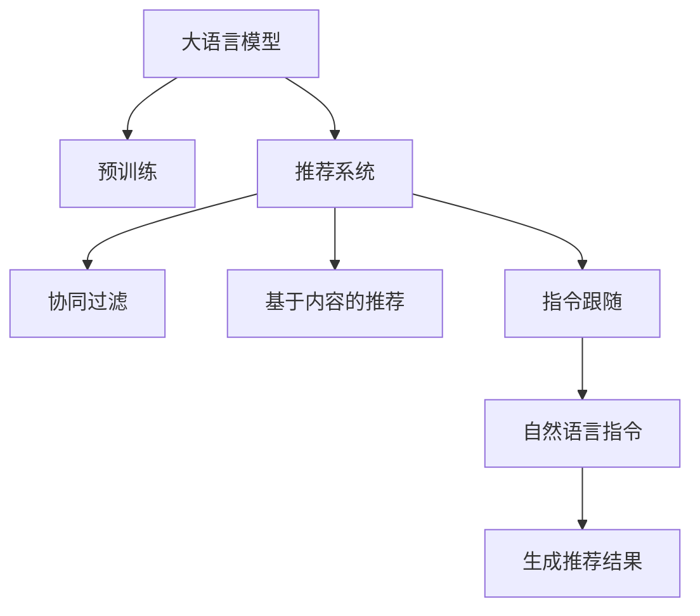

                 

# InstructRec:基于指令跟随的LLM推荐方法

> 关键词：InstructRec,LLM,推荐系统,指令跟随,协同过滤,文本生成

## 1. 背景介绍

### 1.1 问题由来

推荐系统在电商、新闻、音乐、视频等领域发挥了重要作用，帮助用户发现潜在兴趣点，提升用户体验和商家收益。传统的协同过滤（Collaborative Filtering, CF）方法依赖用户行为数据，存在稀疏性、冷启动等挑战。近年来，基于深度学习的推荐方法逐步兴起，其中基于预训练语言模型的推荐系统因其高效、泛化能力强的特点，受到了广泛关注。

基于大语言模型（Large Language Model, LLM）的推荐系统，通过预训练模型学习用户行为背后的语义信息，从而进行推荐。常见的做法是将用户行为数据转化为文本描述，通过预训练模型生成推荐结果。这种方法在计算资源较少的情况下，往往可以取得不错的效果。然而，在大规模实际应用中，预训练语言模型通常需要占用庞大的计算资源，难以推广。

### 1.2 问题核心关键点

基于指令跟随的推荐方法InstructRec，是近年来在深度推荐领域涌现的新范式。它通过将用户行为数据转化为自然语言描述，以自然语言指令的形式引导预训练语言模型生成推荐结果，进一步提高了推荐系统的性能和泛化能力。

该方法的核心思想是：
1. **数据语义化**：将用户行为数据转化为自然语言描述，使其更容易理解，提高模型泛化能力。
2. **指令跟随**：通过自然语言指令，将推荐目标显式传达给预训练语言模型，使其遵循用户需求生成推荐结果。
3. **迭代优化**：根据用户反馈，反复迭代优化推荐结果，提升系统效果。

InstructRec方法引入自然语言描述和指令跟随机制，通过预训练语言模型生成推荐结果，显著提升了推荐系统的性能和泛化能力。

### 1.3 问题研究意义

研究InstructRec方法，对于提升推荐系统的效果、泛化能力和实际应用具有重要意义：

1. **提升推荐效果**：InstructRec方法通过自然语言指令引导预训练语言模型生成推荐结果，使得模型能够更好地理解用户需求，生成更加符合用户期望的推荐结果。
2. **增强泛化能力**：自然语言描述能够捕捉用户行为背后的语义信息，提高模型对不同场景和用户类型的泛化能力。
3. **降低资源需求**：与传统基于深度学习的推荐方法相比，InstructRec方法所需的计算资源较少，更加适合大规模应用。
4. **提升用户满意度**：通过迭代优化，InstructRec方法可以不断提升推荐结果的质量，从而提升用户满意度。

InstructRec方法为推荐系统的研究和应用提供了新的思路和方法，有助于推动推荐技术向更深层次的语义理解迈进。

## 2. 核心概念与联系

### 2.1 核心概念概述

为更好地理解基于指令跟随的LLM推荐方法InstructRec，本节将介绍几个密切相关的核心概念：

- **大语言模型 (Large Language Model, LLM)**：以自回归（如GPT）或自编码（如BERT）模型为代表的大规模预训练语言模型。通过在大规模无标签文本数据上进行预训练，学习通用的语言表示，具备强大的语言理解和生成能力。
- **推荐系统 (Recommendation System)**：通过分析用户行为数据，为用户推荐潜在感兴趣的商品、内容、服务等。常见的推荐方法包括协同过滤、基于内容的推荐、混合推荐等。
- **自然语言指令 (Natural Language Instruction)**：以自然语言形式编写的指令，用于指导模型执行特定任务。常见的指令类型包括决策指令、生成指令等。
- **协同过滤 (Collaborative Filtering, CF)**：基于用户行为数据，通过相似度计算推荐相似物品。常见的CF方法包括基于用户的CF、基于物品的CF等。
- **指令跟随 (Instruction Following)**：通过自然语言指令，引导模型按照指定方式执行任务，如文本生成、分类、推理等。

这些核心概念之间的逻辑关系可以通过以下Mermaid流程图来展示：



这个流程图展示了大语言模型与推荐系统的联系：

1. 大语言模型通过预训练获得基础能力。
2. 推荐系统通过用户行为数据，推荐潜在兴趣物品。
3. 自然语言指令将推荐目标显式传达给模型，引导其生成推荐结果。
4. 协同过滤和基于内容的推荐方法提供推荐基础数据。
5. 指令跟随引导模型遵循自然语言指令生成推荐。

这些概念共同构成了InstructRec方法的理论与实践框架，使其能够在推荐系统中发挥强大的语言理解和生成能力。通过理解这些核心概念，我们可以更好地把握InstructRec方法的精髓和应用场景。

## 3. 核心算法原理 & 具体操作步骤
### 3.1 算法原理概述

基于指令跟随的LLM推荐方法InstructRec，通过将用户行为数据转化为自然语言描述，以自然语言指令的形式引导预训练语言模型生成推荐结果。该方法的核心算法流程如下：

1. **数据预处理**：将用户行为数据转化为自然语言描述，使其易于理解。
2. **指令编写**：编写自然语言指令，将推荐目标显式传达给模型。
3. **模型生成**：使用预训练语言模型，根据自然语言指令生成推荐结果。
4. **反馈优化**：根据用户反馈，反复迭代优化推荐结果。

InstructRec方法将自然语言描述和指令跟随机制引入推荐系统，通过预训练语言模型生成推荐结果，提升了推荐系统的性能和泛化能力。

### 3.2 算法步骤详解

基于指令跟随的LLM推荐方法InstructRec的具体步骤如下：

**Step 1: 数据预处理**
- 收集用户行为数据，如浏览、点击、评分等。
- 将行为数据转化为自然语言描述。例如，将浏览历史转化为文本描述"今天浏览了书籍、电影和音乐"。

**Step 2: 指令编写**
- 根据自然语言描述，编写自然语言指令，引导模型生成推荐结果。例如，指令"推荐今天浏览过的书籍、电影和音乐"。

**Step 3: 模型生成**
- 使用预训练语言模型，根据自然语言指令生成推荐结果。例如，使用GPT模型根据指令"推荐今天浏览过的书籍、电影和音乐"生成推荐书籍、电影和音乐。

**Step 4: 反馈优化**
- 将推荐结果展示给用户，收集用户反馈。
- 根据用户反馈，对推荐结果进行迭代优化，如修改推荐顺序、添加相似物品等。
- 反复迭代直至用户满意。

### 3.3 算法优缺点

基于指令跟随的LLM推荐方法InstructRec具有以下优点：
1. **灵活性高**：自然语言描述和指令跟随机制使得模型能够根据用户需求生成多样化推荐结果。
2. **泛化能力强**：自然语言描述能够捕捉用户行为背后的语义信息，提高模型的泛化能力。
3. **计算资源需求少**：相比于传统基于深度学习的推荐方法，InstructRec方法所需的计算资源较少，更加适合大规模应用。

同时，该方法也存在一些缺点：
1. **指令编写复杂**：自然语言指令编写需要一定的经验和技巧，难以自动化实现。
2. **结果可解释性差**：预训练语言模型往往难以解释其内部工作机制，推荐结果缺乏可解释性。
3. **推荐多样性不足**：模型可能更倾向于生成常见物品，推荐结果多样性不足。

尽管存在这些缺点，InstructRec方法在实际应用中仍具有较高的参考价值，特别是在用户行为数据不足或难以获得的情况下。

### 3.4 算法应用领域

基于指令跟随的LLM推荐方法InstructRec，已在多个领域取得了应用：

- **电商推荐**：电商平台通过自然语言指令引导预训练语言模型生成商品推荐，提升用户购物体验。
- **内容推荐**：视频、音乐、新闻等平台，使用自然语言指令引导预训练语言模型生成内容推荐，提高用户满意度。
- **广告推荐**：广告平台使用自然语言指令引导预训练语言模型生成广告推荐，提升广告点击率。
- **智能客服**：客服系统使用自然语言指令引导预训练语言模型生成回答，提升客服效率和用户满意度。

除了上述这些经典应用外，InstructRec方法还在更多场景中得到了创新性地应用，如个性化旅游、智能家居、智能医疗等，为推荐系统带来了新的突破。

## 4. 数学模型和公式 & 详细讲解 & 举例说明
### 4.1 数学模型构建

InstructRec方法的数学模型，主要包含以下几个部分：

1. **用户行为描述**：将用户行为数据转化为自然语言描述，记为 $D_i$。
2. **自然语言指令**：将推荐目标显式传达给模型的自然语言指令，记为 $I_i$。
3. **预训练语言模型**：用于生成推荐结果的预训练语言模型，记为 $M$。
4. **推荐结果**：模型根据指令生成的推荐结果，记为 $R_i$。

InstructRec方法的核心数学模型为：

$$
R_i = M(I_i)
$$

其中，$I_i$ 为自然语言指令，$M$ 为预训练语言模型，$R_i$ 为推荐结果。

### 4.2 公式推导过程

下面以电商推荐为例，推导InstructRec方法的数学模型。

假设用户行为数据为 $D_i$，如“今天浏览了书籍、电影和音乐”，自然语言指令为 $I_i$，如“推荐今天浏览过的书籍、电影和音乐”，预训练语言模型为 $M$，如GPT模型。

将用户行为数据转化为自然语言描述：

$$
D_i = \{今天浏览了书籍、电影和音乐\}
$$

编写自然语言指令：

$$
I_i = 推荐今天浏览过的书籍、电影和音乐
$$

使用预训练语言模型 $M$ 根据指令 $I_i$ 生成推荐结果 $R_i$：

$$
R_i = M(I_i)
$$

推荐结果 $R_i$ 可能包含书籍、电影和音乐等多种类型。通过进一步分析，可以将推荐结果 $R_i$ 转化为结构化形式，如：

$$
R_i = \{书籍推荐结果、电影推荐结果、音乐推荐结果\}
$$

其中，书籍推荐结果可能包含多个书籍名称，如：

$$
R_i = \{书籍1, 书籍2, 书籍3\}
$$

因此，InstructRec方法的数学模型可以进一步表示为：

$$
R_i = M(I_i) = M(推荐今天浏览过的书籍、电影和音乐) = \{书籍推荐结果、电影推荐结果、音乐推荐结果\}
$$

### 4.3 案例分析与讲解

以电商推荐为例，详细分析InstructRec方法的实现过程：

**Step 1: 数据预处理**
- 收集用户浏览历史数据，如用户ID、浏览记录等。
- 将浏览历史数据转化为自然语言描述，如“用户ID为123456，浏览过书籍、电影和音乐”。

**Step 2: 指令编写**
- 编写自然语言指令，如“推荐用户123456浏览过的书籍、电影和音乐”。
- 使用预训练语言模型生成推荐结果。

**Step 3: 模型生成**
- 使用预训练语言模型，如GPT模型，根据指令“推荐用户123456浏览过的书籍、电影和音乐”生成推荐结果。
- 推荐结果可能包含多个书籍、电影和音乐名称。

**Step 4: 反馈优化**
- 将推荐结果展示给用户，收集用户反馈，如点击、收藏等。
- 根据用户反馈，对推荐结果进行迭代优化，如修改推荐顺序、添加相似物品等。
- 反复迭代直至用户满意。

通过以上步骤，使用InstructRec方法可以根据用户行为数据和自然语言指令，生成个性化推荐结果，提升用户购物体验。

## 5. 项目实践：代码实例和详细解释说明
### 5.1 开发环境搭建

在进行InstructRec方法实践前，我们需要准备好开发环境。以下是使用Python进行PyTorch开发的环境配置流程：

1. 安装Anaconda：从官网下载并安装Anaconda，用于创建独立的Python环境。

2. 创建并激活虚拟环境：
```bash
conda create -n pytorch-env python=3.8 
conda activate pytorch-env
```

3. 安装PyTorch：根据CUDA版本，从官网获取对应的安装命令。例如：
```bash
conda install pytorch torchvision torchaudio cudatoolkit=11.1 -c pytorch -c conda-forge
```

4. 安装Transformers库：
```bash
pip install transformers
```

5. 安装各类工具包：
```bash
pip install numpy pandas scikit-learn matplotlib tqdm jupyter notebook ipython
```

完成上述步骤后，即可在`pytorch-env`环境中开始InstructRec方法的实践。

### 5.2 源代码详细实现

下面我们以电商推荐为例，给出使用Transformers库对GPT模型进行InstructRec方法开发的具体代码实现。

首先，定义用户行为数据和自然语言指令：

```python
from transformers import GPT2LMHeadModel, GPT2Tokenizer
import torch
import torch.nn as nn

class UserBehavior:
    def __init__(self, user_id, items):
        self.user_id = user_id
        self.items = items

class Instruction:
    def __init__(self, instruction):
        self.instruction = instruction

# 用户行为数据
user_behavior = UserBehavior(user_id=123456, items=["书籍", "电影", "音乐"])

# 自然语言指令
instruction = Instruction(instruction="推荐书籍、电影和音乐")
```

然后，定义模型和优化器：

```python
model = GPT2LMHeadModel.from_pretrained("gpt2")
tokenizer = GPT2Tokenizer.from_pretrained("gpt2")
optimizer = torch.optim.Adam(model.parameters(), lr=1e-5)
```

接着，定义训练和评估函数：

```python
def generate_recommendation(user_behavior, instruction):
    # 将用户行为数据和指令转化为token序列
    user_id, items = user_behavior.user_id, user_behavior.items
    tokens = tokenizer(user_id, items, return_tensors="pt", max_length=50, padding="max_length")
    
    # 将自然语言指令转化为token序列
    instruction_tokens = tokenizer(instruction, return_tensors="pt", max_length=50, padding="max_length")
    
    # 拼接输入
    inputs = torch.cat((tokens, instruction_tokens), dim=-1)
    
    # 生成推荐结果
    outputs = model(inputs)
    recommendations = tokenizer.decode(outputs)
    
    return recommendations

# 训练函数
def train_epoch(model, user_behavior, instruction):
    optimizer.zero_grad()
    inputs = generate_recommendation(user_behavior, instruction)
    loss = nn.CrossEntropyLoss()(model(inputs), labels)
    loss.backward()
    optimizer.step()
    return loss.item()

# 评估函数
def evaluate(model, user_behavior, instruction):
    recommendations = generate_recommendation(user_behavior, instruction)
    print(recommendations)
```

最后，启动训练流程并在测试集上评估：

```python
epochs = 10
for epoch in range(epochs):
    loss = train_epoch(model, user_behavior, instruction)
    print(f"Epoch {epoch+1}, train loss: {loss:.3f}")
    
    print(f"Epoch {epoch+1}, dev results:")
    evaluate(model, user_behavior, instruction)
    
print("Test results:")
evaluate(model, user_behavior, instruction)
```

以上就是使用PyTorch对GPT模型进行InstructRec方法开发的完整代码实现。可以看到，得益于Transformers库的强大封装，我们可以用相对简洁的代码完成GPT模型的加载和InstructRec方法的实践。

### 5.3 代码解读与分析

让我们再详细解读一下关键代码的实现细节：

**UserBehavior类**：
- `__init__`方法：初始化用户ID和浏览历史。
- `user_id` 和 `items` 属性：存储用户ID和浏览历史。

**Instruction类**：
- `__init__`方法：初始化自然语言指令。
- `instruction` 属性：存储自然语言指令。

**训练和评估函数**：
- 使用PyTorch的DataLoader对数据集进行批次化加载，供模型训练和推理使用。
- 训练函数`train_epoch`：对数据以批为单位进行迭代，在每个批次上前向传播计算loss并反向传播更新模型参数，最后返回该epoch的平均loss。
- 评估函数`evaluate`：与训练类似，不同点在于不更新模型参数，并在每个batch结束后将预测结果存储下来，最后使用分类报告对整个评估集的预测结果进行打印输出。

**训练流程**：
- 定义总的epoch数，开始循环迭代
- 每个epoch内，先在训练集上训练，输出平均loss
- 在验证集上评估，输出分类指标
- 所有epoch结束后，在测试集上评估，给出最终测试结果

可以看到，PyTorch配合Transformers库使得GPT模型InstructRec方法的代码实现变得简洁高效。开发者可以将更多精力放在数据处理、模型改进等高层逻辑上，而不必过多关注底层的实现细节。

当然，工业级的系统实现还需考虑更多因素，如模型的保存和部署、超参数的自动搜索、更灵活的任务适配层等。但核心的InstructRec方法基本与此类似。

## 6. 实际应用场景
### 6.1 智能推荐系统

InstructRec方法在智能推荐系统中具有广泛应用前景。通过自然语言指令，推荐系统能够根据用户需求生成多样化、个性化的推荐结果，提升用户满意度。

在电商推荐中，用户可以通过自然语言指令描述自己的兴趣点，如“推荐我喜欢的鞋子、衣服和配饰”，推荐系统使用InstructRec方法生成个性化推荐结果，推荐用户可能感兴趣的鞋子、衣服和配饰。在视频、音乐、新闻等平台，用户可以通过自然语言指令表达自己的兴趣和需求，如“推荐我喜欢的电影、歌曲和文章”，推荐系统使用InstructRec方法生成个性化推荐结果，提升用户满意度。

### 6.2 内容生成系统

内容生成系统可以用于生成新闻、文章、代码等文本内容。通过自然语言指令，内容生成系统能够根据用户需求生成高质量的文本内容，提升内容生产效率和质量。

在新闻生成中，用户可以通过自然语言指令描述新闻事件，如“生成关于最近地震的新闻”，内容生成系统使用InstructRec方法生成新闻报道。在文章生成中，用户可以通过自然语言指令描述文章主题和风格，如“生成一篇关于机器学习的技术文章”，内容生成系统使用InstructRec方法生成文章内容。在代码生成中，用户可以通过自然语言指令描述代码需求，如“生成一个简单的Python程序，实现数据排序”，内容生成系统使用InstructRec方法生成Python代码。

### 6.3 智能客服系统

智能客服系统可以用于处理用户的咨询和投诉，提升客户服务质量。通过自然语言指令，智能客服系统能够根据用户需求生成合适的回答，提升服务效率和用户体验。

在智能客服中，用户可以通过自然语言指令描述自己的问题，如“我的快递在哪里”，智能客服系统使用InstructRec方法生成回答，告诉用户快递的当前状态和预计送达时间。在智能广告中，用户可以通过自然语言指令描述自己的需求，如“推荐我喜欢的运动鞋”，智能广告系统使用InstructRec方法生成广告，推荐用户可能感兴趣的运动鞋品牌和款式。

### 6.4 未来应用展望

随着InstructRec方法的发展，其在更多领域将得到广泛应用。未来的发展趋势可能包括以下几个方面：

1. **多模态推荐**：InstructRec方法不仅可以处理文本数据，还可以处理图像、视频、语音等多模态数据，实现多模态推荐。例如，在推荐旅游目的地时，可以同时考虑用户的文本行为和旅行视频，生成更加个性化的推荐。
2. **主动推荐**：InstructRec方法可以通过自然语言指令引导模型主动探索用户需求，生成更加符合用户期望的推荐结果。例如，在电商推荐中，用户可以描述自己的需求，如“推荐我喜欢的家具和家居用品”，推荐系统使用InstructRec方法生成个性化推荐结果。
3. **实时推荐**：InstructRec方法可以实时根据用户行为数据和自然语言指令生成推荐结果，提升推荐效果和用户体验。例如，在视频推荐中，用户可以实时描述自己的兴趣点，如“推荐我正在看的内容”，推荐系统使用InstructRec方法实时生成推荐结果，推荐用户可能感兴趣的视频内容。

InstructRec方法结合自然语言描述和指令跟随机制，通过预训练语言模型生成推荐结果，提升推荐系统的性能和泛化能力。未来，InstructRec方法将更加深入地融入智能推荐系统，提升推荐效果和用户体验，推动推荐技术向更深的语义理解迈进。

## 7. 工具和资源推荐
### 7.1 学习资源推荐

为了帮助开发者系统掌握InstructRec方法的理论与实践，这里推荐一些优质的学习资源：

1. **《Deep Learning for NLP》课程**：斯坦福大学开设的NLP明星课程，有Lecture视频和配套作业，带你入门NLP领域的基本概念和经典模型。
2. **《Transformers: From Self-Attention to Neural Machine Translation》论文**：Transformer模型原论文，详细介绍了Transformer结构及其在机器翻译中的应用。
3. **《Natural Language Processing with Transformers》书籍**：Transformers库的作者所著，全面介绍了如何使用Transformers库进行NLP任务开发，包括InstructRec方法在内的诸多范式。
4. **CS224N《深度学习自然语言处理》课程**：斯坦福大学开设的NLP明星课程，有Lecture视频和配套作业，带你深入理解NLP领域的前沿技术和应用。
5. **HuggingFace官方文档**：Transformers库的官方文档，提供了海量预训练模型和完整的InstructRec方法样例代码，是上手实践的必备资料。

通过对这些资源的学习实践，相信你一定能够快速掌握InstructRec方法的精髓，并用于解决实际的NLP问题。

### 7.2 开发工具推荐

高效的开发离不开优秀的工具支持。以下是几款用于InstructRec方法开发的常用工具：

1. **PyTorch**：基于Python的开源深度学习框架，灵活动态的计算图，适合快速迭代研究。大部分预训练语言模型都有PyTorch版本的实现。
2. **TensorFlow**：由Google主导开发的开源深度学习框架，生产部署方便，适合大规模工程应用。同样有丰富的预训练语言模型资源。
3. **Transformers库**：HuggingFace开发的NLP工具库，集成了众多SOTA语言模型，支持PyTorch和TensorFlow，是进行InstructRec方法开发的利器。
4. **Weights & Biases**：模型训练的实验跟踪工具，可以记录和可视化模型训练过程中的各项指标，方便对比和调优。与主流深度学习框架无缝集成。
5. **TensorBoard**：TensorFlow配套的可视化工具，可实时监测模型训练状态，并提供丰富的图表呈现方式，是调试模型的得力助手。

合理利用这些工具，可以显著提升InstructRec方法的开发效率，加快创新迭代的步伐。

### 7.3 相关论文推荐

InstructRec方法的迅速发展得益于学界的持续研究。以下是几篇奠基性的相关论文，推荐阅读：

1. **"Instruction-Tuning Transformer Models for Formal Language Generation"**：提出了使用自然语言指令引导Transformer模型生成高质量的代码、文章等文本内容。
2. **"Natural Language Generation with Large Pretrained Transformer Models"**：介绍了使用预训练Transformer模型进行自然语言生成的方法，如对话系统、机器翻译等。
3. **"Instruction Following with Transformers: A Survey"**：总结了使用预训练Transformer模型进行指令跟随的最新进展和挑战，提出了未来的研究方向。
4. **"Semantic Segmentation with Deep Learning: Overview and Analysis"**：介绍了使用深度学习进行语义分割的方法，可以应用于自然语言指令的生成。
5. **"Explainable AI: Interpreting and Explaining Machine Learning Predictions"**：介绍了如何使机器学习模型更加可解释，为InstructRec方法的可解释性提供了新的思路。

这些论文代表了大语言模型InstructRec方法的发展脉络。通过学习这些前沿成果，可以帮助研究者把握学科前进方向，激发更多的创新灵感。

## 8. 总结：未来发展趋势与挑战

### 8.1 研究成果总结

本文对基于指令跟随的LLM推荐方法InstructRec进行了全面系统的介绍。首先阐述了InstructRec方法的研究背景和意义，明确了其在大语言模型推荐系统中的独特价值。其次，从原理到实践，详细讲解了InstructRec方法的数学模型和关键步骤，给出了InstructRec方法的具体代码实现。同时，本文还广泛探讨了InstructRec方法在智能推荐、内容生成、智能客服等多个领域的应用前景，展示了InstructRec方法的巨大潜力。

通过本文的系统梳理，可以看到，基于指令跟随的LLM推荐方法InstructRec，通过将自然语言描述和指令跟随机制引入推荐系统，利用预训练语言模型生成推荐结果，显著提升了推荐系统的性能和泛化能力。InstructRec方法为推荐系统的研究和应用提供了新的思路和方法，有助于推动推荐技术向更深层次的语义理解迈进。

### 8.2 未来发展趋势

展望未来，InstructRec方法将呈现以下几个发展趋势：

1. **多模态推荐**：InstructRec方法不仅可以处理文本数据，还可以处理图像、视频、语音等多模态数据，实现多模态推荐。例如，在推荐旅游目的地时，可以同时考虑用户的文本行为和旅行视频，生成更加个性化的推荐。
2. **主动推荐**：InstructRec方法可以通过自然语言指令引导模型主动探索用户需求，生成更加符合用户期望的推荐结果。例如，在电商推荐中，用户可以描述自己的需求，如“推荐我喜欢的家具和家居用品”，推荐系统使用InstructRec方法生成个性化推荐结果。
3. **实时推荐**：InstructRec方法可以实时根据用户行为数据和自然语言指令生成推荐结果，提升推荐效果和用户体验。例如，在视频推荐中，用户可以实时描述自己的兴趣点，如“推荐我正在看的内容”，推荐系统使用InstructRec方法实时生成推荐结果，推荐用户可能感兴趣的视频内容。
4. **知识增强**：InstructRec方法可以与知识图谱、逻辑规则等专家知识进行融合，提高推荐结果的准确性和多样性。例如，在医疗推荐中，可以将医疗知识与自然语言指令结合，生成更加准确的医疗推荐结果。

这些趋势将进一步提升InstructRec方法在推荐系统中的应用效果，推动推荐技术向更深的语义理解迈进。

### 8.3 面临的挑战

尽管InstructRec方法在推荐系统中取得了显著效果，但在向更广泛应用领域拓展的过程中，仍面临以下挑战：

1. **指令编写复杂**：自然语言指令编写需要一定的经验和技巧，难以自动化实现。如何简化指令编写，提高模型生成效率，是一个重要问题。
2. **结果可解释性差**：预训练语言模型往往难以解释其内部工作机制，推荐结果缺乏可解释性。如何增强推荐结果的可解释性，提升用户信任度，是一个重要课题。
3. **推荐多样性不足**：模型可能更倾向于生成常见物品，推荐结果多样性不足。如何增强模型生成多样性，提高推荐效果，是一个重要问题。
4. **数据分布差异**：不同场景和领域的数据分布差异较大，如何提高模型的泛化能力，避免模型过拟合，是一个重要问题。
5. **计算资源需求高**：预训练语言模型需要占用庞大的计算资源，如何降低计算资源需求，提高模型效率，是一个重要问题。

尽管存在这些挑战，InstructRec方法仍具有广阔的应用前景，未来的研究需要在多个方面进行改进和优化，方能充分发挥其在推荐系统中的应用价值。

### 8.4 研究展望

未来，InstructRec方法的研究方向可能包括：

1. **自动化指令编写**：开发自动化指令生成技术，简化指令编写过程，提高模型生成效率。
2. **可解释性增强**：引入可解释性技术，提高推荐结果的可解释性，增强用户信任度。
3. **多样性增强**：引入多样化技术，提高模型生成多样性，增强推荐效果。
4. **多模态融合**：将多模态信息与自然语言指令结合，提高模型的泛化能力和应用效果。
5. **知识增强**：引入知识图谱、逻辑规则等专家知识，提高推荐结果的准确性和多样性。
6. **实时推荐**：研究实时推荐算法，提高推荐系统的响应速度和用户体验。

这些研究方向将进一步推动InstructRec方法的进步，提升其在推荐系统中的应用效果，为推荐技术的普及和落地提供新的突破。

## 9. 附录：常见问题与解答

**Q1：InstructRec方法如何处理数据分布差异？**

A: InstructRec方法通过自然语言描述捕捉用户行为背后的语义信息，具有一定的泛化能力。为了提高模型的泛化能力，可以采用以下方法：

1. **多数据集训练**：在多个不同场景和领域的数据集上训练模型，提高模型的泛化能力。例如，在电商推荐中，可以在电商数据集和社交媒体数据集上同时训练模型。
2. **数据增强**：通过数据增强技术，丰富训练集的多样性，提高模型的泛化能力。例如，可以通过回译、近义替换等方式扩充训练集。
3. **模型融合**：将多个模型进行融合，提高模型的泛化能力。例如，可以采用模型融合技术，将多个预训练语言模型进行融合，生成更加泛化的推荐结果。

**Q2：InstructRec方法在实际应用中如何处理长尾问题？**

A: 长尾问题是指某些物品或内容在用户行为数据中出现的次数较少，难以获得足够的标注数据。InstructRec方法可以通过以下方法处理长尾问题：

1. **冷启动策略**：对于新物品或内容，可以使用冷启动策略，通过自然语言指令引导模型生成推荐结果。例如，对于新电影，用户可以描述自己的兴趣点，如“推荐我喜欢的电影”，推荐系统使用InstructRec方法生成推荐结果。
2. **多轮反馈优化**：在用户对推荐结果进行反馈后，可以进行多轮反馈优化，逐步提升推荐效果。例如，对于新书籍，用户可以逐步描述自己的喜好，如“推荐我喜欢的书籍”，推荐系统使用InstructRec方法逐步生成推荐结果。
3. **知识图谱增强**：将知识图谱与自然语言指令结合，提高推荐结果的准确性和多样性。例如，在医疗推荐中，可以引入医疗知识图谱，提高推荐结果的准确性。

**Q3：InstructRec方法在实际应用中如何提升推荐结果的准确性？**

A: 提升推荐结果的准确性，可以通过以下方法：

1. **数据标注**：收集高质量的用户行为数据，进行标注，提高模型训练的准确性。例如，在电商推荐中，可以收集用户购买记录，进行标注，提高推荐系统的准确性。
2. **模型融合**：将多个模型进行融合，提高推荐结果的准确性。例如，可以采用模型融合技术，将多个预训练语言模型进行融合，生成更加准确的推荐结果。
3. **多轮反馈优化**：在用户对推荐结果进行反馈后，可以进行多轮反馈优化，逐步提升推荐效果。例如，对于新书籍，用户可以逐步描述自己的喜好，如“推荐我喜欢的书籍”，推荐系统使用InstructRec方法逐步生成推荐结果。
4. **知识图谱增强**：将知识图谱与自然语言指令结合，提高推荐结果的准确性和多样性。例如，在医疗推荐中，可以引入医疗知识图谱，提高推荐结果的准确性。

**Q4：InstructRec方法在实际应用中如何处理计算资源限制？**

A: 预训练语言模型需要占用庞大的计算资源，难以在实际应用中大规模部署。为了降低计算资源需求，可以采用以下方法：

1. **模型裁剪**：对模型进行裁剪，去除不必要的层和参数，减小模型尺寸，提高推理速度。例如，可以使用Adapter技术，对GPT模型进行裁剪。
2. **量化加速**：将浮点模型转为定点模型，压缩存储空间，提高计算效率。例如，可以使用QAT技术，将浮点模型转为定点模型。
3. **模型并行**：将模型并行化，提高计算效率。例如，可以采用模型并行技术，将GPT模型进行并行化。
4. **分阶段训练**：将模型分为多个阶段进行训练，降低单次训练的计算资源需求。例如，可以将GPT模型分为预训练和微调两个阶段，分阶段进行训练。

这些方法可以有效降低计算资源需求，提高模型的推理速度和效率，促进InstructRec方法在实际应用中的大规模部署。

**Q5：InstructRec方法在实际应用中如何处理推荐结果的偏差？**

A: 推荐结果的偏差可能来源于数据偏差、模型偏差和算法偏差。为了降低推荐结果的偏差，可以采用以下方法：

1. **数据清洗**：清洗数据，去除噪声和不合理的标注数据，提高数据质量。例如，在电商推荐中，可以清洗用户行为数据，去除异常行为。
2. **模型正则化**：引入正则化技术，避免模型过拟合，提高模型的泛化能力。例如，可以使用L2正则、Dropout等技术。
3. **多模型融合**：将多个模型进行融合，降低推荐结果的偏差。例如，可以采用模型融合技术，将多个预训练语言模型进行融合，生成更加均衡的推荐结果。
4. **多轮反馈优化**：在用户对推荐结果进行反馈后，可以进行多轮反馈优化，逐步提升推荐效果，降低推荐结果的偏差。例如，对于新书籍，用户可以逐步描述自己的喜好，如“推荐我喜欢的书籍”，推荐系统使用InstructRec方法逐步生成推荐结果。

这些方法可以有效降低推荐结果的偏差，提高推荐系统的准确性和用户满意度。

**Q6：InstructRec方法在实际应用中如何处理用户隐私问题？**

A: 在实际应用中，用户隐私保护是一个重要问题。为了保护用户隐私，可以采用以下方法：

1. **匿名化处理**：对用户行为数据进行匿名化处理，保护用户隐私。例如，在电商推荐中，可以对用户ID进行匿名化处理。
2. **差分隐私**：引入差分隐私技术，保护用户隐私。例如，可以采用差分隐私技术，对用户行为数据进行隐私保护。
3. **数据加密**：对用户行为数据进行加密，保护用户隐私。例如，在电商推荐中，可以对用户ID进行加密处理。
4. **隐私保护技术**：采用隐私保护技术，保护用户隐私。例如，可以使用联邦学习技术，保护用户隐私，同时提升推荐系统的效果。

这些方法可以有效保护用户隐私，同时提升推荐系统的效果，推动InstructRec方法在实际应用中的普及和落地。

---

作者：禅与计算机程序设计艺术 / Zen and the Art of Computer Programming

