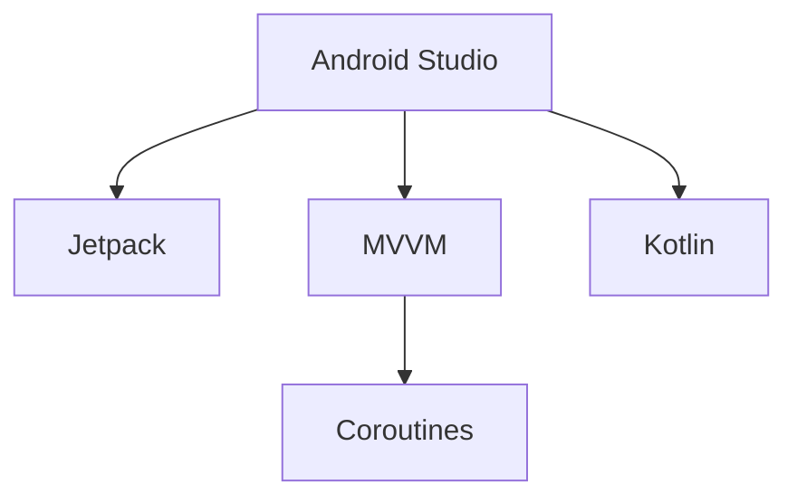

                 

# Kotlin 语言在 Android 开发中的应用：现代化的优势

## 1. 背景介绍

在移动应用开发领域，Android 一直占据着主导地位。由于其开放的平台特性，吸引了大量开发者加入其中。然而，随着技术的发展和应用需求的提升，Android 开发也面临着诸多挑战。传统的 Java 语言虽然成熟稳定，但语法繁琐，难以兼顾性能和开发效率。与此同时，Kotlin 作为一种新兴的编程语言，以其简洁、安全、可互操作等优点，逐渐成为 Android 开发的主流选择。本文将深入探讨 Kotlin 在 Android 开发中的应用，阐述其现代化的优势，并展望未来发展趋势。

## 2. 核心概念与联系

### 2.1 核心概念概述

- **Kotlin**：一种现代的静态类型、通用编程语言，旨在与 Java 无缝互操作，提升代码的可读性和开发效率。
- **Android Studio**：Google 官方提供的 Android 开发工具，集成了 Kotlin 支持。
- **Jetpack**：Google 推出的 Android 应用开发平台，提供了一套组件和工具，简化应用开发流程。
- **MVVM**：Android 开发模式，通过分离数据、业务逻辑、视图的职责，提升应用的响应性能和可维护性。
- **Coroutines**：一种异步编程工具，提供简单的 API 实现协程，替代传统的 AsyncTask。

### 2.2 核心概念原理和架构的 Mermaid 流程图



## 3. 核心算法原理 & 具体操作步骤

### 3.1 算法原理概述

Kotlin 在 Android 开发中的应用主要基于以下几个关键原理：

1. **静态类型检查**：Kotlin 的编译器可以静态检查代码的类型安全性，减少了运行时类型转换的错误。
2. **null 安全**：通过?. 运算符和空安全性检查，避免了 NullPointerException 等常见错误。
3. **可互操作**：Kotlin 与 Java 兼容，可以无缝替换 Java 代码，利用现有的 Java 生态。
4. **简洁语法**：Kotlin 的语法设计更加简洁，减少了冗余代码，提升了开发效率。
5. **函数式编程支持**：Kotlin 提供函数式编程特性，如 lambda 表达式、集合操作等，提升了代码的可读性和可维护性。

### 3.2 算法步骤详解

1. **环境配置**：在 Android Studio 中配置 Kotlin 插件和 SDK，并创建新的 Android 项目。
2. **数据绑定**：使用 Kotlin 的注解和属性绑定语法，简化 UI 与数据的绑定过程。
3. **函数式组件**：通过 lambda 表达式和函数式编程特性，实现简洁的函数式组件，优化数据流和状态管理。
4. **异步编程**：使用 Coroutines 替代 AsyncTask，实现高效的异步任务处理。
5. **测试**：通过 Kotlin 的测试框架和工具，实现自动化测试，保证代码质量和稳定性。

### 3.3 算法优缺点

**优点**：

- **安全性和可维护性**：Kotlin 的静态类型检查和 null 安全特性，减少了运行时错误，提升了应用的可维护性。
- **开发效率**：简洁的语法和可互操作性，减少了编码量和代码冗余。
- **性能优化**：Coroutines 提供了更高效的异步编程机制，优化了应用的响应性能。
- **跨平台支持**：Kotlin 可以与 Android 和 iOS 无缝互操作，支持多平台开发。

**缺点**：

- **学习曲线**：对于习惯了 Java 的开发者，学习 Kotlin 的语法和特性需要一定时间。
- **生态系统建设**：虽然 Kotlin 生态逐渐完善，但在某些领域仍存在工具和插件不足的情况。

### 3.4 算法应用领域

Kotlin 在 Android 开发中的应用已经覆盖了多个领域，包括但不限于：

- **UI 组件开发**：通过注解和数据绑定，简化 UI 组件的开发。
- **网络请求处理**：使用 Coroutines 处理异步请求，提升应用的响应性能。
- **业务逻辑开发**：利用 Kotlin 的函数式编程特性，简化业务逻辑和数据处理。
- **测试和调试**：通过 Kotlin 的测试框架和工具，实现高效的测试和调试。
- **多平台开发**：通过 Kotlin 的跨平台特性，实现 Android 和 iOS 等平台的开发。

## 4. 数学模型和公式 & 详细讲解

### 4.1 数学模型构建

本节将使用数学语言对 Kotlin 在 Android 开发中的应用进行更加严格的刻画。

记 Kotlin 应用程序为 $M$，其中包含 UI 组件、业务逻辑和网络请求等模块。设 $U$ 为 UI 组件，$B$ 为业务逻辑模块，$N$ 为网络请求模块。

定义应用程序的执行模型为 $\mathcal{M}=(U,B,N)$，其中 $U \rightarrow B$ 表示 UI 组件向业务逻辑模块的数据流，$B \rightarrow N$ 表示业务逻辑模块向网络请求模块的数据流，$N \rightarrow U$ 表示网络请求模块向 UI 组件的数据流。

### 4.2 公式推导过程

在 Kotlin 中，可以使用注解和属性绑定语法简化数据绑定过程。设 UI 组件为 $U$，数据模型为 $D$，则数据绑定的过程可以表示为：

$$
\text{UIComponent}<U, D> \rightarrow D
$$

其中 $\text{UIComponent}$ 表示 UI 组件的类型，$U$ 和 $D$ 分别表示 UI 组件的数据模型和具体数据。在 Kotlin 中，可以使用 @BindVariable 注解将 UI 组件与数据模型绑定：

$$
\text{@BindVariable(D)}
$$

此外，Kotlin 的函数式编程特性，如 lambda 表达式和函数式接口，可以简化业务逻辑和数据处理过程。设业务逻辑模块为 $B$，数据处理函数为 $F$，则函数式编程的过程可以表示为：

$$
\text{FunctionalComponent}<B, F> \rightarrow F
$$

其中 $\text{FunctionalComponent}$ 表示函数式组件的类型，$B$ 和 $F$ 分别表示业务逻辑模块和数据处理函数。在 Kotlin 中，可以使用 @Execute 注解调用数据处理函数：

$$
\text{@Execute}
$$

### 4.3 案例分析与讲解

以下是一个简单的 Kotlin 函数式组件的示例，展示了如何将数据处理函数嵌入到 UI 组件中：

```kotlin
class MyViewModel private constructor(private val data: Data) : ViewModel() {
    @BindVariable() private val binding: MyBinding

    @Execute
    fun observeData() {
        data.observe(this) { newdata ->
            binding.textView.text = newdata.text
        }
    }
}
```

其中，MyViewModel 类为 ViewModel，MyBinding 为 UI 组件绑定变量，data 为数据模型，observeData 函数监听数据变化并更新 UI。

## 5. 项目实践：代码实例和详细解释说明

### 5.1 开发环境搭建

在进行 Kotlin 开发前，需要先进行环境配置：

1. **安装 Android Studio**：从官网下载并安装 Android Studio。
2. **安装 Kotlin 插件**：在 Android Studio 中启用 Kotlin 插件。
3. **配置 SDK**：配置 Android 开发所需的 SDK。

### 5.2 源代码详细实现

以下是一个简单的 Kotlin 活动示例，展示了如何使用 Kotlin 进行 UI 组件开发：

```kotlin
class MainActivity : AppCompatActivity() {
    override fun onCreate(savedInstanceState: Bundle?) {
        super.onCreate(savedInstanceState)
        setContentView(R.layout.activity_main)

        binding = MyBinding.inflate(layoutInflater)
        data = MyData("Hello, Kotlin!")
        binding.textView.text = data.text
    }
}

class MyData(val text: String)
```

其中，MainActivity 为 Android 活动类，MyBinding 为 UI 组件绑定变量，MyData 为数据模型。

### 5.3 代码解读与分析

- **MyBinding**：Kotlin 的注解和属性绑定语法，将 UI 组件与数据模型绑定。
- **MyData**：简单的数据模型，用于存储和展示文本信息。
- **MainActivity**：Android 活动类，通过数据绑定展示文本信息。

### 5.4 运行结果展示

运行上述代码，即可在 UI 上展示 "Hello, Kotlin!" 文本信息。

## 6. 实际应用场景

### 6.1 功能需求分析

在实际应用场景中，Kotlin 可以用于开发各种类型的 Android 应用，包括但不限于：

- **即时通讯应用**：通过 Kotlin 的异步编程特性，实现高效的即时通讯功能。
- **电商应用**：通过 Kotlin 的 UI 组件和数据绑定语法，简化电商平台的商品展示和订单处理。
- **社交媒体应用**：通过 Kotlin 的函数式编程特性，优化社交媒体的算法推荐和数据处理。

### 6.2 未来应用展望

Kotlin 在 Android 开发中的应用前景广阔，未来将进一步拓展到以下领域：

- **跨平台开发**：Kotlin 不仅可以用于 Android，还可以用于 iOS 开发，实现跨平台应用。
- **智能合约**：利用 Kotlin 的智能合约特性，简化区块链应用的开发和部署。
- **云计算**：通过 Kotlin 的跨平台特性，支持 Android 和 Web 的互操作，优化云计算应用的开发和维护。

## 7. 工具和资源推荐

### 7.1 学习资源推荐

为了帮助开发者系统掌握 Kotlin 在 Android 开发中的应用，这里推荐一些优质的学习资源：

1. **《Kotlin 官方文档》**：Kotlin 官方提供的详细文档，涵盖了 Kotlin 语法、函数式编程和 Android 开发等方面的内容。
2. **《Android Kotlin 开发实战》**：深入浅出地介绍了 Kotlin 在 Android 开发中的应用，包括数据绑定、异步编程和函数式编程等方面的内容。
3. **《Kotlin 函数式编程》**：详细介绍 Kotlin 的函数式编程特性，包括 lambda 表达式、函数式接口和高阶函数等内容。
4. **《Kotlin 异步编程》**：详细介绍 Kotlin 的异步编程特性，包括协程、RxJava 和 RxCocoa 等内容。
5. **《Kotlin 测试和调试》**：详细介绍 Kotlin 的测试和调试工具，包括测试框架、调试器和多模块开发等内容。

通过对这些资源的学习实践，相信你一定能够快速掌握 Kotlin 在 Android 开发中的应用，并用于解决实际的开发问题。

### 7.2 开发工具推荐

Kotlin 在 Android 开发中主要依赖 Android Studio 和 Kotlin 插件，以下是几款常用的开发工具：

1. **Android Studio**：Google 官方提供的 Android 开发工具，集成了 Kotlin 支持和 Jetpack 组件。
2. **Kotlin 插件**：Android Studio 中的 Kotlin 插件，提供自动完成、代码检查和重构等功能。
3. **Git**：用于版本控制的工具，方便团队协作和代码管理。
4. **Gradle**：Android 项目的构建工具，支持模块化开发和依赖管理。
5. **Maven**：Android 项目的依赖管理工具，支持版本控制和依赖缓存。

合理利用这些工具，可以显著提升 Kotlin 在 Android 开发中的开发效率和代码质量。

### 7.3 相关论文推荐

Kotlin 在 Android 开发中的应用，离不开学界的持续研究。以下是几篇奠基性的相关论文，推荐阅读：

1. **"Kotlin: A Language for Smartphones"**：Kotlin 团队撰写的论文，介绍了 Kotlin 在 Android 开发中的应用，涵盖了语法设计、语言特性和开发实践等方面的内容。
2. **"Kotlin for Android: A Comprehensive Guide"**：由 Android 开发者撰写的指南，介绍了 Kotlin 在 Android 开发中的实战应用，包括 UI 组件、业务逻辑和异步编程等方面的内容。
3. **"Kotlin, The Kotlin Way"**：Google 开发者撰写的指南，介绍了 Kotlin 的最佳实践和开发技巧，涵盖了语言特性、测试和调试等方面的内容。
4. **"Kotlin for Mobile and Android Development"**：由 Android 开发者撰写的教程，介绍了 Kotlin 在移动和 Android 开发中的应用，包括 UI 组件、业务逻辑和异步编程等方面的内容。
5. **"Kotlin and Java: Getting Along"**：由 Android 开发者撰写的教程，介绍了 Kotlin 和 Java 的互操作性，涵盖了注解、属性绑定和代码重构等方面的内容。

这些论文代表了大语言模型微调技术的发展脉络。通过学习这些前沿成果，可以帮助研究者把握学科前进方向，激发更多的创新灵感。

## 8. 总结：未来发展趋势与挑战

### 8.1 研究成果总结

本文对 Kotlin 在 Android 开发中的应用进行了全面系统的介绍。首先阐述了 Kotlin 在 Android 开发中的优势，明确了其在开发效率、安全性和可维护性等方面的卓越表现。其次，从原理到实践，详细讲解了 Kotlin 的应用过程，包括数据绑定、函数式编程和异步编程等关键技术。同时，本文还广泛探讨了 Kotlin 在 Android 开发中的应用场景，展示了其广泛的适用性。

通过本文的系统梳理，可以看到，Kotlin 在 Android 开发中的应用已经成为一个重要的趋势。Kotlin 以其现代化的语法和特性，提升了开发效率和应用性能，成为 Android 开发的主流选择。未来，Kotlin 将继续在 Android 开发中扮演重要角色，为构建高质量的 Android 应用提供强有力的技术支持。

### 8.2 未来发展趋势

展望未来，Kotlin 在 Android 开发中的应用将呈现以下几个发展趋势：

1. **性能优化**：Kotlin 的异步编程特性，如 Coroutines，将进一步优化 Android 应用的性能，提升应用的响应速度和用户体验。
2. **跨平台支持**：Kotlin 将进一步拓展到 iOS 和 Web 开发，实现跨平台应用开发。
3. **智能合约**：Kotlin 的智能合约特性，将推动区块链应用的开发和部署。
4. **云计算**：Kotlin 的跨平台特性，将优化云计算应用的开发和维护。
5. **自动化测试**：Kotlin 的测试框架和工具，将提升 Android 应用的自动化测试能力，提升代码质量和稳定性。
6. **智能推荐**：Kotlin 的函数式编程特性，将优化电商和社交媒体应用的算法推荐和数据处理。

以上趋势凸显了 Kotlin 在 Android 开发中的应用前景。这些方向的探索发展，必将进一步提升 Android 应用的性能和用户体验，为开发者提供更高效的开发工具和技术支持。

### 8.3 面临的挑战

尽管 Kotlin 在 Android 开发中的应用已经取得了显著成效，但在迈向更加智能化、普适化应用的过程中，仍面临诸多挑战：

1. **学习曲线**：对于习惯了 Java 的开发者，学习 Kotlin 的语法和特性需要一定时间。
2. **生态系统建设**：虽然 Kotlin 生态逐渐完善，但在某些领域仍存在工具和插件不足的情况。
3. **性能瓶颈**：Kotlin 在处理大规模数据和高并发场景时，性能可能面临瓶颈。
4. **安全性问题**：Kotlin 的安全特性可以避免常见的运行时错误，但在设计和实现上仍需注意安全性问题。
5. **跨平台一致性**：Kotlin 在不同平台上的语法和特性可能存在差异，需要在开发过程中注意平台一致性。

### 8.4 研究展望

面对 Kotlin 在 Android 开发中面临的挑战，未来的研究需要在以下几个方面寻求新的突破：

1. **性能优化**：开发更加高效的异步编程机制，优化 Kotlin 在处理大规模数据和高并发场景时的性能。
2. **生态系统建设**：完善 Kotlin 在 Android、iOS 和 Web 开发中的工具和插件，提升开发效率和代码质量。
3. **安全性设计**：加强 Kotlin 的安全特性，避免常见的运行时错误，提升应用的安全性和稳定性。
4. **跨平台一致性**：统一 Kotlin 在不同平台上的语法和特性，提高应用的跨平台一致性和可维护性。
5. **智能合约支持**：推动 Kotlin 在区块链开发中的应用，提供智能合约的开发和部署支持。

这些研究方向的探索，必将引领 Kotlin 在 Android 开发中迈向更高的台阶，为构建高质量的 Android 应用提供强有力的技术支持。

## 9. 附录：常见问题与解答

**Q1：Kotlin 和 Java 可以互相调用吗？**

A: Kotlin 和 Java 可以互相调用，且 Kotlin 可以无缝替代 Java。Kotlin 可以通过 @JvmStatic、@JvmField、@JvmConstructor 等注解，调用 Java 类的方法、属性和构造函数。

**Q2：Kotlin 和 Java 代码如何混合使用？**

A: Kotlin 和 Java 代码可以混合使用，通过文件后缀名区分 Java 和 Kotlin 代码。在混合编码时，需要注意 Kotlin 语法和 Java 语法的兼容性。

**Q3：Kotlin 的函数式编程特性有哪些？**

A: Kotlin 的函数式编程特性包括 lambda 表达式、函数式接口、高阶函数和函数类型。这些特性使得 Kotlin 更加简洁和可读。

**Q4：Kotlin 的异步编程机制有哪些？**

A: Kotlin 的异步编程机制包括协程、RxJava 和 RxCocoa。协程提供了一种简洁的异步编程方式，避免了复杂的回调和线程管理。

**Q5：Kotlin 的测试框架有哪些？**

A: Kotlin 的测试框架包括 JUnit、Espresso 和 Retrofit。JUnit 提供了单元测试支持，Espresso 提供了 UI 测试支持，Retrofit 提供了网络请求测试支持。

**Q6：Kotlin 的性能瓶颈有哪些？**

A: Kotlin 在处理大规模数据和高并发场景时，可能会面临性能瓶颈。例如，Kotlin 在处理大量集合时，可能需要额外的内存分配和垃圾回收。

通过对这些常见问题的解答，相信你一定能够更好地掌握 Kotlin 在 Android 开发中的应用，并解决实际开发中的常见问题。

