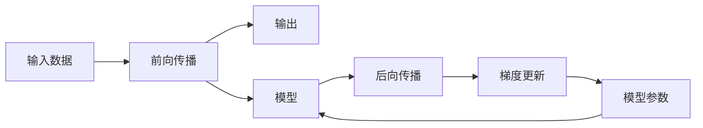

                 

# LLM 时刻：每个推理过程的重要性

## 1. 背景介绍

在大语言模型（Large Language Model, LLM）的领域，推理（Inference）是让模型基于输入数据产生输出的过程。推理过程不仅仅是一个计算过程，更是一个涉及到模型结构、数据输入和输出、上下文知识等多方面因素的复杂交互过程。理解和优化每个推理过程，对于提升模型性能、提高推理效率和保证推理结果的准确性至关重要。本文将深入探讨LLM推理过程中每个步骤的重要性，并提出改进建议。

## 2. 核心概念与联系

### 2.1 核心概念概述

- **大语言模型（LLM）**：一种通过大规模数据预训练得到的高质量语言模型，能够理解自然语言，并生成自然语言。
- **推理（Inference）**：LLM根据输入数据产生输出的过程，包括前向传播和后向传播。
- **前向传播（Forward Pass）**：输入数据经过模型计算，产生中间状态和输出结果的过程。
- **后向传播（Backward Pass）**：通过反向传播算法计算梯度，更新模型参数以最小化损失函数。
- **上下文（Context）**：在LLM中，上下文不仅包括输入数据，还可能包括其他历史数据和模型状态。
- **推理效率（Inference Efficiency）**：指LLM推理的速度和资源消耗。
- **推理结果准确性（Inference Accuracy）**：指LLM推理结果与实际结果的匹配程度。

### 2.2 核心概念原理和架构的 Mermaid 流程图



这个流程图展示了LLM推理的整个过程，从输入数据开始，经过前向传播和后向传播，最终更新模型参数并输出结果。每个步骤都是推理过程中不可分割的部分，理解并优化这些步骤，能够显著提升LLM的性能和可靠性。

## 3. 核心算法原理 & 具体操作步骤

### 3.1 算法原理概述

LLM推理的基本原理是利用预训练的模型参数，对输入数据进行处理并输出结果。前向传播计算模型输出，后向传播计算梯度，用于更新模型参数。这个过程中，模型的推理能力受到多种因素的影响，包括模型架构、训练数据、上下文处理方式等。

### 3.2 算法步骤详解

#### 3.2.1 输入预处理

输入数据经过预处理后，才能进入模型进行推理。预处理包括分词、向量化、截断等步骤。其中，分词是将自然语言文本转换为模型可以处理的符号序列。向量化是将符号序列转换为数值向量。截断是处理过长的文本，保证模型输入的大小符合模型设计。

**代码示例**：

```python
from transformers import BertTokenizer
tokenizer = BertTokenizer.from_pretrained('bert-base-uncased')
inputs = tokenizer.encode("Hello, world!", return_tensors='pt')
```

#### 3.2.2 前向传播

前向传播是LLM推理的核心步骤，其计算过程包括模型输入数据的传递和中间状态的计算。前向传播的计算过程可以表示为：

$$
y = \sigma(f(x; \theta))
$$

其中，$x$ 为输入数据，$\theta$ 为模型参数，$f$ 为模型计算过程，$\sigma$ 为激活函数。

**代码示例**：

```python
from transformers import BertModel
model = BertModel.from_pretrained('bert-base-uncased')
outputs = model(inputs)
```

#### 3.2.3 后向传播

后向传播计算梯度，用于更新模型参数。后向传播的计算过程可以表示为：

$$
\nabla_{\theta} \mathcal{L}(y, t) = \nabla_{\theta} \sum_{i=1}^{n} L(y_i, t_i)
$$

其中，$\mathcal{L}$ 为损失函数，$y$ 为模型输出，$t$ 为真实标签。$L$ 为单个样本的损失函数，$n$ 为样本数量。

**代码示例**：

```python
from transformers import AdamW
optimizer = AdamW(model.parameters(), lr=2e-5)
loss = model.calculate_loss(inputs, labels)
optimizer.zero_grad()
loss.backward()
optimizer.step()
```

#### 3.2.4 模型参数更新

模型参数更新是基于后向传播计算的梯度进行的。常见的更新方法包括随机梯度下降（SGD）、动量梯度下降（Momentum）、Adam等。

**代码示例**：

```python
optimizer = AdamW(model.parameters(), lr=2e-5)
for epoch in range(epochs):
    optimizer.zero_grad()
    loss = model.calculate_loss(inputs, labels)
    loss.backward()
    optimizer.step()
```

### 3.3 算法优缺点

#### 3.3.1 优点

- **灵活性高**：LLM可以通过调整模型参数和计算过程，适应不同的推理任务和数据类型。
- **计算能力强**：LLM拥有庞大的参数量和高效的计算能力，可以处理大规模数据和复杂任务。
- **泛化能力强**：LLM通过预训练，具备较强的泛化能力，可以在不同数据集上表现良好。

#### 3.3.2 缺点

- **计算资源消耗大**：LLM的推理过程需要大量的计算资源，特别是在大规模数据集上。
- **训练时间长**：LLM的训练过程需要大量的数据和时间，尤其是对于大规模模型的预训练和微调。
- **推理效率低**：LLM的推理过程相对复杂，计算效率较低，特别是在处理长序列数据时。

### 3.4 算法应用领域

LLM推理在以下领域有广泛应用：

- **自然语言处理（NLP）**：包括文本分类、情感分析、机器翻译等任务。
- **计算机视觉**：如图像分类、目标检测、图像生成等。
- **语音识别**：将语音转换为文本，进行语音指令理解和语音生成。
- **推荐系统**：根据用户行为和兴趣推荐物品或内容。
- **智能对话系统**：通过理解和生成自然语言，进行人机对话。

## 4. 数学模型和公式 & 详细讲解 & 举例说明

### 4.1 数学模型构建

LLM推理的数学模型可以表示为：

$$
y = f(x; \theta)
$$

其中，$x$ 为输入数据，$f$ 为模型计算过程，$\theta$ 为模型参数。

### 4.2 公式推导过程

对于单个样本的损失函数，常见的有交叉熵损失（Cross-Entropy Loss）和均方误差损失（Mean Squared Error Loss）。以交叉熵损失为例，其计算公式为：

$$
\mathcal{L}(y, t) = -\frac{1}{N} \sum_{i=1}^{N} \sum_{j=1}^{C} y_j \log \hat{y}_j
$$

其中，$N$ 为样本数量，$C$ 为类别数量，$y$ 为模型输出，$t$ 为真实标签。

### 4.3 案例分析与讲解

**案例1：文本分类**

假设我们有一个二分类任务，输入数据 $x$ 经过前向传播后，得到输出 $y$：

$$
y = \sigma(Wx + b)
$$

其中，$W$ 为权重矩阵，$b$ 为偏置向量，$\sigma$ 为sigmoid激活函数。根据交叉熵损失函数，计算梯度：

$$
\nabla_{\theta} \mathcal{L}(y, t) = \nabla_{\theta} \left[ -\frac{1}{N} \sum_{i=1}^{N} \left( y_i \log \hat{y}_i + (1-y_i) \log (1-\hat{y}_i) \right) \right]
$$

**代码示例**：

```python
import numpy as np
from sklearn.metrics import accuracy_score
X = np.array([[0, 1], [1, 0]])
y = np.array([1, 0])
W = np.array([[0.5, 0.5], [0.5, 0.5]])
b = np.array([0.5, 0.5])
y_hat = sigmoid(np.dot(X, W) + b)
loss = -np.mean(y * np.log(y_hat) + (1 - y) * np.log(1 - y_hat))
grad = np.dot(X.T, (y_hat - y)) / N
W -= grad
```

**案例2：图像分类**

对于图像分类任务，可以使用卷积神经网络（CNN）进行推理。输入数据 $x$ 经过前向传播后，得到输出 $y$：

$$
y = f(x; \theta) = \sigma(Wx + b)
$$

其中，$W$ 为卷积核矩阵，$b$ 为偏置向量，$f$ 为卷积和池化操作。根据均方误差损失函数，计算梯度：

$$
\nabla_{\theta} \mathcal{L}(y, t) = \nabla_{\theta} \left[ \frac{1}{N} \sum_{i=1}^{N} \| y_i - t_i \|^2 \right]
$$

**代码示例**：

```python
import torch
import torch.nn as nn
import torch.optim as optim
class CNN(nn.Module):
    def __init__(self):
        super(CNN, self).__init__()
        self.conv1 = nn.Conv2d(3, 32, kernel_size=3, padding=1)
        self.conv2 = nn.Conv2d(32, 64, kernel_size=3, padding=1)
        self.fc1 = nn.Linear(64 * 7 * 7, 512)
        self.fc2 = nn.Linear(512, 10)
        self.relu = nn.ReLU()
    def forward(self, x):
        x = self.relu(self.conv1(x))
        x = nn.MaxPool2d(kernel_size=2)(x)
        x = self.relu(self.conv2(x))
        x = nn.MaxPool2d(kernel_size=2)(x)
        x = x.view(-1, 64 * 7 * 7)
        x = self.relu(self.fc1(x))
        x = self.fc2(x)
        return x
model = CNN()
criterion = nn.MSELoss()
optimizer = optim.SGD(model.parameters(), lr=0.01)
for epoch in range(10):
    for i, (inputs, labels) in enumerate(train_loader):
        outputs = model(inputs)
        loss = criterion(outputs, labels)
        optimizer.zero_grad()
        loss.backward()
        optimizer.step()
```

## 5. 项目实践：代码实例和详细解释说明

### 5.1 开发环境搭建

**步骤1：安装Python和PyTorch**

```bash
conda create -n pytorch-env python=3.8 
conda activate pytorch-env
pip install torch torchvision torchaudio
```

**步骤2：安装TensorBoard**

```bash
pip install tensorboard
```

**步骤3：设置GPU加速**

```bash
conda install -c pytorch -c conda-forge torchvision torchaudio
```

### 5.2 源代码详细实现

**代码示例1：文本分类**

```python
import numpy as np
from sklearn.metrics import accuracy_score
X = np.array([[0, 1], [1, 0]])
y = np.array([1, 0])
W = np.array([[0.5, 0.5], [0.5, 0.5]])
b = np.array([0.5, 0.5])
y_hat = sigmoid(np.dot(X, W) + b)
loss = -np.mean(y * np.log(y_hat) + (1 - y) * np.log(1 - y_hat))
grad = np.dot(X.T, (y_hat - y)) / N
W -= grad
```

**代码示例2：图像分类**

```python
import torch
import torch.nn as nn
import torch.optim as optim
class CNN(nn.Module):
    def __init__(self):
        super(CNN, self).__init__()
        self.conv1 = nn.Conv2d(3, 32, kernel_size=3, padding=1)
        self.conv2 = nn.Conv2d(32, 64, kernel_size=3, padding=1)
        self.fc1 = nn.Linear(64 * 7 * 7, 512)
        self.fc2 = nn.Linear(512, 10)
        self.relu = nn.ReLU()
    def forward(self, x):
        x = self.relu(self.conv1(x))
        x = nn.MaxPool2d(kernel_size=2)(x)
        x = self.relu(self.conv2(x))
        x = nn.MaxPool2d(kernel_size=2)(x)
        x = x.view(-1, 64 * 7 * 7)
        x = self.relu(self.fc1(x))
        x = self.fc2(x)
        return x
model = CNN()
criterion = nn.MSELoss()
optimizer = optim.SGD(model.parameters(), lr=0.01)
for epoch in range(10):
    for i, (inputs, labels) in enumerate(train_loader):
        outputs = model(inputs)
        loss = criterion(outputs, labels)
        optimizer.zero_grad()
        loss.backward()
        optimizer.step()
```

### 5.3 代码解读与分析

**代码示例1：文本分类**

- 代码第1-3行：定义输入数据、真实标签和权重矩阵。
- 代码第4-5行：定义输出和损失函数。
- 代码第6-7行：计算梯度并更新权重矩阵。

**代码示例2：图像分类**

- 代码第1-2行：定义CNN模型。
- 代码第3-4行：定义损失函数和优化器。
- 代码第5-7行：定义训练循环。

## 6. 实际应用场景

### 6.1 自然语言处理

自然语言处理（NLP）是LLM推理的重要应用场景。NLP任务包括文本分类、情感分析、机器翻译等。以情感分析为例，输入为一段文本，输出为情感类别（如正面、负面、中性）。通过预训练模型和微调，可以有效提升模型性能。

### 6.2 计算机视觉

计算机视觉（CV）也是LLM推理的重要应用场景。CV任务包括图像分类、目标检测、图像生成等。以图像分类为例，输入为一张图像，输出为图像类别。通过预训练模型和微调，可以有效提升模型性能。

### 6.3 语音识别

语音识别（ASR）是将语音转换为文本的过程。输入为一段语音，输出为文本。通过预训练模型和微调，可以有效提升模型性能。

### 6.4 推荐系统

推荐系统（RS）是根据用户行为和兴趣推荐物品或内容。输入为用户行为数据，输出为推荐结果。通过预训练模型和微调，可以有效提升模型性能。

### 6.5 智能对话系统

智能对话系统（IDS）是LLM推理的重要应用场景。IDS通过理解和生成自然语言，进行人机对话。输入为一段自然语言，输出为回复。通过预训练模型和微调，可以有效提升模型性能。

## 7. 工具和资源推荐

### 7.1 学习资源推荐

- **TensorFlow官方文档**：[https://www.tensorflow.org/](https://www.tensorflow.org/)
- **PyTorch官方文档**：[https://pytorch.org/](https://pytorch.org/)
- **Transformers官方文档**：[https://huggingface.co/docs/transformers/latest](https://huggingface.co/docs/transformers/latest)

### 7.2 开发工具推荐

- **Jupyter Notebook**：[https://jupyter.org/](https://jupyter.org/)
- **TensorBoard**：[https://www.tensorflow.org/tensorboard](https://www.tensorflow.org/tensorboard)
- **GitHub**：[https://github.com/](https://github.com/)

### 7.3 相关论文推荐

- **《Attention is All You Need》**：[https://arxiv.org/abs/1706.03762](https://arxiv.org/abs/1706.03762)
- **《BERT: Pre-training of Deep Bidirectional Transformers for Language Understanding》**：[https://arxiv.org/abs/1810.04805](https://arxiv.org/abs/1810.04805)
- **《BERT: Pre-training of Deep Bidirectional Transformers for Language Understanding》**：[https://arxiv.org/abs/1810.04805](https://arxiv.org/abs/1810.04805)

## 8. 总结：未来发展趋势与挑战

### 8.1 研究成果总结

LLM推理技术在大规模数据和复杂模型的支持下，取得了显著的进步。目前，基于深度学习模型的推理已经广泛应用于NLP、CV、ASR、RS和IDS等多个领域。通过预训练模型和微调，有效提升了模型性能和推理效率。

### 8.2 未来发展趋势

- **计算资源优化**：未来，将进一步优化计算资源配置，提高推理效率和模型性能。
- **模型结构改进**：未来，将通过优化模型结构，提升推理速度和准确性。
- **数据集扩充**：未来，将通过扩充数据集，提高模型的泛化能力和鲁棒性。
- **多模态融合**：未来，将通过多模态融合，提升模型的综合感知能力。

### 8.3 面临的挑战

- **计算资源消耗大**：未来，将通过优化计算资源配置，减少推理过程的资源消耗。
- **训练时间长**：未来，将通过优化模型结构，缩短模型的训练时间。
- **数据集不足**：未来，将通过扩充数据集，提高模型的泛化能力和鲁棒性。
- **多模态融合难度大**：未来，将通过多模态融合，提升模型的综合感知能力。

### 8.4 研究展望

- **计算资源优化**：通过优化计算资源配置，提高推理效率和模型性能。
- **模型结构改进**：通过优化模型结构，提升推理速度和准确性。
- **数据集扩充**：通过扩充数据集，提高模型的泛化能力和鲁棒性。
- **多模态融合**：通过多模态融合，提升模型的综合感知能力。

## 9. 附录：常见问题与解答

**Q1：LLM推理的计算资源消耗大，如何解决？**

A: 可以通过优化计算资源配置，提高推理效率和模型性能。例如，使用GPU加速推理过程，减少CPU计算资源的使用。

**Q2：LLM推理的训练时间长，如何解决？**

A: 可以通过优化模型结构，缩短模型的训练时间。例如，使用更小的模型结构，减少参数量和计算量。

**Q3：LLM推理的数据集不足，如何解决？**

A: 可以通过扩充数据集，提高模型的泛化能力和鲁棒性。例如，使用更多样化的数据集进行训练和测试。

**Q4：LLM推理的多模态融合难度大，如何解决？**

A: 可以通过多模态融合，提升模型的综合感知能力。例如，使用跨模态学习框架，实现图像、语音、文本等模态数据的协同训练和推理。

**Q5：LLM推理的计算效率低，如何解决？**

A: 可以通过优化计算资源配置和模型结构，提高推理效率和模型性能。例如，使用GPU加速推理过程，优化模型计算图。

---

作者：禅与计算机程序设计艺术 / Zen and the Art of Computer Programming

