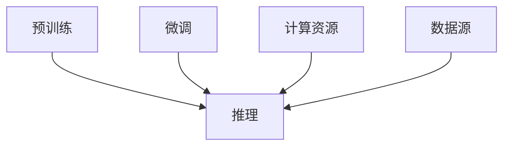

                 

# LLM 生态系统：迎来自己的摩尔定律

## 1. 背景介绍

### 1.1 问题由来
长期以来，计算能力以摩尔定律的形式快速增长，但这一规律在2010年之后开始呈现放缓趋势。AI技术，尤其是深度学习，随着计算能力的提升，迎来了爆发式发展。然而，这一趋势在大型语言模型(Large Language Models, LLMs)的崛起下，再次迎来爆发。LLMs 已经不满足于仅依赖更大规模的计算和更多数据来提高模型性能，而是正在迎来自己的摩尔定律。

### 1.2 问题核心关键点
LLMs 正在经历三个维度上的增长，从而开启了属于自己的摩尔定律：

- **计算资源的增加**：自监督学习、强化学习等训练方式对计算资源的需求愈发巨大，推动了计算硬件如GPU、TPU的迅猛发展。
- **数据量的增加**：LLMs 需要海量数据进行预训练，使得互联网成为庞大的数据来源。
- **模型规模的增加**：越来越多的模型开始朝着亿参数规模迈进，模型的复杂度不断提升。

这些变化使得 LLMs 在预测能力、推理能力等方面显著提升，推动了整个领域的迅速发展。

## 2. 核心概念与联系

### 2.1 核心概念概述

为更好地理解 LLMs 的发展，本节将介绍几个密切相关的核心概念：

- **大型语言模型(LLMs)**：以自回归模型（如GPT）或自编码模型（如BERT）为代表的大规模预训练语言模型。通过在大规模无标签文本语料上进行预训练，学习通用的语言表示，具备强大的语言理解和生成能力。
- **自监督学习**：利用无标签数据训练模型的一种方法，通过自我生成的任务（如语言模型）来让模型学习输入-输出映射。
- **强化学习**：通过奖励机制让模型进行决策学习，适用于一些无法直接获取标签的任务，如游戏、对话等。
- **计算硬件加速**：通过GPU、TPU等高性能设备来加速模型的训练和推理过程，减少计算时间。
- **模型蒸馏**：通过小模型学习大模型的知识，实现参数共享和知识传递，减少模型规模，提升推理速度。
- **迁移学习**：将一个领域学到的知识迁移到另一个相关领域，适用于特定任务时使用已有模型作为初始化。

这些核心概念之间的逻辑关系可以通过以下Mermaid流程图来展示：

```mermaid
graph TB
    A[大型语言模型(LLMs)] --> B[自监督学习]
    A --> C[强化学习]
    A --> D[计算硬件加速]
    A --> E[模型蒸馏]
    A --> F[迁移学习]
```

### 2.2 核心概念原理和架构的 Mermaid 流程图



这个流程图展示了预训练、微调、推理、计算资源和数据源之间的关系。预训练是模型的初始化阶段，微调是针对特定任务的优化，推理是模型的应用阶段，计算资源和数据源是模型训练和推理的支持基础设施。

## 3. 核心算法原理 & 具体操作步骤

### 3.1 算法原理概述

LLM 的崛起，依赖于自监督学习、强化学习以及计算硬件的进步。其核心思想是：在大量的无标签数据上进行预训练，学习语言的一般性表示，然后通过微调在特定任务上进一步优化，从而获得最优的性能。

预训练阶段，模型会尝试预测上下文中的缺失单词，以学习语言的概率分布。微调阶段，通过对特定任务的标注数据进行训练，使模型能够执行指定的语言任务。推理阶段，模型接收输入，根据训练得到的参数，生成相应的输出。

### 3.2 算法步骤详解

基于 LLM 的生态系统构建一般包括以下几个关键步骤：

**Step 1: 准备数据和硬件**
- 收集大规模的无标签文本数据作为预训练语料库。
- 选择合适的计算硬件设备（如GPU、TPU）进行模型训练。

**Step 2: 选择和预训练模型**
- 选择适当的预训练模型（如BERT、GPT-3等）。
- 在预训练数据上使用自监督学习方法（如掩码语言模型、上下文预测等）进行训练。

**Step 3: 微调和优化**
- 收集特定任务的标注数据，设计任务适配层。
- 在微调数据上使用监督学习方法（如交叉熵损失、二元交叉熵等）进行微调。
- 优化微调过程，包括选择合适的学习率、正则化技术等。

**Step 4: 推理和应用**
- 使用微调后的模型进行推理，输出结果。
- 将模型集成到实际应用系统中，进行实时响应。

### 3.3 算法优缺点

基于 LLM 的生态系统具有以下优点：

1. **性能提升显著**：在特定任务上，微调后的 LLM 模型能够获得显著的性能提升。
2. **参数效率高**：使用参数高效微调（PEFT）技术，可以在不增加大量新参数的情况下提升模型性能。
3. **应用广泛**：可以应用于各种 NLP 任务，如问答、翻译、情感分析等。

同时，该方法也存在一定的局限性：

1. **数据依赖性强**：微调模型需要大量标注数据，数据获取成本高。
2. **模型易过拟合**：在数据量较小的情况下，模型可能过拟合。
3. **计算资源需求高**：预训练和微调需要大量计算资源，计算硬件成本高。
4. **模型复杂度高**：模型参数量庞大，推理过程复杂，导致推理速度慢。

### 3.4 算法应用领域

基于 LLM 的生态系统已经在多个领域得到了广泛的应用，例如：

- **自然语言处理**：问答系统、机器翻译、情感分析、文本摘要等。
- **人工智能医疗**：辅助诊断、疾病预测、病人问答等。
- **金融科技**：信用评分、智能投顾、聊天机器人等。
- **智能客服**：自动应答、语音识别、情感分析等。
- **教育科技**：智能辅导、学习分析、个性化推荐等。

这些领域的应用，展示了 LLM 生态系统的强大潜力和广泛影响力。

## 4. 数学模型和公式 & 详细讲解 & 举例说明

### 4.1 数学模型构建

假设 LLM 模型为 $M_{\theta}$，其中 $\theta$ 为模型参数。预训练的目标是通过自监督学习方法，使得模型能够预测文本中的缺失单词。微调的目标是在特定任务上，通过监督学习方法，使得模型能够执行特定语言任务。

预训练任务如语言模型，目标函数为：

$$
L_{pre-train} = -\frac{1}{N}\sum_{i=1}^{N}log P(x_i|x_{i-t},...,x_{i})
$$

其中 $P(x_i|x_{i-t},...,x_{i})$ 为模型在上下文信息 $x_{i-t},...,x_{i}$ 下预测单词 $x_i$ 的概率分布。

微调任务如分类任务，目标函数为：

$$
L_{fine-tune} = -\frac{1}{N}\sum_{i=1}^{N}y_i log M_{\theta}(x_i) + (1-y_i) log (1-M_{\theta}(x_i))
$$

其中 $y_i$ 为标签，$M_{\theta}(x_i)$ 为模型在输入 $x_i$ 下的输出概率。

### 4.2 公式推导过程

预训练过程的梯度计算可以使用反向传播算法，微调过程的梯度计算也是基于反向传播。对于预训练任务，使用如下计算方法：

$$
\frac{\partial L_{pre-train}}{\partial \theta} = \frac{\partial \log P(x_i|x_{i-t},...,x_{i})}{\partial \theta}
$$

对于微调任务，使用如下计算方法：

$$
\frac{\partial L_{fine-tune}}{\partial \theta} = \frac{\partial \log M_{\theta}(x_i)}{\partial \theta}
$$

其中 $\log M_{\theta}(x_i)$ 为模型的对数输出，$\frac{\partial \log M_{\theta}(x_i)}{\partial \theta}$ 为模型输出的梯度。

### 4.3 案例分析与讲解

假设我们要对 BERT 模型进行微调以识别情感极性，具体步骤如下：

1. **数据准备**：准备标注好的情感极性数据集。
2. **模型选择**：选择 BERT 作为预训练模型。
3. **微调设计**：设计任务适配层，将 BERT 输出通过线性层映射到二分类标签。
4. **优化设置**：设置优化器为 AdamW，学习率为 2e-5，批大小为 32。
5. **模型训练**：在训练集上进行训练，每轮迭代中使用小批量随机梯度下降更新模型参数。
6. **模型评估**：在验证集上评估模型性能，根据评估结果调整学习率、批大小等参数。
7. **模型推理**：使用微调后的 BERT 模型进行情感极性预测。

具体代码实现：

```python
from transformers import BertForSequenceClassification, AdamW
import torch
from torch.utils.data import DataLoader

# 准备数据和模型
model = BertForSequenceClassification.from_pretrained('bert-base-uncased')
optimizer = AdamW(model.parameters(), lr=2e-5)
tokenizer = BertTokenizer.from_pretrained('bert-base-uncased')

# 定义数据预处理函数
def preprocess(text):
    inputs = tokenizer(text, truncation=True, padding=True)
    return inputs['input_ids'], inputs['attention_mask']

# 准备数据集
train_dataset = prepare_train_dataset(train_texts, train_labels, tokenizer)
val_dataset = prepare_val_dataset(val_texts, val_labels, tokenizer)

# 训练模型
for epoch in range(epochs):
    model.train()
    for batch in DataLoader(train_dataset, batch_size):
        inputs, labels = batch
        optimizer.zero_grad()
        logits = model(inputs['input_ids'], attention_mask=inputs['attention_mask'])
        loss = loss_fn(logits.view(-1), labels)
        loss.backward()
        optimizer.step()

    model.eval()
    val_loss = 0
    for batch in DataLoader(val_dataset, batch_size):
        inputs, labels = batch
        with torch.no_grad():
            logits = model(inputs['input_ids'], attention_mask=inputs['attention_mask'])
            val_loss += loss_fn(logits.view(-1), labels).item()

    print(f"Epoch {epoch+1}, train loss: {train_loss:.3f}, val loss: {val_loss/len(val_dataset):.3f}")
```

## 5. 项目实践：代码实例和详细解释说明

### 5.1 开发环境搭建

在进行 LLM 微调实践前，我们需要准备好开发环境。以下是使用Python进行PyTorch开发的环境配置流程：

1. 安装Anaconda：从官网下载并安装Anaconda，用于创建独立的Python环境。

2. 创建并激活虚拟环境：
```bash
conda create -n llm-env python=3.8 
conda activate llm-env
```

3. 安装PyTorch：根据CUDA版本，从官网获取对应的安装命令。例如：
```bash
conda install pytorch torchvision torchaudio cudatoolkit=11.1 -c pytorch -c conda-forge
```

4. 安装Transformers库：
```bash
pip install transformers
```

5. 安装各类工具包：
```bash
pip install numpy pandas scikit-learn matplotlib tqdm jupyter notebook ipython
```

完成上述步骤后，即可在`llm-env`环境中开始微调实践。

### 5.2 源代码详细实现

这里我们以情感极性识别任务为例，给出使用Transformers库对BERT模型进行微调的PyTorch代码实现。

首先，定义情感极性识别任务的数据处理函数：

```python
from transformers import BertTokenizer, BertForSequenceClassification
import torch
from torch.utils.data import Dataset

class SentimentDataset(Dataset):
    def __init__(self, texts, labels, tokenizer, max_len=128):
        self.texts = texts
        self.labels = labels
        self.tokenizer = tokenizer
        self.max_len = max_len
        
    def __len__(self):
        return len(self.texts)
    
    def __getitem__(self, item):
        text = self.texts[item]
        label = self.labels[item]
        
        encoding = self.tokenizer(text, return_tensors='pt', max_length=self.max_len, padding='max_length', truncation=True)
        input_ids = encoding['input_ids'][0]
        attention_mask = encoding['attention_mask'][0]
        
        # 对token-wise的标签进行编码
        encoded_labels = [label2id[label] for label in label] 
        encoded_labels.extend([label2id['O']] * (self.max_len - len(encoded_labels)))
        labels = torch.tensor(encoded_labels, dtype=torch.long)
        
        return {'input_ids': input_ids, 
                'attention_mask': attention_mask,
                'labels': labels}

# 标签与id的映射
label2id = {'positive': 0, 'negative': 1, 'neutral': 2, 'O': 3}
id2label = {v: k for k, v in label2id.items()}

# 创建dataset
tokenizer = BertTokenizer.from_pretrained('bert-base-uncased')

train_dataset = SentimentDataset(train_texts, train_labels, tokenizer)
val_dataset = SentimentDataset(val_texts, val_labels, tokenizer)
test_dataset = SentimentDataset(test_texts, test_labels, tokenizer)
```

然后，定义模型和优化器：

```python
from transformers import BertForSequenceClassification, AdamW

model = BertForSequenceClassification.from_pretrained('bert-base-uncased', num_labels=len(label2id))

optimizer = AdamW(model.parameters(), lr=2e-5)
```

接着，定义训练和评估函数：

```python
from torch.utils.data import DataLoader
from tqdm import tqdm
from sklearn.metrics import classification_report

device = torch.device('cuda') if torch.cuda.is_available() else torch.device('cpu')
model.to(device)

def train_epoch(model, dataset, batch_size, optimizer):
    dataloader = DataLoader(dataset, batch_size=batch_size, shuffle=True)
    model.train()
    epoch_loss = 0
    for batch in tqdm(dataloader, desc='Training'):
        inputs, labels = batch['input_ids'].to(device), batch['labels'].to(device)
        model.zero_grad()
        outputs = model(inputs, attention_mask=inputs['attention_mask'])
        loss = outputs.loss
        epoch_loss += loss.item()
        loss.backward()
        optimizer.step()
    return epoch_loss / len(dataloader)

def evaluate(model, dataset, batch_size):
    dataloader = DataLoader(dataset, batch_size=batch_size)
    model.eval()
    preds, labels = [], []
    with torch.no_grad():
        for batch in tqdm(dataloader, desc='Evaluating'):
            inputs, labels = batch['input_ids'].to(device), batch['labels'].to(device)
            outputs = model(inputs, attention_mask=inputs['attention_mask'])
            batch_preds = outputs.logits.argmax(dim=2).to('cpu').tolist()
            batch_labels = batch_labels.to('cpu').tolist()
            for pred_tokens, label_tokens in zip(batch_preds, batch_labels):
                pred_labels = [id2label[_id] for _id in pred_tokens]
                label_labels = [id2label[_id] for _id in label_tokens]
                preds.append(pred_labels[:len(label_labels)])
                labels.append(label_labels)
                
    print(classification_report(labels, preds))
```

最后，启动训练流程并在测试集上评估：

```python
epochs = 5
batch_size = 16

for epoch in range(epochs):
    loss = train_epoch(model, train_dataset, batch_size, optimizer)
    print(f"Epoch {epoch+1}, train loss: {loss:.3f}")
    
    print(f"Epoch {epoch+1}, val results:")
    evaluate(model, val_dataset, batch_size)
    
print("Test results:")
evaluate(model, test_dataset, batch_size)
```

以上就是使用PyTorch对BERT进行情感极性识别任务微调的完整代码实现。可以看到，得益于Transformers库的强大封装，我们可以用相对简洁的代码完成BERT模型的加载和微调。

### 5.3 代码解读与分析

让我们再详细解读一下关键代码的实现细节：

**SentimentDataset类**：
- `__init__`方法：初始化文本、标签、分词器等关键组件。
- `__len__`方法：返回数据集的样本数量。
- `__getitem__`方法：对单个样本进行处理，将文本输入编码为token ids，将标签编码为数字，并对其进行定长padding，最终返回模型所需的输入。

**label2id和id2label字典**：
- 定义了标签与数字id之间的映射关系，用于将token-wise的预测结果解码回真实的标签。

**训练和评估函数**：
- 使用PyTorch的DataLoader对数据集进行批次化加载，供模型训练和推理使用。
- 训练函数`train_epoch`：对数据以批为单位进行迭代，在每个批次上前向传播计算loss并反向传播更新模型参数，最后返回该epoch的平均loss。
- 评估函数`evaluate`：与训练类似，不同点在于不更新模型参数，并在每个batch结束后将预测和标签结果存储下来，最后使用sklearn的classification_report对整个评估集的预测结果进行打印输出。

**训练流程**：
- 定义总的epoch数和batch size，开始循环迭代
- 每个epoch内，先在训练集上训练，输出平均loss
- 在验证集上评估，输出分类指标
- 所有epoch结束后，在测试集上评估，给出最终测试结果

可以看到，PyTorch配合Transformers库使得BERT微调的代码实现变得简洁高效。开发者可以将更多精力放在数据处理、模型改进等高层逻辑上，而不必过多关注底层的实现细节。

当然，工业级的系统实现还需考虑更多因素，如模型的保存和部署、超参数的自动搜索、更灵活的任务适配层等。但核心的微调范式基本与此类似。

## 6. 实际应用场景

### 6.1 智能客服系统

基于LLM的对话技术，可以广泛应用于智能客服系统的构建。传统客服往往需要配备大量人力，高峰期响应缓慢，且一致性和专业性难以保证。而使用微调后的对话模型，可以7x24小时不间断服务，快速响应客户咨询，用自然流畅的语言解答各类常见问题。

在技术实现上，可以收集企业内部的历史客服对话记录，将问题和最佳答复构建成监督数据，在此基础上对预训练对话模型进行微调。微调后的对话模型能够自动理解用户意图，匹配最合适的答案模板进行回复。对于客户提出的新问题，还可以接入检索系统实时搜索相关内容，动态组织生成回答。如此构建的智能客服系统，能大幅提升客户咨询体验和问题解决效率。

### 6.2 金融舆情监测

金融机构需要实时监测市场舆论动向，以便及时应对负面信息传播，规避金融风险。传统的人工监测方式成本高、效率低，难以应对网络时代海量信息爆发的挑战。基于LLM的文本分类和情感分析技术，为金融舆情监测提供了新的解决方案。

具体而言，可以收集金融领域相关的新闻、报道、评论等文本数据，并对其进行主题标注和情感标注。在此基础上对预训练语言模型进行微调，使其能够自动判断文本属于何种主题，情感倾向是正面、中性还是负面。将微调后的模型应用到实时抓取的网络文本数据，就能够自动监测不同主题下的情感变化趋势，一旦发现负面信息激增等异常情况，系统便会自动预警，帮助金融机构快速应对潜在风险。

### 6.3 个性化推荐系统

当前的推荐系统往往只依赖用户的历史行为数据进行物品推荐，无法深入理解用户的真实兴趣偏好。基于LLM的个性化推荐系统可以更好地挖掘用户行为背后的语义信息，从而提供更精准、多样的推荐内容。

在实践中，可以收集用户浏览、点击、评论、分享等行为数据，提取和用户交互的物品标题、描述、标签等文本内容。将文本内容作为模型输入，用户的后续行为（如是否点击、购买等）作为监督信号，在此基础上微调预训练语言模型。微调后的模型能够从文本内容中准确把握用户的兴趣点。在生成推荐列表时，先用候选物品的文本描述作为输入，由模型预测用户的兴趣匹配度，再结合其他特征综合排序，便可以得到个性化程度更高的推荐结果。

### 6.4 未来应用展望

随着LLMs的不断发展，基于微调的LLMs生态系统将会在更多领域得到应用，为传统行业带来变革性影响。

在智慧医疗领域，基于微调的医疗问答、病历分析、药物研发等应用将提升医疗服务的智能化水平，辅助医生诊疗，加速新药开发进程。

在智能教育领域，微调技术可应用于作业批改、学情分析、知识推荐等方面，因材施教，促进教育公平，提高教学质量。

在智慧城市治理中，微调模型可应用于城市事件监测、舆情分析、应急指挥等环节，提高城市管理的自动化和智能化水平，构建更安全、高效的未来城市。

此外，在企业生产、社会治理、文娱传媒等众多领域，基于大语言模型微调的人工智能应用也将不断涌现，为经济社会发展注入新的动力。相信随着预训练语言模型和微调方法的不断进步，大语言模型微调技术必将引领NLP领域的发展方向，推动人工智能技术的广泛应用。

## 7. 工具和资源推荐

### 7.1 学习资源推荐

为了帮助开发者系统掌握LMMs微调的理论基础和实践技巧，这里推荐一些优质的学习资源：

1. 《Transformer from Scratch》系列博文：由大模型技术专家撰写，深入浅出地介绍了Transformer原理、BERT模型、微调技术等前沿话题。

2. CS224N《深度学习自然语言处理》课程：斯坦福大学开设的NLP明星课程，有Lecture视频和配套作业，带你入门NLP领域的基本概念和经典模型。

3. 《Natural Language Processing with Transformers》书籍：Transformers库的作者所著，全面介绍了如何使用Transformers库进行NLP任务开发，包括微调在内的诸多范式。

4. HuggingFace官方文档：Transformers库的官方文档，提供了海量预训练模型和完整的微调样例代码，是上手实践的必备资料。

5. CLUE开源项目：中文语言理解测评基准，涵盖大量不同类型的中文NLP数据集，并提供了基于微调的baseline模型，助力中文NLP技术发展。

通过对这些资源的学习实践，相信你一定能够快速掌握LMMs微调的精髓，并用于解决实际的NLP问题。

### 7.2 开发工具推荐

高效的开发离不开优秀的工具支持。以下是几款用于LMMs微调开发的常用工具：

1. PyTorch：基于Python的开源深度学习框架，灵活动态的计算图，适合快速迭代研究。大部分预训练语言模型都有PyTorch版本的实现。

2. TensorFlow：由Google主导开发的开源深度学习框架，生产部署方便，适合大规模工程应用。同样有丰富的预训练语言模型资源。

3. Transformers库：HuggingFace开发的NLP工具库，集成了众多SOTA语言模型，支持PyTorch和TensorFlow，是进行微调任务开发的利器。

4. Weights & Biases：模型训练的实验跟踪工具，可以记录和可视化模型训练过程中的各项指标，方便对比和调优。与主流深度学习框架无缝集成。

5. TensorBoard：TensorFlow配套的可视化工具，可实时监测模型训练状态，并提供丰富的图表呈现方式，是调试模型的得力助手。

6. Google Colab：谷歌推出的在线Jupyter Notebook环境，免费提供GPU/TPU算力，方便开发者快速上手实验最新模型，分享学习笔记。

合理利用这些工具，可以显著提升LMMs微调任务的开发效率，加快创新迭代的步伐。

### 7.3 相关论文推荐

LMMs和微调技术的发展源于学界的持续研究。以下是几篇奠基性的相关论文，推荐阅读：

1. Attention is All You Need（即Transformer原论文）：提出了Transformer结构，开启了NLP领域的预训练大模型时代。

2. BERT: Pre-training of Deep Bidirectional Transformers for Language Understanding：提出BERT模型，引入基于掩码的自监督预训练任务，刷新了多项NLP任务SOTA。

3. Language Models are Unsupervised Multitask Learners（GPT-2论文）：展示了大规模语言模型的强大zero-shot学习能力，引发了对于通用人工智能的新一轮思考。

4. Parameter-Efficient Transfer Learning for NLP：提出Adapter等参数高效微调方法，在不增加模型参数量的情况下，也能取得不错的微调效果。

5. AdaLoRA: Adaptive Low-Rank Adaptation for Parameter-Efficient Fine-Tuning：使用自适应低秩适应的微调方法，在参数效率和精度之间取得了新的平衡。

这些论文代表了大语言模型微调技术的发展脉络。通过学习这些前沿成果，可以帮助研究者把握学科前进方向，激发更多的创新灵感。

## 8. 总结：未来发展趋势与挑战

### 8.1 研究成果总结

本文对基于LMMs的生态系统构建进行了全面系统的介绍。首先阐述了LMMs和微调技术的研究背景和意义，明确了微调在拓展预训练模型应用、提升下游任务性能方面的独特价值。其次，从原理到实践，详细讲解了LMMs的数学模型和微调过程，给出了微调任务开发的完整代码实例。同时，本文还广泛探讨了LMMs在多个领域的应用前景，展示了微调范式的强大潜力和广泛影响力。此外，本文精选了微调技术的各类学习资源，力求为读者提供全方位的技术指引。

通过本文的系统梳理，可以看到，基于LMMs的生态系统正在迎来属于自己的摩尔定律，以不断增长的计算资源、数据量和模型规模，推动了语言模型的深度学习应用，取得了显著的性能提升。

### 8.2 未来发展趋势

展望未来，LMMs生态系统将呈现以下几个发展趋势：

1. **计算资源的持续增长**：随着硬件技术的进步，计算资源的供给将越来越丰富，推动模型规模和计算速度的进一步提升。

2. **数据量的爆炸式增长**：互联网的快速发展，使得大数据成为了新的金矿。更多高质量的无标签数据将被用于预训练和微调，提升模型的泛化能力和推理能力。

3. **模型规模的突破**：随着计算资源的增加，越来越多的模型将朝着亿参数规模迈进，进一步提升模型的复杂度和推理能力。

4. **微调方法的不断创新**：未来将涌现更多参数高效和计算高效的微调方法，如Prefix-Tuning、LoRA等，提升微调的灵活性和效率。

5. **知识迁移能力的增强**：LMMs将能够更灵活地融合先验知识，提升模型的推理能力和泛化能力，解决更多复杂的问题。

6. **跨模态数据融合**：LMMs将能够处理多种模态数据，如文本、图像、语音等，实现多模态信息的协同建模。

以上趋势凸显了LMMs生态系统的强大潜力和广阔前景，预示着LMMs将成为推动人工智能发展的重要引擎。

### 8.3 面临的挑战

尽管LMMs和微调技术已经取得了显著进展，但在迈向更加智能化、普适化应用的过程中，它们仍面临着诸多挑战：

1. **数据依赖性**：LMMs需要大量高质量的数据进行预训练和微调，数据获取成本高，数据质量难以保证。

2. **过拟合问题**：在数据量较小的情况下，LMMs容易发生过拟合，导致泛化性能下降。

3. **计算资源需求高**：预训练和微调需要大量计算资源，硬件成本高，部署复杂。

4. **模型复杂度高**：LMMs参数量庞大，推理过程复杂，导致推理速度慢，资源消耗大。

5. **伦理与安全问题**：LMMs可能在训练过程中学习到偏见、有害信息，对输出结果造成影响，带来伦理和安全风险。

6. **可解释性不足**：LMMs的决策过程缺乏可解释性，难以理解其内部工作机制和推理逻辑。

7. **鲁棒性差**：LMMs在面对未知数据或对抗攻击时，表现不稳定，鲁棒性不足。

### 8.4 研究展望

面对LMMs和微调面临的挑战，未来的研究需要在以下几个方面寻求新的突破：

1. **无监督和半监督学习**：探索不依赖大规模标注数据的微调方法，利用自监督学习、主动学习等无监督和半监督范式，降低数据依赖性。

2. **知识蒸馏和迁移学习**：通过知识蒸馏和迁移学习，提升模型的泛化能力和推理能力，提高微调的效率和效果。

3. **参数高效微调和计算高效微调**：开发更多参数高效和计算高效的微调方法，提升微调的灵活性和效率。

4. **跨模态数据融合**：实现多模态数据的协同建模，提升模型的综合能力。

5. **鲁棒性和可解释性**：提升LMMs的鲁棒性和可解释性，确保输出结果的准确性和可信度。

6. **伦理与安全保障**：研究LMMs的伦理与安全问题，构建安全、可靠的输出模型。

通过这些研究方向的研究和突破，相信LMMs和微调技术将能够更好地应用于实际问题，推动人工智能技术的进一步发展。

## 9. 附录：常见问题与解答

**Q1: LLMs和微调技术的应用场景有哪些？**

A: LLMs和微调技术可以应用于多种NLP任务，包括文本分类、命名实体识别、关系抽取、问答系统、机器翻译、文本摘要、对话系统等。在智能客服、金融舆情监测、个性化推荐、智慧医疗、智能教育、智慧城市治理等多个领域中，LMMs和微调技术都有广泛的应用前景。

**Q2: 如何进行LMMs微调的超参数调优？**

A: LMMs微调的超参数包括学习率、批大小、迭代次数、正则化系数等。通过交叉验证等方法，可以在验证集上进行超参数调优，找到最优的超参数组合。也可以使用自适应学习率调整方法，如学习率衰减、学习率预热等，进一步提升模型性能。

**Q3: LLMs的计算资源需求高，如何解决？**

A: 可以通过分布式训练、混合精度训练、梯度累积等技术来降低单批次计算需求，提升训练效率。同时，使用GPU、TPU等高性能设备，以及模型压缩、量化加速等技术，来降低推理时间和资源消耗。

**Q4: LLMs的过拟合问题如何解决？**

A: 可以通过数据增强、正则化、早停等方法缓解过拟合问题。同时，使用参数高效微调方法，如Adapter、Prefix等，可以在不增加大量新参数的情况下提升模型性能。

**Q5: LMMs的伦理与安全问题如何解决？**

A: 需要在数据预处理和模型训练中引入伦理导向的评估指标，过滤和惩罚有偏见、有害的输出倾向。同时加强人工干预和审核，建立模型行为的监管机制，确保输出符合人类价值观和伦理道德。

**Q6: LLMs的可解释性不足如何解决？**

A: 可以通过可解释性研究，构建可解释性较强的模型架构，或者使用可视化工具，如Attention Map、LIME等，帮助理解模型的决策过程。同时，结合因果分析方法，增强输出的因果性和逻辑性，提升可解释性。

---

作者：禅与计算机程序设计艺术 / Zen and the Art of Computer Programming

