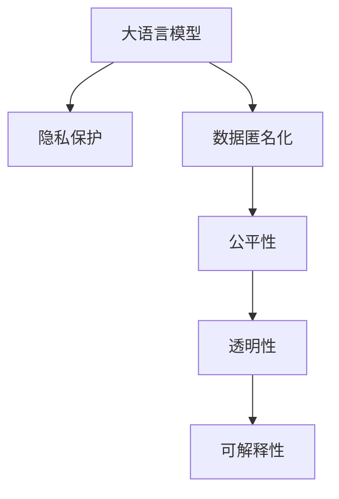

                 

# LLM 的道德困境：隐私与创新之间的平衡

> 关键词：大语言模型(LLM),隐私,道德,人工智能(AI),伦理,公平,透明,可解释性

## 1. 背景介绍

### 1.1 问题由来
随着人工智能(AI)技术尤其是深度学习模型的飞速发展，大语言模型(LLM)在自然语言处理(NLP)、计算机视觉(CV)、推荐系统、自动驾驶等领域展现出强大的表现力，为人类社会带来了前所未有的便利和效率提升。但与此同时，大规模数据的使用和模型训练也引发了一系列伦理和隐私问题。如何平衡创新与隐私，成为当前AI界需要深思熟虑的问题。

### 1.2 问题核心关键点
大规模数据和模型训练是大语言模型的基石，但这些数据往往包含个人隐私信息，如何妥善处理这些数据，确保隐私保护，同时又不影响模型的创新能力，是当前学术界和工业界亟需解决的问题。

当前，LLM的应用场景涉及金融、医疗、教育、政府等多个领域，这些领域对数据隐私保护的要求尤为严格。例如，在医疗领域，病患的医疗数据属于高度敏感信息，必须严格保护；在教育领域，学生的学习数据也涉及到隐私保护的问题。

## 2. 核心概念与联系

### 2.1 核心概念概述

为更好地理解LLM的道德困境，本节将介绍几个密切相关的核心概念：

- 大语言模型(LLM)：以Transformer为代表的大规模预训练语言模型。通过在大规模无标签文本语料上进行预训练，学习通用的语言表示，具备强大的语言理解和生成能力。

- 隐私保护(Privacy Protection)：确保用户个人数据不被未经授权的访问和滥用，防止数据泄露和滥用。隐私保护是保护用户权益、建立用户信任的重要措施。

- 数据匿名化(Data Anonymization)：将个人数据中的可识别信息去除或变换，使其无法直接追溯到特定个人，以保护用户隐私。

- 公平性(Fairness)：确保人工智能系统在处理数据时不存在歧视，对待所有用户一视同仁。公平性是保障社会公正、避免偏见的关键。

- 透明性(Transparency)：要求人工智能系统在运行过程中，其决策逻辑和依据可被公开解释，用户可以理解系统的工作机制。透明性有助于增强用户信任。

- 可解释性(Explainability)：要求人工智能系统输出的结果可以被解释，用户可以理解为什么系统作出了某种决策。可解释性是提高用户信任的重要手段。

这些核心概念之间的逻辑关系可以通过以下Mermaid流程图来展示：



这个流程图展示了大语言模型的核心概念及其之间的关系：

1. 大语言模型通过预训练获得基础能力。
2. 隐私保护要求确保用户数据不被滥用。
3. 数据匿名化通过去除或变换可识别信息，保护用户隐私。
4. 公平性确保系统不因数据偏见产生歧视。
5. 透明性要求系统决策逻辑可公开解释。
6. 可解释性保证系统输出可被用户理解。

这些概念共同构成了LLM应用时的道德和隐私保护框架，使其在创新与隐私保护之间找到平衡。

## 3. 核心算法原理 & 具体操作步骤
### 3.1 算法原理概述

在LLM的实践中，隐私保护是一个不可忽视的问题。隐私保护的核心在于数据匿名化和差分隐私。数据匿名化通过去标识化，使得数据无法直接追溯到特定个体；差分隐私通过引入噪声，保护个体隐私的同时，保证模型性能不受影响。

在大语言模型微调的过程中，隐私保护尤为关键。常见的隐私保护方法包括：
- 差分隐私(Differential Privacy, DP)：通过在模型训练中引入噪声，保护个体隐私，同时保证模型性能。
- 数据混淆(Data Obfuscation)：通过加密和变换，去除数据中的可识别信息，保护用户隐私。
- 联邦学习(Federated Learning, FL)：多个参与方在本地数据上训练模型，仅交换模型参数，不交换数据本身，保护用户隐私。

这些隐私保护方法可以单独使用，也可以结合使用，以最大化保护用户隐私的同时，确保模型的性能和可用性。

### 3.2 算法步骤详解

以下是LLM在隐私保护方面的典型算法步骤：

**Step 1: 数据预处理与匿名化**
- 收集用户数据，并进行数据清洗和去重，确保数据质量。
- 对数据进行匿名化处理，去除或变换可识别信息，如姓名、身份证号、位置信息等。

**Step 2: 选择隐私保护算法**
- 根据具体任务和数据特点，选择合适的隐私保护算法。如差分隐私、数据混淆等。
- 设置隐私保护参数，如差分隐私的ε值、噪声强度等。

**Step 3: 训练模型**
- 在隐私保护的框架下，对数据进行模型训练。使用隐私保护算法来保证数据安全和隐私保护。
- 在模型训练过程中，使用对抗训练、正则化等技术，增强模型的鲁棒性和泛化能力。

**Step 4: 模型微调和评估**
- 在微调过程中，使用隐私保护算法来确保微调数据的安全。
- 在模型微调后，对模型进行评估，确保模型性能不受隐私保护措施的影响。

**Step 5: 发布和部署**
- 将训练好的模型发布到生产环境中，确保模型在生产环境中的隐私保护措施。
- 对模型输出进行解释，确保可解释性和透明性。

以上是大语言模型在隐私保护方面的典型算法步骤。在实际应用中，还需要根据具体任务和数据特点，对隐私保护措施进行优化设计。

### 3.3 算法优缺点

隐私保护算法在保护用户隐私的同时，也存在一定的局限性：

**优点：**
1. 保护用户隐私。隐私保护算法通过匿名化、差分隐私等技术，确保用户数据不被滥用，保护用户隐私。
2. 增强模型鲁棒性。通过对抗训练、正则化等技术，增强模型的泛化能力和鲁棒性。
3. 保证模型性能。隐私保护算法在保证隐私保护的同时，不影响模型的性能和可用性。

**缺点：**
1. 数据处理复杂。隐私保护算法需要复杂的数据预处理和模型训练过程，增加了开发的复杂度。
2. 隐私保护强度限制。不同的隐私保护算法有各自的参数设置和适用范围，需要在隐私保护强度和模型性能之间进行权衡。
3. 计算成本高。隐私保护算法需要使用复杂的数学和统计方法，增加了计算成本。

尽管存在这些局限性，但隐私保护是大规模数据应用和模型训练中不可或缺的一部分，需要开发者在实际应用中综合考虑。

### 3.4 算法应用领域

隐私保护算法在大语言模型的多个应用领域都有广泛的应用，例如：

- 金融行业：金融数据涉及用户隐私和公司机密，隐私保护算法在金融数据处理和模型训练中尤为关键。
- 医疗行业：医疗数据属于高度敏感信息，隐私保护算法在医疗数据分析和模型训练中必须严格遵循相关法规。
- 教育行业：学生学习数据涉及隐私保护，隐私保护算法在学生数据分析和模型训练中同样重要。
- 政府行业：政府数据涉及国家安全和社会稳定，隐私保护算法在政府数据处理和模型训练中至关重要。
- 商业行业：用户行为数据涉及商业机密和用户隐私，隐私保护算法在商业数据分析和模型训练中必不可少。

以上领域的应用场景展示了隐私保护算法在大语言模型中的重要性和广泛性。

## 4. 数学模型和公式 & 详细讲解  
### 4.1 数学模型构建

在大语言模型的隐私保护中，差分隐私是一个重要的隐私保护手段。差分隐私要求，在每次查询中，加入噪声，使得攻击者无法从单个查询结果中识别出特定个体的信息。

设模型 $M$ 的损失函数为 $L$，训练数据为 $D$，差分隐私参数为 $\epsilon$，差分隐私噪声为 $N$。差分隐私的目标是：

$$
L_{\text{DP}}(M, D) = L(M, D) + N
$$

其中 $L_{\text{DP}}$ 表示差分隐私保护后的损失函数。

差分隐私算法的核心在于噪声的引入。常用的噪声模型包括Laplace噪声和Gaussian噪声。这里以Laplace噪声为例，公式推导如下：

设输入 $x$ 的Laplace噪声为 $N(x) \sim \text{Laplace}(0, \sigma)$，其中 $\sigma$ 为噪声强度。则差分隐私保护的损失函数为：

$$
L_{\text{DP}}(M, D) = \mathbb{E}_{(x,y)\sim D} [L(M(x), y) + N(x)]
$$

其中 $\mathbb{E}$ 表示期望运算。

在模型训练过程中，引入Laplace噪声的梯度计算公式为：

$$
\frac{\partial L_{\text{DP}}}{\partial \theta} = \frac{\partial L(M(x), y)}{\partial \theta} + \frac{\partial N(x)}{\partial \theta}
$$

其中 $\theta$ 表示模型参数。

### 4.2 公式推导过程

Laplace噪声的期望为0，方差为 $2\sigma^2$。假设数据集中有 $n$ 个样本，则Laplace噪声的方差为 $2\sigma^2/n$。在模型训练过程中，为了保证差分隐私，需要对噪声强度 $\sigma$ 进行优化。

Laplace噪声的方差 $\sigma^2$ 与差分隐私参数 $\epsilon$ 的关系为：

$$
\sigma^2 = \frac{\epsilon^2}{2n\delta^2}
$$

其中 $\delta$ 为模型的安全参数，表示模型在受到攻击时，能够保护多少比例的个体。

在实际应用中，需要根据具体任务和数据特点，选择合适的噪声强度和差分隐私参数，平衡隐私保护和模型性能。

### 4.3 案例分析与讲解

下面以Laplace噪声为例，给出具体的隐私保护算法实现。

```python
import torch
import torch.nn as nn
from torch.nn.utils import clip_grad_norm_
from torch.distributions import Laplace

class LaplaceDP(nn.Module):
    def __init__(self, model, noise_level):
        super(LaplaceDP, self).__init__()
        self.model = model
        self.noise_level = noise_level
        
    def forward(self, x):
        y = self.model(x)
        noise = Laplace(torch.zeros_like(y), self.noise_level).random(torch.Size(y.shape))
        y = y + noise
        return y
    
    def get_laplace_noise(self):
        return Laplace(torch.zeros_like(self.model.parameters()[0]), self.noise_level)
```

在实际应用中，将上述LaplaceDP模块嵌入到模型中，即可实现差分隐私保护。具体实现步骤如下：

1. 创建一个LaplaceDP模块，并将其嵌入到模型中。
2. 在每次前向传播中，将数据输入LaplaceDP模块，计算差分隐私保护后的输出。
3. 在反向传播中，将噪声梯度传递回模型，更新模型参数。
4. 在每个epoch结束时，计算噪声强度，确保差分隐私保护。

## 5. 项目实践：代码实例和详细解释说明
### 5.1 开发环境搭建

在进行LLM的隐私保护实践前，我们需要准备好开发环境。以下是使用Python进行PyTorch开发的环境配置流程：

1. 安装Anaconda：从官网下载并安装Anaconda，用于创建独立的Python环境。

2. 创建并激活虚拟环境：
```bash
conda create -n dp-env python=3.8 
conda activate dp-env
```

3. 安装PyTorch：根据CUDA版本，从官网获取对应的安装命令。例如：
```bash
conda install pytorch torchvision torchaudio cudatoolkit=11.1 -c pytorch -c conda-forge
```

4. 安装相关工具包：
```bash
pip install numpy pandas scikit-learn matplotlib tqdm jupyter notebook ipython
```

完成上述步骤后，即可在`dp-env`环境中开始隐私保护实践。

### 5.2 源代码详细实现

这里我们以差分隐私保护为例，给出使用PyTorch实现LLM的隐私保护代码实现。

首先，定义差分隐私保护的模块：

```python
import torch
from torch import nn
import torch.distributions as dist

class LaplaceDP(nn.Module):
    def __init__(self, model, noise_level):
        super(LaplaceDP, self).__init__()
        self.model = model
        self.noise_level = noise_level

    def forward(self, x):
        y = self.model(x)
        noise = dist.Laplace(torch.zeros_like(y), self.noise_level).sample()
        y = y + noise
        return y
```

然后，定义数据集和模型：

```python
from torch.utils.data import TensorDataset, DataLoader
import torch.nn as nn
import torch.nn.functional as F

# 定义数据集
train_data = TensorDataset(train_x, train_y)
train_loader = DataLoader(train_data, batch_size=32, shuffle=True)

# 定义模型
class MLP(nn.Module):
    def __init__(self):
        super(MLP, self).__init__()
        self.fc1 = nn.Linear(784, 256)
        self.fc2 = nn.Linear(256, 10)

    def forward(self, x):
        x = F.relu(self.fc1(x))
        x = self.fc2(x)
        return x

model = MLP()
```

接着，定义差分隐私保护的损失函数和优化器：

```python
import torch.optim as optim
from torch.distributions import Laplace

# 定义差分隐私保护的损失函数
def dp_loss(model, data_loader, noise_level):
    dp_model = LaplaceDP(model, noise_level)
    loss = 0
    for data in data_loader:
        inputs, labels = data
        outputs = dp_model(inputs)
        loss += F.cross_entropy(outputs, labels)
    return loss

# 定义优化器
optimizer = optim.Adam(dp_model.parameters(), lr=0.001)
```

最后，启动差分隐私保护的训练流程：

```python
epochs = 10
noise_levels = [0.5, 1.0, 2.0]
for noise_level in noise_levels:
    print(f"Running with noise level: {noise_level}")
    
    # 训练
    for epoch in range(epochs):
        running_loss = 0.0
        for i, data in enumerate(train_loader, 0):
            inputs, labels = data
            optimizer.zero_grad()
            outputs = dp_model(inputs)
            loss = dp_loss(dp_model, train_loader, noise_level)
            loss.backward()
            optimizer.step()
            running_loss += loss.item()
            if i % 100 == 99:
                print(f"Epoch {epoch+1}, loss: {running_loss/100:.4f}")
```

以上就是使用PyTorch对MLP模型进行差分隐私保护的完整代码实现。可以看到，通过LaplaceDP模块，我们可以方便地将差分隐私保护应用到模型训练过程中。

### 5.3 代码解读与分析

让我们再详细解读一下关键代码的实现细节：

**LaplaceDP类**：
- `__init__`方法：初始化模型和噪声水平。
- `forward`方法：在前向传播中引入噪声，并返回差分隐私保护后的输出。

**MLP模型**：
- 定义一个简单的多层感知器模型，用于二分类任务。

**差分隐私保护的损失函数**：
- 定义差分隐私保护的损失函数，计算模型在差分隐私保护下的预测误差。

**优化器**：
- 使用Adam优化器，设置合适的学习率。

**训练流程**：
- 定义训练轮数和噪声水平，遍历每个噪声水平。
- 在每个epoch内，对每个数据批次进行差分隐私保护的训练。
- 在每个batch结束后输出损失值，观察训练情况。

可以看到，PyTorch提供了一系列高效的API和模块，使得差分隐私保护的实现变得简单直观。

## 6. 实际应用场景
### 6.1 金融行业

在金融行业，客户的交易数据和个人信息属于高度敏感信息。传统的机器学习模型训练过程中，往往会收集大量的客户数据，存在隐私泄露的风险。差分隐私保护算法可以确保在数据使用过程中，用户隐私得到保护。

具体而言，金融机构可以使用差分隐私保护算法对客户交易数据进行匿名化处理，然后对匿名数据进行模型训练。模型训练完成后，再将匿名数据脱敏，输出模型参数，供其他业务部门使用。这种方法可以确保客户数据不被滥用，同时保证模型的效果。

### 6.2 医疗行业

医疗数据涉及病人的健康隐私，对隐私保护有很高的要求。差分隐私保护算法可以用于医疗数据分析和模型训练中。

具体而言，医疗机构可以使用差分隐私保护算法对病人的病历数据进行匿名化处理，然后对匿名数据进行模型训练。模型训练完成后，再将匿名数据脱敏，输出模型参数，供医生和研究人员使用。这种方法可以确保病患数据不被滥用，同时保证模型的效果。

### 6.3 教育行业

教育数据涉及学生的学习隐私，对隐私保护同样有很高的要求。差分隐私保护算法可以用于学生数据分析和模型训练中。

具体而言，教育机构可以使用差分隐私保护算法对学生的学习数据进行匿名化处理，然后对匿名数据进行模型训练。模型训练完成后，再将匿名数据脱敏，输出模型参数，供教师和研究人员使用。这种方法可以确保学生数据不被滥用，同时保证模型的效果。

### 6.4 未来应用展望

随着差分隐私保护算法的不断演进，其在LLM中的应用前景将会更加广阔。未来，差分隐私保护算法将更好地平衡隐私保护和模型性能，应用于更多的领域和场景中。

在智慧城市治理中，差分隐私保护算法可以用于城市事件监测和舆情分析，确保公民数据不被滥用。

在社交媒体中，差分隐私保护算法可以用于用户行为数据分析和模型训练，确保用户隐私得到保护。

在科学研究中，差分隐私保护算法可以用于数据共享和协作研究，确保各方数据安全。

## 7. 工具和资源推荐
### 7.1 学习资源推荐

为了帮助开发者系统掌握LLM的隐私保护理论基础和实践技巧，这里推荐一些优质的学习资源：

1. 《隐私保护与数据安全》系列博文：由隐私保护专家撰写，深入浅出地介绍了隐私保护的基本概念和前沿技术。

2. CS223《隐私保护与数据安全》课程：斯坦福大学开设的隐私保护明星课程，有Lecture视频和配套作业，带你入门隐私保护领域的基本概念和经典模型。

3. 《差分隐私：理论与技术》书籍：差分隐私的开创性著作，全面介绍了差分隐私的基本理论和技术实现，是学习差分隐私的重要参考资料。

4. 《隐私保护和数据安全》期刊：国际知名期刊，汇集了隐私保护领域的最新研究成果，是了解隐私保护前沿动态的好去处。

通过对这些资源的学习实践，相信你一定能够快速掌握LLM隐私保护的核心技能，并用于解决实际的隐私问题。
###  7.2 开发工具推荐

高效的开发离不开优秀的工具支持。以下是几款用于LLM隐私保护开发的常用工具：

1. PyTorch：基于Python的开源深度学习框架，灵活动态的计算图，适合快速迭代研究。

2. TensorFlow：由Google主导开发的开源深度学习框架，生产部署方便，适合大规模工程应用。

3. Laplace：差分隐私保护的数学库，提供了丰富的隐私保护算法和工具，支持Python、C++等语言。

4. PySyft：隐私保护的深度学习库，支持联邦学习、差分隐私等隐私保护技术，适合大规模分布式数据处理。

5. AnonymizedData：数据匿名化工具，支持多种数据格式和匿名化方法，方便进行数据预处理。

6. TorchDynamo：PyTorch的静态编译器，支持高效的推理优化和隐私保护，适合高性能计算场景。

合理利用这些工具，可以显著提升LLM隐私保护任务的开发效率，加快创新迭代的步伐。

### 7.3 相关论文推荐

隐私保护算法在LLM中的应用已成为学术界和工业界的研究热点。以下是几篇奠基性的相关论文，推荐阅读：

1. "Differential Privacy: An Introduction" by C. Dwork, F. McSherry, K. Nissim, and A. Smith：差分隐私的奠基性论文，介绍了差分隐私的基本概念和理论基础。

2. "Adapting to Changes in a Privacy Budget" by C. Dwork and A. Smith：差分隐私预算的分配和调整，是差分隐私的核心技术之一。

3. "Federated Learning: Challenges and Approaches towards Collective Machine Learning" by K. Kairouz et al.：联邦学习的基本概念和算法实现，是隐私保护的重要技术之一。

4. "Privacy-Preserving Deep Learning: A Survey" by F. Pedarsani et al.：隐私保护深度学习的综述性论文，介绍了多种隐私保护技术和应用。

5. "Practical Privacy-Preserving Machine Learning" by S. Algawsa et al.：隐私保护深度学习的实践性论文，介绍了隐私保护技术在实际应用中的实现。

这些论文代表了大语言模型隐私保护技术的发展脉络。通过学习这些前沿成果，可以帮助研究者把握学科前进方向，激发更多的创新灵感。

## 8. 总结：未来发展趋势与挑战
### 8.1 总结

本文对基于差分隐私保护的大语言模型进行了全面系统的介绍。首先阐述了隐私保护在大规模数据使用和模型训练中的重要性，明确了差分隐私保护在隐私保护中的核心地位。其次，从原理到实践，详细讲解了差分隐私保护的基本概念和算法步骤，给出了隐私保护任务的代码实现。同时，本文还广泛探讨了隐私保护在大语言模型中的应用前景，展示了隐私保护范式的巨大潜力。

通过本文的系统梳理，可以看到，差分隐私保护在大规模数据应用和模型训练中扮演着重要角色，确保了用户隐私的保护。未来，差分隐私保护技术还将进一步演进，应用于更多的领域和场景中，为隐私保护提供更全面、更高效的解决方案。

### 8.2 未来发展趋势

展望未来，差分隐私保护技术将呈现以下几个发展趋势：

1. 差分隐私保护算法的优化。随着差分隐私保护算法的不断演进，未来的算法将更加高效、灵活、可扩展，适用于更多领域和场景。

2. 差分隐私预算的动态调整。差分隐私预算的动态分配和调整，是差分隐私保护的重要技术之一，未来将更加精准、高效。

3. 差分隐私保护与其他隐私保护技术的融合。未来的隐私保护技术将不再局限于差分隐私，将与其他隐私保护技术（如联邦学习、同态加密等）进行融合，提供更全面的隐私保护方案。

4. 差分隐私保护与计算图优化结合。差分隐私保护与计算图优化技术的结合，将使模型推理更加高效，性能更好。

5. 差分隐私保护与其他人工智能技术的结合。差分隐私保护将与因果推理、强化学习等技术进行更深入的结合，形成更加全面、智能的隐私保护系统。

以上趋势展示了差分隐私保护技术的广阔前景，相信在未来，差分隐私保护技术将为隐私保护提供更高效、更全面、更智能的解决方案。

### 8.3 面临的挑战

尽管差分隐私保护技术已经取得了重要进展，但在迈向更加智能化、普适化应用的过程中，它仍面临诸多挑战：

1. 计算成本高。差分隐私保护算法需要使用复杂的数学和统计方法，增加了计算成本。

2. 隐私保护强度限制。不同的隐私保护算法有各自的参数设置和适用范围，需要在隐私保护强度和模型性能之间进行权衡。

3. 数据处理复杂。隐私保护算法需要复杂的数据预处理和模型训练过程，增加了开发的复杂度。

4. 差分隐私预算的分配和调整。差分隐私预算的分配和调整是差分隐私保护的核心技术之一，需要根据具体任务和数据特点进行优化。

5. 差分隐私保护与其他技术的结合。差分隐私保护与其他隐私保护技术（如联邦学习、同态加密等）的结合，需要解决兼容性、可扩展性等问题。

尽管存在这些挑战，但差分隐私保护是大规模数据应用和模型训练中不可或缺的一部分，需要开发者在实际应用中综合考虑。

### 8.4 研究展望

面对差分隐私保护面临的挑战，未来的研究需要在以下几个方面寻求新的突破：

1. 探索无监督和半监督差分隐私保护方法。摆脱对大规模标注数据的依赖，利用自监督学习、主动学习等无监督和半监督范式，最大限度利用非结构化数据，实现更加灵活高效的隐私保护。

2. 研究动态差分隐私保护方法。解决差分隐私预算的动态分配和调整问题，使得隐私保护算法更加精准、高效。

3. 开发更高效的差分隐私保护算法。引入更加高效的数学和统计方法，减少计算成本，提高隐私保护算法的效率和可扩展性。

4. 加强差分隐私保护与其他隐私保护技术的融合。通过结合差分隐私保护与联邦学习、同态加密等技术，提供更加全面、智能的隐私保护方案。

5. 纳入伦理道德约束。在差分隐私保护算法中引入伦理导向的评估指标，过滤和惩罚有偏见、有害的输出倾向。

这些研究方向的探索，必将引领差分隐私保护技术迈向更高的台阶，为构建安全、可靠、可解释、可控的智能系统铺平道路。面向未来，差分隐私保护技术还需要与其他人工智能技术进行更深入的融合，多路径协同发力，共同推动自然语言理解和智能交互系统的进步。只有勇于创新、敢于突破，才能不断拓展隐私保护模型的边界，让智能技术更好地造福人类社会。

## 9. 附录：常见问题与解答

**Q1：什么是差分隐私保护？**

A: 差分隐私保护是一种隐私保护技术，通过在模型训练中引入噪声，使得攻击者无法从单个查询结果中识别出特定个体的信息，从而保护用户隐私。

**Q2：差分隐私保护算法的优点和缺点是什么？**

A: 差分隐私保护的优点包括：
1. 保护用户隐私。通过在模型训练中引入噪声，使得攻击者无法从单个查询结果中识别出特定个体的信息。
2. 增强模型鲁棒性。通过引入噪声，增强模型的泛化能力和鲁棒性。
3. 保证模型性能。通过优化噪声强度，使得模型性能不受影响。

差分隐私保护的缺点包括：
1. 计算成本高。差分隐私保护算法需要使用复杂的数学和统计方法，增加了计算成本。
2. 隐私保护强度限制。不同的隐私保护算法有各自的参数设置和适用范围，需要在隐私保护强度和模型性能之间进行权衡。
3. 数据处理复杂。隐私保护算法需要复杂的数据预处理和模型训练过程，增加了开发的复杂度。

尽管存在这些缺点，但差分隐私保护在大规模数据应用和模型训练中扮演着重要角色，确保了用户隐私的保护。

**Q3：如何进行差分隐私保护？**

A: 差分隐私保护的实现需要以下几个步骤：
1. 数据预处理：对数据进行清洗、去重和匿名化处理，确保数据质量和安全。
2. 选择隐私保护算法：根据具体任务和数据特点，选择合适的隐私保护算法，如差分隐私、数据混淆等。
3. 训练模型：在隐私保护的框架下，对数据进行模型训练，使用隐私保护算法来保证数据安全和隐私保护。
4. 模型微调和评估：在微调过程中，使用隐私保护算法来确保微调数据的安全。在模型微调后，对模型进行评估，确保模型性能不受隐私保护措施的影响。
5. 发布和部署：将训练好的模型发布到生产环境中，确保模型在生产环境中的隐私保护措施。对模型输出进行解释，确保可解释性和透明性。

以上步骤展示了差分隐私保护的典型算法流程。

**Q4：差分隐私保护有哪些应用场景？**

A: 差分隐私保护在大语言模型的多个应用领域都有广泛的应用，例如：
1. 金融行业：金融机构可以使用差分隐私保护算法对客户交易数据进行匿名化处理，然后对匿名数据进行模型训练。
2. 医疗行业：医疗机构可以使用差分隐私保护算法对病人的病历数据进行匿名化处理，然后对匿名数据进行模型训练。
3. 教育行业：教育机构可以使用差分隐私保护算法对学生的学习数据进行匿名化处理，然后对匿名数据进行模型训练。
4. 政府行业：政府机构可以使用差分隐私保护算法对公共数据进行匿名化处理，然后对匿名数据进行模型训练。
5. 商业行业：企业可以使用差分隐私保护算法对用户行为数据进行匿名化处理，然后对匿名数据进行模型训练。

以上场景展示了差分隐私保护在大语言模型中的重要性和广泛性。

---

作者：禅与计算机程序设计艺术 / Zen and the Art of Computer Programming

