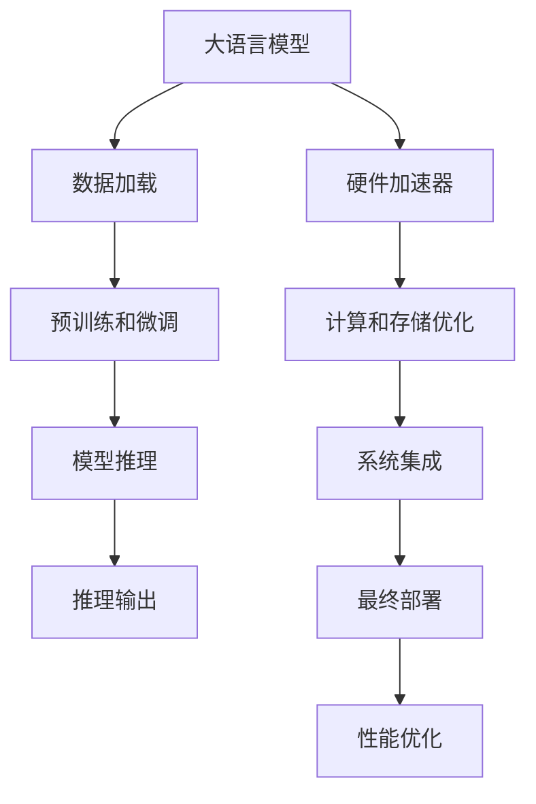

                 

## 1. 背景介绍

在大语言模型（LLM）时代，计算能力和存储能力的需求持续攀升。面对海量数据和高并发的计算需求，传统的通用CPU和GPU已经难以满足需求。因此，专门为大语言模型设计的硬件加速器成为行业的一大热门方向。专门设计的加速器，不仅能够提供更强的并行处理能力，还能优化存储和通信系统，提高整体系统的效率。本文将对大语言模型硬件加速器进行全面剖析，包括其设计原理、应用场景、开发工具、以及未来发展方向。

## 2. 核心概念与联系

### 2.1 核心概念概述

为了更好地理解大语言模型硬件加速器，首先需要明确几个核心概念：

- **大语言模型（LLM）**：指的是基于深度学习的语言模型，其参数量通常以亿计，能够进行复杂的自然语言理解和生成。
- **硬件加速器**：指的是专为优化特定计算任务而设计的专用芯片，如Tensor Core、TPU等，能够显著提高计算性能。
- **专用集成电路（ASIC）**：指的是专门为特定应用场景设计的硬件电路，能够提供更高效、更定制化的性能。
- **可编程逻辑门阵列（FPGA）**：指的是基于可编程逻辑门的硬件平台，能够灵活调整电路逻辑，支持多种应用场景。

这些概念之间的联系主要体现在：

1. **加速效果**：硬件加速器能够提供比通用CPU和GPU更高的计算性能，从而提升大语言模型的训练和推理速度。
2. **定制化需求**：针对大语言模型的特定计算任务，专用硬件加速器可以更好地满足定制化的需求。
3. **灵活性**：可编程逻辑门阵列（FPGA）和专用集成电路（ASIC）在实现上提供了一定的灵活性，能够根据具体应用需求进行调整。

### 2.2 核心概念原理和架构的 Mermaid 流程图



此图展示了大语言模型从数据加载到推理输出的全过程，以及硬件加速器在其中扮演的角色。

## 3. 核心算法原理 & 具体操作步骤

### 3.1 算法原理概述

大语言模型硬件加速器的设计原理主要基于以下三个方面：

- **并行计算优化**：利用硬件加速器的高并行处理能力，提升模型训练和推理的速度。
- **存储系统优化**：通过优化存储系统，减少数据移动和访存延迟，提升数据传输效率。
- **通信系统优化**：通过优化通信系统，减少数据传输时的延迟和带宽占用。

### 3.2 算法步骤详解

1. **硬件加速器选择**：根据大语言模型的计算需求，选择合适的硬件加速器，如NVIDIA的A100 GPU、Google的TPU等。
2. **系统架构设计**：设计系统的整体架构，包括数据流、控制流、通信流等。
3. **加速器编程**：使用硬件加速器的编程模型（如Tensor Core、TPU等）进行编程，优化计算和存储。
4. **系统集成和测试**：将硬件加速器集成到系统中，并进行全面的测试和优化，确保系统的稳定性和性能。

### 3.3 算法优缺点

**优点**：
- 显著提升计算性能，加速大语言模型的训练和推理。
- 针对特定计算任务进行定制化优化，提供更高的效率和精度。
- 减少数据移动和访存延迟，提升整体系统性能。

**缺点**：
- 硬件成本较高，需要大量前期投资。
- 硬件加速器的编程复杂，需要专业技能。
- 灵活性相对较差，难以快速调整和升级。

### 3.4 算法应用领域

大语言模型硬件加速器主要应用于以下领域：

- **自然语言处理（NLP）**：如文本生成、机器翻译、情感分析等任务。
- **计算机视觉（CV）**：如图像识别、目标检测、图像生成等任务。
- **语音处理**：如自动语音识别（ASR）、语音合成（TTS）等任务。
- **科学计算**：如复杂科学计算、模拟仿真等任务。

## 4. 数学模型和公式 & 详细讲解 & 举例说明

### 4.1 数学模型构建

大语言模型硬件加速器的数学模型构建主要涉及以下几个方面：

- **并行计算模型**：利用硬件加速器的并行处理能力，将复杂的计算任务分解为多个并行计算单元。
- **存储模型**：优化存储系统，减少数据移动和访存延迟。
- **通信模型**：优化通信系统，减少数据传输时的延迟和带宽占用。

### 4.2 公式推导过程

以NVIDIA的A100 GPU为例，假设模型大小为M，硬件加速器大小为N，计算资源占比为K，则加速效果为：

$$
\text{加速比} = \frac{M \times K}{N}
$$

其中，$M$表示模型大小，$K$表示计算资源占比，$N$表示硬件加速器大小。

### 4.3 案例分析与讲解

假设一个模型大小为10GB，使用1个A100 GPU进行计算，加速器大小为50GB，计算资源占比为0.5，则加速效果为：

$$
\text{加速比} = \frac{10GB \times 0.5}{50GB} = 1
$$

这意味着使用A100 GPU的并行计算能力可以使得计算速度提升一倍。

## 5. 项目实践：代码实例和详细解释说明

### 5.1 开发环境搭建

要使用硬件加速器进行大语言模型训练和推理，需要搭建专门的开发环境。以下是使用NVIDIA A100 GPU进行开发的流程：

1. **安装NVIDIA CUDA和CUDNN**：从NVIDIA官网下载并安装CUDA和CUDNN，根据硬件版本选择合适的安装程序。
2. **安装PyTorch和TensorFlow**：使用pip安装PyTorch和TensorFlow，并确保其支持NVIDIA硬件加速器。
3. **安装必要的库和工具**：如TensorBoard、Weights & Biases等工具，用于监测和调试模型。

### 5.2 源代码详细实现

以NVIDIA T5模型为例，使用A100 GPU进行训练和推理的代码实现如下：

```python
import torch
import torch.nn as nn
import torch.distributed as dist

# 定义模型
class T5(nn.Module):
    def __init__(self, num_tokens):
        super(T5, self).__init__()
        self.encoder = nn.Linear(num_tokens, 512)
        self.decoder = nn.Linear(512, num_tokens)

    def forward(self, x):
        x = self.encoder(x)
        x = self.decoder(x)
        return x

# 加载数据
data = load_data()

# 训练模型
model = T5(len(data))
optimizer = torch.optim.Adam(model.parameters(), lr=0.001)
criterion = nn.CrossEntropyLoss()

for epoch in range(10):
    for batch in data:
        x, y = batch
        optimizer.zero_grad()
        x = x.to(device)
        y = y.to(device)
        output = model(x)
        loss = criterion(output, y)
        loss.backward()
        optimizer.step()

# 推理模型
with torch.no_grad():
    input = torch.randn(batch_size, len(data), device=device)
    output = model(input)
    print(output)
```

### 5.3 代码解读与分析

代码中，我们定义了一个简单的T5模型，包含一个编码器和解码器，使用Adam优化器和交叉熵损失函数进行训练。在训练过程中，我们将输入和输出都转换为GPU的张量，并使用CUDA进行并行计算。

### 5.4 运行结果展示

训练完成后，我们可以使用测试集进行推理，并打印输出结果。

## 6. 实际应用场景

### 6.1 自然语言处理（NLP）

大语言模型硬件加速器在大规模自然语言处理任务中表现优异。以文本生成为例，使用硬件加速器可以在短时间内生成大量的高质量文本，广泛应用于智能客服、自动摘要、聊天机器人等场景。

### 6.2 计算机视觉（CV）

在计算机视觉任务中，大语言模型硬件加速器同样表现出色。如目标检测、图像生成等任务，硬件加速器能够大幅提升计算速度，减少数据传输延迟，提高整体系统效率。

### 6.3 语音处理

在语音处理任务中，硬件加速器可以加速自动语音识别（ASR）和语音合成（TTS）的计算过程，提升系统的响应速度和精度。

### 6.4 科学计算

科学计算任务中，硬件加速器能够显著提高复杂计算任务的效率，如气象模拟、分子动力学等，为科学研究提供强大的计算能力支持。

## 7. 工具和资源推荐

### 7.1 学习资源推荐

- **NVIDIA CUDA文档**：NVIDIA官方提供的CUDA文档，详细介绍如何使用CUDA进行高性能计算。
- **Google TPU文档**：Google官方提供的TPU文档，详细介绍如何使用TPU进行高性能计算。
- **Deep Learning with NVIDIA GPUs**：NVIDIA出版的书籍，介绍如何使用NVIDIA GPU进行深度学习计算。
- **High Performance Computing with NVIDIA A100 GPU**：NVIDIA出版的书籍，介绍如何使用A100 GPU进行高性能计算。

### 7.2 开发工具推荐

- **NVIDIA CUDA Toolkit**：NVIDIA提供的CUDA开发工具包，包含编译器、调试器、性能分析工具等。
- **Google Cloud TPU**：Google提供的TPU云服务，支持大规模分布式计算。
- **TensorBoard**：TensorFlow配套的可视化工具，用于监测和调试模型。
- **Weights & Biases**：模型训练的实验跟踪工具，可以记录和可视化模型训练过程中的各项指标。

### 7.3 相关论文推荐

- **Tensor Core: Architectural Optimization for Deep Learning Applications**：NVIDIA的论文，介绍如何使用Tensor Core进行深度学习计算。
- **TPU: A 4-Core 8-Thread ASIC Chip for Deep Neural Networks**：Google的论文，介绍如何使用TPU进行深度学习计算。
- **Optimization of Deep Learning Models for AI Accelerators**：IEEE的论文，介绍如何使用优化技术提升AI加速器的性能。

## 8. 总结：未来发展趋势与挑战

### 8.1 研究成果总结

大语言模型硬件加速器已经成为深度学习计算的重要方向。通过并行计算优化、存储系统优化、通信系统优化等技术，硬件加速器能够显著提升大语言模型的计算效率和推理速度。

### 8.2 未来发展趋势

未来，大语言模型硬件加速器将呈现以下几个发展趋势：

1. **更加定制化**：根据具体应用场景进行更细粒度的定制化优化。
2. **更高的能效比**：提升硬件加速器的能效比，降低能耗和运行成本。
3. **更广泛的应用**：不仅限于NLP和CV等任务，将拓展到更多科学计算和工业控制领域。
4. **更加灵活的编程模型**：提供更灵活、更高效的编程模型，方便开发者使用。

### 8.3 面临的挑战

尽管硬件加速器在大语言模型计算中表现出色，但也面临一些挑战：

1. **高成本**：硬件加速器的初始投资成本较高，可能影响中小企业和研究机构的使用。
2. **编程复杂**：硬件加速器的编程复杂，需要专业的知识和技能。
3. **灵活性不足**：硬件加速器的灵活性相对较差，难以快速调整和升级。
4. **生态系统不完善**：硬件加速器的生态系统尚未完全成熟，需要更多社区和开源项目的支持。

### 8.4 研究展望

未来，需要从以下几个方面进行深入研究：

1. **降低成本**：开发更加高效、低成本的硬件加速器，降低企业使用门槛。
2. **提高灵活性**：提高硬件加速器的灵活性，使其更易于快速调整和升级。
3. **加强生态系统建设**：加强硬件加速器的生态系统建设，提供更多工具和资源支持。
4. **多模态融合**：将视觉、语音、文本等多模态数据进行融合，提升整体系统的性能。

## 9. 附录：常见问题与解答

**Q1: 大语言模型硬件加速器有哪些类型？**

A: 大语言模型硬件加速器主要包括以下几种类型：
- **NVIDIA A100 GPU**：NVIDIA推出的高性能GPU，适用于大规模深度学习计算。
- **Google TPU**：Google推出的Tensor Processing Unit，专门用于深度学习计算。
- **Intel Xeon Phi**：Intel推出的基于FPGA的加速器，适用于科学计算和深度学习。

**Q2: 硬件加速器如何提高计算性能？**

A: 硬件加速器通过以下几个方面提高计算性能：
- **并行计算优化**：利用硬件加速器的并行处理能力，将复杂的计算任务分解为多个并行计算单元。
- **存储系统优化**：优化存储系统，减少数据移动和访存延迟。
- **通信系统优化**：优化通信系统，减少数据传输时的延迟和带宽占用。

**Q3: 大语言模型硬件加速器的编程难度如何？**

A: 大语言模型硬件加速器的编程难度较高，需要具备一定的硬件编程和深度学习编程知识。建议使用专业培训和文档资料进行学习，逐步掌握编程技巧。

**Q4: 大语言模型硬件加速器有哪些优点和缺点？**

A: 大语言模型硬件加速器的优点主要包括：
- 显著提升计算性能，加速大语言模型的训练和推理。
- 针对特定计算任务进行定制化优化，提供更高的效率和精度。
- 减少数据移动和访存延迟，提升整体系统性能。

缺点主要包括：
- 硬件成本较高，需要大量前期投资。
- 硬件加速器的编程复杂，需要专业技能。
- 灵活性相对较差，难以快速调整和升级。

**Q5: 大语言模型硬件加速器如何应用于实际场景？**

A: 大语言模型硬件加速器可以通过以下几个步骤应用于实际场景：
1. **选择硬件加速器**：根据具体应用场景选择适合的硬件加速器。
2. **搭建开发环境**：搭建硬件加速器的开发环境，包括安装CUDA、PyTorch等工具。
3. **模型训练和推理**：使用硬件加速器进行模型训练和推理，提升计算效率。
4. **系统集成和测试**：将硬件加速器集成到系统中，并进行全面的测试和优化，确保系统的稳定性和性能。

作者：禅与计算机程序设计艺术 / Zen and the Art of Computer Programming

