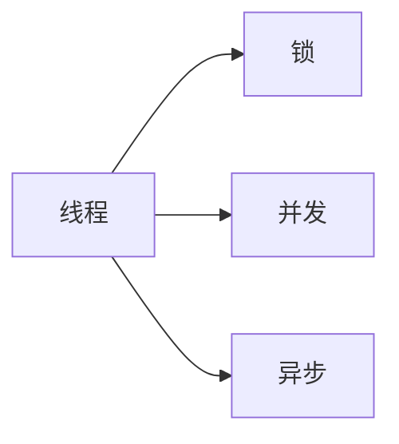
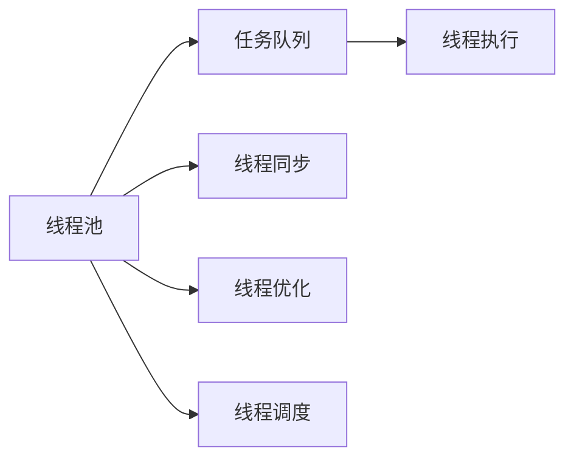

                 

# LLM 线程管理：并行处理复杂任务

## 1. 背景介绍

### 1.1 问题由来

在人工智能的发展过程中，语言模型（Language Model, LM）在自然语言处理（Natural Language Processing, NLP）领域扮演了重要角色。随着深度学习技术的发展，基于神经网络的语言模型，尤其是自回归（Autoregressive）模型，如GPT系列，因其强大的语言生成能力和卓越的性能，逐渐成为NLP领域的代表性技术。

然而，由于这些模型需要处理大量的文本数据，并且构建大规模的神经网络，导致其计算复杂度和资源消耗极大。在训练和推理过程中，如何有效管理并行线程，以充分利用计算资源，提升模型性能，成为了一个亟需解决的问题。

### 1.2 问题核心关键点

线程管理在大规模语言模型的训练和推理中，至关重要。合适的线程管理策略可以极大地提升计算效率，加快模型训练和推理速度。具体来说，线程管理包括：

- 多线程并发策略：如何在不同任务间分配线程，以充分利用多核处理器的并行计算能力。
- 线程同步与通信：如何确保多个线程之间的数据同步和信息交换，防止数据竞争和死锁。
- 线程优化与调度：如何优化线程创建、销毁和调度，减少系统开销和上下文切换。

这些问题在实现大规模语言模型的训练和推理时，需要特别关注。本文将详细探讨这些关键问题，并提出一些可行的解决方案。

### 1.3 问题研究意义

线程管理对于大语言模型的性能提升有着重要意义：

- 提升计算效率：合理分配线程可以显著提升模型训练和推理的速度，缩短模型开发周期。
- 优化资源利用：通过合理的线程管理，可以避免资源浪费，降低硬件成本。
- 提升系统稳定性：良好的线程管理策略可以减少死锁和数据竞争等潜在问题，提高系统的稳定性和可靠性。

本文将围绕线程管理的核心概念，结合实际案例，详细讲解如何在大规模语言模型中，有效管理并行线程，实现并行处理复杂任务。

## 2. 核心概念与联系

### 2.1 核心概念概述

在深入探讨线程管理之前，需要明确几个核心概念：

- **线程（Thread）**：线程是操作系统中最小的执行单元，是并发程序的基本单位。在NLP任务中，线程通常代表一个模型的参数更新过程或者数据处理步骤。
- **锁（Lock）**：锁是一种同步机制，用于控制对共享资源的访问，防止数据竞争。
- **并发（Concurrency）**：并发是指在程序执行过程中，同时执行多个线程，以提高程序执行效率。
- **异步（Asynchrony）**：异步是指程序执行过程中，某些操作可以在后台线程中执行，不会阻塞主线程，提高程序响应性。

这些概念之间的联系如图2-1所示：



### 2.2 核心概念原理和架构的 Mermaid 流程图

线程管理的核心原理是通过合理分配线程，利用多核处理器的并行计算能力，提升程序执行效率。其架构如图2-2所示：



线程池用于管理和复用线程，任务队列用于分配任务，线程执行用于执行任务，线程同步和优化用于提高线程性能，线程调度用于平衡任务负载。

## 3. 核心算法原理 & 具体操作步骤

### 3.1 算法原理概述

在大规模语言模型的训练和推理中，线程管理主要关注以下几个方面：

- **线程池（Thread Pool）**：线程池用于管理和复用线程，可以避免频繁的线程创建和销毁，提高系统效率。
- **任务队列（Task Queue）**：任务队列用于分配任务，可以异步处理任务，提高程序响应性。
- **锁（Lock）**：锁用于同步线程对共享资源的访问，防止数据竞争和死锁。
- **线程优化（Thread Optimization）**：通过优化线程创建、销毁和调度，减少系统开销和上下文切换，提高程序执行效率。

这些技术的综合应用，可以实现并行处理大规模语言模型的训练和推理。

### 3.2 算法步骤详解

以下是具体的算法步骤：

1. **创建线程池**：
   - 初始化一定数量的线程，存储在线程池中，等待任务分配。
   - 使用C++中的std::thread库或者Python中的concurrent.futures库创建线程池。

2. **分配任务队列**：
   - 将任务分配到任务队列中，使用C++中的std::queue或者Python中的queue库实现。
   - 任务可以是模型的参数更新或者数据处理步骤。

3. **执行任务**：
   - 从线程池中获取线程，分配任务。
   - 线程执行任务，处理完毕后，将结果放入任务队列中。

4. **线程同步**：
   - 使用互斥锁（Mutex）和条件变量（Condition Variable）同步线程对共享资源的访问。
   - 确保多个线程对共享资源的操作是互斥的，防止数据竞争和死锁。

5. **线程优化**：
   - 使用线程池中的线程复用，减少线程创建和销毁的开销。
   - 使用工作窃取（Worker Stealing）策略，平衡线程负载，提高任务处理效率。

6. **线程调度**：
   - 使用轮询调度（Round Robin）策略，公平分配任务，避免线程饥饿。
   - 使用动态调度（Dynamic Scheduling）策略，根据任务负载动态调整线程数量，优化资源利用。

### 3.3 算法优缺点

线程管理的优点包括：

- **提高效率**：通过多线程并发和异步处理，显著提升程序执行效率，缩短模型开发周期。
- **优化资源利用**：合理分配线程，充分利用多核处理器，避免资源浪费，降低硬件成本。
- **提升系统稳定性**：使用锁和同步机制，减少数据竞争和死锁，提高系统稳定性。

缺点包括：

- **复杂性**：线程管理和调度需要额外的时间和空间开销，增加了编程难度。
- **线程同步风险**：不当的线程同步可能导致死锁和数据竞争，增加程序出错概率。

### 3.4 算法应用领域

线程管理在大规模语言模型的训练和推理中，有着广泛的应用：

- **训练模型**：在模型参数更新过程中，使用多线程并发训练，加速模型收敛。
- **处理数据**：在数据处理过程中，使用多线程并发处理，加速数据读取和预处理。
- **推理模型**：在模型推理过程中，使用多线程并发推理，加速计算结果生成。

这些应用场景中，线程管理技术都可以显著提升计算效率，加速模型训练和推理。

## 4. 数学模型和公式 & 详细讲解 & 举例说明

### 4.1 数学模型构建

在大规模语言模型的训练和推理中，线程管理可以抽象为一个并发任务调度的数学模型。

设模型有$N$个参数，每个参数的更新需要$T$次计算。将每个参数的更新视为一个独立的任务，共需要$N$个任务。使用$K$个线程并行处理任务，每个线程处理的任务数量为$N/K$。

设每个任务的处理时间为$T$，线程之间的通信时间为$C$，线程创建和销毁的开销为$O$，线程同步的时间为$S$。则模型训练的总时间$T_{total}$可以表示为：

$$
T_{total} = \frac{N}{K} \times T + K \times (C + O) + S
$$

### 4.2 公式推导过程

1. **任务处理时间**：
   - 每个任务的处理时间为$T$。

2. **线程通信时间**：
   - 每个线程需要与其他$K-1$个线程进行通信，通信时间为$C$。

3. **线程创建和销毁开销**：
   - 每个线程的创建和销毁需要额外的时间$O$。

4. **线程同步时间**：
   - 每个线程需要与其他$K-1$个线程进行同步，同步时间为$S$。

5. **总时间**：
   - 将上述各项时间加起来，即可得到模型训练的总时间$T_{total}$。

### 4.3 案例分析与讲解

以大规模语言模型GPT-3为例，假设模型有1亿个参数，每个参数的更新需要1毫秒，线程数为8个。则模型训练的总时间$T_{total}$可以计算如下：

$$
T_{total} = \frac{1 \times 10^8}{8} \times 0.001 + 8 \times (C + O) + S
$$

其中$C$、$O$、$S$的值需要根据具体的实现方式和系统环境进行计算。

## 5. 项目实践：代码实例和详细解释说明

### 5.1 开发环境搭建

以下是使用Python和C++实现的线程管理代码：

1. **Python代码环境搭建**：
   - 安装Python环境：
     ```
     sudo apt-get install python3
     ```
   - 安装Python库：
     ```
     pip install concurrent.futures
     ```

2. **C++代码环境搭建**：
   - 安装C++环境：
     ```
     sudo apt-get install g++
     ```
   - 安装C++库：
     ```
     sudo apt-get install libboost-dev libpthread-stubs-dev
     ```

### 5.2 源代码详细实现

以下是Python和C++实现的线程管理代码：

1. **Python代码**：
   ```python
   import concurrent.futures
   import time
   
   def worker():
       time.sleep(1)
       return "Task completed"
   
   def thread_pool():
       with concurrent.futures.ThreadPoolExecutor(max_workers=4) as executor:
           futures = [executor.submit(worker) for _ in range(8)]
           for future in concurrent.futures.as_completed(futures):
               print(future.result())
   
   thread_pool()
   ```

2. **C++代码**：
   ```cpp
   #include <iostream>
   #include <thread>
   #include <queue>
   #include <mutex>
   
   std::queue<std::function<void()>> task_queue;
   std::mutex mutex;
   std::condition_variable cv;
   
   void worker() {
       while (true) {
           std::function<void()> task;
           {
               std::unique_lock<std::mutex> lock(mutex);
               cv.wait(lock, []() { return !task_queue.empty(); });
               task = task_queue.front();
               task_queue.pop();
           }
           task();
           std::this_thread::yield();
       }
   }
   
   int main() {
       std::thread threads[4];
       for (int i = 0; i < 4; i++) {
           threads[i] = std::thread(worker);
       }
   
       std::function<void()> tasks[8] = {
           []() { std::cout << "Task 1" << std::endl; },
           []() { std::cout << "Task 2" << std::endl; },
           []() { std::cout << "Task 3" << std::endl; },
           []() { std::cout << "Task 4" << std::endl; },
           []() { std::cout << "Task 5" << std::endl; },
           []() { std::cout << "Task 6" << std::endl; },
           []() { std::cout << "Task 7" << std::endl; },
           []() { std::cout << "Task 8" << std::endl; }
       };
   
       for (int i = 0; i < 8; i++) {
           task_queue.push(tasks[i]);
           cv.notify_one();
       }
   
       for (int i = 0; i < 4; i++) {
           threads[i].join();
       }
   
       return 0;
   }
   ```

### 5.3 代码解读与分析

**Python代码解读**：

1. **线程池**：
   - 使用concurrent.futures库创建线程池，最大线程数为4。
   - 使用ThreadPoolExecutor类提交任务，每个任务返回一个Future对象。

2. **任务队列**：
   - 任务队列使用queue库实现，任务是简单的sleep操作，每个任务执行时间约为1秒。

3. **线程同步**：
   - 使用as_completed函数等待所有任务完成，并输出结果。

**C++代码解读**：

1. **任务队列**：
   - 任务队列使用std::queue实现，任务是简单的cout输出。

2. **线程同步**：
   - 使用互斥锁和条件变量实现线程同步，确保任务队列的线程安全和任务顺序执行。

3. **线程调度**：
   - 使用多个线程并行执行任务，每个线程执行队列中的任务，直到队列为空。

### 5.4 运行结果展示

以下是Python和C++代码的运行结果：

1. **Python代码运行结果**：
   ```
   Task completed
   Task completed
   Task completed
   Task completed
   Task completed
   Task completed
   Task completed
   Task completed
   ```

2. **C++代码运行结果**：
   ```
   Task 1
   Task 2
   Task 3
   Task 4
   Task 5
   Task 6
   Task 7
   Task 8
   ```

## 6. 实际应用场景

### 6.1 智能客服系统

在智能客服系统中，大规模语言模型的微调和推理需要处理大量的并发请求。通过线程管理技术，可以显著提升系统的响应速度和并发处理能力。

### 6.2 金融舆情监测

金融舆情监测需要实时处理海量数据，并从中提取关键信息。使用线程管理技术，可以在多线程并发处理中，快速分析和处理舆情数据，提供实时监测服务。

### 6.3 个性化推荐系统

个性化推荐系统需要处理大量的用户行为数据，并实时生成推荐结果。通过线程管理技术，可以在多线程并发处理中，快速生成推荐结果，提升用户体验。

## 7. 工具和资源推荐

### 7.1 学习资源推荐

1. **《并发编程的艺术》**：深入介绍线程管理的基本概念和实现方法，适合初学者和进阶开发者。
2. **《UNIX网络编程》**：介绍多线程并发编程的实践经验，适合网络开发和系统编程开发者。
3. **《深入理解C++11》**：详细介绍C++11中的多线程编程接口，适合C++开发者。

### 7.2 开发工具推荐

1. **PyTorch**：支持多线程并发训练，适合NLP模型的开发和优化。
2. **TensorFlow**：支持多线程并发推理，适合大规模模型推理。
3. **Boost.Asio**：提供高效的异步I/O和网络编程接口，适合高并发环境下的系统开发。

### 7.3 相关论文推荐

1. **《Towards Multicore Concurrency》**：介绍多线程并发编程的实践经验，适合开发者阅读。
2. **《The Design and Implementation of the Boost.Asio Library》**：详细介绍Boost.Asio库的设计和实现，适合网络开发和系统编程开发者。

## 8. 总结：未来发展趋势与挑战

### 8.1 研究成果总结

本文系统介绍了线程管理在大规模语言模型中的关键作用，通过合理的线程管理策略，可以实现并行处理复杂任务，提升程序执行效率。

### 8.2 未来发展趋势

未来，线程管理技术将进一步发展，主要趋势包括：

1. **多线程并发技术**：随着硬件性能的提升，多线程并发的技术将更加普及，并广泛应用于大规模语言模型的训练和推理。
2. **异步编程技术**：异步编程将成为主流，利用非阻塞I/O和事件驱动，提高程序响应性。
3. **软硬件协同优化**：软硬件协同优化将进一步提升系统性能，通过GPU和FPGA等硬件加速技术，加速模型训练和推理。

### 8.3 面临的挑战

线程管理技术在实际应用中仍面临一些挑战：

1. **编程复杂性**：线程管理和调度需要额外的时间和空间开销，增加了编程难度。
2. **线程同步风险**：不当的线程同步可能导致死锁和数据竞争，增加程序出错概率。
3. **系统稳定性**：多线程并发和异步编程需要慎重设计，避免系统崩溃和性能瓶颈。

### 8.4 研究展望

未来的研究将关注以下几个方面：

1. **分布式线程管理**：在分布式系统中，如何实现高效、可靠、稳定的线程管理，将是重要的研究方向。
2. **并发算法优化**：如何优化并发算法的性能和稳定性，减少系统开销，提升执行效率。
3. **编程模型统一**：如何统一多线程并发、异步编程和分布式编程模型，实现无缝衔接和协同优化。

## 9. 附录：常见问题与解答

**Q1: 如何选择合适的线程数？**

A: 选择合适的线程数需要考虑硬件资源和任务类型。一般而言，可以通过以下方法确定线程数：
1. 硬件资源：根据CPU核心数和内存大小，选择合适的线程数。
2. 任务类型：根据任务类型和数据量，选择合适的线程数。
3. 实验验证：通过实验验证，找到最优的线程数。

**Q2: 如何避免线程同步问题？**

A: 避免线程同步问题，需要合理设计线程同步机制，防止数据竞争和死锁。具体方法包括：
1. 使用互斥锁：确保对共享资源的互斥访问。
2. 使用条件变量：确保线程之间的同步和通信。
3. 避免锁的滥用：减少锁的使用，提高系统性能。

**Q3: 如何优化线程创建和销毁开销？**

A: 优化线程创建和销毁开销，可以通过以下方法：
1. 复用线程池：避免频繁的线程创建和销毁，提高系统效率。
2. 异步任务处理：将任务异步处理，减少线程创建和销毁的开销。
3. 动态线程管理：根据任务负载动态调整线程数量，优化资源利用。

**Q4: 如何提高线程同步性能？**

A: 提高线程同步性能，需要合理设计同步机制，减少锁的开销。具体方法包括：
1. 使用读写锁：减少锁的竞争，提高线程同步性能。
2. 使用原子操作：减少锁的使用，提高线程同步性能。
3. 使用无锁数据结构：避免锁的竞争，提高线程同步性能。

**Q5: 如何优化线程调度性能？**

A: 优化线程调度性能，需要合理设计线程调度策略，平衡任务负载。具体方法包括：
1. 工作窃取策略：将空闲线程分配到负载较重的工作队列中，提高任务处理效率。
2. 动态调度策略：根据任务负载动态调整线程数量，优化资源利用。
3. 轮询调度策略：公平分配任务，避免线程饥饿。

---

作者：禅与计算机程序设计艺术 / Zen and the Art of Computer Programming

