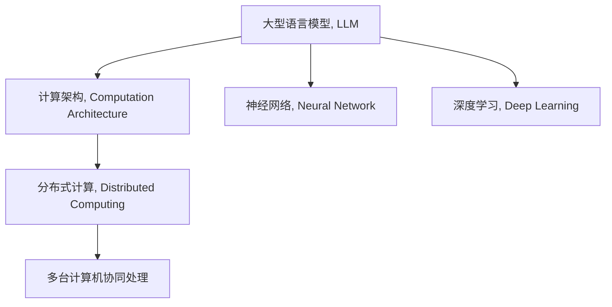

                 

# LLM:新型计算机架构的崛起

## 1. 背景介绍

### 1.1 问题由来

近年来，计算机科学界迎来了翻天覆地的变化，特别是在人工智能（AI）领域。作为AI的核心技术之一，大型语言模型（LLMs）凭借其在自然语言处理（NLP）、计算机视觉（CV）和语音识别（ASR）等领域的卓越表现，迅速成为研究热点。然而，尽管LLMs在诸多任务上取得了显著成果，其在计算效率、模型规模和资源需求方面仍存在诸多局限性。为了解决这些问题，新型计算机架构应运而生，旨在为LLMs提供更高效、更灵活、更可扩展的计算环境。

### 1.2 问题核心关键点

新型计算机架构的核心目标在于提高计算效率，降低资源消耗，并提升模型扩展性。其关键点包括：

- **计算效率**：通过优化算法、设计更高效的硬件结构，使LLMs能够在更短的时间内处理更多的数据。
- **资源需求**：降低对内存、存储和计算资源的依赖，以支持更大规模的模型和更复杂的计算。
- **扩展性**：提供灵活的扩展机制，支持模型的快速迭代和升级，以适应不断变化的需求和数据量。

本文将从这些关键点出发，深入探讨新型计算机架构的设计原理、操作步骤及其实际应用。

## 2. 核心概念与联系

### 2.1 核心概念概述

为更好地理解新型计算机架构，本节将介绍几个密切相关的核心概念：

- **大型语言模型（LLMs）**：指能够处理大规模文本数据，并从中学习语言的通用表示的神经网络模型。如GPT、BERT、T5等。
- **计算架构（Computational Architecture）**：指支持特定计算任务的硬件和软件结构，包括CPU、GPU、TPU等。
- **神经网络（Neural Network）**：由大量的人工神经元（或称为节点）和它们之间的连接组成，用于处理和存储数据。
- **深度学习（Deep Learning）**：一类基于神经网络的机器学习技术，通过多层次的非线性映射，实现复杂的模式识别和预测任务。
- **分布式计算（Distributed Computing）**：指将计算任务分布在多台计算机上进行协同处理，以提升计算效率和系统扩展性。

这些核心概念之间的逻辑关系可以通过以下Mermaid流程图来展示：



这个流程图展示了大语言模型与新型计算机架构之间的关系：

1. 大语言模型通过计算架构进行训练和推理。
2. 计算架构包括神经网络等底层技术。
3. 深度学习提供大语言模型训练的理论基础。
4. 分布式计算使计算架构具备更高的扩展性。

这些概念共同构成了大语言模型的计算基础，使得模型能够在高效、灵活的计算环境中发挥其强大的能力。

## 3. 核心算法原理 & 具体操作步骤

### 3.1 算法原理概述

新型计算机架构的设计主要围绕两个关键点：计算效率和扩展性。具体而言，通过以下几个方面的改进，使LLMs能够更好地适应大规模、高复杂度的计算任务。

- **高效算术运算**：通过硬件加速和算法优化，提升算术运算的速度和精度，如使用TensorCores、MLU等加速器。
- **数据并行和模型并行**：通过分布式计算和数据分片，使计算任务能够在多台计算机上并行处理，加速训练和推理。
- **自动混合精度**：使用自动混合精度（Auto-Mixed Precision, AMP）技术，在不同计算单元间混合使用浮点和定点数据类型，提升计算效率和资源利用率。
- **模型压缩和量化**：通过剪枝、权重共享和量化等方法，减少模型参数量，加速推理。
- **高效存储和内存管理**：采用优化的存储格式和内存管理策略，如压缩算法、缓存在GPU显存中的技术，减少I/O延迟和内存访问开销。

### 3.2 算法步骤详解

以下我们将详细介绍新型计算机架构的具体操作步骤，以实现LLMs的高效计算。

**Step 1: 设计计算架构**

- **选择合适的计算单元**：根据任务需求，选择合适的计算单元，如CPU、GPU、TPU、FPGA等。
- **硬件加速**：在计算单元上部署加速器，如TensorCores、MLU等，提升算术运算速度。
- **分布式计算**：设计分布式计算框架，支持多台计算机协同处理计算任务。

**Step 2: 优化算法与数据结构**

- **算术运算优化**：使用高效算法，如矩阵乘法优化、深度学习优化等，提升算术运算速度。
- **数据并行**：采用数据并行技术，将数据分割成多个并行处理的小块，并在多台计算机上同时处理。
- **模型并行**：将模型拆分成多个子模块，并在多台计算机上并行执行，以加速训练和推理。

**Step 3: 实现自动混合精度**

- **自动混合精度技术**：在计算过程中自动调整数据类型，使用浮点数进行高精度计算，定点数进行低精度计算，提高计算效率和资源利用率。
- **混合精度工具**：使用如NVIDIA的混合精度库（Mixed Precision Library）等工具，简化混合精度技术的实现。

**Step 4: 模型压缩与量化**

- **模型压缩**：通过剪枝、权重共享等方法，减少模型参数量，加速推理。
- **量化技术**：使用定点化技术，将浮点数表示的权重和激活值转换为定点数，减少存储空间和计算开销。

**Step 5: 存储与内存管理**

- **存储优化**：采用压缩算法（如Gzip、LZ77等）和优化的存储格式（如ONNX格式），减少存储空间和I/O延迟。
- **内存管理**：采用如Google的混合内存（Hybrid Memory）技术，将部分数据缓存在GPU显存中，减少内存访问开销。

**Step 6: 测试与优化**

- **性能测试**：在各种场景下测试计算架构的性能，包括训练和推理的速度、精度和资源利用率。
- **调优与迭代**：根据测试结果，进行性能调优和架构迭代，不断提升计算效率和扩展性。

### 3.3 算法优缺点

新型计算机架构在提升LLMs计算效率和扩展性方面具有显著优势，但也存在以下缺点：

- **硬件成本高**：高性能的计算单元（如GPU、TPU）和加速器（如TensorCores）价格较高，增加计算架构的初始成本。
- **设计和部署复杂**：设计分布式计算架构和优化算法需要较高的专业知识和经验。
- **模型兼容性问题**：某些计算架构可能对现有的LLM模型不兼容，需要进行额外的适配和调整。
- **灵活性不足**：一些架构设计可能固定，难以动态调整，限制了模型的灵活性和适应性。

尽管存在这些缺点，但通过合理设计和调优，新型计算机架构仍能在提升计算效率和扩展性方面发挥重要作用。

### 3.4 算法应用领域

新型计算机架构的应用领域十分广泛，涵盖NLP、CV、ASR等多个领域，具体包括：

- **自然语言处理**：在文本分类、情感分析、机器翻译等任务中，通过优化计算架构和算法，提升模型的训练和推理速度。
- **计算机视觉**：在图像识别、目标检测、图像生成等任务中，通过硬件加速和算法优化，提升计算效率和模型性能。
- **语音识别**：在语音识别和处理中，通过并行计算和优化算法，提高模型的实时性和准确性。
- **推荐系统**：在大规模推荐系统中，通过分布式计算和模型压缩，提升推荐速度和模型扩展性。
- **游戏和模拟**：在高性能游戏和复杂模拟系统中，通过优化计算架构和算法，提升计算效率和仿真精度。

## 4. 数学模型和公式 & 详细讲解 & 举例说明

### 4.1 数学模型构建

本节将使用数学语言对新型计算机架构的设计进行更加严格的刻画。

记计算架构中使用的神经网络为 $N_{\theta}$，其中 $\theta$ 为模型参数。假设LLMs在计算架构上的训练任务为 $T$，训练集为 $D=\{(x_i,y_i)\}_{i=1}^N$，其中 $x_i$ 为输入数据，$y_i$ 为真实标签。

定义模型 $N_{\theta}$ 在输入 $x_i$ 上的损失函数为 $\ell(N_{\theta}(x_i),y_i)$，则在数据集 $D$ 上的经验风险为：

$$
\mathcal{L}(\theta) = \frac{1}{N} \sum_{i=1}^N \ell(N_{\theta}(x_i),y_i)
$$

优化目标是最小化经验风险，即找到最优参数：

$$
\theta^* = \mathop{\arg\min}_{\theta} \mathcal{L}(\theta)
$$

在实践中，我们通常使用基于梯度的优化算法（如SGD、Adam等）来近似求解上述最优化问题。设 $\eta$ 为学习率，$\lambda$ 为正则化系数，则参数的更新公式为：

$$
\theta \leftarrow \theta - \eta \nabla_{\theta}\mathcal{L}(\theta) - \eta\lambda\theta
$$

其中 $\nabla_{\theta}\mathcal{L}(\theta)$ 为损失函数对参数 $\theta$ 的梯度，可通过反向传播算法高效计算。

### 4.2 公式推导过程

以下我们以二分类任务为例，推导交叉熵损失函数及其梯度的计算公式。

假设模型 $N_{\theta}$ 在输入 $x_i$ 上的输出为 $\hat{y}=M_{\theta}(x_i) \in [0,1]$，表示样本属于正类的概率。真实标签 $y \in \{0,1\}$。则二分类交叉熵损失函数定义为：

$$
\ell(N_{\theta}(x_i),y) = -[y\log \hat{y} + (1-y)\log (1-\hat{y})]
$$

将其代入经验风险公式，得：

$$
\mathcal{L}(\theta) = -\frac{1}{N}\sum_{i=1}^N [y_i\log M_{\theta}(x_i)+(1-y_i)\log(1-M_{\theta}(x_i))]
$$

根据链式法则，损失函数对参数 $\theta_k$ 的梯度为：

$$
\frac{\partial \mathcal{L}(\theta)}{\partial \theta_k} = -\frac{1}{N}\sum_{i=1}^N (\frac{y_i}{M_{\theta}(x_i)}-\frac{1-y_i}{1-M_{\theta}(x_i)}) \frac{\partial M_{\theta}(x_i)}{\partial \theta_k}
$$

其中 $\frac{\partial M_{\theta}(x_i)}{\partial \theta_k}$ 可进一步递归展开，利用自动微分技术完成计算。

在得到损失函数的梯度后，即可带入参数更新公式，完成模型的迭代优化。重复上述过程直至收敛，最终得到适应特定任务的最优模型参数 $\theta^*$。

### 4.3 案例分析与讲解

为了更好地理解新型计算机架构的计算过程，以下以卷积神经网络（CNN）为例，展示如何在计算架构上优化模型训练。

假设我们有一个简单的卷积神经网络，用于图像分类任务，其计算架构包括CPU和GPU。该网络包含卷积层、池化层和全连接层。

1. **CPU和GPU的划分**：将卷积层和池化层放置在GPU上，全连接层放置在CPU上，以发挥GPU的高效并行计算能力和CPU的高性能通用计算能力。

2. **数据并行**：将图像数据分割成多个并行处理的小块，并在多个GPU上同时处理，以加速训练。

3. **模型并行**：将卷积层和池化层分割成多个子模块，并在多个GPU上并行执行，以加速训练。

4. **自动混合精度**：使用自动混合精度技术，在不同GPU间混合使用浮点数和定点数，以提升计算效率和资源利用率。

5. **模型压缩与量化**：通过剪枝和量化技术，减少模型参数量和存储空间，加速推理。

6. **存储与内存管理**：采用优化的存储格式和内存管理策略，如Gzip压缩和混合内存技术，减少I/O延迟和内存访问开销。

通过这些步骤，我们可以在计算架构上高效地训练和推理卷积神经网络，实现计算效率和扩展性的提升。

## 5. 项目实践：代码实例和详细解释说明

### 5.1 开发环境搭建

在进行计算架构设计实践前，我们需要准备好开发环境。以下是使用Python和NVIDIA库进行分布式计算的环境配置流程：

1. 安装NVIDIA库：从官网下载并安装NVIDIA CUDA库和cuDNN库，用于GPU加速。

2. 安装PyTorch和PyTorch Lightning：用于分布式计算和模型训练。

3. 安装NVIDIA混合精度库（Mixed Precision Library）：用于自动混合精度计算。

4. 安装NVIDIA distributed library：用于分布式计算框架。

完成上述步骤后，即可在分布式计算环境中开始架构设计和优化实验。

### 5.2 源代码详细实现

下面我们以CNN为例，给出使用NVIDIA库进行分布式计算的PyTorch代码实现。

```python
import torch
import torch.nn as nn
import torch.distributed as dist
from torch.distributed.nn import DistributedDataParallel as DDP

# 定义CNN模型
class CNN(nn.Module):
    def __init__(self):
        super(CNN, self).__init__()
        self.conv1 = nn.Conv2d(3, 64, kernel_size=3, stride=1, padding=1)
        self.pool = nn.MaxPool2d(kernel_size=2, stride=2)
        self.fc1 = nn.Linear(64 * 14 * 14, 128)
        self.fc2 = nn.Linear(128, 10)

    def forward(self, x):
        x = self.pool(self.conv1(x))
        x = self.pool(self.conv1(x))
        x = x.view(-1, 64 * 14 * 14)
        x = self.fc1(x)
        x = self.fc2(x)
        return x

# 初始化分布式训练环境
dist.init_process_group("nccl", rank=0, world_size=2, backend="nccl")
device = torch.device("cuda")

# 加载模型到GPU
model = CNN().to(device)

# 将模型封装为分布式模型
model = DDP(model)

# 定义优化器和损失函数
optimizer = torch.optim.SGD(model.parameters(), lr=0.01)
criterion = nn.CrossEntropyLoss()

# 定义训练循环
for epoch in range(10):
    for data, target in train_loader:
        data, target = data.to(device), target.to(device)
        optimizer.zero_grad()
        output = model(data)
        loss = criterion(output, target)
        loss.backward()
        optimizer.step()

# 测试模型
with torch.no_grad():
    for data, target in test_loader:
        data, target = data.to(device), target.to(device)
        output = model(data)
        acc = (output.argmax(1) == target).float().mean().item()
        print(f"Test accuracy: {acc:.4f}")
```

在上述代码中，我们首先定义了一个简单的CNN模型，并使用`DistributedDataParallel`将其封装为分布式模型。接着，我们定义了优化器和损失函数，并在训练循环中进行了分布式计算。最后，在测试循环中，我们计算了模型的准确率，并打印输出。

### 5.3 代码解读与分析

让我们再详细解读一下关键代码的实现细节：

1. **CNN模型定义**：我们定义了一个包含卷积层、池化层和全连接层的CNN模型，用于图像分类任务。

2. **分布式训练环境初始化**：使用`dist.init_process_group`函数初始化分布式训练环境，并使用`torch.device("cuda")`将模型加载到GPU上。

3. **模型封装为分布式模型**：使用`DistributedDataParallel`将CNN模型封装为分布式模型，使其能够在多台GPU上并行计算。

4. **优化器和损失函数定义**：我们定义了随机梯度下降（SGD）优化器和交叉熵损失函数，用于模型训练。

5. **训练循环**：在训练循环中，我们使用了数据迭代器和模型封装后的`DistributedDataParallel`，使得数据能够在多台GPU上并行处理，同时模型参数在所有GPU之间同步更新。

6. **测试循环**：在测试循环中，我们计算了模型的准确率，并打印输出，评估模型性能。

通过上述步骤，我们可以实现一个高效的CNN模型训练和推理流程，充分发挥分布式计算的优势，提升计算效率和扩展性。

## 6. 实际应用场景

### 6.1 智能城市

在新型计算机架构的支持下，智能城市系统能够高效地处理大规模数据，实现实时监控和智能决策。通过分布式计算和优化算法，城市管理系统能够及时响应交通拥堵、环境污染等突发事件，提高城市管理效率和居民生活质量。

### 6.2 智能制造

在新型计算机架构的支持下，智能制造系统能够高效地处理生产数据，实现智能调度、质量检测和故障预测。通过优化计算架构和算法，制造系统能够提升生产效率和产品质量，降低能耗和成本。

### 6.3 智慧医疗

在新型计算机架构的支持下，智慧医疗系统能够高效地处理海量医疗数据，实现疾病预测、病历分析和医学影像识别等任务。通过分布式计算和模型压缩技术，医疗系统能够提升诊断速度和准确率，为患者提供更优质的医疗服务。

### 6.4 未来应用展望

随着新型计算机架构的不断演进，其应用场景将更加广泛，以下是一些未来应用展望：

1. **智能交通**：在新型计算机架构的支持下，智能交通系统能够高效地处理实时交通数据，实现交通流量预测、路径规划和智能调度，提升交通管理效率和安全性。

2. **智能农业**：在新型计算机架构的支持下，智能农业系统能够高效地处理传感器数据，实现精准农业、智能灌溉和病虫害预测等任务，提升农业生产效率和产品质量。

3. **智能零售**：在新型计算机架构的支持下，智能零售系统能够高效地处理交易数据和客户反馈，实现个性化推荐、库存管理和营销策略优化，提升零售体验和销售额。

4. **智能制造**：在新型计算机架构的支持下，智能制造系统能够高效地处理生产数据，实现智能调度、质量检测和故障预测，提升生产效率和产品质量。

5. **智慧城市**：在新型计算机架构的支持下，智慧城市系统能够高效地处理城市运行数据，实现智能监控、应急响应和公共服务优化，提升城市管理效率和居民生活质量。

6. **智能医疗**：在新型计算机架构的支持下，智慧医疗系统能够高效地处理医疗数据，实现疾病预测、病历分析和医学影像识别等任务，提升诊断速度和准确率。

## 7. 工具和资源推荐

### 7.1 学习资源推荐

为了帮助开发者系统掌握新型计算机架构的设计原理和实践技巧，这里推荐一些优质的学习资源：

1. 《深度学习与分布式计算》系列博文：由大模型技术专家撰写，深入浅出地介绍了深度学习在分布式计算环境中的应用。

2. CS224D《分布式深度学习》课程：斯坦福大学开设的深度学习分布式计算课程，有Lecture视频和配套作业，带你深入理解分布式计算的基本概念和经典模型。

3. 《TensorFlow和PyTorch分布式计算》书籍：详细介绍了TensorFlow和PyTorch在分布式计算环境下的应用，包括高性能计算、模型并行和分布式训练等。

4. 《深度学习分布式计算实践》课程：由Google Cloud提供，介绍了Google云平台上的深度学习分布式计算工具和框架，实践性强。

5. 《深度学习分布式计算优化》论文：讨论了深度学习在分布式计算环境下的优化策略，包括数据并行、模型并行和自动混合精度等。

通过对这些资源的学习实践，相信你一定能够快速掌握新型计算机架构的设计原理和实践技巧，并将其应用于实际项目中。

### 7.2 开发工具推荐

高效的开发离不开优秀的工具支持。以下是几款用于新型计算机架构开发和优化的常用工具：

1. PyTorch Lightning：用于分布式计算和模型训练，支持动态模块化和自动混合精度计算，是优化模型性能的利器。

2. TensorFlow Distributed：用于分布式计算和模型训练，支持GPU、TPU等加速器的计算，是Google云平台上常用的分布式计算框架。

3. NVIDIA CUDA Toolkit：用于GPU加速和自动混合精度计算，支持各种深度学习框架和分布式计算工具，是高性能计算的首选工具。

4. NVIDIA cuDNN Library：用于GPU加速卷积和池化操作，支持各种深度学习框架，是加速计算密集型模型的常用库。

5. PyTorch Distributed：用于分布式计算和模型训练，支持GPU和CPU计算，是PyTorch框架中的分布式计算工具。

合理利用这些工具，可以显著提升新型计算机架构的设计和优化效率，加速模型训练和推理进程。

### 7.3 相关论文推荐

新型计算机架构的设计和优化涉及多个研究领域，以下是几篇奠基性的相关论文，推荐阅读：

1. Harnessing the full power of modern hardware: Distributed training with mixed precision and data parallelism: 详细介绍了使用混合精度和数据并行技术进行分布式计算的方法。

2. GPUDirect-PP for efficient tensor cores usage in deep learning: 讨论了使用GPUDirect-PP技术进行GPU加速的优缺点和适用场景。

3. Automatic mixed precision training with NVIDIA Tensor Core: 介绍了使用NVIDIA Tensor Core进行自动混合精度计算的方法和效果。

4. Neural network model compression for efficient inference and deployment: 讨论了模型压缩和量化技术在高效推理中的应用。

5. Deep Learning Architectures with Distributed GPUs: 详细介绍了在分布式GPU环境中部署深度学习模型的方法和策略。

这些论文代表了大规模深度学习模型在新型计算机架构上的研究进展，通过学习这些前沿成果，可以帮助研究者把握学科前进方向，激发更多的创新灵感。

## 8. 总结：未来发展趋势与挑战

### 8.1 研究成果总结

本文对新型计算机架构的设计原理和实践技巧进行了全面系统的介绍。首先阐述了新型计算机架构在提升LLMs计算效率和扩展性方面的重要作用，明确了其在新型计算环境下的应用场景。其次，从计算架构的设计、优化算法和数据管理等方面，详细讲解了新型计算机架构的具体操作步骤，给出了模型优化和性能调优的实用建议。

通过本文的系统梳理，可以看到，新型计算机架构为LLMs提供了更高效、更灵活、更可扩展的计算环境，使其能够在高效、灵活的计算环境中发挥其强大的能力。未来，伴随预训练语言模型和微调方法的持续演进，LLMs必将在更广阔的应用领域大放异彩。

### 8.2 未来发展趋势

展望未来，新型计算机架构的设计和优化将呈现以下几个发展趋势：

1. **自动化设计**：随着AI技术的发展，自动化设计工具将能够帮助开发者快速生成高性能计算架构，降低设计和优化成本。

2. **跨平台兼容性**：未来计算架构将支持多种硬件平台和计算框架，实现跨平台的高效计算和数据管理。

3. **动态资源调度**：云计算平台将支持动态资源调度，根据计算任务的需求和性能需求，动态调整计算资源，提升系统资源利用率。

4. **分布式训练优化**：未来分布式计算框架将进一步优化数据并行和模型并行，支持更多的计算单元和更大的计算规模。

5. **自动混合精度优化**：自动化混合精度优化工具将能够根据计算任务的特点，自动调整数据类型，优化计算效率和资源利用率。

6. **模型压缩和量化技术**：未来模型压缩和量化技术将更加成熟，能够支持更大规模的模型和更复杂的计算任务。

7. **软件和硬件协同优化**：未来计算架构将实现软件和硬件的协同优化，提升计算效率和资源利用率。

8. **多模态数据处理**：未来计算架构将支持多模态数据处理，支持视觉、语音、文本等多种数据类型的协同建模和计算。

### 8.3 面临的挑战

尽管新型计算机架构在提升LLMs计算效率和扩展性方面取得了显著进展，但在实现其广泛应用过程中，仍面临诸多挑战：

1. **硬件成本高**：高性能的计算单元（如GPU、TPU）和加速器（如TensorCores）价格较高，增加了计算架构的初始成本。

2. **设计和部署复杂**：设计和优化计算架构需要较高的专业知识和经验，增加了开发和维护难度。

3. **模型兼容性问题**：某些计算架构可能对现有的LLM模型不兼容，需要进行额外的适配和调整。

4. **灵活性不足**：一些计算架构设计可能固定，难以动态调整，限制了模型的灵活性和适应性。

5. **资源调度和管理**：如何在动态资源调度环境中优化计算任务，需要更多理论和实践的积累。

6. **数据和模型迁移**：如何在不同计算架构之间迁移数据和模型，需要研究和优化迁移策略。

7. **多模态数据处理**：如何处理多模态数据，并实现跨模态的协同计算，仍然是一个挑战。

8. **模型压缩和量化**：如何在保证模型性能的前提下，进一步压缩和量化模型，提升推理效率，仍需深入研究。

尽管存在这些挑战，但通过不断探索和优化，新型计算机架构必将在提升计算效率和扩展性方面发挥更大作用，为LLMs的应用提供更强大的支持。

### 8.4 研究展望

面向未来，大语言模型和新型计算机架构需要更加紧密地结合，共同推动NLP技术的发展。以下是一些研究展望：

1. **新型计算架构的设计优化**：未来需要更加注重计算架构的自动化设计、跨平台兼容性和动态资源调度，提升系统的灵活性和扩展性。

2. **模型压缩和量化技术**：未来需要更加深入地研究和优化模型压缩和量化技术，提升模型的推理效率和资源利用率。

3. **多模态数据处理**：未来需要研究和探索多模态数据处理技术，实现跨模态的协同计算和建模。

4. **分布式训练优化**：未来需要进一步优化分布式训练算法和数据并行技术，支持更多的计算单元和更大的计算规模。

5. **软件和硬件协同优化**：未来需要实现软件和硬件的协同优化，提升计算效率和资源利用率。

6. **模型迁移和适配**：未来需要研究和优化模型迁移和适配策略，提升在不同计算架构之间迁移数据和模型的效率和准确性。

通过这些研究方向的探索，新型计算机架构必将在提升计算效率和扩展性方面发挥更大的作用，为LLMs的应用提供更强大的支持。

## 9. 附录：常见问题与解答

**Q1：如何选择适合的计算架构？**

A: 选择适合的计算架构需要考虑多个因素，包括计算任务的特点、计算资源和预算限制等。通常需要根据任务的需求，选择高性能的GPU、TPU等计算单元，并结合自动混合精度、模型并行等优化策略。

**Q2：自动混合精度技术如何工作？**

A: 自动混合精度技术通过动态调整数据类型，在浮点数和定点数之间进行转换，以优化计算效率和资源利用率。通常会使用NVIDIA的混合精度库（Mixed Precision Library）等工具，实现自动混合精度计算。

**Q3：分布式计算中的数据并行和模型并行有什么区别？**

A: 数据并行是将数据分割成多个并行处理的小块，并在多台计算机上同时处理，以加速训练和推理。模型并行是将模型拆分成多个子模块，并在多台计算机上并行执行，以加速训练和推理。数据并行适用于数据密集型任务，模型并行适用于模型密集型任务。

**Q4：如何处理模型压缩和量化技术？**

A: 模型压缩和量化技术通过剪枝、权重共享和量化等方法，减少模型参数量，加速推理。在模型训练过程中，可以使用如TensorBoard等工具监控模型参数量和使用情况，以评估压缩和量化效果。

**Q5：云计算平台如何支持动态资源调度？**

A: 云计算平台通常提供弹性伸缩功能，能够根据计算任务的需求和性能需求，动态调整计算资源。用户可以通过API或Web界面配置计算资源，云平台将自动分配和管理计算资源。

通过这些问题的解答，希望能为你提供更清晰的指导，帮助你更好地理解和应用新型计算机架构。

---

作者：禅与计算机程序设计艺术 / Zen and the Art of Computer Programming

