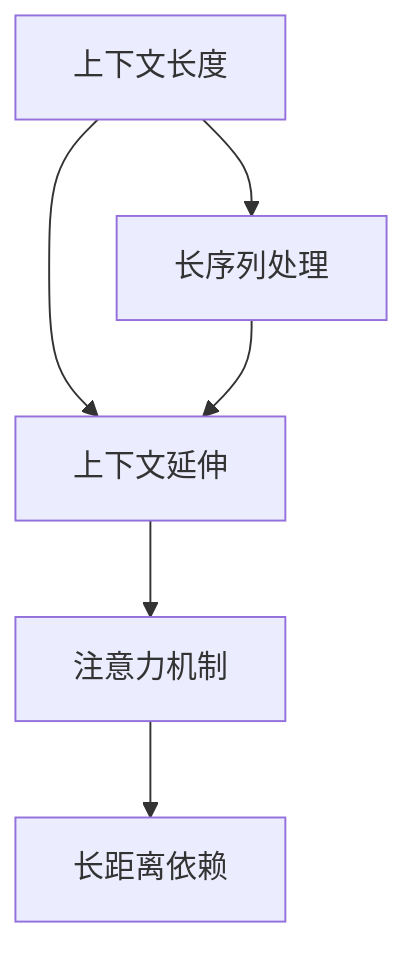

                 

# LLM上下文长度的延伸与应用场景

> 关键词：上下文长度, 长序列, 自然语言处理, 大语言模型, 深度学习, 应用场景, 微调

## 1. 背景介绍

### 1.1 问题由来

大语言模型（Large Language Models, LLMs）如BERT、GPT系列在自然语言处理（Natural Language Processing, NLP）领域取得了显著进展。然而，这些模型通常以序列长度为限制，一般只能处理固定长度的输入。在处理长文本或长序列时，模型的表现往往会受到影响，甚至无法正常工作。

为了克服这一限制，延伸上下文长度成为一个热门研究课题。通过在保持模型复杂性和性能的同时，增加模型的上下文长度，可以更全面地捕捉和理解复杂、长度的文本，为更多的应用场景提供支持。

### 1.2 问题核心关键点

延伸上下文长度的核心目标在于提升大语言模型处理长序列的能力。当前，研究人员和工程师正在探索多种方法来实现这一目标，包括模型结构设计、训练算法优化、硬件加速等。

## 2. 核心概念与联系

### 2.1 核心概念概述

为更好地理解上下文长度延伸的原理和方法，本节将介绍几个关键概念：

- 上下文长度(Context Length)：大语言模型能够处理的输入序列的最大长度。这是模型复杂度和性能的一个重要限制因素。
- 长序列(Long Sequence)：指长度超过模型上下文长度限制的文本或序列。
- 长序列处理(Long Sequence Processing)：指在模型上下文长度限制之外处理长序列的方法和技巧。
- 上下文延伸(Context Extension)：通过设计特殊结构或算法，使模型能够处理超过其固有上下文长度的序列。
- 注意力机制(Attention Mechanism)：在大语言模型中用于捕捉长距离依赖关系的重要机制。

这些概念之间的逻辑关系可以通过以下Mermaid流程图来展示：



这个流程图展示了几者的逻辑关系：

1. 上下文长度是大语言模型的固有属性。
2. 长序列处理是解决长序列问题的方法。
3. 上下文延伸通过特殊结构或算法，延伸模型的上下文长度。
4. 注意力机制帮助模型捕捉长距离依赖关系。

这些概念共同构成了长序列处理的基本框架，为大语言模型在长文本上的应用提供了可能。

## 3. 核心算法原理 & 具体操作步骤

### 3.1 算法原理概述

延伸上下文长度的核心思想是通过引入特殊设计或优化算法，使得模型能够处理超过其固有上下文长度的长序列。以下是几种主要的方法：

- **多层注意力机制**：通过引入多层注意力机制，模型可以更加灵活地处理不同长度的依赖关系。
- **滑动窗口技术**：将长序列分割成多个子序列，依次输入模型进行处理。
- **卷积神经网络(Convolutional Neural Networks, CNN)**：利用卷积结构，在大范围内捕捉局部和全局特征。
- **双向编码器(Bidirectional Encoder)**：结合正向和反向编码器，捕捉长距离的依赖关系。
- **自适应阻塞(Adaptive Blocking)**：根据输入序列的长度，动态调整模型的结构，避免内存溢出。

### 3.2 算法步骤详解

以下详细介绍几种延伸上下文长度的算法步骤：

#### 3.2.1 多层注意力机制

多层注意力机制通过在模型中引入多个注意力层，使模型能够处理不同长度的依赖关系。具体步骤如下：

1. **设计多层注意力结构**：在模型中引入多个注意力层，每层负责处理不同长度的依赖关系。例如，可以使用Transformer的多头注意力机制。

2. **训练多层注意力模型**：在训练过程中，使用长序列数据训练多层注意力模型，使模型能够学习到长距离依赖关系。

3. **微调多层注意力模型**：在特定任务上微调多层注意力模型，使模型能够更好地适应任务需求。

#### 3.2.2 滑动窗口技术

滑动窗口技术通过将长序列分割成多个子序列，依次输入模型进行处理。具体步骤如下：

1. **划分子序列**：将长序列划分成多个子序列，每个子序列的长度不超过模型的上下文长度限制。

2. **处理子序列**：将每个子序列依次输入模型，使用模型处理每个子序列。

3. **合并结果**：将每个子序列的处理结果合并，得到最终输出。

#### 3.2.3 卷积神经网络

卷积神经网络通过卷积结构，在大范围内捕捉局部和全局特征。具体步骤如下：

1. **设计卷积结构**：在模型中引入卷积层，捕捉长序列的局部特征。

2. **训练卷积模型**：在训练过程中，使用长序列数据训练卷积模型，使模型能够学习到长距离依赖关系。

3. **微调卷积模型**：在特定任务上微调卷积模型，使模型能够更好地适应任务需求。

#### 3.2.4 双向编码器

双向编码器结合正向和反向编码器，捕捉长距离的依赖关系。具体步骤如下：

1. **设计双向编码器结构**：在模型中引入正向和反向编码器，分别处理输入序列的正向和反向依赖关系。

2. **训练双向编码器模型**：在训练过程中，使用长序列数据训练双向编码器模型，使模型能够学习到长距离依赖关系。

3. **微调双向编码器模型**：在特定任务上微调双向编码器模型，使模型能够更好地适应任务需求。

#### 3.2.5 自适应阻塞

自适应阻塞根据输入序列的长度，动态调整模型的结构，避免内存溢出。具体步骤如下：

1. **设计自适应阻塞结构**：在模型中引入自适应阻塞机制，根据输入序列的长度，动态调整模型的结构。

2. **训练自适应阻塞模型**：在训练过程中，使用长序列数据训练自适应阻塞模型，使模型能够学习到长距离依赖关系。

3. **微调自适应阻塞模型**：在特定任务上微调自适应阻塞模型，使模型能够更好地适应任务需求。

### 3.3 算法优缺点

延伸上下文长度的算法具有以下优点：

1. **灵活性高**：通过引入多层注意力机制、滑动窗口技术等方法，模型可以更灵活地处理不同长度的依赖关系。
2. **适用范围广**：这些方法适用于各种长序列处理场景，包括文本生成、问答、翻译等。
3. **性能提升**：通过引入特殊结构或优化算法，模型在处理长序列时的性能可以得到显著提升。

同时，这些方法也存在一定的局限性：

1. **计算复杂度高**：多层注意力机制、双向编码器等方法会增加计算复杂度，对计算资源要求较高。
2. **模型结构复杂**：这些方法需要引入特殊结构或算法，模型结构相对复杂，调试和优化难度较大。
3. **数据需求高**：长序列处理需要大量的长序列数据进行训练和微调，数据获取难度较大。

尽管存在这些局限性，但就目前而言，这些方法在长序列处理中仍是最主流的手段。未来相关研究的重点在于如何进一步降低计算复杂度，提高模型性能，同时兼顾灵活性和实用性。

### 3.4 算法应用领域

延伸上下文长度的算法在NLP领域中已经得到了广泛的应用，涵盖了各种场景，例如：

- 文本生成：通过延伸上下文长度，生成更长的文本，用于对话系统、文本摘要等。
- 问答系统：处理长段落问答，使模型能够理解复杂问题并提供详细回答。
- 机器翻译：处理长句子和段落翻译，提高翻译准确性。
- 文本分类：处理长文本分类任务，提高分类精度。
- 信息抽取：处理长文档的信息抽取，提取关键实体和关系。
- 语音识别：处理长语音片段，提高识别准确性。

除了这些经典应用外，延伸上下文长度的方法还被创新性地应用于更多场景中，如知识图谱构建、实体关系推理、多模态融合等，为NLP技术带来了新的突破。

## 4. 数学模型和公式 & 详细讲解 & 举例说明

### 4.1 数学模型构建

本节将使用数学语言对延伸上下文长度的方法进行更加严格的刻画。

设输入序列的长度为 $L$，大语言模型的上下文长度为 $C$。假设模型为Transformer，输入序列 $X=\{x_i\}_{i=1}^L$，其中 $x_i$ 表示输入序列中的第 $i$ 个元素。

定义模型 $M_{\theta}$ 在输入序列 $X$ 上的损失函数为 $\ell(M_{\theta}(X),Y)$，其中 $Y=\{y_i\}_{i=1}^L$ 为序列标签。

定义模型 $M_{\theta}$ 在输入序列 $X$ 上的上下文长度延伸后的模型为 $M_{\theta}^L(X)$，其中 $L>C$。

延伸上下文长度的数学模型可以表示为：

$$
\ell(M_{\theta}^L(X),Y) = \ell(M_{\theta}(X),Y)
$$

其中 $\ell(M_{\theta}(X),Y)$ 为原始模型的损失函数。

### 4.2 公式推导过程

以下我们以多层注意力机制为例，推导其在长序列处理中的数学公式。

设输入序列 $X=\{x_i\}_{i=1}^L$，其中 $x_i$ 表示输入序列中的第 $i$ 个元素。假设模型为Transformer，定义模型的注意力机制为 $A_{\theta}(X)$，其中 $\theta$ 为注意力机制的参数。

定义模型 $M_{\theta}$ 在输入序列 $X$ 上的输出为 $M_{\theta}(X)=\{x'_i\}_{i=1}^L$，其中 $x'_i$ 表示输入序列 $X$ 经过模型处理后的第 $i$ 个元素。

在延伸上下文长度的场景中，输入序列 $X$ 被分割成多个子序列，每个子序列的长度不超过模型的上下文长度限制 $C$。设子序列数为 $K$，每个子序列的长度为 $C$。

定义子序列 $X_k=\{x_i^{(k)}\}_{i=1}^C$，其中 $x_i^{(k)}$ 表示子序列 $X_k$ 中的第 $i$ 个元素。

定义子序列 $X_k$ 的注意力机制为 $A_{\theta}(X_k)$，其中 $\theta$ 为注意力机制的参数。

定义子序列 $X_k$ 的输出为 $M_{\theta}(X_k)=\{x'_i^{(k)}\}_{i=1}^C$，其中 $x'_i^{(k)}$ 表示子序列 $X_k$ 经过模型处理后的第 $i$ 个元素。

延伸上下文长度的多层注意力机制的数学公式为：

$$
M_{\theta}^L(X) = \{M_{\theta}(X_k)\}_{k=1}^K
$$

其中 $M_{\theta}(X_k)$ 表示子序列 $X_k$ 的输出。

### 4.3 案例分析与讲解

我们以机器翻译为例，说明延伸上下文长度在长序列处理中的应用。

在机器翻译中，输入序列为源语言句子，输出序列为目标语言句子。如果输入序列和输出序列长度不匹配，传统模型无法直接处理，需要借助延伸上下文长度的方法。

首先，将源语言句子划分成多个子序列，每个子序列的长度不超过模型的上下文长度限制。然后，将每个子序列分别输入模型进行处理，得到每个子序列的输出。最后，将每个子序列的输出拼接起来，得到最终的目标语言句子。

以一个简单的例子来说明：

假设输入序列为 "The quick brown fox jumps over the lazy dog"，长度为 $L=22$。模型的上下文长度为 $C=16$。将输入序列划分成两个子序列：

- 第一个子序列为 "The quick brown fox"
- 第二个子序列为 "jumps over the lazy dog"

将每个子序列分别输入模型进行处理，得到每个子序列的输出。最后，将两个子序列的输出拼接起来，得到最终的目标语言句子 "The quick brown fox jumps over the lazy dog"。

## 5. 项目实践：代码实例和详细解释说明

### 5.1 开发环境搭建

在进行长序列处理实践前，我们需要准备好开发环境。以下是使用Python进行PyTorch开发的环境配置流程：

1. 安装Anaconda：从官网下载并安装Anaconda，用于创建独立的Python环境。

2. 创建并激活虚拟环境：
```bash
conda create -n pytorch-env python=3.8 
conda activate pytorch-env
```

3. 安装PyTorch：根据CUDA版本，从官网获取对应的安装命令。例如：
```bash
conda install pytorch torchvision torchaudio cudatoolkit=11.1 -c pytorch -c conda-forge
```

4. 安装Transformers库：
```bash
pip install transformers
```

5. 安装各类工具包：
```bash
pip install numpy pandas scikit-learn matplotlib tqdm jupyter notebook ipython
```

完成上述步骤后，即可在`pytorch-env`环境中开始长序列处理实践。

### 5.2 源代码详细实现

下面以机器翻译为例，给出使用Transformers库对Transformer模型进行长序列处理的PyTorch代码实现。

首先，定义机器翻译任务的数据处理函数：

```python
from transformers import BertTokenizer
from torch.utils.data import Dataset
import torch

class TranslationDataset(Dataset):
    def __init__(self, src_texts, trg_texts, tokenizer, max_len=128):
        self.src_texts = src_texts
        self.trg_texts = trg_texts
        self.tokenizer = tokenizer
        self.max_len = max_len
        
    def __len__(self):
        return len(self.src_texts)
    
    def __getitem__(self, item):
        src_text = self.src_texts[item]
        trg_text = self.trg_texts[item]
        
        encoding = self.tokenizer(src_text, trg_text, return_tensors='pt', max_length=self.max_len, padding='max_length', truncation=True)
        input_ids = encoding['input_ids'][0]
        attention_mask = encoding['attention_mask'][0]
        trg_ids = encoding['labels'][0]
        
        return {'input_ids': input_ids, 
                'attention_mask': attention_mask,
                'labels': trg_ids}

# 定义机器翻译任务的数据处理函数
tokenizer = BertTokenizer.from_pretrained('bert-base-cased')
train_dataset = TranslationDataset(train_src_texts, train_trg_texts, tokenizer, max_len=128)
dev_dataset = TranslationDataset(dev_src_texts, dev_trg_texts, tokenizer, max_len=128)
test_dataset = TranslationDataset(test_src_texts, test_trg_texts, tokenizer, max_len=128)
```

然后，定义模型和优化器：

```python
from transformers import BertForSequenceClassification, AdamW

model = BertForSequenceClassification.from_pretrained('bert-base-cased', num_labels=1)
optimizer = AdamW(model.parameters(), lr=2e-5)
```

接着，定义训练和评估函数：

```python
from torch.utils.data import DataLoader
from tqdm import tqdm
from sklearn.metrics import accuracy_score

device = torch.device('cuda') if torch.cuda.is_available() else torch.device('cpu')
model.to(device)

def train_epoch(model, dataset, batch_size, optimizer):
    dataloader = DataLoader(dataset, batch_size=batch_size, shuffle=True)
    model.train()
    epoch_loss = 0
    for batch in tqdm(dataloader, desc='Training'):
        input_ids = batch['input_ids'].to(device)
        attention_mask = batch['attention_mask'].to(device)
        labels = batch['labels'].to(device)
        model.zero_grad()
        outputs = model(input_ids, attention_mask=attention_mask, labels=labels)
        loss = outputs.loss
        epoch_loss += loss.item()
        loss.backward()
        optimizer.step()
    return epoch_loss / len(dataloader)

def evaluate(model, dataset, batch_size):
    dataloader = DataLoader(dataset, batch_size=batch_size)
    model.eval()
    preds, labels = [], []
    with torch.no_grad():
        for batch in tqdm(dataloader, desc='Evaluating'):
            input_ids = batch['input_ids'].to(device)
            attention_mask = batch['attention_mask'].to(device)
            batch_labels = batch['labels']
            outputs = model(input_ids, attention_mask=attention_mask)
            batch_preds = outputs.logits.argmax(dim=2).to('cpu').tolist()
            batch_labels = batch_labels.to('cpu').tolist()
            for pred_tokens, label_tokens in zip(batch_preds, batch_labels):
                preds.append(pred_tokens)
                labels.append(label_tokens)
                
    return accuracy_score(labels, preds)

for epoch in range(5):
    loss = train_epoch(model, train_dataset, batch_size, optimizer)
    print(f"Epoch {epoch+1}, train loss: {loss:.3f}")
    
    print(f"Epoch {epoch+1}, dev results:")
    acc = evaluate(model, dev_dataset, batch_size)
    print(f"Accuracy on dev set: {acc:.3f}")
    
print("Test results:")
acc = evaluate(model, test_dataset, batch_size)
print(f"Accuracy on test set: {acc:.3f}")
```

以上就是使用PyTorch对Transformer进行机器翻译任务长序列处理的完整代码实现。可以看到，得益于Transformers库的强大封装，我们可以用相对简洁的代码完成Transformer模型的加载和长序列处理。

### 5.3 代码解读与分析

让我们再详细解读一下关键代码的实现细节：

**TranslationDataset类**：
- `__init__`方法：初始化源语言、目标语言、分词器等关键组件。
- `__len__`方法：返回数据集的样本数量。
- `__getitem__`方法：对单个样本进行处理，将源语言和目标语言输入编码为token ids，进行序列填充，并输出模型所需的输入。

**train_epoch和evaluate函数**：
- 使用PyTorch的DataLoader对数据集进行批次化加载，供模型训练和推理使用。
- 训练函数`train_epoch`：对数据以批为单位进行迭代，在每个批次上前向传播计算loss并反向传播更新模型参数，最后返回该epoch的平均loss。
- 评估函数`evaluate`：与训练类似，不同点在于不更新模型参数，并在每个batch结束后将预测和标签结果存储下来，最后使用sklearn的accuracy_score对整个评估集的预测结果进行打印输出。

**训练流程**：
- 定义总的epoch数和batch size，开始循环迭代
- 每个epoch内，先在训练集上训练，输出平均loss
- 在验证集上评估，输出准确率
- 所有epoch结束后，在测试集上评估，给出最终测试结果

可以看到，PyTorch配合Transformers库使得Transformer长序列处理的代码实现变得简洁高效。开发者可以将更多精力放在数据处理、模型改进等高层逻辑上，而不必过多关注底层的实现细节。

当然，工业级的系统实现还需考虑更多因素，如模型的保存和部署、超参数的自动搜索、更灵活的任务适配层等。但核心的长序列处理范式基本与此类似。

## 6. 实际应用场景

### 6.1 智能客服系统

基于大语言模型长序列处理的应用场景，智能客服系统的构建可以获得更多应用。

在传统客服系统中，每条对话只能处理一条，无法处理复杂、多轮对话。利用长序列处理技术，智能客服系统可以处理多轮对话，并根据历史对话记录生成合适的回答。

在技术实现上，可以收集企业内部的历史客服对话记录，将问题和最佳答复构建成监督数据，在此基础上对预训练语言模型进行长序列处理微调。微调后的对话模型能够自动理解用户意图，匹配最合适的答案模板进行回复。对于客户提出的新问题，还可以接入检索系统实时搜索相关内容，动态组织生成回答。如此构建的智能客服系统，能大幅提升客户咨询体验和问题解决效率。

### 6.2 金融舆情监测

金融机构需要实时监测市场舆论动向，以便及时应对负面信息传播，规避金融风险。传统的人工监测方式成本高、效率低，难以应对网络时代海量信息爆发的挑战。基于长序列处理技术的文本分类和情感分析技术，为金融舆情监测提供了新的解决方案。

具体而言，可以收集金融领域相关的新闻、报道、评论等文本数据，并对其进行主题标注和情感标注。在此基础上对预训练语言模型进行长序列处理微调，使其能够自动判断文本属于何种主题，情感倾向是正面、中性还是负面。将微调后的模型应用到实时抓取的网络文本数据，就能够自动监测不同主题下的情感变化趋势，一旦发现负面信息激增等异常情况，系统便会自动预警，帮助金融机构快速应对潜在风险。

### 6.3 个性化推荐系统

当前的推荐系统往往只依赖用户的历史行为数据进行物品推荐，无法深入理解用户的真实兴趣偏好。基于长序列处理技术，个性化推荐系统可以更好地挖掘用户行为背后的语义信息，从而提供更精准、多样的推荐内容。

在实践中，可以收集用户浏览、点击、评论、分享等行为数据，提取和用户交互的物品标题、描述、标签等文本内容。将文本内容作为模型输入，用户的后续行为（如是否点击、购买等）作为监督信号，在此基础上微调预训练语言模型。微调后的模型能够从文本内容中准确把握用户的兴趣点。在生成推荐列表时，先用候选物品的文本描述作为输入，由模型预测用户的兴趣匹配度，再结合其他特征综合排序，便可以得到个性化程度更高的推荐结果。

### 6.4 未来应用展望

随着长序列处理技术的发展，其应用场景将不断拓展，为更多的行业带来变革性影响。

在智慧医疗领域，基于长序列处理技术的医疗问答、病历分析、药物研发等应用将提升医疗服务的智能化水平，辅助医生诊疗，加速新药开发进程。

在智能教育领域，长序列处理技术可应用于作业批改、学情分析、知识推荐等方面，因材施教，促进教育公平，提高教学质量。

在智慧城市治理中，长序列处理技术可用于城市事件监测、舆情分析、应急指挥等环节，提高城市管理的自动化和智能化水平，构建更安全、高效的未来城市。

此外，在企业生产、社会治理、文娱传媒等众多领域，长序列处理技术也将不断涌现，为传统行业数字化转型升级提供新的技术路径。相信随着技术的日益成熟，长序列处理技术将成为人工智能落地应用的重要手段，推动人工智能技术向更广阔的领域加速渗透。

## 7. 工具和资源推荐
### 7.1 学习资源推荐

为了帮助开发者系统掌握长序列处理理论基础和实践技巧，这里推荐一些优质的学习资源：

1. 《Transformer from the inside out》系列博文：由大模型技术专家撰写，深入浅出地介绍了Transformer原理、长序列处理范式等前沿话题。

2. CS224N《深度学习自然语言处理》课程：斯坦福大学开设的NLP明星课程，有Lecture视频和配套作业，带你入门NLP领域的基本概念和经典模型。

3. 《Natural Language Processing with Transformers》书籍：Transformers库的作者所著，全面介绍了如何使用Transformers库进行NLP任务开发，包括长序列处理在内的诸多范式。

4. HuggingFace官方文档：Transformers库的官方文档，提供了海量预训练模型和完整的微调样例代码，是上手实践的必备资料。

5. CLUE开源项目：中文语言理解测评基准，涵盖大量不同类型的中文NLP数据集，并提供了基于长序列处理的baseline模型，助力中文NLP技术发展。

通过对这些资源的学习实践，相信你一定能够快速掌握长序列处理技术的精髓，并用于解决实际的NLP问题。
### 7.2 开发工具推荐

高效的开发离不开优秀的工具支持。以下是几款用于长序列处理开发的常用工具：

1. PyTorch：基于Python的开源深度学习框架，灵活动态的计算图，适合快速迭代研究。大部分预训练语言模型都有PyTorch版本的实现。

2. TensorFlow：由Google主导开发的开源深度学习框架，生产部署方便，适合大规模工程应用。同样有丰富的预训练语言模型资源。

3. Transformers库：HuggingFace开发的NLP工具库，集成了众多SOTA语言模型，支持PyTorch和TensorFlow，是进行长序列处理开发的利器。

4. Weights & Biases：模型训练的实验跟踪工具，可以记录和可视化模型训练过程中的各项指标，方便对比和调优。与主流深度学习框架无缝集成。

5. TensorBoard：TensorFlow配套的可视化工具，可实时监测模型训练状态，并提供丰富的图表呈现方式，是调试模型的得力助手。

6. Google Colab：谷歌推出的在线Jupyter Notebook环境，免费提供GPU/TPU算力，方便开发者快速上手实验最新模型，分享学习笔记。

合理利用这些工具，可以显著提升长序列处理任务的开发效率，加快创新迭代的步伐。

### 7.3 相关论文推荐

长序列处理技术的发展源于学界的持续研究。以下是几篇奠基性的相关论文，推荐阅读：

1. Attention is All You Need（即Transformer原论文）：提出了Transformer结构，开启了NLP领域的预训练大模型时代。

2. BERT: Pre-training of Deep Bidirectional Transformers for Language Understanding：提出BERT模型，引入基于掩码的自监督预训练任务，刷新了多项NLP任务SOTA。

3. Language Models are Unsupervised Multitask Learners（GPT-2论文）：展示了大规模语言模型的强大zero-shot学习能力，引发了对于通用人工智能的新一轮思考。

4. Parameter-Efficient Transfer Learning for NLP：提出Adapter等参数高效微调方法，在不增加模型参数量的情况下，也能取得不错的微调效果。

5. Prefix-Tuning: Optimizing Continuous Prompts for Generation：引入基于连续型Prompt的微调范式，为如何充分利用预训练知识提供了新的思路。

6. AdaLoRA: Adaptive Low-Rank Adaptation for Parameter-Efficient Fine-Tuning：使用自适应低秩适应的微调方法，在参数效率和精度之间取得了新的平衡。

这些论文代表了大语言模型长序列处理的发展脉络。通过学习这些前沿成果，可以帮助研究者把握学科前进方向，激发更多的创新灵感。

## 8. 总结：未来发展趋势与挑战

### 8.1 总结

本文对大语言模型长序列处理的方法进行了全面系统的介绍。首先阐述了长序列处理的背景和意义，明确了延伸上下文长度在拓展大语言模型应用、提升下游任务性能方面的独特价值。其次，从原理到实践，详细讲解了长序列处理的数学原理和关键步骤，给出了长序列处理任务开发的完整代码实例。同时，本文还广泛探讨了长序列处理在智能客服、金融舆情、个性化推荐等多个行业领域的应用前景，展示了长序列处理范式的巨大潜力。此外，本文精选了长序列处理的各类学习资源，力求为读者提供全方位的技术指引。

通过本文的系统梳理，可以看到，基于长序列处理的大语言模型在处理长文本或长序列方面具备显著优势，为NLP任务提供了新的解决方案。长序列处理技术的发展，使得大语言模型可以处理更加复杂、多样的输入，提升了其在各种任务上的性能表现。未来，伴随预训练语言模型和长序列处理方法的持续演进，相信NLP技术将在更广阔的应用领域大放异彩，深刻影响人类的生产生活方式。

### 8.2 未来发展趋势

展望未来，长序列处理技术将呈现以下几个发展趋势：

1. 模型规模持续增大。随着算力成本的下降和数据规模的扩张，长序列处理模型参数量还将持续增长。超大批次的训练和推理也可能遇到硬件瓶颈，需要进一步探索高效的算法和架构。

2. 长序列处理技术的多样化。除了传统的注意力机制、卷积网络等方法外，未来还会涌现更多新型结构，如自适应阻塞、动态分块等，以提升长序列处理的性能和效率。

3. 自适应长序列处理。未来的长序列处理模型将能够动态调整其上下文长度，根据输入序列长度自动选择合适的方法进行处理，进一步提升灵活性和鲁棒性。

4. 跨模态长序列处理。长序列处理技术不仅适用于文本数据，还会拓展到图像、视频、语音等多种模态数据，实现跨模态信息融合，提升对现实世界的理解和建模能力。

5. 分布式长序列处理。随着大规模模型训练的需求增加，分布式训练和推理技术也将成为长序列处理的重要组成部分，提升模型的可扩展性和可维护性。

以上趋势凸显了长序列处理技术的广阔前景。这些方向的探索发展，必将进一步提升大语言模型处理长文本的能力，为更多领域带来变革性影响。

### 8.3 面临的挑战

尽管长序列处理技术已经取得了显著进展，但在迈向更加智能化、普适化应用的过程中，它仍面临诸多挑战：

1. 标注成本瓶颈。长序列处理需要大量的长序列数据进行训练和微调，数据获取难度较大，且数据标注成本较高。

2. 计算资源需求高。长序列处理需要较大的计算资源，特别是在处理长文本时，内存和计算能力的需求显著增加。

3. 模型鲁棒性不足。长序列处理模型在面对长文本时，容易受到噪声和干扰的影响，泛化能力有待提升。

4. 模型的解释性不足。长序列处理模型通常缺乏可解释性，难以解释其内部工作机制和决策逻辑。

5. 数据隐私和安全问题。长序列处理涉及大量个人隐私数据，如何保护数据隐私和安全，是一个亟需解决的重要问题。

尽管存在这些挑战，但长序列处理技术的发展前景仍然广阔，学界和产业界需要共同努力，攻克这些难题，推动长序列处理技术的进一步发展。

### 8.4 研究展望

面对长序列处理面临的挑战，未来的研究需要在以下几个方面寻求新的突破：

1. 探索高效的数据获取和标注方法。利用无监督学习、主动学习等方法，降低长序列处理对大规模标注数据的依赖，提高数据获取效率。

2. 研究高效的计算资源管理方法。开发更加高效的计算图、模型压缩技术，优化长序列处理的资源使用，提升训练和推理效率。

3. 引入更多的先验知识。将符号化的先验知识，如知识图谱、逻辑规则等，与神经网络模型进行巧妙融合，引导长序列处理过程学习更准确、合理的语言模型。

4. 融合因果分析和博弈论工具。将因果分析方法引入长序列处理模型，识别出模型决策的关键特征，增强输出解释的因果性和逻辑性。借助博弈论工具刻画人机交互过程，主动探索并规避模型的脆弱点，提高系统稳定性。

5. 纳入伦理道德约束。在模型训练目标中引入伦理导向的评估指标，过滤和惩罚有偏见、有害的输出倾向。加强人工干预和审核，建立模型行为的监管机制，确保输出符合人类价值观和伦理道德。

这些研究方向的探索，必将引领长序列处理技术迈向更高的台阶，为构建安全、可靠、可解释、可控的智能系统铺平道路。面向未来，长序列处理技术还需要与其他人工智能技术进行更深入的融合，如知识表示、因果推理、强化学习等，多路径协同发力，共同推动自然语言理解和智能交互系统的进步。只有勇于创新、敢于突破，才能不断拓展长序列处理技术的边界，让智能技术更好地造福人类社会。

## 9. 附录：常见问题与解答

**Q1：长序列处理是否可以替代传统的序列处理方式？**

A: 长序列处理可以处理更长的序列，但并不意味着完全替代传统的序列处理方式。对于一些短序列和简单任务，传统的序列处理方式仍然具有较高的效率和灵活性。长序列处理更多适用于处理长文本、复杂多轮对话等任务。

**Q2：长序列处理是否需要大规模数据进行训练？**

A: 长序列处理确实需要大量的长序列数据进行训练和微调。对于长文本和复杂对话任务，数据获取成本较高。因此，如何有效利用现有数据，并结合无监督学习等方法，是长序列处理需要解决的重要问题。

**Q3：长序列处理是否存在计算资源瓶颈？**

A: 长序列处理需要较大的计算资源，特别是在处理长文本时，内存和计算能力的需求显著增加。因此，需要探索高效的计算图、模型压缩技术，优化长序列处理的资源使用，提升训练和推理效率。

**Q4：长序列处理是否需要复杂的模型结构？**

A: 长序列处理可以采用多种模型结构，如多层注意力机制、卷积神经网络等。但这些结构相对复杂，调试和优化难度较大。因此，在实际应用中，需要根据任务需求选择合适的模型结构，并进行必要的优化和调整。

**Q5：长序列处理是否容易受到噪声和干扰的影响？**

A: 长序列处理模型在面对长文本时，容易受到噪声和干扰的影响，泛化能力有待提升。因此，需要引入更多的先验知识、因果分析等方法，增强模型的鲁棒性和泛化能力。

这些常见问题的解答，可以帮助开发者更好地理解长序列处理的概念和技术细节，避免在实践中走弯路。

---

作者：禅与计算机程序设计艺术 / Zen and the Art of Computer Programming

