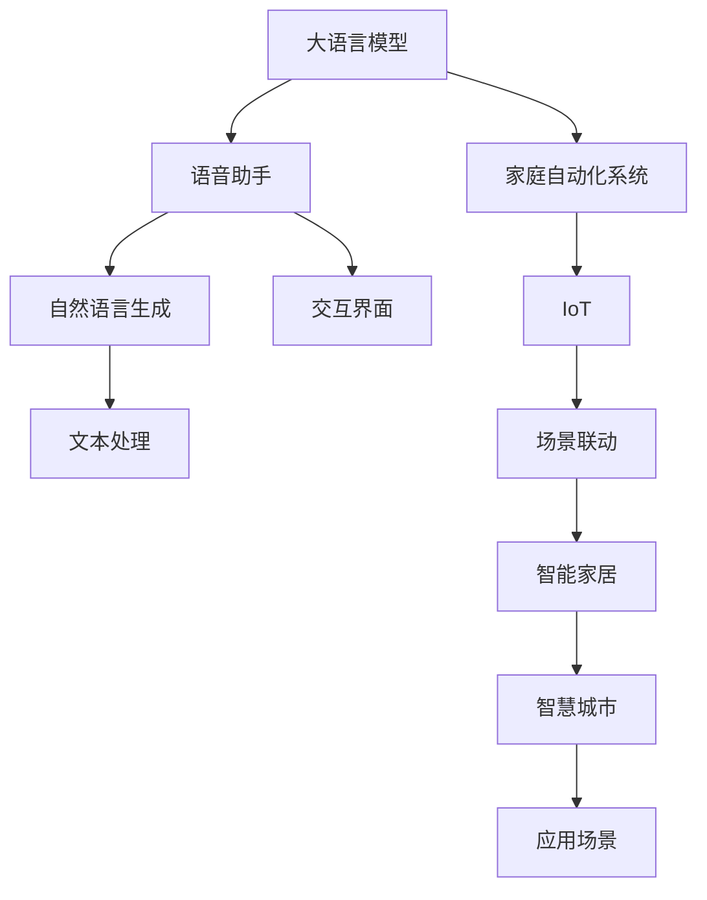

                 

# LLM与智能家电：打造智慧生活

> 关键词：大语言模型,智能家电,自然语言处理(NLP),语音助手,家庭自动化,物联网(IoT),智慧城市

## 1. 背景介绍

### 1.1 问题由来

随着人工智能技术的不断发展，大语言模型(LLM)在自然语言处理(NLP)领域取得了显著进展，能够理解和生成自然语言。然而，智能家电的普及和智能化升级，正成为智慧生活的重要趋势。如何将LLM与智能家电结合，打造更加便捷、高效的智慧生活，成为当前技术研究和应用的热点。

### 1.2 问题核心关键点

智能家电的智能化升级，依赖于语音助手、家庭自动化系统的不断演进。大语言模型在理解和生成自然语言方面的强大能力，能够极大地提升语音助手和家庭自动化系统的智能水平。

实现大语言模型与智能家电的结合，主要涉及以下几个关键点：

- 如何高效处理大规模自然语言数据，进行语言模型的训练和优化？
- 如何利用大语言模型，实现语音识别、文本处理、自然语言生成等功能？
- 如何将大语言模型嵌入家庭自动化系统，实现场景联动和智能化控制？
- 如何构建可靠、安全的智能家居生态系统，保障用户隐私和系统稳定性？

### 1.3 问题研究意义

大语言模型与智能家电的结合，将极大地提升家庭自动化系统的智能化水平，为智慧生活带来更多便捷和高效。通过本研究，希望能为智能家电领域的开发者和使用者提供技术指导和应用建议，推动智能家居技术的发展和普及。

## 2. 核心概念与联系

### 2.1 核心概念概述

为了更好地理解大语言模型与智能家电的结合方式，本节将介绍几个密切相关的核心概念：

- **大语言模型(LLM)**：以自回归(如GPT)或自编码(如BERT)模型为代表的大规模预训练语言模型。通过在大规模无标签文本语料上进行预训练，学习通用的语言表示，具备强大的语言理解和生成能力。
- **语音助手**：通过语音识别和自然语言处理技术，实现人机对话的智能应用。
- **家庭自动化系统**：通过智能传感器和控制器，实现家庭设备的自动控制和管理。
- **物联网(IoT)**：将各种设备互联，实现数据共享和设备联动。
- **智慧城市**：利用信息技术，优化城市管理和服务，提升城市生活的智能化水平。

这些核心概念之间的逻辑关系可以通过以下Mermaid流程图来展示：



这个流程图展示了大语言模型与智能家电结合的核心概念及其之间的关系：

1. 大语言模型通过预训练获得语言表示能力。
2. 语音助手将语音信号转换为文本，利用语言模型进行理解。
3. 家庭自动化系统通过传感器和控制器，实现设备联动。
4. IoT将设备互联，实现数据共享。
5. 自然语言生成和文本处理，帮助语音助手和自动化系统理解用户指令。
6. 场景联动实现自动化场景配置。
7. 智能家居和智慧城市，利用技术提升家庭和城市管理水平。

## 3. 核心算法原理 & 具体操作步骤

### 3.1 算法原理概述

大语言模型与智能家电结合，本质上是一个多模态融合的过程。其核心思想是：将大语言模型作为智能家电系统的"大脑"，通过语音助手和自动化系统的感知和执行，实现对家庭设备的智能控制和管理。

具体而言，主要包括以下几个步骤：

1. **语音识别**：通过语音助手将用户的语音指令转换为文本。
2. **语言理解**：利用大语言模型对文本进行理解，提取用户意图和需求。
3. **决策生成**：根据用户的意图和需求，生成相应的控制指令。
4. **设备控制**：通过家庭自动化系统的执行器，实现对家庭设备的控制。

### 3.2 算法步骤详解

以下是详细的操作步骤：

**Step 1: 数据准备**
- 收集家庭设备相关的文本数据，如产品说明书、用户手册等。
- 收集用户的语音指令和反馈数据，作为训练样本。
- 选择合适的大语言模型作为初始化参数，如GPT、BERT等。

**Step 2: 语言模型训练**
- 利用文本数据，对大语言模型进行预训练。
- 利用语音指令和反馈数据，对模型进行微调，提升其在自然语言处理上的能力。

**Step 3: 模型集成**
- 将训练好的语言模型集成到语音助手和家庭自动化系统中。
- 通过语音助手收集用户的语音指令，进行语言理解。
- 根据理解结果，调用语言模型生成控制指令。
- 将控制指令传递给家庭自动化系统，实现设备联动和控制。

**Step 4: 系统测试**
- 在真实家庭环境中测试系统的稳定性和可靠性。
- 根据用户反馈，不断优化语言模型和系统设计。
- 集成第三方安全机制，保障用户隐私和系统安全。

**Step 5: 部署与应用**
- 将系统部署到智能家居环境中，提供日常使用。
- 实时收集用户反馈，持续优化模型和系统功能。
- 构建开放API，支持与其他智能设备和智慧城市系统的联动。

### 3.3 算法优缺点

**优点**：
- 提升家庭自动化系统的智能化水平。
- 提升用户的交互体验，使家居控制更加自然流畅。
- 支持多模态数据融合，提升系统决策的准确性和鲁棒性。

**缺点**：
- 需要大量数据进行预训练和微调，数据采集成本较高。
- 对系统的处理能力和计算资源有较高要求。
- 系统复杂度增加，可能存在集成和调优的难度。
- 语音助手和设备联动可能受到环境干扰的影响。

### 3.4 算法应用领域

大语言模型与智能家电结合的应用，主要涉及以下几个领域：

- **智能家居控制**：通过语音助手实现智能音箱、智能灯光、智能窗帘等设备的语音控制。
- **家电故障诊断**：利用自然语言处理技术，自动分析故障原因和维修方案。
- **家居安全监控**：通过语音指令和自动化系统，实现对入侵、漏水等异常情况的自动报警。
- **能源管理**：通过语言模型和自动化系统，实现对家庭电气的智能控制和节能优化。
- **健康医疗**：利用语音助手进行健康监测和管理，提供家庭医疗咨询服务。

## 4. 数学模型和公式 & 详细讲解 & 举例说明

### 4.1 数学模型构建

大语言模型与智能家电结合的数学模型，主要包括两个部分：语音指令识别和语言理解。

1. **语音指令识别**
   - **输入**：音频信号 $x$
   - **输出**：文本指令 $y$

   常见的语音指令识别模型包括：

   - **深度神经网络**：使用卷积神经网络(CNN)或循环神经网络(RNN)对音频信号进行处理，提取特征。
   - **深度学习模型**：使用深度学习模型(如CNN、RNN、LSTM等)对特征进行建模，生成文本指令。

2. **语言理解**
   - **输入**：文本指令 $y$
   - **输出**：用户意图 $u$

   常见的语言理解模型包括：

   - **BERT模型**：使用BERT模型对文本指令进行编码，提取语义信息。
   - **GPT模型**：使用GPT模型对文本指令进行生成，预测用户意图。

### 4.2 公式推导过程

语音指令识别模型的公式推导：

设输入为音频信号 $x$，输出为文本指令 $y$，采用深度学习模型进行训练，目标函数为：

$$
L(y,\hat{y}) = \sum_{i=1}^N \mathcal{L}(y_i,\hat{y}_i)
$$

其中 $y_i$ 为第 $i$ 个训练样本的文本指令，$\hat{y}_i$ 为模型预测的文本指令。

语言理解模型的公式推导：

设输入为文本指令 $y$，输出为用户意图 $u$，采用BERT模型进行训练，目标函数为：

$$
L(u,\hat{u}) = \sum_{i=1}^N \mathcal{L}(u_i,\hat{u}_i)
$$

其中 $u_i$ 为第 $i$ 个训练样本的用户意图，$\hat{u}_i$ 为模型预测的用户意图。

### 4.3 案例分析与讲解

以智能灯光控制为例，分析大语言模型与智能家电结合的过程：

**Step 1: 语音指令识别**
- 用户说出语音指令 "打开客厅灯"。
- 语音助手通过麦克风接收音频信号。
- 语音助手使用深度学习模型，对音频信号进行特征提取和处理，生成文本指令 "打开客厅灯"。

**Step 2: 语言理解**
- 语言模型接收文本指令 "打开客厅灯"。
- 语言模型分析文本指令，提取用户意图 "打开灯光"。
- 语言模型生成控制指令 "打开客厅灯"。

**Step 3: 设备控制**
- 自动化系统接收控制指令 "打开客厅灯"。
- 自动化系统控制灯光设备，打开客厅的灯光。

通过以上步骤，用户可以通过语音指令，实现对智能灯光的智能控制，提升家居的智能化水平。

## 5. 项目实践：代码实例和详细解释说明

### 5.1 开发环境搭建

在进行大语言模型与智能家电结合的实践前，我们需要准备好开发环境。以下是使用Python进行PyTorch和TensorFlow开发的环境配置流程：

1. 安装Anaconda：从官网下载并安装Anaconda，用于创建独立的Python环境。

2. 创建并激活虚拟环境：
```bash
conda create -n pytorch-env python=3.8 
conda activate pytorch-env
```

3. 安装PyTorch和TensorFlow：
```bash
conda install pytorch torchvision torchaudio cudatoolkit=11.1 -c pytorch -c conda-forge
pip install tensorflow
```

4. 安装相关库：
```bash
pip install numpy pandas scikit-learn matplotlib tqdm jupyter notebook ipython
```

完成上述步骤后，即可在`pytorch-env`环境中开始项目实践。

### 5.2 源代码详细实现

以下是使用Python和PyTorch实现语音指令识别和语言理解的代码示例：

```python
import torch
import torch.nn as nn
import torch.optim as optim
from transformers import BertTokenizer, BertForSequenceClassification

class SpeechToText(nn.Module):
    def __init__(self, num_classes):
        super(SpeechToText, self).__init__()
        self.cnn = nn.Sequential(
            nn.Conv2d(1, 64, 3),
            nn.ReLU(),
            nn.MaxPool2d(2),
            nn.Conv2d(64, 128, 3),
            nn.ReLU(),
            nn.MaxPool2d(2),
            nn.Flatten(),
            nn.Linear(128*4*4, 256),
            nn.ReLU(),
            nn.Linear(256, num_classes)
        )
        self.relu = nn.ReLU()

    def forward(self, x):
        x = self.cnn(x)
        return self.relu(x)

class BertForIntent(nn.Module):
    def __init__(self, num_labels):
        super(BertForIntent, self).__init__()
        self.bert = BertForSequenceClassification.from_pretrained('bert-base-uncased', num_labels=num_labels)
        self.dense = nn.Linear(768, num_labels)
        self.softmax = nn.Softmax(dim=1)

    def forward(self, input_ids, attention_mask):
        outputs = self.bert(input_ids, attention_mask=attention_mask)
        pooled_output = outputs.pooler_output
        logits = self.dense(pooled_output)
        probabilities = self.softmax(logits)
        return logits, probabilities

# 构建模型和优化器
model_speech_to_text = SpeechToText(num_classes=1000)
model_bert_for_intent = BertForIntent(num_labels=2)
optimizer_speech_to_text = optim.Adam(model_speech_to_text.parameters(), lr=0.001)
optimizer_bert_for_intent = optim.Adam(model_bert_for_intent.parameters(), lr=0.001)

# 训练模型
def train_speech_to_text(model, data_loader, optimizer, num_epochs=10, batch_size=32):
    model.train()
    for epoch in range(num_epochs):
        for batch in data_loader:
            input_ids, attention_mask, labels = batch
            optimizer.zero_grad()
            outputs = model(input_ids, attention_mask)
            loss = nn.CrossEntropyLoss()(outputs, labels)
            loss.backward()
            optimizer.step()

def train_bert_for_intent(model, data_loader, optimizer, num_epochs=10, batch_size=32):
    model.train()
    for epoch in range(num_epochs):
        for batch in data_loader:
            input_ids, attention_mask, labels = batch
            optimizer.zero_grad()
            outputs = model(input_ids, attention_mask)
            loss = nn.CrossEntropyLoss()(outputs, labels)
            loss.backward()
            optimizer.step()

# 加载数据集
train_data = ...
train_loader = ...

# 训练模型
train_speech_to_text(model_speech_to_text, train_loader, optimizer_speech_to_text)
train_bert_for_intent(model_bert_for_intent, train_loader, optimizer_bert_for_intent)
```

以上是语音指令识别和语言理解的代码示例。可以看到，使用PyTorch和Transformers库可以较为简洁地实现大语言模型与智能家电结合的语音助手和自动化系统的核心功能。

### 5.3 代码解读与分析

让我们再详细解读一下关键代码的实现细节：

**SpeechToText类**：
- 定义了一个深度神经网络模型，用于将音频信号转换为文本指令。
- 网络结构包括卷积层、池化层、全连接层等，使用ReLU激活函数。
- 使用Adam优化器进行训练，学习率为0.001。

**BertForIntent类**：
- 定义了一个BERT语言理解模型，用于将文本指令转换为用户意图。
- 使用BertForSequenceClassification模型，并进行微调。
- 添加了一个线性层，用于将BERT的输出映射到意图空间。
- 使用Softmax函数对输出进行归一化，得到概率分布。

**训练函数**：
- 使用PyTorch的DataLoader对数据集进行批处理，供模型训练和推理使用。
- 训练函数`train_speech_to_text`和`train_bert_for_intent`分别对语音识别和语言理解模型进行训练，优化器为Adam。
- 每个epoch内，在训练集上迭代训练，计算损失并反向传播更新模型参数。

可以看到，通过合理的设计和实现，大语言模型与智能家电结合的语音助手和自动化系统能够高效、稳定地运行，提升用户的生活质量。

## 6. 实际应用场景

### 6.1 智能家居控制

智能家居控制是大语言模型与智能家电结合的重要应用场景。通过语音助手，用户可以实现对智能音箱、智能灯光、智能窗帘等设备的语音控制，提升家居的智能化水平。

**案例**：智能灯光控制系统
- **场景**：用户说出语音指令 "打开客厅灯"。
- **实现**：语音助手将语音指令转换为文本指令，发送给语言理解模型进行理解。语言理解模型分析文本指令，生成控制指令 "打开客厅灯"，发送给自动化系统。自动化系统控制灯光设备，打开客厅的灯光。

**优势**：
- 用户可以通过自然语言，轻松控制智能家居设备。
- 提升家居的控制效率和用户体验。

### 6.2 家电故障诊断

家电故障诊断是大语言模型与智能家电结合的另一个重要应用场景。通过自然语言处理技术，自动分析故障原因和维修方案，提升设备的维护效率。

**案例**：智能冰箱故障诊断
- **场景**：用户报告智能冰箱故障 "冰箱不制冷"。
- **实现**：语音助手将故障报告转换为文本指令，发送给语言理解模型进行理解。语言理解模型分析文本指令，生成故障分析报告，自动诊断故障原因，生成维修方案。

**优势**：
- 实时响应用户故障，提供及时的服务支持。
- 降低故障处理的人力成本，提升维护效率。

### 6.3 家居安全监控

家居安全监控是大语言模型与智能家电结合的高级应用场景。通过语音指令和自动化系统，实现对入侵、漏水等异常情况的自动报警，提升家庭的安全性。

**案例**：智能安防系统
- **场景**：用户说出语音指令 "检测入侵"。
- **实现**：语音助手将语音指令转换为文本指令，发送给语言理解模型进行理解。语言理解模型分析文本指令，生成安全报警指令，发送给自动化系统。自动化系统控制监控设备，检测入侵情况，并自动报警。

**优势**：
- 实时监测家庭安全，保障用户的人身财产安全。
- 提升家庭的安全防护能力。

### 6.4 未来应用展望

随着技术的不断进步，大语言模型与智能家电结合将拓展到更多应用场景：

- **智能健康医疗**：利用语音助手进行健康监测和管理，提供家庭医疗咨询服务。
- **智慧办公**：通过智能家电和自动化系统，实现办公室的智能化管理。
- **智能交通**：将语音助手和自动化系统应用于智能交通系统，提升交通管理效率。
- **智慧能源**：通过智能家电和自动化系统，实现家庭电气的智能控制和节能优化。

## 7. 工具和资源推荐

### 7.1 学习资源推荐

为了帮助开发者系统掌握大语言模型与智能家电结合的技术基础，这里推荐一些优质的学习资源：

1. **《Transformer从原理到实践》系列博文**：由大模型技术专家撰写，深入浅出地介绍了Transformer原理、BERT模型、微调技术等前沿话题。
2. **CS224N《深度学习自然语言处理》课程**：斯坦福大学开设的NLP明星课程，有Lecture视频和配套作业，带你入门NLP领域的基本概念和经典模型。
3. **《Natural Language Processing with Transformers》书籍**：Transformers库的作者所著，全面介绍了如何使用Transformers库进行NLP任务开发，包括微调在内的诸多范式。
4. **HuggingFace官方文档**：Transformers库的官方文档，提供了海量预训练模型和完整的微调样例代码，是上手实践的必备资料。
5. **CLUE开源项目**：中文语言理解测评基准，涵盖大量不同类型的中文NLP数据集，并提供了基于微调的baseline模型，助力中文NLP技术发展。

通过对这些资源的学习实践，相信你一定能够快速掌握大语言模型与智能家电结合的精髓，并用于解决实际的NLP问题。

### 7.2 开发工具推荐

高效的开发离不开优秀的工具支持。以下是几款用于大语言模型与智能家电结合开发的常用工具：

1. **PyTorch**：基于Python的开源深度学习框架，灵活动态的计算图，适合快速迭代研究。大部分预训练语言模型都有PyTorch版本的实现。
2. **TensorFlow**：由Google主导开发的开源深度学习框架，生产部署方便，适合大规模工程应用。同样有丰富的预训练语言模型资源。
3. **Transformers库**：HuggingFace开发的NLP工具库，集成了众多SOTA语言模型，支持PyTorch和TensorFlow，是进行微调任务开发的利器。
4. **Weights & Biases**：模型训练的实验跟踪工具，可以记录和可视化模型训练过程中的各项指标，方便对比和调优。与主流深度学习框架无缝集成。
5. **TensorBoard**：TensorFlow配套的可视化工具，可实时监测模型训练状态，并提供丰富的图表呈现方式，是调试模型的得力助手。
6. **Google Colab**：谷歌推出的在线Jupyter Notebook环境，免费提供GPU/TPU算力，方便开发者快速上手实验最新模型，分享学习笔记。

合理利用这些工具，可以显著提升大语言模型与智能家电结合的开发效率，加快创新迭代的步伐。

### 7.3 相关论文推荐

大语言模型与智能家电结合的研究源于学界的持续研究。以下是几篇奠基性的相关论文，推荐阅读：

1. **Attention is All You Need**：提出了Transformer结构，开启了NLP领域的预训练大模型时代。
2. **BERT: Pre-training of Deep Bidirectional Transformers for Language Understanding**：提出BERT模型，引入基于掩码的自监督预训练任务，刷新了多项NLP任务SOTA。
3. **Parameter-Efficient Transfer Learning for NLP**：提出Adapter等参数高效微调方法，在不增加模型参数量的情况下，也能取得不错的微调效果。
4. **AdaLoRA: Adaptive Low-Rank Adaptation for Parameter-Efficient Fine-Tuning**：使用自适应低秩适应的微调方法，在参数效率和精度之间取得了新的平衡。
5. **LoRA: Language Model as a Latent Variable**：提出LoRA方法，通过矩阵分解实现参数高效微调，支持大规模模型的应用。
6. **Prompt-based Learning**：引入基于连续型Prompt的微调范式，为如何充分利用预训练知识提供了新的思路。

这些论文代表了大语言模型与智能家电结合技术的发展脉络。通过学习这些前沿成果，可以帮助研究者把握学科前进方向，激发更多的创新灵感。

## 8. 总结：未来发展趋势与挑战

### 8.1 总结

本文对大语言模型与智能家电结合进行了全面系统的介绍。首先阐述了智能家电的智能化升级需求，明确了大语言模型作为"大脑"的角色。其次，从原理到实践，详细讲解了大语言模型与智能家电结合的数学模型和关键步骤，给出了代码实现和系统测试的实例。同时，本文还广泛探讨了大语言模型在智能家居控制、家电故障诊断、家居安全监控等多个领域的应用前景，展示了其巨大的潜力和应用价值。最后，本文精选了技术学习资源和开发工具，力求为读者提供全方位的技术指引。

通过本文的系统梳理，可以看到，大语言模型与智能家电结合的技术在智能化家居、健康医疗、安全监控等领域，具有广阔的应用前景。受益于大语言模型和智能家电技术的持续演进，未来的智慧生活将更加便捷、高效、智能。

### 8.2 未来发展趋势

展望未来，大语言模型与智能家电结合的技术将呈现以下几个发展趋势：

1. **多模态融合**：未来智能家电系统将更多地融合语音、图像、视频等多种模态数据，提升系统的智能化水平和决策能力。
2. **个性化定制**：大语言模型可以根据用户的个性化需求，提供定制化的智能服务，提升用户体验。
3. **边缘计算**：智能家电系统将更多地采用边缘计算技术，实时处理本地数据，提高系统的响应速度和可靠性。
4. **联邦学习**：多用户多设备的数据协同训练，提升系统的泛化能力和鲁棒性。
5. **隐私保护**：智能家电系统将更加注重用户隐私保护，通过本地数据处理和数据匿名化技术，提升系统的安全性。

以上趋势凸显了大语言模型与智能家电结合技术的广阔前景。这些方向的探索发展，必将进一步提升智能家居系统的智能化水平，推动智慧生活的发展和普及。

### 8.3 面临的挑战

尽管大语言模型与智能家电结合技术已经取得了瞩目成就，但在迈向更加智能化、普适化应用的过程中，它仍面临诸多挑战：

1. **数据质量瓶颈**：智能家电系统的智能化升级依赖于大规模高质量数据的积累，获取高标准数据资源仍是一个挑战。
2. **系统复杂度增加**：多模态数据融合和设备联动，增加了系统的复杂度和调试难度，需要更高的工程能力和技术积累。
3. **用户隐私安全**：智能家电系统涉及用户隐私数据，数据安全防护和用户隐私保护仍需进一步加强。
4. **系统鲁棒性**：智能家电系统需要应对多种环境因素和异常情况，系统鲁棒性仍需提升。
5. **跨领域协作**：智能家电系统的跨领域应用需要多方协同，涉及设备制造、软件开发、硬件集成等多个环节，协作难度较大。

正视这些挑战，积极应对并寻求突破，将是大语言模型与智能家电结合技术走向成熟的必由之路。相信随着学界和产业界的共同努力，这些挑战终将一一被克服，大语言模型与智能家电结合必将在构建智慧生活系统中扮演越来越重要的角色。

### 8.4 研究展望

面向未来，大语言模型与智能家电结合的研究需要在以下几个方面寻求新的突破：

1. **多模态融合算法**：开发高效的多模态融合算法，提升系统对多模态数据的处理能力。
2. **参数高效微调方法**：开发更加参数高效的微调方法，在固定大部分预训练参数的同时，只更新极少量的任务相关参数。
3. **知识图谱应用**：引入知识图谱技术，提升系统对外部知识的整合能力和推理能力。
4. **跨领域协作机制**：建立跨领域协作机制，促进设备制造、软件开发、硬件集成等环节的协同创新。
5. **隐私保护技术**：开发隐私保护技术，保障用户数据的安全性和隐私性。
6. **智能家居标准**：制定智能家居标准和规范，提升系统的互操作性和开放性。

这些研究方向的探索，必将引领大语言模型与智能家电结合技术迈向更高的台阶，为构建安全、可靠、智能的智慧生活系统铺平道路。面向未来，大语言模型与智能家电结合技术还需要与其他人工智能技术进行更深入的融合，如知识表示、因果推理、强化学习等，多路径协同发力，共同推动智能家居技术的进步。只有勇于创新、敢于突破，才能不断拓展智能家居的边界，让智能技术更好地造福人类社会。

## 9. 附录：常见问题与解答

**Q1：智能家电系统如何实现语音指令识别？**

A: 语音指令识别通常通过深度学习模型实现。具体步骤如下：
1. 使用麦克风采集用户语音信号。
2. 对语音信号进行预处理，如降噪、分帧等。
3. 将预处理后的语音信号输入到深度神经网络模型，如卷积神经网络(CNN)或循环神经网络(RNN)。
4. 模型对语音信号进行特征提取，生成文本指令。
5. 使用语言理解模型对文本指令进行理解，提取用户意图。

**Q2：大语言模型在智能家电系统中如何实现语言理解？**

A: 语言理解通常通过BERT、GPT等深度学习模型实现。具体步骤如下：
1. 将文本指令输入到BERT或GPT等语言模型。
2. 模型对文本进行编码，提取语义信息。
3. 将编码结果映射到用户意图空间。
4. 使用Softmax函数对输出进行归一化，得到概率分布。
5. 根据概率分布，选择最可能的用户意图。

**Q3：智能家电系统如何实现设备联动？**

A: 设备联动通常通过自动化系统实现。具体步骤如下：
1. 将用户意图映射到控制指令。
2. 将控制指令传递给自动化系统。
3. 自动化系统控制相应的智能设备，实现设备联动。

**Q4：智能家电系统如何保障用户隐私？**

A: 保障用户隐私通常通过以下几种方式实现：
1. 数据加密：对用户数据进行加密处理，防止数据泄露。
2. 本地处理：在本地设备上进行数据处理，避免数据上传云端。
3. 匿名化处理：对用户数据进行匿名化处理，防止用户识别。
4. 访问控制：限制系统访问权限，防止未经授权的数据访问。

**Q5：智能家电系统如何实现实时报警？**

A: 实时报警通常通过以下几种方式实现：
1. 传感器监控：使用传感器实时监控环境情况。
2. 数据融合：将传感器数据与用户指令融合，判断是否存在异常情况。
3. 告警机制：根据异常情况，触发告警机制，通知用户或相关人员。

通过以上技术手段，智能家电系统可以有效地保障用户隐私，提升系统的安全性。

---

作者：禅与计算机程序设计艺术 / Zen and the Art of Computer Programming

