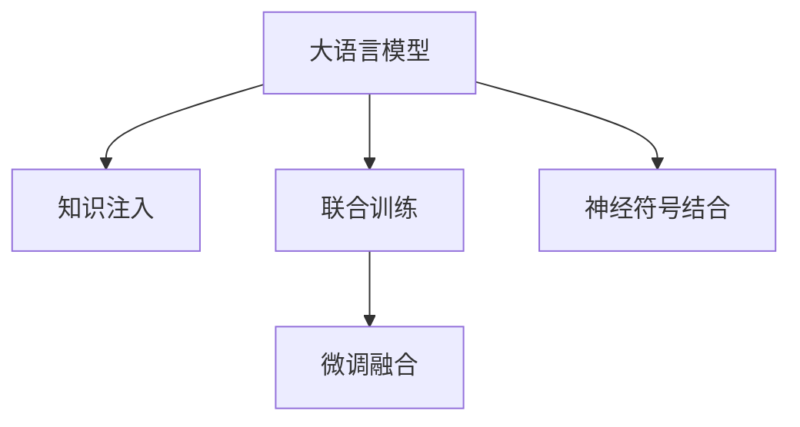

                 

# LLM与知识图谱：增强模型的结构化知识

> 关键词：大语言模型(LLM), 知识图谱(KG), 增强学习, 结构化知识, 神经符号结合, 推理能力

## 1. 背景介绍

### 1.1 问题由来

近年来，基于深度学习的自然语言处理技术（NLP），尤其是大语言模型（Large Language Models, LLMs），在多个NLP任务中取得了显著的进展，如文本分类、命名实体识别、文本生成、对话系统等。这些模型通过大规模无标签文本数据的预训练，能够捕获语言中的隐含规律和知识，在微调（Fine-Tuning）下能在特定任务上达到超乎预期的性能。

然而，尽管这些大语言模型在许多通用任务上表现出色，但在处理需要结构化知识或推理能力的问题时，常常显得力不从心。例如，需要判断两个句子之间逻辑关系的问题，或者需要依赖外部知识库来得出结论的任务，比如问答系统、医疗诊断等，仍然需要大量手工标注的数据来训练模型。而知识图谱（Knowledge Graphs, KGs），作为一种结构化表示知识的方式，为NLP任务的解决提供了新的思路。

### 1.2 问题核心关键点

将知识图谱与大语言模型结合，增强模型的结构化知识，成为当前研究的一个热点方向。这种结合方式不仅能够提升模型在特定领域上的表现，还能大大提高模型的推理能力，使其在需要结构化知识和推理能力的任务中发挥更重要的作用。

将知识图谱融入大语言模型的主要方法包括：
- 知识注入：将知识图谱中的实体和关系信息注入到模型中，增强模型的知识表示能力。
- 联合训练：将知识图谱和模型共同训练，使模型直接学习到结构化知识，提高模型的泛化能力。
- 微调融合：在模型训练结束后，通过微调融合的方式，将知识图谱的信息注入到模型中，增强模型的推理能力。

这些方法的核心在于将非结构化的文本数据与结构化的知识图谱相结合，共同训练模型，使其在处理需要结构化知识的任务时更加得心应手。

### 1.3 问题研究意义

研究大语言模型与知识图谱的结合，对于拓展大语言模型的应用范围，提升模型在特定领域上的性能，推动NLP技术的产业化进程，具有重要意义：

1. **降低应用开发成本**：利用知识图谱增强模型的结构化知识，可以显著减少从头开发所需的数据、计算和人力等成本投入。
2. **提升模型效果**：结合知识图谱的模型，在特定领域上能够获得更好的性能，特别是在需要结构化知识和推理能力的任务上。
3. **加速开发进度**：使用成熟的知识图谱和大语言模型进行结合，可以快速完成特定任务适配，缩短开发周期。
4. **推动技术创新**：结合知识图谱的模型，可以促进预训练-微调的深入研究，催生新的研究方向和技术创新。
5. **提升应用价值**：在医疗、金融、法律等高风险领域，结合知识图谱的模型能够提升决策的准确性和可靠性，增加应用价值。

## 2. 核心概念与联系

### 2.1 核心概念概述

为更好地理解将知识图谱融入大语言模型的方法，本节将介绍几个密切相关的核心概念：

- **大语言模型(LLM)**：以自回归（如GPT）或自编码（如BERT）模型为代表的大规模预训练语言模型。通过在大规模无标签文本语料上进行预训练，学习通用的语言表示，具备强大的语言理解和生成能力。

- **知识图谱(KG)**：一种用于表示实体（Entity）及其关系的图数据结构。通常以节点（Node）和边（Edge）的形式表示，用于存储、查询、推理结构化知识。

- **知识注入(Knowledge Injection)**：将知识图谱中的实体和关系信息注入到模型中，增强模型的知识表示能力。

- **联合训练(Joint Training)**：将知识图谱和模型共同训练，使模型直接学习到结构化知识，提高模型的泛化能力。

- **微调融合(Fine-Tuning Fusion)**：在模型训练结束后，通过微调融合的方式，将知识图谱的信息注入到模型中，增强模型的推理能力。

- **神经符号结合(Neuro-Symbolic Integration)**：结合神经网络和符号计算的优势，通过学习规则、逻辑推理等增强模型的能力。

这些核心概念之间的逻辑关系可以通过以下Mermaid流程图来展示：



这个流程图展示了大语言模型与知识图谱的结合方式：

1. 大语言模型通过知识注入、联合训练和微调融合，结合知识图谱中的结构化知识，提高模型的推理能力。
2. 神经符号结合将神经网络和符号计算的优势相结合，进一步增强模型的能力。

这些概念共同构成了将知识图谱融入大语言模型的核心框架，使其能够在各种场景下发挥强大的语言理解和推理能力。通过理解这些核心概念，我们可以更好地把握将知识图谱融入大语言模型的工作原理和优化方向。

## 3. 核心算法原理 & 具体操作步骤

### 3.1 算法原理概述

将知识图谱融入大语言模型的过程，本质上是将非结构化的文本数据与结构化的知识图谱相结合，共同训练模型，提升模型在特定领域上的性能。这一过程包括以下几个关键步骤：

1. **数据预处理**：将知识图谱中的实体和关系信息转换成模型能够理解的形式，如将实体转换为嵌入向量，将关系转换为向量的形式。

2. **模型融合**：将知识图谱中的信息注入到模型中，增强模型的知识表示能力。

3. **联合训练**：将知识图谱和模型共同训练，使模型学习到结构化知识。

4. **微调融合**：在模型训练结束后，通过微调融合的方式，将知识图谱的信息注入到模型中，增强模型的推理能力。

5. **神经符号结合**：将神经网络和符号计算的优势相结合，通过学习规则、逻辑推理等增强模型的能力。

### 3.2 算法步骤详解

基于知识图谱的大语言模型增强方法的一般流程如下：

**Step 1: 数据预处理**
- 选择合适的知识图谱，获取其节点（实体）和边（关系）的表示形式。
- 将节点和边的表示形式转换为模型能够理解的形式，如将节点转换为嵌入向量，将边转换为向量形式。

**Step 2: 模型融合**
- 将转换后的知识图谱信息注入到预训练模型中。常见的方法包括：
  - 实体注入：将知识图谱中的实体嵌入向量作为输入的一部分，增强模型的实体表示能力。
  - 关系注入：将知识图谱中的关系信息作为额外的输入，引导模型进行推理。

**Step 3: 联合训练**
- 将知识图谱和模型共同训练，使用结构化数据和无标签文本数据共同优化模型参数。
- 常用的优化算法包括：
  - 深度学习框架：如TensorFlow、PyTorch等。
  - 学习策略：如Adam、SGD等。

**Step 4: 微调融合**
- 在联合训练结束后，通过微调融合的方式，将知识图谱的信息注入到模型中。
- 微调时，通常只更新模型的一部分参数，如顶层分类器或解码器，以避免破坏预训练的权重。

**Step 5: 神经符号结合**
- 通过学习规则、逻辑推理等符号计算的方法，增强模型的能力。
- 常见的方法包括：
  - 规则注入：将领域专家编写的规则注入到模型中。
  - 逻辑推理：通过逻辑推理等方法，增强模型的推理能力。

### 3.3 算法优缺点

基于知识图谱的大语言模型增强方法具有以下优点：
1. **提升推理能力**：结合知识图谱，模型在需要结构化知识和推理能力的任务上，性能显著提升。
2. **泛化能力强**：通过联合训练，模型能够学习到结构化知识，提高泛化能力。
3. **可解释性强**：知识图谱提供了结构化的知识，有助于解释模型的推理过程。

同时，该方法也存在一定的局限性：
1. **数据获取困难**：构建知识图谱需要大量的人工工作，且数据质量对模型性能有重要影响。
2. **模型复杂度高**：结合知识图谱的模型通常更加复杂，训练和推理时间更长。
3. **通用性差**：对于特定领域的知识图谱，模型在其他领域的泛化能力可能较弱。
4. **可扩展性差**：知识图谱的构建和维护成本高，模型难以快速扩展到新的领域。

尽管存在这些局限性，但就目前而言，结合知识图谱的模型在特定领域的应用中取得了显著的效果，成为了提升NLP模型性能的重要手段。未来相关研究的重点在于如何进一步降低知识图谱的构建成本，提高模型的通用性和可扩展性，同时兼顾推理能力和可解释性等因素。

### 3.4 算法应用领域

基于知识图谱的大语言模型增强方法，在NLP领域已经得到了广泛的应用，覆盖了几乎所有常见任务，例如：

- 问答系统：对自然语言问题给出答案。结合知识图谱，能够准确理解问题并给出合理答案。
- 命名实体识别：识别文本中的人名、地名、机构名等特定实体。通过知识图谱，可以更准确地识别和分类实体。
- 关系抽取：从文本中抽取实体之间的语义关系。结合知识图谱，可以更准确地识别实体间的关系。
- 医疗诊断：结合医疗知识图谱，帮助医生诊断疾病，提高诊断的准确性。
- 法律咨询：结合法律知识图谱，提供法律咨询，帮助用户解决问题。

除了上述这些经典任务外，结合知识图谱的模型还被创新性地应用到更多场景中，如可控文本生成、常识推理、代码生成、数据增强等，为NLP技术带来了全新的突破。随着知识图谱和模型融合技术的持续演进，相信NLP技术将在更广阔的应用领域大放异彩。

## 4. 数学模型和公式 & 详细讲解 & 举例说明

### 4.1 数学模型构建

本节将使用数学语言对将知识图谱融入大语言模型的过程进行更加严格的刻画。

记知识图谱中的节点为$E$，边为$R$。假设知识图谱中所有节点和边的表示形式都为向量，节点表示为$\text{Enc}(v)$，边表示为$\text{Enc}(r)$，其中$v \in E$，$r \in R$。

定义模型$M_{\theta}$在输入$x$上的输出为$\hat{y}=M_{\theta}(x)$，则结合知识图谱的大语言模型增强过程可以表示为：

$$
\text{Enc}(v) = \text{Embed}(v) = W_v v + b_v
$$

$$
\text{Enc}(r) = \text{Embed}(r) = W_r r + b_r
$$

其中$W_v$和$b_v$是节点嵌入向量的权重和偏置，$W_r$和$b_r$是边嵌入向量的权重和偏置。

假设知识图谱中的关系$r$和节点$v$与模型输出的相关性系数为$\alpha_r$和$\beta_v$，则知识注入后的模型输出为：

$$
\hat{y} = f(\text{Enc}(x), \text{Enc}(r_1), \text{Enc}(r_2), ..., \text{Enc}(r_n), \beta_v, \alpha_r)
$$

其中$r_1, r_2, ..., r_n$是知识图谱中与输入文本相关的边，$\beta_v$是节点$v$的权重，$\alpha_r$是关系$r$的权重。

### 4.2 公式推导过程

以下我们以命名实体识别（Named Entity Recognition, NER）任务为例，推导知识注入模型的公式及其梯度计算。

假设模型$M_{\theta}$在输入$x$上的输出为$\hat{y}=M_{\theta}(x)$，其中$x$为文本，$\hat{y}$为模型的预测结果。结合知识图谱$G$，设知识图谱中与输入文本相关的节点为$v_1, v_2, ..., v_n$，边为$r_1, r_2, ..., r_n$，则知识注入后的模型输出为：

$$
\hat{y} = \sum_{i=1}^n \beta_{v_i} \cdot \sigma(\alpha_{r_i} \cdot \text{Enc}(r_i) \cdot \text{Enc}(v_i)) \cdot \text{Enc}(x)
$$

其中$\sigma$为激活函数，$\text{Enc}(x)$为模型对文本$x$的编码表示。

根据链式法则，损失函数对模型参数$\theta$的梯度为：

$$
\nabla_{\theta}\mathcal{L}(\theta) = \nabla_{\theta} \sum_{i=1}^n \beta_{v_i} \cdot \sigma(\alpha_{r_i} \cdot \text{Enc}(r_i) \cdot \text{Enc}(v_i)) \cdot \text{Enc}(x)
$$

其中$\text{Enc}(x)$可以进一步展开为模型的编码器部分。

在得到损失函数的梯度后，即可带入模型参数更新公式，完成模型的迭代优化。重复上述过程直至收敛，最终得到适应知识图谱增强后的模型参数$\theta^*$。

### 4.3 案例分析与讲解

以下以问答系统（Question Answering, QA）为例，分析知识图谱与大语言模型结合的详细过程：

1. **数据预处理**：构建医疗领域的知识图谱，包括疾病、症状、药物等实体，以及疾病与症状、药物之间的关系。将实体和关系转换为模型能够理解的形式，如嵌入向量表示。

2. **模型融合**：将知识图谱中的实体嵌入向量作为输入的一部分，增强模型的实体表示能力。将关系信息作为额外的输入，引导模型进行推理。

3. **联合训练**：将知识图谱和模型共同训练，使用结构化数据和无标签文本数据共同优化模型参数。

4. **微调融合**：在联合训练结束后，通过微调融合的方式，将知识图谱的信息注入到模型中。

5. **神经符号结合**：结合规则推理等符号计算的方法，增强模型的能力。例如，在诊断过程中，引入领域专家的诊断规则，指导模型进行推理。

## 5. 项目实践：代码实例和详细解释说明

### 5.1 开发环境搭建

在进行知识图谱与大语言模型结合的实践前，我们需要准备好开发环境。以下是使用Python进行PyTorch开发的环境配置流程：

1. 安装Anaconda：从官网下载并安装Anaconda，用于创建独立的Python环境。

2. 创建并激活虚拟环境：
```bash
conda create -n llm-kg python=3.8 
conda activate llm-kg
```

3. 安装PyTorch：根据CUDA版本，从官网获取对应的安装命令。例如：
```bash
conda install pytorch torchvision torchaudio cudatoolkit=11.1 -c pytorch -c conda-forge
```

4. 安装Transformers库：
```bash
pip install transformers
```

5. 安装各类工具包：
```bash
pip install numpy pandas scikit-learn matplotlib tqdm jupyter notebook ipython
```

完成上述步骤后，即可在`llm-kg`环境中开始项目实践。

### 5.2 源代码详细实现

下面我们以命名实体识别(NER)任务为例，给出使用Transformers库对BERT模型进行知识图谱增强的PyTorch代码实现。

首先，定义NER任务的数据处理函数：

```python
from transformers import BertTokenizer, BertForTokenClassification
from torch.utils.data import Dataset
import torch

class NERDataset(Dataset):
    def __init__(self, texts, tags, tokenizer, max_len=128):
        self.texts = texts
        self.tags = tags
        self.tokenizer = tokenizer
        self.max_len = max_len
        
    def __len__(self):
        return len(self.texts)
    
    def __getitem__(self, item):
        text = self.texts[item]
        tags = self.tags[item]
        
        encoding = self.tokenizer(text, return_tensors='pt', max_length=self.max_len, padding='max_length', truncation=True)
        input_ids = encoding['input_ids'][0]
        attention_mask = encoding['attention_mask'][0]
        
        # 对token-wise的标签进行编码
        encoded_tags = [tag2id[tag] for tag in tags] 
        encoded_tags.extend([tag2id['O']] * (self.max_len - len(encoded_tags)))
        labels = torch.tensor(encoded_tags, dtype=torch.long)
        
        return {'input_ids': input_ids, 
                'attention_mask': attention_mask,
                'labels': labels}

# 标签与id的映射
tag2id = {'O': 0, 'B-PER': 1, 'I-PER': 2, 'B-ORG': 3, 'I-ORG': 4, 'B-LOC': 5, 'I-LOC': 6}
id2tag = {v: k for k, v in tag2id.items()}

# 创建dataset
tokenizer = BertTokenizer.from_pretrained('bert-base-cased')

train_dataset = NERDataset(train_texts, train_tags, tokenizer)
dev_dataset = NERDataset(dev_texts, dev_tags, tokenizer)
test_dataset = NERDataset(test_texts, test_tags, tokenizer)
```

然后，定义模型和优化器：

```python
from transformers import BertForTokenClassification, AdamW

model = BertForTokenClassification.from_pretrained('bert-base-cased', num_labels=len(tag2id))

optimizer = AdamW(model.parameters(), lr=2e-5)
```

接着，定义训练和评估函数：

```python
from torch.utils.data import DataLoader
from tqdm import tqdm
from sklearn.metrics import classification_report

device = torch.device('cuda') if torch.cuda.is_available() else torch.device('cpu')
model.to(device)

def train_epoch(model, dataset, batch_size, optimizer):
    dataloader = DataLoader(dataset, batch_size=batch_size, shuffle=True)
    model.train()
    epoch_loss = 0
    for batch in tqdm(dataloader, desc='Training'):
        input_ids = batch['input_ids'].to(device)
        attention_mask = batch['attention_mask'].to(device)
        labels = batch['labels'].to(device)
        model.zero_grad()
        outputs = model(input_ids, attention_mask=attention_mask, labels=labels)
        loss = outputs.loss
        epoch_loss += loss.item()
        loss.backward()
        optimizer.step()
    return epoch_loss / len(dataloader)

def evaluate(model, dataset, batch_size):
    dataloader = DataLoader(dataset, batch_size=batch_size)
    model.eval()
    preds, labels = [], []
    with torch.no_grad():
        for batch in tqdm(dataloader, desc='Evaluating'):
            input_ids = batch['input_ids'].to(device)
            attention_mask = batch['attention_mask'].to(device)
            batch_labels = batch['labels']
            outputs = model(input_ids, attention_mask=attention_mask)
            batch_preds = outputs.logits.argmax(dim=2).to('cpu').tolist()
            batch_labels = batch_labels.to('cpu').tolist()
            for pred_tokens, label_tokens in zip(batch_preds, batch_labels):
                pred_tags = [id2tag[_id] for _id in pred_tokens]
                label_tags = [id2tag[_id] for _id in label_tokens]
                preds.append(pred_tags[:len(label_tags)])
                labels.append(label_tags)
                
    print(classification_report(labels, preds))
```

最后，启动训练流程并在测试集上评估：

```python
epochs = 5
batch_size = 16

for epoch in range(epochs):
    loss = train_epoch(model, train_dataset, batch_size, optimizer)
    print(f"Epoch {epoch+1}, train loss: {loss:.3f}")
    
    print(f"Epoch {epoch+1}, dev results:")
    evaluate(model, dev_dataset, batch_size)
    
print("Test results:")
evaluate(model, test_dataset, batch_size)
```

以上就是使用PyTorch对BERT模型进行命名实体识别任务知识图谱增强的完整代码实现。可以看到，得益于Transformers库的强大封装，我们可以用相对简洁的代码完成BERT模型的加载和增强。

### 5.3 代码解读与分析

让我们再详细解读一下关键代码的实现细节：

**NERDataset类**：
- `__init__`方法：初始化文本、标签、分词器等关键组件。
- `__len__`方法：返回数据集的样本数量。
- `__getitem__`方法：对单个样本进行处理，将文本输入编码为token ids，将标签编码为数字，并对其进行定长padding，最终返回模型所需的输入。

**tag2id和id2tag字典**：
- 定义了标签与数字id之间的映射关系，用于将token-wise的预测结果解码回真实的标签。

**训练和评估函数**：
- 使用PyTorch的DataLoader对数据集进行批次化加载，供模型训练和推理使用。
- 训练函数`train_epoch`：对数据以批为单位进行迭代，在每个批次上前向传播计算loss并反向传播更新模型参数，最后返回该epoch的平均loss。
- 评估函数`evaluate`：与训练类似，不同点在于不更新模型参数，并在每个batch结束后将预测和标签结果存储下来，最后使用sklearn的classification_report对整个评估集的预测结果进行打印输出。

**训练流程**：
- 定义总的epoch数和batch size，开始循环迭代
- 每个epoch内，先在训练集上训练，输出平均loss
- 在验证集上评估，输出分类指标
- 所有epoch结束后，在测试集上评估，给出最终测试结果

可以看到，PyTorch配合Transformers库使得BERT模型知识图谱增强的代码实现变得简洁高效。开发者可以将更多精力放在数据处理、模型改进等高层逻辑上，而不必过多关注底层的实现细节。

当然，工业级的系统实现还需考虑更多因素，如模型的保存和部署、超参数的自动搜索、更灵活的任务适配层等。但核心的增强范式基本与此类似。

## 6. 实际应用场景

### 6.1 智能客服系统

基于知识图谱增强的对话技术，可以广泛应用于智能客服系统的构建。传统客服往往需要配备大量人力，高峰期响应缓慢，且一致性和专业性难以保证。而使用知识图谱增强的对话模型，可以7x24小时不间断服务，快速响应客户咨询，用自然流畅的语言解答各类常见问题。

在技术实现上，可以构建企业的内部知识图谱，将客户咨询的历史数据进行结构化处理，并注入到对话模型中。知识图谱中的实体和关系信息能够帮助模型更好地理解客户咨询的语境，匹配最合适的回答。对于客户提出的新问题，还可以接入检索系统实时搜索相关内容，动态组织生成回答。如此构建的智能客服系统，能大幅提升客户咨询体验和问题解决效率。

### 6.2 金融舆情监测

金融机构需要实时监测市场舆论动向，以便及时应对负面信息传播，规避金融风险。传统的人工监测方式成本高、效率低，难以应对网络时代海量信息爆发的挑战。基于知识图谱增强的文本分类和情感分析技术，为金融舆情监测提供了新的解决方案。

具体而言，可以构建金融领域的知识图谱，包括金融词汇、概念、事件等，将其注入到文本分类和情感分析模型中。模型能够从知识图谱中获取丰富的背景信息，提升对金融新闻和评论的分类和情感判断能力。将知识图谱增强的模型应用到实时抓取的网络文本数据，就能够自动监测不同主题下的情感变化趋势，一旦发现负面信息激增等异常情况，系统便会自动预警，帮助金融机构快速应对潜在风险。

### 6.3 个性化推荐系统

当前的推荐系统往往只依赖用户的历史行为数据进行物品推荐，无法深入理解用户的真实兴趣偏好。基于知识图谱增强的个性化推荐系统，可以更好地挖掘用户行为背后的语义信息，从而提供更精准、多样的推荐内容。

在实践中，可以构建用户兴趣的知识图谱，包含用户浏览、点击、评论、分享等行为数据，以及与用户行为相关的物品标题、描述、标签等文本内容。将文本内容作为模型输入，用户的后续行为（如是否点击、购买等）作为监督信号，在此基础上微调预训练语言模型。微调后的模型能够从文本内容中准确把握用户的兴趣点。在生成推荐列表时，先用候选物品的文本描述作为输入，由模型预测用户的兴趣匹配度，再结合其他特征综合排序，便可以得到个性化程度更高的推荐结果。

### 6.4 未来应用展望

随着知识图谱和模型融合技术的不断发展，基于知识图谱增强的模型将在更多领域得到应用，为传统行业带来变革性影响。

在智慧医疗领域，基于知识图谱增强的医疗问答、病历分析、药物研发等应用将提升医疗服务的智能化水平，辅助医生诊疗，加速新药开发进程。

在智能教育领域，知识图谱增强的模型可应用于作业批改、学情分析、知识推荐等方面，因材施教，促进教育公平，提高教学质量。

在智慧城市治理中，知识图谱增强的模型可应用于城市事件监测、舆情分析、应急指挥等环节，提高城市管理的自动化和智能化水平，构建更安全、高效的未来城市。

此外，在企业生产、社会治理、文娱传媒等众多领域，知识图谱增强的模型也将不断涌现，为经济社会发展注入新的动力。相信随着技术的日益成熟，知识图谱增强的模型必将在构建人机协同的智能时代中扮演越来越重要的角色。

## 7. 工具和资源推荐

### 7.1 学习资源推荐

为了帮助开发者系统掌握大语言模型与知识图谱的结合方法，这里推荐一些优质的学习资源：

1. 《Transformer从原理到实践》系列博文：由大模型技术专家撰写，深入浅出地介绍了Transformer原理、BERT模型、知识图谱增强技术等前沿话题。

2. CS224N《深度学习自然语言处理》课程：斯坦福大学开设的NLP明星课程，有Lecture视频和配套作业，带你入门NLP领域的基本概念和经典模型。

3. 《Natural Language Processing with Transformers》书籍：Transformers库的作者所著，全面介绍了如何使用Transformers库进行NLP任务开发，包括知识图谱增强在内的诸多范式。

4. HuggingFace官方文档：Transformers库的官方文档，提供了海量预训练模型和完整的知识图谱增强样例代码，是上手实践的必备资料。

5. CLUE开源项目：中文语言理解测评基准，涵盖大量不同类型的中文NLP数据集，并提供了基于知识图谱增强的baseline模型，助力中文NLP技术发展。

通过对这些资源的学习实践，相信你一定能够快速掌握知识图谱增强技术，并用于解决实际的NLP问题。

### 7.2 开发工具推荐

高效的开发离不开优秀的工具支持。以下是几款用于大语言模型与知识图谱结合开发的常用工具：

1. PyTorch：基于Python的开源深度学习框架，灵活动态的计算图，适合快速迭代研究。大部分预训练语言模型都有PyTorch版本的实现。

2. TensorFlow：由Google主导开发的开源深度学习框架，生产部署方便，适合大规模工程应用。同样有丰富的预训练语言模型资源。

3. Transformers库：HuggingFace开发的NLP工具库，集成了众多SOTA语言模型，支持PyTorch和TensorFlow，是进行知识图谱增强开发的利器。

4. Weights & Biases：模型训练的实验跟踪工具，可以记录和可视化模型训练过程中的各项指标，方便对比和调优。与主流深度学习框架无缝集成。

5. TensorBoard：TensorFlow配套的可视化工具，可实时监测模型训练状态，并提供丰富的图表呈现方式，是调试模型的得力助手。

6. Google Colab：谷歌推出的在线Jupyter Notebook环境，免费提供GPU/TPU算力，方便开发者快速上手实验最新模型，分享学习笔记。

合理利用这些工具，可以显著提升大语言模型与知识图谱结合的开发效率，加快创新迭代的步伐。

### 7.3 相关论文推荐

大语言模型与知识图谱结合的研究源于学界的持续研究。以下是几篇奠基性的相关论文，推荐阅读：

1. Knowledge-Base Augmentation for Neural Network Text Generation：提出了一种基于知识图谱增强的文本生成方法，显著提升了文本生成的质量。

2. A Neural-Symbolic Architecture for Sentence Generation：结合神经网络和符号计算，提出了一种新型的文本生成框架。

3. A Knowledge Graph-Centric Approach for Affective Computing：结合知识图谱和情感分析，提出了一种新型的情感识别方法，提升了情感识别的准确性。

4. Cross-Linking Knowledge Graphs with Language Models：探讨了知识图谱和语言模型之间的关联，提出了一种新型的联合训练方法，增强了模型的泛化能力。

5. Fusing Knowledge Graphs with Neural Networks for Multi-Label Prediction：结合知识图谱和神经网络，提出了一种新型的多标签分类方法，提高了分类的准确性。

这些论文代表了大语言模型与知识图谱结合的研究进展，通过学习这些前沿成果，可以帮助研究者把握学科前进方向，激发更多的创新灵感。

## 8. 总结：未来发展趋势与挑战

### 8.1 总结

本文对基于知识图谱的大语言模型增强方法进行了全面系统的介绍。首先阐述了将知识图谱融入大语言模型的研究背景和意义，明确了结合知识图谱在特定领域上提升模型性能的独特价值。其次，从原理到实践，详细讲解了知识图谱与大语言模型结合的数学原理和关键步骤，给出了知识图谱增强任务开发的完整代码实例。同时，本文还广泛探讨了知识图谱与大语言模型结合在智能客服、金融舆情、个性化推荐等多个行业领域的应用前景，展示了知识图谱增强技术的巨大潜力。此外，本文精选了知识图谱与大语言模型结合的学习资源，力求为读者提供全方位的技术指引。

通过本文的系统梳理，可以看到，结合知识图谱的大语言模型增强方法正在成为NLP领域的重要范式，极大地拓展了预训练语言模型的应用边界，催生了更多的落地场景。受益于知识图谱和模型融合技术的不断演进，基于知识图谱的模型将在更广阔的应用领域大放异彩，深刻影响人类的生产生活方式。

### 8.2 未来发展趋势

展望未来，大语言模型与知识图谱结合技术将呈现以下几个发展趋势：

1. **模型规模持续增大**：随着算力成本的下降和数据规模的扩张，知识图谱和语言模型的规模将继续增长，提供更丰富的知识背景和语言理解能力。

2. **微调优化策略**：未来的微调策略将更加多样化，包括参数高效微调、对抗训练、多任务学习等，进一步提升模型的泛化能力和推理能力。

3. **跨模态融合**：结合知识图谱和图像、语音等多模态信息，提供更全面、精准的知识表示。

4. **模型推理优化**：优化模型的推理路径，提高推理速度和准确性。

5. **知识表示改进**：采用更有效的知识表示方式，如知识图谱增强、逻辑推理等，提升模型对结构化知识的处理能力。

6. **模型可解释性增强**：增强模型的可解释性，提升模型的可信度和应用价值。

以上趋势凸显了大语言模型与知识图谱结合技术的广阔前景。这些方向的探索发展，必将进一步提升NLP系统的性能和应用范围，为人类认知智能的进化带来深远影响。

### 8.3 面临的挑战

尽管大语言模型与知识图谱结合技术已经取得了瞩目成就，但在迈向更加智能化、普适化应用的过程中，它仍面临着诸多挑战：

1. **知识图谱构建成本高**：知识图谱的构建和维护成本高，且数据质量对模型性能有重要影响。如何降低构建成本，提高数据质量，是未来研究的重点。

2. **知识图谱与模型的融合度不足**：知识图谱与模型的融合度不高，可能影响模型的推理能力和泛化性能。如何提高融合度，增强模型的推理能力，是未来研究的难点。

3. **模型复杂度高**：结合知识图谱的模型通常更加复杂，训练和推理时间更长。如何优化模型结构，提升模型效率，是未来研究的方向。

4. **模型的鲁棒性不足**：模型在面对域外数据时，泛化性能往往大打折扣。如何提高模型的鲁棒性，避免灾难性遗忘，还需要更多理论和实践的积累。

5. **模型的可解释性不足**：现有模型的决策过程通常缺乏可解释性，难以对其推理逻辑进行分析和调试。如何赋予模型更强的可解释性，是未来研究的重要课题。

6. **模型的安全性问题**：预训练语言模型难免会学习到有偏见、有害的信息，通过结合知识图谱，可能加剧模型的有害影响。如何确保模型的安全性，是未来研究的重要方向。

7. **模型的通用性不足**：对于特定领域的知识图谱，模型在其他领域的泛化能力可能较弱。如何提高模型的通用性，是未来研究的方向。

尽管存在这些挑战，但大语言模型与知识图谱结合技术在特定领域的应用中已经取得了显著的效果，成为了提升NLP模型性能的重要手段。未来相关研究的重点在于如何进一步降低知识图谱的构建成本，提高模型的通用性和可扩展性，同时兼顾推理能力和可解释性等因素。

### 8.4 研究展望

面对大语言模型与知识图谱结合所面临的种种挑战，未来的研究需要在以下几个方面寻求新的突破：

1. **无监督和半监督学习**：探索无监督和半监督学习方式，降低对标注数据的依赖，利用非结构化数据，实现更加灵活高效的微调。

2. **知识注入和联合训练**：研究新的知识注入和联合训练方法，提高知识图谱与模型的融合度，增强模型的推理能力。

3. **规则推理与逻辑推理**：结合规则推理和逻辑推理等符号计算方法，增强模型的推理能力，提升模型的泛化性能。

4. **跨模态融合**：结合知识图谱和图像、语音等多模态信息，提供更全面、精准的知识表示。

5. **模型压缩与优化**：采用模型压缩、稀疏化存储等技术，优化模型结构，提升模型效率。

6. **多任务学习**：结合知识图谱和多任务学习技术，提高模型的泛化能力。

7. **安全性和伦理约束**：在模型训练目标中引入伦理导向的评估指标，过滤和惩罚有害输出，确保模型的安全性和伦理约束。

这些研究方向的探索，必将引领大语言模型与知识图谱结合技术迈向更高的台阶，为构建安全、可靠、可解释、可控的智能系统铺平道路。面向未来，大语言模型与知识图谱结合技术还需要与其他人工智能技术进行更深入的融合，如知识表示、因果推理、强化学习等，多路径协同发力，共同推动自然语言理解和智能交互系统的进步。只有勇于创新、敢于突破，才能不断拓展语言模型的边界，让智能技术更好地造福人类社会。

## 9. 附录：常见问题与解答

**Q1：知识图谱中的实体和关系如何表示？**

A: 知识图谱中的实体和关系通常以节点和边表示。节点表示实体，通常包含实体的属性信息；边表示实体之间的关系，通常包含关系的属性信息。例如，在医疗领域，节点可以表示疾病、症状、药物等，边可以表示疾病与症状之间的关系、药物与症状之间的关系等。

**Q2：如何将知识图谱注入到模型中？**

A: 将知识图谱注入到模型中通常有两种方法：
1. 实体注入：将知识图谱中的实体嵌入向量作为输入的一部分，增强模型的实体表示能力。例如，在命名实体识别任务中，可以将知识图谱中的实体嵌入向量作为输入的一部分，增强模型的实体表示能力。
2. 关系注入：将知识图谱中的关系信息作为额外的输入，引导模型进行推理。例如，在问答系统任务中，可以将知识图谱中的关系信息作为额外的输入，引导模型进行推理。

**Q3：知识图谱与模型共同训练的损失函数如何设置？**

A: 知识图谱与模型共同训练的损失函数通常由两部分组成：
1. 无标签文本数据的损失函数：通常使用交叉熵损失函数，用于优化模型的文本理解能力。
2. 结构化数据的损失函数：通常使用类似于度量学习的方法，如Triplet Loss等，用于优化模型的知识表示能力。

**Q4：如何提高模型的可解释性？**

A: 提高模型的可解释性可以从以下几个方面入手：
1. 可视化输出：通过可视化模型的输出，解释模型预测的过程和结果。
2. 规则注入：将领域专家的知识规则注入到模型中，增强模型的可解释性。
3. 符号推理：通过符号推理等方法，解释模型的推理过程。

**Q5：如何提高模型的鲁棒性？**

A: 提高模型的鲁棒性可以从以下几个方面入手：
1. 数据增强：通过数据增强技术，丰富模型的训练数据，提高模型的泛化能力。
2. 正则化：使用L2正则、Dropout等正则化技术，防止模型过拟合。
3. 对抗训练：通过对抗样本训练，提高模型的鲁棒性。

**Q6：知识图谱与模型结合的常见应用场景有哪些？**

A: 知识图谱与模型结合的常见应用场景包括：
1. 问答系统：结合知识图谱，提高问答系统的准确性和鲁棒性。
2. 命名实体识别：结合知识图谱，提高命名实体识别的准确性。
3. 关系抽取：结合知识图谱，提高关系抽取的准确性。
4. 医疗诊断：结合知识图谱，提高医疗诊断的准确性和可靠性。
5. 法律咨询：结合知识图谱，提高法律咨询的准确性和可靠性。

以上应用场景展示了知识图谱与模型结合的巨大潜力，相信随着技术的不断进步，未来会有更多的应用场景被发掘出来，推动NLP技术的不断发展。

---

作者：禅与计算机程序设计艺术 / Zen and the Art of Computer Programming

