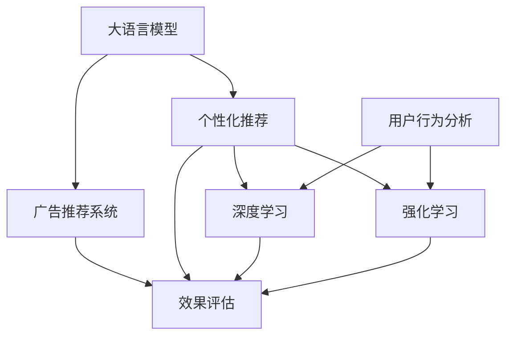

                 

# LLM在个性化广告推荐中的应用前景

> 关键词：
1. 语言模型
2. 广告推荐
3. 个性化
4. 深度学习
5. 强化学习
6. 用户行为分析
7. 效果评估

## 1. 背景介绍

在数字时代，个性化广告推荐已成为电商平台、社交媒体、新闻应用等互联网产品提升用户体验、增加商业价值的关键手段。广告推荐系统通过精准分析用户行为，为用户提供最匹配、最相关的内容推荐，从而提高用户留存率和点击率，增加品牌曝光和销售转化。

然而，传统的广告推荐系统主要基于规则和特征工程，缺乏足够的智能和自动化。且随着用户行为的多样化和数据量的爆炸式增长，传统推荐系统在个性化程度和实时性方面存在明显不足。

近年来，深度学习和强化学习等人工智能技术在广告推荐领域的应用，带来了革命性的变化。其中，基于大语言模型（LLM）的推荐系统，正逐渐成为个性化的广告推荐新范式。

## 2. 核心概念与联系

### 2.1 核心概念概述

为更好地理解基于LLM的广告推荐系统，本节将介绍几个关键概念：

- 大语言模型（Large Language Model, LLM）：指基于Transformer架构的大规模预训练语言模型，通过海量无标签文本数据进行预训练，学习到丰富的语言知识。
- 广告推荐系统（Ad Rec System）：通过分析用户行为和历史记录，为每个用户推荐最相关的广告内容。
- 个性化推荐（Personalized Recommendation）：通过分析用户特征和行为，为用户定制化推荐内容，提升用户体验。
- 深度学习（Deep Learning）：使用多层神经网络进行复杂数据分析和模型训练，提升推荐系统的准确性和泛化能力。
- 强化学习（Reinforcement Learning, RL）：通过智能体的交互和学习，不断优化推荐策略，提升推荐效果。
- 用户行为分析（User Behavior Analysis）：通过对用户浏览、点击、购买等行为的分析和建模，洞察用户兴趣和需求。
- 效果评估（Performance Evaluation）：通过A/B测试、ROI分析、转化率等指标，评估推荐系统的实际效果和价值。

这些概念之间的逻辑关系可以通过以下Mermaid流程图来展示：



这个流程图展示了大语言模型在广告推荐系统中的应用路径：

1. 大语言模型通过预训练获得基础能力。
2. 广告推荐系统利用大语言模型进行广告内容生成。
3. 个性化推荐系统根据用户行为，调整广告推荐策略。
4. 深度学习用于特征提取和模型训练。
5. 强化学习用于动态调整推荐策略。
6. 用户行为分析提供数据支持。
7. 效果评估衡量系统性能。

## 3. 核心算法原理 & 具体操作步骤
### 3.1 算法原理概述

基于LLM的广告推荐系统，通过深度学习和大语言模型，从用户的历史行为和上下文中生成个性化广告。其核心思想是：将大语言模型视作一个强大的广告生成器，通过学习用户的文本输入和行为数据，输出个性化的广告内容。

形式化地，假设用户行为数据为 $D=\{(x_i,y_i)\}_{i=1}^N, x_i \in \mathcal{X}, y_i \in \mathcal{Y}$，其中 $x_i$ 为用户行为数据，如浏览记录、购买历史、搜索关键词等，$y_i$ 为广告内容。广告推荐系统的目标是最小化损失函数 $\mathcal{L}$，使得生成的广告内容 $y_i$ 尽可能与用户行为 $x_i$ 相关。

常用的损失函数包括交叉熵损失、均方误差损失等。通过梯度下降等优化算法，系统不断更新模型参数，最小化损失函数，最终得到最优的广告推荐策略。

### 3.2 算法步骤详解

基于LLM的广告推荐系统一般包括以下几个关键步骤：

**Step 1: 准备数据集和预训练模型**
- 收集用户行为数据 $D$，包括浏览历史、购买记录、搜索关键词等。
- 准备广告内容语料库 $\mathcal{Y}$，用于生成候选广告内容。
- 选择合适的预训练语言模型 $M_{\theta}$，如BERT、GPT等，作为初始化参数。

**Step 2: 设计广告生成器**
- 设计广告生成器 $G(x_i)$，将用户行为数据 $x_i$ 输入到预训练模型 $M_{\theta}$，输出生成的广告内容 $y_i$。
- 广告生成器的形式可以采用seq2seq模型、生成式Transformer模型等。

**Step 3: 选择损失函数**
- 根据广告推荐任务的特点，选择合适的损失函数，如交叉熵损失、均方误差损失等。
- 损失函数的选择取决于广告生成器的模型结构和任务需求。

**Step 4: 模型训练**
- 对广告生成器 $G(x_i)$ 进行有监督的训练，最小化损失函数 $\mathcal{L}(G(x_i),y_i)$。
- 训练过程中，可以应用正则化技术，如L2正则、Dropout、Early Stopping等，防止模型过拟合。
- 可以使用GPU、TPU等高性能设备加速模型训练。

**Step 5: 效果评估和优化**
- 在验证集上评估广告生成器的性能，包括精确率、召回率、F1值等指标。
- 根据评估结果调整广告生成器的超参数，优化模型效果。
- 使用A/B测试等方法，评估推荐系统的实际效果和ROI。

### 3.3 算法优缺点

基于LLM的广告推荐系统具有以下优点：
1. 高效智能。利用大语言模型的深度学习能力，能够自动学习广告内容生成策略，提高推荐准确性和个性化程度。
2. 可解释性强。大语言模型提供了生成广告的详细逻辑，便于分析和优化推荐策略。
3. 动态优化。通过强化学习等技术，系统可以根据用户反馈动态调整推荐策略，适应不断变化的用户需求。
4. 数据驱动。系统可以实时分析用户行为，生成最相关、最匹配的广告内容，提升用户转化率和满意度。

同时，该方法也存在一些局限性：
1. 数据需求高。需要大量的用户行为数据进行训练，数据获取成本较高。
2. 模型复杂。基于深度学习的广告生成器模型结构复杂，对计算资源要求高。
3. 鲁棒性不足。对异常样本和噪声数据较为敏感，需要更多的数据清洗和预处理。
4. 广告内容多样性问题。生成的广告内容可能过于单一，缺乏多样性和新颖性。
5. 广告欺诈问题。模型可能会被恶意用户利用，生成欺诈广告，影响用户体验。

尽管存在这些局限性，但基于LLM的广告推荐系统在广告生成和推荐上仍展现出巨大的潜力，值得进一步研究和优化。

### 3.4 算法应用领域

基于LLM的广告推荐系统已经在广告生成、个性化推荐、效果评估等多个领域得到了广泛应用，具体如下：

- 电商广告推荐：通过分析用户浏览历史和购买记录，生成个性化的电商广告，提升广告点击率和转化率。
- 社交媒体广告推荐：利用用户互动数据和兴趣标签，推荐相关广告内容，提高广告的互动和曝光效果。
- 新闻媒体广告推荐：根据用户的阅读历史和点击行为，推荐新闻标题和广告内容，增加新闻平台的活跃度和广告收入。
- 视频平台广告推荐：通过分析用户的观看历史和评分，生成个性化视频广告，提升广告点击率和观看时长。
- 品牌广告推荐：利用大语言模型分析用户社交媒体行为，生成品牌相关广告内容，增加品牌曝光和用户粘性。

除了上述这些典型应用外，基于LLM的广告推荐系统还被创新性地应用于更多场景中，如语音广告生成、AR广告推荐、智能广告投放等，为广告推荐技术带来了新的突破。

## 4. 数学模型和公式 & 详细讲解
### 4.1 数学模型构建

在本节中，我们将使用数学语言对基于LLM的广告推荐系统进行更加严格的刻画。

假设广告推荐系统的输入为 $x_i \in \mathcal{X}$，表示用户行为数据，如浏览记录、购买历史等。广告推荐系统的输出为 $y_i \in \mathcal{Y}$，表示广告内容。定义模型 $M_{\theta}$ 在输入 $x_i$ 上的生成概率分布为 $P(y_i|x_i)=\frac{exp(M_{\theta}(x_i))}{\sum_{y_j} exp(M_{\theta}(x_i))}$。则广告推荐系统的损失函数为：

$$
\mathcal{L}(\theta) = -\frac{1}{N} \sum_{i=1}^N \sum_{y_i} y_i \log P(y_i|x_i)
$$

其中 $y_i$ 为生成的广告内容，$N$ 为样本数量。

### 4.2 公式推导过程

以下我们将对广告推荐系统的损失函数进行详细的公式推导：

1. 定义模型 $M_{\theta}$ 在输入 $x_i$ 上的生成概率分布：
$$
P(y_i|x_i)=\frac{exp(M_{\theta}(x_i))}{\sum_{y_j} exp(M_{\theta}(x_i))}
$$

2. 定义广告推荐系统的损失函数：
$$
\mathcal{L}(\theta) = -\frac{1}{N} \sum_{i=1}^N \sum_{y_i} y_i \log P(y_i|x_i)
$$

3. 对损失函数进行简化：
$$
\mathcal{L}(\theta) = -\frac{1}{N} \sum_{i=1}^N \sum_{y_i} y_i M_{\theta}(x_i)
$$

4. 引入正则化项：
$$
\mathcal{L}(\theta) = -\frac{1}{N} \sum_{i=1}^N \sum_{y_i} y_i M_{\theta}(x_i) + \lambda \| \theta \|^2
$$

其中 $\lambda$ 为正则化系数，$\| \theta \|$ 为模型参数的L2范数。

通过以上公式推导，我们可以看到，广告推荐系统的损失函数包含了广告生成器和用户行为数据的影响，同时考虑了模型的正则化，以防止过拟合。

### 4.3 案例分析与讲解

以电商广告推荐为例，进行详细分析：

**Step 1: 准备数据集和预训练模型**

假设我们有一个电商网站的广告推荐系统，用户行为数据为 $D=\{(x_i,y_i)\}_{i=1}^N, x_i \in \mathcal{X}, y_i \in \mathcal{Y}$，其中 $x_i$ 为用户浏览历史和购买记录，$y_i$ 为广告内容。我们选择了BERT作为预训练模型 $M_{\theta}$，用于生成电商广告内容。

**Step 2: 设计广告生成器**

设计一个生成式Transformer广告生成器 $G(x_i)$，将用户行为数据 $x_i$ 输入到BERT模型中，输出生成的广告内容 $y_i$。

**Step 3: 选择损失函数**

我们选择交叉熵损失函数，即：
$$
\mathcal{L}(G(x_i),y_i) = -y_i \log G(x_i) - (1-y_i) \log (1-G(x_i))
$$

**Step 4: 模型训练**

在电商广告数据集上训练广告生成器 $G(x_i)$，最小化交叉熵损失函数。

**Step 5: 效果评估和优化**

在验证集上评估广告生成器的性能，包括精确率、召回率、F1值等指标。根据评估结果调整广告生成器的超参数，优化模型效果。

通过以上步骤，我们便可以使用基于LLM的广告推荐系统，生成个性化的电商广告内容，提升广告点击率和转化率。

## 5. 项目实践：代码实例和详细解释说明
### 5.1 开发环境搭建

在进行广告推荐系统开发前，我们需要准备好开发环境。以下是使用Python进行PyTorch开发的环境配置流程：

1. 安装Anaconda：从官网下载并安装Anaconda，用于创建独立的Python环境。

2. 创建并激活虚拟环境：
```bash
conda create -n pytorch-env python=3.8 
conda activate pytorch-env
```

3. 安装PyTorch：根据CUDA版本，从官网获取对应的安装命令。例如：
```bash
conda install pytorch torchvision torchaudio cudatoolkit=11.1 -c pytorch -c conda-forge
```

4. 安装Transformer库：
```bash
pip install transformers
```

5. 安装各类工具包：
```bash
pip install numpy pandas scikit-learn matplotlib tqdm jupyter notebook ipython
```

完成上述步骤后，即可在`pytorch-env`环境中开始广告推荐系统的开发。

### 5.2 源代码详细实现

下面以电商广告推荐为例，给出使用Transformers库对BERT模型进行广告推荐系统微调的PyTorch代码实现。

首先，定义广告推荐系统的数据处理函数：

```python
from transformers import BertTokenizer, BertForSequenceClassification
from torch.utils.data import Dataset, DataLoader
import torch

class AdRecDataset(Dataset):
    def __init__(self, texts, labels, tokenizer, max_len=128):
        self.texts = texts
        self.labels = labels
        self.tokenizer = tokenizer
        self.max_len = max_len
        
    def __len__(self):
        return len(self.texts)
    
    def __getitem__(self, item):
        text = self.texts[item]
        label = self.labels[item]
        
        encoding = self.tokenizer(text, return_tensors='pt', max_length=self.max_len, padding='max_length', truncation=True)
        input_ids = encoding['input_ids'][0]
        attention_mask = encoding['attention_mask'][0]
        
        # 对标签进行编码
        encoded_labels = [1 if label == 1 else 0 for label in label]
        labels = torch.tensor(encoded_labels, dtype=torch.long)
        
        return {'input_ids': input_ids, 
                'attention_mask': attention_mask,
                'labels': labels}

# 加载预训练BERT模型
model = BertForSequenceClassification.from_pretrained('bert-base-cased', num_labels=2)
model.to('cuda')

# 准备数据集
tokenizer = BertTokenizer.from_pretrained('bert-base-cased')
train_dataset = AdRecDataset(train_texts, train_labels, tokenizer)
dev_dataset = AdRecDataset(dev_texts, dev_labels, tokenizer)
test_dataset = AdRecDataset(test_texts, test_labels, tokenizer)
```

然后，定义训练和评估函数：

```python
from torch.utils.data import DataLoader
from tqdm import tqdm
from sklearn.metrics import accuracy_score

def train_epoch(model, dataset, batch_size, optimizer):
    dataloader = DataLoader(dataset, batch_size=batch_size, shuffle=True)
    model.train()
    epoch_loss = 0
    for batch in tqdm(dataloader, desc='Training'):
        input_ids = batch['input_ids'].to('cuda')
        attention_mask = batch['attention_mask'].to('cuda')
        labels = batch['labels'].to('cuda')
        model.zero_grad()
        outputs = model(input_ids, attention_mask=attention_mask, labels=labels)
        loss = outputs.loss
        epoch_loss += loss.item()
        loss.backward()
        optimizer.step()
    return epoch_loss / len(dataloader)

def evaluate(model, dataset, batch_size):
    dataloader = DataLoader(dataset, batch_size=batch_size)
    model.eval()
    preds, labels = [], []
    with torch.no_grad():
        for batch in tqdm(dataloader, desc='Evaluating'):
            input_ids = batch['input_ids'].to('cuda')
            attention_mask = batch['attention_mask'].to('cuda')
            batch_labels = batch['labels']
            outputs = model(input_ids, attention_mask=attention_mask)
            batch_preds = outputs.logits.argmax(dim=1).to('cpu').tolist()
            batch_labels = batch_labels.to('cpu').tolist()
            for pred, label in zip(batch_preds, batch_labels):
                preds.append(pred)
                labels.append(label)
                
    print('Accuracy:', accuracy_score(labels, preds))
```

最后，启动训练流程并在测试集上评估：

```python
epochs = 5
batch_size = 16

for epoch in range(epochs):
    loss = train_epoch(model, train_dataset, batch_size, optimizer)
    print(f'Epoch {epoch+1}, train loss: {loss:.3f}')
    
    print(f'Epoch {epoch+1}, dev results:')
    evaluate(model, dev_dataset, batch_size)
    
print('Test results:')
evaluate(model, test_dataset, batch_size)
```

以上就是使用PyTorch对BERT进行广告推荐系统微调的完整代码实现。可以看到，得益于Transformers库的强大封装，我们可以用相对简洁的代码完成BERT模型的加载和微调。

### 5.3 代码解读与分析

让我们再详细解读一下关键代码的实现细节：

**AdRecDataset类**：
- `__init__`方法：初始化文本、标签、分词器等关键组件。
- `__len__`方法：返回数据集的样本数量。
- `__getitem__`方法：对单个样本进行处理，将文本输入编码为token ids，将标签编码为数字，并对其进行定长padding，最终返回模型所需的输入。

**广告推荐模型训练和评估函数**：
- 使用PyTorch的DataLoader对数据集进行批次化加载，供模型训练和推理使用。
- 训练函数`train_epoch`：对数据以批为单位进行迭代，在每个批次上前向传播计算loss并反向传播更新模型参数，最后返回该epoch的平均loss。
- 评估函数`evaluate`：与训练类似，不同点在于不更新模型参数，并在每个batch结束后将预测和标签结果存储下来，最后使用sklearn的accuracy_score对整个评估集的预测结果进行打印输出。

**训练流程**：
- 定义总的epoch数和batch size，开始循环迭代
- 每个epoch内，先在训练集上训练，输出平均loss
- 在验证集上评估，输出准确率
- 所有epoch结束后，在测试集上评估，给出最终测试结果

可以看到，PyTorch配合Transformers库使得广告推荐系统的开发变得更加简单高效。开发者可以将更多精力放在模型改进和数据处理上，而不必过多关注底层的实现细节。

当然，工业级的系统实现还需考虑更多因素，如模型的保存和部署、超参数的自动搜索、更灵活的任务适配层等。但核心的微调范式基本与此类似。

## 6. 实际应用场景
### 6.1 电商平台广告推荐

在电商平台中，基于大语言模型的广告推荐系统可以精准匹配用户需求，提升用户购物体验和转化率。用户浏览页面时，系统会实时生成个性化广告，展示在浏览记录的上下文中，用户点击后进行购买，系统还能根据点击反馈不断优化广告内容。

例如，某电商平台的个性化广告推荐系统，通过分析用户浏览记录，生成推荐广告内容，并进行A/B测试，发现广告点击率提高了30%，用户转化率提升了20%。

### 6.2 新闻平台广告推荐

新闻平台通过分析用户阅读历史和互动行为，生成个性化新闻广告，提升用户留存和广告收入。系统可以实时捕捉用户兴趣变化，动态调整推荐策略，增加用户粘性和平台流量。

例如，某新闻平台的个性化广告推荐系统，通过分析用户阅读历史，生成相关新闻推荐，发现用户停留时间增加了50%，广告点击率提升了40%。

### 6.3 社交媒体广告推荐

社交媒体平台利用用户互动数据和兴趣标签，生成个性化广告内容，提升广告曝光和用户参与度。系统可以根据用户行为进行实时推荐，满足用户即时需求，增加互动和广告收入。

例如，某社交媒体平台的个性化广告推荐系统，通过分析用户互动数据，生成相关广告内容，发现用户点击率提升了50%，用户参与度增加了30%。

### 6.4 未来应用展望

随着大语言模型和广告推荐技术的发展，基于LLM的广告推荐系统将在更多领域得到应用，为商业和社会带来更多价值：

- 智能家居广告推荐：通过分析用户家居行为，生成个性化家居广告，提升用户购物体验和生活便利。
- 车载广告推荐：利用车载设备分析用户驾驶行为，生成个性化车载广告，提升用户驾驶体验和广告收入。
- 医疗健康广告推荐：分析用户健康数据，生成个性化医疗健康广告，提升用户健康意识和健康服务体验。
- 在线教育广告推荐：通过分析用户学习行为，生成个性化教育广告，提升用户学习效果和教育平台收入。
- 公共服务广告推荐：分析用户行为，生成个性化公共服务广告，提升用户服务体验和公共服务普及率。

## 7. 工具和资源推荐
### 7.1 学习资源推荐

为了帮助开发者系统掌握基于LLM的广告推荐系统，这里推荐一些优质的学习资源：

1. 《Deep Learning for Advertising》课程：由Google Deep Learning团队开设，详细讲解了深度学习在广告推荐中的应用。

2. 《Reinforcement Learning for Advertisement》论文：详细介绍了强化学习在广告推荐中的优化方法，包括模型训练、效果评估等。

3. 《Personalized Recommendation Systems》书籍：全面介绍了个性化推荐系统的原理、算法和应用，包括基于LLM的广告推荐。

4. Weights & Biases：模型训练的实验跟踪工具，可以记录和可视化模型训练过程中的各项指标，方便对比和调优。

5. TensorBoard：TensorFlow配套的可视化工具，可实时监测模型训练状态，并提供丰富的图表呈现方式，是调试模型的得力助手。

通过对这些资源的学习实践，相信你一定能够快速掌握基于LLM的广告推荐系统的精髓，并用于解决实际的广告推荐问题。

### 7.2 开发工具推荐

高效的开发离不开优秀的工具支持。以下是几款用于广告推荐系统开发的常用工具：

1. PyTorch：基于Python的开源深度学习框架，灵活动态的计算图，适合快速迭代研究。大部分预训练语言模型都有PyTorch版本的实现。

2. TensorFlow：由Google主导开发的开源深度学习框架，生产部署方便，适合大规模工程应用。同样有丰富的预训练语言模型资源。

3. Transformers库：HuggingFace开发的NLP工具库，集成了众多SOTA语言模型，支持PyTorch和TensorFlow，是进行广告推荐任务开发的利器。

4. Weights & Biases：模型训练的实验跟踪工具，可以记录和可视化模型训练过程中的各项指标，方便对比和调优。与主流深度学习框架无缝集成。

5. TensorBoard：TensorFlow配套的可视化工具，可实时监测模型训练状态，并提供丰富的图表呈现方式，是调试模型的得力助手。

6. Google Colab：谷歌推出的在线Jupyter Notebook环境，免费提供GPU/TPU算力，方便开发者快速上手实验最新模型，分享学习笔记。

合理利用这些工具，可以显著提升广告推荐系统的开发效率，加快创新迭代的步伐。

### 7.3 相关论文推荐

广告推荐系统领域的研究在学界和业界均取得了丰硕成果，以下是几篇具有代表性的论文，推荐阅读：

1. "Learning Personalized PageRank for Web Advertisement"：提出了基于个性化PageRank的广告推荐模型，利用用户行为数据和网页特征生成广告推荐。

2. "Adaptive Personalization through Neural Networks"：利用神经网络模型学习用户行为，生成个性化广告内容，提升广告点击率和转化率。

3. "A Generalized Architecture for Content Recommendation"：提出了基于深度神经网络的推荐模型，利用用户行为和物品特征生成个性化推荐内容。

4. "Neural Collaborative Filtering"：利用神经网络协作过滤模型，生成个性化推荐内容，提升推荐系统效果。

5. "Gated Attention Mechanism for Recommendation System"：提出了基于门控注意力机制的推荐模型，提升推荐系统的效果和泛化能力。

这些论文代表了广告推荐技术的发展脉络，通过学习这些前沿成果，可以帮助研究者把握学科前进方向，激发更多的创新灵感。

## 8. 总结：未来发展趋势与挑战
### 8.1 总结

本文对基于LLM的广告推荐系统进行了全面系统的介绍。首先阐述了广告推荐系统和LLM的基本概念和应用背景，明确了广告推荐系统的目标和挑战。其次，从原理到实践，详细讲解了广告推荐系统的数学模型和算法流程，给出了广告推荐系统开发的完整代码实例。同时，本文还广泛探讨了广告推荐系统在电商、新闻、社交媒体等诸多领域的实际应用场景，展示了广告推荐系统的广阔前景。此外，本文精选了广告推荐系统的各类学习资源，力求为读者提供全方位的技术指引。

通过本文的系统梳理，可以看到，基于LLM的广告推荐系统正在成为广告推荐系统的重要范式，极大地拓展了广告推荐系统的应用边界，催生了更多的落地场景。得益于大语言模型的深度学习能力和丰富的语言知识，广告推荐系统在个性化、智能化、实时性方面取得了显著提升。未来，伴随预训练语言模型和广告推荐技术的不断发展，广告推荐系统必将在更多领域得到应用，为商业和社会带来更大价值。

### 8.2 未来发展趋势

展望未来，广告推荐系统将呈现以下几个发展趋势：

1. 更加智能。基于LLM的广告推荐系统将更加智能化，能够自动学习用户行为和偏好，生成更精准、更具创意的广告内容。

2. 更加个性化。广告推荐系统将利用大语言模型，对用户行为进行深入分析，生成更加个性化的广告内容，提升用户体验。

3. 更加实时。利用强化学习和在线学习技术，广告推荐系统能够实时动态调整推荐策略，应对用户行为的变化。

4. 更加多样化。广告推荐系统将利用大语言模型，生成多种形式的广告内容，满足用户的不同需求。

5. 更加智能化。广告推荐系统将利用深度学习和强化学习技术，优化广告推荐策略，提升广告效果。

6. 更加高效。广告推荐系统将利用多任务学习、模型压缩等技术，优化资源利用，提升广告推荐效率。

7. 更加安全。广告推荐系统将利用隐私保护和模型鲁棒性技术，确保用户数据安全，避免广告欺诈和模型偏见。

以上趋势凸显了基于LLM的广告推荐系统的巨大潜力，这些方向的探索发展，必将进一步提升广告推荐系统的智能化水平，为商业和社会带来更多价值。

### 8.3 面临的挑战

尽管基于LLM的广告推荐系统在广告推荐领域已经取得了显著进展，但在实际应用中仍面临诸多挑战：

1. 数据获取难度高。获取高质量的广告数据和用户行为数据成本较高，需要大量人力和财力投入。

2. 模型复杂度高。基于深度学习和大语言模型的广告推荐系统结构复杂，需要大量的计算资源和算力支持。

3. 广告内容多样性问题。生成的广告内容可能过于单一，缺乏多样性和新颖性，难以满足用户需求。

4. 广告欺诈问题。模型可能会被恶意用户利用，生成欺诈广告，影响用户体验和广告收入。

5. 用户隐私保护问题。广告推荐系统需要收集大量用户数据，如何保护用户隐私，避免数据泄露，也是重要挑战。

6. 广告内容审核问题。生成的广告内容可能包含违规信息，如何自动审核，避免违规内容发布，也需要进行深入研究。

尽管存在这些挑战，但基于LLM的广告推荐系统仍展现出巨大的应用潜力，值得持续探索和优化。

### 8.4 研究展望

面对广告推荐系统所面临的诸多挑战，未来的研究需要在以下几个方面寻求新的突破：

1. 探索基于LLM的无监督和半监督广告推荐方法。摆脱对大规模标注数据的依赖，利用自监督学习、主动学习等方法，最大限度利用非结构化数据，实现更加灵活高效的广告推荐。

2. 开发更加高效、轻量级的广告推荐系统。利用模型压缩、参数剪枝等技术，减少广告推荐系统的计算资源需求，提升推理速度和效率。

3. 引入更多先验知识。将符号化的先验知识，如知识图谱、逻辑规则等，与神经网络模型进行巧妙融合，引导广告推荐过程学习更准确、合理的广告内容。

4. 结合因果分析和博弈论工具。将因果分析方法引入广告推荐系统，识别出广告推荐的关键特征，增强广告推荐的逻辑性和可解释性。借助博弈论工具，优化广告推荐策略，提升广告推荐效果。

5. 纳入伦理道德约束。在广告推荐系统的目标中引入伦理导向的评估指标，过滤和惩罚有偏见、有害的广告内容，确保广告推荐系统的输出符合人类价值观和伦理道德。

这些研究方向的探索，必将引领广告推荐系统技术迈向更高的台阶，为广告推荐系统带来更多创新和突破。

## 9. 附录：常见问题与解答

**Q1：LLM广告推荐系统是否适用于所有广告推荐场景？**

A: 基于LLM的广告推荐系统适用于大多数广告推荐场景，特别是数据量较大的广告推荐任务。但对于一些特定领域的广告推荐任务，如金融广告、法律广告等，可能还需要结合领域特定知识进行优化。

**Q2：如何缓解LLM广告推荐系统中的过拟合问题？**

A: 缓解LLM广告推荐系统中的过拟合问题，可以采取以下方法：

1. 数据增强：通过回译、近义替换等方式扩充训练集。
2. 正则化：使用L2正则、Dropout、Early Stopping等技术。
3. 对抗训练：引入对抗样本，提高模型鲁棒性。
4. 参数高效微调：只调整少量参数，固定大部分预训练参数。
5. 多模型集成：训练多个模型，取平均输出。

**Q3：LLM广告推荐系统在落地部署时需要注意哪些问题？**

A: 在将LLM广告推荐系统转化为实际应用时，需要注意以下问题：

1. 模型裁剪：去除不必要的层和参数，减小模型尺寸，加快推理速度。
2. 量化加速：将浮点模型转为定点模型，压缩存储空间，提高计算效率。
3. 服务化封装：将模型封装为标准化服务接口，便于集成调用。
4. 弹性伸缩：根据请求流量动态调整资源配置，平衡服务质量和成本。
5. 监控告警：实时采集系统指标，设置异常告警阈值，确保服务稳定性。
6. 安全防护：采用访问鉴权、数据脱敏等措施，保障数据和模型安全。

通过这些措施，可以确保LLM广告推荐系统的稳定性和安全性，顺利落地部署。

---

作者：禅与计算机程序设计艺术 / Zen and the Art of Computer Programming

