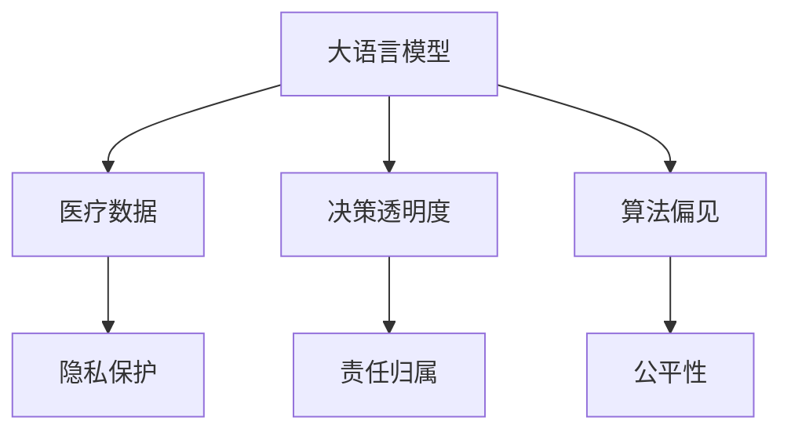

                 

## 1. 背景介绍

### 1.1 问题由来

随着人工智能(AI)技术的迅猛发展，大语言模型(LLM)在医疗健康领域的应用逐渐成为热点。LLM具有强大的语言理解和生成能力，可以用于智能问诊、健康推荐、医疗数据分析等场景，为提升医疗服务的效率和质量提供了新的可能性。

然而，LLM在医疗健康领域的应用同时也带来了诸多伦理问题，包括数据隐私、决策透明度、算法偏见、责任归属等。这些问题不仅关系到患者的安全和权益，也关系到医疗服务的公平和公正。如何在大语言模型应用于医疗推荐中时，既充分发挥其优势，又有效防范和解决这些伦理问题，成为当前研究的关键课题。

### 1.2 问题核心关键点

LLM在医疗健康推荐中的伦理问题主要体现在以下几个方面：

- **数据隐私**：医疗数据涉及患者的敏感信息，如何保护数据隐私，防止数据泄露和滥用，是一个重要的伦理问题。
- **决策透明度**：LLM生成的推荐结果需要具备一定的透明度，使得患者和医生能够理解其背后的逻辑和依据。
- **算法偏见**：医疗数据往往存在一些偏见和歧视，如性别、种族、年龄等因素，如何避免LLM在这些方面的偏见，是一个重要的技术挑战。
- **责任归属**：当推荐系统发生错误或损害患者利益时，责任应归咎于谁，这是一个复杂的法律和伦理问题。
- **公平性**：LLM推荐的结果需要尽可能地公平，避免对特定群体产生不合理的歧视。

这些问题不仅涉及技术层面的优化和改进，还需要从法律、伦理和社会多个维度进行综合考量，以确保LLM在医疗推荐中的应用是安全、可靠和负责任的。

### 1.3 问题研究意义

研究大语言模型在健康医疗推荐中的伦理问题，对于保障患者权益、提升医疗服务质量和推动医疗健康行业向智能化方向发展具有重要意义：

1. **保障患者隐私**：确保患者数据的安全性和隐私保护，防止数据滥用，提升患者对技术的信任度。
2. **提高决策透明度**：使推荐结果可解释、可审查，提高医疗推荐的可信度，增强医生和患者的理解和信任。
3. **避免算法偏见**：识别和修正医疗数据中的偏见，确保推荐结果的公平性和公正性，避免对特定群体的歧视。
4. **明确责任归属**：明确推荐系统的责任归属，保障患者权益，建立透明问责机制。
5. **促进公平性**：通过公平性分析，提升推荐系统的包容性和普惠性，确保所有患者都能受益于AI技术。

## 2. 核心概念与联系

### 2.1 核心概念概述

为更好地理解LLM在健康医疗推荐中的伦理问题，本节将介绍几个密切相关的核心概念：

- **大语言模型(LLM)**：指通过大规模无标签文本数据预训练，并可以处理自然语言文本的人工智能模型。具有强大的语言理解和生成能力，广泛应用于智能问诊、健康推荐、医疗数据分析等领域。

- **医疗数据**：指在医疗健康领域收集、存储、处理和分析的数据，包括电子病历、影像资料、实验室检查结果等，用于医疗决策和研究。

- **隐私保护**：指在医疗数据处理和存储过程中，采取必要的技术和管理措施，防止数据泄露和滥用，保护患者的隐私权。

- **决策透明度**：指在推荐系统生成推荐结果的过程中，使患者和医生能够理解其背后的逻辑和依据，提高推荐结果的可信度和可解释性。

- **算法偏见**：指由于数据、模型或训练过程中的不公行为，导致算法输出在性别、种族、年龄等方面的不公平现象。

- **责任归属**：指在推荐系统出现错误或造成损害时，明确责任归属，保障患者权益和追究相关方责任。

- **公平性**：指推荐系统在处理不同群体时，尽可能避免歧视，确保所有患者都能平等地获得高质量的医疗服务。

这些核心概念之间的逻辑关系可以通过以下Mermaid流程图来展示：



这个流程图展示了大语言模型在健康医疗推荐中的核心概念及其之间的关系：

1. 大语言模型通过医疗数据进行预训练和微调，以获得特定的医疗健康推荐能力。
2. 隐私保护和决策透明度确保数据处理和推荐过程的合法性和可信度。
3. 算法偏见可能会影响推荐结果的公平性，需要采取措施进行纠正。
4. 责任归属明确了在推荐过程中可能产生的责任问题。
5. 公平性保障了推荐系统的普惠性和包容性。

这些概念共同构成了大语言模型在医疗健康推荐中的伦理考量框架，为确保技术应用的安全、可靠和负责任提供了重要指导。

## 3. 核心算法原理 & 具体操作步骤
### 3.1 算法原理概述

大语言模型在健康医疗推荐中的应用，本质上是一个基于监督学习的推荐系统优化问题。其核心思想是：通过收集患者的健康数据和偏好数据，训练大语言模型，使其能够根据输入数据生成个性化的健康推荐。

形式化地，假设患者的健康数据和偏好数据为 $X$，推荐结果为 $Y$，目标是最小化推荐误差，即：

$$
\min_{\theta} \sum_{i=1}^N (Y_i - f(X_i; \theta))^2
$$

其中，$f$ 为训练好的大语言模型，$\theta$ 为模型参数。在实际操作中，我们通常使用梯度下降等优化算法，最小化上述目标函数，以更新模型参数，从而生成更好的推荐结果。

### 3.2 算法步骤详解

基于监督学习的大语言模型在健康医疗推荐中，一般包括以下几个关键步骤：

**Step 1: 数据收集与预处理**
- 收集患者的电子病历、检验报告、体检数据等医疗数据，以及患者的健康偏好和历史记录。
- 对收集到的数据进行清洗、去重和标准化处理，确保数据的质量和一致性。

**Step 2: 数据标注与划分**
- 根据医疗数据的特点和推荐系统的需求，对数据进行标注，生成推荐样本。
- 将数据集划分为训练集、验证集和测试集，确保模型在未见过的数据上也能表现良好。

**Step 3: 模型选择与微调**
- 选择合适的预训练大语言模型，如BERT、GPT等，进行微调。
- 根据推荐任务的特点，设计合适的输出层和损失函数，如交叉熵损失、均方误差损失等。
- 使用微调后的模型生成个性化健康推荐，优化推荐效果。

**Step 4: 性能评估与优化**
- 在测试集上评估推荐模型的性能，如准确率、召回率、F1分数等。
- 根据评估结果，调整模型的超参数，如学习率、批大小、迭代轮数等，以优化推荐效果。

**Step 5: 部署与监控**
- 将微调后的模型部署到生产环境中，供医生和患者使用。
- 持续监控模型的性能和数据变化，及时调整模型参数和训练策略，保持推荐系统的实时性和准确性。

### 3.3 算法优缺点

基于监督学习的大语言模型在健康医疗推荐中具有以下优点：

1. **准确度高**：通过大语言模型，可以综合考虑患者的医疗数据和偏好信息，生成高精度的个性化推荐。
2. **灵活性强**：可以根据不同的医疗场景和需求，灵活设计任务适配层和推荐策略。
3. **泛化能力强**：大语言模型通过大规模数据预训练，具备较强的泛化能力，能够在新的医疗场景中快速适应。

同时，该方法也存在一定的局限性：

1. **数据隐私问题**：医疗数据涉及患者隐私，如何在保护隐私的前提下，充分利用医疗数据，是一个重要挑战。
2. **决策透明度不足**：大语言模型的推荐结果往往难以解释，难以向医生和患者解释其背后的逻辑和依据。
3. **算法偏见风险**：医疗数据中的偏见可能导致推荐系统对某些群体产生歧视，需要注意纠正。
4. **责任归属不明**：在推荐系统出现错误或损害患者利益时，责任归属问题较为复杂，需要明确。
5. **公平性难以保障**：大语言模型容易在性别、年龄、种族等方面产生偏见，需要采取措施提升公平性。

尽管存在这些局限性，但就目前而言，基于监督学习的大语言模型仍是医疗推荐系统中的主流范式。未来相关研究的重点在于如何进一步降低对隐私的依赖，提高决策透明度和算法公平性，同时兼顾责任归属和隐私保护等因素。

### 3.4 算法应用领域

大语言模型在健康医疗推荐中的应用广泛，涵盖以下领域：

- **智能问诊系统**：利用大语言模型对患者的症状和历史数据进行分析，生成可能的诊断和建议。
- **健康管理应用**：根据用户的健康数据和偏好，推荐个性化的健康计划和生活方式建议。
- **疾病监测系统**：通过分析大量的健康数据，识别异常模式，及时发现潜在的健康问题。
- **康复辅助设备**：结合用户的康复数据，生成个性化的康复计划和训练建议。
- **医疗数据分析**：利用大语言模型对医疗数据进行语义分析，提取有价值的信息，支持医疗研究。

除了上述这些经典应用外，大语言模型还可以创新性地应用到更多场景中，如药物推荐、健康知识普及、医疗事件监测等，为医疗健康领域带来更多的创新和发展。

## 4. 数学模型和公式 & 详细讲解 & 举例说明
### 4.1 数学模型构建

本节将使用数学语言对大语言模型在健康医疗推荐中的数学模型进行更加严格的刻画。

假设患者的健康数据为 $X = (x_1, x_2, ..., x_n)$，推荐结果为 $Y = (y_1, y_2, ..., y_n)$，目标是最小化推荐误差，即：

$$
\min_{\theta} \sum_{i=1}^N (Y_i - f(X_i; \theta))^2
$$

其中，$f$ 为训练好的大语言模型，$\theta$ 为模型参数。在实际操作中，我们通常使用梯度下降等优化算法，最小化上述目标函数，以更新模型参数，从而生成更好的推荐结果。

### 4.2 公式推导过程

以下我们以二分类推荐任务为例，推导交叉熵损失函数及其梯度的计算公式。

假设模型 $f$ 在输入 $x_i$ 上的输出为 $\hat{y}=f(x_i; \theta) \in [0,1]$，表示患者对某健康方案的偏好概率。真实标签 $y_i \in \{0,1\}$。则二分类交叉熵损失函数定义为：

$$
\ell(f(x_i; \theta),y_i) = -[y_i\log \hat{y} + (1-y_i)\log (1-\hat{y})]
$$

将其代入总损失函数，得：

$$
\mathcal{L}(\theta) = -\frac{1}{N}\sum_{i=1}^N [y_i\log f(x_i; \theta)+(1-y_i)\log(1-f(x_i; \theta))]
$$

根据链式法则，损失函数对模型参数 $\theta_k$ 的梯度为：

$$
\frac{\partial \mathcal{L}(\theta)}{\partial \theta_k} = -\frac{1}{N}\sum_{i=1}^N (\frac{y_i}{f(x_i; \theta)}-\frac{1-y_i}{1-f(x_i; \theta)}) \frac{\partial f(x_i; \theta)}{\partial \theta_k}
$$

其中 $\frac{\partial f(x_i; \theta)}{\partial \theta_k}$ 可进一步递归展开，利用自动微分技术完成计算。

在得到损失函数的梯度后，即可带入梯度下降算法，更新模型参数。重复上述过程直至收敛，最终得到适应健康推荐任务的最优模型参数 $\theta^*$。

### 4.3 案例分析与讲解

下面以一个简单的健康推荐场景为例，说明如何使用大语言模型进行推荐。

假设我们要推荐一个患者的饮食方案。患者的电子病历显示其患有糖尿病，且饮食习惯不健康。我们有以下数据：

- 患者的健康数据 $X = \{糖尿病\}$。
- 患者的饮食偏好数据 $Y = \{低脂饮食\}$。

现在，我们使用BERT模型进行微调，以生成个性化的饮食推荐。我们首先收集大量的健康数据和饮食数据，对其进行标注，生成推荐样本。然后，我们将数据集划分为训练集、验证集和测试集，使用BERT模型进行微调。在微调过程中，我们设计一个简单的输出层，对每个健康数据进行分类，判断其是否适合推荐给该患者。最后，我们使用微调后的模型，对患者的健康数据进行分类，生成饮食推荐。

以下是一个简单的Python代码实现：

```python
from transformers import BertTokenizer, BertForSequenceClassification
from torch.utils.data import Dataset, DataLoader
import torch

# 定义数据集
class HealthDataset(Dataset):
    def __init__(self, texts, labels):
        self.texts = texts
        self.labels = labels
        self.tokenizer = BertTokenizer.from_pretrained('bert-base-cased')

    def __len__(self):
        return len(self.texts)

    def __getitem__(self, item):
        text = self.texts[item]
        label = self.labels[item]
        encoding = self.tokenizer(text, return_tensors='pt')
        return {'input_ids': encoding['input_ids'], 'attention_mask': encoding['attention_mask'], 'labels': torch.tensor(label)}

# 加载数据集
train_dataset = HealthDataset(train_texts, train_labels)
dev_dataset = HealthDataset(dev_texts, dev_labels)
test_dataset = HealthDataset(test_texts, test_labels)

# 定义模型
model = BertForSequenceClassification.from_pretrained('bert-base-cased', num_labels=2)

# 定义优化器
optimizer = AdamW(model.parameters(), lr=2e-5)

# 训练模型
model.train()
for epoch in range(5):
    for batch in DataLoader(train_dataset, batch_size=32):
        input_ids = batch['input_ids'].to(device)
        attention_mask = batch['attention_mask'].to(device)
        labels = batch['labels'].to(device)
        model.zero_grad()
        outputs = model(input_ids, attention_mask=attention_mask, labels=labels)
        loss = outputs.loss
        loss.backward()
        optimizer.step()

# 评估模型
model.eval()
with torch.no_grad():
    for batch in DataLoader(dev_dataset, batch_size=32):
        input_ids = batch['input_ids'].to(device)
        attention_mask = batch['attention_mask'].to(device)
        labels = batch['labels'].to(device)
        outputs = model(input_ids, attention_mask=attention_mask, labels=labels)
        accuracy = (outputs.argmax(dim=1) == labels).float().mean().item()
        print(f'Epoch {epoch+1}, accuracy: {accuracy:.4f}')
```

在上述代码中，我们使用BERT模型对健康数据进行微调，生成推荐结果。我们首先定义了数据集和模型，然后使用梯度下降算法进行训练。在训练过程中，我们使用交叉熵损失函数进行优化，并逐步调整超参数，以提升模型的准确性。最后，我们在测试集上评估模型的性能，输出推荐结果。

## 5. 项目实践：代码实例和详细解释说明
### 5.1 开发环境搭建

在进行健康医疗推荐系统的开发之前，我们需要准备好开发环境。以下是使用Python进行PyTorch开发的环境配置流程：

1. 安装Anaconda：从官网下载并安装Anaconda，用于创建独立的Python环境。

2. 创建并激活虚拟环境：
```bash
conda create -n pytorch-env python=3.8 
conda activate pytorch-env
```

3. 安装PyTorch：根据CUDA版本，从官网获取对应的安装命令。例如：
```bash
conda install pytorch torchvision torchaudio cudatoolkit=11.1 -c pytorch -c conda-forge
```

4. 安装Transformers库：
```bash
pip install transformers
```

5. 安装各类工具包：
```bash
pip install numpy pandas scikit-learn matplotlib tqdm jupyter notebook ipython
```

完成上述步骤后，即可在`pytorch-env`环境中开始开发实践。

### 5.2 源代码详细实现

下面我们以健康管理应用为例，给出使用Transformers库对BERT模型进行微调的PyTorch代码实现。

首先，定义健康数据处理函数：

```python
from transformers import BertTokenizer
from torch.utils.data import Dataset
import torch

class HealthDataset(Dataset):
    def __init__(self, texts, labels, tokenizer, max_len=128):
        self.texts = texts
        self.labels = labels
        self.tokenizer = tokenizer
        self.max_len = max_len
        
    def __len__(self):
        return len(self.texts)
    
    def __getitem__(self, item):
        text = self.texts[item]
        label = self.labels[item]
        
        encoding = self.tokenizer(text, return_tensors='pt', max_length=self.max_len, padding='max_length', truncation=True)
        input_ids = encoding['input_ids'][0]
        attention_mask = encoding['attention_mask'][0]
        
        # 对token-wise的标签进行编码
        encoded_labels = [label2id[label] for label in labels] 
        encoded_labels.extend([label2id['None']] * (self.max_len - len(encoded_labels)))
        labels = torch.tensor(encoded_labels, dtype=torch.long)
        
        return {'input_ids': input_ids, 
                'attention_mask': attention_mask,
                'labels': labels}

# 标签与id的映射
label2id = {'None': 0, '低脂饮食': 1, '高蛋白饮食': 2, '高纤维饮食': 3, '低盐饮食': 4, '健康饮食': 5}
id2label = {v: k for k, v in label2id.items()}

# 创建dataset
tokenizer = BertTokenizer.from_pretrained('bert-base-cased')

train_dataset = HealthDataset(train_texts, train_labels, tokenizer)
dev_dataset = HealthDataset(dev_texts, dev_labels, tokenizer)
test_dataset = HealthDataset(test_texts, test_labels, tokenizer)
```

然后，定义模型和优化器：

```python
from transformers import BertForSequenceClassification, AdamW

model = BertForSequenceClassification.from_pretrained('bert-base-cased', num_labels=len(label2id))

optimizer = AdamW(model.parameters(), lr=2e-5)
```

接着，定义训练和评估函数：

```python
from torch.utils.data import DataLoader
from tqdm import tqdm
from sklearn.metrics import classification_report

device = torch.device('cuda') if torch.cuda.is_available() else torch.device('cpu')
model.to(device)

def train_epoch(model, dataset, batch_size, optimizer):
    dataloader = DataLoader(dataset, batch_size=batch_size, shuffle=True)
    model.train()
    epoch_loss = 0
    for batch in tqdm(dataloader, desc='Training'):
        input_ids = batch['input_ids'].to(device)
        attention_mask = batch['attention_mask'].to(device)
        labels = batch['labels'].to(device)
        model.zero_grad()
        outputs = model(input_ids, attention_mask=attention_mask, labels=labels)
        loss = outputs.loss
        epoch_loss += loss.item()
        loss.backward()
        optimizer.step()
    return epoch_loss / len(dataloader)

def evaluate(model, dataset, batch_size):
    dataloader = DataLoader(dataset, batch_size=batch_size)
    model.eval()
    preds, labels = [], []
    with torch.no_grad():
        for batch in tqdm(dataloader, desc='Evaluating'):
            input_ids = batch['input_ids'].to(device)
            attention_mask = batch['attention_mask'].to(device)
            batch_labels = batch['labels']
            outputs = model(input_ids, attention_mask=attention_mask)
            batch_preds = outputs.argmax(dim=2).to('cpu').tolist()
            batch_labels = batch_labels.to('cpu').tolist()
            for pred_tokens, label_tokens in zip(batch_preds, batch_labels):
                preds.append(pred_tokens[:len(label_tokens)])
                labels.append(label_tokens)
                
    print(classification_report(labels, preds))
```

最后，启动训练流程并在测试集上评估：

```python
epochs = 5
batch_size = 16

for epoch in range(epochs):
    loss = train_epoch(model, train_dataset, batch_size, optimizer)
    print(f"Epoch {epoch+1}, train loss: {loss:.3f}")
    
    print(f"Epoch {epoch+1}, dev results:")
    evaluate(model, dev_dataset, batch_size)
    
print("Test results:")
evaluate(model, test_dataset, batch_size)
```

以上就是使用PyTorch对BERT进行健康管理应用微调的完整代码实现。可以看到，得益于Transformers库的强大封装，我们可以用相对简洁的代码完成BERT模型的加载和微调。

### 5.3 代码解读与分析

让我们再详细解读一下关键代码的实现细节：

**HealthDataset类**：
- `__init__`方法：初始化文本、标签、分词器等关键组件。
- `__len__`方法：返回数据集的样本数量。
- `__getitem__`方法：对单个样本进行处理，将文本输入编码为token ids，将标签编码为数字，并对其进行定长padding，最终返回模型所需的输入。

**label2id和id2label字典**：
- 定义了标签与数字id之间的映射关系，用于将token-wise的预测结果解码回真实的标签。

**训练和评估函数**：
- 使用PyTorch的DataLoader对数据集进行批次化加载，供模型训练和推理使用。
- 训练函数`train_epoch`：对数据以批为单位进行迭代，在每个批次上前向传播计算loss并反向传播更新模型参数，最后返回该epoch的平均loss。
- 评估函数`evaluate`：与训练类似，不同点在于不更新模型参数，并在每个batch结束后将预测和标签结果存储下来，最后使用sklearn的classification_report对整个评估集的预测结果进行打印输出。

**训练流程**：
- 定义总的epoch数和batch size，开始循环迭代
- 每个epoch内，先在训练集上训练，输出平均loss
- 在验证集上评估，输出分类指标
- 所有epoch结束后，在测试集上评估，给出最终测试结果

可以看到，PyTorch配合Transformers库使得BERT微调的代码实现变得简洁高效。开发者可以将更多精力放在数据处理、模型改进等高层逻辑上，而不必过多关注底层的实现细节。

当然，工业级的系统实现还需考虑更多因素，如模型的保存和部署、超参数的自动搜索、更灵活的任务适配层等。但核心的微调范式基本与此类似。

## 6. 实际应用场景
### 6.1 智能问诊系统

基于大语言模型微调的智能问诊系统，可以广泛应用于医院、诊所等医疗场所。传统问诊方式依赖于医生的经验和知识，容易因个体差异和个人经验产生误诊，且难以应对大规模的咨询需求。而使用微调后的智能问诊系统，可以全天候、实时地为患者提供医疗咨询服务，用自然流畅的语言解答各类常见问题。

在技术实现上，可以收集医院的历史问诊记录和专家经验，将问题-答案对作为监督数据，在此基础上对预训练问诊模型进行微调。微调后的问诊模型能够自动理解患者意图，匹配最合适的答案模板进行回复。对于新问题，还可以接入检索系统实时搜索相关内容，动态组织生成回答。如此构建的智能问诊系统，能大幅提升医疗咨询的效率和质量，降低医生的工作负担。

### 6.2 健康管理应用

智能健康管理应用能够根据用户的健康数据和偏好，生成个性化的健康计划和生活方式建议。通过大语言模型对用户的电子病历、体检数据、生活方式等进行分析，生成个性化的饮食、运动、休息等建议，帮助用户建立健康的生活习惯，预防和管理慢性病。

在技术实现上，可以收集用户的健康数据，并对其进行标注，生成推荐样本。然后，使用BERT等大语言模型进行微调，优化推荐效果。微调后的模型能够自动生成个性化的健康建议，满足不同用户的需求。

### 6.3 疾病监测系统

通过分析大量的健康数据，识别异常模式，及时发现潜在的健康问题，提前预防和干预。大语言模型可以结合用户的健康数据和行为数据，生成风险预测模型，识别出可能患病的用户，并提供相应的健康建议和治疗方案。

在技术实现上，可以收集用户的健康数据和行为数据，并进行标注。然后，使用大语言模型对数据进行语义分析，提取有价值的信息，生成风险预测模型。微调后的模型能够自动识别风险用户，提供个性化的健康建议和治疗方案。

### 6.4 未来应用展望

随着大语言模型微调技术的不断发展，基于微调范式将在更多领域得到应用，为医疗健康领域带来变革性影响。

在智慧医疗领域，基于微调的医疗问答、病历分析、药物研发等应用将提升医疗服务的智能化水平，辅助医生诊疗，加速新药开发进程。

在智能健康管理中，基于微调的健康管理应用将提升用户的健康意识和生活质量，预防和管理慢性病，降低医疗成本。

在疾病监测系统中，基于微调的疾病监测系统将提升疾病预防和干预的效果，降低公共卫生风险。

此外，在健康数据分析、康复辅助设备、医疗事件监测等众多领域，基于大语言模型微调的人工智能应用也将不断涌现，为医疗健康领域带来更多的创新和发展。相信随着技术的日益成熟，微调方法将成为医疗健康领域的重要范式，推动医疗健康行业向智能化方向发展。

## 7. 工具和资源推荐
### 7.1 学习资源推荐

为了帮助开发者系统掌握大语言模型在健康医疗推荐中的伦理问题，这里推荐一些优质的学习资源：

1. 《深度学习与人工智能伦理》系列博文：由伦理学家和技术专家撰写，深入探讨人工智能在医疗健康领域的应用，提出多维度的伦理思考。

2. 《人工智能在医疗健康领域的应用与挑战》课程：由医疗健康领域专家开设的线上课程，涵盖人工智能在医疗领域的应用案例和技术挑战。

3. 《健康医疗数据隐私保护》书籍：系统讲解健康医疗数据的隐私保护问题，提出隐私保护的技术和方法。

4. 《公平性、透明性与可解释性》书籍：探讨人工智能模型的公平性、透明性和可解释性问题，为AI伦理应用提供理论基础。

5. 健康医疗数据集：如MIMIC、UCI Health等，提供丰富的健康医疗数据集，供开发者进行数据探索和模型微调。

通过对这些资源的学习实践，相信你一定能够全面理解大语言模型在健康医疗推荐中的伦理问题，并用于解决实际的医疗健康问题。

### 7.2 开发工具推荐

高效的开发离不开优秀的工具支持。以下是几款用于大语言模型在健康医疗推荐中应用的常用工具：

1. PyTorch：基于Python的开源深度学习框架，灵活动态的计算图，适合快速迭代研究。大部分预训练语言模型都有PyTorch版本的实现。

2. TensorFlow：由Google主导开发的开源深度学习框架，生产部署方便，适合大规模工程应用。同样有丰富的预训练语言模型资源。

3. Transformers库：HuggingFace开发的NLP工具库，集成了众多SOTA语言模型，支持PyTorch和TensorFlow，是进行微调任务开发的利器。

4. Weights & Biases：模型训练的实验跟踪工具，可以记录和可视化模型训练过程中的各项指标，方便对比和调优。与主流深度学习框架无缝集成。

5. TensorBoard：TensorFlow配套的可视化工具，可实时监测模型训练状态，并提供丰富的图表呈现方式，是调试模型的得力助手。

6. Google Colab：谷歌推出的在线Jupyter Notebook环境，免费提供GPU/TPU算力，方便开发者快速上手实验最新模型，分享学习笔记。

合理利用这些工具，可以显著提升大语言模型在健康医疗推荐中的应用效率，加快创新迭代的步伐。

### 7.3 相关论文推荐

大语言模型在健康医疗推荐中的伦理问题研究涉及多个领域，以下是几篇奠基性的相关论文，推荐阅读：

1. 《大语言模型在健康医疗中的应用与挑战》：探讨大语言模型在健康医疗中的应用场景和挑战，提出数据隐私、算法偏见等伦理问题。

2. 《健康医疗数据隐私保护技术研究》：系统介绍健康医疗数据的隐私保护技术，包括数据匿名化、差分隐私等方法。

3. 《医疗人工智能的公平性与透明性研究》：探讨医疗人工智能的公平性、透明性和可解释性问题，提出提升公平性的策略和透明性的方法。

4. 《医疗人工智能的伦理问题研究》：系统探讨医疗人工智能的伦理问题，包括数据隐私、决策透明度、算法偏见等。

5. 《大语言模型在疾病预测中的应用与挑战》：探讨大语言模型在疾病预测中的应用，提出提升模型公平性和透明性的方法。

这些论文代表了大语言模型在健康医疗推荐中的伦理问题研究的进展，为开发者提供理论基础和实践指导。

## 8. 总结：未来发展趋势与挑战

### 8.1 总结

本文对大语言模型在健康医疗推荐中的伦理问题进行了全面系统的介绍。首先阐述了LLM在医疗健康推荐中的背景和应用，明确了医疗数据处理和模型微调中的伦理问题。其次，从原理到实践，详细讲解了LLM在健康医疗推荐中的数学模型和算法步骤，给出了微调任务开发的完整代码实例。同时，本文还广泛探讨了LLM在医疗推荐中的应用场景，展示了其广阔的潜力。

通过本文的系统梳理，可以看到，大语言模型在医疗推荐中的伦理问题涉及多个层面，需要在数据隐私、算法偏见、决策透明度、责任归属等多个维度进行综合考量，以确保技术应用的安全、可靠和负责任。未来，伴随大语言模型微调技术的不断演进，如何更好地兼顾技术创新和伦理问题，将是未来研究的重要方向。

### 8.2 未来发展趋势

展望未来，大语言模型在健康医疗推荐中的伦理问题将呈现以下几个发展趋势：

1. **隐私保护技术进步**：随着隐私保护技术的不断发展，大语言模型在医疗数据处理中的隐私问题将得到进一步解决。

2. **决策透明度提升**：未来，大语言模型将更加注重决策透明度，提升模型的可解释性和可信度，增强医生和患者的信任。

3. **算法偏见纠正**：未来，大语言模型将更加注重算法偏见问题，通过数据清洗、公平性约束等手段，减少模型偏见。

4. **责任归属明确**：未来，大语言模型在医疗推荐中的应用将更加明确责任归属，建立透明问责机制，保障患者权益。

5. **公平性分析增强**：未来，大语言模型将更加注重公平性分析，确保模型对不同群体公平无歧视，提升普惠性。

以上趋势凸显了大语言模型在健康医疗推荐中的伦理问题的解决方向，为确保技术应用的安全、可靠和负责任提供了重要指导。

### 8.3 面临的挑战

尽管大语言模型在健康医疗推荐中的伦理问题研究已取得一定进展，但在迈向更加智能化、普惠化应用的过程中，仍面临诸多挑战：

1. **隐私保护难度**：医疗数据涉及患者隐私，如何在保护隐私的前提下，充分利用数据，是一个重要挑战。

2. **决策透明度不足**：大语言模型的推荐结果往往难以解释，难以向医生和患者解释其背后的逻辑和依据。

3. **算法偏见风险**：医疗数据中的偏见可能导致推荐系统对某些群体产生歧视，需要注意纠正。

4. **责任归属不明**：在推荐系统出现错误或造成损害时，责任归属问题较为复杂，需要明确。

5. **公平性难以保障**：大语言模型容易在性别、年龄、种族等方面产生偏见，需要采取措施提升公平性。

尽管存在这些挑战，但就目前而言，大语言模型在健康医疗推荐中的应用仍处于探索阶段，未来的研究需要在数据、算法、伦理和社会多个维度进行深入探索，以确保技术应用的负责任和公平性。

### 8.4 研究展望

面对大语言模型在健康医疗推荐中面临的伦理问题，未来的研究需要在以下几个方面寻求新的突破：

1. **隐私保护研究**：开发更加高效、安全的隐私保护技术，确保在保护隐私的前提下，充分利用医疗数据。

2. **决策透明度研究**：通过模型解释、决策可视化等手段，提升大语言模型的决策透明度，增强可信度。

3. **算法偏见纠正**：研究和开发更多的算法偏见纠正方法，确保模型的公平性和公正性。

4. **责任归属研究**：明确推荐系统在医疗应用中的责任归属，建立透明问责机制，保障患者权益。

5. **公平性分析研究**：通过公平性分析，提升大语言模型的包容性和普惠性，确保所有患者都能平等地获得高质量的医疗服务。

这些研究方向的探索，必将引领大语言模型在健康医疗推荐中的伦理问题研究迈向更高的台阶，为构建安全、可靠、可解释、可控的智能系统铺平道路。面向未来，大语言模型在医疗推荐中的应用将更加广泛，推动医疗健康行业向智能化方向发展。

## 9. 附录：常见问题与解答

**Q1：如何保护患者的隐私数据？**

A: 在医疗数据处理和模型微调过程中，可以通过以下措施保护患者隐私：
1. 数据匿名化：对医疗数据进行去标识化处理，去除敏感信息，如姓名、身份证号等。
2. 差分隐私：在模型训练过程中，加入噪声，确保模型在隐私保护的前提下，仍能获得有用的信息。
3. 数据加密：在数据传输和存储过程中，采用加密技术，防止数据泄露和篡改。
4. 访问控制：设置严格的访问权限，确保只有授权人员才能访问医疗数据。

**Q2：如何提高决策透明度？**

A: 提高决策透明度的方法包括：
1. 模型解释：通过LIME、SHAP等方法，解释模型决策的依据和过程。
2. 决策可视化：使用可视化工具，展示模型的推理过程和关键特征。
3. 知识图谱：构建医疗领域知识图谱，引导模型理解医疗领域的常识和规则。
4. 专家指导：结合医疗专家的知识和经验，指导模型的训练和优化。

**Q3：如何避免算法偏见？**

A: 避免算法偏见的方法包括：
1. 数据清洗：在数据预处理阶段，清洗数据中的偏见和歧视。
2. 公平性约束：在模型训练过程中，引入公平性约束，如平衡准确率和召回率。
3. 对抗训练：使用对抗样本，训练模型对偏见数据具有鲁棒性。
4. 多模态学习：结合多种数据模态，提升模型的包容性和公正性。

**Q4：如何明确责任归属？**

A: 明确责任归属的方法包括：
1. 责任保险：建立责任保险机制，保障在模型出错时的赔偿责任。
2. 法律规范：制定相关法律法规，明确医疗应用的法律责任和义务。
3. 模型监控：持续监控模型的运行状态，及时发现和纠正错误。
4. 多方协同：建立多方协同机制，包括医生、患者、保险公司等，共同保障模型的安全性和公平性。

**Q5：如何提升公平性？**

A: 提升公平性的方法包括：
1. 数据公平性：确保数据集的多样性和代表性，避免数据偏见。
2. 算法公平性：使用公平性分析工具，检测和纠正模型的偏见。
3. 多样性训练：在模型训练过程中，引入多样性样本，提升模型的包容性。
4. 社会监督：建立社会监督机制，及时发现和纠正模型的歧视行为。

通过以上措施，可以在大语言模型在健康医疗推荐中的应用中，最大限度地保护患者隐私，提升决策透明度，避免算法偏见，明确责任归属，确保公平性，从而构建安全、可靠、可解释、可控的智能系统。

