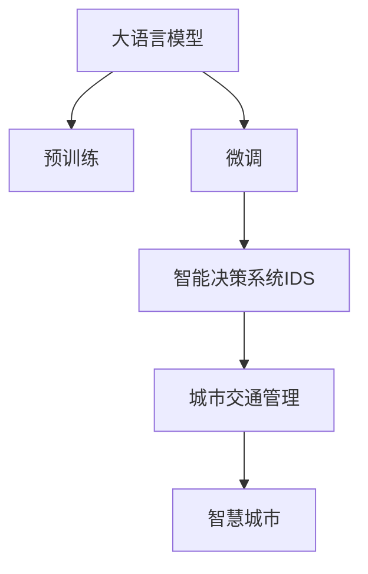

                 

# LLM在城市规划中的辅助作用

> 关键词：城市规划,人工智能,自然语言处理,预训练模型,大语言模型(LLM),智能决策系统,城市交通管理,智慧城市

## 1. 背景介绍

随着城市化进程的加速和人口数量的激增，城市规划面临越来越多的挑战和不确定性。传统的人工决策方式已难以满足日益复杂的城市管理需求，亟需引入更加高效、科学的辅助工具。在这一背景下，基于自然语言处理（NLP）和人工智能（AI）技术的大语言模型（Large Language Model, LLM）应运而生，为城市规划提供了全新的视角和手段。

### 1.1 传统城市规划的局限性

传统城市规划主要依赖城市规划师的经验和专业知识，通过数据分析、问卷调查等方式获取城市发展数据。然而，这种方法存在以下局限性：

- **依赖人工分析**：城市规划师需要手动处理大量数据，工作量巨大，易受主观因素影响。
- **数据获取困难**：城市发展涉及多维度的数据，如交通流量、人口密度、土地使用等，获取全面且准确的数据非常困难。
- **预测精度不足**：基于历史数据进行预测时，传统模型往往难以捕捉到新出现的趋势和模式。

### 1.2 大语言模型在城市规划中的优势

大语言模型作为近年来NLP领域的重大突破，具备强大的语言理解和生成能力。在城市规划中，它可以通过自然语言处理技术，处理和分析城市规划师和市民提供的大量文本数据，辅助城市规划决策，提升城市管理的智能化水平。具体优势包括：

- **处理大规模文本数据**：大语言模型能够处理海量的文本数据，包括城市规划报告、市民意见、传感器数据等，提供更为全面和及时的城市发展信息。
- **自动分析与预测**：通过自然语言理解技术，模型能够从文本中提取出关键的规划建议和统计数据，自动生成分析报告和预测模型。
- **高度灵活的适应性**：大语言模型具备跨领域迁移能力，可以应用于多种城市规划场景，如交通管理、环境保护、公共设施规划等。

## 2. 核心概念与联系

### 2.1 核心概念概述

为更好地理解大语言模型在城市规划中的应用，本节将介绍几个关键概念：

- **大语言模型（LLM）**：以自回归（如GPT）或自编码（如BERT）模型为代表的大规模预训练语言模型。通过在大规模无标签文本数据上进行预训练，学习通用的语言表示，具备强大的语言理解和生成能力。
- **预训练（Pre-training）**：指在大规模无标签文本语料上，通过自监督学习任务训练通用语言模型的过程。预训练使得模型学习到语言的通用表示。
- **微调（Fine-tuning）**：指在预训练模型的基础上，使用下游任务的少量标注数据，通过有监督学习优化模型在特定任务上的性能。
- **智能决策系统（IDS）**：基于大语言模型的城市规划辅助系统，能够处理大量文本数据，提供决策支持。
- **城市交通管理**：涉及交通流量监控、信号灯控制、交通拥堵预测等城市管理问题。
- **智慧城市**：结合物联网、云计算、大数据等技术，通过智能手段提升城市管理和公共服务水平。

这些概念之间的逻辑关系可以通过以下Mermaid流程图来展示：



这个流程图展示了大语言模型在城市规划中的核心概念及其之间的关系：

1. 大语言模型通过预训练获得基础能力。
2. 微调是对预训练模型进行任务特定的优化，使得模型更好地适应城市规划场景。
3. 智能决策系统利用微调后的模型，处理大量文本数据，生成决策建议。
4. 城市交通管理是智慧城市的重要组成部分，智能决策系统在此领域的应用尤其显著。
5. 智慧城市通过各类智能手段，提升城市管理和公共服务水平。

## 3. 核心算法原理 & 具体操作步骤
### 3.1 算法原理概述

基于大语言模型在城市规划中的应用，其核心算法原理可概括为以下几个步骤：

1. **数据收集与预处理**：从城市规划报告、市民意见、传感器数据等来源，收集城市发展相关的文本数据。
2. **模型预训练**：使用大规模无标签文本数据，对大语言模型进行预训练，学习通用的语言表示。
3. **任务微调**：在预训练模型的基础上，使用城市规划场景下的少量标注数据进行微调，提升模型在特定任务上的性能。
4. **智能决策**：将微调后的模型应用于城市规划中的各个场景，生成分析报告和预测模型。
5. **模型评估与优化**：持续收集新的数据，评估模型性能，根据需要进行模型调整和优化。

### 3.2 算法步骤详解

以下以智能交通管理为例，详细介绍基于大语言模型的城市规划微调算法步骤。

**Step 1: 数据收集与预处理**
- 从城市交通管理部门获取交通流量、信号灯状态、交通事故等数据。
- 通过问卷调查、社交媒体等渠道收集市民对交通状况的反馈和建议。
- 使用文本处理技术，清洗和预处理文本数据，去除噪音，提取关键信息。

**Step 2: 模型预训练**
- 使用大规模无标签交通数据，对预训练模型进行训练，学习交通流量、信号灯状态等特征。
- 采用自监督学习任务，如掩码语言模型、Next Sentence Prediction等，提升模型对文本语义的理解能力。
- 使用Transformer等架构，在大规模数据集上进行预训练，得到基础模型参数。

**Step 3: 任务微调**
- 收集一定数量的标注数据，如交通流量预测样本、信号灯优化方案等。
- 在预训练模型顶层设计合适的输出层和损失函数，如回归损失、分类损失等。
- 设置微调超参数，包括学习率、批大小、迭代轮数等，使用梯度下降等优化算法进行微调。

**Step 4: 智能决策**
- 将微调后的模型应用于交通流量预测、信号灯优化、交通事故预防等场景。
- 输入相关文本数据，如历史流量记录、气象数据、信号灯控制策略等，通过自然语言处理技术提取关键特征。
- 利用微调后的模型生成预测结果和优化方案，辅助城市交通管理决策。

**Step 5: 模型评估与优化**
- 在验证集上评估模型性能，使用MSE、MAE等指标衡量预测精度。
- 根据评估结果调整模型参数，进行模型优化，提升预测效果。
- 定期更新训练数据，重新进行微调，确保模型能够适应新的交通状况。

### 3.3 算法优缺点

基于大语言模型的城市规划微调方法具有以下优点：

- **高效性**：预训练模型已经学习到大量通用的语言表示，微调过程可以快速进行，提升模型性能。
- **灵活性**：模型具备跨领域迁移能力，可以应用于多种城市规划场景，如环境保护、公共设施规划等。
- **智能化**：利用自然语言处理技术，模型能够自动处理和分析大量文本数据，提供决策支持。
- **可扩展性**：随着数据量的增加，模型可以不断进行微调和优化，提升预测精度。

同时，该方法也存在一定的局限性：

- **数据依赖**：微调效果依赖标注数据的质量和数量，获取高质量标注数据的成本较高。
- **泛化能力**：当目标任务与预训练数据的分布差异较大时，微调的性能提升有限。
- **模型复杂度**：大规模语言模型具有较高的参数量和计算需求，对硬件资源要求较高。
- **可解释性**：微调模型的决策过程通常缺乏可解释性，难以对其推理逻辑进行分析和调试。

尽管存在这些局限性，但就目前而言，基于大语言模型的微调方法仍是大规模城市规划的重要手段。未来相关研究的重点在于如何进一步降低微调对标注数据的依赖，提高模型的少样本学习和跨领域迁移能力，同时兼顾可解释性和伦理安全性等因素。

### 3.4 算法应用领域

大语言模型在城市规划中的应用领域非常广泛，涵盖了多个关键领域：

- **城市交通管理**：智能交通信号灯优化、交通流量预测、交通拥堵治理等。
- **环境保护**：空气质量监测、水资源管理、垃圾分类优化等。
- **公共设施规划**：公园绿地规划、公共交通站点优化、城市广场设计等。
- **应急管理**：灾害预警、事故应急响应、公共安全监控等。

以上领域仅仅是冰山一角，随着大语言模型技术的不断进步，其在城市规划中的应用场景将越来越广泛，为城市管理带来更高效、更智能的解决方案。

## 4. 数学模型和公式 & 详细讲解 & 举例说明

### 4.1 数学模型构建

在城市规划中，基于大语言模型的微调模型通常采用回归任务进行处理。以交通流量预测为例，设历史流量数据为 $(x_1, x_2, ..., x_n)$，对应的预测流量为 $(y_1, y_2, ..., y_n)$，模型输入为 $X$，输出为 $Y$，则回归任务可以表示为：

$$
Y = f(X; \theta)
$$

其中，$f$ 为模型函数，$\theta$ 为模型参数。常用的回归任务包括线性回归、非线性回归等。

### 4.2 公式推导过程

以线性回归为例，推导回归模型的参数更新公式。假设模型为：

$$
Y = WX + b
$$

其中 $W$ 为权重矩阵，$b$ 为偏置项。回归任务的目标是最小化预测值与真实值之间的误差，即：

$$
\mathcal{L}(Y, Y_{\text{real}}) = \frac{1}{2N} \sum_{i=1}^N (Y_i - Y_{\text{real}_i})^2
$$

其中 $Y_{\text{real}}$ 为真实流量数据。

通过梯度下降等优化算法，最小化损失函数，更新模型参数：

$$
W \leftarrow W - \eta \frac{\partial \mathcal{L}}{\partial W}, \quad b \leftarrow b - \eta \frac{\partial \mathcal{L}}{\partial b}
$$

其中 $\eta$ 为学习率，通过反向传播算法计算梯度。

### 4.3 案例分析与讲解

假设某城市交通部门收集了过去一年每天的交通流量数据，共365个样本。使用预训练模型作为基础，通过微调优化模型参数，使得模型能够准确预测未来的流量变化。具体步骤如下：

1. **数据准备**：收集历史交通流量数据 $(x_1, x_2, ..., x_{365})$，对应的真实流量 $(y_1, y_2, ..., y_{365})$。
2. **模型初始化**：使用预训练模型初始化权重和偏置。
3. **任务微调**：使用随机梯度下降算法，最小化预测值与真实值之间的误差，更新模型参数。
4. **模型评估**：在验证集上评估模型性能，使用均方误差（MSE）衡量预测精度。
5. **模型优化**：根据评估结果调整模型参数，进行模型优化。

假设模型在验证集上的均方误差为 0.1，进一步优化模型参数，可以显著提高预测精度。

## 5. 项目实践：代码实例和详细解释说明

### 5.1 开发环境搭建

在进行城市规划的微调实践前，我们需要准备好开发环境。以下是使用Python进行PyTorch开发的环境配置流程：

1. 安装Anaconda：从官网下载并安装Anaconda，用于创建独立的Python环境。

2. 创建并激活虚拟环境：
```bash
conda create -n pytorch-env python=3.8 
conda activate pytorch-env
```

3. 安装PyTorch：根据CUDA版本，从官网获取对应的安装命令。例如：
```bash
conda install pytorch torchvision torchaudio cudatoolkit=11.1 -c pytorch -c conda-forge
```

4. 安装Transformers库：
```bash
pip install transformers
```

5. 安装各类工具包：
```bash
pip install numpy pandas scikit-learn matplotlib tqdm jupyter notebook ipython
```

完成上述步骤后，即可在`pytorch-env`环境中开始微调实践。

### 5.2 源代码详细实现

下面我们以交通流量预测任务为例，给出使用Transformers库对BERT模型进行微调的PyTorch代码实现。

首先，定义交通流量预测的数据处理函数：

```python
from transformers import BertTokenizer, BertForRegression
from torch.utils.data import Dataset, DataLoader
import torch
import numpy as np

class TrafficDataset(Dataset):
    def __init__(self, data, tokenizer):
        self.data = data
        self.tokenizer = tokenizer
        
    def __len__(self):
        return len(self.data)
    
    def __getitem__(self, index):
        row = self.data.iloc[index]
        x = np.array(row[:-1]).reshape(-1, 1).astype(np.float32)
        y = np.array(row[-1]).reshape(-1, 1).astype(np.float32)
        tokenized_input = self.tokenizer(x, return_tensors='pt')
        tokenized_target = self.tokenizer(y, return_tensors='pt')
        return {
            'input_ids': tokenized_input['input_ids'].flatten(),
            'attention_mask': tokenized_input['attention_mask'].flatten(),
            'labels': tokenized_target['input_ids'].flatten()
        }

# 加载数据
data = pd.read_csv('traffic_data.csv')
tokenizer = BertTokenizer.from_pretrained('bert-base-uncased')

train_dataset = TrafficDataset(data, tokenizer)
val_dataset = TrafficDataset(data, tokenizer)

# 定义模型和优化器
model = BertForRegression.from_pretrained('bert-base-uncased')
optimizer = AdamW(model.parameters(), lr=2e-5)
```

然后，定义训练和评估函数：

```python
def train_epoch(model, dataset, batch_size, optimizer):
    model.train()
    dataloader = DataLoader(dataset, batch_size=batch_size, shuffle=True)
    loss = 0
    for batch in dataloader:
        input_ids = batch['input_ids'].to(device)
        attention_mask = batch['attention_mask'].to(device)
        labels = batch['labels'].to(device)
        model.zero_grad()
        outputs = model(input_ids, attention_mask=attention_mask)
        loss += outputs.loss
        loss.backward()
        optimizer.step()
    return loss / len(dataloader)

def evaluate(model, dataset, batch_size):
    model.eval()
    dataloader = DataLoader(dataset, batch_size=batch_size)
    loss = 0
    predictions = []
    targets = []
    with torch.no_grad():
        for batch in dataloader:
            input_ids = batch['input_ids'].to(device)
            attention_mask = batch['attention_mask'].to(device)
            labels = batch['labels'].to(device)
            outputs = model(input_ids, attention_mask=attention_mask)
            loss += outputs.loss
            predictions.append(outputs.logits.flatten())
            targets.append(labels.flatten())
    return loss / len(dataloader), np.concatenate(predictions), np.concatenate(targets)

# 定义设备
device = torch.device('cuda' if torch.cuda.is_available() else 'cpu')
model.to(device)

# 训练过程
epochs = 10
batch_size = 16
learning_rate = 2e-5

for epoch in range(epochs):
    train_loss = train_epoch(model, train_dataset, batch_size, optimizer)
    val_loss, predictions, targets = evaluate(model, val_dataset, batch_size)
    print(f'Epoch {epoch+1}, Train Loss: {train_loss:.4f}, Val Loss: {val_loss:.4f}')
    
# 模型保存
model.save_pretrained('traffic_model')
tokenizer.save_pretrained('traffic_model')
```

以上就是使用PyTorch对BERT进行交通流量预测任务的完整代码实现。可以看到，得益于Transformers库的强大封装，我们可以用相对简洁的代码完成BERT模型的加载和微调。

### 5.3 代码解读与分析

让我们再详细解读一下关键代码的实现细节：

**TrafficDataset类**：
- `__init__`方法：初始化训练数据和分词器。
- `__len__`方法：返回数据集的样本数量。
- `__getitem__`方法：对单个样本进行处理，将数据转化为模型所需的输入。

**数据加载与模型初始化**：
- 使用Pandas加载交通流量数据，并进行预处理。
- 初始化BERT模型，并设置优化器。

**训练和评估函数**：
- 使用PyTorch的DataLoader对数据集进行批次化加载。
- 训练函数`train_epoch`：对数据以批为单位进行迭代，在每个批次上前向传播计算loss并反向传播更新模型参数。
- 评估函数`evaluate`：在验证集上评估模型性能，输出均方误差（MSE）和预测结果。

**训练过程**：
- 定义总的epoch数和batch size，开始循环迭代。
- 每个epoch内，在训练集上训练，输出训练loss和验证loss。
- 在验证集上评估模型性能。
- 保存模型和分词器，方便后续使用。

可以看到，PyTorch配合Transformers库使得BERT微调的代码实现变得简洁高效。开发者可以将更多精力放在数据处理、模型改进等高层逻辑上，而不必过多关注底层的实现细节。

当然，工业级的系统实现还需考虑更多因素，如模型的保存和部署、超参数的自动搜索、更灵活的任务适配层等。但核心的微调范式基本与此类似。

## 6. 实际应用场景
### 6.1 智能交通管理

大语言模型在智能交通管理中具有显著的优势。通过分析交通流量数据，预测未来的交通状况，可以有效缓解交通拥堵，提高道路通行效率。具体应用包括：

- **交通流量预测**：使用微调后的模型对未来交通流量进行预测，辅助交通管理部门制定交通管制策略。
- **信号灯优化**：根据预测结果，优化信号灯的时长和配时，提升路口的通行效率。
- **交通事故预警**：分析历史交通事故数据，预测可能发生的事故区域和时间，提前采取防范措施。

### 6.2 环境保护

城市规划中的环境保护任务，如空气质量监测、水资源管理、垃圾分类优化等，也可以受益于大语言模型。通过处理和分析大量文本数据，模型可以提供科学合理的规划建议。具体应用包括：

- **空气质量监测**：通过收集和分析气象数据、空气质量报告等文本数据，预测未来空气质量变化，提出污染控制建议。
- **水资源管理**：分析水文监测数据、用水统计报告等文本数据，预测未来水资源供应情况，优化水资源分配方案。
- **垃圾分类优化**：处理垃圾分类标签和描述，学习垃圾分类的知识，辅助制定科学的垃圾分类指导方案。

### 6.3 未来应用展望

随着大语言模型技术的不断进步，基于微调的方法将在更多领域得到应用，为城市规划带来更广泛的应用场景：

- **智慧城市治理**：结合物联网、云计算、大数据等技术，通过智能手段提升城市管理的智能化水平，构建更安全、高效的未来城市。
- **公共设施规划**：分析市民的意见和建议，优化公园绿地、公共交通站点等公共设施的规划和设计。
- **应急管理**：通过分析社交媒体数据、新闻报道等文本数据，预测潜在的安全风险，制定应急响应策略。
- **城市规划评估**：利用历史数据和市民反馈，评估城市规划的效果，提供改进建议。

## 7. 工具和资源推荐
### 7.1 学习资源推荐

为了帮助开发者系统掌握大语言模型在城市规划中的应用，这里推荐一些优质的学习资源：

1. 《Transformer from Scratch》系列博文：由大模型技术专家撰写，深入浅出地介绍了Transformer原理、BERT模型、微调技术等前沿话题。
2. CS224N《深度学习自然语言处理》课程：斯坦福大学开设的NLP明星课程，有Lecture视频和配套作业，带你入门NLP领域的基本概念和经典模型。
3. 《Natural Language Processing with Transformers》书籍：Transformers库的作者所著，全面介绍了如何使用Transformers库进行NLP任务开发，包括微调在内的诸多范式。
4. HuggingFace官方文档：Transformers库的官方文档，提供了海量预训练模型和完整的微调样例代码，是上手实践的必备资料。
5. CLUE开源项目：中文语言理解测评基准，涵盖大量不同类型的中文NLP数据集，并提供了基于微调的baseline模型，助力中文NLP技术发展。

通过对这些资源的学习实践，相信你一定能够快速掌握大语言模型在城市规划中的应用技巧，并用于解决实际的NLP问题。

### 7.2 开发工具推荐

高效的开发离不开优秀的工具支持。以下是几款用于大语言模型微调开发的常用工具：

1. PyTorch：基于Python的开源深度学习框架，灵活动态的计算图，适合快速迭代研究。大部分预训练语言模型都有PyTorch版本的实现。
2. TensorFlow：由Google主导开发的开源深度学习框架，生产部署方便，适合大规模工程应用。同样有丰富的预训练语言模型资源。
3. Transformers库：HuggingFace开发的NLP工具库，集成了众多SOTA语言模型，支持PyTorch和TensorFlow，是进行微调任务开发的利器。
4. Weights & Biases：模型训练的实验跟踪工具，可以记录和可视化模型训练过程中的各项指标，方便对比和调优。与主流深度学习框架无缝集成。
5. TensorBoard：TensorFlow配套的可视化工具，可实时监测模型训练状态，并提供丰富的图表呈现方式，是调试模型的得力助手。

合理利用这些工具，可以显著提升大语言模型微调任务的开发效率，加快创新迭代的步伐。

### 7.3 相关论文推荐

大语言模型和微调技术的发展源于学界的持续研究。以下是几篇奠基性的相关论文，推荐阅读：

1. Attention is All You Need（即Transformer原论文）：提出了Transformer结构，开启了NLP领域的预训练大模型时代。
2. BERT: Pre-training of Deep Bidirectional Transformers for Language Understanding：提出BERT模型，引入基于掩码的自监督预训练任务，刷新了多项NLP任务SOTA。
3. Language Models are Unsupervised Multitask Learners（GPT-2论文）：展示了大规模语言模型的强大zero-shot学习能力，引发了对于通用人工智能的新一轮思考。
4. Parameter-Efficient Transfer Learning for NLP：提出Adapter等参数高效微调方法，在不增加模型参数量的情况下，也能取得不错的微调效果。
5. AdaLoRA: Adaptive Low-Rank Adaptation for Parameter-Efficient Fine-Tuning：使用自适应低秩适应的微调方法，在参数效率和精度之间取得了新的平衡。
6. Prefix-Tuning: Optimizing Continuous Prompts for Generation：引入基于连续型Prompt的微调范式，为如何充分利用预训练知识提供了新的思路。

这些论文代表了大语言模型微调技术的发展脉络。通过学习这些前沿成果，可以帮助研究者把握学科前进方向，激发更多的创新灵感。

## 8. 总结：未来发展趋势与挑战
### 8.1 总结

本文对基于大语言模型的城市规划微调方法进行了全面系统的介绍。首先阐述了大语言模型在城市规划中的应用背景和优势，明确了微调在提升城市管理智能化水平方面的独特价值。其次，从原理到实践，详细讲解了微调任务的数学模型和关键步骤，给出了微调任务开发的完整代码实例。同时，本文还广泛探讨了大语言模型在智能交通管理、环境保护、公共设施规划等众多城市规划场景中的应用前景，展示了微调范式的巨大潜力。

通过本文的系统梳理，可以看到，基于大语言模型的微调方法正在成为城市规划的重要手段，极大地提升了城市管理的智能化水平，推动了智慧城市的发展。

### 8.2 未来发展趋势

展望未来，大语言模型微调技术将呈现以下几个发展趋势：

1. **模型规模持续增大**：随着算力成本的下降和数据规模的扩张，预训练语言模型的参数量还将持续增长。超大规模语言模型蕴含的丰富语言知识，有望支撑更加复杂多变的城市规划场景。
2. **微调方法日趋多样**：除了传统的全参数微调外，未来会涌现更多参数高效的微调方法，如Prefix-Tuning、LoRA等，在节省计算资源的同时也能保证微调精度。
3. **持续学习成为常态**：随着数据分布的不断变化，微调模型也需要持续学习新知识以保持性能。如何在不遗忘原有知识的同时，高效吸收新样本信息，将成为重要的研究课题。
4. **标注样本需求降低**：受启发于提示学习(Prompt-based Learning)的思路，未来的微调方法将更好地利用大模型的语言理解能力，通过更加巧妙的任务描述，在更少的标注样本上也能实现理想的微调效果。
5. **多模态微调崛起**：当前的微调主要聚焦于纯文本数据，未来会进一步拓展到图像、视频、语音等多模态数据微调。多模态信息的融合，将显著提升语言模型对现实世界的理解和建模能力。
6. **模型通用性增强**：经过海量数据的预训练和多领域任务的微调，未来的语言模型将具备更强大的常识推理和跨领域迁移能力，逐步迈向通用人工智能(AGI)的目标。

以上趋势凸显了大语言模型微调技术的广阔前景。这些方向的探索发展，必将进一步提升城市规划系统的性能和应用范围，为智慧城市建设提供更强大的技术支撑。

### 8.3 面临的挑战

尽管大语言模型微调技术已经取得了瞩目成就，但在迈向更加智能化、普适化应用的过程中，它仍面临着诸多挑战：

1. **标注成本瓶颈**：微调效果依赖标注数据的质量和数量，获取高质量标注数据的成本较高。如何进一步降低微调对标注样本的依赖，将是一大难题。
2. **模型鲁棒性不足**：当目标任务与预训练数据的分布差异较大时，微调的性能提升有限。对于测试样本的微小扰动，微调模型的预测也容易发生波动。如何提高微调模型的鲁棒性，避免灾难性遗忘，还需要更多理论和实践的积累。
3. **推理效率有待提高**：大规模语言模型虽然精度高，但在实际部署时往往面临推理速度慢、内存占用大等效率问题。如何在保证性能的同时，简化模型结构，提升推理速度，优化资源占用，将是重要的优化方向。
4. **可解释性亟需加强**：当前微调模型更像是"黑盒"系统，难以解释其内部工作机制和决策逻辑。对于医疗、金融等高风险应用，算法的可解释性和可审计性尤为重要。如何赋予微调模型更强的可解释性，将是亟待攻克的难题。
5. **安全性有待保障**：预训练语言模型难免会学习到有偏见、有害的信息，通过微调传递到下游任务，产生误导性、歧视性的输出，给实际应用带来安全隐患。如何从数据和算法层面消除模型偏见，避免恶意用途，确保输出的安全性，也将是重要的研究课题。
6. **知识整合能力不足**：现有的微调模型往往局限于任务内数据，难以灵活吸收和运用更广泛的先验知识。如何让微调过程更好地与外部知识库、规则库等专家知识结合，形成更加全面、准确的信息整合能力，还有很大的想象空间。

正视微调面临的这些挑战，积极应对并寻求突破，将是大语言模型微调走向成熟的必由之路。相信随着学界和产业界的共同努力，这些挑战终将一一被克服，大语言模型微调必将在构建安全、可靠、可解释、可控的智能系统铺平道路。

### 8.4 研究展望

面对大语言模型微调所面临的种种挑战，未来的研究需要在以下几个方面寻求新的突破：

1. **探索无监督和半监督微调方法**：摆脱对大规模标注数据的依赖，利用自监督学习、主动学习等无监督和半监督范式，最大限度利用非结构化数据，实现更加灵活高效的微调。
2. **研究参数高效和计算高效的微调范式**：开发更加参数高效的微调方法，在固定大部分预训练参数的同时，只更新极少量的任务相关参数。同时优化微调模型的计算图，减少前向传播和反向传播的资源消耗，实现更加轻量级、实时性的部署。
3. **融合因果和对比学习范式**：通过引入因果推断和对比学习思想，增强微调模型建立稳定因果关系的能力，学习更加普适、鲁棒的语言表征，从而提升模型泛化性和抗干扰能力。
4. **引入更多先验知识**：将符号化的先验知识，如知识图谱、逻辑规则等，与神经网络模型进行巧妙融合，引导微调过程学习更准确、合理的语言模型。同时加强不同模态数据的整合，实现视觉、语音等多模态信息与文本信息的协同建模。
5. **结合因果分析和博弈论工具**：将因果分析方法引入微调模型，识别出模型决策的关键特征，增强输出解释的因果性和逻辑性。借助博弈论工具刻画人机交互过程，主动探索并规避模型的脆弱点，提高系统稳定性。
6. **纳入伦理道德约束**：在模型训练目标中引入伦理导向的评估指标，过滤和惩罚有偏见、有害的输出倾向。同时加强人工干预和审核，建立模型行为的监管机制，确保输出符合人类价值观和伦理道德。

这些研究方向的探索，必将引领大语言模型微调技术迈向更高的台阶，为构建安全、可靠、可解释、可控的智能系统铺平道路。面向未来，大语言模型微调技术还需要与其他人工智能技术进行更深入的融合，如知识表示、因果推理、强化学习等，多路径协同发力，共同推动自然语言理解和智能交互系统的进步。只有勇于创新、敢于突破，才能不断拓展语言模型的边界，让智能技术更好地造福人类社会。

## 9. 附录：常见问题与解答

**Q1：大语言模型微调是否适用于所有城市规划任务？**

A: 大语言模型微调在大多数城市规划任务上都能取得不错的效果，特别是对于数据量较小的任务。但对于一些特定领域的任务，如医学、法律等，仅仅依靠通用语料预训练的模型可能难以很好地适应。此时需要在特定领域语料上进一步预训练，再进行微调，才能获得理想效果。此外，对于一些需要时效性、个性化很强的任务，如对话、推荐等，微调方法也需要针对性的改进优化。

**Q2：微调过程中如何选择合适的学习率？**

A: 微调的学习率一般要比预训练时小1-2个数量级，如果使用过大的学习率，容易破坏预训练权重，导致过拟合。一般建议从1e-5开始调参，逐步减小学习率，直至收敛。也可以使用warmup策略，在开始阶段使用较小的学习率，再逐渐过渡到预设值。需要注意的是，不同的优化器(如AdamW、Adafactor等)以及不同的学习率调度策略，可能需要设置不同的学习率阈值。

**Q3：采用大语言模型微调时会面临哪些资源瓶颈？**

A: 目前主流的预训练大模型动辄以亿计的参数规模，对算力、内存、存储都提出了很高的要求。GPU/TPU等高性能设备是必不可少的，但即便如此，超大批次的训练和推理也可能遇到显存不足的问题。因此需要采用一些资源优化技术，如梯度积累、混合精度训练、模型并行等，来突破硬件瓶颈。同时，模型的存储和读取也可能占用大量时间和空间，需要采用模型压缩、稀疏化存储等方法进行优化。

**Q4：如何缓解微调过程中的过拟合问题？**

A: 过拟合是微调面临的主要挑战，尤其是在标注数据不足的情况下。常见的缓解策略包括：
1. 数据增强：通过回译、近义替换等方式扩充训练集
2. 正则化：使用L2正则、Dropout、Early Stopping等避免过拟合
3. 对抗训练：引入对抗样本，提高模型鲁棒性
4. 参数高效微调：只调整少量参数(如Adapter、Prefix等)，减小过拟合风险
5. 多模型集成：训练多个微调模型，取平均输出，抑制过拟合

这些策略往往需要根据具体任务和数据特点进行灵活组合。只有在数据、模型、训练、推理等各环节进行全面优化，才能最大限度地发挥大语言模型微调的威力。

**Q5：大语言模型在城市规划中的未来发展方向是什么？**

A: 大语言模型在城市规划中的未来发展方向主要包括以下几个方面：
1. **智能化程度提升**：结合更多先进技术，如因果推断、逻辑推理、多模态融合等，提升城市规划模型的智能化水平。
2. **跨领域迁移能力增强**：通过优化微调模型，提升其在不同领域和场景下的泛化能力，实现更广泛的应用。
3. **实时性优化**：通过改进模型结构和算法，提升城市规划模型的推理速度和响应速度，实现实时化部署。
4. **安全性保障**：研究如何增强城市规划模型的可解释性和可审计性，确保输出结果的安全性和可信度。
5. **伦理道德约束**：引入伦理导向的评估指标，确保模型输出符合人类价值观和伦理道德。

这些方向将推动大语言模型在城市规划中的应用不断深入，为智慧城市建设提供更强大、更安全、更可控的技术支撑。

**Q6：大语言模型在城市规划中的应用难点是什么？**

A: 大语言模型在城市规划中的应用难点主要包括以下几个方面：
1. **数据获取难度**：城市规划涉及多维度的数据，获取全面且准确的数据非常困难。
2. **模型鲁棒性不足**：当目标任务与预训练数据的分布差异较大时，微调的性能提升有限。
3. **知识整合能力不足**：现有的微调模型往往局限于任务内数据，难以灵活吸收和运用更广泛的先验知识。
4. **可解释性亟需加强**：当前微调模型更像是"黑盒"系统，难以解释其内部工作机制和决策逻辑。
5. **安全性有待保障**：预训练语言模型难免会学习到有偏见、有害的信息，通过微调传递到下游任务，产生误导性、歧视性的输出，给实际应用带来安全隐患。

这些难点需要通过技术创新和算法优化，逐步克服，以实现大语言模型在城市规划中的更好应用。

**Q7：大语言模型在城市规划中的应用前景如何？**

A: 大语言模型在城市规划中的应用前景非常广阔。随着模型的不断进步和优化，其能够在城市交通管理、环境保护、公共设施规划等多个领域提供更加智能、高效的解决方案。未来的发展方向包括：
1. **智慧城市治理**：结合物联网、云计算、大数据等技术，通过智能手段提升城市管理的智能化水平，构建更安全、高效的未来城市。
2. **公共设施规划**：分析市民的意见和建议，优化公园绿地、公共交通站点等公共设施的规划和设计。
3. **应急管理**：通过分析社交媒体数据、新闻报道等文本数据，预测潜在的安全风险，制定应急响应策略。
4. **城市规划评估**：利用历史数据和市民反馈，评估城市规划的效果，提供改进建议。

大语言模型有望成为智慧城市建设的重要技术手段，为城市管理提供更科学、更智能的决策支持。

---

作者：禅与计算机程序设计艺术 / Zen and the Art of Computer Programming

