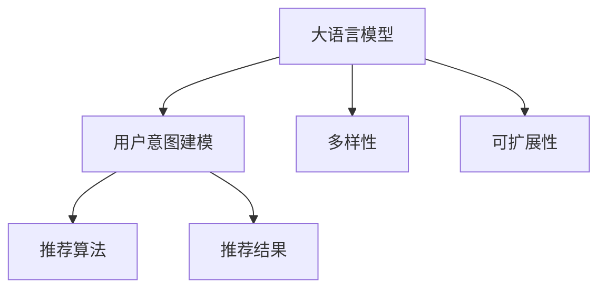

                 

# 大语言模型在推荐系统的应用：多样性与可扩展性

> 关键词：大语言模型, 推荐系统, 多样性, 可扩展性, 用户意图, 推荐算法, 深度学习, 自监督学习

## 1. 背景介绍

### 1.1 问题由来

推荐系统作为互联网时代的重要应用之一，旨在通过对用户行为和兴趣的建模，为用户推荐个性化的产品、服务或内容。传统的推荐算法主要基于协同过滤、基于内容的推荐等方法，但在面对海量数据和高维特征时，容易陷入"维度灾难"。近年来，大语言模型(Large Language Model, LLM)因其卓越的泛化能力和多样性建模能力，在推荐系统领域引起了广泛关注。

LLM模型通过在大型无标签文本数据上进行预训练，学习到丰富的语言表示和语义知识，并在特定任务上通过微调学习用户行为和产品特征之间的关系。这种基于模型的推荐方式，能够自动处理复杂的非结构化数据，输出丰富多变的内容，具有显著的个性化推荐效果。

### 1.2 问题核心关键点

当前，LLM在推荐系统中的应用主要集中在多样性和可扩展性两个方面。具体来说：

- **多样性**：推荐系统需要确保向用户推荐的商品或内容具有丰富性，避免过度重复和单一。LLM的多样性建模能力，能够充分挖掘用户偏好的多样性，推荐与用户历史行为不同但相符的商品或内容。
- **可扩展性**：推荐系统需处理海量数据和动态变化的用户需求，需要具有高效的扩展性。LLM的参数高效微调方法，能够在保持较高性能的同时，实现模型的快速扩展和更新。

本文旨在探讨LLM在推荐系统中的应用，通过构建基于LLM的推荐模型，探讨其多样性和可扩展性，同时分析模型面临的挑战和未来发展趋势。

## 2. 核心概念与联系

### 2.1 核心概念概述

为更好地理解基于LLM的推荐系统，本节将介绍几个密切相关的核心概念：

- **大语言模型(LLM)**：以自回归(如GPT)或自编码(如BERT)模型为代表的大规模预训练语言模型。通过在大规模无标签文本语料上进行预训练，学习通用的语言表示和语义知识。

- **推荐系统**：通过分析用户的历史行为和偏好，为用户推荐个性化的商品、服务或内容。传统的推荐算法主要基于协同过滤、基于内容的推荐等，近年来，基于模型的推荐方法，特别是LLM，逐步成为主流。

- **用户意图建模**：推荐系统的核心任务之一是理解用户的意图和需求，以便准确推荐。可以通过对用户输入的文本数据进行预训练和微调，学习用户的兴趣偏好。

- **推荐算法**：用于根据用户特征和产品特征，生成推荐结果的算法。常见的算法包括基于矩阵分解、协同过滤、深度学习等。

- **多样性与可扩展性**：推荐系统需要处理海量数据和动态变化的用户需求，需要在保证推荐质量的同时，实现高效的多样性建模和模型扩展。

这些核心概念之间的逻辑关系可以通过以下Mermaid流程图来展示：



这个流程图展示了大语言模型在推荐系统中的应用逻辑：

1. 大语言模型通过预训练获得语言表示和语义知识。
2. 用户意图建模通过分析用户输入的文本数据，学习用户兴趣和需求。
3. 推荐算法根据用户特征和产品特征生成推荐结果。
4. 多样性建模保证推荐结果的多样性和新颖性。
5. 可扩展性实现模型的高效扩展和动态更新。

## 3. 核心算法原理 & 具体操作步骤
### 3.1 算法原理概述

基于LLM的推荐系统，通过在用户输入的文本数据上进行预训练和微调，学习用户的兴趣和需求，并将其转化为推荐结果。其核心思想是：

1. 用户输入的文本数据作为微调任务的数据集，通过LLM模型的自监督预训练，学习到用户意图的语言表示。
2. 对预训练模型进行微调，学习用户和产品特征之间的关系，生成推荐结果。
3. 使用多样性和可扩展性约束，优化推荐模型，确保推荐的丰富性和高效性。

### 3.2 算法步骤详解

基于LLM的推荐系统一般包括以下几个关键步骤：

**Step 1: 数据准备与预训练**

- 收集用户输入的文本数据，如评论、评分、搜索记录等，并进行清洗和标注。
- 使用大规模无标签文本数据对LLM进行预训练，学习通用的语言表示和语义知识。

**Step 2: 用户意图建模**

- 将用户输入的文本数据作为微调任务的数据集，对预训练模型进行微调。
- 通过文本分类、序列标注等任务，学习用户兴趣和需求的语言表示。

**Step 3: 推荐结果生成**

- 根据用户特征和产品特征，生成推荐结果。
- 对生成的推荐结果进行多样性约束，确保推荐结果的多样性。
- 对生成的推荐结果进行可扩展性约束，确保模型的高效性和动态更新。

**Step 4: 模型评估与优化**

- 在测试集上评估推荐模型的性能，如准确率、覆盖率、点击率等指标。
- 根据评估结果，对模型进行优化，如调整学习率、正则化系数、微调层数等。

### 3.3 算法优缺点

基于LLM的推荐系统具有以下优点：

- 丰富多样性建模：LLM能够自动处理复杂的非结构化数据，学习用户兴趣的多样性和新颖性。
- 高效扩展性：LLM的参数高效微调方法，能够在保持较高性能的同时，实现模型的快速扩展和更新。
- 高质量推荐：LLM的学习能力能够适应不同类型的推荐任务，如商品推荐、内容推荐等。

同时，该方法也存在一定的局限性：

- 数据依赖度高：推荐模型的效果依赖于用户输入的文本数据，难以处理短尾用户。
- 模型复杂度高：LLM模型参数量大，训练和推理开销大。
- 对抗样本易受攻击：推荐模型容易受到对抗样本的干扰，导致推荐结果偏差。

尽管存在这些局限性，但就目前而言，基于LLM的推荐系统仍是一种极具潜力的推荐范式。未来相关研究的重点在于如何进一步降低数据依赖，提高模型的泛化能力和鲁棒性，同时兼顾可解释性和计算效率等因素。

### 3.4 算法应用领域

基于LLM的推荐系统已在多个领域得到广泛应用，如电商推荐、新闻推荐、视频推荐等。具体应用如下：

- **电商推荐**：基于用户评论、评分、搜索记录等文本数据，对商品进行推荐。
- **新闻推荐**：根据用户浏览历史和评论内容，对新闻文章进行推荐。
- **视频推荐**：利用用户对视频的评论和评分，推荐相关视频内容。
- **内容推荐**：根据用户阅读和搜索行为，推荐相关文章和视频。

除了这些经典应用外，基于LLM的推荐系统还被创新性地应用到更多场景中，如智能客服、社交媒体推荐等，为推荐系统带来了新的突破。

## 4. 数学模型和公式 & 详细讲解 & 举例说明
### 4.1 数学模型构建

本节将使用数学语言对基于LLM的推荐系统进行更加严格的刻画。

记用户输入的文本数据为 $D=\{x_i\}_{i=1}^N$，其中 $x_i \in \mathcal{X}$，$\mathcal{X}$ 为输入空间，如评论、评分等文本数据。假设用户意图的语言表示为 $y_i \in \mathcal{Y}$，$\mathcal{Y}$ 为输出空间，如用户的兴趣标签。

定义用户意图建模的损失函数为 $\ell(y_i, M_{\theta}(x_i))$，其中 $M_{\theta}$ 为预训练后的LLM模型，$\theta$ 为模型参数。则推荐系统的经验风险为：

$$
\mathcal{L}(\theta) = \frac{1}{N} \sum_{i=1}^N \ell(y_i, M_{\theta}(x_i))
$$

模型的优化目标是最小化经验风险，即找到最优参数：

$$
\theta^* = \mathop{\arg\min}_{\theta} \mathcal{L}(\theta)
$$

在实践中，我们通常使用基于梯度的优化算法（如AdamW、SGD等）来近似求解上述最优化问题。设 $\eta$ 为学习率，$\lambda$ 为正则化系数，则参数的更新公式为：

$$
\theta \leftarrow \theta - \eta \nabla_{\theta}\mathcal{L}(\theta) - \eta\lambda\theta
$$

其中 $\nabla_{\theta}\mathcal{L}(\theta)$ 为损失函数对参数 $\theta$ 的梯度，可通过反向传播算法高效计算。

### 4.2 公式推导过程

以下我们以电商推荐任务为例，推导基于LLM的推荐模型的损失函数及其梯度计算公式。

假设用户评论 $x$ 的意图表示为 $y$，表示用户对商品 $x$ 感兴趣。真实标签 $y \in \{1,0\}$。则用户意图建模的损失函数为：

$$
\ell(y_i, M_{\theta}(x_i)) = -[y_i\log M_{\theta}(x_i)+(1-y_i)\log (1-M_{\theta}(x_i))]
$$

将其代入经验风险公式，得：

$$
\mathcal{L}(\theta) = -\frac{1}{N}\sum_{i=1}^N [y_i\log M_{\theta}(x_i)+(1-y_i)\log(1-M_{\theta}(x_i))]
$$

根据链式法则，损失函数对参数 $\theta_k$ 的梯度为：

$$
\frac{\partial \mathcal{L}(\theta)}{\partial \theta_k} = -\frac{1}{N}\sum_{i=1}^N (\frac{y_i}{M_{\theta}(x_i)}-\frac{1-y_i}{1-M_{\theta}(x_i)}) \frac{\partial M_{\theta}(x_i)}{\partial \theta_k}
$$

其中 $\frac{\partial M_{\theta}(x_i)}{\partial \theta_k}$ 可进一步递归展开，利用自动微分技术完成计算。

在得到损失函数的梯度后，即可带入参数更新公式，完成模型的迭代优化。重复上述过程直至收敛，最终得到适应电商推荐任务的最优模型参数 $\theta^*$。

### 4.3 案例分析与讲解

我们以Amazon电商推荐系统为例，探讨基于LLM的用户意图建模和推荐结果生成。

假设我们有一个Amazon电商的评论数据集，其中包含用户对商品的评论、评分、购买记录等信息。我们可以将这些信息作为用户输入的文本数据，用于对预训练的BERT模型进行微调。

首先，将评论数据进行预处理，去除无关信息，保留用户对商品的具体评价。然后，使用BERT模型对评论文本进行预训练，学习通用的语言表示。最后，将预训练后的模型对评论数据进行微调，学习用户对商品的兴趣。

具体来说，我们设计一个简单的二分类任务，判断用户是否对商品感兴趣。在微调过程中，将用户的评论数据作为输入，预测用户是否购买过该商品。通过调整BERT模型的输出层和损失函数，使其适配电商推荐任务。

在模型训练完成后，我们可以使用微调后的模型对新的用户评论进行推理，生成推荐结果。具体流程如下：

1. 输入用户的新评论，通过微调后的BERT模型生成用户兴趣的概率。
2. 根据用户的历史购买记录和评分数据，计算商品的相关性得分。
3. 将用户兴趣概率与商品相关性得分进行加权，生成推荐结果。

通过这种基于LLM的推荐系统，可以充分利用用户评论中的语义信息，生成丰富多样的推荐结果，同时能够快速扩展和更新，适应不断变化的市场需求。

## 5. 项目实践：代码实例和详细解释说明
### 5.1 开发环境搭建

在进行推荐系统开发前，我们需要准备好开发环境。以下是使用Python进行PyTorch开发的环境配置流程：

1. 安装Anaconda：从官网下载并安装Anaconda，用于创建独立的Python环境。

2. 创建并激活虚拟环境：
```bash
conda create -n recommendation-env python=3.8 
conda activate recommendation-env
```

3. 安装PyTorch：根据CUDA版本，从官网获取对应的安装命令。例如：
```bash
conda install pytorch torchvision torchaudio cudatoolkit=11.1 -c pytorch -c conda-forge
```

4. 安装Transformers库：
```bash
pip install transformers
```

5. 安装各类工具包：
```bash
pip install numpy pandas scikit-learn matplotlib tqdm jupyter notebook ipython
```

完成上述步骤后，即可在`recommendation-env`环境中开始推荐系统开发。

### 5.2 源代码详细实现

下面我们以电商推荐任务为例，给出使用Transformers库对BERT模型进行微调的PyTorch代码实现。

首先，定义电商推荐任务的数据处理函数：

```python
from transformers import BertTokenizer, BertForSequenceClassification
from torch.utils.data import Dataset, DataLoader
import torch

class ReviewDataset(Dataset):
    def __init__(self, reviews, labels, tokenizer, max_len=128):
        self.reviews = reviews
        self.labels = labels
        self.tokenizer = tokenizer
        self.max_len = max_len
        
    def __len__(self):
        return len(self.reviews)
    
    def __getitem__(self, item):
        review = self.reviews[item]
        label = self.labels[item]
        
        encoding = self.tokenizer(review, return_tensors='pt', max_length=self.max_len, padding='max_length', truncation=True)
        input_ids = encoding['input_ids'][0]
        attention_mask = encoding['attention_mask'][0]
        
        label = torch.tensor(label, dtype=torch.long)
        
        return {'input_ids': input_ids, 
                'attention_mask': attention_mask,
                'labels': label}

# 加载数据集
tokenizer = BertTokenizer.from_pretrained('bert-base-uncased')

train_dataset = ReviewDataset(train_reviews, train_labels, tokenizer)
dev_dataset = ReviewDataset(dev_reviews, dev_labels, tokenizer)
test_dataset = ReviewDataset(test_reviews, test_labels, tokenizer)
```

然后，定义模型和优化器：

```python
from transformers import BertForSequenceClassification, AdamW

model = BertForSequenceClassification.from_pretrained('bert-base-uncased', num_labels=2)

optimizer = AdamW(model.parameters(), lr=2e-5)
```

接着，定义训练和评估函数：

```python
from torch.utils.data import DataLoader
from tqdm import tqdm
from sklearn.metrics import accuracy_score

device = torch.device('cuda') if torch.cuda.is_available() else torch.device('cpu')
model.to(device)

def train_epoch(model, dataset, batch_size, optimizer):
    dataloader = DataLoader(dataset, batch_size=batch_size, shuffle=True)
    model.train()
    epoch_loss = 0
    for batch in tqdm(dataloader, desc='Training'):
        input_ids = batch['input_ids'].to(device)
        attention_mask = batch['attention_mask'].to(device)
        labels = batch['labels'].to(device)
        model.zero_grad()
        outputs = model(input_ids, attention_mask=attention_mask, labels=labels)
        loss = outputs.loss
        epoch_loss += loss.item()
        loss.backward()
        optimizer.step()
    return epoch_loss / len(dataloader)

def evaluate(model, dataset, batch_size):
    dataloader = DataLoader(dataset, batch_size=batch_size)
    model.eval()
    preds, labels = [], []
    with torch.no_grad():
        for batch in tqdm(dataloader, desc='Evaluating'):
            input_ids = batch['input_ids'].to(device)
            attention_mask = batch['attention_mask'].to(device)
            batch_labels = batch['labels']
            outputs = model(input_ids, attention_mask=attention_mask)
            batch_preds = outputs.logits.argmax(dim=2).to('cpu').tolist()
            batch_labels = batch_labels.to('cpu').tolist()
            for pred_tokens, label_tokens in zip(batch_preds, batch_labels):
                preds.append(pred_tokens[:len(label_tokens)])
                labels.append(label_tokens)
                
    print(f'Accuracy: {accuracy_score(labels, preds)}')
```

最后，启动训练流程并在测试集上评估：

```python
epochs = 5
batch_size = 16

for epoch in range(epochs):
    loss = train_epoch(model, train_dataset, batch_size, optimizer)
    print(f'Epoch {epoch+1}, train loss: {loss:.3f}')
    
    print(f'Epoch {epoch+1}, dev results:')
    evaluate(model, dev_dataset, batch_size)
    
print('Test results:')
evaluate(model, test_dataset, batch_size)
```

以上就是使用PyTorch对BERT进行电商推荐任务微调的完整代码实现。可以看到，得益于Transformers库的强大封装，我们可以用相对简洁的代码完成BERT模型的加载和微调。

### 5.3 代码解读与分析

让我们再详细解读一下关键代码的实现细节：

**ReviewDataset类**：
- `__init__`方法：初始化评论、标签、分词器等关键组件。
- `__len__`方法：返回数据集的样本数量。
- `__getitem__`方法：对单个样本进行处理，将评论输入编码为token ids，将标签编码为数字，并对其进行定长padding，最终返回模型所需的输入。

**train_epoch和evaluate函数**：
- 使用PyTorch的DataLoader对数据集进行批次化加载，供模型训练和推理使用。
- 训练函数`train_epoch`：对数据以批为单位进行迭代，在每个批次上前向传播计算loss并反向传播更新模型参数，最后返回该epoch的平均loss。
- 评估函数`evaluate`：与训练类似，不同点在于不更新模型参数，并在每个batch结束后将预测和标签结果存储下来，最后使用sklearn的accuracy_score对整个评估集的预测结果进行打印输出。

**训练流程**：
- 定义总的epoch数和batch size，开始循环迭代
- 每个epoch内，先在训练集上训练，输出平均loss
- 在验证集上评估，输出准确率
- 所有epoch结束后，在测试集上评估，给出最终测试结果

可以看到，PyTorch配合Transformers库使得BERT微调的代码实现变得简洁高效。开发者可以将更多精力放在数据处理、模型改进等高层逻辑上，而不必过多关注底层的实现细节。

当然，工业级的系统实现还需考虑更多因素，如模型的保存和部署、超参数的自动搜索、更灵活的任务适配层等。但核心的微调范式基本与此类似。

## 6. 实际应用场景
### 6.1 电商推荐

基于大语言模型微调的推荐系统，可以广泛应用于电商推荐场景。传统的电商推荐算法主要依赖用户的历史行为数据，难以处理新的用户行为和产品信息。而使用微调后的推荐系统，可以更灵活地处理动态变化的用户需求和产品信息，生成丰富多样的推荐结果。

具体来说，可以收集用户评论、评分、购买记录等文本数据，对预训练模型进行微调，学习用户的兴趣和需求。在生成推荐结果时，将用户评论文本输入微调后的模型，生成用户兴趣的概率。同时，根据商品的相关性得分，计算推荐结果。这种基于LLM的电商推荐系统，能够充分利用用户评论中的语义信息，生成更具个性化的推荐结果。

### 6.2 新闻推荐

基于大语言模型微调的推荐系统，可以用于新闻推荐，帮助用户发现更多感兴趣的新闻文章。在新闻推荐系统中，用户输入可以是浏览历史、评论内容、用户兴趣标签等文本数据。通过对这些文本数据进行预训练和微调，学习用户的兴趣和需求，生成推荐结果。

具体来说，可以收集用户浏览的新闻记录，提取其中的关键词和主题。将这些关键词和主题作为微调任务的数据集，对预训练模型进行微调。在生成推荐结果时，将用户的新闻记录文本输入微调后的模型，生成用户兴趣的概率。同时，根据新闻文章的相关性得分，计算推荐结果。这种基于LLM的新闻推荐系统，能够充分利用用户浏览记录中的语义信息，生成更具针对性的新闻推荐结果。

### 6.3 视频推荐

基于大语言模型微调的推荐系统，可以用于视频推荐，帮助用户发现更多感兴趣的视频内容。在视频推荐系统中，用户输入可以是观看历史、评论内容、用户兴趣标签等文本数据。通过对这些文本数据进行预训练和微调，学习用户的兴趣和需求，生成推荐结果。

具体来说，可以收集用户观看视频的行为数据，提取其中的关键词和主题。将这些关键词和主题作为微调任务的数据集，对预训练模型进行微调。在生成推荐结果时，将用户观看行为数据文本输入微调后的模型，生成用户兴趣的概率。同时，根据视频的相关性得分，计算推荐结果。这种基于LLM的视频推荐系统，能够充分利用用户观看行为数据中的语义信息，生成更具针对性的视频推荐结果。

### 6.4 未来应用展望

随着大语言模型微调技术的发展，基于LLM的推荐系统将在更多领域得到应用，为推荐系统带来新的突破。

在智慧医疗领域，基于微调的医疗问答、病历分析、药物推荐等应用将提升医疗服务的智能化水平，辅助医生诊疗，加速新药开发进程。

在智能教育领域，微调技术可应用于作业批改、学情分析、知识推荐等方面，因材施教，促进教育公平，提高教学质量。

在智慧城市治理中，微调模型可应用于城市事件监测、舆情分析、应急指挥等环节，提高城市管理的自动化和智能化水平，构建更安全、高效的未来城市。

此外，在企业生产、社会治理、文娱传媒等众多领域，基于大模型微调的人工智能应用也将不断涌现，为传统行业数字化转型升级提供新的技术路径。相信随着技术的日益成熟，微调方法将成为推荐系统落地应用的重要范式，推动推荐技术走向新的高度。

## 7. 工具和资源推荐
### 7.1 学习资源推荐

为了帮助开发者系统掌握大语言模型微调的理论基础和实践技巧，这里推荐一些优质的学习资源：

1. 《Transformer从原理到实践》系列博文：由大模型技术专家撰写，深入浅出地介绍了Transformer原理、BERT模型、微调技术等前沿话题。

2. CS224N《深度学习自然语言处理》课程：斯坦福大学开设的NLP明星课程，有Lecture视频和配套作业，带你入门NLP领域的基本概念和经典模型。

3. 《Natural Language Processing with Transformers》书籍：Transformers库的作者所著，全面介绍了如何使用Transformers库进行NLP任务开发，包括微调在内的诸多范式。

4. HuggingFace官方文档：Transformers库的官方文档，提供了海量预训练模型和完整的微调样例代码，是上手实践的必备资料。

5. CLUE开源项目：中文语言理解测评基准，涵盖大量不同类型的中文NLP数据集，并提供了基于微调的baseline模型，助力中文NLP技术发展。

通过对这些资源的学习实践，相信你一定能够快速掌握大语言模型微调的精髓，并用于解决实际的NLP问题。
###  7.2 开发工具推荐

高效的开发离不开优秀的工具支持。以下是几款用于大语言模型微调开发的常用工具：

1. PyTorch：基于Python的开源深度学习框架，灵活动态的计算图，适合快速迭代研究。大部分预训练语言模型都有PyTorch版本的实现。

2. TensorFlow：由Google主导开发的开源深度学习框架，生产部署方便，适合大规模工程应用。同样有丰富的预训练语言模型资源。

3. Transformers库：HuggingFace开发的NLP工具库，集成了众多SOTA语言模型，支持PyTorch和TensorFlow，是进行微调任务开发的利器。

4. Weights & Biases：模型训练的实验跟踪工具，可以记录和可视化模型训练过程中的各项指标，方便对比和调优。与主流深度学习框架无缝集成。

5. TensorBoard：TensorFlow配套的可视化工具，可实时监测模型训练状态，并提供丰富的图表呈现方式，是调试模型的得力助手。

6. Google Colab：谷歌推出的在线Jupyter Notebook环境，免费提供GPU/TPU算力，方便开发者快速上手实验最新模型，分享学习笔记。

合理利用这些工具，可以显著提升大语言模型微调任务的开发效率，加快创新迭代的步伐。

### 7.3 相关论文推荐

大语言模型和微调技术的发展源于学界的持续研究。以下是几篇奠基性的相关论文，推荐阅读：

1. Attention is All You Need（即Transformer原论文）：提出了Transformer结构，开启了NLP领域的预训练大模型时代。

2. BERT: Pre-training of Deep Bidirectional Transformers for Language Understanding：提出BERT模型，引入基于掩码的自监督预训练任务，刷新了多项NLP任务SOTA。

3. Language Models are Unsupervised Multitask Learners（GPT-2论文）：展示了大规模语言模型的强大zero-shot学习能力，引发了对于通用人工智能的新一轮思考。

4. Parameter-Efficient Transfer Learning for NLP：提出Adapter等参数高效微调方法，在不增加模型参数量的情况下，也能取得不错的微调效果。

5. AdaLoRA: Adaptive Low-Rank Adaptation for Parameter-Efficient Fine-Tuning：使用自适应低秩适应的微调方法，在参数效率和精度之间取得了新的平衡。

这些论文代表了大语言模型微调技术的发展脉络。通过学习这些前沿成果，可以帮助研究者把握学科前进方向，激发更多的创新灵感。

## 8. 总结：未来发展趋势与挑战

### 8.1 总结

本文对基于大语言模型的推荐系统进行了全面系统的介绍。首先阐述了大语言模型和推荐系统的发展背景和意义，明确了微调在推荐系统中的应用价值。其次，从原理到实践，详细讲解了基于LLM的推荐系统构建方法，给出了推荐系统开发的完整代码实例。同时，本文还广泛探讨了LLM在电商、新闻、视频等推荐场景中的应用，展示了微调范式的巨大潜力。此外，本文精选了微调技术的各类学习资源，力求为读者提供全方位的技术指引。

通过本文的系统梳理，可以看到，基于大语言模型的推荐系统正在成为推荐领域的重要范式，极大地拓展了推荐算法的应用边界，催生了更多的推荐场景。受益于大规模语料的预训练和微调方法的不断演进，推荐系统能够更好地处理复杂的非结构化数据，输出丰富多样和高质量的推荐结果。未来，伴随预训练语言模型和微调方法的持续演进，相信推荐系统将在更多领域得到应用，为推荐技术带来新的突破。

### 8.2 未来发展趋势

展望未来，基于大语言模型的推荐系统将呈现以下几个发展趋势：

1. 模型规模持续增大。随着算力成本的下降和数据规模的扩张，预训练语言模型的参数量还将持续增长。超大规模语言模型蕴含的丰富语言知识，有望支撑更加复杂多变的推荐任务。

2. 微调方法日趋多样。除了传统的全参数微调外，未来会涌现更多参数高效的微调方法，如Adapter、LoRA等，在节省计算资源的同时也能保证微调精度。

3. 持续学习成为常态。随着数据分布的不断变化，推荐模型也需要持续学习新知识以保持性能。如何在不遗忘原有知识的同时，高效吸收新样本信息，将成为重要的研究课题。

4. 标注样本需求降低。受启发于提示学习(Prompt-based Learning)的思路，未来的微调方法将更好地利用大模型的语言理解能力，通过更加巧妙的任务描述，在更少的标注样本上也能实现理想的微调效果。

5. 多模态推荐崛起。当前的推荐主要聚焦于文本数据，未来会进一步拓展到图像、视频、语音等多模态数据推荐。多模态信息的融合，将显著提升推荐系统对现实世界的理解和建模能力。

6. 模型通用性增强。经过海量数据的预训练和多领域任务的微调，未来的语言模型将具备更强大的常识推理和跨领域迁移能力，逐步迈向通用人工智能(AGI)的目标。

以上趋势凸显了大语言模型微调技术的广阔前景。这些方向的探索发展，必将进一步提升推荐系统的性能和应用范围，为推荐技术带来新的突破。

### 8.3 面临的挑战

尽管基于大语言模型的推荐系统已经取得了瞩目成就，但在迈向更加智能化、普适化应用的过程中，它仍面临着诸多挑战：

1. 数据依赖度高。推荐模型的效果依赖于用户输入的文本数据，难以处理短尾用户。如何进一步降低数据依赖，提高模型的泛化能力和鲁棒性，还需要更多理论和实践的积累。

2. 模型鲁棒性不足。当前推荐模型面对域外数据时，泛化性能往往大打折扣。对于测试样本的微小扰动，推荐模型的预测也容易发生波动。如何提高推荐模型的鲁棒性，避免灾难性遗忘，还需要更多理论和实践的积累。

3. 推理效率有待提高。大规模语言模型虽然精度高，但在实际部署时往往面临推理速度慢、内存占用大等效率问题。如何在保证性能的同时，简化模型结构，提升推理速度，优化资源占用，将是重要的优化方向。

4. 可解释性亟需加强。当前推荐模型更像是"黑盒"系统，难以解释其内部工作机制和决策逻辑。对于医疗、金融等高风险应用，算法的可解释性和可审计性尤为重要。如何赋予推荐模型更强的可解释性，将是亟待攻克的难题。

5. 安全性有待保障。预训练语言模型难免会学习到有偏见、有害的信息，通过微调传递到下游任务，产生误导性、歧视性的输出，给实际应用带来安全隐患。如何从数据和算法层面消除模型偏见，避免恶意用途，确保输出的安全性，也将是重要的研究课题。

6. 知识整合能力不足。现有的推荐模型往往局限于文本数据，难以灵活吸收和运用更广泛的先验知识。如何让推荐过程更好地与外部知识库、规则库等专家知识结合，形成更加全面、准确的信息整合能力，还有很大的想象空间。

正视推荐模型面临的这些挑战，积极应对并寻求突破，将是大语言模型推荐系统走向成熟的必由之路。相信随着学界和产业界的共同努力，这些挑战终将一一被克服，大语言模型推荐系统必将在构建人机协同的智能推荐时代中扮演越来越重要的角色。

### 8.4 未来突破

面对大语言模型推荐系统所面临的种种挑战，未来的研究需要在以下几个方面寻求新的突破：

1. 探索无监督和半监督推荐方法。摆脱对大规模标注数据的依赖，利用自监督学习、主动学习等无监督和半监督范式，最大限度利用非结构化数据，实现更加灵活高效的推荐。

2. 研究参数高效和计算高效的推荐范式。开发更加参数高效的推荐方法，在固定大部分预训练参数的同时，只更新极少量的任务相关参数。同时优化推荐模型的计算图，减少前向传播和反向传播的资源消耗，实现更加轻量级、实时性的部署。

3. 引入更多先验知识。将符号化的先验知识，如知识图谱、逻辑规则等，与神经网络模型进行巧妙融合，引导推荐过程学习更准确、合理的推荐知识。同时加强不同模态数据的整合，实现视觉、语音等多模态信息与文本信息的协同建模。

4. 结合因果分析和博弈论工具。将因果分析方法引入推荐模型，识别出推荐决策的关键特征，增强推荐结果的因果性和逻辑性。借助博弈论工具刻画人机交互过程，主动探索并规避推荐模型的脆弱点，提高系统稳定性。

5. 纳入伦理道德约束。在推荐模型训练目标中引入伦理导向的评估指标，过滤和惩罚有偏见、有害的输出倾向。同时加强人工干预和审核，建立推荐行为的监管机制，确保输出符合人类价值观和伦理道德。

这些研究方向的探索，必将引领大语言模型推荐系统迈向更高的台阶，为构建安全、可靠、可解释、可控的智能推荐系统铺平道路。面向未来，大语言模型推荐系统还需要与其他人工智能技术进行更深入的融合，如知识表示、因果推理、强化学习等，多路径协同发力，共同推动推荐技术的发展和创新。只有勇于创新、敢于突破，才能不断拓展推荐算法的边界，让智能技术更好地服务于人类社会。

## 9. 附录：常见问题与解答

**Q1：大语言模型在推荐系统中的应用有哪些？**

A: 大语言模型在推荐系统中的应用主要集中在电商推荐、新闻推荐、视频推荐等领域。通过收集用户输入的文本数据，如评论、评分、搜索记录等，对预训练模型进行微调，学习用户的兴趣和需求，生成推荐结果。这种基于LLM的推荐系统，能够充分利用用户评论、新闻记录、视频行为等非结构化数据，生成丰富多样和高质量的推荐结果。

**Q2：如何处理短尾用户的数据依赖问题？**

A: 短尾用户的数据依赖问题可以通过数据增强和迁移学习等方法缓解。具体来说，可以在短尾用户的数据上进行数据增强，如回译、近义替换等，扩充数据集规模。同时，可以采用迁移学习的方法，将其他领域或领域内的大规模数据引入推荐模型，提升模型泛化能力和鲁棒性。此外，利用预训练语言模型和微调技术，可以更好地处理短尾用户的数据，减少推荐结果的偏差。

**Q3：如何提高推荐模型的鲁棒性？**

A: 推荐模型的鲁棒性可以通过对抗训练和对抗样本生成等方法提升。对抗训练是一种通过引入对抗样本进行训练，提高模型鲁棒性的方法。在推荐模型训练过程中，可以加入对抗样本，训练模型对对抗样本的鲁棒性。同时，可以通过对抗样本生成方法，生成模型无法识别的对抗样本，测试模型的鲁棒性。通过这些方法，可以提高推荐模型对噪音、干扰等异常情况的适应能力，提升模型的稳定性和可靠性。

**Q4：推荐系统的推理效率如何提升？**

A: 推荐系统的推理效率可以通过模型压缩、稀疏化存储等方法提升。模型压缩方法包括剪枝、量化、蒸馏等，可以减小模型大小，提高推理速度。稀疏化存储方法可以通过稀疏矩阵、稀疏索引等技术，减小模型的存储空间，提高计算效率。同时，可以通过分布式计算、并行计算等方法，提升推荐系统的推理效率。通过这些方法，可以显著提高推荐系统的实时性和响应速度，提升用户体验。

**Q5：推荐系统的可解释性如何增强？**

A: 推荐系统的可解释性可以通过特征可视化、特征重要性分析等方法增强。特征可视化方法可以展示推荐模型内部的特征重要性，帮助用户理解推荐结果的生成逻辑。特征重要性分析方法可以分析推荐模型中各个特征的贡献度，帮助用户理解推荐模型的决策过程。通过这些方法，可以提升推荐模型的可解释性和透明度，增强用户对推荐系统的信任和依赖。

通过以上探讨，我们深入了解了大语言模型在推荐系统中的应用，及其面临的挑战和未来发展方向。未来，伴随预训练语言模型和微调技术的持续演进，相信推荐系统将在更多领域得到应用，为推荐技术带来新的突破。面向未来，我们需要不断探索和创新，推动推荐系统向更加智能化、普适化的方向发展，为用户提供更加丰富、精准、可信的推荐服务。

