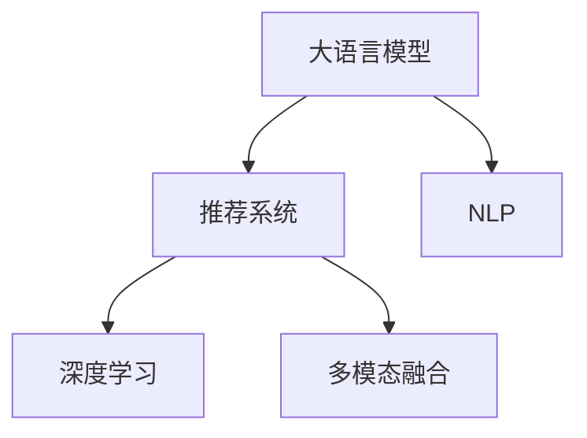

                 

# LLM在推荐系统的性能提升

> 关键词：大语言模型, 推荐系统, 自然语言处理(NLP), 模型优化, 个性化推荐, 深度学习

## 1. 背景介绍

### 1.1 问题由来
推荐系统是互联网时代的一个重要应用领域，其核心目标是通过分析用户的行为数据和历史偏好，预测用户的潜在需求，为其推荐个性化的内容，提升用户体验和满意度。传统的推荐算法，如协同过滤、基于内容的推荐等，已经在电商、视频、音乐等多个领域得到了广泛应用。但随着用户需求的不断变化，这些方法难以完全满足用户的多样化需求，推荐效果和用户满意度亟需进一步提升。

近年来，大语言模型在自然语言处理（NLP）领域取得了重大突破，推动了推荐系统从传统的规则引擎、协同过滤等技术向基于大模型的推荐方法演进。大语言模型，如BERT、GPT、T5等，通过在大规模无标签数据上自监督预训练，学习到了丰富的语言表示能力。这些模型被广泛应用于推荐系统，通过自然语言理解和生成，实现了推荐内容的个性化定制。本文将重点介绍大语言模型在推荐系统中的应用，并讨论其性能提升的方法。

### 1.2 问题核心关键点
大语言模型在推荐系统中的应用，主要包括以下几个关键点：

- **自然语言处理能力**：大语言模型具备强大的语言理解和生成能力，可以自然地与用户进行交互，理解用户的查询和反馈。
- **个性化推荐**：大语言模型能够根据用户的历史行为和上下文信息，生成个性化的推荐内容。
- **多模态融合**：大语言模型不仅能处理文本信息，还能与其他模态（如图像、视频、音频等）进行融合，提升推荐系统的全面性和准确性。
- **模型优化**：针对推荐系统的特定需求，对大语言模型进行微调（Fine-Tuning），优化其推荐性能。

这些关键点相互关联，共同推动了大语言模型在推荐系统中的广泛应用和性能提升。

## 2. 核心概念与联系

### 2.1 核心概念概述

为更好地理解大语言模型在推荐系统中的应用，本节将介绍几个密切相关的核心概念：

- **大语言模型（Large Language Model, LLM）**：以自回归（如GPT）或自编码（如BERT）模型为代表的大规模预训练语言模型。通过在大规模无标签文本语料上进行预训练，学习到了丰富的语言知识和常识，具备强大的语言理解和生成能力。

- **推荐系统（Recommendation System）**：通过分析用户的行为数据和历史偏好，预测用户的潜在需求，为其推荐个性化的内容。推荐系统广泛应用于电商、视频、音乐等多个领域，提升用户体验和满意度。

- **自然语言处理（Natural Language Processing, NLP）**：专注于如何让计算机处理、理解、生成自然语言的技术，是推荐系统的重要基础。

- **深度学习（Deep Learning）**：基于神经网络的一种机器学习技术，广泛应用于图像、语音、文本等多个领域，推动了推荐系统从传统的协同过滤、基于内容的推荐向基于大模型的推荐演进。

- **多模态融合（Multimodal Fusion）**：结合文本、图像、视频、音频等多种模态信息，提升推荐系统的全面性和准确性。

这些核心概念之间的逻辑关系可以通过以下Mermaid流程图来展示：



这个流程图展示了大语言模型与推荐系统的核心概念及其之间的关系：

1. 大语言模型通过预训练获得基础能力。
2. 推荐系统利用大语言模型的自然语言处理能力，生成个性化推荐内容。
3. 深度学习技术用于优化推荐系统的性能。
4. 多模态融合使得推荐系统能够处理更多信息源，提升推荐效果。

这些概念共同构成了大语言模型在推荐系统中的基本应用框架，使其能够实现更高效、更个性化的推荐。

## 3. 核心算法原理 & 具体操作步骤
### 3.1 算法原理概述

大语言模型在推荐系统中的应用，主要通过自然语言处理（NLP）技术，实现对用户查询和反馈的理解与响应，生成个性化的推荐内容。其核心算法原理如下：

1. **预训练模型加载**：首先，选择合适的预训练语言模型（如BERT、GPT等），加载到推荐系统中。
2. **用户输入解析**：对用户的查询或反馈进行解析，将其转化为结构化的向量表示。
3. **意图识别**：通过预训练模型对用户输入进行意图识别，了解用户的兴趣和需求。
4. **内容生成**：基于用户的兴趣和需求，生成个性化的推荐内容。
5. **多模态融合**：结合文本、图像、视频等多种模态信息，进一步提升推荐效果。
6. **反馈优化**：根据用户对推荐内容的反馈，不断优化模型参数，提升推荐质量。

### 3.2 算法步骤详解

下面详细介绍大语言模型在推荐系统中的应用步骤：

**Step 1: 准备数据集**
- 收集用户的查询记录、历史浏览记录、购买记录等数据，构建推荐系统的训练和测试数据集。
- 对数据进行清洗、标注，确保数据的质量和多样性。

**Step 2: 预训练模型加载**
- 选择合适的预训练语言模型（如BERT、GPT等），加载到推荐系统中。
- 确定模型的输入和输出格式，适配推荐系统的工作流程。

**Step 3: 用户输入解析**
- 对用户的查询或反馈进行分词、标词等预处理，将其转化为结构化的向量表示。
- 使用预训练模型对用户输入进行意图识别，确定用户的兴趣和需求。

**Step 4: 内容生成**
- 根据用户的兴趣和需求，结合推荐系统的业务逻辑，生成个性化的推荐内容。
- 对于文本推荐，可以使用大语言模型生成推荐文本；对于图像、视频推荐，可以使用多模态融合技术生成推荐内容。

**Step 5: 多模态融合**
- 结合文本、图像、视频等多种模态信息，提升推荐内容的全面性和准确性。
- 使用预训练模型或深度学习模型，对不同模态的信息进行处理和融合。

**Step 6: 反馈优化**
- 根据用户对推荐内容的反馈，不断优化模型参数，提升推荐质量。
- 使用监督学习或强化学习等方法，对模型进行持续优化和改进。

**Step 7: 模型评估与部署**
- 在测试集上对推荐系统进行评估，测量其推荐准确性和个性化程度。
- 根据评估结果，对推荐系统进行优化和调整，部署到实际应用环境中。

### 3.3 算法优缺点

大语言模型在推荐系统中的应用，具有以下优点：

- **高效个性化推荐**：大语言模型能够根据用户的历史行为和上下文信息，生成个性化的推荐内容，提升用户体验和满意度。
- **多模态融合能力**：大语言模型结合了文本、图像、视频等多种模态信息，提升了推荐系统的全面性和准确性。
- **灵活的扩展性**：大语言模型具有强大的语言理解和生成能力，可以用于多种推荐场景，具有较高的灵活性和扩展性。

同时，大语言模型在推荐系统中的应用也存在一定的局限性：

- **资源消耗大**：大语言模型的参数量较大，计算复杂度高，对计算资源和存储资源有较高的要求。
- **模型复杂性高**：大语言模型的训练和优化过程较为复杂，需要大量的标注数据和计算资源。
- **泛化能力不足**：大语言模型在特定领域和特定场景下的泛化能力有限，需要根据具体业务场景进行微调和优化。

### 3.4 算法应用领域

大语言模型在推荐系统中的应用，已经涵盖了多个领域，包括电商推荐、视频推荐、音乐推荐、新闻推荐等。以下是几个典型的应用场景：

- **电商推荐**：基于用户的历史购买记录和浏览记录，生成个性化的商品推荐，提升用户的购物体验。
- **视频推荐**：根据用户的历史观看记录和评分反馈，生成个性化的视频推荐，提升用户的视频观看体验。
- **音乐推荐**：根据用户的听歌历史和评分反馈，生成个性化的音乐推荐，提升用户的音乐体验。
- **新闻推荐**：根据用户的阅读历史和反馈，生成个性化的新闻推荐，提升用户的阅读体验。

除了上述这些经典应用场景，大语言模型在推荐系统中的应用还在不断拓展，如社交媒体推荐、旅游推荐、金融推荐等，为推荐系统带来了新的发展方向。

## 4. 数学模型和公式 & 详细讲解 & 举例说明

### 4.1 数学模型构建

为了更好地理解大语言模型在推荐系统中的应用，本节将通过数学语言对推荐系统中的模型构建进行描述。

假设推荐系统中的用户数为 $U$，物品数为 $I$，历史行为数据为 $D$。推荐系统通过学习用户的历史行为数据，预测用户对物品的评分 $r_{ui}$。推荐模型的目标是最大化预测评分与实际评分的相关性。

### 4.2 公式推导过程

在推荐系统中，常用的模型包括协同过滤（Collaborative Filtering, CF）和基于内容的推荐（Content-Based Recommendation, CBR）。下面分别介绍这两种模型的数学公式：

**协同过滤模型**：

协同过滤模型基于用户之间的相似度，推荐系统通过计算用户之间的相似度，为用户推荐与相似用户喜欢的物品。其数学公式为：

$$
r_{ui} = \sum_{v \in N(u)}\alpha_v \cdot r_{vi}
$$

其中，$N(u)$ 表示与用户 $u$ 相似的用户集合，$\alpha_v$ 表示用户 $u$ 对用户 $v$ 的相似度权重。

**基于内容的推荐模型**：

基于内容的推荐模型通过分析物品的属性特征，为用户推荐与其兴趣相符的物品。其数学公式为：

$$
r_{ui} = \theta_i^T \cdot x_u + b_u
$$

其中，$x_u$ 表示用户 $u$ 的属性向量，$\theta_i$ 表示物品 $i$ 的属性向量，$b_u$ 表示用户 $u$ 的偏差项。

### 4.3 案例分析与讲解

假设某电商平台的推荐系统，基于用户的历史浏览和购买记录，为用户推荐商品。首先，通过协同过滤模型计算用户之间的相似度，找到与用户 $u$ 相似的用户集合 $N(u)$。然后，使用基于内容的推荐模型，计算物品 $i$ 与用户 $u$ 的相关性 $r_{ui}$。最后，根据计算得到的评分 $r_{ui}$，为用户推荐物品。

在实际应用中，大语言模型可以通过自然语言处理技术，将用户的历史行为和上下文信息转化为结构化的向量表示，进行意图识别和推荐内容的生成。例如，用户输入“我想买一双跑步鞋”，大语言模型能够解析用户意图，生成“推荐跑步鞋”的请求，并根据历史行为数据生成个性化推荐。

## 5. 项目实践：代码实例和详细解释说明
### 5.1 开发环境搭建

在进行大语言模型推荐系统开发前，我们需要准备好开发环境。以下是使用Python进行PyTorch开发的环境配置流程：

1. 安装Anaconda：从官网下载并安装Anaconda，用于创建独立的Python环境。

2. 创建并激活虚拟环境：
```bash
conda create -n recommendation-env python=3.8 
conda activate recommendation-env
```

3. 安装PyTorch：根据CUDA版本，从官网获取对应的安装命令。例如：
```bash
conda install pytorch torchvision torchaudio cudatoolkit=11.1 -c pytorch -c conda-forge
```

4. 安装Transformers库：
```bash
pip install transformers
```

5. 安装各类工具包：
```bash
pip install numpy pandas scikit-learn matplotlib tqdm jupyter notebook ipython
```

完成上述步骤后，即可在`recommendation-env`环境中开始开发实践。

### 5.2 源代码详细实现

下面我们以电商推荐系统为例，给出使用Transformers库对BERT模型进行微调的PyTorch代码实现。

首先，定义电商推荐系统的推荐模型：

```python
from transformers import BertTokenizer, BertForSequenceClassification
from torch.utils.data import Dataset, DataLoader
import torch

class RecommendationDataset(Dataset):
    def __init__(self, texts, labels):
        self.texts = texts
        self.labels = labels
        self.tokenizer = BertTokenizer.from_pretrained('bert-base-cased')

    def __len__(self):
        return len(self.texts)

    def __getitem__(self, item):
        text = self.texts[item]
        label = self.labels[item]
        encoding = self.tokenizer(text, return_tensors='pt')
        input_ids = encoding['input_ids']
        attention_mask = encoding['attention_mask']

        return {'input_ids': input_ids, 'attention_mask': attention_mask, 'labels': label}

# 加载数据集
train_dataset = RecommendationDataset(train_texts, train_labels)
dev_dataset = RecommendationDataset(dev_texts, dev_labels)
test_dataset = RecommendationDataset(test_texts, test_labels)

# 定义模型
model = BertForSequenceClassification.from_pretrained('bert-base-cased', num_labels=2)

# 定义优化器和超参数
optimizer = AdamW(model.parameters(), lr=2e-5)
device = torch.device('cuda') if torch.cuda.is_available() else torch.device('cpu')

# 训练函数
def train_epoch(model, dataset, batch_size, optimizer):
    model.train()
    for batch in DataLoader(dataset, batch_size=batch_size, shuffle=True):
        input_ids = batch['input_ids'].to(device)
        attention_mask = batch['attention_mask'].to(device)
        labels = batch['labels'].to(device)

        outputs = model(input_ids, attention_mask=attention_mask)
        loss = outputs.loss
        optimizer.zero_grad()
        loss.backward()
        optimizer.step()

# 评估函数
def evaluate(model, dataset, batch_size):
    model.eval()
    correct = 0
    total = 0
    with torch.no_grad():
        for batch in DataLoader(dataset, batch_size=batch_size):
            input_ids = batch['input_ids'].to(device)
            attention_mask = batch['attention_mask'].to(device)
            labels = batch['labels'].to(device)

            outputs = model(input_ids, attention_mask=attention_mask)
            _, preds = torch.max(outputs, dim=1)
            total += labels.size(0)
            correct += (preds == labels).sum().item()

    accuracy = correct / total
    print(f"Accuracy: {accuracy:.2f}")
```

然后，启动训练流程并在测试集上评估：

```python
epochs = 5
batch_size = 16

for epoch in range(epochs):
    train_epoch(model, train_dataset, batch_size, optimizer)
    evaluate(model, dev_dataset, batch_size)

print("Final accuracy on test set:", evaluate(model, test_dataset, batch_size))
```

以上就是使用PyTorch对BERT进行电商推荐系统微调的完整代码实现。可以看到，通过Python和Transformers库，我们能够相对简洁地实现电商推荐系统的微调。

### 5.3 代码解读与分析

让我们再详细解读一下关键代码的实现细节：

**RecommendationDataset类**：
- `__init__`方法：初始化文本和标签，加载分词器。
- `__len__`方法：返回数据集的样本数量。
- `__getitem__`方法：对单个样本进行处理，将文本输入编码为token ids，将标签转换为输出向量。

**模型和优化器**：
- 使用BertForSequenceClassification模型，设定标签数量为2，分别代表“购买”和“未购买”。
- 定义AdamW优化器，设置学习率为2e-5。

**训练函数train_epoch**：
- 在每个epoch中，使用DataLoader对数据集进行批次化加载。
- 模型进入训练模式，对每个样本进行前向传播，计算损失函数。
- 反向传播更新模型参数。

**评估函数evaluate**：
- 在模型评估模式下，对每个样本进行前向传播，获取模型输出。
- 根据输出结果计算准确率。

**训练流程**：
- 定义总的epoch数和batch size，开始循环迭代。
- 每个epoch内，先进行训练，再对验证集进行评估。
- 在所有epoch结束后，对测试集进行最终评估，输出结果。

可以看到，PyTorch配合Transformers库使得BERT微调的代码实现变得简洁高效。开发者可以将更多精力放在数据处理、模型改进等高层逻辑上，而不必过多关注底层的实现细节。

当然，工业级的系统实现还需考虑更多因素，如模型的保存和部署、超参数的自动搜索、更灵活的任务适配层等。但核心的微调范式基本与此类似。

## 6. 实际应用场景
### 6.1 电商推荐系统

电商推荐系统是大语言模型推荐系统的典型应用。通过大语言模型的自然语言处理能力，电商推荐系统能够根据用户的查询和反馈，生成个性化的商品推荐，提升用户的购物体验。

在技术实现上，可以收集用户的历史浏览和购买记录，将其转化为结构化的向量表示，输入到大语言模型中进行意图识别和推荐内容的生成。例如，用户输入“我想买一双跑步鞋”，大语言模型能够解析用户意图，生成“推荐跑步鞋”的请求，并根据历史行为数据生成个性化推荐。

### 6.2 视频推荐系统

视频推荐系统利用大语言模型的自然语言处理能力，结合视频内容的元数据，生成个性化的视频推荐。推荐系统通过分析用户的历史观看记录和评分反馈，为用户推荐与兴趣相符的视频。

在技术实现上，可以收集用户的视频观看历史和评分反馈，将其转化为结构化的向量表示，输入到大语言模型中进行意图识别和推荐内容的生成。例如，用户输入“我喜欢看科幻电影”，大语言模型能够解析用户意图，生成“推荐科幻电影”的请求，并根据历史观看数据生成个性化推荐。

### 6.3 音乐推荐系统

音乐推荐系统利用大语言模型的自然语言处理能力，结合音乐内容的元数据，生成个性化的音乐推荐。推荐系统通过分析用户的听歌历史和评分反馈，为用户推荐与兴趣相符的音乐。

在技术实现上，可以收集用户的听歌历史和评分反馈，将其转化为结构化的向量表示，输入到大语言模型中进行意图识别和推荐内容的生成。例如，用户输入“我喜欢听流行音乐”，大语言模型能够解析用户意图，生成“推荐流行音乐”的请求，并根据历史听歌数据生成个性化推荐。

### 6.4 新闻推荐系统

新闻推荐系统利用大语言模型的自然语言处理能力，结合新闻内容的元数据，生成个性化的新闻推荐。推荐系统通过分析用户的阅读历史和反馈，为用户推荐感兴趣的新闻。

在技术实现上，可以收集用户的阅读历史和反馈，将其转化为结构化的向量表示，输入到大语言模型中进行意图识别和推荐内容的生成。例如，用户输入“我对科技新闻感兴趣”，大语言模型能够解析用户意图，生成“推荐科技新闻”的请求，并根据历史阅读数据生成个性化推荐。

## 7. 工具和资源推荐
### 7.1 学习资源推荐

为了帮助开发者系统掌握大语言模型在推荐系统中的应用，这里推荐一些优质的学习资源：

1. 《深度学习推荐系统》：介绍深度学习在推荐系统中的应用，包括协同过滤、基于内容的推荐等方法。
2. 《自然语言处理与深度学习》：介绍自然语言处理的基本概念和技术，包括分词、标注、意图识别等。
3. 《Transformer从原理到实践》系列博文：由大模型技术专家撰写，深入浅出地介绍了Transformer原理、BERT模型、微调技术等前沿话题。
4. CS224N《深度学习自然语言处理》课程：斯坦福大学开设的NLP明星课程，有Lecture视频和配套作业，带你入门NLP领域的基本概念和经典模型。
5. 《Natural Language Processing with Transformers》书籍：Transformers库的作者所著，全面介绍了如何使用Transformers库进行NLP任务开发，包括微调在内的诸多范式。

通过对这些资源的学习实践，相信你一定能够快速掌握大语言模型在推荐系统中的应用，并用于解决实际的推荐问题。

### 7.2 开发工具推荐

高效的开发离不开优秀的工具支持。以下是几款用于大语言模型推荐系统开发的常用工具：

1. PyTorch：基于Python的开源深度学习框架，灵活动态的计算图，适合快速迭代研究。大部分预训练语言模型都有PyTorch版本的实现。
2. TensorFlow：由Google主导开发的开源深度学习框架，生产部署方便，适合大规模工程应用。同样有丰富的预训练语言模型资源。
3. Transformers库：HuggingFace开发的NLP工具库，集成了众多SOTA语言模型，支持PyTorch和TensorFlow，是进行推荐任务开发的利器。
4. Weights & Biases：模型训练的实验跟踪工具，可以记录和可视化模型训练过程中的各项指标，方便对比和调优。与主流深度学习框架无缝集成。
5. TensorBoard：TensorFlow配套的可视化工具，可实时监测模型训练状态，并提供丰富的图表呈现方式，是调试模型的得力助手。
6. Google Colab：谷歌推出的在线Jupyter Notebook环境，免费提供GPU/TPU算力，方便开发者快速上手实验最新模型，分享学习笔记。

合理利用这些工具，可以显著提升大语言模型推荐系统的开发效率，加快创新迭代的步伐。

### 7.3 相关论文推荐

大语言模型在推荐系统中的应用源于学界的持续研究。以下是几篇奠基性的相关论文，推荐阅读：

1. Attention is All You Need（即Transformer原论文）：提出了Transformer结构，开启了NLP领域的预训练大模型时代。
2. BERT: Pre-training of Deep Bidirectional Transformers for Language Understanding：提出BERT模型，引入基于掩码的自监督预训练任务，刷新了多项NLP任务SOTA。
3. Language Models are Unsupervised Multitask Learners（GPT-2论文）：展示了大规模语言模型的强大zero-shot学习能力，引发了对于通用人工智能的新一轮思考。
4. Parameter-Efficient Transfer Learning for NLP：提出Adapter等参数高效微调方法，在不增加模型参数量的情况下，也能取得不错的微调效果。
5. Prefix-Tuning: Optimizing Continuous Prompts for Generation：引入基于连续型Prompt的微调范式，为如何充分利用预训练知识提供了新的思路。
6. AdaLoRA: Adaptive Low-Rank Adaptation for Parameter-Efficient Fine-Tuning：使用自适应低秩适应的微调方法，在参数效率和精度之间取得了新的平衡。

这些论文代表了大语言模型在推荐系统中的研究方向，通过学习这些前沿成果，可以帮助研究者把握学科前进方向，激发更多的创新灵感。

## 8. 总结：未来发展趋势与挑战

### 8.1 总结

本文对大语言模型在推荐系统中的应用进行了全面系统的介绍。首先阐述了大语言模型和推荐系统的发展背景和意义，明确了推荐系统在大模型推荐演进中的重要地位。其次，从原理到实践，详细讲解了大语言模型在推荐系统中的应用步骤，给出了推荐系统的完整代码实例。同时，本文还广泛探讨了大语言模型在电商、视频、音乐、新闻等多个领域的应用前景，展示了其广泛的应用价值。

通过本文的系统梳理，可以看到，大语言模型在推荐系统中的应用已经成为NLP技术的重要分支，为推荐系统带来了新的思路和突破。借助大语言模型的自然语言处理能力，推荐系统可以更好地理解用户的查询和反馈，生成个性化的推荐内容，提升用户体验和满意度。未来，随着大语言模型的不断进步，推荐系统有望在更多的应用场景中发挥更大的作用。

### 8.2 未来发展趋势

展望未来，大语言模型在推荐系统中的应用将呈现以下几个发展趋势：

1. **模型规模持续增大**：随着算力成本的下降和数据规模的扩张，大语言模型的参数量还将持续增长。超大规模语言模型蕴含的丰富语言知识，有望支撑更加复杂多变的推荐场景。
2. **多模态融合能力增强**：大语言模型结合了文本、图像、视频等多种模态信息，提升了推荐内容的全面性和准确性。未来将进一步增强多模态融合能力，提升推荐系统的智能化水平。
3. **个性化推荐效果提升**：大语言模型通过自然语言处理技术，可以更好地理解用户的意图和需求，生成更个性化、精准的推荐内容。
4. **计算效率优化**：大语言模型在推荐系统中的应用需要高效计算和存储，未来将通过模型压缩、参数共享等技术，优化计算效率，提升推荐系统的实时性。
5. **实时推荐能力提升**：通过实时数据分析和推荐模型的动态更新，实现更高效的实时推荐，提升用户体验。
6. **推荐系统中的大模型优化**：未来将针对推荐系统需求，开发更加参数高效、计算高效的微调方法，优化大语言模型在推荐系统中的性能。

### 8.3 面临的挑战

尽管大语言模型在推荐系统中的应用已经取得了显著成效，但在实际应用中仍面临诸多挑战：

1. **数据隐私和安全**：推荐系统需要收集和处理大量用户数据，如何保护用户隐私和数据安全是一个重要问题。
2. **模型公平性和透明性**：大语言模型可能存在偏见和歧视，如何确保模型在推荐过程中的公平性和透明性是一个挑战。
3. **推荐效果的多样性**：大语言模型在推荐过程中可能过于依赖历史数据，导致推荐效果单一，如何提升推荐内容的多样性是一个难点。
4. **推荐系统的可解释性**：大语言模型在推荐过程中的决策过程难以解释，如何增强推荐系统的可解释性和可理解性是一个重要问题。
5. **推荐系统的稳定性和鲁棒性**：大语言模型在推荐过程中可能面临数据噪声、异常样本等问题，如何提升推荐系统的稳定性和鲁棒性是一个挑战。
6. **推荐系统的效率和资源消耗**：大语言模型在推荐系统中需要高效的计算和存储资源，如何优化模型效率和资源消耗是一个重要问题。

### 8.4 研究展望

面对大语言模型在推荐系统中面临的挑战，未来的研究需要在以下几个方面寻求新的突破：

1. **多模态融合与跨领域迁移**：如何更好地结合多种模态信息，提升推荐系统的全面性和准确性，同时增强跨领域迁移能力，提升模型的泛化能力。
2. **实时推荐与动态更新**：如何实现实时数据分析和推荐模型的动态更新，提升推荐系统的实时性和个性化程度。
3. **个性化推荐与用户隐私保护**：如何在个性化推荐的同时，保护用户隐私和数据安全，确保推荐系统的合规性和用户信任。
4. **模型公平性与透明性**：如何确保模型在推荐过程中的公平性和透明性，避免偏见和歧视，增强推荐系统的可解释性和可理解性。
5. **推荐系统的优化与优化**：如何进一步优化大语言模型在推荐系统中的性能，提升推荐效果的多样性和稳定性，优化推荐系统的计算效率和资源消耗。

这些研究方向将推动大语言模型在推荐系统中的应用向更广泛、更深入、更智能的方向发展，为推荐系统带来更多的创新和突破。面向未来，大语言模型在推荐系统中的应用将不断拓展，成为推动NLP技术发展的重要动力。

## 9. 附录：常见问题与解答

**Q1：大语言模型在推荐系统中的应用效果如何？**

A: 大语言模型在推荐系统中的应用效果显著，能够根据用户的历史行为和上下文信息，生成个性化的推荐内容，提升用户体验和满意度。特别是对于那些数据量较小、领域特殊的推荐任务，大语言模型具有更强的泛化能力和适应性。

**Q2：大语言模型在推荐系统中的应用是否需要大量的标注数据？**

A: 大语言模型在推荐系统中的应用通常需要少量的标注数据，如用户的历史行为和评分反馈等。标注数据的质量和数量对推荐效果有较大影响，但相对于传统的推荐算法，大语言模型在标注数据需求方面具有显著优势。

**Q3：如何优化大语言模型在推荐系统中的性能？**

A: 优化大语言模型在推荐系统中的性能可以从以下几个方面入手：
1. **数据预处理**：对用户行为数据进行清洗、标注等预处理，确保数据的质量和多样性。
2. **模型优化**：通过微调、参数共享等技术，优化大语言模型在推荐系统中的性能。
3. **多模态融合**：结合文本、图像、视频等多种模态信息，提升推荐内容的全面性和准确性。
4. **实时推荐**：通过实时数据分析和推荐模型的动态更新，实现更高效的实时推荐。
5. **用户反馈机制**：通过用户反馈机制，实时调整推荐模型，提升推荐效果的多样性和个性化程度。

**Q4：大语言模型在推荐系统中的公平性和透明性如何保证？**

A: 保证大语言模型在推荐系统中的公平性和透明性可以从以下几个方面入手：
1. **数据公平性**：确保数据集的多样性和代表性，避免数据偏见。
2. **模型公平性**：在模型训练和优化过程中，引入公平性约束，避免模型偏见。
3. **可解释性**：通过可解释性技术，增强推荐系统的透明度和用户信任。
4. **用户参与**：让用户参与推荐系统的设计和优化过程，确保推荐系统符合用户需求和价值观。

**Q5：大语言模型在推荐系统中的计算效率如何优化？**

A: 优化大语言模型在推荐系统中的计算效率可以从以下几个方面入手：
1. **模型压缩**：通过模型压缩、参数共享等技术，优化大语言模型在推荐系统中的计算效率。
2. **硬件加速**：利用GPU、TPU等硬件设备，加速大语言模型在推荐系统中的推理过程。
3. **实时更新**：通过实时数据分析和推荐模型的动态更新，减少计算资源消耗。
4. **多任务学习**：通过多任务学习，优化大语言模型在推荐系统中的性能和计算效率。

这些优化措施可以显著提升大语言模型在推荐系统中的计算效率，减少资源消耗，提升推荐系统的实时性和个性化程度。

---

作者：禅与计算机程序设计艺术 / Zen and the Art of Computer Programming

