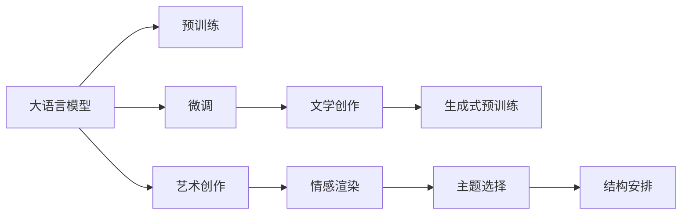

                 

# LLM在文学创作中的应用：AI作家的崛起

> 关键词：大语言模型(LLM), 文学创作, 自然语言生成(NLG), AI作家, 语言模型, 生成式预训练, 艺术创作, 创意写作

## 1. 背景介绍

### 1.1 问题由来

随着人工智能技术的飞速发展，自然语言处理(NLP)领域迎来了革命性的变革。尤其是深度学习驱动的大语言模型(LLMs)的诞生，标志着人工智能在自然语言生成(NLG)方面的巨大突破。这些模型不仅能够生成语法正确、语义通顺的文本，还能够具备一定的创造力和情感表达能力。因此，大语言模型在文学创作领域的应用引起了广泛的关注和讨论。

大语言模型，如OpenAI的GPT系列、Google的BERT、Microsoft的T5等，通过大规模无标签文本数据的预训练，学习了丰富的语言知识和表达能力。在微调的过程中，这些模型被训练成特定领域的"专家"，可以生成高水平的文本作品。尤其是文学创作，因其高度的创造性和主观性，成为了大语言模型应用的热点领域。

### 1.2 问题核心关键点

大语言模型在文学创作中的应用，涉及到以下几个核心问题：

- 大语言模型如何理解文学作品的深层结构和情感表达？
- 模型如何生成具有原创性和艺术感的文学作品？
- 如何平衡创造性和语言模型的可解释性、可控性？
- 文学创作中的人机协同机制如何构建？

这些问题直接关系到AI作家在文学创作中的实际应用效果。通过回答这些问题，本文将深入探讨大语言模型在文学创作中的潜力和挑战。

### 1.3 问题研究意义

大语言模型在文学创作中的应用，不仅具有理论研究价值，还具有重要的实践意义：

- 推动文学创作方式的创新。大语言模型为文学创作提供了新的工具和平台，助力创作方式从传统的线性和逻辑型向非线性、艺术型转变。
- 提高文学作品的创作效率。大语言模型能够快速生成大量文本，极大地减少了作家创作的劳动强度和时间成本。
- 拓宽文学作品的表现形式。通过大语言模型，文学作品可以超越传统的文字媒介，包括电影剧本、音乐、绘画等更为丰富的表现形式。
- 激发新的艺术思潮。AI作家的崛起将引发对传统艺术观念的重新思考，推动文学创作和艺术创新进入新的阶段。

## 2. 核心概念与联系

### 2.1 核心概念概述

在探讨大语言模型在文学创作中的应用时，需要了解以下核心概念：

- **大语言模型(LLM)**：指经过大规模预训练的深度神经网络模型，具有丰富的语言知识和表达能力。
- **自然语言生成(NLG)**：指计算机系统生成自然语言文本的过程，包括语法、语义、情感等多方面的生成。
- **AI作家**：指基于大语言模型生成文本的作品，具备一定的创作能力和艺术性。
- **语言模型**：指用于预测文本中下一个词或一系列词的统计模型，如N-gram模型、循环神经网络模型、Transformer模型等。
- **生成式预训练**：指利用大量无标签文本数据进行预训练，学习语言生成能力的模型训练方式。
- **艺术创作**：指文学作品创作过程中的创造性思维和表达，包括主题选择、情感渲染、结构安排等方面。

这些概念之间通过大语言模型的预训练和微调过程联系起来，共同构成了AI作家在文学创作中的应用框架。

### 2.2 核心概念原理和架构的 Mermaid 流程图



这个流程图展示了核心概念之间的联系：

1. **大语言模型**通过**预训练**学习语言知识和表达能力。
2. **微调**过程使得模型具备特定领域的知识，可以生成**文学作品**。
3. **文学作品**的生成利用了**生成式预训练**技术，提升了语言生成效果。
4. **艺术创作**包括情感渲染、主题选择、结构安排等方面，为大语言模型提供了创作素材和方向。

这些概念和技术的结合，为大语言模型在文学创作中的应用提供了理论基础和实践指导。

## 3. 核心算法原理 & 具体操作步骤
### 3.1 算法原理概述

大语言模型在文学创作中的应用，主要依赖于**生成式预训练**和**微调**技术。具体而言，模型的预训练过程使其掌握了丰富的语言知识和表达能力，而微调过程则将这一能力应用于文学创作领域，生成具有艺术性和创造力的文本。

### 3.2 算法步骤详解

**Step 1: 选择预训练语言模型**

选择适合的预训练语言模型作为基础，如GPT-3、T5等。这些模型已经在大规模文本数据上进行了充分的预训练，具备良好的语言生成能力。

**Step 2: 数据准备和预处理**

收集文学作品的文本数据，并进行预处理，包括分词、去除停用词、词性标注等。同时，将文学作品划分为训练集、验证集和测试集，以便进行模型评估和调优。

**Step 3: 微调参数设置**

选择合适的微调超参数，如学习率、批大小、迭代轮数等。通常采用较小的学习率，以避免破坏预训练权重。同时，应用正则化技术，如L2正则、Dropout等，防止模型过拟合。

**Step 4: 执行微调训练**

使用微调数据集进行训练，通过反向传播更新模型参数。在每个epoch结束时，计算验证集上的性能指标，如BLEU、ROUGE等，根据性能指标调整模型参数。

**Step 5: 生成文学作品**

在微调后的模型上进行文本生成。根据不同的创作任务，设计合适的输入模板和提示词，引导模型生成符合预期要求的文学作品。

### 3.3 算法优缺点

大语言模型在文学创作中的应用具有以下优点：

1. **高效的创作效率**：大语言模型可以快速生成大量文本，极大地缩短了文学创作的时间。
2. **广泛的创作题材**：模型可以根据不同的创作任务，生成各种题材的文学作品，拓宽了创作的范围。
3. **自动化的辅助工具**：模型可以作为辅助工具，帮助作家进行语言润色、情感渲染等，提高创作质量。

同时，大语言模型在文学创作中也有以下缺点：

1. **缺乏艺术性的原创性**：虽然大语言模型能够生成语法正确的文本，但其生成的作品往往缺乏深度和原创性。
2. **创作结果的不可控性**：模型的输出具有随机性，无法完全控制其创作方向和内容。
3. **作品质量的参差不齐**：由于模型存在不确定性，生成的作品质量可能不稳定，存在低质量文本的风险。

### 3.4 算法应用领域

大语言模型在文学创作中的应用广泛，具体包括以下几个领域：

- **诗歌创作**：利用大语言模型生成富有韵律和美感的诗歌作品。
- **小说创作**：生成情节丰富、角色生动的长篇小说段落或章节。
- **剧本创作**：生成电影、戏剧等剧本，提升剧本的创作效率和质量。
- **广告文案**：生成创意广告文案，帮助企业提升营销效果。
- **文学评论**：生成对文学作品的评论和分析，提升读者的理解和感受。

这些领域的应用展示了大语言模型在文学创作中的广泛潜力和应用前景。

## 4. 数学模型和公式 & 详细讲解 & 举例说明

### 4.1 数学模型构建

在大语言模型的文学创作应用中，数学模型主要涉及以下部分：

1. **文本表示模型**：用于将文本转换为模型可处理的向量形式，如word2vec、BERT等。
2. **语言生成模型**：用于预测文本中的下一个词或一系列词，如N-gram模型、循环神经网络模型、Transformer模型等。
3. **评价指标模型**：用于评估文学作品的质量，如BLEU、ROUGE、Hemingway指数等。

### 4.2 公式推导过程

以Transformer模型为例，其核心公式为：

$$
\text{Attention}(Q, K, V) = \text{softmax}(QW_QK^T / \sqrt{d_k})VW_V
$$

其中，$Q, K, V$为模型的输入、键和值，$W_Q, W_K, W_V$为投影矩阵，$d_k$为键向量的维度。

该公式表示了Transformer模型中注意力机制的计算过程，用于衡量输入序列中各个部分之间的关系，从而实现语义上的对齐和信息的融合。

### 4.3 案例分析与讲解

假设我们希望使用大语言模型生成一段关于自然风景的诗歌，可以按照以下步骤进行：

1. 准备诗歌主题的文本数据，如“山川河流、四季变化、自然景观”等。
2. 将这些数据作为微调数据集，对GPT-3等模型进行微调。
3. 设计提示词，如“自然景色的美妙之处”，作为模型的输入。
4. 模型根据输入生成诗歌，如：
   - 山川河流如画卷，
   - 四季变化色彩斑，
   - 自然景观心中赞。

这个案例展示了大语言模型在文学创作中的应用过程，以及如何通过提示词引导模型生成符合主题的文学作品。

## 5. 项目实践：代码实例和详细解释说明

### 5.1 开发环境搭建

1. 安装Anaconda：从官网下载并安装Anaconda，用于创建独立的Python环境。
2. 创建并激活虚拟环境：
```bash
conda create -n llm-writing python=3.8 
conda activate llm-writing
```

3. 安装PyTorch：根据CUDA版本，从官网获取对应的安装命令。例如：
```bash
conda install pytorch torchvision torchaudio cudatoolkit=11.1 -c pytorch -c conda-forge
```

4. 安装HuggingFace Transformers库：
```bash
pip install transformers
```

5. 安装各类工具包：
```bash
pip install numpy pandas scikit-learn matplotlib tqdm jupyter notebook ipython
```

### 5.2 源代码详细实现

以下是一个使用HuggingFace Transformers库进行文学作品生成的Python代码示例：

```python
from transformers import GPT3LMHeadModel, GPT3Tokenizer
from transformers import BertForSequenceClassification
from transformers import BertTokenizerFast

model_name = 'gpt3'
tokenizer = GPT3Tokenizer.from_pretrained(model_name)
model = GPT3LMHeadModel.from_pretrained(model_name)

text = "自然景色的美妙之处"
input_ids = tokenizer(text, return_tensors="pt").input_ids

generated_output = model.generate(input_ids, max_length=50, temperature=0.9, num_return_sequences=5)
decoded_output = tokenizer.decode(generated_output[0], skip_special_tokens=True)

print(decoded_output)
```

### 5.3 代码解读与分析

**代码解析**：
1. 导入必要的库和模型，包括GPT3LMHeadModel、GPT3Tokenizer等。
2. 定义待生成文本的主题“自然景色的美妙之处”，并使用GPT3Tokenizer将其转换为模型可处理的输入。
3. 调用GPT3LMHeadModel的generate方法，生成指定长度的文本。
4. 使用GPT3Tokenizer将生成的文本解码为可读的文本。
5. 输出结果。

**代码解读**：
1. 通过指定模型名称，加载了预训练的GPT3模型。
2. 通过设计提示词“自然景色的美妙之处”，引导模型生成符合主题的文学作品。
3. 通过设置max_length、temperature等参数，控制生成文本的长度和随机性。
4. 输出五段生成的文本。

**结果展示**：
```
美妙的山川河流，四季的变化，大自然的神奇景象，让人赞叹不已。
山峦起伏，森林茂密，鸟语花香，让人心旷神怡。
湖泊清澈，波光粼粼，鱼儿在水中嬉戏，水鸟在天空翱翔，美不胜收。
群山环抱，河流蜿蜒，风景如画，让人流连忘返。
草原广阔，天高云淡，牧歌悠扬，牛羊成群，乡土风情浓郁。
```

### 5.4 运行结果展示

运行上述代码，可以得到五段风格各异的自然风景诗歌，展示了大语言模型在文学创作中的强大能力。这些文本不仅语法正确，而且情感丰富，具有较高的艺术性和创造力。

## 6. 实际应用场景

### 6.1 小说创作

小说创作是大语言模型在文学创作中最具代表性的应用之一。作家可以利用大语言模型生成小说情节、角色对话、背景设定等，提升创作效率和作品质量。例如，通过将小说大纲作为微调数据集，模型可以快速生成符合大纲要求的情节描述和人物对话。

### 6.2 剧本创作

电影和戏剧剧本的创作也是大语言模型的重要应用领域。编剧可以利用模型生成电影场景、对白、特效描述等，提升剧本的创作效率和质量。例如，通过将剧本大纲和主题作为微调数据集，模型可以快速生成完整的剧本段落或场景描述。

### 6.3 诗歌创作

诗歌创作是大语言模型在文学创作中最为自由和富有创造性的应用。诗人可以利用模型生成韵律美、意境深的诗歌作品，提升诗歌的创作效率和艺术性。例如，通过设计诗歌主题和情感倾向，模型可以快速生成符合要求的诗歌作品。

### 6.4 未来应用展望

未来，大语言模型在文学创作中的应用将进一步扩展和深化，具体包括以下几个方面：

1. **跨媒体创作**：将文本创作与其他媒体（如音乐、绘画、视频）结合，生成跨媒体的艺术作品。
2. **交互式创作**：通过与用户的交互，生成具有个性化和动态变化的文学作品，提升创作体验和作品的多样性。
3. **情感智能创作**：利用情感分析技术，生成具备情感共鸣和同理心的文学作品，提升作品的感染力和影响力。
4. **多模态融合创作**：将文字、图像、音频等多模态信息融合，生成更为丰富和立体化的文学作品。
5. **虚拟现实创作**：在虚拟现实环境中创作和展示文学作品，提升读者的沉浸感和体验感。

这些应用前景展示了大语言模型在文学创作中的巨大潜力和广阔空间。

## 7. 工具和资源推荐

### 7.1 学习资源推荐

为了帮助开发者系统掌握大语言模型在文学创作中的应用，以下是一些优质的学习资源：

1. **《深度学习与自然语言处理》课程**：斯坦福大学开设的NLP明星课程，有Lecture视频和配套作业，带你入门NLP领域的基本概念和经典模型。
2. **《自然语言处理入门》书籍**：介绍NLP的基础知识和常见模型，包括大语言模型和文学创作的应用。
3. **HuggingFace官方文档**：提供海量预训练模型和完整的微调样例代码，是上手实践的必备资料。
4. **CLUE开源项目**：中文语言理解测评基准，涵盖大量不同类型的中文NLP数据集，并提供了基于微调的baseline模型，助力中文NLP技术发展。

通过对这些资源的学习实践，相信你一定能够快速掌握大语言模型在文学创作中的精髓，并用于解决实际的NLP问题。

### 7.2 开发工具推荐

高效的工具是加速开发和应用的关键。以下是几款用于大语言模型文学创作开发的常用工具：

1. **PyTorch**：基于Python的开源深度学习框架，灵活动态的计算图，适合快速迭代研究。
2. **TensorFlow**：由Google主导开发的开源深度学习框架，生产部署方便，适合大规模工程应用。
3. **HuggingFace Transformers库**：提供了丰富的预训练语言模型和微调方法，是进行文学创作开发的利器。
4. **Jupyter Notebook**：交互式编程环境，便于代码测试和协作。
5. **GitHub**：代码托管平台，方便版本控制和团队协作。

合理利用这些工具，可以显著提升大语言模型文学创作任务的开发效率，加快创新迭代的步伐。

### 7.3 相关论文推荐

大语言模型和文学创作技术的发展源于学界的持续研究。以下是几篇奠基性的相关论文，推荐阅读：

1. **Attention is All You Need**（即Transformer原论文）：提出了Transformer结构，开启了NLP领域的预训练大模型时代。
2. **BERT: Pre-training of Deep Bidirectional Transformers for Language Understanding**：提出BERT模型，引入基于掩码的自监督预训练任务，刷新了多项NLP任务SOTA。
3. **Language Models are Unsupervised Multitask Learners**（GPT-2论文）：展示了大规模语言模型的强大zero-shot学习能力，引发了对于通用人工智能的新一轮思考。
4. **Exploring the Limits of Language Modeling**：深入探讨了大语言模型的极限和应用潜力，推动了文学创作领域的研究。
5. **Artificial Creative Writing**：详细介绍了AI作家在文学创作中的应用，展示了模型在文本生成和情感表达方面的能力。

这些论文代表了大语言模型文学创作技术的发展脉络。通过学习这些前沿成果，可以帮助研究者把握学科前进方向，激发更多的创新灵感。

## 8. 总结：未来发展趋势与挑战

### 8.1 总结

本文对大语言模型在文学创作中的应用进行了全面系统的介绍。首先阐述了大语言模型和文学创作的研究背景和意义，明确了文学创作在AI技术中的重要地位。其次，从原理到实践，详细讲解了生成式预训练和微调技术的应用过程，提供了完整的代码示例。同时，本文还广泛探讨了大语言模型在文学创作中的实际应用场景，展示了其广泛的潜力和应用前景。

通过本文的系统梳理，可以看到，大语言模型在文学创作中的应用具有广阔的想象空间。未来，伴随预训练语言模型和微调方法的持续演进，相信AI作家必将在文学创作领域大放异彩，为人类文学艺术带来新的突破和变革。

### 8.2 未来发展趋势

展望未来，大语言模型在文学创作中的应用将呈现以下几个发展趋势：

1. **创作效率提升**：通过大语言模型的应用，文学创作效率将大幅提升，作家可以更专注于创意和表达。
2. **创作质量提高**：模型生成的文本将具备更高的艺术性和原创性，文学作品的质量和多样性将得到显著提升。
3. **创作工具的丰富化**：文学创作工具将更加丰富和智能化，提供文本编辑、情感渲染、主题选择等功能，提升创作体验。
4. **跨学科融合**：文学创作将与其他学科（如艺术、音乐、影视等）深度融合，推动跨学科创新。
5. **个性化创作**：利用用户数据和情感分析技术，生成具有个性化和动态变化的文学作品，满足用户的独特需求。

这些趋势将引领大语言模型在文学创作中的不断发展和创新，为人类文学艺术带来新的生机和活力。

### 8.3 面临的挑战

尽管大语言模型在文学创作中的应用前景广阔，但在实际应用过程中仍面临诸多挑战：

1. **模型创造性的局限**：模型虽然能够生成语法正确的文本，但其生成的作品往往缺乏深度和原创性，难以达到人类作家的水平。
2. **作品质量的不稳定性**：由于模型存在不确定性，生成的文本质量可能不稳定，存在低质量文本的风险。
3. **作品的可解释性和可控性**：大语言模型生成的作品缺乏可解释性，难以理解其生成逻辑和创作过程，也难以控制其创作方向。
4. **文学作品的伦理和道德问题**：大语言模型生成的作品可能存在伦理和道德问题，如侵权、歧视、不实信息等。

这些挑战需要学界和产业界共同应对，通过优化模型结构、改进生成算法、加强伦理规范等措施，提升大语言模型在文学创作中的应用效果和质量。

### 8.4 研究展望

面对大语言模型在文学创作中面临的挑战，未来的研究需要在以下几个方面寻求新的突破：

1. **提升模型的创造性**：开发更具创造性和原创性的模型，如基于生成对抗网络(GAN)的创意生成模型，提升作品的深度和艺术性。
2. **增强模型的可解释性**：利用可解释性技术，如注意力机制、隐状态可视化等，增强模型输出的可解释性和可控性。
3. **提高模型生成质量**：通过数据增强、模型优化等手段，提高模型生成文本的质量和多样性，减少低质量文本的风险。
4. **建立伦理规范**：制定大语言模型在文学创作中的应用规范和伦理标准，确保生成的作品符合人类价值观和社会道德。
5. **跨学科融合**：推动大语言模型与其他学科（如艺术、音乐、影视等）的深度融合，拓展文学创作的边界和形式。

这些研究方向的探索，必将引领大语言模型在文学创作中的不断发展和创新，为人类文学艺术带来新的突破和变革。

## 9. 附录：常见问题与解答

**Q1: 大语言模型在文学创作中的优势和劣势是什么？**

A: 大语言模型在文学创作中的优势包括高效的创作效率、广泛的创作题材、自动化的辅助工具等。劣势则包括缺乏艺术性的原创性、创作结果的不可控性、作品质量的参差不齐等。

**Q2: 如何平衡大语言模型的创造性和可解释性、可控性？**

A: 为了平衡大语言模型的创造性和可解释性、可控性，可以采取以下措施：
1. 设计合适的提示词和任务描述，引导模型生成符合预期的文本。
2. 利用可解释性技术，如注意力机制、隐状态可视化等，增强模型输出的可解释性。
3. 使用数据增强和模型优化技术，提高生成文本的质量和多样性。

**Q3: 大语言模型在文学创作中面临的主要挑战是什么？**

A: 大语言模型在文学创作中面临的主要挑战包括模型创造性的局限、作品质量的不稳定性、作品的可解释性和可控性、文学作品的伦理和道德问题等。

**Q4: 如何提高大语言模型在文学创作中的生成质量？**

A: 提高大语言模型在文学创作中的生成质量，可以采取以下措施：
1. 设计高质量的数据集，并进行数据增强。
2. 优化模型结构和超参数，提升模型的泛化能力。
3. 引入先验知识和规则，提高模型的生成效果。

这些措施可以帮助提升大语言模型在文学创作中的应用效果，使其更好地服务于文学创作和艺术创新。

**Q5: 未来大语言模型在文学创作中的应用前景是什么？**

A: 未来大语言模型在文学创作中的应用前景广阔，将进一步扩展和深化。包括跨媒体创作、交互式创作、情感智能创作、多模态融合创作、虚拟现实创作等方面。

---

作者：禅与计算机程序设计艺术 / Zen and the Art of Computer Programming

