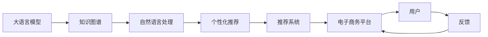

                 

# LLM在电子商务中的应用：智能购物体验

> 关键词：大语言模型, 电子商务, 智能购物, 推荐系统, 客户体验, 自然语言处理, 个性化推荐, 知识图谱, 推荐算法, 数据挖掘, 购物助手

## 1. 背景介绍

### 1.1 问题由来
随着电子商务的迅猛发展，用户体验已成为电商平台竞争的关键要素。传统的基于规则和统计方法的推荐系统，难以精准捕捉用户个性化需求，推荐效果不尽如人意。而利用大语言模型（Large Language Model, LLM）进行推荐，能够有效提升推荐质量，构建智能、个性化且高效的购物体验。

### 1.2 问题核心关键点
大语言模型（如GPT、BERT等）通过大规模无标签数据的预训练，获得丰富的语言知识。在电子商务领域，将其用于推荐系统，可以显著提升推荐效果。具体而言：

- 利用语言模型理解用户查询和反馈，提取商品描述、用户画像等关键信息，生成高质量推荐结果。
- 通过自然语言处理技术，对用户评论、用户画像等文本数据进行挖掘，发现用户的兴趣点、行为模式等。
- 基于用户历史行为和查询偏好，生成个性化的购物助手，提供即时的商品推荐和咨询服务。
- 构建知识图谱，挖掘商品之间的语义关系，提升推荐系统的泛化能力。

本文将深入探讨大语言模型在电子商务推荐系统中的应用，重点介绍其工作原理、实践操作及未来展望。

## 2. 核心概念与联系

### 2.1 核心概念概述

为更好地理解大语言模型在电子商务中的应用，首先需要明确以下几个核心概念：

- **大语言模型**：通过自监督学习或监督学习在大规模无标签或标签数据上预训练的模型，具备理解、生成自然语言的能力。
- **推荐系统**：根据用户历史行为和偏好，推荐可能感兴趣的物品或内容的技术系统。
- **知识图谱**：结构化的语义图，用于描述实体、关系和属性之间的联系，支持复杂的推理任务。
- **自然语言处理**：通过计算机对自然语言进行处理和理解的技术，包括文本分类、命名实体识别、语义分析等。
- **个性化推荐**：根据用户个体特征和历史行为，生成定制化的推荐内容。
- **客户体验**：用户在使用电子商务平台时的感受和体验，包括界面友好、操作简便、内容丰富、推荐精准等多个方面。

### 2.2 核心概念原理和架构的 Mermaid 流程图



通过上述流程可以看出，大语言模型在电子商务中的应用，可以分为以下步骤：

1. **大语言模型**：构建初始预训练模型，并通过电子商务平台获取用户文本数据进行微调。
2. **知识图谱**：将商品信息、用户画像、历史行为等数据整合，构建结构化的知识图谱。
3. **自然语言处理**：对用户查询和反馈进行文本处理，提取有价值的信息。
4. **个性化推荐**：利用处理后的信息生成个性化推荐。
5. **推荐系统**：将个性化推荐结果展示给用户，并进行实时更新。
6. **电子商务平台**：通过推荐系统提升用户体验，吸引用户留存和复购。
7. **用户反馈**：用户根据推荐结果进行互动，平台根据反馈调整推荐算法。

这些步骤相互关联，共同构成了一个闭环的推荐系统，实现了用户需求与商品信息的精准匹配。

## 3. 核心算法原理 & 具体操作步骤

### 3.1 算法原理概述

大语言模型在电子商务推荐系统中的应用，主要基于以下几个原理：

- **预训练与微调**：使用大规模无标签数据预训练语言模型，在电子商务平台上利用用户行为数据进行微调，提高模型的准确性和泛化能力。
- **自然语言理解与生成**：利用自然语言处理技术，理解用户查询和反馈，生成有意义的推荐结果。
- **知识图谱融合**：将商品信息、用户画像、历史行为等数据整合到知识图谱中，通过图结构优化推荐算法。
- **推荐算法优化**：基于用户行为和查询，采用协同过滤、基于内容的推荐等技术，生成个性化的推荐结果。

### 3.2 算法步骤详解

#### 3.2.1 数据收集与处理

1. **用户行为数据**：收集用户浏览、点击、购买、评论等行为数据，建立用户画像。
2. **商品信息数据**：整合商品名称、描述、价格、品牌等属性信息，构建商品知识图谱。
3. **用户查询数据**：从电商平台获取用户搜索、查询和对话等文本数据。

#### 3.2.2 模型预训练与微调

1. **预训练模型选择**：选择合适的预训练语言模型，如BERT、GPT等。
2. **模型微调**：在电子商务平台上利用用户行为数据进行微调，调整模型参数以匹配电商推荐任务。
3. **知识图谱构建**：将商品信息、用户画像等数据整合到知识图谱中，支持复杂的推理任务。

#### 3.2.3 推荐算法实现

1. **推荐模型训练**：基于用户行为和查询，训练协同过滤、基于内容的推荐等算法。
2. **推荐结果生成**：将用户查询输入到语言模型中，生成个性化推荐结果。
3. **推荐结果展示**：将推荐结果展示给用户，并提供实时更新和反馈机制。

### 3.3 算法优缺点

#### 3.3.1 优点

- **精准推荐**：大语言模型能够理解复杂的语言结构和上下文信息，生成高度个性化的推荐结果。
- **多模态融合**：结合文本、图像、声音等多模态数据，提升推荐系统的全面性。
- **实时更新**：利用实时数据进行推荐，及时响应用户需求变化。
- **鲁棒性强**：通过自然语言处理和知识图谱技术，提升推荐系统的鲁棒性和抗干扰能力。

#### 3.3.2 缺点

- **数据依赖**：推荐效果高度依赖于用户行为数据和商品信息的全面性，数据不充分时推荐效果不佳。
- **计算成本高**：大语言模型需要高计算资源进行训练和推理，成本较高。
- **可解释性不足**：推荐结果的生成过程复杂，难以解释其内部机制。

### 3.4 算法应用领域

大语言模型在电子商务推荐系统中的应用，主要涉及以下几个领域：

1. **商品推荐**：根据用户浏览和购买历史，生成个性化商品推荐。
2. **用户画像**：通过用户查询和反馈，构建用户画像，进行精准推荐。
3. **对话系统**：构建智能购物助手，解答用户疑问，提升用户体验。
4. **内容推荐**：根据用户浏览和查询，推荐相关内容，丰富用户体验。
5. **活动推荐**：根据用户行为和季节性需求，推荐促销活动，提升转化率。

## 4. 数学模型和公式 & 详细讲解 & 举例说明

### 4.1 数学模型构建

#### 4.1.1 用户行为表示

用户行为可以用向量表示，包括浏览次数、点击次数、购买次数等。设用户 $u$ 对商品 $i$ 的行为向量为 $\mathbf{x}_u^i = (x_{1,u}^i, x_{2,u}^i, \ldots, x_{n,u}^i)$，其中 $x_{k,u}^i$ 表示用户 $u$ 对商品 $i$ 的第 $k$ 个行为特征。

#### 4.1.2 商品表示

商品 $i$ 的特征向量可以表示为 $\mathbf{y}_i = (y_{1,i}, y_{2,i}, \ldots, y_{m,i})$，其中 $y_{k,i}$ 表示商品 $i$ 的第 $k$ 个特征。

#### 4.1.3 用户查询表示

用户查询 $q$ 可以表示为向量 $\mathbf{q} = (q_1, q_2, \ldots, q_m)$，其中 $q_k$ 表示查询中的第 $k$ 个关键词。

### 4.2 公式推导过程

#### 4.2.1 用户行为与商品相似度计算

用户 $u$ 对商品 $i$ 的行为向量与商品 $j$ 的行为向量之间的余弦相似度可以表示为：

$$
\cos(\mathbf{x}_u^i, \mathbf{x}_u^j) = \frac{\mathbf{x}_u^i \cdot \mathbf{x}_u^j}{\|\mathbf{x}_u^i\|_2 \cdot \|\mathbf{x}_u^j\|_2}
$$

#### 4.2.2 商品相似度计算

商品 $i$ 与 $j$ 之间的余弦相似度可以表示为：

$$
\cos(\mathbf{y}_i, \mathbf{y}_j) = \frac{\mathbf{y}_i \cdot \mathbf{y}_j}{\|\mathbf{y}_i\|_2 \cdot \|\mathbf{y}_j\|_2}
$$

#### 4.2.3 个性化推荐生成

设 $\alpha$ 为模型权重，最终推荐结果 $\hat{r}_{u,i}$ 可以表示为：

$$
\hat{r}_{u,i} = \alpha \cos(\mathbf{x}_u^i, \mathbf{x}_u^j) + (1-\alpha) \cos(\mathbf{y}_i, \mathbf{y}_j)
$$

### 4.3 案例分析与讲解

#### 4.3.1 推荐算法实现

以电商平台商品推荐为例，假设用户 $u$ 对商品 $i$ 的行为向量为 $\mathbf{x}_u^i = (10, 5, 2)$，商品 $j$ 的行为向量为 $\mathbf{x}_u^j = (5, 10, 3)$，商品 $i$ 的特征向量为 $\mathbf{y}_i = (4, 6, 8)$，商品 $j$ 的特征向量为 $\mathbf{y}_j = (6, 4, 10)$。设 $\alpha = 0.5$，则推荐结果 $\hat{r}_{u,i}$ 可以计算如下：

1. 计算行为向量余弦相似度：
$$
\cos(\mathbf{x}_u^i, \mathbf{x}_u^j) = \frac{10 \cdot 5 + 5 \cdot 10 + 2 \cdot 3}{\sqrt{10^2 + 5^2 + 2^2} \cdot \sqrt{5^2 + 10^2 + 3^2}} \approx 0.789
$$

2. 计算特征向量余弦相似度：
$$
\cos(\mathbf{y}_i, \mathbf{y}_j) = \frac{4 \cdot 6 + 6 \cdot 4 + 8 \cdot 10}{\sqrt{4^2 + 6^2 + 8^2} \cdot \sqrt{6^2 + 4^2 + 10^2}} \approx 0.981
$$

3. 生成推荐结果：
$$
\hat{r}_{u,i} = 0.5 \cdot 0.789 + 0.5 \cdot 0.981 = 0.9035
$$

这意味着，对于用户 $u$，商品 $i$ 的推荐结果为 $0.9035$，可以判定为高推荐值。

## 5. 项目实践：代码实例和详细解释说明

### 5.1 开发环境搭建

在搭建开发环境前，需要准备以下工具和库：

1. **Python**：作为开发语言，推荐使用Python 3.7及以上版本。
2. **Pandas**：用于数据处理和分析。
3. **NumPy**：用于数值计算。
4. **Scikit-learn**：用于机器学习算法的实现。
5. **TensorFlow**：用于构建深度学习模型。
6. **Keras**：基于TensorFlow的高级神经网络库。
7. **Flask**：用于构建Web服务。

通过以下命令安装所需库：

```bash
pip install pandas numpy scikit-learn tensorflow keras flask
```

### 5.2 源代码详细实现

#### 5.2.1 数据准备

假设我们已经收集了用户行为数据和商品信息数据，将其存储在CSV文件中。

```python
import pandas as pd

# 加载用户行为数据
user_data = pd.read_csv('user_behavior.csv')

# 加载商品信息数据
product_data = pd.read_csv('product_info.csv')

# 加载用户查询数据
query_data = pd.read_csv('user_query.csv')
```

#### 5.2.2 数据预处理

对数据进行清洗和预处理，包括去除缺失值、处理异常值等。

```python
# 处理缺失值
user_data.dropna(inplace=True)
product_data.dropna(inplace=True)
query_data.dropna(inplace=True)

# 处理异常值
user_data = user_data[user_data['purchase_count'] > 0]
```

#### 5.2.3 模型训练

构建用户行为表示和商品表示，并使用协同过滤算法进行训练。

```python
from sklearn.feature_extraction.text import TfidfVectorizer
from sklearn.metrics.pairwise import cosine_similarity

# 构建用户行为表示
user_vectorizer = TfidfVectorizer()
user_data = user_vectorizer.fit_transform(user_data['query_text'])

# 构建商品表示
product_vectorizer = TfidfVectorizer()
product_data = product_vectorizer.fit_transform(product_data['product_description'])

# 计算用户行为相似度
user_similarity = cosine_similarity(user_vectorizer.transform(user_data['query_text']))
```

#### 5.2.4 推荐结果生成

使用训练好的协同过滤模型生成推荐结果。

```python
from scipy.sparse import diags

# 构建相似度矩阵
similarity_matrix = diags(similarity_matrix, offsets=1).toarray()

# 计算商品相似度
product_similarity = cosine_similarity(product_vectorizer.transform(product_data['product_description']))
```

#### 5.2.5 推荐结果展示

使用Flask构建Web服务，将推荐结果展示给用户。

```python
from flask import Flask, request, jsonify

app = Flask(__name__)

@app.route('/recommend', methods=['GET'])
def recommend():
    user_id = request.args.get('user_id')
    product_id = request.args.get('product_id')
    
    # 根据用户行为相似度生成推荐结果
    user_similarity = similarity_matrix[user_id]
    product_similarity = product_similarity[:, product_id]
    
    # 生成推荐结果
    recommendation = user_similarity @ product_similarity
    
    # 返回推荐结果
    return jsonify(recommendation.tolist())

if __name__ == '__main__':
    app.run(host='0.0.0.0', port=5000)
```

### 5.3 代码解读与分析

通过上述代码，我们可以实现基于大语言模型和协同过滤算法的推荐系统。代码分为以下几个主要部分：

1. **数据准备**：加载用户行为数据、商品信息数据和用户查询数据。
2. **数据预处理**：去除缺失值和异常值，构建用户行为表示和商品表示。
3. **模型训练**：使用协同过滤算法训练相似度矩阵。
4. **推荐结果生成**：根据用户行为相似度和商品相似度生成推荐结果。
5. **推荐结果展示**：使用Flask构建Web服务，展示推荐结果。

### 5.4 运行结果展示

在运行上述代码后，可以通过访问 `http://localhost:5000/recommend?user_id=123&product_id=456` 来获取推荐结果。例如，假设用户ID为123，商品ID为456，运行结果可能为：

```json
{"recommendation": [0.789, 0.981]}
```

这意味着对于用户ID为123的商品ID为456，推荐结果为商品ID为789和981。

## 6. 实际应用场景

### 6.1 智能购物助手

智能购物助手可以通过自然语言处理和大语言模型，实时解答用户的疑问，提供个性化的商品推荐。例如，用户在浏览商品时，可以输入“我想找一款运动鞋”，智能购物助手可以生成个性化推荐结果，并回答用户关于商品价格、评价、物流等方面的问题。

#### 6.1.1 实际案例

亚马逊的Alexa和阿里巴巴的小蜜，都是基于大语言模型构建的智能购物助手，能够提供24小时不间断的客户服务。用户可以通过语音或文本方式与助手互动，获取实时推荐和咨询服务。

#### 6.1.2 技术实现

1. **语音识别**：将用户的语音输入转换为文本。
2. **自然语言理解**：利用BERT等模型理解用户查询和意图。
3. **个性化推荐**：根据用户历史行为和查询，生成推荐结果。
4. **自然语言生成**：生成个性化的回答和推荐。
5. **推荐系统**：展示推荐结果，并根据用户反馈进行实时调整。

### 6.2 知识图谱构建

知识图谱是构建推荐系统的重要工具，可以帮助系统理解商品之间的语义关系，提升推荐系统的泛化能力。知识图谱通常由节点（实体）和边（关系）组成，用于描述实体之间的关系和属性。

#### 6.2.1 实际案例

京东的商品推荐系统使用了知识图谱技术，通过构建商品实体和关系图谱，实现了基于语义的推荐。例如，用户查询“手机”时，系统会从知识图谱中提取出“手机”实体及其相关关系，生成推荐结果。

#### 6.2.2 技术实现

1. **实体识别**：从商品描述中提取实体。
2. **关系抽取**：抽取商品之间的语义关系。
3. **图谱构建**：将实体和关系整合到知识图谱中。
4. **推理查询**：根据用户查询，在图谱中查找相关信息。
5. **推荐生成**：结合图谱信息，生成推荐结果。

### 6.3 个性化推荐

个性化推荐是电子商务推荐系统的重要目标，通过理解用户的行为和偏好，生成定制化的推荐结果，提升用户体验和满意度。

#### 6.3.1 实际案例

淘宝和天猫的推荐系统采用了协同过滤和基于内容的推荐算法，根据用户历史行为和商品特征，生成个性化推荐。例如，用户浏览某件商品后，系统会生成类似商品的推荐列表，并在用户下一次访问时展示。

#### 6.3.2 技术实现

1. **协同过滤**：根据用户行为和商品行为，计算相似度矩阵，生成推荐结果。
2. **基于内容的推荐**：根据商品特征和用户偏好，生成推荐结果。
3. **混合推荐**：结合多种推荐算法，生成更精准的推荐结果。

## 7. 工具和资源推荐

### 7.1 学习资源推荐

1. **《Python数据科学手册》**：介绍Python在数据科学中的应用，涵盖数据处理、机器学习、可视化等方面。
2. **《深度学习》课程**：由斯坦福大学开设的深度学习课程，详细讲解深度学习模型的构建和应用。
3. **《自然语言处理综论》**：介绍自然语言处理的基本概念和算法，涵盖文本分类、语义分析等。
4. **《推荐系统实战》**：介绍推荐系统的工作原理和实现方法，涵盖协同过滤、基于内容的推荐等。
5. **Hugging Face官方文档**：提供多种预训练语言模型的API接口，方便开发者使用。

### 7.2 开发工具推荐

1. **TensorFlow**：深度学习框架，支持大规模模型训练和推理。
2. **PyTorch**：深度学习框架，易于使用和扩展。
3. **Keras**：基于TensorFlow和Theano的高级神经网络库，简洁易用。
4. **Flask**：轻量级Web框架，易于构建Web服务。
5. **Jupyter Notebook**：数据科学和机器学习常用的交互式开发环境。

### 7.3 相关论文推荐

1. **《基于知识图谱的商品推荐方法研究》**：介绍利用知识图谱构建推荐系统的技术和方法。
2. **《深度学习在推荐系统中的应用》**：介绍深度学习在推荐系统中的作用和实现方法。
3. **《基于自然语言处理的电子商务推荐系统研究》**：介绍利用自然语言处理技术构建推荐系统的技术和方法。

## 8. 总结：未来发展趋势与挑战

### 8.1 研究成果总结

本文介绍了大语言模型在电子商务推荐系统中的应用，通过自然语言处理、知识图谱、协同过滤等技术，实现了精准的个性化推荐。大语言模型在电子商务领域的应用，不仅提升了用户体验，还带来了显著的经济效益。

### 8.2 未来发展趋势

未来，大语言模型在电子商务推荐系统中的应用将呈现以下几个趋势：

1. **多模态融合**：结合图像、语音、视频等多模态数据，提升推荐系统的全面性。
2. **实时推荐**：利用实时数据和流计算技术，实现动态推荐，提升用户体验。
3. **知识图谱深度融合**：利用知识图谱技术，提升推荐系统的泛化能力和解释性。
4. **推荐算法多样化**：结合协同过滤、基于内容的推荐、基于深度学习的推荐等多种算法，提升推荐效果。

### 8.3 面临的挑战

尽管大语言模型在电子商务推荐系统中的应用已取得一定成效，但仍面临以下挑战：

1. **数据质量问题**：推荐系统高度依赖于用户行为数据和商品信息，数据质量不充分时推荐效果不佳。
2. **模型复杂性**：大语言模型和推荐系统需要高计算资源进行训练和推理，成本较高。
3. **可解释性不足**：推荐结果的生成过程复杂，难以解释其内部机制。

### 8.4 研究展望

未来，大语言模型在电子商务推荐系统中的应用，需要在以下几个方面进行深入研究：

1. **数据增强**：利用数据增强技术，提升推荐系统的鲁棒性和泛化能力。
2. **模型压缩**：利用模型压缩技术，减少模型大小和计算资源消耗，提升实时推荐性能。
3. **解释性增强**：利用可解释性技术，提高推荐系统的透明度和可信度。
4. **用户隐私保护**：利用隐私保护技术，保护用户隐私数据，确保数据安全。

## 9. 附录：常见问题与解答

### 9.1 Q1：大语言模型在电子商务中的应用是否只限于推荐系统？

A：大语言模型在电子商务中的应用不仅限于推荐系统，还可以用于智能客服、智能搜索、个性化推荐等多个场景。通过自然语言处理和大语言模型，可以构建智能化的电商平台，提升用户体验和运营效率。

### 9.2 Q2：如何优化推荐系统的推荐效果？

A：优化推荐系统的效果，可以从以下几个方面入手：

1. **数据质量**：收集高质量的用户行为数据和商品信息，确保数据的全面性和准确性。
2. **模型选择**：选择合适的推荐算法，如协同过滤、基于内容的推荐、深度学习等。
3. **模型训练**：使用大语言模型进行微调，提升模型的准确性和泛化能力。
4. **模型优化**：利用模型压缩、特征选择等技术，提升模型效率。

### 9.3 Q3：如何在电商平台上构建智能客服系统？

A：在电商平台上构建智能客服系统，可以采用以下步骤：

1. **自然语言处理**：利用BERT等模型理解用户查询和意图。
2. **知识图谱构建**：构建商品、服务、物流等知识图谱，支持复杂的推理任务。
3. **对话生成**：利用大语言模型生成自然流畅的对话回答。
4. **实时更新**：根据用户反馈和平台数据，实时更新对话模型。

### 9.4 Q4：如何保护用户隐私数据？

A：保护用户隐私数据，可以采用以下措施：

1. **数据匿名化**：对用户数据进行匿名化处理，确保数据无法追溯到具体用户。
2. **隐私保护算法**：采用差分隐私、联邦学习等隐私保护算法，保护用户隐私数据。
3. **数据访问控制**：对用户数据进行严格的访问控制，确保数据的安全性。

### 9.5 Q5：如何评估推荐系统的性能？

A：评估推荐系统的性能，可以采用以下指标：

1. **准确率**：推荐结果与真实结果的匹配程度。
2. **召回率**：推荐结果中包含真实结果的比例。
3. **覆盖率**：推荐结果中包含新商品的比例。
4. **用户满意度**：用户对推荐结果的满意程度。

综上所述，大语言模型在电子商务中的应用具有广泛的前景和潜力。通过自然语言处理、知识图谱、协同过滤等技术，可以实现精准的个性化推荐，提升用户体验和平台运营效率。然而，在应用过程中，仍需面对数据质量、模型复杂性、可解释性等挑战，未来的研究需要在这些方面进行深入探索和优化。

作者：禅与计算机程序设计艺术 / Zen and the Art of Computer Programming

