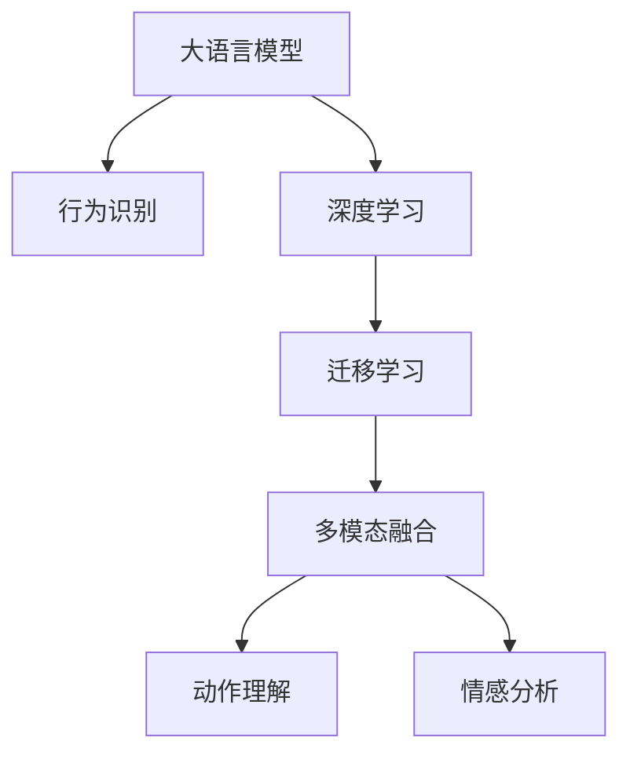

                 

# LLM在行为识别领域的研究新思路

> 关键词：大语言模型(LLM), 行为识别, 深度学习, 迁移学习, 多模态融合, 动作理解, 情感分析

## 1. 背景介绍

### 1.1 问题由来
随着深度学习技术的不断发展，自然语言处理（NLP）领域取得了巨大的进步，尤其是大语言模型（Large Language Models, LLMs）的崛起，带来了自然语言理解和生成的巨大飞跃。与此同时，计算机视觉（CV）和行为识别（BR）领域也受益于深度学习，获得了显著的发展。然而，将LLM应用于BR领域还处于起步阶段，缺乏有效的融合策略。

### 1.2 问题核心关键点
目前，将大语言模型应用于行为识别领域的研究核心在于：

1. 如何构建高效融合大语言模型和计算机视觉的BR系统，使得LLM能理解视觉数据中的行为含义。
2. 如何提升LLM在BR任务中的表现，特别是针对复杂的动作和情感分析任务。
3. 如何在保证模型性能的同时，减少计算资源消耗，使得模型更加高效。
4. 如何提高BR系统的鲁棒性和泛化能力，使其在不同场景和数据分布上表现稳定。

### 1.3 问题研究意义
将LLM应用于BR领域，将显著提升行为分析系统的智能化水平，使其具备更强的理解和生成能力。BR系统的智能化将促进社会管理、安全监控、智能家居等多个领域的发展，带来更高效、更智能的解决方案。同时，LLM在BR领域的应用，也为NLP和CV技术的融合提供了新的思路，有助于推动两个领域的交叉发展。

## 2. 核心概念与联系

### 2.1 核心概念概述

为更好地理解LLM在BR领域的研究思路，本节将介绍几个密切相关的核心概念：

- 大语言模型(LLM)：以自回归(如GPT)或自编码(如BERT)模型为代表的大规模预训练语言模型。通过在大规模无标签文本语料上进行预训练，学习通用的语言表示，具备强大的语言理解和生成能力。

- 行为识别(BR)：利用计算机视觉技术，识别和理解人类行为的过程。常见的BR任务包括动作理解、姿势识别、情感分析等。

- 深度学习(Deep Learning)：一种基于神经网络的机器学习方法，通过多层次的特征提取和抽象，实现对复杂数据的高级建模。

- 迁移学习(Transfer Learning)：指将一个领域学习到的知识，迁移应用到另一个不同但相关的领域的学习范式。LLM的预训练-微调过程即是一种典型的迁移学习方式。

- 多模态融合(Multimodal Fusion)：融合不同模态的数据源（如文本、图像、声音等），进行综合分析和理解。

- 动作理解(Action Understanding)：通过视觉数据理解人类或动物的动态行为。

- 情感分析(Emotion Analysis)：通过文本、语音、图像等多种数据源，分析人类的情感状态和情绪变化。

这些核心概念之间的逻辑关系可以通过以下Mermaid流程图来展示：



这个流程图展示了大语言模型在BR领域的应用框架，其中：

1. 大语言模型通过预训练获得基础能力。
2. 深度学习提供底层技术支持，进行复杂的特征提取和建模。
3. 迁移学习使得通用大模型适应特定BR任务。
4. 多模态融合提高系统的综合理解和判断能力。
5. 动作理解和情感分析分别针对不同类型的BR任务，提供特定的解决方案。

## 3. 核心算法原理 & 具体操作步骤
### 3.1 算法原理概述

将大语言模型应用于行为识别，本质上是一个多模态融合和迁移学习的过程。其核心思想是：将LLM视作一种强大的语义理解工具，结合计算机视觉技术，通过深度学习提取多模态数据中的行为特征，然后利用LLM对这些特征进行语义理解和推理。

形式化地，假设行为识别任务为 $T$，预训练语言模型为 $M_{\theta}$，其中 $\theta$ 为预训练得到的模型参数。假设存在一个计算机视觉模型 $V$，用于提取行为图像的特征向量 $f_{V}$。则融合后的多模态数据为 $(f_{V}, \text{input\_text})$，输入到预训练的LLM中进行行为理解。

微调的目标是最小化模型在行为识别任务上的损失函数 $\mathcal{L}$，即找到最优参数：

$$
\theta^* = \mathop{\arg\min}_{\theta} \mathcal{L}(V(M_{\theta}, x), y)
$$

其中 $x$ 为行为图像，$y$ 为行为标签。

### 3.2 算法步骤详解

基于LLM的行为识别微调方法，一般包括以下几个关键步骤：

**Step 1: 准备数据集和预训练模型**
- 准备行为识别任务的标注数据集 $D=\{(x_i, y_i)\}_{i=1}^N$，其中 $x_i$ 为行为图像，$y_i$ 为行为标签。
- 选择适当的预训练语言模型 $M_{\theta}$，如GPT、BERT等。

**Step 2: 特征提取和文本编码**
- 使用计算机视觉模型 $V$ 对行为图像 $x_i$ 进行特征提取，得到特征向量 $f_{V}(x_i)$。
- 将提取的特征向量 $f_{V}(x_i)$ 和行为描述文本 $\text{input\_text}_i$ 拼接或融合，形成多模态输入。
- 使用预训练语言模型 $M_{\theta}$ 对多模态输入进行编码，得到语义表示 $M_{\theta}([f_{V}(x_i), \text{input\_text}_i])$。

**Step 3: 添加任务适配层**
- 根据行为识别任务，在预训练模型的顶层设计合适的输出层和损失函数。例如，对于动作理解任务，可以添加动作类别分类的线性分类器；对于情感分析任务，可以添加情感类别的交叉熵损失函数。

**Step 4: 设置微调超参数**
- 选择合适的优化算法及其参数，如 AdamW、SGD 等，设置学习率、批大小、迭代轮数等。
- 设置正则化技术及强度，包括权重衰减、Dropout、Early Stopping 等。

**Step 5: 执行梯度训练**
- 将训练集数据分批次输入模型，前向传播计算损失函数。
- 反向传播计算参数梯度，根据设定的优化算法和学习率更新模型参数。
- 周期性在验证集上评估模型性能，根据性能指标决定是否触发 Early Stopping。
- 重复上述步骤直到满足预设的迭代轮数或 Early Stopping 条件。

**Step 6: 测试和部署**
- 在测试集上评估微调后模型 $M_{\hat{\theta}}$ 的性能，对比微调前后的精度提升。
- 使用微调后的模型对新样本进行推理预测，集成到实际的应用系统中。

### 3.3 算法优缺点

将大语言模型应用于行为识别，具有以下优点：

1. 强大的语义理解能力：LLM能够理解复杂的自然语言描述，将多模态数据进行语义整合，提高系统的综合分析能力。
2. 泛化能力强：通过预训练和微调，LLM能够适应不同类型的行为识别任务，提升模型的泛化能力。
3. 适应性强：LLM可以通过微调参数，灵活适应不同数据分布和应用场景。

同时，该方法也存在一定的局限性：

1. 计算资源需求高：大语言模型参数量巨大，需要高性能计算资源进行训练和推理。
2. 数据依赖性强：微调效果很大程度上取决于标注数据的质量和数量，获取高质量标注数据的成本较高。
3. 解释性不足：微调模型的决策过程通常缺乏可解释性，难以对其推理逻辑进行分析和调试。

尽管存在这些局限性，但就目前而言，将大语言模型应用于行为识别的方法仍是一种高效且具有潜力的研究范式。未来相关研究的重点在于如何进一步降低计算资源消耗，提高模型的泛化能力和解释性，同时兼顾数据驱动和人类理解的融合。

### 3.4 算法应用领域

将LLM应用于行为识别的方法，在多个领域已经得到了广泛的应用，例如：

- 视频监控系统：通过融合摄像头采集的视频图像和行为描述文本，识别异常行为或犯罪行为。
- 智能家居系统：识别用户的日常行为，提供个性化的家居服务，如智能开关、灯光调节等。
- 社交媒体分析：通过分析用户的在线行为和评论，理解用户的情绪变化和行为模式，提供个性化推荐。
- 健康监控：利用动作识别和情感分析技术，监测病人的身体状况和情绪变化，提供健康建议。
- 体育赛事分析：通过动作理解技术，分析运动员的技术动作，提供比赛评估和训练指导。

除了上述这些经典应用外，LLM在行为识别领域的应用还在不断扩展，如自动驾驶、机器人导航、安全检测等，为智能系统的构建提供了新的思路。随着深度学习技术的不断进步，相信LLM在行为识别领域的应用将更加广泛和深入。

## 4. 数学模型和公式 & 详细讲解
### 4.1 数学模型构建

本节将使用数学语言对基于LLM的行为识别微调过程进行更加严格的刻画。

假设行为识别任务为 $T$，预训练语言模型为 $M_{\theta}$，其中 $\theta$ 为预训练得到的模型参数。假设存在一个计算机视觉模型 $V$，用于提取行为图像的特征向量 $f_{V}$。则融合后的多模态数据为 $(f_{V}, \text{input\_text})$，输入到预训练的LLM中进行行为理解。

定义模型 $M_{\theta}$ 在输入 $x$ 上的输出为 $\hat{y}=M_{\theta}(x)$，表示预测的行为标签。则行为识别任务的目标函数为：

$$
\mathcal{L}(V(M_{\theta}, x), y) = \ell(M_{\theta}([f_{V}(x), \text{input\_text}]), y)
$$

其中 $\ell$ 为针对行为识别任务设计的损失函数，通常使用交叉熵损失函数：

$$
\ell(M_{\theta}([f_{V}(x), \text{input\_text}]), y) = -y\log M_{\theta}([f_{V}(x), \text{input\_text}]) - (1-y)\log (1-M_{\theta}([f_{V}(x), \text{input\_text}]))
$$

通过梯度下降等优化算法，微调过程不断更新模型参数 $\theta$，最小化损失函数 $\mathcal{L}$，使得模型输出逼近真实标签 $y$。由于 $\theta$ 已经通过预训练获得了较好的初始化，因此即便在小规模数据集上，也能较快收敛到理想的模型参数 $\hat{\theta}$。

### 4.2 公式推导过程

以下我们以动作理解任务为例，推导跨模态行为识别的损失函数及其梯度的计算公式。

假设模型 $M_{\theta}$ 在输入 $x$ 上的输出为 $\hat{y}=M_{\theta}(x)$，表示预测的动作类别。真实标签 $y \in \{1,2,\dots,K\}$，其中 $K$ 为动作类别数。则行为识别任务的目标函数为：

$$
\mathcal{L}(V(M_{\theta}, x), y) = -\frac{1}{N}\sum_{i=1}^N \log M_{\theta}([f_{V}(x_i), \text{input\_text}_i])
$$

根据链式法则，损失函数对参数 $\theta_k$ 的梯度为：

$$
\frac{\partial \mathcal{L}(V(M_{\theta}, x), y)}{\partial \theta_k} = -\frac{1}{N}\sum_{i=1}^N \frac{\partial}{\partial \theta_k} M_{\theta}([f_{V}(x_i), \text{input\_text}_i])
$$

其中 $[f_{V}(x_i), \text{input\_text}_i]$ 为多模态输入，利用自动微分技术完成计算。

在得到损失函数的梯度后，即可带入参数更新公式，完成模型的迭代优化。重复上述过程直至收敛，最终得到适应行为识别任务的最优模型参数 $\theta^*$。

## 5. 项目实践：代码实例和详细解释说明
### 5.1 开发环境搭建

在进行微调实践前，我们需要准备好开发环境。以下是使用Python进行PyTorch开发的环境配置流程：

1. 安装Anaconda：从官网下载并安装Anaconda，用于创建独立的Python环境。

2. 创建并激活虚拟环境：
```bash
conda create -n pytorch-env python=3.8 
conda activate pytorch-env
```

3. 安装PyTorch：根据CUDA版本，从官网获取对应的安装命令。例如：
```bash
conda install pytorch torchvision torchaudio cudatoolkit=11.1 -c pytorch -c conda-forge
```

4. 安装Transformers库：
```bash
pip install transformers
```

5. 安装各类工具包：
```bash
pip install numpy pandas scikit-learn matplotlib tqdm jupyter notebook ipython
```

完成上述步骤后，即可在`pytorch-env`环境中开始微调实践。

### 5.2 源代码详细实现

这里我们以动作理解任务为例，给出使用Transformers库对BERT模型进行微调的PyTorch代码实现。

首先，定义动作理解任务的数据处理函数：

```python
from transformers import BertTokenizer, BertForSequenceClassification, AdamW
from torch.utils.data import Dataset, DataLoader
import torch
import torch.nn as nn
import torch.nn.functional as F

class ActionDataset(Dataset):
    def __init__(self, texts, labels, tokenizer):
        self.texts = texts
        self.labels = labels
        self.tokenizer = tokenizer

    def __len__(self):
        return len(self.texts)

    def __getitem__(self, item):
        text = self.texts[item]
        label = self.labels[item]
        
        encoding = self.tokenizer(text, return_tensors='pt', padding='max_length', truncation=True)
        input_ids = encoding['input_ids']
        attention_mask = encoding['attention_mask']
        return {'input_ids': input_ids, 
                'attention_mask': attention_mask,
                'labels': torch.tensor(label, dtype=torch.long)}
```

然后，定义模型和优化器：

```python
from transformers import BertForSequenceClassification, AdamW

model = BertForSequenceClassification.from_pretrained('bert-base-uncased', num_labels=6)

optimizer = AdamW(model.parameters(), lr=2e-5)
```

接着，定义训练和评估函数：

```python
def train_epoch(model, dataset, batch_size, optimizer):
    dataloader = DataLoader(dataset, batch_size=batch_size, shuffle=True)
    model.train()
    epoch_loss = 0
    for batch in dataloader:
        input_ids = batch['input_ids'].to(device)
        attention_mask = batch['attention_mask'].to(device)
        labels = batch['labels'].to(device)
        model.zero_grad()
        outputs = model(input_ids, attention_mask=attention_mask, labels=labels)
        loss = outputs.loss
        epoch_loss += loss.item()
        loss.backward()
        optimizer.step()
    return epoch_loss / len(dataloader)

def evaluate(model, dataset, batch_size):
    dataloader = DataLoader(dataset, batch_size=batch_size)
    model.eval()
    preds, labels = [], []
    with torch.no_grad():
        for batch in dataloader:
            input_ids = batch['input_ids'].to(device)
            attention_mask = batch['attention_mask'].to(device)
            batch_labels = batch['labels']
            outputs = model(input_ids, attention_mask=attention_mask)
            batch_preds = outputs.logits.argmax(dim=1).to('cpu').tolist()
            batch_labels = batch_labels.to('cpu').tolist()
            for pred, label in zip(batch_preds, batch_labels):
                preds.append(pred)
                labels.append(label)
    return preds, labels
```

最后，启动训练流程并在测试集上评估：

```python
epochs = 5
batch_size = 16

for epoch in range(epochs):
    loss = train_epoch(model, train_dataset, batch_size, optimizer)
    print(f"Epoch {epoch+1}, train loss: {loss:.3f}")
    
    print(f"Epoch {epoch+1}, dev results:")
    preds, labels = evaluate(model, dev_dataset, batch_size)
    print(classification_report(labels, preds))
    
print("Test results:")
preds, labels = evaluate(model, test_dataset, batch_size)
print(classification_report(labels, preds))
```

以上就是使用PyTorch对BERT进行动作理解任务微调的完整代码实现。可以看到，得益于Transformers库的强大封装，我们可以用相对简洁的代码完成BERT模型的加载和微调。

### 5.3 代码解读与分析

让我们再详细解读一下关键代码的实现细节：

**ActionDataset类**：
- `__init__`方法：初始化文本、标签、分词器等关键组件。
- `__len__`方法：返回数据集的样本数量。
- `__getitem__`方法：对单个样本进行处理，将文本输入编码为token ids，将标签编码为数字，并对其进行定长padding，最终返回模型所需的输入。

**训练和评估函数**：
- 使用PyTorch的DataLoader对数据集进行批次化加载，供模型训练和推理使用。
- 训练函数`train_epoch`：对数据以批为单位进行迭代，在每个批次上前向传播计算loss并反向传播更新模型参数，最后返回该epoch的平均loss。
- 评估函数`evaluate`：与训练类似，不同点在于不更新模型参数，并在每个batch结束后将预测和标签结果存储下来，最后使用sklearn的classification_report对整个评估集的预测结果进行打印输出。

**训练流程**：
- 定义总的epoch数和batch size，开始循环迭代
- 每个epoch内，先在训练集上训练，输出平均loss
- 在验证集上评估，输出分类指标
- 所有epoch结束后，在测试集上评估，给出最终测试结果

可以看到，PyTorch配合Transformers库使得BERT微调的代码实现变得简洁高效。开发者可以将更多精力放在数据处理、模型改进等高层逻辑上，而不必过多关注底层的实现细节。

当然，工业级的系统实现还需考虑更多因素，如模型的保存和部署、超参数的自动搜索、更灵活的任务适配层等。但核心的微调范式基本与此类似。

## 6. 实际应用场景
### 6.1 视频监控系统

基于大语言模型微调的行为识别系统，可以广泛应用于视频监控系统中。传统监控系统主要依靠图像识别技术，对于复杂行为的理解和判断能力有限。而使用微调后的行为识别模型，可以自动理解监控视频中的行为含义，辅助安保人员进行实时监控和异常行为识别。

在技术实现上，可以收集监控视频中的人类行为，将其描述为自然语言文本，并将文本和图像数据一起作为监督数据，在此基础上对预训练的行为识别模型进行微调。微调后的模型能够自动理解视频中的行为含义，及时识别出异常行为，如暴力冲突、人员入侵等，并触发报警系统，提升安全监控的智能化水平。

### 6.2 社交媒体分析

社交媒体平台收集了大量的用户行为数据，包括发布内容、点赞、评论、分享等。通过这些数据，可以构建行为识别模型，分析用户的在线行为和情绪状态。例如，在社交媒体平台上，可以使用微调后的模型对用户发布的内容进行情感分析，识别出正面、负面或中性情绪，并根据分析结果推送相关内容，如新闻资讯、娱乐信息等，提供个性化推荐。

### 6.3 智能家居系统

智能家居系统通过多种传感器采集用户的日常行为数据，如语音指令、动作捕捉等。结合微调后的行为识别模型，智能家居系统可以自动理解用户的意图，提供个性化服务。例如，当用户说出“打开客厅灯”的语音指令时，智能家居系统可以自动识别用户的语音指令，并根据用户的日常行为数据，提供更精准的照明控制服务。

### 6.4 未来应用展望

随着大语言模型和行为识别技术的不断进步，基于微调范式将在更多领域得到应用，为社会管理和智能家居等带来变革性影响。

在智慧城市管理中，行为识别技术可以用于交通流量监测、人群行为分析等，提升城市管理的智能化水平，减少交通拥堵，保障公共安全。

在智能家居系统中，微调后的行为识别系统可以用于语音指令识别、手势控制等，提供更自然、高效的交互方式，提升用户的居住体验。

在医疗健康领域，行为识别技术可以用于病人行为监测、情感分析等，及时发现病人的情绪变化和异常行为，提供个性化的健康建议和治疗方案。

此外，在企业生产、社会治理、文娱传媒等众多领域，基于大模型微调的行为识别应用也将不断涌现，为社会管理和服务提供新的思路。相信随着技术的日益成熟，微调方法将成为行为识别领域的重要范式，推动相关技术的普及和应用。

## 7. 工具和资源推荐
### 7.1 学习资源推荐

为了帮助开发者系统掌握大语言模型在行为识别领域的应用，这里推荐一些优质的学习资源：

1. 《Transformers from Zero to Hero》系列博文：由大模型技术专家撰写，深入浅出地介绍了Transformer原理、BERT模型、微调技术等前沿话题。

2. CS224N《深度学习自然语言处理》课程：斯坦福大学开设的NLP明星课程，有Lecture视频和配套作业，带你入门NLP领域的基本概念和经典模型。

3. 《Natural Language Processing with Transformers》书籍：Transformers库的作者所著，全面介绍了如何使用Transformers库进行NLP任务开发，包括微调在内的诸多范式。

4. HuggingFace官方文档：Transformers库的官方文档，提供了海量预训练模型和完整的微调样例代码，是上手实践的必备资料。

5. GLUE开源项目：自然语言理解测评基准，涵盖大量不同类型的NLP数据集，并提供了基于微调的baseline模型，助力NLP技术发展。

通过对这些资源的学习实践，相信你一定能够快速掌握大语言模型在行为识别领域的应用，并用于解决实际的NLP问题。
###  7.2 开发工具推荐

高效的开发离不开优秀的工具支持。以下是几款用于大语言模型微调开发的常用工具：

1. PyTorch：基于Python的开源深度学习框架，灵活动态的计算图，适合快速迭代研究。大部分预训练语言模型都有PyTorch版本的实现。

2. TensorFlow：由Google主导开发的开源深度学习框架，生产部署方便，适合大规模工程应用。同样有丰富的预训练语言模型资源。

3. Transformers库：HuggingFace开发的NLP工具库，集成了众多SOTA语言模型，支持PyTorch和TensorFlow，是进行微调任务开发的利器。

4. Weights & Biases：模型训练的实验跟踪工具，可以记录和可视化模型训练过程中的各项指标，方便对比和调优。与主流深度学习框架无缝集成。

5. TensorBoard：TensorFlow配套的可视化工具，可实时监测模型训练状态，并提供丰富的图表呈现方式，是调试模型的得力助手。

6. Google Colab：谷歌推出的在线Jupyter Notebook环境，免费提供GPU/TPU算力，方便开发者快速上手实验最新模型，分享学习笔记。

合理利用这些工具，可以显著提升大语言模型微调任务的开发效率，加快创新迭代的步伐。

### 7.3 相关论文推荐

大语言模型在行为识别领域的研究起步较晚，但已经取得了显著进展。以下是几篇奠基性的相关论文，推荐阅读：

1. Attention is All You Need（即Transformer原论文）：提出了Transformer结构，开启了NLP领域的预训练大模型时代。

2. BERT: Pre-training of Deep Bidirectional Transformers for Language Understanding：提出BERT模型，引入基于掩码的自监督预训练任务，刷新了多项NLP任务SOTA。

3. Multi-Modal Action Recognition with Deep Pre-Trained Language Models：提出一种基于大语言模型的多模态行为识别方法，利用语言模型增强视觉特征的理解能力。

4. A Multimodal Hierarchical Attention Network for Action Recognition：提出一种多模态注意力网络，结合视觉和语言特征，提升动作识别的准确率。

5. Understanding Pretrained Language Models Through Transfer Learning：研究了语言模型的迁移学习能力，分析了预训练大模型在微调后的表现。

这些论文代表了大语言模型在行为识别领域的发展脉络。通过学习这些前沿成果，可以帮助研究者把握学科前进方向，激发更多的创新灵感。

## 8. 总结：未来发展趋势与挑战

### 8.1 总结

本文对基于大语言模型在行为识别领域的研究思路进行了全面系统的介绍。首先阐述了行为识别领域的研究背景和意义，明确了将大语言模型应用于行为识别的潜在价值。其次，从原理到实践，详细讲解了行为识别任务的微调过程，给出了微调任务开发的完整代码实例。同时，本文还广泛探讨了行为识别系统在智能监控、社交媒体、智能家居等多个领域的应用前景，展示了微调范式的巨大潜力。此外，本文精选了行为识别技术的各类学习资源，力求为读者提供全方位的技术指引。

通过本文的系统梳理，可以看到，将大语言模型应用于行为识别的方法，在提升系统智能化水平、减少人工成本、提高数据利用效率等方面具有巨大优势。未来，伴随深度学习技术的不断进步，基于大语言模型的行为识别系统必将在更多领域得到应用，为智能系统的发展注入新的动力。

### 8.2 未来发展趋势

展望未来，大语言模型在行为识别领域的研究趋势将呈现以下几个方面：

1. 多模态融合技术将进一步发展。随着深度学习技术的发展，多模态融合技术将更加高效和智能，提升系统的综合理解能力。

2. 鲁棒性和泛化能力将进一步提升。未来的行为识别模型将具备更强的鲁棒性和泛化能力，能够在不同数据分布和场景下表现稳定。

3. 模型压缩和优化技术将更加成熟。通过模型压缩和优化，减少大语言模型的计算资源消耗，提升推理速度，使得模型更加高效实用。

4. 知识表示和因果推理技术将更加融合。通过引入知识表示和因果推理技术，增强行为识别模型的推理能力和决策逻辑的解释性。

5. 跨领域和跨模态迁移学习将更加普及。未来的行为识别模型将具备更强的跨领域和跨模态迁移学习能力，能够在不同应用场景和数据类型下表现优异。

6. 隐私保护和安全保障将更加重视。未来的行为识别系统将更加注重隐私保护和安全保障，避免数据泄露和滥用。

这些趋势表明，大语言模型在行为识别领域的应用前景广阔，将推动智能系统向更智能、更普适、更安全的方向发展。

### 8.3 面临的挑战

尽管大语言模型在行为识别领域的研究已经取得了一些进展，但在迈向更加智能化、普适化应用的过程中，仍面临以下挑战：

1. 数据获取和标注成本高。高质量的行为识别数据获取和标注成本较高，数据质量和标注标准难以统一。

2. 模型复杂度高。大语言模型参数量巨大，计算资源消耗大，推理速度慢，难以应用于实时场景。

3. 模型泛化能力有限。微调模型面对域外数据时，泛化性能往往较差，难以适应复杂多变的数据分布。

4. 模型解释性不足。行为识别模型缺乏可解释性，难以解释其内部工作机制和决策逻辑。

5. 隐私和安全风险高。行为识别模型涉及大量敏感数据，如何保障数据隐私和安全，避免模型滥用，是亟待解决的问题。

6. 模型鲁棒性差。行为识别模型面对噪声、攻击等干扰时，鲁棒性不足，容易受到干扰。

这些挑战表明，大语言模型在行为识别领域的应用还需要在数据、模型、工程、隐私等多个维度进行深入研究和优化。只有不断突破技术瓶颈，才能真正实现行为识别系统的智能化和普适化。

### 8.4 研究展望

面对大语言模型在行为识别领域面临的挑战，未来的研究需要在以下几个方面寻求新的突破：

1. 探索无监督和半监督行为识别方法。摆脱对大规模标注数据的依赖，利用自监督学习、主动学习等无监督和半监督范式，最大限度利用非结构化数据，实现更加灵活高效的行为识别。

2. 研究知识表示与因果推理技术。将符号化的先验知识，如知识图谱、逻辑规则等，与神经网络模型进行巧妙融合，引导行为识别过程学习更准确、合理的行为表示。

3. 提升行为识别模型的鲁棒性和泛化能力。通过引入因果分析方法，增强行为识别模型的稳定因果关系能力，学习更加普适、鲁棒的行为表示。

4. 引入对抗训练和噪声鲁棒性优化。通过对抗训练和噪声鲁棒性优化，增强行为识别模型的鲁棒性和泛化能力，提升其在不同数据分布和场景下的表现。

5. 研究模型解释性和可解释性方法。通过引入解释性模型和可解释性技术，增强行为识别模型的解释能力，提升其透明性和可信度。

6. 研究隐私保护和安全保障方法。通过引入隐私保护技术，如差分隐私、联邦学习等，保障行为识别模型在数据隐私和安全方面的表现。

这些研究方向将引领大语言模型在行为识别领域的研究方向，推动相关技术不断突破，实现更加智能化、普适化、安全化的行为识别系统。

## 9. 附录：常见问题与解答

**Q1：如何选择合适的行为识别任务？**

A: 选择合适的行为识别任务应考虑以下几个因素：
1. 数据可获得性：确保有足够的数据可用于模型训练和验证。
2. 任务难度：选择具有挑战性的任务可以提升模型的泛化能力。
3. 应用需求：选择与实际应用场景相关的任务，提升模型实用性。

**Q2：如何处理行为识别任务中的噪声数据？**

A: 处理行为识别任务中的噪声数据可以采用以下方法：
1. 数据清洗：删除或修正错误、重复或缺失的数据。
2. 异常检测：使用统计方法或机器学习算法检测和剔除异常数据。
3. 数据增强：通过数据增强技术生成新的训练样本，提升模型鲁棒性。

**Q3：行为识别模型的解释性如何提升？**

A: 提升行为识别模型的解释性可以采用以下方法：
1. 可解释性模型：使用可解释性模型（如LIME、SHAP等）进行特征解释。
2. 可视化工具：使用可视化工具（如t-SNE、热力图等）展示模型内部特征和决策路径。
3. 因果分析：引入因果分析方法，分析模型决策的关键特征和逻辑。

**Q4：如何降低行为识别模型的计算资源消耗？**

A: 降低行为识别模型的计算资源消耗可以采用以下方法：
1. 模型压缩：使用模型压缩技术（如知识蒸馏、剪枝等）减少模型参数量。
2. 混合精度训练：使用混合精度训练技术，减少浮点运算的计算量。
3. 模型并行：使用模型并行技术，分布式计算提升训练效率。

**Q5：如何保护行为识别模型中的隐私数据？**

A: 保护行为识别模型中的隐私数据可以采用以下方法：
1. 差分隐私：在模型训练和推理过程中，使用差分隐私技术保护个人隐私。
2. 联邦学习：在模型训练过程中，使用联邦学习技术在多个设备上分布式训练，保护本地数据隐私。
3. 数据匿名化：在数据预处理阶段，使用数据匿名化技术（如去标识化、假名化等）保护数据隐私。

通过对这些问题的解答，希望能帮助读者更好地理解和应用大语言模型在行为识别领域的研究思路，提升模型的实用性和可解释性。

