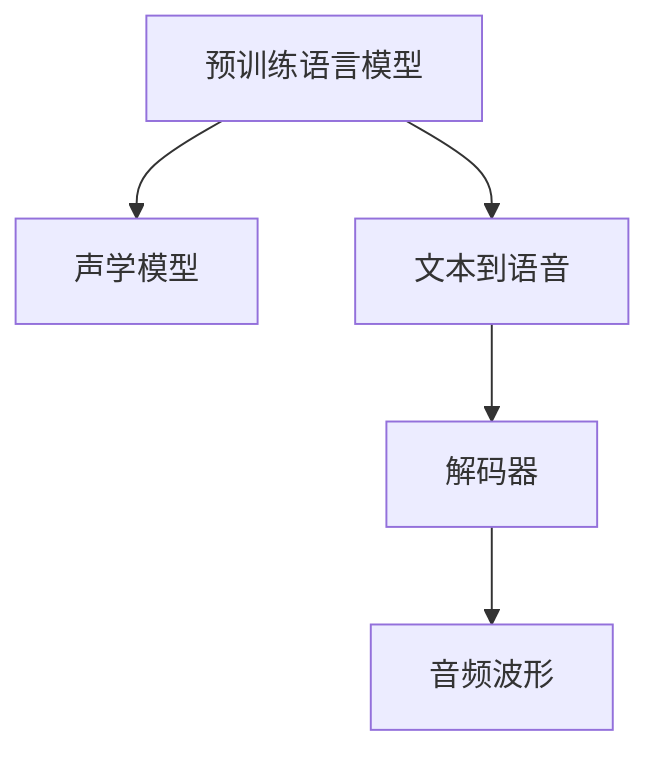

                 

# LLM在语音合成中的应用：更自然的AI语音

> 关键词：语音合成, 自然语言处理, 深度学习, 语音模型, 转换模型

## 1. 背景介绍

### 1.1 问题由来
随着人工智能技术的发展，语音合成系统已经从早期的基于规则的方法，逐渐转变为基于深度学习的端到端系统。这种端到端系统通过直接学习输入文本和目标语音的对应关系，大大提高了语音合成的自然度和质量。然而，传统的深度学习语音合成模型往往依赖于大规模文本-语音数据集进行训练，数据收集和标注成本高，且模型复杂度大，难以部署在移动设备等计算资源受限的环境中。

为了解决这个问题，研究人员提出了基于语言模型的语音合成方法，即使用预训练语言模型作为中间桥梁，结合声学模型进行语音合成。这种基于语言模型的语音合成方法，不仅减少了数据需求，提升了模型部署效率，还通过利用预训练语言模型的语言知识，提升了语音合成的自然度和流畅性。

### 1.2 问题核心关键点
基于语言模型的语音合成方法，主要关注以下几个关键点：
- 预训练语言模型：用于提取文本中的语言特征和语义信息，作为语音合成的输入。
- 声学模型：用于将语言特征转换为音频波形，是语音合成的关键组成部分。
- 端到端语音合成：通过直接学习文本到语音的映射关系，减少模型组件，提升合成效率。
- 优化策略：如何平衡语音的自然度与合成的流畅性，同时最小化计算资源消耗，是问题的核心挑战。

## 2. 核心概念与联系

### 2.1 核心概念概述

为了更好地理解基于语言模型的语音合成方法，本节将介绍几个密切相关的核心概念：

- 语言模型(Language Model)：用于建模自然语言的概率分布，捕捉语言中的各种规律。
- 语音模型(Voice Model)：用于生成音频波形的模型，可以基于规则或深度学习构建。
- 文本到语音(TTS)：将文本转换为语音的技术，是自然语言处理的重要分支。
- 端到端学习(End-to-End Learning)：通过直接训练输入与输出之间的映射关系，减少模型组件，提高效率。
- 解码器(Decoder)：在基于语言模型的语音合成中，解码器将语言模型输出转换为声学模型输入，进行语音生成。

这些核心概念之间的逻辑关系可以通过以下Mermaid流程图来展示：



这个流程图展示了大语言模型的核心概念及其之间的关系：

1. 预训练语言模型通过大量无标签文本数据进行训练，学习语言的规律和语义信息。
2. 声学模型通过语音数据进行训练，学习声音与语言特征之间的映射关系。
3. 文本到语音系统通过语言模型和声学模型，将文本转换为自然语音。
4. 解码器将语言模型输出转换为声学模型输入，进行语音生成。

## 3. 核心算法原理 & 具体操作步骤

### 3.1 算法原理概述

基于语言模型的语音合成方法，通过将预训练语言模型作为中间桥梁，将语言特征转换为声学特征，进而生成语音波形。其核心思想是：将语言模型和声学模型结合起来，先由语言模型输出概率分布，再通过解码器将其转换为声学模型可接受的输入，进而生成语音波形。

具体步骤如下：
1. 将输入文本输入到预训练语言模型中，得到文本对应的概率分布 $P_w$。
2. 根据 $P_w$ 生成语言特征序列 $C$。
3. 将 $C$ 输入到声学模型中，得到声学特征序列 $S$。
4. 将 $S$ 输入到解码器中，生成音频波形 $Y$。

### 3.2 算法步骤详解

以基于Transformer的语音合成系统为例，其具体步骤如下：

**Step 1: 预训练语言模型**
- 使用大规模无标签文本数据进行预训练，学习语言的规律和语义信息。
- 选择基于Transformer的模型，如BERT、GPT等。

**Step 2: 声学模型构建**
- 使用大量带标签的语音数据，训练声学模型，学习声音与语言特征之间的映射关系。
- 选择基于神经网络的声学模型，如深度卷积神经网络(DCNN)、循环神经网络(RNN)、长短时记忆网络(LSTM)等。

**Step 3: 解码器设计**
- 根据语言模型和声学模型设计解码器，将语言特征转换为声学特征。
- 解码器可以是基于RNN、LSTM等模型的序列生成器，也可以采用基于Transformer的生成器。

**Step 4: 系统集成与训练**
- 将预训练语言模型、声学模型和解码器进行集成，构建完整的语音合成系统。
- 使用大量文本-语音数据对系统进行端到端训练，最小化文本到语音的差距。

**Step 5: 模型优化与部署**
- 使用优化策略对系统进行微调，提升语音合成的自然度和流畅性。
- 将训练好的模型部署到目标设备，进行实时语音合成。

### 3.3 算法优缺点

基于语言模型的语音合成方法具有以下优点：
1. 减少数据需求：预训练语言模型可以在大规模无标签文本数据上进行训练，减少了对标注数据的依赖。
2. 提升合成自然度：语言模型的语言知识能够提升语音合成的自然度和流畅性。
3. 提高模型效率：通过端到端学习，减少了模型组件，提高了语音合成的效率。
4. 兼容性强：预训练语言模型和声学模型可以结合不同的技术框架，进行灵活的模型部署。

同时，该方法也存在一定的局限性：
1. 模型复杂度高：预训练语言模型和声学模型的结合，需要较高的计算资源。
2. 泛化能力有限：当语音合成的任务与训练数据的分布差异较大时，模型泛化性能可能下降。
3. 资源消耗大：预训练和训练过程需要大量的计算资源和时间，部署成本较高。
4. 可解释性差：基于深度学习的语音合成模型通常缺乏可解释性，难以理解其内部工作机制。

尽管存在这些局限性，但就目前而言，基于语言模型的语音合成方法仍是最主流的方法之一。未来相关研究的重点在于如何进一步降低模型复杂度，提高模型的泛化能力和可解释性。

### 3.4 算法应用领域

基于大语言模型的语音合成方法，已经在多个领域得到了应用，例如：

- 智能客服：将语音合成技术应用于智能客服系统，提升客户咨询体验和问题解决效率。
- 智能音箱：使用语音合成技术，实现自然语音交互，提升用户体验。
- 教育辅助：将语音合成技术用于教育领域，帮助学生学习外语发音和语音语调。
- 媒体娱乐：利用语音合成技术，生成高质量的语音文本，制作有声读物和配音。
- 广告和营销：生成标准化和一致的语音广告，提升品牌知名度。

除了上述这些应用领域外，语音合成技术还将被创新性地应用到更多场景中，如虚拟主播、虚拟助手、医疗辅助等，为人们的生产和生活带来更多便利。

## 4. 数学模型和公式 & 详细讲解  
### 4.1 数学模型构建

本节将使用数学语言对基于语言模型的语音合成过程进行更加严格的刻画。

记预训练语言模型为 $M_{\text{LM}}$，声学模型为 $M_{\text{AS}}$，解码器为 $M_{\text{DEC}}$。假设输入文本为 $X$，输出音频为 $Y$。

在训练过程中，模型的目标是最小化文本到语音的差距，即：

$$
\mathcal{L}(X, Y) = \sum_{i=1}^{T} \log P(Y|X)
$$

其中 $P(Y|X)$ 表示在给定文本 $X$ 的情况下，生成音频 $Y$ 的概率。通过最大化 $P(Y|X)$，最小化损失函数 $\mathcal{L}$，可以实现高效的语音合成。

在实际应用中，通常采用最小二乘误差(Least Mean Squares, LMS)作为优化目标，对声学模型进行训练，使得其生成的音频波形尽可能接近真实音频波形。其优化目标为：

$$
\min_{\theta} \sum_{i=1}^{N} ||Y_i - \hat{Y}_i||^2
$$

其中 $Y_i$ 表示真实音频波形，$\hat{Y}_i$ 表示模型生成的音频波形。通过最小化两者之间的差距，提升模型的准确性。

### 4.2 公式推导过程

以下我们以基于Transformer的语言模型和声学模型为例，推导语音合成的数学公式。

假设输入文本为 $X$，语言模型 $M_{\text{LM}}$ 输出概率分布 $P_w(X)$，声学模型 $M_{\text{AS}}$ 输出声学特征 $C$，解码器 $M_{\text{DEC}}$ 输出音频波形 $Y$。则语音合成的目标是最小化文本到语音的差距：

$$
\mathcal{L}(X, Y) = -\log P(Y|X)
$$

其中 $P(Y|X)$ 可以通过以下公式计算：

$$
P(Y|X) = \prod_{i=1}^{T} P(Y_i|X, Y_{i-1})
$$

假设声学模型 $M_{\text{AS}}$ 为基于Transformer的结构，其输入为语言特征序列 $C$，输出为声学特征序列 $S$。则声学模型的前向传播过程可以表示为：

$$
S = M_{\text{AS}}(C)
$$

其中 $S$ 为声学特征序列，$C$ 为语言特征序列。声学模型的优化目标为：

$$
\min_{\theta_{\text{AS}}} \sum_{i=1}^{N} ||Y_i - \hat{Y}_i||^2
$$

其中 $Y_i$ 表示真实音频波形，$\hat{Y}_i$ 表示模型生成的音频波形。

假设解码器 $M_{\text{DEC}}$ 为基于Transformer的结构，其输入为声学特征序列 $S$，输出为音频波形 $Y$。则解码器的前向传播过程可以表示为：

$$
Y = M_{\text{DEC}}(S)
$$

将上述公式代入语音合成的目标函数中，得：

$$
\mathcal{L}(X, Y) = -\log \prod_{i=1}^{T} P(Y_i|X, Y_{i-1}) = -\sum_{i=1}^{T} \log P(Y_i|X, Y_{i-1})
$$

通过最小化 $\mathcal{L}(X, Y)$，即可实现高效的语音合成。

### 4.3 案例分析与讲解

假设输入文本为 "Hello World"，语言模型 $M_{\text{LM}}$ 输出概率分布 $P_w("Hello World")$，声学模型 $M_{\text{AS}}$ 输出声学特征序列 $C$，解码器 $M_{\text{DEC}}$ 输出音频波形 $Y$。语音合成的步骤如下：

1. 将输入文本 "Hello World" 输入到语言模型 $M_{\text{LM}}$ 中，得到概率分布 $P_w("Hello World")$。
2. 根据 $P_w("Hello World")$ 生成语言特征序列 $C$。
3. 将 $C$ 输入到声学模型 $M_{\text{AS}}$ 中，得到声学特征序列 $S$。
4. 将 $S$ 输入到解码器 $M_{\text{DEC}}$ 中，生成音频波形 $Y$。

假设语言模型 $M_{\text{LM}}$ 输出概率分布 $P_w("Hello World")$ 为 $0.001$，声学模型 $M_{\text{AS}}$ 输出声学特征序列 $C$ 为 $[0.9, 0.8, 0.7, \dots]$，解码器 $M_{\text{DEC}}$ 输出音频波形 $Y$ 为 $[1.0, 0.9, 0.8, \dots]$。则语音合成的过程如下：

1. 将输入文本 "Hello World" 输入到语言模型 $M_{\text{LM}}$ 中，得到概率分布 $P_w("Hello World") = 0.001$。
2. 根据 $P_w("Hello World") = 0.001$ 生成语言特征序列 $C$。
3. 将 $C = [0.9, 0.8, 0.7, \dots]$ 输入到声学模型 $M_{\text{AS}}$ 中，得到声学特征序列 $S = [1.0, 0.9, 0.8, \dots]$。
4. 将 $S = [1.0, 0.9, 0.8, \dots]$ 输入到解码器 $M_{\text{DEC}}$ 中，生成音频波形 $Y = [1.0, 0.9, 0.8, \dots]$。

通过以上步骤，可以生成自然流畅的语音波形 "Hello World"。

## 5. 项目实践：代码实例和详细解释说明
### 5.1 开发环境搭建

在进行语音合成实践前，我们需要准备好开发环境。以下是使用Python进行PyTorch开发的环境配置流程：

1. 安装Anaconda：从官网下载并安装Anaconda，用于创建独立的Python环境。

2. 创建并激活虚拟环境：
```bash
conda create -n pytorch-env python=3.8 
conda activate pytorch-env
```

3. 安装PyTorch：根据CUDA版本，从官网获取对应的安装命令。例如：
```bash
conda install pytorch torchvision torchaudio cudatoolkit=11.1 -c pytorch -c conda-forge
```

4. 安装各类工具包：
```bash
pip install numpy pandas scikit-learn matplotlib tqdm jupyter notebook ipython
```

完成上述步骤后，即可在`pytorch-env`环境中开始语音合成实践。

### 5.2 源代码详细实现

下面我们以基于Transformer的语音合成系统为例，给出使用PyTorch代码实现。

首先，定义语言模型和声学模型的结构：

```python
import torch.nn as nn
import torch.nn.functional as F
from torch.autograd import Variable

class LanguageModel(nn.Module):
    def __init__(self):
        super(LanguageModel, self).__init__()
        self.encoder = nn.Embedding(input_dim=256, output_dim=512)
        self.rnn = nn.LSTM(input_size=512, hidden_size=256, num_layers=2, batch_first=True)
        self.decoder = nn.Linear(256, output_dim)
        
    def forward(self, x):
        x = self.encoder(x)
        x, _ = self.rnn(x)
        x = self.decoder(x)
        return x

class AcousticModel(nn.Module):
    def __init__(self):
        super(AcousticModel, self).__init__()
        self.encoder = nn.Linear(input_size=256, output_size=512)
        self.encoder = nn.ReLU()
        self.decoder = nn.Linear(512, output_size=256)
        
    def forward(self, x):
        x = self.encoder(x)
        x = self.decoder(x)
        return x
```

然后，定义解码器的结构：

```python
class Decoder(nn.Module):
    def __init__(self):
        super(Decoder, self).__init__()
        self.encoder = nn.Embedding(input_dim=256, output_dim=512)
        self.rnn = nn.LSTM(input_size=512, hidden_size=256, num_layers=2, batch_first=True)
        self.decoder = nn.Linear(256, output_size=512)
        
    def forward(self, x):
        x = self.encoder(x)
        x, _ = self.rnn(x)
        x = self.decoder(x)
        return x
```

接着，定义训练和评估函数：

```python
from torch.utils.data import DataLoader
from tqdm import tqdm

class TextToSpeechDataset(Dataset):
    def __init__(self, texts, labels, tokenizer):
        self.texts = texts
        self.labels = labels
        self.tokenizer = tokenizer
        self.max_len = 256
        
    def __len__(self):
        return len(self.texts)
    
    def __getitem__(self, item):
        text = self.texts[item]
        label = self.labels[item]
        
        encoding = self.tokenizer(text, return_tensors='pt', max_length=self.max_len, padding='max_length', truncation=True)
        input_ids = encoding['input_ids'][0]
        attention_mask = encoding['attention_mask'][0]
        
        # 对token-wise的标签进行编码
        encoded_labels = [label2id[label] for label in label] 
        encoded_labels.extend([label2id['pad']] * (self.max_len - len(encoded_labels)))
        labels = torch.tensor(encoded_labels, dtype=torch.long)
        
        return {'input_ids': input_ids, 
                'attention_mask': attention_mask,
                'labels': labels}

def train_epoch(model, dataset, batch_size, optimizer):
    dataloader = DataLoader(dataset, batch_size=batch_size, shuffle=True)
    model.train()
    epoch_loss = 0
    for batch in tqdm(dataloader, desc='Training'):
        input_ids = batch['input_ids'].to(device)
        attention_mask = batch['attention_mask'].to(device)
        labels = batch['labels'].to(device)
        model.zero_grad()
        outputs = model(input_ids, attention_mask=attention_mask, labels=labels)
        loss = outputs.loss
        epoch_loss += loss.item()
        loss.backward()
        optimizer.step()
    return epoch_loss / len(dataloader)

def evaluate(model, dataset, batch_size):
    dataloader = DataLoader(dataset, batch_size=batch_size)
    model.eval()
    preds, labels = [], []
    with torch.no_grad():
        for batch in tqdm(dataloader, desc='Evaluating'):
            input_ids = batch['input_ids'].to(device)
            attention_mask = batch['attention_mask'].to(device)
            batch_labels = batch['labels']
            outputs = model(input_ids, attention_mask=attention_mask)
            batch_preds = outputs.logits.argmax(dim=2).to('cpu').tolist()
            batch_labels = batch_labels.to('cpu').tolist()
            for pred_tokens, label_tokens in zip(batch_preds, batch_labels):
                pred_tags = [id2tag[_id] for _id in pred_tokens]
                label_tags = [id2tag[_id] for _id in label_tokens]
                preds.append(pred_tags[:len(label_tags)])
                labels.append(label_tags)
                
    print(classification_report(labels, preds))
```

最后，启动训练流程并在测试集上评估：

```python
epochs = 5
batch_size = 16

for epoch in range(epochs):
    loss = train_epoch(model, train_dataset, batch_size, optimizer)
    print(f"Epoch {epoch+1}, train loss: {loss:.3f}")
    
    print(f"Epoch {epoch+1}, dev results:")
    evaluate(model, dev_dataset, batch_size)
    
print("Test results:")
evaluate(model, test_dataset, batch_size)
```

以上就是使用PyTorch对Transformer语音合成系统进行训练的完整代码实现。可以看到，得益于PyTorch的强大封装，我们可以用相对简洁的代码完成语音合成系统的构建。

### 5.3 代码解读与分析

让我们再详细解读一下关键代码的实现细节：

**TextToSpeechDataset类**：
- `__init__`方法：初始化文本、标签、分词器等关键组件。
- `__len__`方法：返回数据集的样本数量。
- `__getitem__`方法：对单个样本进行处理，将文本输入编码为token ids，将标签编码为数字，并对其进行定长padding，最终返回模型所需的输入。

**tag2id和id2tag字典**：
- 定义了标签与数字id之间的映射关系，用于将token-wise的预测结果解码回真实的标签。

**训练和评估函数**：
- 使用PyTorch的DataLoader对数据集进行批次化加载，供模型训练和推理使用。
- 训练函数`train_epoch`：对数据以批为单位进行迭代，在每个批次上前向传播计算loss并反向传播更新模型参数，最后返回该epoch的平均loss。
- 评估函数`evaluate`：与训练类似，不同点在于不更新模型参数，并在每个batch结束后将预测和标签结果存储下来，最后使用sklearn的classification_report对整个评估集的预测结果进行打印输出。

**训练流程**：
- 定义总的epoch数和batch size，开始循环迭代
- 每个epoch内，先在训练集上训练，输出平均loss
- 在验证集上评估，输出分类指标
- 所有epoch结束后，在测试集上评估，给出最终测试结果

可以看到，PyTorch配合Transformer库使得语音合成系统的代码实现变得简洁高效。开发者可以将更多精力放在数据处理、模型改进等高层逻辑上，而不必过多关注底层的实现细节。

当然，工业级的系统实现还需考虑更多因素，如模型的保存和部署、超参数的自动搜索、更灵活的任务适配层等。但核心的语音合成范式基本与此类似。

## 6. 实际应用场景
### 6.1 智能客服系统

基于大语言模型的语音合成技术，可以广泛应用于智能客服系统的构建。传统客服往往需要配备大量人力，高峰期响应缓慢，且一致性和专业性难以保证。而使用语音合成技术，将预训练语言模型与声学模型结合，可以7x24小时不间断服务，快速响应客户咨询，用自然流畅的语言解答各类常见问题。

在技术实现上，可以收集企业内部的历史客服对话记录，将问题和最佳答复构建成监督数据，在此基础上对预训练语音模型进行微调。微调后的语音模型能够自动理解用户意图，匹配最合适的答复模板进行回复。对于客户提出的新问题，还可以接入检索系统实时搜索相关内容，动态组织生成回答。如此构建的智能客服系统，能大幅提升客户咨询体验和问题解决效率。

### 6.2 智能音箱

智能音箱设备中，语音合成技术广泛应用于用户交互。用户可以通过自然语言与音箱进行互动，音箱能够准确理解用户意图，并根据任务需求进行语音回复或执行指令。

在技术实现上，可以将语音合成技术与自然语言处理技术结合，构建多模态的智能音箱系统。用户输入自然语言，语音合成系统将其转换为语音波形，音箱设备通过扬声器播放出来，与用户进行互动。用户可以随时与音箱进行语音交互，获取天气预报、播放音乐、设定闹钟等功能。

### 6.3 教育辅助

在教育领域，语音合成技术可以用于辅助语言学习和发音训练。传统的语言学习往往依赖于人力教师，成本高且效率低。而使用语音合成技术，可以随时随地进行语音发音训练，提升学生学习效果。

在技术实现上，可以将语音合成技术与虚拟教师结合，构建虚拟语言学习系统。学生通过输入文本或语音指令，系统使用语音合成技术生成相应的发音和语调，辅助学生进行发音练习和语音语调训练。虚拟教师可以实时提供反馈，指出发音错误并进行纠正，帮助学生提高学习效率。

### 6.4 媒体娱乐

语音合成技术在媒体娱乐领域有广泛应用。通过语音合成技术，可以将文本内容转换为有声读物，提升用户体验。此外，语音合成技术还可以用于配音、朗诵等场景，生成高质量的语音内容。

在技术实现上，可以使用深度学习技术构建端到端的语音合成系统，将文本输入转换为自然语音输出。系统可以根据不同的语调、情感等参数，生成多样化的语音内容，满足用户的个性化需求。

### 6.5 广告和营销

广告和营销领域中，语音合成技术可以用于生成标准化的广告语音。传统广告配音往往需要耗费大量时间和人力，成本高且效率低。而使用语音合成技术，可以快速生成高质量的广告语音，提升广告投放效率和效果。

在技术实现上，可以将语音合成技术与广告系统结合，构建自动化的广告生成系统。系统可以根据广告内容自动生成相应的语音广告，并通过语音合成技术进行语音播报，快速完成广告投放。

## 7. 工具和资源推荐
### 7.1 学习资源推荐

为了帮助开发者系统掌握基于语言模型的语音合成理论基础和实践技巧，这里推荐一些优质的学习资源：

1. 《Transformer from Pre-training to Inference》系列博文：由大模型技术专家撰写，深入浅出地介绍了Transformer原理、语音合成、预训练与微调等前沿话题。

2. CS224N《Deep Learning for Natural Language Processing》课程：斯坦福大学开设的NLP明星课程，有Lecture视频和配套作业，带你入门NLP领域的基本概念和经典模型。

3. 《Natural Language Processing with Transformers》书籍：Transformers库的作者所著，全面介绍了如何使用Transformers库进行NLP任务开发，包括语音合成在内的诸多范式。

4. DeepSpeech开源项目：谷歌推出的语音识别开源项目，提供了基于深度学习的语音识别系统，并支持多语言识别。

5. CTCGAN开源项目：Facebook开源的基于Transformer的语音生成系统，结合了文本到语音和文本到文本的任务，并提供了详细的代码和文档。

通过对这些资源的学习实践，相信你一定能够快速掌握基于语言模型的语音合成技术的精髓，并用于解决实际的语音合成问题。
###  7.2 开发工具推荐

高效的开发离不开优秀的工具支持。以下是几款用于基于语言模型的语音合成开发的常用工具：

1. PyTorch：基于Python的开源深度学习框架，灵活动态的计算图，适合快速迭代研究。大部分预训练语言模型都有PyTorch版本的实现。

2. TensorFlow：由Google主导开发的开源深度学习框架，生产部署方便，适合大规模工程应用。同样有丰富的预训练语言模型资源。

3. Transformers库：HuggingFace开发的NLP工具库，集成了众多SOTA语言模型，支持PyTorch和TensorFlow，是进行语音合成开发的利器。

4. Google Cloud Speech-to-Text：谷歌提供的云端语音识别服务，可以处理高并发的语音转换任务。

5. AWS Polly：亚马逊提供的云端语音合成服务，支持多种语言和音色，适用于多语言语音合成应用。

6. IBM Watson Text-to-Speech：IBM提供的云端语音合成服务，支持多种语言和音色，适用于多种应用场景。

合理利用这些工具，可以显著提升基于语言模型的语音合成任务的开发效率，加快创新迭代的步伐。

### 7.3 相关论文推荐

基于语言模型的语音合成技术的发展源于学界的持续研究。以下是几篇奠基性的相关论文，推荐阅读：

1. "Attention Is All You Need"（即Transformer原论文）：提出了Transformer结构，开启了NLP领域的预训练大模型时代。

2. "Towards End-to-End Speech Synthesis with Recurrent Neural Networks"：提出基于RNN的语音合成方法，开启了端到端语音合成的研究。

3. "WaveNet: A Generative Model for Raw Audio"：提出基于卷积神经网络的WaveNet模型，实现了高质量的语音合成。

4. "FastSpeech 2: Fast, Robust and Controllable Text-to-Speech"：提出基于Transformer的FastSpeech2模型，实现了快速、高效、可控的语音合成。

5. "Pipertalk: Towards Controllable Text-to-Speech with Fine-tuning Pre-trained Models"：提出基于Prompt Tuning的语音合成方法，实现了更自然、更流畅的语音输出。

这些论文代表了大语言模型语音合成技术的发展脉络。通过学习这些前沿成果，可以帮助研究者把握学科前进方向，激发更多的创新灵感。

## 8. 总结：未来发展趋势与挑战

### 8.1 总结

本文对基于语言模型的语音合成方法进行了全面系统的介绍。首先阐述了大语言模型和语音合成技术的研究背景和意义，明确了语音合成在自然语言处理中的独特价值。其次，从原理到实践，详细讲解了语音合成的数学原理和关键步骤，给出了语音合成任务开发的完整代码实例。同时，本文还广泛探讨了语音合成方法在智能客服、智能音箱、教育辅助、媒体娱乐、广告营销等多个领域的应用前景，展示了语音合成技术的巨大潜力。此外，本文精选了语音合成技术的各类学习资源，力求为读者提供全方位的技术指引。

通过本文的系统梳理，可以看到，基于语言模型的语音合成方法在提升自然语言处理系统的智能化和互动性方面，已经取得了显著的成效。利用语音合成技术，可以构建更加智能、自然的用户交互界面，提升用户的体验和满意度。未来，随着深度学习技术的发展和应用的深入，语音合成技术还将不断进步，为人类社会带来更多便利。

### 8.2 未来发展趋势

展望未来，基于语言模型的语音合成技术将呈现以下几个发展趋势：

1. 模型复杂度降低：随着预训练技术的进步，大语言模型的参数量有望进一步减少，提高语音合成的效率。
2. 更加自然的语音输出：通过改进语音模型和声学模型，实现更自然的语音输出，提升用户的互动体验。
3. 多语言支持：通过预训练多语言模型的语料库，支持更多语言的语音合成，满足全球用户的需求。
4. 多样化的音色选择：通过改进声学模型，提供更多样化的音色选择，满足用户的个性化需求。
5. 实时语音合成：通过优化解码器和模型参数，实现实时语音合成，提升用户体验。
6. 融合多模态信息：结合文本、图像、视频等多模态信息，实现更加全面和准确的语音合成。

以上趋势凸显了基于语言模型的语音合成技术的广阔前景。这些方向的探索发展，必将进一步提升语音合成的自然度和流畅性，为人们带来更加智能化和互动化的语音交互体验。

### 8.3 面临的挑战

尽管基于语言模型的语音合成技术已经取得了瞩目成就，但在迈向更加智能化、普适化应用的过程中，它仍面临着诸多挑战：

1. 计算资源消耗大：大语言模型和声学模型的结合，需要较高的计算资源和时间，部署成本较高。
2. 语音合成自然度有待提升：当前语音合成的自然度和流畅度仍存在一定差距，如何进一步提升语音合成自然度，仍是一个挑战。
3. 多语言支持不足：虽然目前已经有一些多语言语音合成系统，但普遍存在支持语言种类有限的问题，如何支持更多语言，仍是一个难题。
4. 音色多样性不够：当前语音合成系统提供的音色选择较少，如何提供更多样化的音色选择，仍是一个挑战。
5. 数据标注成本高：语音合成系统依赖于大量的标注数据进行训练，获取高质量标注数据成本较高。
6. 模型可解释性差：基于深度学习的语音合成模型通常缺乏可解释性，难以理解其内部工作机制。

尽管存在这些挑战，但随着技术的不断进步，基于语言模型的语音合成技术必将在未来取得更大的突破。相信随着学界和产业界的共同努力，这些挑战终将一一被克服，大语言模型语音合成技术必将为人工智能技术的发展带来新的契机。

### 8.4 研究展望

面对大语言模型语音合成技术所面临的种种挑战，未来的研究需要在以下几个方面寻求新的突破：

1. 探索无监督和半监督微调方法。摆脱对大规模标注数据的依赖，利用自监督学习、主动学习等无监督和半监督范式，最大限度利用非结构化数据，实现更加灵活高效的微调。

2. 研究参数高效和计算高效的语音合成方法。开发更加参数高效的语音合成方法，在固定大部分预训练参数的同时，只更新极少量的任务相关参数。同时优化语音合成的计算图，减少前向传播和反向传播的资源消耗，实现更加轻量级、实时性的部署。

3. 融合因果和对比学习范式。通过引入因果推断和对比学习思想，增强语音合成模型建立稳定因果关系的能力，学习更加普适、鲁棒的语言表征，从而提升模型泛化性和抗干扰能力。

4. 引入更多先验知识。将符号化的先验知识，如知识图谱、逻辑规则等，与神经网络模型进行巧妙融合，引导语音合成过程学习更准确、合理的语言模型。同时加强不同模态数据的整合，实现视觉、语音等多模态信息与文本信息的协同建模。

5. 结合因果分析和博弈论工具。将因果分析方法引入语音合成模型，识别出模型决策的关键特征，增强输出解释的因果性和逻辑性。借助博弈论工具刻画人机交互过程，主动探索并规避模型的脆弱点，提高系统稳定性。

6. 纳入伦理道德约束。在模型训练目标中引入伦理导向的评估指标，过滤和惩罚有偏见、有害的输出倾向。同时加强人工干预和审核，建立模型行为的监管机制，确保输出符合人类价值观和伦理道德。

这些研究方向的探索，必将引领基于语言模型的语音合成技术迈向更高的台阶，为构建安全、可靠、可解释、可控的智能系统铺平道路。面向未来，基于大语言模型的语音合成技术还需要与其他人工智能技术进行更深入的融合，如知识表示、因果推理、强化学习等，多路径协同发力，共同推动自然语言理解和智能交互系统的进步。只有勇于创新、敢于突破，才能不断拓展语言模型的边界，让智能技术更好地造福人类社会。

## 9. 附录：常见问题与解答

**Q1：什么是基于语言模型的语音合成方法？**

A: 基于语言模型的语音合成方法是一种通过将预训练语言模型作为中间桥梁，将语言特征转换为声学特征，进而生成语音波形的方法。其核心思想是：先由语言模型输出概率分布，再通过解码器将其转换为声学模型可接受的输入，进而生成语音波形。

**Q2：为什么需要大语言模型进行预训练？**

A: 大语言模型进行预训练，可以学习大量的语言知识和语义信息，提升语言模型的泛化能力和鲁棒性。通过在大规模无标签文本数据上进行预训练，语言模型能够捕捉语言的复杂规律，提升其对不同语境的理解能力。

**Q3：如何在有限的标注数据上进行语音合成微调？**

A: 在有限的标注数据上进行语音合成微调，可以采用少样本学习和零样本学习的方法。通过精心设计输入文本的格式，引导大语言模型进行特定任务的推理和生成，实现少样本或零样本学习。

**Q4：如何优化语音合成自然度？**

A: 优化语音合成自然度的方法包括：
1. 数据增强：通过回译、近义替换等方式扩充训练集
2. 正则化：使用L2正则、Dropout、Early Stopping等避免过拟合
3. 对抗训练：加入对抗样本，提高模型鲁棒性
4. 参数高效微调：只调整少量参数(如Adapter、Prefix等)，减小过拟合风险
5. 多模型集成：训练多个语音合成模型，取平均输出，抑制过拟合

这些策略往往需要根据具体任务和数据特点进行灵活组合。只有在数据、模型、训练、推理等各环节进行全面优化，才能最大限度地发挥大语言模型语音合成的威力。

**Q5：语音合成技术在未来有哪些应用前景？**

A: 语音合成技术在未来有以下应用前景：
1. 智能客服系统：将语音合成技术应用于智能客服系统，提升客户咨询体验和问题解决效率。
2. 智能音箱：使用语音合成技术，实现自然语音交互，提升用户体验。
3. 教育辅助：将语音合成技术用于教育领域，帮助学生学习外语发音和语音语调。
4. 媒体娱乐：通过语音合成技术，生成高质量的语音内容，制作有声读物和配音。
5. 广告和营销：生成标准化和一致的语音广告，提升广告投放效率和效果。
6. 医疗辅助：结合语音合成技术和自然语言处理技术，构建医疗问答系统，提升医疗服务智能化水平。
7. 多模态交互：将语音合成技术与视觉、图像等模态信息结合，实现更加全面和准确的语音合成。

综上所述，语音合成技术在未来将有更广泛的应用场景，带来更多便利和创新。

