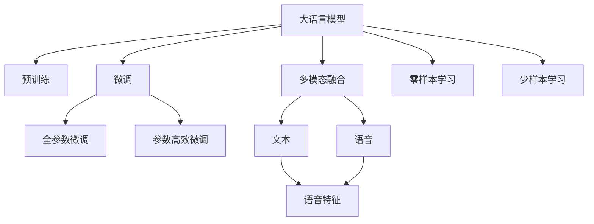

                 

# LLM在语音情感识别中的突破：理解说话者情绪

## 1. 背景介绍

### 1.1 问题由来
随着语音技术的不断进步，情感识别作为语音应用的重要分支，近年来在娱乐、教育、心理咨询等领域得到了广泛的应用。情感识别系统通过分析说话者的语音特征，可以实时判断其情绪状态，从而提供个性化的服务。然而，传统的情感识别方法多依赖手工特征提取和分类器设计，不仅需要大量专家知识，而且对于不同人、不同情境下的语音情感表现，识别效果往往不尽如人意。

近年来，大语言模型（Large Language Model, LLM）在语音情感识别中取得了一些突破性进展。与传统方法相比，LLM以深度神经网络为基础，能自动学习丰富多样的语音特征，具备强大的表征能力。通过预训练-微调的方法，LLM能够在有限标注数据条件下，适应特定的语音情感识别任务，表现出更强的泛化能力和适应性。

### 1.2 问题核心关键点
大语言模型在语音情感识别中的应用，主要通过以下几个关键点：

1. **预训练**：在大规模无标注语音数据上预训练LLM，学习语音的通用表示，为后续微调奠定基础。
2. **微调**：通过下游情感识别任务的少量标注数据，有监督地优化模型，学习特定情感的识别能力。
3. **特征提取**：LLM自动学习语音信号的底层特征，不需要手工特征提取。
4. **端到端**：无需手工设计中间特征提取和分类器，LLM可以直接输出情感分类结果。
5. **多模态融合**：结合文本、语音等多模态信息，提升情感识别的准确性和鲁棒性。
6. **零样本和少样本学习**：利用大模型的自监督学习能力，在少量标注数据下也能获得良好的识别性能。

这些关键点体现了LLM在语音情感识别中的独特优势，使其在多模态、个性化、实时性方面具有更强的适应性。

## 2. 核心概念与联系

### 2.1 核心概念概述

为了更好地理解LLM在语音情感识别中的应用，本节将介绍几个核心概念：

1. **大语言模型**：以Transformer架构为基础，通过在大规模文本或语音数据上进行预训练，学习语言的通用表示。LLM在自然语言处理（NLP）和语音识别（ASR）中取得了显著的成果。
2. **预训练**：在无监督的环境下，使用大规模数据对模型进行训练，学习语言的通用知识。预训练可以提升模型的泛化能力，使其在特定任务上也能取得良好表现。
3. **微调**：在预训练的基础上，使用下游任务的数据，有监督地优化模型。微调可以显著提升模型在特定任务上的性能。
4. **语音情感识别**：通过分析说话者的语音特征，识别其情绪状态。语音情感识别应用广泛，包括心理咨询、娱乐、教育等。
5. **多模态融合**：结合文本、语音等多模态信息，提升情感识别的准确性和鲁棒性。多模态融合是提升情感识别系统性能的重要手段。
6. **零样本和少样本学习**：利用大模型的自监督学习能力，在少量标注数据下也能获得良好的识别性能。

这些概念之间的逻辑关系可以通过以下Mermaid流程图来展示：



这个流程图展示了大语言模型在语音情感识别中的核心概念及其之间的联系：

1. 大语言模型通过预训练获得语言通用知识。
2. 微调使模型适应特定情感识别任务，提升识别性能。
3. 多模态融合将文本、语音信息结合，提升识别鲁棒性。
4. 零样本和少样本学习利用自监督能力，降低标注数据需求。

这些概念共同构成了LLM在语音情感识别中的基础框架，使其能够在各种情感识别任务中发挥强大的作用。

## 3. 核心算法原理 & 具体操作步骤

### 3.1 算法原理概述

LLM在语音情感识别中的应用，主要基于监督学习范式。其核心思想是：使用预训练的大语言模型，通过有监督的微调学习特定情感的识别能力。具体而言，步骤如下：

1. **准备数据集**：收集情感识别任务的标注数据集，分为训练集、验证集和测试集。
2. **选择预训练模型**：选择合适的预训练模型（如Bert、GPT等）作为初始化参数。
3. **设计任务适配层**：根据情感识别任务，在预训练模型的基础上添加适当的输出层和损失函数。
4. **设置微调参数**：选择合适的优化算法及其参数，如AdamW、SGD等，设置学习率、批大小、迭代轮数等。
5. **执行梯度训练**：将训练集数据分批次输入模型，前向传播计算损失函数，反向传播计算参数梯度，更新模型参数。
6. **验证集评估**：周期性在验证集上评估模型性能，根据性能指标决定是否触发Early Stopping。
7. **测试集测试**：在测试集上评估微调后的模型性能，对比微调前后的精度提升。

### 3.2 算法步骤详解

以语音情感识别任务为例，详细讲解微调过程：

**Step 1: 准备数据集**
- 收集情感识别任务的标注数据集，分为训练集、验证集和测试集。
- 每个样本包含语音信号和情感标签。语音信号通常以MFCC（Mel频率倒谱系数）或时频图像的形式表示。
- 情感标签通常为二分类或多分类标签，如快乐、悲伤、愤怒等。

**Step 2: 选择预训练模型**
- 选择适合语音情感识别任务的预训练模型，如BERT、GPT等。
- 对预训练模型进行微调，适应情感识别任务。

**Step 3: 设计任务适配层**
- 根据情感识别任务，在预训练模型的基础上添加适当的输出层和损失函数。
- 对于二分类任务，通常使用softmax层和交叉熵损失函数。
- 对于多分类任务，使用softmax层和交叉熵损失函数。

**Step 4: 设置微调参数**
- 选择合适的优化算法及其参数，如AdamW、SGD等，设置学习率、批大小、迭代轮数等。
- 设置正则化技术及强度，包括权重衰减、Dropout、Early Stopping等。
- 确定冻结预训练参数的策略，如仅微调顶层，或全部参数都参与微调。

**Step 5: 执行梯度训练**
- 将训练集数据分批次输入模型，前向传播计算损失函数。
- 反向传播计算参数梯度，根据设定的优化算法和学习率更新模型参数。
- 周期性在验证集上评估模型性能，根据性能指标决定是否触发Early Stopping。
- 重复上述步骤直到满足预设的迭代轮数或Early Stopping条件。

**Step 6: 验证集评估**
- 在验证集上评估模型性能，记录准确率、召回率、F1分数等指标。
- 根据评估结果调整模型参数，如学习率、正则化强度等。

**Step 7: 测试集测试**
- 在测试集上评估微调后的模型性能，对比微调前后的精度提升。
- 输出测试集上的情感识别结果，进行分析评估。

### 3.3 算法优缺点

LLM在语音情感识别中的微调方法具有以下优点：

1. **高效性**：相较于手工特征提取和分类器设计，LLM能够自动学习语音特征，且不需要大量标注数据。
2. **泛化能力**：LLM通过预训练学习通用的语音知识，使其具备较强的泛化能力，能够在不同情境下保持稳定性能。
3. **灵活性**：LLM可以通过微调适应特定的情感识别任务，无需修改模型结构。
4. **端到端**：LLM直接输出情感分类结果，无需中间特征提取和分类器，简化了系统设计。

同时，该方法也存在一定的局限性：

1. **依赖标注数据**：微调需要一定量的标注数据，标注成本较高。
2. **模型复杂度**：预训练模型和微调模型参数量大，对计算资源要求较高。
3. **过拟合风险**：在标注数据较少的情况下，可能出现过拟合现象，导致泛化能力下降。
4. **推理速度慢**：大模型推理速度较慢，影响系统实时性。

尽管存在这些局限性，LLM在语音情感识别中的应用仍展现出巨大的潜力，未来还需针对以上问题进一步优化和改进。

### 3.4 算法应用领域

LLM在语音情感识别中的应用广泛，包括但不限于以下几个领域：

1. **娱乐领域**：在K歌、视频平台等应用中，实时分析用户语音情感，提供个性化推荐和互动服务。
2. **教育领域**：在智能课堂中，实时识别学生情感，调整教学策略，提升学习效果。
3. **心理咨询**：在心理健康应用中，通过分析语音情感，提供及时的情感支持和心理疏导。
4. **企业客服**：在客服系统中，实时监测用户情感，优化服务流程，提升用户体验。
5. **医疗健康**：在健康监测中，通过分析语音情感，及时发现患者情绪异常，提供干预措施。

以上领域仅仅是LLM在语音情感识别应用的部分场景，随着技术的不断进步，未来将有更多的应用场景涌现。

## 4. 数学模型和公式 & 详细讲解  
### 4.1 数学模型构建

在语音情感识别任务中，微调的数学模型可以表示为：

假设语音信号 $x_i$ 为训练集中的第 $i$ 个样本，其对应的情感标签为 $y_i$。预训练的LLM模型为 $M_{\theta}$，其中 $\theta$ 为模型参数。

定义模型的输出为 $o_i=M_{\theta}(x_i)$，则情感识别任务的损失函数为：

$$
\mathcal{L}(\theta) = -\frac{1}{N} \sum_{i=1}^N \log p(y_i | o_i)
$$

其中 $p(y_i | o_i)$ 为模型在给定语音信号 $x_i$ 和输出 $o_i$ 下，情感标签 $y_i$ 的概率分布，通常为 softmax 函数。

通过优化上述损失函数，可以训练出能够准确识别语音情感的LLM模型。

### 4.2 公式推导过程

以二分类任务为例，假设模型输出 $o_i$ 为语音信号 $x_i$ 的情感概率分布，即 $o_i=[o_i^1, o_i^2]$。则二分类任务的损失函数为：

$$
\mathcal{L}(\theta) = -\frac{1}{N} \sum_{i=1}^N [y_i\log o_i^1 + (1-y_i)\log o_i^2]
$$

在训练过程中，使用梯度下降等优化算法更新模型参数 $\theta$，最小化上述损失函数。

### 4.3 案例分析与讲解

假设有一个情感识别数据集，其中包含100个训练样本、20个验证样本和30个测试样本。使用BERT作为预训练模型，对模型进行微调。

1. **准备数据集**：将数据集划分为训练集、验证集和测试集，每个样本包含MFCC特征和情感标签。
2. **选择预训练模型**：选择BERT作为预训练模型。
3. **设计任务适配层**：在BERT的顶层添加softmax层和交叉熵损失函数。
4. **设置微调参数**：设置学习率为 $2e-5$，批大小为32，迭代轮数为10。
5. **执行梯度训练**：将数据集分批次输入模型，前向传播计算损失函数，反向传播计算参数梯度，更新模型参数。
6. **验证集评估**：在验证集上评估模型性能，记录准确率、召回率、F1分数等指标。
7. **测试集测试**：在测试集上评估微调后的模型性能，对比微调前后的精度提升。

通过上述步骤，可以得到情感识别任务的微调模型，并应用于实时语音情感识别系统中。

## 5. 项目实践：代码实例和详细解释说明

### 5.1 开发环境搭建

在进行语音情感识别任务微调前，我们需要准备好开发环境。以下是使用Python进行PyTorch开发的环境配置流程：

1. 安装Anaconda：从官网下载并安装Anaconda，用于创建独立的Python环境。

2. 创建并激活虚拟环境：
```bash
conda create -n pytorch-env python=3.8 
conda activate pytorch-env
```

3. 安装PyTorch：根据CUDA版本，从官网获取对应的安装命令。例如：
```bash
conda install pytorch torchvision torchaudio cudatoolkit=11.1 -c pytorch -c conda-forge
```

4. 安装Transformers库：
```bash
pip install transformers
```

5. 安装各类工具包：
```bash
pip install numpy pandas scikit-learn matplotlib tqdm jupyter notebook ipython
```

完成上述步骤后，即可在`pytorch-env`环境中开始微调实践。

### 5.2 源代码详细实现

下面我们以语音情感识别任务为例，给出使用Transformers库对BERT模型进行微调的PyTorch代码实现。

首先，定义情感识别任务的数据处理函数：

```python
from transformers import BertTokenizer
from torch.utils.data import Dataset, DataLoader
import torch

class VoiceEmotionDataset(Dataset):
    def __init__(self, voice_signals, emotion_labels, tokenizer, max_len=128):
        self.voice_signals = voice_signals
        self.emotion_labels = emotion_labels
        self.tokenizer = tokenizer
        self.max_len = max_len
        
    def __len__(self):
        return len(self.voice_signals)
    
    def __getitem__(self, item):
        voice_signal = self.voice_signals[item]
        emotion_label = self.emotion_labels[item]
        
        features = self.tokenizer(voice_signal, return_tensors='pt', max_length=self.max_len, padding='max_length', truncation=True)
        input_ids = features['input_ids'][0]
        attention_mask = features['attention_mask'][0]
        
        encoded_emotion = [emotion_label] * self.max_len
        encoded_emotion.append(1) # 标记情感标签
        encoded_emotion.append(0) # 标记序列结束
        labels = torch.tensor(encoded_emotion, dtype=torch.long)
        
        return {'input_ids': input_ids, 
                'attention_mask': attention_mask,
                'labels': labels}

# 创建dataset
tokenizer = BertTokenizer.from_pretrained('bert-base-uncased')

train_dataset = VoiceEmotionDataset(train_voice_signals, train_emotion_labels, tokenizer)
dev_dataset = VoiceEmotionDataset(dev_voice_signals, dev_emotion_labels, tokenizer)
test_dataset = VoiceEmotionDataset(test_voice_signals, test_emotion_labels, tokenizer)
```

然后，定义模型和优化器：

```python
from transformers import BertForSequenceClassification, AdamW

model = BertForSequenceClassification.from_pretrained('bert-base-uncased', num_labels=2)

optimizer = AdamW(model.parameters(), lr=2e-5)
```

接着，定义训练和评估函数：

```python
from tqdm import tqdm

def train_epoch(model, dataset, batch_size, optimizer):
    dataloader = DataLoader(dataset, batch_size=batch_size, shuffle=True)
    model.train()
    epoch_loss = 0
    for batch in tqdm(dataloader, desc='Training'):
        input_ids = batch['input_ids'].to(device)
        attention_mask = batch['attention_mask'].to(device)
        labels = batch['labels'].to(device)
        model.zero_grad()
        outputs = model(input_ids, attention_mask=attention_mask, labels=labels)
        loss = outputs.loss
        epoch_loss += loss.item()
        loss.backward()
        optimizer.step()
    return epoch_loss / len(dataloader)

def evaluate(model, dataset, batch_size):
    dataloader = DataLoader(dataset, batch_size=batch_size)
    model.eval()
    preds, labels = [], []
    with torch.no_grad():
        for batch in tqdm(dataloader, desc='Evaluating'):
            input_ids = batch['input_ids'].to(device)
            attention_mask = batch['attention_mask'].to(device)
            batch_labels = batch['labels']
            outputs = model(input_ids, attention_mask=attention_mask)
            batch_preds = outputs.logits.argmax(dim=2).to('cpu').tolist()
            batch_labels = batch_labels.to('cpu').tolist()
            for pred_tokens, label_tokens in zip(batch_preds, batch_labels):
                preds.append(pred_tokens[:len(label_tokens)])
                labels.append(label_tokens)
                
    print(classification_report(labels, preds))
```

最后，启动训练流程并在测试集上评估：

```python
epochs = 5
batch_size = 16

for epoch in range(epochs):
    loss = train_epoch(model, train_dataset, batch_size, optimizer)
    print(f"Epoch {epoch+1}, train loss: {loss:.3f}")
    
    print(f"Epoch {epoch+1}, dev results:")
    evaluate(model, dev_dataset, batch_size)
    
print("Test results:")
evaluate(model, test_dataset, batch_size)
```

以上就是使用PyTorch对BERT进行语音情感识别任务微调的完整代码实现。可以看到，得益于Transformers库的强大封装，我们可以用相对简洁的代码完成BERT模型的加载和微调。

### 5.3 代码解读与分析

让我们再详细解读一下关键代码的实现细节：

**VoiceEmotionDataset类**：
- `__init__`方法：初始化语音信号、情感标签、分词器等关键组件。
- `__len__`方法：返回数据集的样本数量。
- `__getitem__`方法：对单个样本进行处理，将语音信号输入编码为token ids，将情感标签编码为数字，并对其进行定长padding，最终返回模型所需的输入。

**训练和评估函数**：
- 使用PyTorch的DataLoader对数据集进行批次化加载，供模型训练和推理使用。
- 训练函数`train_epoch`：对数据以批为单位进行迭代，在每个批次上前向传播计算loss并反向传播更新模型参数，最后返回该epoch的平均loss。
- 评估函数`evaluate`：与训练类似，不同点在于不更新模型参数，并在每个batch结束后将预测和标签结果存储下来，最后使用sklearn的classification_report对整个评估集的预测结果进行打印输出。

**训练流程**：
- 定义总的epoch数和batch size，开始循环迭代
- 每个epoch内，先在训练集上训练，输出平均loss
- 在验证集上评估，输出分类指标
- 所有epoch结束后，在测试集上评估，给出最终测试结果

可以看到，PyTorch配合Transformers库使得BERT微调的代码实现变得简洁高效。开发者可以将更多精力放在数据处理、模型改进等高层逻辑上，而不必过多关注底层的实现细节。

当然，工业级的系统实现还需考虑更多因素，如模型的保存和部署、超参数的自动搜索、更灵活的任务适配层等。但核心的微调范式基本与此类似。

## 6. 实际应用场景
### 6.1 智能客服系统

基于大语言模型微调的语音情感识别技术，可以广泛应用于智能客服系统的构建。传统客服往往需要配备大量人力，高峰期响应缓慢，且一致性和专业性难以保证。而使用微调后的情感识别模型，可以实时监测客户情绪，自动分配任务，提升客户咨询体验和问题解决效率。

在技术实现上，可以收集企业内部的历史客服对话记录，将语音和文本信息作为训练数据，在此基础上对预训练模型进行微调。微调后的情感识别模型能够自动理解客户情绪，匹配最合适的客服人员或应答策略，从而提供个性化的服务。对于客户提出的新问题，还可以接入检索系统实时搜索相关内容，动态组织生成回答。如此构建的智能客服系统，能大幅提升客户咨询体验和问题解决效率。

### 6.2 金融舆情监测

金融机构需要实时监测市场舆论动向，以便及时应对负面信息传播，规避金融风险。传统的人工监测方式成本高、效率低，难以应对网络时代海量信息爆发的挑战。基于大语言模型微调的情感识别技术，为金融舆情监测提供了新的解决方案。

具体而言，可以收集金融领域相关的新闻、报道、评论等文本数据，并对其进行情感标注。在此基础上对预训练语言模型进行微调，使其能够自动判断文本属于何种情感。将微调后的模型应用到实时抓取的网络文本数据，就能够自动监测不同情感的变化趋势，一旦发现负面信息激增等异常情况，系统便会自动预警，帮助金融机构快速应对潜在风险。

### 6.3 个性化推荐系统

当前的推荐系统往往只依赖用户的历史行为数据进行物品推荐，无法深入理解用户的真实兴趣偏好。基于大语言模型微调的情感识别系统，可以更好地挖掘用户行为背后的语义信息，从而提供更精准、多样的推荐内容。

在实践中，可以收集用户浏览、点击、评论、分享等行为数据，提取和用户交互的语音和文本内容。将语音和文本信息作为模型输入，用户的后续行为（如是否点击、购买等）作为监督信号，在此基础上微调预训练语言模型。微调后的模型能够从语音和文本内容中准确把握用户的兴趣点。在生成推荐列表时，先用候选物品的语音和文本描述作为输入，由模型预测用户的兴趣匹配度，再结合其他特征综合排序，便可以得到个性化程度更高的推荐结果。

### 6.4 未来应用展望

随着大语言模型微调技术的发展，基于微调的语音情感识别系统将在更多领域得到应用，为传统行业带来变革性影响。

在智慧医疗领域，基于微调的语音情感识别技术，可以为病患提供及时的情绪支持，帮助医生更好地理解患者状态，提升治疗效果。在智能教育领域，微调系统可以实时监测学生的情绪变化，及时调整教学策略，提高学习效果。在智能家居领域，微调系统可以实时识别家庭成员的情绪状态，提供个性化服务。

此外，在社交媒体、娱乐内容、公共安全等众多领域，基于大语言模型微调的情感识别系统也将不断涌现，为社会治理和经济建设提供新的技术支持。相信随着技术的日益成熟，微调方法将成为情感识别系统的核心范式，推动人工智能技术在各个领域的应用深入。

## 7. 工具和资源推荐
### 7.1 学习资源推荐

为了帮助开发者系统掌握大语言模型微调的理论基础和实践技巧，这里推荐一些优质的学习资源：

1. 《Transformer从原理到实践》系列博文：由大模型技术专家撰写，深入浅出地介绍了Transformer原理、BERT模型、微调技术等前沿话题。

2. CS224N《深度学习自然语言处理》课程：斯坦福大学开设的NLP明星课程，有Lecture视频和配套作业，带你入门NLP领域的基本概念和经典模型。

3. 《Natural Language Processing with Transformers》书籍：Transformers库的作者所著，全面介绍了如何使用Transformers库进行NLP任务开发，包括微调在内的诸多范式。

4. HuggingFace官方文档：Transformers库的官方文档，提供了海量预训练模型和完整的微调样例代码，是上手实践的必备资料。

5. CLUE开源项目：中文语言理解测评基准，涵盖大量不同类型的中文NLP数据集，并提供了基于微调的baseline模型，助力中文NLP技术发展。

通过对这些资源的学习实践，相信你一定能够快速掌握大语言模型微调的精髓，并用于解决实际的NLP问题。
### 7.2 开发工具推荐

高效的开发离不开优秀的工具支持。以下是几款用于大语言模型微调开发的常用工具：

1. PyTorch：基于Python的开源深度学习框架，灵活动态的计算图，适合快速迭代研究。大部分预训练语言模型都有PyTorch版本的实现。

2. TensorFlow：由Google主导开发的开源深度学习框架，生产部署方便，适合大规模工程应用。同样有丰富的预训练语言模型资源。

3. Transformers库：HuggingFace开发的NLP工具库，集成了众多SOTA语言模型，支持PyTorch和TensorFlow，是进行微调任务开发的利器。

4. Weights & Biases：模型训练的实验跟踪工具，可以记录和可视化模型训练过程中的各项指标，方便对比和调优。与主流深度学习框架无缝集成。

5. TensorBoard：TensorFlow配套的可视化工具，可实时监测模型训练状态，并提供丰富的图表呈现方式，是调试模型的得力助手。

6. Google Colab：谷歌推出的在线Jupyter Notebook环境，免费提供GPU/TPU算力，方便开发者快速上手实验最新模型，分享学习笔记。

合理利用这些工具，可以显著提升大语言模型微调任务的开发效率，加快创新迭代的步伐。

### 7.3 相关论文推荐

大语言模型和微调技术的发展源于学界的持续研究。以下是几篇奠基性的相关论文，推荐阅读：

1. Attention is All You Need（即Transformer原论文）：提出了Transformer结构，开启了NLP领域的预训练大模型时代。

2. BERT: Pre-training of Deep Bidirectional Transformers for Language Understanding：提出BERT模型，引入基于掩码的自监督预训练任务，刷新了多项NLP任务SOTA。

3. Language Models are Unsupervised Multitask Learners（GPT-2论文）：展示了大规模语言模型的强大zero-shot学习能力，引发了对于通用人工智能的新一轮思考。

4. Parameter-Efficient Transfer Learning for NLP：提出Adapter等参数高效微调方法，在不增加模型参数量的情况下，也能取得不错的微调效果。

5. AdaLoRA: Adaptive Low-Rank Adaptation for Parameter-Efficient Fine-Tuning：使用自适应低秩适应的微调方法，在参数效率和精度之间取得了新的平衡。

这些论文代表了大语言模型微调技术的发展脉络。通过学习这些前沿成果，可以帮助研究者把握学科前进方向，激发更多的创新灵感。

## 8. 总结：未来发展趋势与挑战

### 8.1 总结

本文对基于大语言模型的语音情感识别进行了全面系统的介绍。首先阐述了大语言模型和微调技术的研究背景和意义，明确了微调在拓展预训练模型应用、提升下游任务性能方面的独特价值。其次，从原理到实践，详细讲解了监督微调的数学原理和关键步骤，给出了微调任务开发的完整代码实例。同时，本文还广泛探讨了微调方法在智能客服、金融舆情、个性化推荐等多个行业领域的应用前景，展示了微调范式的巨大潜力。此外，本文精选了微调技术的各类学习资源，力求为读者提供全方位的技术指引。

通过本文的系统梳理，可以看到，基于大语言模型的语音情感识别在多模态、个性化、实时性方面具有独特的优势，能够满足不同场景下的应用需求。未来，伴随预训练语言模型和微调方法的持续演进，基于微调的语音情感识别技术必将在更多领域得到应用，为传统行业带来变革性影响。

### 8.2 未来发展趋势

展望未来，大语言模型微调技术在语音情感识别领域将呈现以下几个发展趋势：

1. **模型规模持续增大**：随着算力成本的下降和数据规模的扩张，预训练语言模型的参数量还将持续增长。超大规模语言模型蕴含的丰富语言知识，有望支撑更加复杂多变的语音情感识别任务。

2. **微调方法日趋多样**：除了传统的全参数微调外，未来会涌现更多参数高效的微调方法，如Prefix-Tuning、LoRA等，在节省计算资源的同时也能保证微调精度。

3. **持续学习成为常态**：随着数据分布的不断变化，微调模型也需要持续学习新知识以保持性能。如何在不遗忘原有知识的同时，高效吸收新样本信息，将成为重要的研究课题。

4. **标注样本需求降低**：受启发于提示学习(Prompt-based Learning)的思路，未来的微调方法将更好地利用大模型的自监督学习能力，在少量标注数据下也能获得良好的识别性能。

5. **多模态融合崛起**：结合文本、语音等多模态信息，提升情感识别的准确性和鲁棒性。多模态信息的融合，将显著提升语音情感识别系统的性能。

6. **零样本和少样本学习**：利用大模型的自监督学习能力，在少量标注数据下也能获得良好的识别性能。零样本和少样本学习将使得语音情感识别系统在实际应用中更具灵活性和适用性。

以上趋势凸显了大语言模型微调技术在语音情感识别中的广阔前景。这些方向的探索发展，必将进一步提升语音情感识别系统的性能和应用范围，为语音技术的发展带来新的突破。

### 8.3 面临的挑战

尽管大语言模型微调技术在语音情感识别中已经取得了显著进展，但在迈向更加智能化、普适化应用的过程中，仍面临诸多挑战：

1. **标注成本瓶颈**：微调需要一定量的标注数据，标注成本较高。如何进一步降低微调对标注样本的依赖，将是一大难题。

2. **模型鲁棒性不足**：当前微调模型面对域外数据时，泛化性能往往大打折扣。对于测试样本的微小扰动，微调模型的预测也容易发生波动。如何提高微调模型的鲁棒性，避免灾难性遗忘，还需要更多理论和实践的积累。

3. **推理速度慢**：大模型推理速度较慢，影响系统实时性。如何在保证性能的同时，简化模型结构，提升推理速度，优化资源占用，将是重要的优化方向。

4. **可解释性亟需加强**：当前微调模型更像是"黑盒"系统，难以解释其内部工作机制和决策逻辑。对于医疗、金融等高风险应用，算法的可解释性和可审计性尤为重要。如何赋予微调模型更强的可解释性，将是亟待攻克的难题。

5. **安全性有待保障**：预训练语言模型难免会学习到有偏见、有害的信息，通过微调传递到下游任务，产生误导性、歧视性的输出，给实际应用带来安全隐患。如何从数据和算法层面消除模型偏见，避免恶意用途，确保输出的安全性，也将是重要的研究课题。

6. **知识整合能力不足**：现有的微调模型往往局限于任务内数据，难以灵活吸收和运用更广泛的先验知识。如何让微调过程更好地与外部知识库、规则库等专家知识结合，形成更加全面、准确的信息整合能力，还有很大的想象空间。

正视微调面临的这些挑战，积极应对并寻求突破，将是大语言模型微调走向成熟的必由之路。相信随着学界和产业界的共同努力，这些挑战终将一一被克服，大语言模型微调必将在构建安全、可靠、可解释、可控的语音情感识别系统中扮演越来越重要的角色。

### 8.4 未来突破

面对大语言模型微调在语音情感识别中面临的挑战，未来的研究需要在以下几个方面寻求新的突破：

1. **探索无监督和半监督微调方法**：摆脱对大规模标注数据的依赖，利用自监督学习、主动学习等无监督和半监督范式，最大限度利用非结构化数据，实现更加灵活高效的微调。

2. **研究参数高效和计算高效的微调范式**：开发更加参数高效的微调方法，在固定大部分预训练参数的同时，只更新极少量的任务相关参数。同时优化微调模型的计算图，减少前向传播和反向传播的资源消耗，实现更加轻量级、实时性的部署。

3. **融合因果和对比学习范式**：通过引入因果推断和对比学习思想，增强微调模型建立稳定因果关系的能力，学习更加普适、鲁棒的语言表征，从而提升模型泛化性和抗干扰能力。

4. **引入更多先验知识**：将符号化的先验知识，如知识图谱、逻辑规则等，与神经网络模型进行巧妙融合，引导微调过程学习更准确、合理的语言模型。同时加强不同模态数据的整合，实现视觉、语音等多模态信息与文本信息的协同建模。

5. **结合因果分析和博弈论工具**：将因果分析方法引入微调模型，识别出模型决策的关键特征，增强输出解释的因果性和逻辑性。借助博弈论工具刻画人机交互过程，主动探索并规避模型的脆弱点，提高系统稳定性。

6. **纳入伦理道德约束**：在模型训练目标中引入伦理导向的评估指标，过滤和惩罚有偏见、有害的输出倾向。同时加强人工干预和审核，建立模型行为的监管机制，确保输出符合人类价值观和伦理道德。

这些研究方向的探索，必将引领大语言模型微调技术在语音情感识别中迈向更高的台阶，为构建安全、可靠、可解释、可控的智能系统铺平道路。面向未来，大语言模型微调技术还需要与其他人工智能技术进行更深入的融合，如知识表示、因果推理、强化学习等，多路径协同发力，共同推动语音情感识别系统的进步。只有勇于创新、敢于突破，才能不断拓展语言模型的边界，让智能技术更好地造福人类社会。

## 9. 附录：常见问题与解答

**Q1：大语言模型微调是否适用于所有语音情感识别任务？**

A: 大语言模型微调在大多数语音情感识别任务上都能取得不错的效果，特别是对于数据量较小的任务。但对于一些特定领域的任务，如医学、法律等，仅仅依靠通用语料预训练的模型可能难以很好地适应。此时需要在特定领域语料上进一步预训练，再进行微调，才能获得理想效果。此外，对于一些需要时效性、个性化很强的任务，如对话、推荐等，微调方法也需要针对性的改进优化。

**Q2：微调过程中如何选择合适的学习率？**

A: 微调的学习率一般要比预训练时小1-2个数量级，如果使用过大的学习率，容易破坏预训练权重，导致过拟合。一般建议从1e-5开始调参，逐步减小学习率，直至收敛。也可以使用warmup策略，在开始阶段使用较小的学习率，再逐渐过渡到预设值。需要注意的是，不同的优化器(如AdamW、Adafactor等)以及不同的学习率调度策略，可能需要设置不同的学习率阈值。

**Q3：采用大模型微调时会面临哪些资源瓶颈？**

A: 目前主流的预训练大模型动辄以亿计的参数规模，对算力、内存、存储都提出了很高的要求。GPU/TPU等高性能设备是必不可少的，但即便如此，超大批次的训练和推理也可能遇到显存不足的问题。因此需要采用一些资源优化技术，如梯度积累、混合精度训练、模型并行等，来突破硬件瓶颈。同时，模型的存储和读取也可能占用大量时间和空间，需要采用模型压缩、稀疏化存储等方法进行优化。

**Q4：如何缓解微调过程中的过拟合问题？**

A: 过拟合是微调面临的主要挑战，尤其是在标注数据较少的情况下。常见的缓解策略包括：
1. 数据增强：通过回译、近义替换等方式扩充训练集
2. 正则化：使用L2正则、Dropout、Early Stopping等避免过拟合
3. 对抗训练：引入对抗样本，提高模型鲁棒性
4. 参数高效微调：只调整少量参数(如Adapter、Prefix等)，减小过拟合风险
5. 多模型集成：训练多个微调模型，取平均输出，抑制过拟合

这些策略往往需要根据具体任务和数据特点进行灵活组合。只有在数据、模型、训练、推理等各环节进行全面优化，才能最大限度地发挥大模型微调的威力。

**Q5：微调模型在落地部署时需要注意哪些问题？**

A: 将微调模型转化为实际应用，还需要考虑以下因素：
1. 模型裁剪：去除不必要的层和参数，减小模型尺寸，加快推理速度
2. 量化加速：将浮点模型转为定点模型，压缩存储空间，提高计算效率
3. 服务化封装：将模型封装为标准化服务接口，便于集成调用
4. 弹性伸缩：根据请求流量动态调整资源配置，平衡服务质量和成本
5. 监控告警：实时采集系统指标，设置异常告警阈值，确保服务稳定性
6. 安全防护：采用访问鉴权、数据脱敏等措施，保障数据和模型安全

大语言模型微调为语音情感识别任务提供了新的解决方案，但如何将强大的性能转化为稳定、高效、安全的业务价值，还需要工程实践的不断打磨。唯有从数据、算法、工程、业务等多个维度协同发力，才能真正实现人工智能技术在语音情感识别任务中的应用。总之，微调需要开发者根据具体任务，不断迭代和优化模型、数据和算法，方能得到理想的效果。

---

作者：禅与计算机程序设计艺术 / Zen and the Art of Computer Programming

