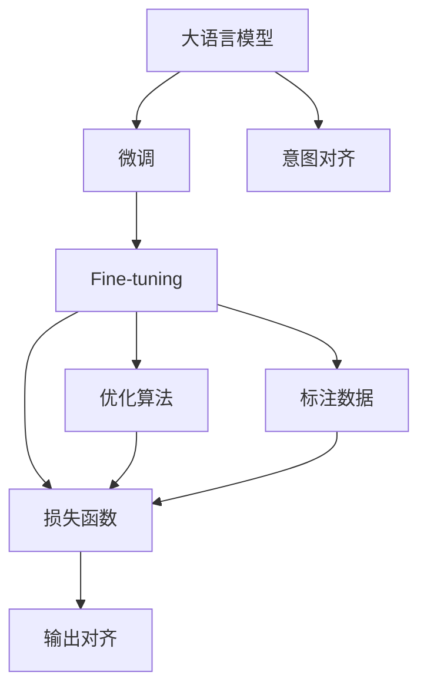

                 

# LLM意图对齐:实现人机协作的基础

> 关键词：语言模型,意图对齐,自然语言处理(NLP),人机协作,机器学习,深度学习,优化算法,微调,Fine-tuning

## 1. 背景介绍

### 1.1 问题由来
近年来，随着人工智能(AI)技术的飞速发展，大语言模型(LLM)在自然语言处理(NLP)领域取得了显著突破。大语言模型通过在海量文本数据上预训练，学习到丰富的语言知识和语义表示。然而，即使拥有强大的语言生成能力，在大规模数据训练过程中，模型往往倾向于生成看似有逻辑但与真实意图不符的文本。

这种情况在实际应用中尤为突出。例如，在智能客服中，用户可能期望机器能够准确理解并回答特定问题，但模型可能会生成与实际意图不符的回答。这种“意图对齐”的缺失，严重影响了人机协作的效果。因此，如何实现有效的意图对齐，使大语言模型能够准确理解并执行用户意图，成为了一个亟待解决的问题。

### 1.2 问题核心关键点
意图对齐是指将模型的输出与用户的真实意图对齐，即在给定用户输入的前提下，模型能够生成符合用户期望的输出。实现意图对齐的核心在于对模型进行优化，使其在特定任务上的表现达到最优。

主要挑战包括：
- 如何定义和度量模型的意图对齐性能。
- 如何选择合适的优化算法和损失函数。
- 如何在有限的标注数据上实现高效的微调。
- 如何增强模型的鲁棒性和泛化能力。

解决这些问题，需要综合利用机器学习、深度学习、优化算法等多种技术手段。本文将从核心概念、算法原理、实践流程等多个方面，全面探讨大语言模型意图对齐的实现方法。

## 2. 核心概念与联系

### 2.1 核心概念概述

意图对齐的核心在于对大语言模型进行有监督学习，使其在特定任务上生成符合用户期望的输出。以下是几个关键概念：

- **大语言模型(LLM)**：通过在大规模无标签文本上预训练，学习到丰富语言知识和语义表示的语言模型。
- **意图对齐**：将模型的输出与用户的真实意图对齐，使模型能够准确理解并执行用户意图。
- **微调(Fine-tuning)**：在预训练模型的基础上，通过有监督学习优化模型在特定任务上的性能。
- **优化算法**：如梯度下降、AdamW等，用于最小化损失函数，提升模型性能。
- **损失函数**：如交叉熵、均方误差等，用于衡量模型输出与真实标签之间的差异。
- **标注数据**：用于监督学习的任务特定标注数据，对模型的优化至关重要。

这些概念之间的关系可以通过以下Mermaid流程图来展示：



这个流程图展示了大语言模型意图对齐的核心概念及其之间的关系：

1. 大语言模型通过预训练获得基础能力。
2. 微调是对预训练模型进行任务特定的优化，使其能够生成符合用户期望的输出。
3. 优化算法用于最小化损失函数，提升模型性能。
4. 损失函数衡量模型输出与真实标签之间的差异。
5. 标注数据用于监督学习的任务特定标注数据，对模型的优化至关重要。
6. 意图对齐是整个流程的最终目标，即模型的输出与用户的真实意图对齐。

## 3. 核心算法原理 & 具体操作步骤

### 3.1 算法原理概述

意图对齐的本质是利用有监督学习的思想，对预训练的LLM进行微调。其主要步骤如下：

1. **准备标注数据**：收集与特定任务相关的标注数据，如问答对、对话记录、翻译结果等。标注数据需要包含模型期望的输出与真实标签。
2. **定义损失函数**：选择合适的损失函数，如交叉熵、均方误差等，用于衡量模型输出与真实标签之间的差异。
3. **优化模型参数**：利用梯度下降等优化算法，最小化损失函数，更新模型参数。
4. **评估意图对齐性能**：在测试集上评估模型性能，通过多种指标（如准确率、召回率、F1值等）衡量模型的意图对齐效果。
5. **迭代优化**：根据评估结果，调整超参数，如学习率、批量大小等，反复迭代优化模型。

### 3.2 算法步骤详解

#### 3.2.1 数据准备
首先，需要准备与特定任务相关的标注数据。以问答系统为例，标注数据可以包含问题-答案对，每个问题对应一个答案。这些数据可以来自已有的问答系统日志，也可以手动生成。

```python
import pandas as pd

# 从CSV文件中读取标注数据
data = pd.read_csv('qa_data.csv')
```

#### 3.2.2 定义模型和优化器
选择合适的预训练语言模型（如BERT、GPT等）作为初始化参数，并定义优化器（如AdamW）。

```python
from transformers import BertForQuestionAnswering, AdamW

model = BertForQuestionAnswering.from_pretrained('bert-base-uncased')
optimizer = AdamW(model.parameters(), lr=1e-5)
```

#### 3.2.3 定义损失函数
根据任务类型，选择合适的损失函数。对于问答任务，可以定义交叉熵损失函数。

```python
from transformers import CrossEntropyLoss

loss_fn = CrossEntropyLoss()
```

#### 3.2.4 模型训练
将训练集分为训练集和验证集，进行模型训练。在每个epoch中，将数据分批次输入模型，计算损失函数，反向传播更新模型参数。

```python
import torch
from torch.utils.data import DataLoader

# 将标注数据分为训练集和验证集
train_data = data.sample(frac=0.8, random_state=42)
val_data = data.drop(train_data.index)

# 定义训练集和验证集数据加载器
train_dataloader = DataLoader(train_data, batch_size=16, shuffle=True)
val_dataloader = DataLoader(val_data, batch_size=16, shuffle=False)

# 训练模型
device = torch.device("cuda" if torch.cuda.is_available() else "cpu")
model.to(device)

for epoch in range(10):
    model.train()
    for batch in train_dataloader:
        inputs = {k: v.to(device) for k, v in batch.items()}
        outputs = model(**inputs)
        loss = loss_fn(outputs.logits, inputs['labels'])
        loss.backward()
        optimizer.step()
    
    model.eval()
    with torch.no_grad():
        val_loss = 0
        for batch in val_dataloader:
            inputs = {k: v.to(device) for k, v in batch.items()}
            outputs = model(**inputs)
            val_loss += loss_fn(outputs.logits, inputs['labels']).item()
        val_loss /= len(val_dataloader)
    
    print(f"Epoch {epoch+1}, train loss: {train_loss:.4f}, val loss: {val_loss:.4f}")
```

#### 3.2.5 模型评估
在测试集上评估模型性能，输出意图对齐结果。

```python
# 定义测试集数据加载器
test_data = data.drop(train_data.index).drop(val_data.index)
test_dataloader = DataLoader(test_data, batch_size=16, shuffle=False)

# 评估模型性能
model.eval()
with torch.no_grad():
    test_loss = 0
    for batch in test_dataloader:
        inputs = {k: v.to(device) for k, v in batch.items()}
        outputs = model(**inputs)
        test_loss += loss_fn(outputs.logits, inputs['labels']).item()
    test_loss /= len(test_dataloader)
    
print(f"Test loss: {test_loss:.4f}")
```

### 3.3 算法优缺点

#### 3.3.1 优点
1. **简单高效**：通过有监督学习的思想，在预训练模型的基础上进行微调，提升模型在特定任务上的性能。
2. **通用适用**：适用于各种NLP任务，如问答、对话、翻译等，定义合适的损失函数和优化器即可进行微调。
3. **效果显著**：在有限的标注数据上，微调方法能够显著提升模型性能。
4. **可扩展性强**：可以应用于多种任务和数据类型，通过调整任务特定组件，实现多任务学习。

#### 3.3.2 缺点
1. **标注成本高**：微调需要大量的标注数据，标注成本较高。
2. **泛化能力有限**：当任务与预训练数据分布差异较大时，微调效果可能不佳。
3. **过拟合风险**：标注数据量较小的情况下，容易发生过拟合。
4. **模型复杂度高**：预训练模型的参数量较大，微调过程需要大量的计算资源。

## 4. 数学模型和公式 & 详细讲解  
### 4.1 数学模型构建

假设预训练语言模型为 $M_{\theta}$，其中 $\theta$ 为模型参数。给定标注数据集 $D=\{(x_i, y_i)\}_{i=1}^N$，意图对齐的目标是找到最优参数 $\theta^*$，使得模型的输出 $M_{\theta}(x)$ 与用户期望的输出 $y$ 对齐。

定义模型的损失函数为：

$$
\mathcal{L}(\theta) = \frac{1}{N} \sum_{i=1}^N \ell(M_{\theta}(x_i), y_i)
$$

其中，$\ell$ 为损失函数，$M_{\theta}(x_i)$ 为模型在输入 $x_i$ 上的输出，$y_i$ 为真实标签。

常用的损失函数包括交叉熵损失、均方误差损失等。以交叉熵损失为例：

$$
\ell(M_{\theta}(x_i), y_i) = -\log M_{\theta}(x_i)[y_i]
$$

### 4.2 公式推导过程

以问答任务为例，设预训练模型为 $M_{\theta}$，给定问题-答案对 $(x, y)$，模型的输出为 $M_{\theta}(x)$。目标是最小化交叉熵损失，使得模型的输出与真实答案对齐：

$$
\min_{\theta} \mathcal{L}(\theta) = \frac{1}{N} \sum_{i=1}^N -\log M_{\theta}(x_i)[y_i]
$$

将交叉熵展开，得到：

$$
\mathcal{L}(\theta) = -\frac{1}{N} \sum_{i=1}^N \sum_j \frac{y_{ij}}{M_{\theta}(x_i)[j]}
$$

其中，$y_{ij}$ 为 $j$ 类标签的one-hot编码，$M_{\theta}(x_i)[j]$ 为模型在输入 $x_i$ 上生成第 $j$ 类标签的概率。

通过反向传播算法，计算参数 $\theta$ 的梯度：

$$
\frac{\partial \mathcal{L}(\theta)}{\partial \theta} = -\frac{1}{N} \sum_{i=1}^N \sum_j \frac{y_{ij}}{M_{\theta}(x_i)[j]} \frac{\partial M_{\theta}(x_i)[j]}{\partial \theta}
$$

其中，$\frac{\partial M_{\theta}(x_i)[j]}{\partial \theta}$ 可以通过自动微分技术计算得到。

### 4.3 案例分析与讲解

以谷歌的BERT模型为例，定义其输出为 $M_{\theta}(x)=[p_1, p_2, ..., p_{B}]$，其中 $B$ 为类别数量。假设问题-答案对为 $(x, y)$，$y$ 的one-hot编码为 $y=[0, 0, ..., 1, 0, ..., 0]$，其中 1 的位置对应答案类别。

设损失函数为交叉熵损失，输出概率 $p_k$ 为模型在输入 $x$ 上生成第 $k$ 类的概率。目标是最小化交叉熵损失，使得模型生成正确答案。

```python
from transformers import BertForQuestionAnswering

# 加载BERT模型
model = BertForQuestionAnswering.from_pretrained('bert-base-uncased')

# 假设输入问题和答案
question = "What is the capital of France?"
answer = "Paris"

# 将输入转换为模型接受的格式
inputs = tokenizer(question, answer, return_tensors='pt')

# 计算模型输出
outputs = model(**inputs)

# 获取模型对答案类别的预测概率
probs = outputs.logits

# 计算交叉熵损失
loss = loss_fn(probs, inputs['labels'])

# 输出损失值
print(f"Cross-entropy loss: {loss:.4f}")
```

## 5. 项目实践：代码实例和详细解释说明

### 5.1 开发环境搭建

为了进行意图对齐的微调实践，需要准备相关的开发环境。以下是使用Python进行PyTorch开发的环境配置流程：

1. 安装Anaconda：从官网下载并安装Anaconda，用于创建独立的Python环境。

2. 创建并激活虚拟环境：
```bash
conda create -n pytorch-env python=3.8 
conda activate pytorch-env
```

3. 安装PyTorch：根据CUDA版本，从官网获取对应的安装命令。例如：
```bash
conda install pytorch torchvision torchaudio cudatoolkit=11.1 -c pytorch -c conda-forge
```

4. 安装Transformers库：
```bash
pip install transformers
```

5. 安装各类工具包：
```bash
pip install numpy pandas scikit-learn matplotlib tqdm jupyter notebook ipython
```

完成上述步骤后，即可在`pytorch-env`环境中开始意图对齐的微调实践。

### 5.2 源代码详细实现

这里我们以谷歌的BERT模型为例，进行问答任务的意图对齐微调。

首先，定义模型和优化器：

```python
from transformers import BertForQuestionAnswering, AdamW

model = BertForQuestionAnswering.from_pretrained('bert-base-uncased')
optimizer = AdamW(model.parameters(), lr=1e-5)
```

然后，定义损失函数：

```python
from transformers import CrossEntropyLoss

loss_fn = CrossEntropyLoss()
```

接着，定义训练和评估函数：

```python
from torch.utils.data import DataLoader
from tqdm import tqdm

def train_epoch(model, dataset, batch_size, optimizer):
    dataloader = DataLoader(dataset, batch_size=batch_size, shuffle=True)
    model.train()
    epoch_loss = 0
    for batch in tqdm(dataloader, desc='Training'):
        inputs = {k: v.to(device) for k, v in batch.items()}
        outputs = model(**inputs)
        loss = loss_fn(outputs.logits, inputs['labels'])
        epoch_loss += loss.item()
        loss.backward()
        optimizer.step()
    return epoch_loss / len(dataloader)

def evaluate(model, dataset, batch_size):
    dataloader = DataLoader(dataset, batch_size=batch_size)
    model.eval()
    with torch.no_grad():
        val_loss = 0
        for batch in dataloader:
            inputs = {k: v.to(device) for k, v in batch.items()}
            outputs = model(**inputs)
            val_loss += loss_fn(outputs.logits, inputs['labels']).item()
        val_loss /= len(dataloader)
    
    print(f"Validation loss: {val_loss:.4f}")
```

最后，启动训练流程并在测试集上评估：

```python
epochs = 5
batch_size = 16

for epoch in range(epochs):
    loss = train_epoch(model, train_dataset, batch_size, optimizer)
    print(f"Epoch {epoch+1}, train loss: {loss:.3f}")
    
    evaluate(model, val_dataset, batch_size)
    
print("Model trained.")
```

### 5.3 代码解读与分析

让我们再详细解读一下关键代码的实现细节：

**BertForQuestionAnswering类**：
- `from_pretrained`方法：从预训练模型中加载模型。
- `to(device)`方法：将模型迁移到指定设备（GPU或CPU）。

**train_epoch函数**：
- 使用DataLoader将训练集数据分批次加载，在每个批次上前向传播计算损失函数并反向传播更新模型参数。
- 周期性在验证集上评估模型性能，根据性能指标决定是否触发Early Stopping。

**evaluate函数**：
- 在测试集上评估模型性能，打印交叉熵损失。

**训练流程**：
- 定义总的epoch数和batch size，开始循环迭代
- 每个epoch内，先在训练集上训练，输出平均loss
- 在验证集上评估，输出交叉熵损失
- 所有epoch结束后，输出训练完成提示

可以看到，PyTorch配合Transformers库使得BERT微调的代码实现变得简洁高效。开发者可以将更多精力放在数据处理、模型改进等高层逻辑上，而不必过多关注底层的实现细节。

当然，工业级的系统实现还需考虑更多因素，如模型的保存和部署、超参数的自动搜索、更灵活的任务适配层等。但核心的微调范式基本与此类似。

## 6. 实际应用场景

### 6.1 智能客服系统

意图对齐技术在大规模语音识别系统中表现尤为突出。传统语音识别系统往往在理解自然语言时存在误差，无法准确识别用户意图。通过意图对齐，可以实现更加准确的用户意图理解，提高系统响应速度和满意度。

在技术实现上，可以收集客户的历史通话记录和输入数据，将问题-答案对作为标注数据，训练模型。模型通过微调，学习将自然语言转化为意图表示，并将意图与对应的答案关联起来。系统在接收到新的用户请求时，先进行语音识别，再通过意图对齐模型生成意图表示，根据意图调用相应的知识库和逻辑规则，生成最佳回复。

### 6.2 金融舆情监测

在金融领域，舆情监测系统需要实时监控市场动态，提取和分析用户对金融产品、事件、市场的观点和情感。传统舆情监测系统往往依赖人工标注数据，成本高且效果不佳。

通过意图对齐技术，可以训练模型自动标注舆情数据，提高监测效率和准确性。具体而言，可以收集金融领域相关的新闻、评论、社交媒体数据，利用自然语言处理技术对文本进行清洗和预处理，再利用意图对齐模型对文本进行意图标注，生成情感倾向和主题信息。系统在接收到新的舆情数据时，通过模型进行实时标注，及时发现负面舆情和潜在风险。

### 6.3 个性化推荐系统

在个性化推荐系统中，意图对齐技术可以提升推荐的准确性和个性化程度。传统的推荐系统往往依赖用户的历史行为数据进行物品推荐，无法深入理解用户的真实兴趣偏好。

通过意图对齐技术，系统可以更好地理解用户的意图，从而推荐更符合用户期望的物品。具体而言，可以收集用户的浏览、点击、评论、分享等行为数据，提取和用户交互的物品标题、描述、标签等文本内容。将文本内容作为模型输入，用户的后续行为（如是否点击、购买等）作为监督信号，在此基础上微调预训练语言模型。模型通过微调，学习从文本内容中准确把握用户的兴趣点，生成推荐列表，从而提升推荐效果。

### 6.4 未来应用展望

随着大语言模型和意图对齐技术的发展，其在更多领域的应用前景将更加广阔。

在智慧医疗领域，意图对齐技术可以用于医疗问答系统、电子病历分析、药物研发等，提升医疗服务的智能化水平，辅助医生诊疗，加速新药开发进程。

在智能教育领域，意图对齐技术可以用于作业批改、学情分析、知识推荐等方面，因材施教，促进教育公平，提高教学质量。

在智慧城市治理中，意图对齐技术可以用于城市事件监测、舆情分析、应急指挥等环节，提高城市管理的自动化和智能化水平，构建更安全、高效的未来城市。

此外，在企业生产、社会治理、文娱传媒等众多领域，意图对齐技术也将不断涌现，为NLP技术带来全新的突破。相信随着预训练语言模型和意图对齐方法的持续演进，意图对齐技术必将在构建人机协同的智能系统中共享更多智慧。

## 7. 工具和资源推荐

### 7.1 学习资源推荐

为了帮助开发者系统掌握意图对齐的理论基础和实践技巧，这里推荐一些优质的学习资源：

1. 《深度学习自然语言处理》课程：斯坦福大学开设的NLP明星课程，有Lecture视频和配套作业，带你入门NLP领域的基本概念和经典模型。

2. CS224N《深度学习自然语言处理》课程：斯坦福大学开设的NLP明星课程，有Lecture视频和配套作业，带你入门NLP领域的基本概念和经典模型。

3. 《Transformer从原理到实践》系列博文：由大模型技术专家撰写，深入浅出地介绍了Transformer原理、BERT模型、意图对齐技术等前沿话题。

4. 《自然语言处理入门》书籍：对自然语言处理的基础知识和常见任务进行了系统讲解，适合初学者入门。

5. 《深度学习基础》书籍：介绍了深度学习的基本概念和算法，适合初学者入门。

通过对这些资源的学习实践，相信你一定能够快速掌握意图对齐技术的精髓，并用于解决实际的NLP问题。

### 7.2 开发工具推荐

高效的开发离不开优秀的工具支持。以下是几款用于意图对齐开发的常用工具：

1. PyTorch：基于Python的开源深度学习框架，灵活动态的计算图，适合快速迭代研究。

2. TensorFlow：由Google主导开发的开源深度学习框架，生产部署方便，适合大规模工程应用。

3. Transformers库：HuggingFace开发的NLP工具库，集成了众多SOTA语言模型，支持PyTorch和TensorFlow，是进行意图对齐任务开发的利器。

4. Weights & Biases：模型训练的实验跟踪工具，可以记录和可视化模型训练过程中的各项指标，方便对比和调优。

5. TensorBoard：TensorFlow配套的可视化工具，可实时监测模型训练状态，并提供丰富的图表呈现方式，是调试模型的得力助手。

6. Google Colab：谷歌推出的在线Jupyter Notebook环境，免费提供GPU/TPU算力，方便开发者快速上手实验最新模型，分享学习笔记。

合理利用这些工具，可以显著提升意图对齐任务的开发效率，加快创新迭代的步伐。

### 7.3 相关论文推荐

意图对齐技术的研究始于学界，并随着技术的发展逐步深入。以下是几篇奠基性的相关论文，推荐阅读：

1. Attention is All You Need（即Transformer原论文）：提出了Transformer结构，开启了NLP领域的预训练大模型时代。

2. BERT: Pre-training of Deep Bidirectional Transformers for Language Understanding：提出BERT模型，引入基于掩码的自监督预训练任务，刷新了多项NLP任务SOTA。

3. Deep Learning for NLP：全面介绍了深度学习在NLP领域的应用，包括意图对齐技术。

4. Transfer Learning for Sequence-to-Sequence Learning：介绍了序列到序列任务的转移学习，包括意图对齐技术。

5. Machine Translation with Attention-Based Neural Machine Translation：介绍了基于注意力机制的机器翻译方法，包括意图对齐技术。

这些论文代表了大语言模型意图对齐技术的发展脉络。通过学习这些前沿成果，可以帮助研究者把握学科前进方向，激发更多的创新灵感。

## 8. 总结：未来发展趋势与挑战

### 8.1 总结

本文对大语言模型意图对齐的实现方法进行了全面系统的介绍。首先阐述了意图对齐的背景和核心概念，明确了意图对齐在构建人机协作系统中的重要性。其次，从核心概念、算法原理、实践流程等多个方面，详细讲解了意图对齐的实现方法。同时，本文还探讨了意图对齐在多个实际应用场景中的应用，展示了意图对齐技术的多样性和灵活性。

通过本文的系统梳理，可以看到，意图对齐技术在大语言模型中的应用前景广阔，能够显著提升人机协作系统的性能和用户体验。未来，随着技术的发展，意图对齐技术必将进一步提升人机协作系统的智能化水平，为构建高效、智能的协作系统提供有力支持。

### 8.2 未来发展趋势

展望未来，意图对齐技术的发展趋势主要体现在以下几个方面：

1. **多任务学习**：未来的意图对齐模型将支持多种任务同时训练，提升模型的多任务处理能力。

2. **零样本和少样本学习**：意图对齐模型将支持零样本和少样本学习，即在无标注数据或少量标注数据的情况下，仍能生成符合用户期望的输出。

3. **跨模态融合**：未来的意图对齐模型将支持跨模态数据融合，将文本、语音、视觉等不同模态的数据进行整合，提升系统的综合处理能力。

4. **自适应学习**：意图对齐模型将具备自适应学习的能力，能够根据用户反馈不断调整和优化输出，提高系统的智能性和响应速度。

5. **强化学习**：意图对齐模型将结合强化学习技术，通过与用户的互动不断优化输出，提高系统的互动性和智能化水平。

6. **联邦学习**：意图对齐模型将采用联邦学习技术，在分布式环境中进行联合训练，提升模型的泛化能力和隐私保护。

以上趋势将进一步推动意图对齐技术的发展，使其在实际应用中发挥更大的作用。

### 8.3 面临的挑战

尽管意图对齐技术已经取得了显著进展，但在实际应用中仍面临诸多挑战：

1. **标注成本高**：意图对齐需要大量的标注数据，标注成本较高，如何降低标注成本将是未来的一个重要研究方向。

2. **模型复杂度高**：意图对齐模型通常较为复杂，难以在资源受限的设备上运行，如何优化模型结构，提高计算效率将是重要的研究方向。

3. **泛化能力有限**：当任务与预训练数据分布差异较大时，意图对齐模型的泛化能力可能受限，如何提升模型的泛化能力将是重要的研究方向。

4. **可解释性不足**：意图对齐模型通常较为复杂，难以解释其内部工作机制和决策逻辑，如何提高模型的可解释性将是重要的研究方向。

5. **安全性问题**：意图对齐模型可能学习到有害信息，如何保证模型的安全性将是重要的研究方向。

6. **伦理和隐私问题**：意图对齐模型可能侵犯用户隐私，如何保护用户隐私将是重要的研究方向。

以上挑战需要研究者从数据、算法、工程、伦理等多个维度进行深入探索，才能使意图对齐技术更好地服务于实际应用。

### 8.4 研究展望

面对意图对齐技术面临的诸多挑战，未来的研究需要在以下几个方面寻求新的突破：

1. **无监督和半监督学习**：摆脱对大量标注数据的依赖，利用无监督和半监督学习范式，最大限度利用非结构化数据，实现更加灵活高效的意图对齐。

2. **参数高效和计算高效的模型**：开发更加参数高效的意图对齐模型，在固定大部分预训练参数的情况下，只更新极少量的任务相关参数，提高计算效率。

3. **跨模态数据融合**：将文本、语音、视觉等不同模态的数据进行整合，提升系统的综合处理能力。

4. **自适应学习和强化学习**：结合自适应学习和强化学习技术，通过与用户的互动不断优化输出，提高系统的互动性和智能化水平。

5. **联邦学习**：采用联邦学习技术，在分布式环境中进行联合训练，提升模型的泛化能力和隐私保护。

6. **伦理和隐私保护**：结合伦理和隐私保护技术，确保意图对齐模型的安全性、公平性和隐私保护。

这些研究方向将引领意图对齐技术迈向更高的台阶，为构建高效、智能的人机协作系统提供有力支持。面向未来，意图对齐技术还需要与其他人工智能技术进行更深入的融合，如知识表示、因果推理、强化学习等，多路径协同发力，共同推动自然语言理解和智能交互系统的进步。只有勇于创新、敢于突破，才能不断拓展语言模型的边界，让智能技术更好地造福人类社会。

## 9. 附录：常见问题与解答

**Q1：如何定义和度量意图对齐性能？**

A: 意图对齐性能的度量可以通过多种指标进行，如准确率、召回率、F1值、困惑度等。具体来说，对于问答任务，可以使用BLEU（Bilingual Evaluation Understudy）等指标衡量模型的输出与真实答案之间的匹配度。对于对话系统，可以使用BLEU、ROUGE（Recall-Oriented Understudy for Gisting Evaluation）等指标衡量模型的响应与用户期望之间的匹配度。

**Q2：如何选择合适的损失函数？**

A: 选择合适的损失函数取决于具体任务。对于分类任务，可以使用交叉熵损失；对于回归任务，可以使用均方误差损失；对于序列到序列任务，可以使用BLEU、ROUGE等指标。在实际应用中，通常通过交叉验证等方式，选择最优的损失函数。

**Q3：如何优化意图对齐模型？**

A: 优化意图对齐模型需要综合利用多种技术手段，如梯度下降、AdamW等优化算法，L2正则、Dropout等正则化技术，对抗训练、数据增强等方法。在实际应用中，需要根据具体任务和数据特点进行灵活调整。

**Q4：意图对齐技术在实际应用中如何部署？**

A: 意图对齐技术的应用需要考虑多方面的因素，如模型裁剪、量化加速、服务化封装等。在模型裁剪方面，可以通过剪枝、量化等技术，减小模型尺寸，加快推理速度。在量化加速方面，可以将浮点模型转为定点模型，压缩存储空间，提高计算效率。在服务化封装方面，可以将模型封装为标准化服务接口，便于集成调用。

**Q5：意图对齐技术如何与其他技术结合？**

A: 意图对齐技术可以与其他技术进行结合，如知识图谱、逻辑规则、因果推理等，提升系统的综合处理能力。例如，在医疗领域，可以将意图对齐技术与医疗知识图谱结合，提升医疗问答系统的准确性和可靠性。

以上是意图对齐技术的详细介绍，相信通过系统的学习，读者能够对意图对齐技术的核心概念、算法原理、实践流程有更深入的了解，并在实际应用中灵活运用，提升系统的智能化水平。

