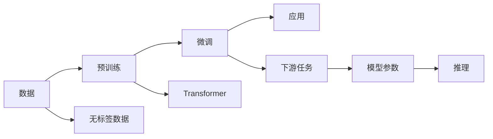

                 

# LLM的通用性与底层特性探讨

> 关键词：大语言模型(LLM),Transformer,自回归(AR),自编码(AC),Transformer-XL,Attention Mechanism,Transformer-XL,自监督学习(SSL)

## 1. 背景介绍

在人工智能技术日新月异的今天，大语言模型（Large Language Model, LLM）以其卓越的语言理解和生成能力，成为自然语言处理（Natural Language Processing, NLP）领域的突破性技术。LLM不仅能够处理大规模自然语言数据，而且在各种下游任务中展现出强大适应性，从而推动了AI在各行各业的深入应用。本文旨在探讨LLM的通用性及其底层特性，旨在深入理解其工作原理，进而指导更有效的应用实践。

## 2. 核心概念与联系

### 2.1 核心概念概述

大语言模型是一种基于神经网络架构的语言模型，通过大量无标签数据进行预训练，学习到丰富的语言表示。Transformer是LLM中最常用的架构，其特点在于使用注意力机制（Attention Mechanism）来处理序列数据，从而使得模型能够更加灵活地捕捉输入序列之间的依赖关系。

### 2.2 核心概念原理和架构的 Mermaid 流程图(Mermaid 流程节点中不要有括号、逗号等特殊字符)



在上述流程图中，数据经过预训练生成模型，模型再通过微调应用于下游任务。接下来，我们深入探讨这一过程的数学原理。

## 3. 核心算法原理 & 具体操作步骤
### 3.1 算法原理概述

大语言模型通过自回归（AR）或自编码（AC）的机制，从大规模无标签数据中学习到语言表示。AR模型通过预测序列中的下一个词，从而生成完整的句子；AC模型则通过编码和解码过程，学习输入和输出序列之间的映射关系。Transformer通过将序列数据分解为多头自注意力（Multi-Head Self-Attention）和全连接网络（Feed-Forward Network）的层次结构，实现了对长距离依赖的捕获，从而提升了模型的通用性和表达能力。

### 3.2 算法步骤详解

1. **数据预处理**：将输入序列进行分词和编码，形成模型所需的张量形式。
2. **Transformer编码器**：通过多头自注意力机制和全连接网络，逐步学习输入序列的表示。
3. **输出层**：通过线性变换和softmax函数，将Transformer编码器的输出转换为对应下游任务的预测结果。
4. **微调**：在特定任务的数据集上，使用监督学习的方式，优化模型参数，以适应任务的特定需求。
5. **推理**：将微调后的模型应用于实际问题，通过输入序列生成预测输出。

### 3.3 算法优缺点

**优点**：
- 通用性强：预训练模型可以在多种下游任务中通过微调进行适配，显著降低了应用开发成本。
- 表达能力强：Transformer架构通过自注意力机制，能够捕捉长距离依赖关系，从而在各种任务上均能取得优秀表现。
- 高效性：使用Transformer可以显著减少计算资源消耗，提高训练和推理效率。

**缺点**：
- 依赖高质量数据：模型性能受限于训练数据的质量和多样性。
- 过拟合风险：微调过程可能会使得模型在特定任务上过度拟合，导致泛化能力下降。
- 模型复杂度高：大模型通常包含大量参数，对硬件资源要求较高。

### 3.4 算法应用领域

大语言模型在NLP领域得到了广泛应用，包括文本分类、机器翻译、命名实体识别、情感分析、对话系统等。同时，LLM也拓展到了图像描述生成、代码生成、视频字幕生成等多个领域，展示了其强大的跨领域迁移能力。

## 4. 数学模型和公式 & 详细讲解 & 举例说明

### 4.1 数学模型构建

在数学模型构建中，我们主要关注LLM的预训练和微调过程。以下将以Transformer模型为例，介绍其预训练和微调的基本公式。

### 4.2 公式推导过程

**自回归模型（AR模型）**：
$$
p(x_1,...,x_n|x_{n+1},...) = \prod_{i=1}^n p(x_i|x_{i-1},...)
$$

其中，$p(x_i|x_{i-1},...)$ 表示在已知前文的情况下，生成当前词的概率。通过最大化似然函数，可以训练模型参数 $\theta$。

**自编码模型（AC模型）**：
$$
p(x|z) = p(z|x)p(x)
$$

其中，$x$ 为输入序列，$z$ 为编码器输出的隐表示。通过最大化似然函数，可以训练模型参数 $\theta$。

**Transformer模型**：
Transformer模型由编码器-解码器组成，其中编码器包含多头自注意力层和全连接层，解码器包含多头自注意力层、多头编码器-解码器注意力层和全连接层。以下公式表示Transformer的自注意力机制：

$$
Q = XW_Q^T, K = XW_K^T, V = XW_V^T
$$

$$
\text{Attention}(Q, K, V) = \text{softmax}(QK^T)/\sqrt{d_k}V
$$

$$
O = \text{Attention}(Q, K, V)W_O^T
$$

其中，$X$ 为输入序列，$W_Q, W_K, W_V, W_O$ 为可训练参数。$\text{Attention}(Q, K, V)$ 表示多头自注意力操作，$d_k$ 为注意力机制的维度。

### 4.3 案例分析与讲解

以BERT模型为例，其在预训练时采用遮罩语言模型（Masked Language Modeling, MLM）和下一句预测（Next Sentence Prediction, NSP）任务。MLM任务中，模型需要在被遮蔽的词位置上预测单词，而NSP任务中，模型需要预测两个句子是否来自同一段落。通过这两个任务，BERT学习到了丰富的语言表示。

在微调时，我们可以选择分类、匹配、生成等不同的任务类型，通过添加适当的输出层和损失函数来适配具体的下游任务。例如，对于文本分类任务，输出层为线性分类器，损失函数为交叉熵损失。

## 5. 项目实践：代码实例和详细解释说明

### 5.1 开发环境搭建

在开始项目实践前，需要先安装必要的软件环境。以下是在Python环境下搭建Transformer模型的步骤：

1. 安装Anaconda：从官网下载并安装Anaconda，创建独立的Python环境。
2. 创建并激活虚拟环境：
   ```bash
   conda create -n transformers-env python=3.7
   conda activate transformers-env
   ```
3. 安装必要的库：
   ```bash
   pip install torch transformers
   ```

### 5.2 源代码详细实现

以下是一个基于Transformer模型的文本分类任务的代码实现：

```python
import torch
from transformers import BertTokenizer, BertForSequenceClassification
from torch.utils.data import DataLoader

# 加载预训练模型和分词器
model_name = "bert-base-uncased"
tokenizer = BertTokenizer.from_pretrained(model_name)
model = BertForSequenceClassification.from_pretrained(model_name, num_labels=2)

# 加载数据集
train_dataset = ...
dev_dataset = ...
test_dataset = ...

# 构建数据加载器
train_loader = DataLoader(train_dataset, batch_size=16, shuffle=True)
dev_loader = DataLoader(dev_dataset, batch_size=16)
test_loader = DataLoader(test_dataset, batch_size=16)

# 设置优化器和学习率
optimizer = torch.optim.Adam(model.parameters(), lr=1e-5)
scheduler = torch.optim.lr_scheduler.StepLR(optimizer, step_size=2, gamma=0.1)

# 训练模型
model.train()
for epoch in range(10):
    for batch in train_loader:
        input_ids, attention_mask, labels = batch
        outputs = model(input_ids, attention_mask=attention_mask, labels=labels)
        loss = outputs.loss
        optimizer.zero_grad()
        loss.backward()
        optimizer.step()
    scheduler.step()

# 在验证集上评估模型
model.eval()
with torch.no_grad():
    total_correct, total_loss = 0, 0
    for batch in dev_loader:
        input_ids, attention_mask, labels = batch
        outputs = model(input_ids, attention_mask=attention_mask)
        loss = outputs.loss
        logits = outputs.logits
        predictions = torch.argmax(logits, dim=1)
        total_correct += (predictions == labels).sum().item()
        total_loss += loss.item()
    dev_loss = total_loss / len(dev_loader)
    dev_acc = total_correct / len(dev_dataset)

# 在测试集上测试模型
model.eval()
with torch.no_grad():
    total_correct, total_loss = 0, 0
    for batch in test_loader:
        input_ids, attention_mask, labels = batch
        outputs = model(input_ids, attention_mask=attention_mask)
        loss = outputs.loss
        logits = outputs.logits
        predictions = torch.argmax(logits, dim=1)
        total_correct += (predictions == labels).sum().item()
        total_loss += loss.item()
    test_loss = total_loss / len(test_loader)
    test_acc = total_correct / len(test_dataset)

print(f"Dev Loss: {dev_loss:.4f}, Dev Acc: {dev_acc:.4f}")
print(f"Test Loss: {test_loss:.4f}, Test Acc: {test_acc:.4f}")
```

### 5.3 代码解读与分析

上述代码实现了使用BertForSequenceClassification进行文本分类任务的过程。主要包括以下步骤：

1. 加载预训练模型和分词器。
2. 构建数据加载器，将数据集划分为训练集、验证集和测试集。
3. 设置优化器和学习率，并使用学习率调度器来调整学习率。
4. 在训练集上训练模型，使用Adam优化器更新模型参数。
5. 在验证集上评估模型性能，记录损失和准确率。
6. 在测试集上测试模型，记录损失和准确率。

## 6. 实际应用场景

### 6.1 文本分类

文本分类是自然语言处理中的基础任务，广泛应用于新闻分类、垃圾邮件过滤、情感分析等领域。使用预训练语言模型进行文本分类，可以显著提高模型的准确率和泛化能力。例如，BertClassifier可以通过添加线性分类层，将预训练BERT模型应用于文本分类任务。

### 6.2 命名实体识别

命名实体识别是自然语言处理中的重要任务，其目标是从文本中识别出具有特定意义的实体，如人名、地名、组织名等。预训练语言模型可以通过添加特定的输出层和损失函数，实现命名实体识别任务。

### 6.3 机器翻译

机器翻译是将一种语言翻译成另一种语言的技术。预训练语言模型可以通过微调，实现高质量的机器翻译任务。例如，使用BertForMaskedLM模型，可以在训练过程中进行掩码预测，从而提升机器翻译的效果。

### 6.4 未来应用展望

未来，大语言模型的应用场景将会更加广泛，其在跨领域迁移、多模态信息融合、持续学习等方面的发展，将进一步推动自然语言处理技术的发展。

## 7. 工具和资源推荐

### 7.1 学习资源推荐

为了更好地理解大语言模型的原理和应用，以下是一些推荐的资源：

1. 《深度学习》（Ian Goodfellow 著）：该书是深度学习领域的经典教材，详细介绍了深度学习的基本原理和算法。
2. 《自然语言处理综述》（Yoav Goldberg 著）：该书涵盖了自然语言处理领域的主要技术和应用。
3. 《Transformer模型及其应用》（Zhilin Yang 著）：该书介绍了Transformer模型的原理和应用，包括BERT、GPT等预训练模型。
4. HuggingFace官方文档：提供了丰富的预训练模型和代码示例，是学习大语言模型的好资源。
5. GitHub上的开源项目：如HuggingFace Transformers库，包含了大量预训练模型的实现。

### 7.2 开发工具推荐

为了更好地开发大语言模型，以下是一些推荐的工具：

1. PyTorch：开源的深度学习框架，支持动态计算图，适合快速迭代研究。
2. TensorFlow：Google开源的深度学习框架，适合大规模工程应用。
3. HuggingFace Transformers库：提供了丰富的预训练模型和代码示例，是进行NLP任务开发的利器。
4. Weights & Biases：模型训练的实验跟踪工具，记录和可视化模型训练过程中的各项指标，方便对比和调优。
5. TensorBoard：TensorFlow配套的可视化工具，可以实时监测模型训练状态，提供丰富的图表呈现方式。

### 7.3 相关论文推荐

以下是一些在大语言模型领域具有重要影响力的论文：

1. Attention is All You Need（Vaswani et al., 2017）：提出了Transformer模型，成为大语言模型的基础架构。
2. BERT: Pre-training of Deep Bidirectional Transformers for Language Understanding（Devlin et al., 2018）：提出BERT模型，通过掩码语言模型和下一句预测任务进行预训练。
3. Transformer-XL: Attentive Language Models Beyond a Fixed-Length Context（Bahdanau et al., 2019）：提出Transformer-XL模型，解决了长序列问题。
4. Learning Transferable Visual Models from Natural Language Supervision via Contrastive Predictive Coding（Yu et al., 2021）：提出CLIP模型，实现了图像描述生成任务。
5. CodeGen: End-to-End Deep Learning for Generation-Based Programming（Gao et al., 2020）：提出CodeGen模型，实现了代码生成任务。

这些论文代表了大语言模型技术的发展脉络，是研究大语言模型理论和技术的好资源。

## 8. 总结：未来发展趋势与挑战

### 8.1 总结

本文对大语言模型的通用性和底层特性进行了系统介绍。通过深入探讨其工作原理和实际应用，帮助读者更好地理解LLM的优势和局限。在大规模数据和强大计算资源的支撑下，大语言模型展示了其在自然语言处理领域的多样性和潜力。然而，在实际应用中，仍然面临着数据依赖、过拟合、模型复杂度、资源消耗等问题。

### 8.2 未来发展趋势

未来，大语言模型将朝着更加通用、高效、安全的方向发展，具体趋势如下：

1. 通用化：大语言模型将进一步提升跨领域迁移能力，适应更多的任务和应用场景。
2. 高效化：模型将通过参数高效微调、推理加速等技术，提高计算效率和部署效率。
3. 安全性：模型将增强可解释性和可审计性，避免偏见和有害信息的传播。
4. 可持续性：模型将支持持续学习和知识更新，适应数据分布的变化。
5. 跨模态：模型将拓展到多模态信息处理，实现文本、图像、语音等信息的整合和协同。

### 8.3 面临的挑战

尽管大语言模型取得了显著进展，但在应用实践中仍面临诸多挑战：

1. 数据获取：模型需要大量的高质量标注数据进行微调，获取成本较高。
2. 泛化能力：模型在小样本或少见场景下表现不佳，泛化能力有待提高。
3. 推理速度：大模型推理速度较慢，难以满足实时性要求。
4. 可解释性：模型“黑盒”特性导致其决策过程难以解释，缺乏透明度。
5. 伦理和法律：模型可能传播有害信息，引发伦理和法律问题。

### 8.4 研究展望

未来，大语言模型研究需要关注以下几个方向：

1. 自监督学习和半监督学习：降低对标注数据的依赖，提高模型的泛化能力。
2. 模型压缩和剪枝：减少模型参数量，提高推理效率。
3. 跨模态融合：实现多模态信息的整合和协同，拓展应用场景。
4. 知识图谱和符号化表示：将知识图谱和符号化表示融入模型，增强模型的推理能力和理解能力。
5. 可解释性和透明性：增强模型的可解释性，提高决策过程的透明度和可信度。

总之，大语言模型研究仍处于快速发展阶段，其通用性和底层特性将推动其在各行各业的应用和创新。未来，大语言模型将通过技术突破和优化，实现更广泛的应用和深远的影响。

## 9. 附录：常见问题与解答

### Q1：如何选择合适的预训练模型？

A: 根据任务需求选择预训练模型，常见模型如BERT、GPT、RoBERTa等。对于特定领域，还可以选择特定领域的预训练模型，如在医疗领域使用MedBERT模型。

### Q2：如何处理长文本？

A: 大语言模型通常能处理长文本，但需注意GPU或TPU的显存限制。可以通过分块处理、剪枝等技术降低计算资源消耗。

### Q3：如何进行参数高效微调？

A: 使用 Adapter、Prefix等参数高效微调技术，只更新少量的任务相关参数，以降低过拟合风险。

### Q4：如何提高模型的泛化能力？

A: 使用自监督学习和半监督学习，降低对标注数据的依赖。同时，使用数据增强和正则化技术，提升模型的泛化能力。

### Q5：如何保证模型的可解释性？

A: 使用可解释的模型架构，如规则图模型、符号化表示等，提高模型的透明性和可解释性。同时，通过自然语言解释技术，辅助用户理解模型决策过程。

---

作者：禅与计算机程序设计艺术 / Zen and the Art of Computer Programming

