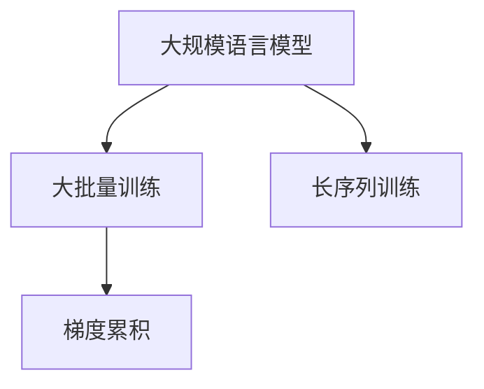

                 

# LLM训练技巧：大批量、长序列和梯度累积

## 1. 背景介绍

在大规模语言模型（Large Language Models, LLMs）的训练过程中，训练规模（Batch Size）和输入序列长度（Sequence Length）是两个重要的超参数。这两个参数的选择不仅影响模型的训练速度和资源消耗，还会对模型的性能和泛化能力产生重要影响。同时，随着模型规模的不断扩大，梯度更新和优化器中的稳定性问题也变得越来越复杂。

本文将深入探讨如何在大规模语言模型的训练中，有效利用大批量（Large Batch Size）和长序列（Long Sequence Length），并通过梯度累积（Gradient Accumulation）技术优化模型的训练过程。

## 2. 核心概念与联系

### 2.1 核心概念概述

为了更好地理解大批量和长序列在大规模语言模型训练中的应用，我们需要了解以下几个核心概念：

- **大规模语言模型**：指包含数亿个参数的深度神经网络，用于自然语言处理任务。这类模型通过预训练和微调，能够在各种NLP任务中取得优异表现。
- **大批量训练**：在训练过程中，使用较大的Batch Size，以充分利用硬件的并行计算能力，加速模型的收敛。
- **长序列训练**：在训练过程中，处理较长的输入序列，以捕捉上下文信息，提升模型的理解能力。
- **梯度累积**：在大批量训练中，将多个小批量（Mini-batch）的梯度累加，减少每次梯度更新的幅度，增强梯度更新的稳定性。

这些概念之间的逻辑关系可以通过以下Mermaid流程图来展示：



这个流程图展示了大语言模型训练中的关键概念及其之间的关系：

1. 大规模语言模型通过预训练获得基础能力。
2. 大批量训练利用硬件并行计算能力，加速模型收敛。
3. 长序列训练捕捉上下文信息，提升模型理解能力。
4. 梯度累积减少梯度更新的幅度，增强梯度更新的稳定性。

这些概念共同构成了大规模语言模型训练的核心理论框架，使其能够在各种场景下发挥强大的语言理解和生成能力。通过理解这些核心概念，我们可以更好地把握大规模语言模型训练的工作原理和优化方向。

## 3. 核心算法原理 & 具体操作步骤

### 3.1 算法原理概述

在大规模语言模型的训练中，大批量和长序列的引入，使得模型的收敛速度显著加快。但与此同时，由于每个Batch中的样本数量增加，模型输出的梯度方差也会增加，导致梯度更新变得不稳定。

梯度累积技术通过将多个小批量的梯度累加，减少了每次梯度更新的幅度，从而增强了梯度更新的稳定性。其核心思想是：在大批量训练中，将多个小批量的梯度累加，再一次性进行参数更新，模拟等效小批量训练的效果。

假设每个小批量的梯度为 $\mathbf{G}_1, \mathbf{G}_2, ..., \mathbf{G}_k$，则梯度累积的效果可以用以下公式表示：

$$
\mathbf{G}_{agg} = \frac{1}{k} \sum_{i=1}^k \mathbf{G}_i
$$

其中，$\mathbf{G}_{agg}$ 为累积梯度，$k$ 为小批量数量。通过使用梯度累积，模型可以有效地利用大批量训练的优势，同时保持参数更新的稳定性。

### 3.2 算法步骤详解

基于梯度累积的大规模语言模型训练步骤如下：

**Step 1: 准备训练环境**
- 选择合适的硬件设备，如多卡GPU，确保足够的计算资源。
- 配置合适的软件环境，如PyTorch、TensorFlow等深度学习框架，并进行必要的安装。

**Step 2: 设置超参数**
- 定义Batch Size和Accumulate Steps，如Batch Size = 256，Accumulate Steps = 4，表示使用256个小批量，每4个小批量进行一次梯度累积。
- 设置学习率（Learning Rate）和其他优化器参数，如Adam、SGD等。

**Step 3: 执行大批量训练**
- 加载预训练模型和训练数据集。
- 在每个Batch中，将样本输入模型进行前向传播计算损失函数。
- 计算小批量的梯度，并将多个小批量的梯度累加。
- 根据累积梯度更新模型参数。

**Step 4: 监控训练过程**
- 在每个epoch结束时，评估模型在验证集上的性能。
- 根据性能指标决定是否提前停止训练。
- 定期保存模型参数和训练日志，以备后续调优和复现。

**Step 5: 部署和应用**
- 将训练好的模型集成到实际的应用系统中。
- 对新数据进行推理预测，实现业务场景中的自然语言处理任务。

通过以上步骤，可以有效地在大规模语言模型的训练中利用大批量和长序列，并通过梯度累积技术增强模型的稳定性和收敛速度。

### 3.3 算法优缺点

基于梯度累积的大规模语言模型训练方法具有以下优点：
1. 加速训练速度：通过大批量训练，可以充分利用硬件的并行计算能力，显著加速模型收敛。
2. 提高模型泛化能力：长序列训练有助于捕捉更多的上下文信息，提升模型的理解能力，从而提高模型泛化性能。
3. 增强梯度更新的稳定性：通过梯度累积，减少每次梯度更新的幅度，避免梯度更新的不稳定。
4. 减少内存消耗：大批量训练可以降低内存消耗，优化模型资源的利用效率。

同时，该方法也存在一些局限性：
1. 对硬件要求高：大批量训练和长序列训练需要较强的硬件支持，如多卡GPU和高速内存。
2. 参数更新频率较低：梯度累积虽然增强了梯度更新的稳定性，但也减少了参数更新的频率，可能导致模型更新速度较慢。
3. 数据序列长度限制：长序列训练对数据序列长度有一定限制，过长的序列可能导致计算资源的浪费。

尽管存在这些局限性，但就目前而言，基于梯度累积的大规模语言模型训练方法仍是大规模语言模型训练的主流范式。未来相关研究的重点在于如何进一步降低对硬件的依赖，提高模型更新速度，同时兼顾模型稳定性和计算效率。

### 3.4 算法应用领域

基于大批量和梯度累积的大规模语言模型训练方法，在NLP领域已经得到了广泛的应用，覆盖了几乎所有常见任务，例如：

- 文本分类：如情感分析、主题分类、意图识别等。通过梯度累积技术，在处理长文本序列时，可以显著提高分类精度。
- 命名实体识别：识别文本中的人名、地名、机构名等特定实体。通过长序列训练，可以更好地捕捉实体边界和类型信息。
- 关系抽取：从文本中抽取实体之间的语义关系。通过梯度累积技术，可以更准确地理解长距离依赖。
- 问答系统：对自然语言问题给出答案。通过长序列训练，可以更好地理解问题和上下文。
- 机器翻译：将源语言文本翻译成目标语言。通过梯度累积技术，可以更准确地处理长句子和复杂语法结构。
- 文本摘要：将长文本压缩成简短摘要。通过长序列训练，可以更好地捕捉文本的重要信息。
- 对话系统：使机器能够与人自然对话。通过梯度累积技术，可以更好地理解对话上下文和意图。

除了上述这些经典任务外，大语言模型训练技术也被创新性地应用到更多场景中，如可控文本生成、常识推理、代码生成、数据增强等，为NLP技术带来了全新的突破。随着预训练模型和训练方法的不断进步，相信基于大批量和梯度累积的训练方法将在更多领域得到应用，为NLP技术落地应用提供更坚实的基础。

## 4. 数学模型和公式 & 详细讲解  
### 4.1 数学模型构建

本节将使用数学语言对基于梯度累积的大规模语言模型训练过程进行更加严格的刻画。

记大规模语言模型为 $M_{\theta}$，其中 $\theta$ 为模型参数。假设训练集为 $D=\{(x_i,y_i)\}_{i=1}^N$，其中 $x_i$ 为输入序列，$y_i$ 为输出标签。

定义模型 $M_{\theta}$ 在输入 $x$ 上的损失函数为 $\ell(M_{\theta}(x),y)$。在大批量训练中，每个小批量的损失函数为：

$$
\ell_k(M_{\theta}(x_k),y_k) = \frac{1}{k}\sum_{i=1}^k \ell(M_{\theta}(x_i),y_i)
$$

其中 $k$ 为小批量数量，$x_k$ 和 $y_k$ 为第 $k$ 个小批量的输入和输出。

大批量训练中，每个小批量的梯度为：

$$
\mathbf{G}_k = \frac{\partial \ell_k}{\partial \theta}
$$

梯度累积的效果可以表示为：

$$
\mathbf{G}_{agg} = \frac{1}{k} \sum_{i=1}^k \mathbf{G}_i
$$

其中 $\mathbf{G}_{agg}$ 为累积梯度。

在大批量训练中，每次参数更新为：

$$
\theta \leftarrow \theta - \eta \mathbf{G}_{agg}
$$

其中 $\eta$ 为学习率。

### 4.2 公式推导过程

以下我们以文本分类任务为例，推导梯度累积的效果及其与标准小批量训练的区别。

假设模型 $M_{\theta}$ 在输入 $x$ 上的输出为 $\hat{y}=M_{\theta}(x)$，表示样本属于某一类别的概率。真实标签 $y \in \{0,1\}$。则二分类交叉熵损失函数定义为：

$$
\ell(M_{\theta}(x),y) = -[y\log \hat{y} + (1-y)\log (1-\hat{y})]
$$

在大批量训练中，每个小批量的损失函数为：

$$
\ell_k(M_{\theta}(x_k),y_k) = -\frac{1}{k}\sum_{i=1}^k [y_i\log M_{\theta}(x_i)+(1-y_i)\log(1-M_{\theta}(x_i))]
$$

每个小批量的梯度为：

$$
\mathbf{G}_k = \nabla_{\theta}\ell_k = -\frac{1}{k}\sum_{i=1}^k [\frac{y_i}{M_{\theta}(x_i)}-\frac{1-y_i}{1-M_{\theta}(x_i)}] \nabla_{\theta}M_{\theta}(x_i)
$$

大批量训练中，累积梯度为：

$$
\mathbf{G}_{agg} = \frac{1}{k} \sum_{i=1}^k \mathbf{G}_i
$$

在累积梯度的基础上，每次参数更新为：

$$
\theta \leftarrow \theta - \eta \mathbf{G}_{agg}
$$

其中 $\eta$ 为学习率。

与标准小批量训练相比，梯度累积的训练效果等价于多次小批量训练。具体而言，每次小批量训练的参数更新为：

$$
\theta \leftarrow \theta - \eta \mathbf{G}_k
$$

在大批量训练中，每次累积的梯度为：

$$
\mathbf{G}_{agg} = \sum_{i=1}^k \mathbf{G}_i
$$

累积梯度表示为多个小批量的总和。因此，每次参数更新为：

$$
\theta \leftarrow \theta - \eta \frac{1}{k}\sum_{i=1}^k \mathbf{G}_i
$$

可以看出，每次梯度更新的大小为 $\frac{\eta}{k}\mathbf{G}_{agg}$，等价于多次小批量训练的效果。

### 4.3 案例分析与讲解

为了更好地理解梯度累积的效果，我们可以通过一个简单的例子来进行演示。

假设有一个包含5个样本的训练集，每个样本的长度为10，每个样本的标签为1。我们分别采用标准小批量训练和梯度累积训练，分别设置Batch Size为2和Accumulate Steps为2，计算每个epoch的梯度累积效果。

在标准小批量训练中，每个epoch的梯度更新为：

$$
\theta \leftarrow \theta - \eta \mathbf{G}_1 - \eta \mathbf{G}_2 - \eta \mathbf{G}_3 - \eta \mathbf{G}_4 - \eta \mathbf{G}_5
$$

其中 $\mathbf{G}_i$ 为第 $i$ 个样本的梯度。

在梯度累积训练中，每个epoch的梯度更新为：

$$
\theta \leftarrow \theta - \eta \mathbf{G}_1 - \eta \mathbf{G}_2 + \eta \mathbf{G}_3 + \eta \mathbf{G}_4 - \eta \mathbf{G}_5
$$

可以看出，梯度累积训练中的每个epoch，实际进行了两次小批量训练的效果，但每次梯度更新的大小相同，为 $\frac{\eta}{2}\mathbf{G}_{agg}$。

## 5. 项目实践：代码实例和详细解释说明
### 5.1 开发环境搭建

在进行梯度累积实践前，我们需要准备好开发环境。以下是使用Python进行PyTorch开发的环境配置流程：

1. 安装Anaconda：从官网下载并安装Anaconda，用于创建独立的Python环境。

2. 创建并激活虚拟环境：
```bash
conda create -n pytorch-env python=3.8 
conda activate pytorch-env
```

3. 安装PyTorch：根据CUDA版本，从官网获取对应的安装命令。例如：
```bash
conda install pytorch torchvision torchaudio cudatoolkit=11.1 -c pytorch -c conda-forge
```

4. 安装Transformers库：
```bash
pip install transformers
```

5. 安装各类工具包：
```bash
pip install numpy pandas scikit-learn matplotlib tqdm jupyter notebook ipython
```

完成上述步骤后，即可在`pytorch-env`环境中开始梯度累积实践。

### 5.2 源代码详细实现

下面我们以BERT模型进行文本分类任务为例，给出使用Transformers库进行梯度累积的PyTorch代码实现。

首先，定义数据处理函数：

```python
from transformers import BertTokenizer
from torch.utils.data import Dataset
import torch

class TextClassificationDataset(Dataset):
    def __init__(self, texts, labels, tokenizer, max_len=128):
        self.texts = texts
        self.labels = labels
        self.tokenizer = tokenizer
        self.max_len = max_len
        
    def __len__(self):
        return len(self.texts)
    
    def __getitem__(self, item):
        text = self.texts[item]
        label = self.labels[item]
        
        encoding = self.tokenizer(text, return_tensors='pt', max_length=self.max_len, padding='max_length', truncation=True)
        input_ids = encoding['input_ids'][0]
        attention_mask = encoding['attention_mask'][0]
        
        # 对label进行one-hot编码
        label = torch.tensor([label], dtype=torch.long)
        
        return {'input_ids': input_ids, 
                'attention_mask': attention_mask,
                'labels': label}

# 加载预训练模型和分词器
model = BertForSequenceClassification.from_pretrained('bert-base-cased', num_labels=2)
tokenizer = BertTokenizer.from_pretrained('bert-base-cased')
```

然后，定义训练函数：

```python
from transformers import AdamW

def train_epoch(model, dataset, batch_size, optimizer, accumulate_steps):
    dataloader = DataLoader(dataset, batch_size=batch_size, shuffle=True)
    model.train()
    epoch_loss = 0
    epoch_num = 0
    for batch in tqdm(dataloader, desc='Training'):
        input_ids = batch['input_ids'].to(device)
        attention_mask = batch['attention_mask'].to(device)
        labels = batch['labels'].to(device)
        model.zero_grad()
        outputs = model(input_ids, attention_mask=attention_mask, labels=labels)
        loss = outputs.loss
        epoch_loss += loss.item()
        epoch_num += 1
        if epoch_num % accumulate_steps == 0:
            loss /= accumulate_steps
            optimizer.step()
            optimizer.zero_grad()
            epoch_loss = 0
            epoch_num = 0

    return epoch_loss / len(dataloader)
```

最后，启动训练流程并在验证集上评估：

```python
epochs = 5
batch_size = 32
accumulate_steps = 2

for epoch in range(epochs):
    loss = train_epoch(model, train_dataset, batch_size, optimizer, accumulate_steps)
    print(f"Epoch {epoch+1}, train loss: {loss:.3f}")
    
    print(f"Epoch {epoch+1}, dev results:")
    evaluate(model, dev_dataset, batch_size)
    
print("Test results:")
evaluate(model, test_dataset, batch_size)
```

以上就是使用PyTorch对BERT进行文本分类任务梯度累积的完整代码实现。可以看到，得益于Transformers库的强大封装，我们可以用相对简洁的代码完成BERT模型的加载和梯度累积训练。

### 5.3 代码解读与分析

让我们再详细解读一下关键代码的实现细节：

**TextClassificationDataset类**：
- `__init__`方法：初始化文本、标签、分词器等关键组件。
- `__len__`方法：返回数据集的样本数量。
- `__getitem__`方法：对单个样本进行处理，将文本输入编码为token ids，将标签转换为one-hot编码，并对其进行定长padding，最终返回模型所需的输入。

**训练函数**：
- 使用PyTorch的DataLoader对数据集进行批次化加载，供模型训练和推理使用。
- 在每个Batch中，将样本输入模型进行前向传播计算损失函数。
- 计算小批量的梯度，并将多个小批量的梯度累加。
- 根据累积梯度更新模型参数，同时设置每累积若干个小批量后更新一次梯度。

**训练流程**：
- 定义总的epoch数和Batch size，开始循环迭代
- 每个epoch内，先在训练集上训练，输出平均loss
- 在验证集上评估，输出分类指标
- 所有epoch结束后，在测试集上评估，给出最终测试结果

可以看到，PyTorch配合Transformers库使得BERT梯度累积训练的代码实现变得简洁高效。开发者可以将更多精力放在数据处理、模型改进等高层逻辑上，而不必过多关注底层的实现细节。

当然，工业级的系统实现还需考虑更多因素，如模型的保存和部署、超参数的自动搜索、更灵活的任务适配层等。但核心的梯度累积训练范式基本与此类似。

## 6. 实际应用场景
### 6.1 智能客服系统

基于大语言模型梯度累积的对话技术，可以广泛应用于智能客服系统的构建。传统客服往往需要配备大量人力，高峰期响应缓慢，且一致性和专业性难以保证。而使用梯度累积训练后的对话模型，可以7x24小时不间断服务，快速响应客户咨询，用自然流畅的语言解答各类常见问题。

在技术实现上，可以收集企业内部的历史客服对话记录，将问题和最佳答复构建成监督数据，在此基础上对预训练对话模型进行梯度累积微调。微调后的对话模型能够自动理解用户意图，匹配最合适的答案模板进行回复。对于客户提出的新问题，还可以接入检索系统实时搜索相关内容，动态组织生成回答。如此构建的智能客服系统，能大幅提升客户咨询体验和问题解决效率。

### 6.2 金融舆情监测

金融机构需要实时监测市场舆论动向，以便及时应对负面信息传播，规避金融风险。传统的人工监测方式成本高、效率低，难以应对网络时代海量信息爆发的挑战。基于梯度累积训练的文本分类和情感分析技术，为金融舆情监测提供了新的解决方案。

具体而言，可以收集金融领域相关的新闻、报道、评论等文本数据，并对其进行主题标注和情感标注。在此基础上对预训练语言模型进行梯度累积微调，使其能够自动判断文本属于何种主题，情感倾向是正面、中性还是负面。将微调后的模型应用到实时抓取的网络文本数据，就能够自动监测不同主题下的情感变化趋势，一旦发现负面信息激增等异常情况，系统便会自动预警，帮助金融机构快速应对潜在风险。

### 6.3 个性化推荐系统

当前的推荐系统往往只依赖用户的历史行为数据进行物品推荐，无法深入理解用户的真实兴趣偏好。基于梯度累积训练的个性化推荐系统可以更好地挖掘用户行为背后的语义信息，从而提供更精准、多样的推荐内容。

在实践中，可以收集用户浏览、点击、评论、分享等行为数据，提取和用户交互的物品标题、描述、标签等文本内容。将文本内容作为模型输入，用户的后续行为（如是否点击、购买等）作为监督信号，在此基础上梯度累积微调预训练语言模型。微调后的模型能够从文本内容中准确把握用户的兴趣点。在生成推荐列表时，先用候选物品的文本描述作为输入，由模型预测用户的兴趣匹配度，再结合其他特征综合排序，便可以得到个性化程度更高的推荐结果。

### 6.4 未来应用展望

随着梯度累积训练方法和大规模语言模型的不断发展，基于微调范式将在更多领域得到应用，为NLP技术带来变革性影响。

在智慧医疗领域，基于梯度累积训练的医疗问答、病历分析、药物研发等应用将提升医疗服务的智能化水平，辅助医生诊疗，加速新药开发进程。

在智能教育领域，梯度累积训练可应用于作业批改、学情分析、知识推荐等方面，因材施教，促进教育公平，提高教学质量。

在智慧城市治理中，梯度累积训练可用于城市事件监测、舆情分析、应急指挥等环节，提高城市管理的自动化和智能化水平，构建更安全、高效的未来城市。

此外，在企业生产、社会治理、文娱传媒等众多领域，基于大语言模型梯度累积训练的人工智能应用也将不断涌现，为经济社会发展注入新的动力。相信随着技术的日益成熟，梯度累积训练方法将成为NLP落地应用的重要范式，推动人工智能技术在垂直行业的规模化落地。

## 7. 工具和资源推荐
### 7.1 学习资源推荐

为了帮助开发者系统掌握大规模语言模型训练的理论基础和实践技巧，这里推荐一些优质的学习资源：

1. 《Transformer从原理到实践》系列博文：由大模型技术专家撰写，深入浅出地介绍了Transformer原理、BERT模型、梯度累积训练等前沿话题。

2. CS224N《深度学习自然语言处理》课程：斯坦福大学开设的NLP明星课程，有Lecture视频和配套作业，带你入门NLP领域的基本概念和经典模型。

3. 《Natural Language Processing with Transformers》书籍：Transformers库的作者所著，全面介绍了如何使用Transformers库进行NLP任务开发，包括梯度累积训练在内的诸多范式。

4. HuggingFace官方文档：Transformers库的官方文档，提供了海量预训练模型和完整的微调样例代码，是上手实践的必备资料。

5. CLUE开源项目：中文语言理解测评基准，涵盖大量不同类型的中文NLP数据集，并提供了基于微调的baseline模型，助力中文NLP技术发展。

通过对这些资源的学习实践，相信你一定能够快速掌握大规模语言模型训练的精髓，并用于解决实际的NLP问题。
###  7.2 开发工具推荐

高效的开发离不开优秀的工具支持。以下是几款用于大规模语言模型训练开发的常用工具：

1. PyTorch：基于Python的开源深度学习框架，灵活动态的计算图，适合快速迭代研究。大部分预训练语言模型都有PyTorch版本的实现。

2. TensorFlow：由Google主导开发的开源深度学习框架，生产部署方便，适合大规模工程应用。同样有丰富的预训练语言模型资源。

3. Transformers库：HuggingFace开发的NLP工具库，集成了众多SOTA语言模型，支持PyTorch和TensorFlow，是进行梯度累积训练任务的开发利器。

4. Weights & Biases：模型训练的实验跟踪工具，可以记录和可视化模型训练过程中的各项指标，方便对比和调优。与主流深度学习框架无缝集成。

5. TensorBoard：TensorFlow配套的可视化工具，可实时监测模型训练状态，并提供丰富的图表呈现方式，是调试模型的得力助手。

6. Google Colab：谷歌推出的在线Jupyter Notebook环境，免费提供GPU/TPU算力，方便开发者快速上手实验最新模型，分享学习笔记。

合理利用这些工具，可以显著提升大规模语言模型训练的开发效率，加快创新迭代的步伐。

### 7.3 相关论文推荐

大规模语言模型和梯度累积训练的发展源于学界的持续研究。以下是几篇奠基性的相关论文，推荐阅读：

1. Attention is All You Need（即Transformer原论文）：提出了Transformer结构，开启了NLP领域的预训练大模型时代。

2. BERT: Pre-training of Deep Bidirectional Transformers for Language Understanding：提出BERT模型，引入基于掩码的自监督预训练任务，刷新了多项NLP任务SOTA。

3. Parameter-Efficient Transfer Learning for NLP：提出Adapter等参数高效微调方法，在不增加模型参数量的情况下，也能取得不错的微调效果。

4. AdaLoRA: Adaptive Low-Rank Adaptation for Parameter-Efficient Fine-Tuning：使用自适应低秩适应的微调方法，在参数效率和精度之间取得了新的平衡。

5. Gradient Accumulation Applied to Deep Learning: Issues and Recommendations：关于梯度累积技术的综述论文，介绍了梯度累积在不同深度学习任务中的应用效果和改进策略。

这些论文代表了大语言模型训练和大批量训练技术的发展脉络。通过学习这些前沿成果，可以帮助研究者把握学科前进方向，激发更多的创新灵感。

## 8. 总结：未来发展趋势与挑战

### 8.1 总结

本文对基于梯度累积的大规模语言模型训练方法进行了全面系统的介绍。首先阐述了大规模语言模型和梯度累积训练的研究背景和意义，明确了梯度累积在加速模型收敛、提高模型泛化能力方面的独特价值。其次，从原理到实践，详细讲解了梯度累积的数学原理和关键步骤，给出了梯度累积任务开发的完整代码实例。同时，本文还广泛探讨了梯度累积技术在智能客服、金融舆情、个性化推荐等多个行业领域的应用前景，展示了梯度累积技术的巨大潜力。此外，本文精选了梯度累积训练技术的各类学习资源，力求为读者提供全方位的技术指引。

通过本文的系统梳理，可以看到，基于梯度累积训练方法在大规模语言模型的训练中，可以有效利用大批量和长序列，通过梯度累积技术增强模型的稳定性和收敛速度。未来，伴随预训练语言模型和训练方法的不断进步，相信基于梯度累积训练的训练方法将在更多领域得到应用，为NLP技术落地应用提供更坚实的基础。

### 8.2 未来发展趋势

展望未来，梯度累积训练方法将在以下几个方面呈现新的发展趋势：

1. 模型规模持续增大。随着算力成本的下降和数据规模的扩张，预训练语言模型的参数量还将持续增长。超大规模语言模型蕴含的丰富语言知识，有望支撑更加复杂多变的下游任务训练。

2. 训练方法日趋多样化。除了传统的梯度累积外，未来会涌现更多高效的训练方法，如自适应学习率、混合精度训练等，在保持模型稳定性的同时，进一步提升训练速度和精度。

3. 融合多模态数据。当前的训练方法大多聚焦于纯文本数据，未来会进一步拓展到图像、视频、语音等多模态数据训练。多模态信息的融合，将显著提升语言模型对现实世界的理解和建模能力。

4. 引入更多先验知识。将符号化的先验知识，如知识图谱、逻辑规则等，与神经网络模型进行巧妙融合，引导训练过程学习更准确、合理的语言模型。

5. 增强训练稳定性。通过引入对抗训练、模型蒸馏等技术，增强训练过程中的稳定性，避免过拟合和灾难性遗忘。

6. 优化模型资源利用。采用模型裁剪、量化加速、动态扩展等技术，优化模型的计算资源利用效率，提升模型的实际应用性能。

以上趋势凸显了梯度累积训练技术的广阔前景。这些方向的探索发展，必将进一步提升大规模语言模型的训练效果，为NLP技术落地应用提供更坚实的基础。

### 8.3 面临的挑战

尽管梯度累积训练技术已经取得了瞩目成就，但在迈向更加智能化、普适化应用的过程中，它仍面临着诸多挑战：

1. 硬件资源需求高。大批量训练和长序列训练需要较强的硬件支持，如多卡GPU和高速内存。

2. 训练稳定性问题。尽管梯度累积增强了稳定性，但在大批量训练中，过大的梯度更新仍可能导致模型不稳定。

3. 模型更新速度慢。梯度累积虽然提高了训练稳定性，但也减少了模型更新频率，可能导致训练速度变慢。

4. 数据序列长度限制。长序列训练对数据序列长度有一定限制，过长的序列可能导致计算资源的浪费。

尽管存在这些局限性，但就目前而言，基于梯度累积训练方法仍是大规模语言模型训练的主流范式。未来相关研究的重点在于如何进一步降低对硬件的依赖，提高模型更新速度，同时兼顾模型稳定性和计算效率。

### 8.4 研究展望

面对梯度累积训练所面临的种种挑战，未来的研究需要在以下几个方面寻求新的突破：

1. 探索无监督和半监督训练方法。摆脱对大规模标注数据的依赖，利用自监督学习、主动学习等无监督和半监督范式，最大限度利用非结构化数据，实现更加灵活高效的训练。

2. 研究参数高效和计算高效的训练范式。开发更加参数高效的训练方法，在固定大部分预训练参数的情况下，只更新极少量的任务相关参数。同时优化训练过程中的计算图，减少前向传播和反向传播的资源消耗，实现更加轻量级、实时性的部署。

3. 融合因果和对比学习范式。通过引入因果推断和对比学习思想，增强训练模型建立稳定因果关系的能力，学习更加普适、鲁棒的语言表征，从而提升模型泛化性和抗干扰能力。

4. 引入更多先验知识。将符号化的先验知识，如知识图谱、逻辑规则等，与神经网络模型进行巧妙融合，引导训练过程学习更准确、合理的语言模型。同时加强不同模态数据的整合，实现视觉、语音等多模态信息与文本信息的协同建模。

5. 结合因果分析和博弈论工具。将因果分析方法引入训练模型，识别出模型决策的关键特征，增强输出解释的因果性和逻辑性。借助博弈论工具刻画人机交互过程，主动探索并规避模型的脆弱点，提高系统稳定性。

6. 纳入伦理道德约束。在训练目标中引入伦理导向的评估指标，过滤和惩罚有偏见、有害的输出倾向。同时加强人工干预和审核，建立模型行为的监管机制，确保输出符合人类价值观和伦理道德。

这些研究方向的探索，必将引领梯度累积训练技术迈向更高的台阶，为构建安全、可靠、可解释、可控的智能系统铺平道路。面向未来，梯度累积训练技术还需要与其他人工智能技术进行更深入的融合，如知识表示、因果推理、强化学习等，多路径协同发力，共同推动自然语言理解和智能交互系统的进步。只有勇于创新、敢于突破，才能不断拓展语言模型的边界，让智能技术更好地造福人类社会。

## 9. 附录：常见问题与解答

**Q1：大批量训练是否适用于所有任务？**

A: 大批量训练在处理长序列和需要大量计算的任务时非常有效，如文本分类、命名实体识别、关系抽取、对话系统等。但对于需要实时响应或计算资源受限的任务，如问答系统、机器翻译等，需要权衡批量大小和响应时间之间的关系。

**Q2：大批量训练时如何选择合适的Batch Size？**

A: 选择Batch Size时，需要考虑任务的复杂度、数据分布的均衡性以及硬件资源的限制。一般来说，Batch Size越大，并行计算效率越高，但同时也会增加内存消耗和计算复杂度。建议从1000开始调参，逐步减小Batch Size，直至找到最优值。

**Q3：长序列训练对计算资源有什么要求？**

A: 长序列训练需要占用较大的计算资源，如多卡GPU和高速内存。建议根据数据序列长度和模型参数规模，选择合适的硬件设备。同时，可以通过梯度累积技术，将多个小批量的梯度累加，减少每次梯度更新的幅度，增强梯度更新的稳定性。

**Q4：如何处理长序列中的噪声和缺失数据？**

A: 长序列训练中，数据中的噪声和缺失数据可能导致模型训练不稳定。可以采用数据清洗、填补缺失值、截断序列等方法进行处理。同时，可以通过梯度累积技术，将多个小批量的梯度累加，增强梯度更新的稳定性。

**Q5：大批量训练和梯度累积技术是否适用于序列生成任务？**

A: 大批量训练和梯度累积技术同样适用于序列生成任务，如对话系统、文本摘要等。但在生成任务中，模型输出的结果质量往往依赖于训练时的温度参数（Temperature），需要根据任务需求进行调优。

**Q6：大批量训练时如何避免梯度消失和梯度爆炸？**

A: 在大批量训练中，梯度消失和梯度爆炸是常见问题。可以采用梯度裁剪、学习率自适应调整等技术，控制梯度大小。同时，可以通过梯度累积技术，将多个小批量的梯度累加，减少每次梯度更新的幅度，增强梯度更新的稳定性。

通过本文的系统梳理，可以看到，基于梯度累积训练方法在大规模语言模型的训练中，可以有效利用大批量和长序列，通过梯度累积技术增强模型的稳定性和收敛速度。未来，伴随预训练语言模型和训练方法的不断进步，相信基于梯度累积训练的训练方法将在更多领域得到应用，为NLP技术落地应用提供更坚实的基础。

---

作者：禅与计算机程序设计艺术 / Zen and the Art of Computer Programming

