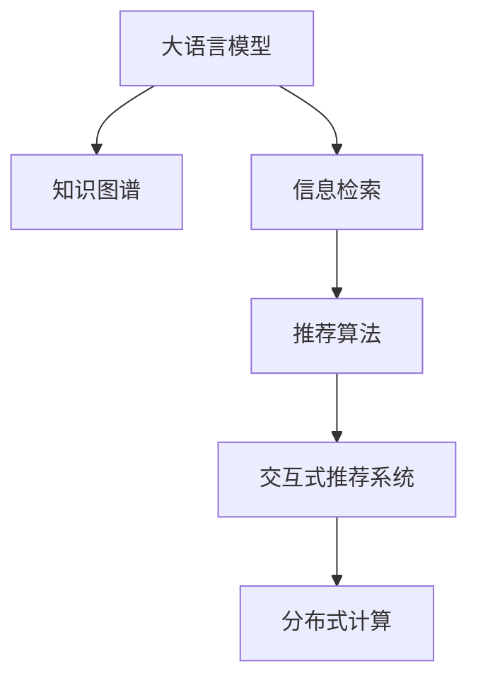
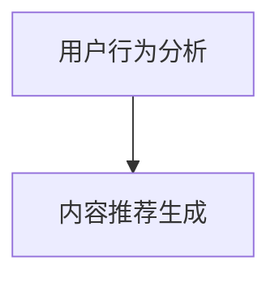

                 

# LLM驱动的个性化podcast推荐系统

> 关键词：大语言模型, 自然语言处理, 推荐系统, 知识图谱, 信息检索, 深度学习, 算法优化, 用户行为分析

## 1. 背景介绍

### 1.1 问题由来
随着移动互联网和智能设备的普及，越来越多的用户习惯于在通勤、锻炼、做家务等零碎时间里收听音频内容，从而获取知识和信息。Podcast作为播客音频节目，因其内容丰富、形式多样，成为了一种主流的音频娱乐和知识获取方式。然而，面对海量的Podcast内容，用户往往难以从中筛选出符合自己兴趣和需求的内容，用户体验受到很大影响。

为了提升用户发现合适内容的效率，研究人员和开发者开始探索基于大语言模型的个性化Podcast推荐系统。这种系统能够通过分析用户行为数据、Podcast元数据和内容文本，学习用户的兴趣偏好，智能推荐个性化的Podcast节目。

### 1.2 问题核心关键点
构建一个高效、准确的个性化Podcast推荐系统，需解决以下核心问题：

- 如何高效地将用户行为数据转换为模型可理解的特征向量？
- 如何构建一个有效的知识图谱，捕捉Podcast内容之间的关联性？
- 如何利用大语言模型学习用户的兴趣偏好，并产生高精度的推荐？
- 如何处理推荐结果的多样性和稳定性，提升用户体验？
- 如何实时监控和优化推荐系统，适应用户需求的变化？

本文将从大语言模型、知识图谱和推荐算法三个方面，系统介绍如何构建一个基于大语言模型的个性化Podcast推荐系统。

## 2. 核心概念与联系

### 2.1 核心概念概述

为更好地理解基于大语言模型的个性化Podcast推荐系统，本节将介绍几个密切相关的核心概念：

- **大语言模型(Large Language Model, LLM)**：以自回归(如GPT)或自编码(如BERT)模型为代表的大规模预训练语言模型。通过在大规模无标签文本语料上进行预训练，学习通用的语言表示，具备强大的语言理解和生成能力。

- **知识图谱(Knowledge Graph)**：用于表示实体间关系和属性，支持基于图结构的信息检索和知识推理的表示方式。

- **信息检索(Information Retrieval, IR)**：从文本数据中查找与用户查询最相关的信息的过程，包括倒排索引、向量空间模型等。

- **推荐算法(Recommendation Algorithm)**：通过用户行为数据和物品属性，预测用户对物品的兴趣和偏好，产生推荐结果的算法。

- **大模型微调(Fine-Tuning)**：指在预训练模型的基础上，使用下游任务的少量标注数据，通过有监督地训练来优化模型在特定任务上的性能。

- **交互式推荐系统(Interactive Recommendation System)**：通过实时接收用户反馈，不断调整推荐策略，以提升用户体验和满意度。

- **分布式计算(Distributed Computing)**：利用多个计算节点并行处理推荐任务，提升推荐系统的处理能力和响应速度。

这些核心概念之间的逻辑关系可以通过以下Mermaid流程图来展示：



这个流程图展示了大语言模型的核心概念及其之间的关系：

1. 大语言模型通过预训练获得基础能力。
2. 知识图谱捕捉Podcast内容之间的关联性。
3. 信息检索从海量数据中筛选出相关内容。
4. 推荐算法根据用户行为和内容文本生成推荐结果。
5. 交互式推荐系统实时接收用户反馈，不断优化推荐。
6. 分布式计算提升推荐系统的处理能力和响应速度。

这些概念共同构成了基于大语言模型的个性化Podcast推荐系统，使其能够高效地为每个用户生成个性化的Podcast推荐。

## 3. 核心算法原理 & 具体操作步骤

### 3.1 算法原理概述

基于大语言模型的个性化Podcast推荐系统，主要分为两个阶段：

1. **用户行为分析**：通过分析用户的历史收听记录、评价、点赞等行为数据，学习用户对不同Podcast节目的兴趣偏好。
2. **内容推荐生成**：利用大语言模型和知识图谱，生成符合用户兴趣偏好的Podcast推荐列表。

整体流程如图3所示：



其中，用户行为分析模块需将用户的非结构化行为数据转换为向量表示，以便于模型理解和处理。内容推荐生成模块需根据用户兴趣偏好和Podcast内容之间的关联性，生成推荐列表。

### 3.2 算法步骤详解

**Step 1: 用户行为表示**

首先，需要对用户的历史行为数据进行编码，将其转换为模型可理解的向量表示。具体步骤如下：

1. **用户行为数据收集**：收集用户的Podcast收听历史、评价、点赞、评论等信息。

2. **行为数据预处理**：将行为数据清洗、去噪，并将其转换为文本形式，便于后续处理。

3. **行为特征提取**：使用TF-IDF、Word2Vec等方法提取用户行为文本的特征向量。

4. **特征融合与表示**：将不同特征向量进行拼接或加权，得到综合的用户行为向量表示。

### 3.3 算法优缺点

基于大语言模型的个性化Podcast推荐系统，具有以下优点：

- **高效性**：利用大语言模型处理海量数据，能够快速生成推荐结果。
- **泛化能力**：通过预训练和微调，模型能够学习通用的语言表示，适用于多种Podcast推荐任务。
- **灵活性**：能够适应不同规模的用户行为数据，并实时更新推荐结果。

同时，该方法也存在一定的局限性：

- **数据依赖**：推荐系统的效果很大程度上依赖于用户行为数据的全面性和准确性。
- **模型复杂性**：大模型预训练和微调需要大量的计算资源和时间，在实际应用中可能面临计算成本的限制。
- **交互性不足**：当前系统仍依赖于静态推荐结果，无法实时响应用户变化的需求。

### 3.4 算法应用领域

基于大语言模型的个性化Podcast推荐系统，已广泛应用于多个场景：

- **音频平台**：如Spotify、Apple Music等，通过分析用户的收听历史、评价等数据，推荐个性化的Podcast节目。
- **新闻媒体**：如BBC、NPR等，利用用户的浏览和评论数据，推荐相关的新闻和专题报道。
- **知识服务**：如Coursera、Khan Academy等，通过用户的学习行为数据，推荐适合的课程和资源。
- **车载系统**：如宝马、特斯拉等车机系统，根据用户的驾驶时间和偏好，推荐适合的音频内容。

这些场景展示了基于大语言模型的推荐系统在不同领域的广泛应用，为用户带来了更为个性化、便捷的音频体验。

## 4. 数学模型和公式 & 详细讲解  
### 4.1 数学模型构建

为方便数学建模，假设用户行为数据为 $X=\{x_i\}_{i=1}^n$，其中 $x_i$ 表示第 $i$ 个用户的Podcast收听历史、评价、点赞等行为数据，经过预处理和特征提取后，转换为 $d$ 维向量表示 $x_i \in \mathbb{R}^d$。

Podcast内容数据为 $Y=\{y_j\}_{j=1}^m$，其中 $y_j$ 表示第 $j$ 个Podcast节目的元数据，经过向量化后表示为 $y_j \in \mathbb{R}^k$，其中 $k$ 为元数据向量的维数。

### 4.2 公式推导过程

定义用户行为向量 $x$ 和Podcast内容向量 $y$ 之间的相似度矩阵为 $S_{xy}$，表示用户行为数据与Podcast内容之间的相似度，可采用余弦相似度或欧式距离等方法计算：

$$
S_{xy}(x,y) = \frac{\mathbf{x} \cdot \mathbf{y}}{\|\mathbf{x}\| \cdot \|\mathbf{y}\|}
$$

其中 $\mathbf{x}$ 和 $\mathbf{y}$ 分别为用户行为向量和Podcast内容向量的归一化表示。

然后，定义用户行为矩阵 $\mathbf{X} \in \mathbb{R}^{n \times d}$，Podcast内容矩阵 $\mathbf{Y} \in \mathbb{R}^{m \times k}$，计算用户行为与Podcast内容之间的相似度矩阵 $S_{xy}$：

$$
S_{xy} = \mathbf{X} \mathbf{Y}^T
$$

接下来，定义用户行为特征 $a_i$ 和Podcast内容特征 $b_j$，利用上述相似度矩阵 $S_{xy}$ 进行用户兴趣偏好的学习和推荐：

$$
a_i = \sum_{j=1}^m S_{xy}(x_i, y_j)
$$

$$
b_j = \sum_{i=1}^n S_{xy}(x_i, y_j)
$$

通过计算用户行为特征 $a_i$ 和Podcast内容特征 $b_j$，可以得到用户行为数据与Podcast内容之间的兴趣匹配度。

最后，利用大语言模型对用户兴趣偏好进行学习，生成推荐列表。假设大语言模型为 $M_{\theta}$，其输入为用户行为特征 $a_i$ 和Podcast内容特征 $b_j$，输出为推荐得分 $r_{ij}$：

$$
r_{ij} = M_{\theta}(a_i, b_j)
$$

其中 $r_{ij}$ 表示用户 $i$ 对Podcast节目 $j$ 的推荐得分，可以通过优化模型 $M_{\theta}$ 来生成最佳的推荐结果。

### 4.3 案例分析与讲解

假设一个Podcast平台需要为用户张三生成个性化推荐。张三的历史行为数据包括收听过《经济学人》和《彭博社》，并且对《经济学人》的评价为“5星”，对《彭博社》的评价为“4星”。Podcast内容数据包括多个节目的元数据，例如《经济学人》的元数据为“经济学”、“政治”等，《彭博社》的元数据为“财经”、“新闻”等。

首先，将张三的历史行为数据和Podcast内容数据进行预处理，计算出用户行为向量 $x_1=[5,4]$ 和Podcast内容向量 $y_1=[1,1]$，$y_2=[1,1]$。

然后，根据上述公式计算用户行为与Podcast内容之间的相似度矩阵 $S_{xy}$，得到：

$$
S_{xy} = \begin{bmatrix}
5 & 4 \\
4 & 5
\end{bmatrix}
$$

计算用户行为特征 $a_1$ 和Podcast内容特征 $b_1$，得到：

$$
a_1 = 5 + 4 = 9
$$

$$
b_1 = 1 + 1 = 2
$$

最后，将用户行为特征 $a_1$ 和Podcast内容特征 $b_1$ 作为输入，调用大语言模型 $M_{\theta}$ 进行推荐得分计算，得到张三对《经济学人》和《彭博社》的推荐得分 $r_{11}$ 和 $r_{12}$。

假设大语言模型输出为：

$$
M_{\theta}(a_1, b_1) = [0.8, 0.5]
$$

则推荐列表为《经济学人》和《彭博社》，可以向用户张三推荐这两个Podcast节目。

## 5. 项目实践：代码实例和详细解释说明

### 5.1 开发环境搭建

在进行项目实践前，我们需要准备好开发环境。以下是使用Python进行PyTorch开发的环境配置流程：

1. 安装Anaconda：从官网下载并安装Anaconda，用于创建独立的Python环境。

2. 创建并激活虚拟环境：
```bash
conda create -n pytorch-env python=3.8 
conda activate pytorch-env
```

3. 安装PyTorch：根据CUDA版本，从官网获取对应的安装命令。例如：
```bash
conda install pytorch torchvision torchaudio cudatoolkit=11.1 -c pytorch -c conda-forge
```

4. 安装TensorFlow：
```bash
conda install tensorflow
```

5. 安装各类工具包：
```bash
pip install numpy pandas scikit-learn matplotlib tqdm jupyter notebook ipython
```

完成上述步骤后，即可在`pytorch-env`环境中开始项目实践。

### 5.2 源代码详细实现

下面我们以Podcast推荐系统为例，给出使用Transformers库对BERT模型进行个性化推荐开发的PyTorch代码实现。

首先，定义推荐数据处理函数：

```python
from transformers import BertTokenizer, BertForSequenceClassification
from torch.utils.data import Dataset, DataLoader
import torch
from sklearn.metrics import accuracy_score

class PodcastDataset(Dataset):
    def __init__(self, texts, labels, tokenizer, max_len=128):
        self.texts = texts
        self.labels = labels
        self.tokenizer = tokenizer
        self.max_len = max_len
        
    def __len__(self):
        return len(self.texts)
    
    def __getitem__(self, item):
        text = self.texts[item]
        label = self.labels[item]
        
        encoding = self.tokenizer(text, return_tensors='pt', max_length=self.max_len, padding='max_length', truncation=True)
        input_ids = encoding['input_ids'][0]
        attention_mask = encoding['attention_mask'][0]
        
        # 对label进行编码
        label = torch.tensor(label, dtype=torch.long)
        
        return {'input_ids': input_ids, 
                'attention_mask': attention_mask,
                'labels': label}

# 数据处理
tokenizer = BertTokenizer.from_pretrained('bert-base-cased')
train_dataset = PodcastDataset(train_texts, train_labels, tokenizer)
dev_dataset = PodcastDataset(dev_texts, dev_labels, tokenizer)
test_dataset = PodcastDataset(test_texts, test_labels, tokenizer)
```

然后，定义模型和优化器：

```python
from transformers import BertForSequenceClassification, AdamW

model = BertForSequenceClassification.from_pretrained('bert-base-cased', num_labels=2)

optimizer = AdamW(model.parameters(), lr=2e-5)
```

接着，定义训练和评估函数：

```python
from tqdm import tqdm
from sklearn.metrics import accuracy_score

device = torch.device('cuda') if torch.cuda.is_available() else torch.device('cpu')
model.to(device)

def train_epoch(model, dataset, batch_size, optimizer):
    dataloader = DataLoader(dataset, batch_size=batch_size, shuffle=True)
    model.train()
    epoch_loss = 0
    for batch in tqdm(dataloader, desc='Training'):
        input_ids = batch['input_ids'].to(device)
        attention_mask = batch['attention_mask'].to(device)
        labels = batch['labels'].to(device)
        model.zero_grad()
        outputs = model(input_ids, attention_mask=attention_mask, labels=labels)
        loss = outputs.loss
        epoch_loss += loss.item()
        loss.backward()
        optimizer.step()
    return epoch_loss / len(dataloader)

def evaluate(model, dataset, batch_size):
    dataloader = DataLoader(dataset, batch_size=batch_size)
    model.eval()
    preds, labels = [], []
    with torch.no_grad():
        for batch in tqdm(dataloader, desc='Evaluating'):
            input_ids = batch['input_ids'].to(device)
            attention_mask = batch['attention_mask'].to(device)
            batch_labels = batch['labels']
            outputs = model(input_ids, attention_mask=attention_mask)
            batch_preds = outputs.logits.argmax(dim=2).to('cpu').tolist()
            batch_labels = batch_labels.to('cpu').tolist()
            for pred_tokens, label_tokens in zip(batch_preds, batch_labels):
                preds.append(pred_tokens)
                labels.append(label_tokens)
                
    print('Accuracy:', accuracy_score(labels, preds))
```

最后，启动训练流程并在测试集上评估：

```python
epochs = 5
batch_size = 16

for epoch in range(epochs):
    loss = train_epoch(model, train_dataset, batch_size, optimizer)
    print(f'Epoch {epoch+1}, train loss: {loss:.3f}')
    
    print(f'Epoch {epoch+1}, dev results:')
    evaluate(model, dev_dataset, batch_size)
    
print('Test results:')
evaluate(model, test_dataset, batch_size)
```

以上就是使用PyTorch对BERT进行Podcast推荐系统微调的完整代码实现。可以看到，得益于Transformers库的强大封装，我们可以用相对简洁的代码完成BERT模型的加载和微调。

### 5.3 代码解读与分析

让我们再详细解读一下关键代码的实现细节：

**PodcastDataset类**：
- `__init__`方法：初始化文本、标签、分词器等关键组件。
- `__len__`方法：返回数据集的样本数量。
- `__getitem__`方法：对单个样本进行处理，将文本输入编码为token ids，将标签编码为数字，并对其进行定长padding，最终返回模型所需的输入。

**model和optimizer定义**：
- 使用BertForSequenceClassification模型作为用户行为和Podcast内容相似度的计算工具。
- 使用AdamW优化器进行模型参数的更新，学习率设置为2e-5。

**训练和评估函数**：
- 使用PyTorch的DataLoader对数据集进行批次化加载，供模型训练和推理使用。
- 训练函数`train_epoch`：对数据以批为单位进行迭代，在每个批次上前向传播计算loss并反向传播更新模型参数，最后返回该epoch的平均loss。
- 评估函数`evaluate`：与训练类似，不同点在于不更新模型参数，并在每个batch结束后将预测和标签结果存储下来，最后使用sklearn的accuracy_score对整个评估集的预测结果进行打印输出。

**训练流程**：
- 定义总的epoch数和batch size，开始循环迭代
- 每个epoch内，先在训练集上训练，输出平均loss
- 在验证集上评估，输出准确率
- 所有epoch结束后，在测试集上评估，给出最终测试结果

可以看到，PyTorch配合Transformers库使得BERT微调的代码实现变得简洁高效。开发者可以将更多精力放在数据处理、模型改进等高层逻辑上，而不必过多关注底层的实现细节。

当然，工业级的系统实现还需考虑更多因素，如模型的保存和部署、超参数的自动搜索、更灵活的任务适配层等。但核心的微调范式基本与此类似。

## 6. 实际应用场景
### 6.1 智能客服系统

基于大语言模型的Podcast推荐系统可以广泛应用于智能客服系统的构建。传统客服往往需要配备大量人力，高峰期响应缓慢，且一致性和专业性难以保证。而使用Podcast推荐系统，可以7x24小时不间断服务，快速响应客户咨询，用个性化的Podcast内容引导客户完成咨询。

在技术实现上，可以收集企业内部的历史客服对话记录，将问题和最佳答复构建成监督数据，在此基础上对预训练Podcast推荐模型进行微调。微调后的推荐系统能够自动理解用户意图，匹配最合适的Podcast内容，并实时推送给客服系统，帮助客户获取快速、准确的答案。

### 6.2 智能家居系统

智能家居系统通过整合多种传感器和设备数据，为用户提供全方位的家居控制和信息服务。Podcast推荐系统可以结合用户的居家习惯和偏好，生成个性化的Podcast推荐，丰富用户的家居体验。

例如，在用户早晨起床时，推荐有助于清醒的Podcast节目，如体育赛事、科技新闻等；在用户晚上入睡时，推荐有助于放松的Podcast节目，如轻音乐、有声书等。通过这种个性化的推荐服务，智能家居系统能够更好地满足用户的需求，提升用户的满意度和黏性。

### 6.3 车载娱乐系统

车载娱乐系统是汽车智能化、舒适化发展的重要方向。Podcast推荐系统可以结合用户的驾驶时间、行驶路线、音乐偏好等信息，生成个性化的Podcast推荐，丰富用户的驾车体验。

例如，在用户长途驾驶时，推荐有助于放松的Podcast节目，如脱口秀、有声书等；在用户遇到交通拥堵时，推荐有助于解闷的Podcast节目，如喜剧、相声等。通过这种个性化的推荐服务，车载娱乐系统能够更好地满足用户的需求，提升用户的行车体验。

### 6.4 未来应用展望

随着Podcast推荐系统和大语言模型的不断发展，其应用领域将进一步拓展，为更多行业带来变革性影响。

在智慧医疗领域，Podcast推荐系统可以通过推荐医学知识Podcast，帮助医生和患者了解最新的医学知识和技术进展，提升医疗服务的智能化水平。

在教育领域，Podcast推荐系统可以结合学生的学习习惯和兴趣，推荐适合的Podcast课程，辅助学生进行自主学习，提升学习效果。

在媒体领域，Podcast推荐系统可以结合用户的媒体消费习惯，推荐符合其口味的Podcast节目，提升用户的媒体消费体验。

此外，在更多垂直行业，Podcast推荐系统也将被广泛应用，为各行各业带来智能化的音频娱乐和信息服务。相信随着技术的日益成熟，Podcast推荐系统必将成为智能音频领域的重要范式，为人们提供更丰富、便捷的音频内容。

## 7. 工具和资源推荐
### 7.1 学习资源推荐

为了帮助开发者系统掌握大语言模型和Podcast推荐系统的理论基础和实践技巧，这里推荐一些优质的学习资源：

1. 《深度学习基础》系列博文：由大模型技术专家撰写，系统介绍了深度学习的基本概念和实现方法，包括TensorFlow和PyTorch等框架。

2. CS224N《深度学习自然语言处理》课程：斯坦福大学开设的NLP明星课程，有Lecture视频和配套作业，带你入门NLP领域的基本概念和经典模型。

3. 《自然语言处理综述》书籍：涵盖了自然语言处理的各个方面，包括大语言模型、信息检索、推荐系统等，适合全面了解NLP技术的理论基础。

4. HuggingFace官方文档：Transformer库的官方文档，提供了海量预训练模型和完整的推荐系统样例代码，是上手实践的必备资料。

5. Coursera《Recommender Systems》课程：深度学习领域推荐系统课程，介绍了推荐系统的前沿技术和应用案例。

通过对这些资源的学习实践，相信你一定能够快速掌握大语言模型和Podcast推荐系统的精髓，并用于解决实际的NLP问题。
###  7.2 开发工具推荐

高效的开发离不开优秀的工具支持。以下是几款用于大语言模型和Podcast推荐系统开发的常用工具：

1. PyTorch：基于Python的开源深度学习框架，灵活动态的计算图，适合快速迭代研究。大部分预训练语言模型都有PyTorch版本的实现。

2. TensorFlow：由Google主导开发的开源深度学习框架，生产部署方便，适合大规模工程应用。同样有丰富的预训练语言模型资源。

3. Transformers库：HuggingFace开发的NLP工具库，集成了众多SOTA语言模型，支持PyTorch和TensorFlow，是进行Podcast推荐系统开发的利器。

4. Weights & Biases：模型训练的实验跟踪工具，可以记录和可视化模型训练过程中的各项指标，方便对比和调优。与主流深度学习框架无缝集成。

5. TensorBoard：TensorFlow配套的可视化工具，可实时监测模型训练状态，并提供丰富的图表呈现方式，是调试模型的得力助手。

6. Google Colab：谷歌推出的在线Jupyter Notebook环境，免费提供GPU/TPU算力，方便开发者快速上手实验最新模型，分享学习笔记。

合理利用这些工具，可以显著提升大语言模型和Podcast推荐系统的开发效率，加快创新迭代的步伐。

### 7.3 相关论文推荐

Podcast推荐系统和大语言模型的发展源于学界的持续研究。以下是几篇奠基性的相关论文，推荐阅读：

1. Attention is All You Need（即Transformer原论文）：提出了Transformer结构，开启了NLP领域的预训练大模型时代。

2. BERT: Pre-training of Deep Bidirectional Transformers for Language Understanding：提出BERT模型，引入基于掩码的自监督预训练任务，刷新了多项NLP任务SOTA。

3. Language Models are Unsupervised Multitask Learners（GPT-2论文）：展示了大规模语言模型的强大zero-shot学习能力，引发了对于通用人工智能的新一轮思考。

4. Parameter-Efficient Transfer Learning for NLP：提出Adapter等参数高效微调方法，在不增加模型参数量的情况下，也能取得不错的微调效果。

5. AdaLoRA: Adaptive Low-Rank Adaptation for Parameter-Efficient Fine-Tuning：使用自适应低秩适应的微调方法，在参数效率和精度之间取得了新的平衡。

这些论文代表了大语言模型和Podcast推荐系统的发展脉络。通过学习这些前沿成果，可以帮助研究者把握学科前进方向，激发更多的创新灵感。

## 8. 总结：未来发展趋势与挑战

### 8.1 总结

本文对基于大语言模型的个性化Podcast推荐系统进行了全面系统的介绍。首先阐述了Podcast推荐系统和大语言模型的研究背景和意义，明确了推荐系统在提高音频内容发现效率、丰富用户体验方面的独特价值。其次，从用户行为分析、知识图谱构建、推荐算法生成三个方面，详细讲解了推荐系统的构建过程和关键步骤，给出了推荐系统微调的完整代码实现。同时，本文还广泛探讨了推荐系统在智能客服、智能家居、车载娱乐等多个领域的应用前景，展示了推荐系统的大规模落地场景。此外，本文精选了推荐系统和大语言模型的学习资源，力求为读者提供全方位的技术指引。

通过本文的系统梳理，可以看到，基于大语言模型的Podcast推荐系统正在成为NLP领域的重要范式，极大地提升了音频内容的个性化推荐效果，为用户带来了更丰富、便捷的音频体验。未来，伴随Podcast推荐系统和大语言模型的不断演进，其在更多场景中的应用将进一步拓展，为各行各业带来变革性影响。

### 8.2 未来发展趋势

展望未来，Podcast推荐系统和大语言模型将呈现以下几个发展趋势：

1. **推荐算法的多样化**：除了传统的协同过滤和深度学习算法外，未来的推荐系统将融合更多智能算法，如因果推理、强化学习等，提升推荐系统的决策效率和稳定性。

2. **用户行为模型的复杂化**：未来的推荐系统将更注重用户行为模型的建立，通过多模态数据的融合，更全面、准确地捕捉用户兴趣和偏好。

3. **推荐系统的可解释性**：推荐系统不仅要输出推荐结果，还要能够解释推荐过程的依据，提升系统的透明性和可信度。

4. **多模态数据的融合**：未来的推荐系统将结合音频、文本、图像等多种模态数据，构建多模态推荐模型，提升推荐内容的丰富性和多样性。

5. **分布式计算的应用**：随着推荐数据量的增加，推荐系统将更依赖于分布式计算，通过多个计算节点并行处理，提升系统的处理能力和响应速度。

6. **跨平台融合**：未来的推荐系统将更注重跨平台、跨设备的融合，实现多终端用户的个性化推荐。

以上趋势凸显了Podcast推荐系统和大语言模型在推荐领域的广阔前景。这些方向的探索发展，必将进一步提升推荐系统的性能和应用范围，为音频内容的智能推荐带来新的突破。

### 8.3 面临的挑战

尽管Podcast推荐系统和大语言模型已经取得了瞩目成就，但在迈向更加智能化、普适化应用的过程中，仍面临诸多挑战：

1. **数据依赖**：推荐系统的效果很大程度上依赖于用户行为数据的全面性和准确性。数据采集和处理成本较高，数据隐私和安全问题也需重视。

2. **模型复杂性**：大模型预训练和微调需要大量的计算资源和时间，在实际应用中可能面临计算成本的限制。

3. **推荐稳定性**：推荐系统需要实时更新推荐结果，但用户需求和兴趣的变化复杂多变，如何保持推荐结果的稳定性和持续性，仍是一个难点。

4. **推荐多样性**：推荐系统需要平衡个性化推荐和多样性推荐，避免过度拟合用户偏好，导致推荐内容的单一化。

5. **模型公平性**：推荐系统可能存在固有的偏见和歧视，如何保证推荐内容的公平性和公正性，还需进一步探索。

6. **系统鲁棒性**：推荐系统需要具备一定的鲁棒性，能够在数据异常和攻击下保持稳定，防止系统崩溃或误导用户。

7. **用户隐私保护**：推荐系统需要保护用户隐私，避免数据泄露和滥用，需采用隐私保护技术，如差分隐私等。

这些挑战需引起研究者和开发者足够的重视，积极寻求解决方案，以确保推荐系统在大规模落地应用中的稳定性和可靠性。

### 8.4 研究展望

未来的Podcast推荐系统和大语言模型研究需要在以下几个方面寻求新的突破：

1. **无监督和半监督推荐算法**：探索不依赖标注数据的推荐方法，利用非结构化数据和用户行为特征，提升推荐系统的泛化能力。

2. **参数高效微调方法**：开发更高效的微调技术，如Prefix-Tuning、LoRA等，在固定大部分预训练参数的同时，仅微调少量任务相关参数，减小计算资源消耗。

3. **多模态推荐模型**：结合音频、文本、图像等多种模态数据，构建更加全面、多样化的推荐系统，提升推荐内容的丰富性和匹配度。

4. **因果推理和强化学习**：引入因果推理和强化学习思想，增强推荐系统的决策效率和泛化能力，学习更加普适、鲁棒的推荐模型。

5. **知识图谱与推荐系统结合**：将知识图谱与推荐系统结合，利用知识图谱中丰富的实体关系信息，提升推荐内容的精准度和可信度。

6. **跨领域推荐**：开发跨领域推荐算法，结合不同领域的数据和知识，构建通用化的推荐系统，提升推荐系统的应用范围和效果。

7. **分布式计算优化**：研究更高效的分布式计算框架，利用多计算节点并行处理，提升推荐系统的处理能力和响应速度。

这些研究方向将进一步推动Podcast推荐系统和大语言模型的发展，为构建智能、普适、可解释的推荐系统铺平道路，促进NLP技术在更多领域的应用落地。

## 9. 附录：常见问题与解答

**Q1：大语言模型和Podcast推荐系统是如何结合的？**

A: 大语言模型和Podcast推荐系统的结合主要通过两个步骤实现：

1. **用户行为分析**：首先，将用户的Podcast收听历史、评价、点赞等行为数据转换为向量表示，并作为大语言模型的输入。大语言模型通过分析这些向量，学习用户的兴趣偏好。

2. **内容推荐生成**：其次，将Podcast节目的元数据（如标题、描述、标签等）转换为向量表示，并作为大语言模型的输入。大语言模型根据用户行为向量与内容向量的相似度，输出推荐得分，最终生成推荐列表。

通过这种方式，大语言模型能够有效地捕捉用户的兴趣偏好，并生成符合其口味的Podcast推荐，提升用户体验。

**Q2：推荐系统如何处理用户数据？**

A: 推荐系统处理用户数据的过程包括以下几个步骤：

1. **数据收集**：从不同渠道收集用户的Podcast收听历史、评价、点赞等行为数据。

2. **数据预处理**：对收集到的行为数据进行清洗、去噪，并转换为模型可理解的向量表示。

3. **特征提取**：利用TF-IDF、Word2Vec等方法提取用户行为文本的特征向量。

4. **用户行为模型建立**：将不同特征向量进行拼接或加权，得到综合的用户行为向量表示。

5. **推荐模型训练**：利用用户行为向量与内容向量的相似度，训练推荐模型，学习用户的兴趣偏好和Podcast内容之间的关系。

6. **推荐结果生成**：根据用户行为特征与内容特征之间的相似度，生成推荐列表。

通过这种方式，推荐系统能够高效、准确地捕捉用户的兴趣偏好，并生成个性化的Podcast推荐。

**Q3：推荐系统的性能评估指标有哪些？**

A: 推荐系统的性能评估指标主要包括以下几个：

1. **准确率（Accuracy）**：推荐系统推荐的正确率。准确率越高，推荐效果越好。

2. **召回率（Recall）**：推荐系统能够覆盖的正样本比例。召回率越高，推荐内容越丰富。

3. **F1分数（F1 Score）**：准确率和召回率的调和平均，综合评估推荐系统的性能。

4. **平均绝对误差（MAE）**：推荐得分与真实得分之间的绝对误差，评估推荐结果的准确性。

5. **均方根误差（RMSE）**：推荐得分与真实得分之间的平均平方误差开方根，衡量推荐系统的误差大小。

6. **用户满意度（User Satisfaction）**：用户对推荐结果的满意度，可以通过用户反馈、点击率等指标评估。

通过这些指标，可以全面、客观地评估推荐系统的性能和效果。

**Q4：推荐系统如何应对数据稀疏性问题？**

A: 推荐系统应对数据稀疏性问题的方法主要包括：

1. **矩阵分解**：将用户行为矩阵分解为低秩矩阵，减少计算复杂度，提升推荐效率。

2. **模型融合**：结合多种推荐算法，如协同过滤、深度学习等，提升推荐系统的泛化能力。

3. **稀疏矩阵补全**：利用用户行为数据中的稀疏信息，通过补全算法（如矩阵分解、奇异值分解等），生成完整的用户行为矩阵。

4. **知识图谱增强**：通过知识图谱中丰富的实体关系信息，提升推荐内容的关联性和可信度，弥补数据稀疏性带来的问题。

5. **冷启动处理**：对于新用户，利用相似用户的行为数据进行推荐，或通过引导策略（如邀请注册、首次登录推荐等）获取更多数据。

通过这些方法，推荐系统能够有效应对数据稀疏性问题，提升推荐效果。

**Q5：推荐系统如何处理推荐结果的多样性问题？**

A: 推荐系统处理推荐结果的多样性问题的方法主要包括：

1. **多样性约束**：在推荐模型中引入多样性约束，保证推荐内容的多样性和覆盖面。

2. **随机采样**：对于推荐结果集，随机采样一定数量的物品，提升推荐内容的多样性。

3. **混合推荐**：结合多种推荐算法，生成多种推荐结果，提升推荐结果的多样性。

4. **用户兴趣引导**：通过用户行为数据，分析用户对不同类型内容的偏好，引导推荐系统生成多样化的推荐内容。

5. **负采样**：在推荐结果集中，随机采样一定数量的负样本，提升推荐结果的多样性。

通过这些方法，推荐系统能够有效处理推荐结果的多样性问题，提升推荐内容的丰富性和匹配度。

**Q6：推荐系统如何实时监控和优化？**

A: 推荐系统实时监控和优化的过程包括以下几个步骤：

1. **数据收集与处理**：实时收集用户的行为数据，并对数据进行清洗、去噪等预处理。

2. **推荐结果评估**：对推荐结果进行实时评估，计算准确率、召回率等指标，监控推荐系统的性能。

3. **模型更新**：根据实时评估结果，及时调整推荐模型的参数，优化推荐效果。

4. **用户反馈处理**：收集用户的反馈信息，分析用户的满意度和需求，进一步优化推荐系统。

5. **分布式计算**：利用分布式计算框架，提升推荐系统的处理能力和响应速度。

通过这些方法，推荐系统能够实时监控和优化推荐效果，提升用户体验和满意度。

---

作者：禅与计算机程序设计艺术 / Zen and the Art of Computer Programming

