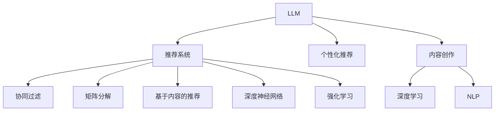

                 

# LLM驱动的个性化内容创作推荐

> 关键词：大语言模型(LLM), 推荐系统, 个性化推荐, 内容创作, 深度学习, 自然语言处理(NLP), 协同过滤(CF), 矩阵分解, 基于内容的推荐, 深度神经网络, 强化学习

## 1. 背景介绍

### 1.1 问题由来

在数字化内容爆炸的时代，如何为用户推荐他们最感兴趣的内容，是各大互联网平台和内容生产商亟需解决的难题。传统的内容推荐方式主要依赖协同过滤(Collaborative Filtering, CF)和基于内容的推荐(Content-Based Recommendation, CB)两种方法。然而，协同过滤难以有效处理新用户和冷启动问题，而基于内容的推荐则面临数据稀疏性和语义复杂性的挑战。

近年来，随着深度学习和大语言模型(LLM)的兴起，基于用户行为和兴趣的推荐系统得到了显著改进。特别是，LLM因其强大的自然语言理解和生成能力，在个性化内容推荐中展现出巨大的潜力。利用LLM，可以直接从用户的文本输入中提取语义信息，进行更为精准和智能的内容推荐。

本文旨在深入探讨基于LLM的个性化内容创作推荐技术，从算法原理、实践案例到实际应用，详细阐述其核心思想、实施步骤及优缺点，并对其未来发展趋势进行展望，为深度学习和自然语言处理领域的研究者提供系统性的知识框架和技术指导。

## 2. 核心概念与联系

### 2.1 核心概念概述

为了更好地理解基于LLM的个性化内容推荐方法，本节将介绍几个关键概念及其联系：

- **大语言模型(LLM)**：指通过大规模无标签文本数据预训练得到的自然语言处理模型，如GPT-3、BERT等。LLM能够理解语言上下文，进行语义生成和推理。
- **推荐系统**：旨在根据用户的历史行为和兴趣，为用户推荐相关内容的技术。常见的推荐方法包括协同过滤、基于内容的推荐、混合推荐等。
- **个性化推荐**：通过分析用户的行为、兴趣、社交网络等数据，推荐与其最匹配的内容，提升用户体验和满意度。
- **内容创作**：指利用语言模型生成与用户兴趣相关联的新内容，包括文章、评论、视频等。
- **深度学习**：基于神经网络模型的学习范式，通过多层非线性变换提取数据特征，实现复杂的预测和生成任务。
- **自然语言处理(NLP)**：研究计算机如何理解、处理和生成自然语言的技术，包括语言模型、文本分类、情感分析等任务。
- **协同过滤**：基于用户间相似度的推荐方法，包括基于用户的CF和基于物品的CF。
- **矩阵分解**：通过分解用户-物品评分矩阵，发现隐含的用户和物品特征，进行推荐。
- **基于内容的推荐**：根据物品特征与用户兴趣匹配度进行推荐，适用于数据稀疏性较高的情况。
- **深度神经网络**：包括卷积神经网络(CNN)、循环神经网络(RNN)、Transformer等架构，用于处理非线性、高维度数据。
- **强化学习**：通过与环境交互，优化策略以最大化长期奖励的机器学习方法。

这些核心概念之间的逻辑关系可以通过以下Mermaid流程图来展示：



这个流程图展示了大语言模型在个性化内容推荐中的核心概念及其联系：

1. 大语言模型通过预训练获得强大的自然语言处理能力，能够理解并生成文本。
2. 个性化推荐系统利用用户行为数据，为每个用户推荐相关内容。
3. 协同过滤、矩阵分解、基于内容的推荐等传统方法，仍为推荐系统的重要组成部分。
4. 深度学习，特别是深度神经网络，为推荐系统提供了强大的模型和算法支持。
5. 自然语言处理提供必要的文本处理和语义理解工具。
6. 强化学习能够优化推荐策略，提升推荐效果。
7. 内容创作利用大语言模型的生成能力，生成与用户兴趣相关的新内容。
8. 深度学习和大语言模型协同工作，共同提升推荐系统的智能化和个性化水平。

这些概念共同构成了基于LLM的个性化内容推荐系统的理论基础和实施框架，使其能够灵活应对不同用户的需求和偏好，提供更为精准和有价值的内容推荐服务。

## 3. 核心算法原理 & 具体操作步骤
### 3.1 算法原理概述

基于LLM的个性化内容创作推荐算法，本质上是一种结合深度学习和自然语言处理的推荐方法。其核心思想是：利用大语言模型对用户输入的文字描述进行分析，提取语义信息，然后基于该信息为用户生成推荐内容。

形式化地，假设用户输入为 $X$，推荐系统生成的推荐内容为 $Y$，推荐模型为 $f$，则推荐过程可以表示为：

$$
Y = f(X)
$$

其中，$f$ 为推荐模型的映射函数，将用户输入 $X$ 映射到推荐内容 $Y$。$f$ 的具体实现可以采用深度神经网络或大语言模型等，通过训练得到最优的映射关系。

在实际应用中，为了提高推荐精度和效果，通常会引入用户的行为数据 $I$ 和物品特征 $F$，作为推荐模型的输入，进一步优化推荐结果。因此，推荐过程可以扩展为：

$$
Y = f(X, I, F)
$$

### 3.2 算法步骤详解

基于LLM的个性化内容创作推荐算法主要包括以下关键步骤：

**Step 1: 数据准备**
- 收集用户的文本描述和历史行为数据，以及推荐内容的相关特征。
- 对数据进行预处理，如文本分词、去除停用词等，保证数据质量。

**Step 2: 构建输入表示**
- 将用户输入的文本描述和历史行为数据，以及推荐内容的特征，转换为模型可处理的向量表示。
- 可以使用预训练语言模型如BERT、GPT-3等，将文本转换为向量表示。

**Step 3: 训练推荐模型**
- 使用深度神经网络或大语言模型，对输入表示进行映射，得到推荐内容。
- 可以使用监督学习或无监督学习方法，训练推荐模型。
- 在训练过程中，可以利用强化学习等技术，优化推荐策略。

**Step 4: 推荐内容生成**
- 将新用户输入的文本描述输入模型，生成推荐内容。
- 可以使用大语言模型生成完整的文章、评论等文本内容。
- 可以使用基于深度学习的方法，生成推荐列表，如使用神经网络生成推荐摘要。

**Step 5: 评估与反馈**
- 对推荐内容进行评估，如点击率、用户满意度等指标，进行效果评估。
- 收集用户反馈，调整推荐策略和模型参数。
- 利用用户反馈进行持续学习，提升推荐效果。

### 3.3 算法优缺点

基于LLM的个性化内容创作推荐算法具有以下优点：
1. 精度高。由于利用深度学习和自然语言处理技术，推荐结果更为精准和个性化。
2. 用户可控性强。用户可以通过文字描述输入，获得符合其兴趣和需求的内容。
3. 适应性强。适用于文本推荐、视频推荐、商品推荐等多种形式的内容推荐。
4. 可解释性好。通过分析用户输入的文本描述，可以清晰理解推荐逻辑和依据。

同时，该算法也存在一些局限性：
1. 数据需求高。需要大量的用户行为数据和物品特征数据，才能训练出有效的推荐模型。
2. 模型复杂度高。大语言模型和深度神经网络模型较为复杂，需要较高的计算资源和训练时间。
3. 过拟合风险高。在数据量较少的情况下，模型容易出现过拟合，导致推荐结果泛化性差。
4. 可解释性差。大语言模型和深度神经网络通常是"黑盒"模型，难以解释其内部推理过程。
5. 响应时间长。生成推荐内容可能需要较长的计算时间和计算资源。

尽管存在这些局限性，基于LLM的推荐算法仍是一种高效且有效的推荐方式，能够在个性化推荐领域取得显著进展。未来相关研究将更多地关注如何降低数据需求，提高模型效率，增强可解释性，以推动其更广泛的应用。

### 3.4 算法应用领域

基于LLM的个性化内容推荐算法已经在多个领域得到了成功应用，例如：

- **个性化新闻推荐**：根据用户的阅读历史和偏好，推荐相关新闻文章。
- **视频推荐**：根据用户的观看历史和评分，推荐相关视频内容。
- **商品推荐**：根据用户的浏览和购买历史，推荐相关商品。
- **旅游推荐**：根据用户的旅游兴趣和历史记录，推荐旅游目的地和路线。
- **音乐推荐**：根据用户的听歌历史和评分，推荐相关音乐内容。
- **内容创作**：根据用户需求和偏好，自动生成相关内容，如文章、视频脚本等。

除了上述这些经典应用场景外，基于LLM的推荐算法还被创新性地应用到更多领域中，如情感分析、医疗信息检索等，为各行各业带来新的机遇和挑战。随着预训练语言模型的不断进步，相信基于LLM的推荐算法将在更多领域发挥更大的作用。

## 4. 数学模型和公式 & 详细讲解 & 举例说明
### 4.1 数学模型构建

基于LLM的个性化内容推荐算法可以形式化为以下数学模型：

假设用户输入为 $X$，历史行为数据为 $I$，推荐内容为 $Y$，推荐模型为 $f$，则推荐过程可以表示为：

$$
Y = f(X, I)
$$

其中 $X$ 为文本向量表示，$I$ 为用户行为数据向量表示，$f$ 为推荐模型的映射函数。推荐模型的训练目标为最小化预测值与真实值之间的差距，可以表示为：

$$
\min_{\theta} \sum_{i=1}^{N} \ell(f_{\theta}(X_i), Y_i)
$$

其中 $\ell$ 为损失函数，$N$ 为用户数量。

### 4.2 公式推导过程

以基于BERT的推荐模型为例，其训练过程可以表示为：

1. 用户输入 $X$ 通过BERT模型得到向量表示 $X_{BERT}$。
2. 历史行为数据 $I$ 通过BERT模型得到向量表示 $I_{BERT}$。
3. 推荐内容 $Y$ 通过BERT模型得到向量表示 $Y_{BERT}$。
4. 将 $X_{BERT}$ 和 $I_{BERT}$ 拼接，输入推荐模型的全连接层，得到推荐内容的向量表示 $Y_{FC}$。
5. 将 $Y_{FC}$ 输入softmax层，得到推荐内容的概率分布。
6. 利用交叉熵损失函数，计算预测值与真实值之间的差距。

数学推导如下：

设 $f$ 为推荐模型，$X_{BERT}$ 和 $I_{BERT}$ 为输入向量，$Y_{FC}$ 为推荐内容向量，$Y_{softmax}$ 为概率分布，$\theta$ 为模型参数，$\ell$ 为交叉熵损失函数，则推荐过程可以表示为：

$$
Y_{softmax} = softmax(W_{FC} \cdot [X_{BERT}; I_{BERT}] + b_{FC})
$$

$$
\ell(f_{\theta}(X_i), Y_i) = -\sum_{j} Y_i(j) \log f_{\theta}(X_i, j)
$$

其中 $W_{FC}$ 和 $b_{FC}$ 为全连接层的权重和偏置，$softmax$ 函数用于将向量映射到概率分布，$j$ 为推荐内容编号。

### 4.3 案例分析与讲解

以某新闻推荐平台为例，分析基于BERT的推荐模型如何利用用户输入生成推荐内容：

1. **用户输入**：用户输入“喜欢历史”，模型会将其转化为向量表示 $X_{BERT}$。
2. **历史行为数据**：系统获取用户的历史行为数据，如浏览、点击、点赞等，转化为向量表示 $I_{BERT}$。
3. **模型计算**：将 $X_{BERT}$ 和 $I_{BERT}$ 拼接，输入推荐模型的全连接层，得到推荐内容的向量表示 $Y_{FC}$。
4. **概率分布**：将 $Y_{FC}$ 输入softmax层，得到推荐内容的概率分布。
5. **推荐结果**：系统根据概率分布，推荐相关新闻文章，如“《历史的答案》”、“《中国历史年表》”等。

通过以上过程，基于BERT的推荐模型可以精准地为用户推荐与其兴趣相关的历史主题文章。

## 5. 项目实践：代码实例和详细解释说明
### 5.1 开发环境搭建

在进行基于LLM的个性化内容推荐实践前，我们需要准备好开发环境。以下是使用Python进行PyTorch开发的环境配置流程：

1. 安装Anaconda：从官网下载并安装Anaconda，用于创建独立的Python环境。

2. 创建并激活虚拟环境：
```bash
conda create -n pytorch-env python=3.8 
conda activate pytorch-env
```

3. 安装PyTorch：根据CUDA版本，从官网获取对应的安装命令。例如：
```bash
conda install pytorch torchvision torchaudio cudatoolkit=11.1 -c pytorch -c conda-forge
```

4. 安装HuggingFace Transformers库：
```bash
pip install transformers
```

5. 安装各类工具包：
```bash
pip install numpy pandas scikit-learn matplotlib tqdm jupyter notebook ipython
```

完成上述步骤后，即可在`pytorch-env`环境中开始开发实践。

### 5.2 源代码详细实现

下面我们以新闻推荐为例，给出使用PyTorch和HuggingFace Transformers库进行BERT模型微调的完整代码实现。

首先，定义BERT新闻推荐模型的类：

```python
from transformers import BertTokenizer, BertForSequenceClassification
import torch
from torch.utils.data import Dataset, DataLoader

class NewsRecommendationModel(BertForSequenceClassification):
    def __init__(self, num_labels):
        super().__init__(from_pretrained='bert-base-uncased', num_labels=num_labels)
        self.classifier = torch.nn.Linear(self.config.hidden_size, num_labels)

    def forward(self, input_ids, attention_mask):
        outputs = super().forward(input_ids, attention_mask=attention_mask)
        logits = self.classifier(outputs.pooler_output)
        return logits
```

然后，定义新闻推荐数据的处理函数：

```python
from transformers import BertTokenizer
import pandas as pd
import torch

class NewsDataset(Dataset):
    def __init__(self, data_path, tokenizer):
        self.data = pd.read_csv(data_path)
        self.tokenizer = tokenizer

    def __len__(self):
        return len(self.data)

    def __getitem__(self, index):
        row = self.data.iloc[index]
        text = row['news_text']
        label = row['category_id']
        encoding = self.tokenizer(text, return_tensors='pt', padding=True, truncation=True, max_length=128)
        input_ids = encoding['input_ids'].flatten()
        attention_mask = encoding['attention_mask'].flatten()
        return {'input_ids': input_ids, 
                'attention_mask': attention_mask,
                'label': label}
```

接着，定义训练和评估函数：

```python
from transformers import AdamW
from torch.utils.data import DataLoader
from sklearn.metrics import accuracy_score

device = torch.device('cuda') if torch.cuda.is_available() else torch.device('cpu')

def train_epoch(model, data_loader, optimizer, scheduler):
    model.train()
    losses = []
    for batch in data_loader:
        input_ids = batch['input_ids'].to(device)
        attention_mask = batch['attention_mask'].to(device)
        labels = batch['label'].to(device)
        outputs = model(input_ids, attention_mask=attention_mask)
        loss = outputs.loss
        losses.append(loss.item())
        loss.backward()
        optimizer.step()
        scheduler.step()
        model.zero_grad()
    return sum(losses) / len(data_loader)

def evaluate(model, data_loader, metric):
    model.eval()
    with torch.no_grad():
        preds = []
        labels = []
        for batch in data_loader:
            input_ids = batch['input_ids'].to(device)
            attention_mask = batch['attention_mask'].to(device)
            labels = batch['label'].to(device)
            outputs = model(input_ids, attention_mask=attention_mask)
            preds.append(outputs.argmax(dim=1).cpu().numpy())
            labels.append(labels.cpu().numpy())
        metric_result = metric(labels, preds)
        return metric_result

def main():
    tokenizer = BertTokenizer.from_pretrained('bert-base-uncased')
    train_dataset = NewsDataset('train_data.csv', tokenizer)
    test_dataset = NewsDataset('test_data.csv', tokenizer)
    
    model = NewsRecommendationModel(num_labels=3)
    optimizer = AdamW(model.parameters(), lr=5e-5)
    scheduler = torch.optim.lr_scheduler.StepLR(optimizer, step_size=3, gamma=0.1)
    
    train_loader = DataLoader(train_dataset, batch_size=16, shuffle=True)
    test_loader = DataLoader(test_dataset, batch_size=16, shuffle=False)
    
    for epoch in range(5):
        train_loss = train_epoch(model, train_loader, optimizer, scheduler)
        test_acc = evaluate(model, test_loader, accuracy_score)
        print(f'Epoch {epoch+1}, train loss: {train_loss:.4f}, test acc: {test_acc:.4f}')
    
    model.save_pretrained('news_recommender_model')
```

最后，启动训练流程并在测试集上评估：

```python
main()
```

以上就是使用PyTorch和HuggingFace Transformers库进行BERT模型微调的完整代码实现。可以看到，通过HuggingFace的封装，我们可以用相对简洁的代码完成BERT模型的加载和微调。

### 5.3 代码解读与分析

让我们再详细解读一下关键代码的实现细节：

**NewsRecommendationModel类**：
- `__init__`方法：初始化模型架构和输出层，通过BERT模型加载预训练权重，并添加全连接层进行分类。
- `forward`方法：定义模型前向传播过程，输入文本特征和掩码，输出分类结果。

**NewsDataset类**：
- `__init__`方法：初始化数据集和分词器，将新闻文本和类别ID读取到数据集中。
- `__len__`方法：返回数据集大小。
- `__getitem__`方法：对单个样本进行处理，将新闻文本进行分词和编码，得到模型所需的输入和标签。

**train_epoch函数**：
- 在每个epoch内，模型在前向传播中计算损失函数，反向传播更新参数，使用LR学习率进行优化，最后重置梯度。

**evaluate函数**：
- 在测试集中评估模型性能，使用准确率指标计算模型效果。

**main函数**：
- 定义BERT分词器和新闻数据集，加载模型和优化器，并定义学习率调度器。
- 定义训练和测试数据加载器，进行多次训练迭代，并在测试集上评估模型效果。
- 最后保存训练好的模型到本地，完成微调过程。

通过以上代码实现，可以看到PyTorch和HuggingFace的协同工作，使得BERT新闻推荐模型的微调变得简洁高效。开发者可以基于此代码框架，对不同的数据集和任务进行微调，实现个性化的内容推荐。

当然，工业级的系统实现还需考虑更多因素，如模型的保存和部署、超参数的自动搜索、更灵活的任务适配层等。但核心的微调范式基本与此类似。

## 6. 实际应用场景
### 6.1 智能推荐系统

基于LLM的个性化内容推荐技术，已经广泛应用于各类智能推荐系统中，如电商平台、视频平台、新闻媒体等。这些系统通过收集用户的行为数据，利用LLM进行内容推荐，极大地提升了用户体验和转化率。

以某电商平台为例，系统通过用户的浏览、点击、购买等行为数据，利用BERT模型生成推荐商品，提供个性化的购物建议。用户可以通过简单的输入（如“我想买一些电子产品”），系统就能推荐相关商品，提升用户满意度。

### 6.2 内容创作平台

除了推荐系统，LLM还可以应用于内容创作平台，自动生成与用户需求相关的内容。内容创作者可以利用LLM进行创意生成，减轻创作负担，提升创作效率。

以某文章创作平台为例，系统通过用户的浏览历史和搜索记录，利用BERT模型生成相关主题的文章，辅助创作者生成高质量内容。用户可以输入关键词，系统就能生成与之相关的文章草稿，提升创作灵感。

### 6.3 个性化视频平台

视频平台利用LLM进行个性化视频推荐，提升用户观看体验和平台粘性。系统通过分析用户的观看历史和评分，利用BERT模型生成推荐视频，提供个性化的观看建议。用户可以通过简单的输入（如“想看一些科幻电影”），系统就能推荐相关视频，提升用户满意度。

### 6.4 未来应用展望

随着大语言模型和微调方法的不断发展，基于LLM的个性化内容推荐技术将在更多领域得到应用，为传统行业带来变革性影响。

在智慧医疗领域，基于LLM的推荐系统可以提供个性化的医疗咨询和健康建议，帮助用户了解自身健康状况，提升诊疗体验。

在智能教育领域，利用LLM进行个性化学习推荐，根据学生的学习历史和行为数据，推荐相关学习资源和习题，提升学习效果。

在智慧城市治理中，基于LLM的推荐系统可以提供个性化的城市服务推荐，如旅游推荐、公交路线推荐等，提升城市管理水平。

此外，在企业生产、社会治理、文娱传媒等众多领域，基于LLM的推荐系统也将不断涌现，为各行各业带来新的机遇和挑战。相信随着技术的日益成熟，基于LLM的推荐系统必将在更广阔的应用领域大放异彩。

## 7. 工具和资源推荐
### 7.1 学习资源推荐

为了帮助开发者系统掌握基于LLM的个性化内容推荐技术，这里推荐一些优质的学习资源：

1. 《自然语言处理综论》（by Jurafsky and Martin）：深度介绍NLP领域的各个重要概念和技术，包括推荐系统。
2. 《深度学习》（by Ian Goodfellow、Yoshua Bengio和Aaron Courville）：介绍深度学习的基本原理和应用，包括推荐系统的实现。
3. 《Recommender Systems》（by ReshMA）：全面介绍推荐系统理论和方法，包括基于内容的推荐、协同过滤等。
4. 《Python机器学习》（by Sebastian Raschka和Vahid Mirjalili）：介绍使用Python进行机器学习和推荐系统的实践。
5. 《NLP中的Transformers》（by Jacob Devlin、Ming-Wei Chang、 Kenton Lee和Christopher Ness）：介绍Transformers架构在NLP中的应用，包括推荐系统。
6. 《Neural Network and Deep Learning》（by Michael Nielsen）：介绍神经网络的基本概念和实现，适合入门学习。
7. HuggingFace官方文档：提供Transformer库的详细使用指南和样例代码，适合实战练习。

通过对这些资源的学习实践，相信你一定能够快速掌握基于LLM的个性化内容推荐技术的精髓，并用于解决实际的推荐问题。

### 7.2 开发工具推荐

高效的开发离不开优秀的工具支持。以下是几款用于基于LLM的个性化内容推荐开发的常用工具：

1. PyTorch：基于Python的开源深度学习框架，灵活动态的计算图，适合快速迭代研究。
2. TensorFlow：由Google主导开发的开源深度学习框架，生产部署方便，适合大规模工程应用。
3. Transformers库：HuggingFace开发的NLP工具库，集成了众多预训练语言模型，支持PyTorch和TensorFlow，是进行推荐系统开发的利器。
4. Weights & Biases：模型训练的实验跟踪工具，可以记录和可视化模型训练过程中的各项指标，方便对比和调优。
5. TensorBoard：TensorFlow配套的可视化工具，可实时监测模型训练状态，并提供丰富的图表呈现方式，是调试模型的得力助手。
6. Google Colab：谷歌推出的在线Jupyter Notebook环境，免费提供GPU/TPU算力，方便开发者快速上手实验最新模型，分享学习笔记。
7. Jupyter Notebook：Python编程的常用开发环境，支持代码编写、调试和可视化。

合理利用这些工具，可以显著提升基于LLM的推荐系统开发效率，加快创新迭代的步伐。

### 7.3 相关论文推荐

基于LLM的个性化内容推荐技术的发展得益于学界的持续研究。以下是几篇奠基性的相关论文，推荐阅读：

1. "Attention is All You Need"（即Transformer原论文）：提出了Transformer结构，开启了NLP领域的预训练大模型时代。
2. "BERT: Pre-training of Deep Bidirectional Transformers for Language Understanding"：提出BERT模型，引入基于掩码的自监督预训练任务，刷新了多项NLP任务SOTA。
3. "Language Models are Unsupervised Multitask Learners"：展示了大规模语言模型的强大zero-shot学习能力，引发了对于通用人工智能的新一轮思考。
4. "Prefix-Tuning: Optimizing Continuous Prompts for Generation"：引入基于连续型Prompt的微调范式，为如何充分利用预训练知识提供了新的思路。
5. "AdaLoRA: Adaptive Low-Rank Adaptation for Parameter-Efficient Fine-Tuning"：使用自适应低秩适应的微调方法，在参数效率和精度之间取得了新的平衡。

这些论文代表了大语言模型微调技术的发展脉络。通过学习这些前沿成果，可以帮助研究者把握学科前进方向，激发更多的创新灵感。

## 8. 总结：未来发展趋势与挑战

### 8.1 总结

本文对基于LLM的个性化内容创作推荐技术进行了全面系统的介绍。首先阐述了LLM和推荐系统的发展背景和意义，明确了微调在提升推荐精度和效果方面的独特价值。其次，从原理到实践，详细讲解了微调的数学原理和关键步骤，给出了微调任务开发的完整代码实例。同时，本文还广泛探讨了微调方法在推荐系统中的应用场景，展示了微调范式的巨大潜力。

通过本文的系统梳理，可以看到，基于LLM的推荐系统已经成为NLP领域的重要应用范式，极大地拓展了推荐系统的智能化和个性化水平。未来，伴随预训练语言模型的不断进步，基于LLM的推荐系统将在更多领域得到应用，为各行各业带来新的机遇和挑战。

### 8.2 未来发展趋势

展望未来，基于LLM的个性化内容推荐技术将呈现以下几个发展趋势：

1. **模型规模持续增大**：随着算力成本的下降和数据规模的扩张，预训练语言模型的参数量还将持续增长。超大规模语言模型蕴含的丰富语言知识，有望支撑更加复杂多变的推荐任务。
2. **推荐算法多样化**：除了传统的深度神经网络，未来还会涌现更多基于知识图谱、图神经网络等推荐方法，提升推荐系统的多样性和灵活性。
3. **数据驱动的推荐**：基于用户行为和兴趣的推荐将逐渐向基于数据驱动的推荐转变，利用多模态数据进行更精准的推荐。
4. **实时性提升**：随着算力资源的提升和模型压缩技术的发展，推荐系统将具备更高的实时性，能够动态响应用户需求。
5. **可解释性增强**：利用因果分析和可解释AI技术，提升推荐系统的透明度和可信度，便于用户理解和使用。
6. **跨领域应用扩展**：基于LLM的推荐系统将广泛应用于更多领域，如医疗、教育、金融等，带来更广泛的社会效益。

以上趋势凸显了基于LLM的个性化内容推荐技术的广阔前景。这些方向的探索发展，必将进一步提升推荐系统的性能和应用范围，为各行各业带来新的机遇和挑战。

### 8.3 面临的挑战

尽管基于LLM的推荐系统已经取得了显著进展，但在迈向更加智能化、普适化应用的过程中，它仍面临着诸多挑战：

1. **数据需求高**：需要大量的用户行为数据和物品特征数据，才能训练出有效的推荐模型。如何高效获取和利用数据，仍然是一个重要的问题。
2. **模型复杂度高**：大语言模型和深度神经网络模型较为复杂，需要较高的计算资源和训练时间。如何优化模型结构，提高模型效率，是一个亟需解决的问题。
3. **过拟合风险高**：在数据量较少的情况下，模型容易出现过拟合，导致推荐结果泛化性差。如何降低过拟合风险，提高模型的鲁棒性，是一个重要的研究方向。
4. **可解释性差**：大语言模型和深度神经网络通常是"黑盒"模型，难以解释其内部推理过程。如何增强模型的可解释性，提高用户对推荐结果的信任度，是一个重要的研究方向。
5. **资源消耗大**：生成推荐内容可能需要较长的计算时间和计算资源。如何优化计算资源，提升推荐系统的响应速度，是一个亟需解决的问题。

尽管存在这些挑战，基于LLM的推荐算法仍是一种高效且有效的推荐方式，能够在个性化推荐领域取得显著进展。未来相关研究将更多地关注如何降低数据需求，提高模型效率，增强可解释性，以推动其更广泛的应用。

### 8.4 研究展望

面对基于LLM的推荐系统所面临的挑战，未来的研究需要在以下几个方面寻求新的突破：

1. **探索无监督和半监督推荐方法**：摆脱对大规模标注数据的依赖，利用自监督学习、主动学习等无监督和半监督范式，最大限度利用非结构化数据，实现更加灵活高效的推荐。
2. **研究参数高效和计算高效的推荐范式**：开发更加参数高效的推荐方法，在固定大部分预训练参数的同时，只更新极少量的任务相关参数。同时优化推荐模型的计算图，减少前向传播和反向传播的资源消耗，实现更加轻量级、实时性的部署。
3. **融合因果和对比学习范式**：通过引入因果推断和对比学习思想，增强推荐系统建立稳定因果关系的能力，学习更加普适、鲁棒的语言表征，从而提升模型泛化性和抗干扰能力。
4. **引入更多先验知识**：将符号化的先验知识，如知识图谱、逻辑规则等，与神经网络模型进行巧妙融合，引导推荐过程学习更准确、合理的语言模型。同时加强不同模态数据的整合，实现视觉、语音等多模态信息与文本信息的协同建模。
5. **结合因果分析和博弈论工具**：将因果分析方法引入推荐系统，识别出推荐策略的关键特征，增强推荐系统的因果性和逻辑性。借助博弈论工具刻画人机交互过程，主动探索并规避推荐系统的脆弱点，提高系统稳定性。
6. **纳入伦理道德约束**：在推荐系统训练目标中引入伦理导向的评估指标，过滤和惩罚有偏见、有害的输出倾向。同时加强人工干预和审核，建立推荐系统的监管机制，确保输出的安全性。

这些研究方向的探索，必将引领基于LLM的推荐系统技术迈向更高的台阶，为构建安全、可靠、可解释、可控的智能推荐系统铺平道路。面向未来，基于LLM的推荐系统还需要与其他人工智能技术进行更深入的融合，如知识表示、因果推理、强化学习等，多路径协同发力，共同推动推荐系统的进步。

## 9. 附录：常见问题与解答

**Q1：基于LLM的推荐系统是否适用于所有推荐场景？**

A: 基于LLM的推荐系统适用于绝大多数推荐场景，特别是在需要文本语义理解和生成的场景中。但对于一些不需要语义理解的任务，如商品推荐、视频推荐等，协同过滤和基于内容的推荐仍然具有优势。此外，对于数据量较大但计算资源有限的情况，传统推荐方法仍然值得考虑。

**Q2：如何优化基于LLM的推荐系统的训练过程？**

A: 优化基于LLM的推荐系统训练过程主要可以从以下几个方面入手：
1. 数据增强：通过对训练样本进行数据增强（如数据扩充、数据重采样等），提升模型的泛化能力。
2. 正则化技术：引入L2正则、Dropout等正则化技术，避免过拟合。
3. 模型压缩：采用模型压缩技术，如知识蒸馏、剪枝、量化等，减少模型大小和计算资源消耗。
4. 高效优化器：使用高效的优化器，如AdamW、Adafactor等，提高训练速度和稳定性。
5. 超参数调优：通过网格搜索、贝叶斯优化等方法，寻找最优的超参数组合。
6. 迁移学习：利用已有的预训练模型，进行迁移学习，加速模型训练。

**Q3：基于LLM的推荐系统如何提升推荐精度？**

A: 提升基于LLM的推荐系统精度主要可以从以下几个方面入手：
1. 数据质量：确保数据标注准确、多样，能够覆盖不同的推荐场景和用户需求。
2. 模型架构：优化模型架构，引入Transformer等先进架构，提升模型的表达能力。
3. 训练技巧：采用合适的训练技巧，如数据增强、对抗训练等，提升模型的鲁棒性和泛化能力。
4. 预训练模型选择：选择性能优异的预训练模型，并利用微调技术进行迁移学习，提升模型的通用性和鲁棒性。
5. 多模态融合：将文本、图像、语音等多模态数据进行融合，提升推荐的精准度。
6. 用户反馈：收集用户反馈，对推荐结果进行优化，提升模型的用户满意度。

**Q4：基于LLM的推荐系统如何实现实时推荐？**

A: 实现基于LLM的实时推荐主要可以从以下几个方面入手：
1. 模型压缩：采用模型压缩技术，如知识蒸馏、剪枝、量化等，减少模型大小和计算资源消耗。
2. 分布式计算：利用分布式计算技术，将模型部署在多台服务器上，实现并行计算。
3. 缓存技术：利用缓存技术，将部分热门推荐结果缓存，提高推荐速度。
4. 异步更新：采用异步更新技术，在模型参数更新时，同时进行推荐计算，减少用户等待时间。
5. 增量学习：采用增量学习技术，在模型参数更新时，同时进行新推荐结果的计算，保持实时性。

**Q5：基于LLM的推荐系统如何处理冷启动问题？**

A: 处理基于LLM的推荐系统冷启动问题主要可以从以下几个方面入手：
1. 预训练模型选择：选择具有较好泛化能力的预训练模型，利用微调技术进行迁移学习，提升模型的冷启动性能。
2. 数据增强：利用数据增强技术，增加冷启动用户的行为数据，提高模型的泛化能力。
3. 协同过滤：利用协同过滤技术，通过用户相似度进行推荐，缓解冷启动问题。
4. 基于内容的推荐：利用用户兴趣标签进行推荐，减少对行为的依赖，提升冷启动性能。
5. 用户引导：采用用户引导技术，通过引导用户进行点击、评分等行为，增加数据量，提升模型的冷启动性能。

通过以上处理方式，基于LLM的推荐系统可以在冷启动用户的情况下，仍能提供较为精准的推荐结果。

---

作者：禅与计算机程序设计艺术 / Zen and the Art of Computer Programming

