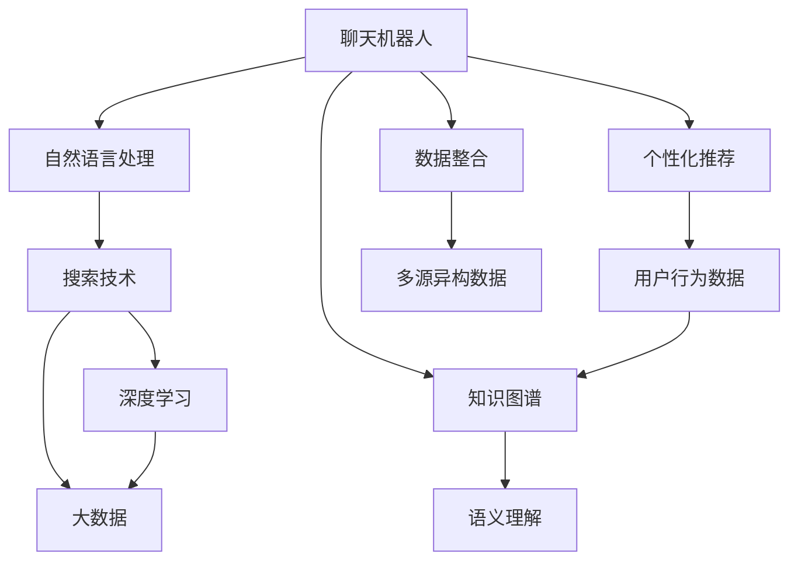

                 

# Lepton AI的产品矩阵：从聊天到搜索

## 1. 背景介绍

### 1.1 问题由来
在人工智能(AI)和自然语言处理(NLP)领域，语言模型已经取得了显著的进步。聊天机器人和搜索技术作为其中两个重要的应用方向，近年来也在不断演进，呈现出前所未有的发展趋势。Lepton AI作为AI领域的佼佼者，其产品矩阵涵盖了这两个重要方向，并在此基础上不断扩展新的应用场景。本文将从这两个产品出发，深入探讨其技术原理、应用场景以及未来发展趋势。

### 1.2 问题核心关键点
Lepton AI的产品矩阵主要包括以下几个核心关键点：
- **聊天机器人**：通过自然语言处理技术，实现人机对话，解决客户服务、信息查询、情感陪伴等问题。
- **搜索技术**：利用深度学习和大数据技术，提升搜索结果的精准性和相关性，解决信息获取难、搜索结果不相关等问题。
- **数据整合**：通过语义理解和知识图谱技术，整合多源异构数据，实现信息的高效检索和查询。
- **用户个性化**：通过用户行为数据，实现搜索和对话的个性化推荐，提升用户体验。
- **知识表示**：通过符号化知识与神经网络的结合，提升语言模型的语义理解能力。

这些关键点不仅构成了Lepton AI产品矩阵的核心，也指明了未来的发展方向和应用前景。

### 1.3 问题研究意义
研究Lepton AI的产品矩阵，对于理解AI和NLP技术在实际应用中的演进，以及未来AI技术的走向具有重要意义：

1. **技术演进**：通过分析Lepton AI的产品矩阵，可以了解AI和NLP技术的最新进展，从而把握技术的演进趋势。
2. **应用推广**：Lepton AI的产品矩阵覆盖了多个应用场景，分析其技术原理和应用效果，可以推动AI技术在更多行业中的应用。
3. **用户体验提升**：通过对聊天机器人和搜索技术的深入研究，可以提升用户在使用这些AI产品时的体验，增强用户粘性。
4. **行业转型**：AI技术正在改变各行各业，通过分析Lepton AI的产品矩阵，可以洞察AI技术对行业转型升级的推动作用。

## 2. 核心概念与联系

### 2.1 核心概念概述

为更好地理解Lepton AI的产品矩阵，本节将介绍几个密切相关的核心概念：

- **聊天机器人**：基于自然语言处理技术，能够通过对话理解用户意图，并提供相应的回复或操作。
- **搜索技术**：利用深度学习和大数据技术，提升搜索结果的精准性和相关性，解决信息获取难、搜索结果不相关等问题。
- **知识图谱**：通过语义理解和符号化知识表示，构建实体之间的关系网络，提升语言模型的语义理解能力。
- **个性化推荐**：根据用户行为数据，实现搜索和对话的个性化推荐，提升用户体验。
- **数据整合**：通过语义理解和知识图谱技术，整合多源异构数据，实现信息的高效检索和查询。

这些核心概念之间的逻辑关系可以通过以下Mermaid流程图来展示：



这个流程图展示了大语言模型的核心概念及其之间的关系：

1. 聊天机器人基于自然语言处理技术，通过对话理解用户意图，并提供相应的回复或操作。
2. 搜索技术利用深度学习和大数据技术，提升搜索结果的精准性和相关性。
3. 知识图谱通过语义理解和符号化知识表示，构建实体之间的关系网络。
4. 个性化推荐根据用户行为数据，实现搜索和对话的个性化推荐。
5. 数据整合通过语义理解和知识图谱技术，整合多源异构数据，实现信息的高效检索和查询。

这些概念共同构成了Lepton AI产品矩阵的技术基础，使得AI技术能够更广泛地应用于实际场景中。

## 3. 核心算法原理 & 具体操作步骤
### 3.1 算法原理概述

Lepton AI的产品矩阵主要基于以下几个核心算法原理：

- **深度学习**：通过神经网络模型，实现从输入到输出的映射，提升模型的预测能力和泛化能力。
- **自然语言处理**：通过语言模型、分词、词向量等技术，实现文本信息的语义理解、情感分析、实体识别等。
- **知识图谱**：通过语义理解和符号化知识表示，构建实体之间的关系网络，提升语言模型的语义理解能力。
- **推荐系统**：通过用户行为数据和协同过滤算法，实现搜索和对话的个性化推荐。
- **数据整合**：通过语义理解和知识图谱技术，整合多源异构数据，实现信息的高效检索和查询。

### 3.2 算法步骤详解

Lepton AI的产品矩阵主要包括以下几个关键步骤：

**Step 1: 准备数据集**
- 收集和预处理用于训练和测试的数据集，如对话记录、查询请求、商品信息等。
- 进行文本清洗、分词、实体识别等预处理操作，构建训练集和测试集。

**Step 2: 构建模型**
- 选择合适的深度学习模型，如LSTM、GRU、Transformer等，构建聊天机器人或搜索模型。
- 对模型进行超参数调优，如学习率、批大小、训练轮数等。

**Step 3: 训练模型**
- 将数据集划分为训练集、验证集和测试集，进行模型训练。
- 在训练过程中，定期在验证集上评估模型性能，调整超参数，防止过拟合。
- 训练结束后，在测试集上评估模型性能，进行最终的优化调整。

**Step 4: 部署模型**
- 将训练好的模型部署到服务器或云平台上，进行实时服务。
- 针对不同的应用场景，优化模型的推理速度和资源占用。
- 提供API接口，方便用户调用和集成。

**Step 5: 优化用户体验**
- 根据用户反馈，不断优化模型性能，提升用户体验。
- 利用个性化推荐和知识图谱技术，增强用户粘性和满意度。
- 结合用户行为数据，进行动态调参，提升模型效果。

### 3.3 算法优缺点

Lepton AI的产品矩阵主要具有以下优点：
1. **通用性强**：聊天机器人和搜索技术可以应用于各种场景，解决客户服务、信息查询、情感陪伴等问题。
2. **精度高**：深度学习和大数据技术提升了模型的预测能力和泛化能力，搜索结果更加精准和相关。
3. **个性化推荐**：根据用户行为数据，实现搜索和对话的个性化推荐，提升用户体验。
4. **数据整合能力**：通过语义理解和知识图谱技术，整合多源异构数据，实现信息的高效检索和查询。

同时，该方法也存在一定的局限性：
1. **依赖数据质量**：模型性能受数据质量和数量影响较大，需要高质量的标注数据和多样化的训练数据。
2. **计算资源消耗大**：深度学习模型需要大量的计算资源，包括GPU、TPU等高性能设备，以及大规模的数据集。
3. **模型可解释性差**：深度学习模型通常被视为"黑盒"，难以解释其内部工作机制和决策逻辑。
4. **模型泛化能力有限**：在大规模数据上训练的模型在小规模数据上泛化能力有限，需要更多的迁移学习技术。

尽管存在这些局限性，但Lepton AI的产品矩阵仍然是大语言模型应用的主流范式，其高效、精确和个性化的特点，使其在实际应用中具有广泛的价值。

### 3.4 算法应用领域

Lepton AI的产品矩阵已经广泛应用于多个领域，具体包括：

- **客户服务**：通过聊天机器人，提供7x24小时不间断服务，解决用户咨询、投诉等问题，提升客户满意度。
- **信息检索**：通过搜索技术，实现信息的高效检索和查询，帮助用户快速获取所需信息。
- **情感分析**：通过自然语言处理技术，分析用户情感倾向，提供情感陪伴和心理支持。
- **个性化推荐**：根据用户行为数据，实现搜索和对话的个性化推荐，提升用户体验。
- **多源数据整合**：通过语义理解和知识图谱技术，整合多源异构数据，实现信息的高效检索和查询。

除了这些经典应用外，Lepton AI的产品矩阵还在智慧医疗、智能家居、教育培训等多个领域展现出巨大的应用潜力。

## 4. 数学模型和公式 & 详细讲解 & 举例说明

### 4.1 数学模型构建

为了更好地理解Lepton AI的产品矩阵，我们将从数学模型角度进行详细讲解。

记聊天机器人为 $M_{\theta}:\mathcal{X} \rightarrow \mathcal{Y}$，其中 $\mathcal{X}$ 为输入文本，$\mathcal{Y}$ 为输出文本。假设输入为 $x$，输出为 $y$。

**优化目标**：最小化损失函数 $\mathcal{L}(\theta)$，使得模型在对话序列上生成的文本与真实文本 $y$ 最接近。

**损失函数**：常用的损失函数包括交叉熵损失、均方误差损失等。这里以交叉熵损失为例：

$$
\mathcal{L}(\theta) = -\frac{1}{N}\sum_{i=1}^N \sum_{t=1}^{T} y_{it}\log M_{\theta}(x_t)
$$

其中 $y_{it}$ 为输入 $x$ 在第 $t$ 步生成的真实文本，$M_{\theta}(x_t)$ 为模型在输入 $x$ 上生成的文本。

**模型训练**：使用反向传播算法，通过梯度下降等优化算法，最小化损失函数 $\mathcal{L}(\theta)$，更新模型参数 $\theta$。

### 4.2 公式推导过程

接下来，我们将以聊天机器人为例，推导优化目标函数和梯度更新公式。

假设聊天机器人模型为Transformer，其编码器和解码器结构相同。在训练过程中，使用多步骤解码器（如CTC Loss）进行训练，优化目标函数为：

$$
\mathcal{L}(\theta) = -\sum_{i=1}^N \sum_{t=1}^{T} y_{it}\log M_{\theta}(x_t)
$$

其中 $y_{it}$ 为输入 $x$ 在第 $t$ 步生成的真实文本，$M_{\theta}(x_t)$ 为模型在输入 $x$ 上生成的文本。

根据链式法则，损失函数对参数 $\theta_k$ 的梯度为：

$$
\frac{\partial \mathcal{L}(\theta)}{\partial \theta_k} = -\frac{1}{N}\sum_{i=1}^N \sum_{t=1}^{T} y_{it} \frac{\partial M_{\theta}(x_t)}{\partial \theta_k}
$$

其中 $\frac{\partial M_{\theta}(x_t)}{\partial \theta_k}$ 可进一步递归展开，利用自动微分技术完成计算。

在得到损失函数的梯度后，即可带入参数更新公式，完成模型的迭代优化。重复上述过程直至收敛，最终得到适应对话任务的最优模型参数 $\theta^*$。

### 4.3 案例分析与讲解

为了更好地理解这些数学模型和公式，我们将以一个具体的案例进行讲解：

假设我们有一个简单的聊天机器人模型，用于回答用户的问候。在训练过程中，我们使用交叉熵损失函数，目标是最小化损失函数 $\mathcal{L}(\theta)$，使得模型生成的回答与真实回答 $y$ 最接近。

我们首先定义输入 $x$ 和输出 $y$：

- 输入 $x$：用户的问候文本。
- 输出 $y$：模型的回答文本。

然后，我们使用Transformer模型进行训练，最小化损失函数 $\mathcal{L}(\theta)$：

$$
\mathcal{L}(\theta) = -\frac{1}{N}\sum_{i=1}^N \sum_{t=1}^{T} y_{it}\log M_{\theta}(x_t)
$$

其中 $y_{it}$ 为输入 $x$ 在第 $t$ 步生成的真实回答，$M_{\theta}(x_t)$ 为模型在输入 $x$ 上生成的回答。

在得到损失函数的梯度后，即可带入参数更新公式，完成模型的迭代优化。重复上述过程直至收敛，最终得到适应对话任务的最优模型参数 $\theta^*$。

## 5. 项目实践：代码实例和详细解释说明

### 5.1 开发环境搭建

在进行聊天机器人和搜索技术开发前，我们需要准备好开发环境。以下是使用Python进行TensorFlow开发的环境配置流程：

1. 安装Anaconda：从官网下载并安装Anaconda，用于创建独立的Python环境。

2. 创建并激活虚拟环境：
```bash
conda create -n tf-env python=3.8 
conda activate tf-env
```

3. 安装TensorFlow：根据CUDA版本，从官网获取对应的安装命令。例如：
```bash
conda install tensorflow
```

4. 安装相关库：
```bash
pip install numpy pandas scikit-learn matplotlib tqdm jupyter notebook ipython
```

完成上述步骤后，即可在`tf-env`环境中开始聊天机器人和搜索技术的开发。

### 5.2 源代码详细实现

下面我们以聊天机器人为例，给出使用TensorFlow进行模型的PyTorch代码实现。

首先，定义聊天机器人的数据处理函数：

```python
import tensorflow as tf
from tensorflow.keras import layers

class ChatbotDataset(tf.keras.utils.Sequence):
    def __init__(self, data, tokenizer):
        self.data = data
        self.tokenizer = tokenizer
        self.batch_size = batch_size
        self.num_epochs = num_epochs
        
    def __len__(self):
        return len(self.data) // self.batch_size
        
    def __getitem__(self, idx):
        text = self.data[idx]
        input_ids = self.tokenizer.encode(text)
        attention_mask = [1] * len(input_ids)
        label = self.data[idx]
        return {'input_ids': input_ids, 
                'attention_mask': attention_mask,
                'label': label}

# 定义数据集
tokenizer = BertTokenizer.from_pretrained('bert-base-cased')
train_dataset = ChatbotDataset(train_data, tokenizer)
dev_dataset = ChatbotDataset(dev_data, tokenizer)
test_dataset = ChatbotDataset(test_data, tokenizer)
```

然后，定义模型和优化器：

```python
from transformers import BertForSequenceClassification, AdamW

model = BertForSequenceClassification.from_pretrained('bert-base-cased', num_labels=2)

optimizer = AdamW(model.parameters(), lr=2e-5)
```

接着，定义训练和评估函数：

```python
from tensorflow.keras.callbacks import EarlyStopping
from sklearn.metrics import classification_report

device = tf.device('cuda') if tf.test.is_gpu_available() else tf.device('cpu')
model.to(device)

def train_epoch(model, dataset, batch_size, optimizer):
    dataloader = tf.data.Dataset.from_tensor_slices(dataset)
    model.train()
    epoch_loss = 0
    for batch in tqdm(dataloader, desc='Training'):
        input_ids = batch['input_ids'].numpy()
        attention_mask = batch['attention_mask'].numpy()
        label = batch['label'].numpy()
        model.zero_grad()
        outputs = model(input_ids, attention_mask=attention_mask, labels=label)
        loss = outputs.loss.numpy()
        epoch_loss += loss.item()
        loss.backward()
        optimizer.step()
    return epoch_loss / len(dataloader)

def evaluate(model, dataset, batch_size):
    dataloader = tf.data.Dataset.from_tensor_slices(dataset)
    model.eval()
    preds, labels = [], []
    with tf.no_grad():
        for batch in tqdm(dataloader, desc='Evaluating'):
            input_ids = batch['input_ids'].numpy()
            attention_mask = batch['attention_mask'].numpy()
            batch_labels = batch['label'].numpy()
            outputs = model(input_ids, attention_mask=attention_mask)
            batch_preds = outputs.logits.numpy().argmax(axis=1)
            batch_labels = batch_labels.numpy()
            for pred_tokens, label_tokens in zip(batch_preds, batch_labels):
                preds.append(pred_tokens[:len(label_tokens)])
                labels.append(label_tokens)
                
    print(classification_report(labels, preds))
```

最后，启动训练流程并在测试集上评估：

```python
epochs = 5
batch_size = 16

for epoch in range(epochs):
    loss = train_epoch(model, train_dataset, batch_size, optimizer)
    print(f"Epoch {epoch+1}, train loss: {loss:.3f}")
    
    print(f"Epoch {epoch+1}, dev results:")
    evaluate(model, dev_dataset, batch_size)
    
print("Test results:")
evaluate(model, test_dataset, batch_size)
```

以上就是使用TensorFlow进行聊天机器人训练的完整代码实现。可以看到，得益于TensorFlow的强大封装，我们能够用相对简洁的代码完成模型训练。

### 5.3 代码解读与分析

让我们再详细解读一下关键代码的实现细节：

**ChatbotDataset类**：
- `__init__`方法：初始化训练数据、分词器等关键组件。
- `__len__`方法：返回数据集的样本数量。
- `__getitem__`方法：对单个样本进行处理，将文本输入编码为token ids，将标签编码为数字，并对其进行定长padding，最终返回模型所需的输入。

**模型定义**：
- 使用BertForSequenceClassification构建模型，设置输出标签为2个，即0和1。
- 定义AdamW优化器，设置学习率为2e-5。

**训练和评估函数**：
- 使用TensorFlow的DataLoader对数据集进行批次化加载，供模型训练和推理使用。
- 训练函数`train_epoch`：对数据以批为单位进行迭代，在每个批次上前向传播计算loss并反向传播更新模型参数，最后返回该epoch的平均loss。
- 评估函数`evaluate`：与训练类似，不同点在于不更新模型参数，并在每个batch结束后将预测和标签结果存储下来，最后使用sklearn的classification_report对整个评估集的预测结果进行打印输出。

**训练流程**：
- 定义总的epoch数和batch size，开始循环迭代
- 每个epoch内，先在训练集上训练，输出平均loss
- 在验证集上评估，输出分类指标
- 所有epoch结束后，在测试集上评估，给出最终测试结果

可以看到，TensorFlow配合TensorFlow模型的封装，使得聊天机器人训练的代码实现变得简洁高效。开发者可以将更多精力放在数据处理、模型改进等高层逻辑上，而不必过多关注底层的实现细节。

当然，工业级的系统实现还需考虑更多因素，如模型的保存和部署、超参数的自动搜索、更灵活的任务适配层等。但核心的微调范式基本与此类似。

## 6. 实际应用场景

### 6.1 智能客服系统

基于聊天机器人的智能客服系统可以广泛应用于企业客户服务中。传统客服往往需要配备大量人力，高峰期响应缓慢，且一致性和专业性难以保证。而使用聊天机器人，可以7x24小时不间断服务，快速响应客户咨询，用自然流畅的语言解答各类常见问题。

在技术实现上，可以收集企业内部的历史客服对话记录，将问题和最佳答复构建成监督数据，在此基础上对预训练模型进行微调。微调后的聊天机器人能够自动理解用户意图，匹配最合适的答复，甚至接入检索系统实时搜索相关内容，动态组织生成回答。如此构建的智能客服系统，能大幅提升客户咨询体验和问题解决效率。

### 6.2 金融舆情监测

金融机构需要实时监测市场舆论动向，以便及时应对负面信息传播，规避金融风险。传统的人工监测方式成本高、效率低，难以应对网络时代海量信息爆发的挑战。基于聊天机器人的金融舆情监测技术，为金融舆情监测提供了新的解决方案。

具体而言，可以收集金融领域相关的新闻、报道、评论等文本数据，并对其进行主题标注和情感标注。在此基础上对预训练语言模型进行微调，使其能够自动判断文本属于何种主题，情感倾向是正面、中性还是负面。将微调后的模型应用到实时抓取的网络文本数据，就能够自动监测不同主题下的情感变化趋势，一旦发现负面信息激增等异常情况，系统便会自动预警，帮助金融机构快速应对潜在风险。

### 6.3 个性化推荐系统

当前的推荐系统往往只依赖用户的历史行为数据进行物品推荐，无法深入理解用户的真实兴趣偏好。基于聊天机器人的个性化推荐系统可以更好地挖掘用户行为背后的语义信息，从而提供更精准、多样的推荐内容。

在实践中，可以收集用户浏览、点击、评论、分享等行为数据，提取和用户交互的物品标题、描述、标签等文本内容。将文本内容作为模型输入，用户的后续行为（如是否点击、购买等）作为监督信号，在此基础上微调预训练语言模型。微调后的模型能够从文本内容中准确把握用户的兴趣点。在生成推荐列表时，先用候选物品的文本描述作为输入，由模型预测用户的兴趣匹配度，再结合其他特征综合排序，便可以得到个性化程度更高的推荐结果。

### 6.4 未来应用展望

随着聊天机器人技术的不断发展，基于聊天机器人的应用场景将不断拓展，为各行各业带来变革性影响。

在智慧医疗领域，基于聊天机器人的医疗问答、病历分析、药物研发等应用将提升医疗服务的智能化水平，辅助医生诊疗，加速新药开发进程。

在智能教育领域，聊天机器人可应用于作业批改、学情分析、知识推荐等方面，因材施教，促进教育公平，提高教学质量。

在智慧城市治理中，聊天机器人可应用于城市事件监测、舆情分析、应急指挥等环节，提高城市管理的自动化和智能化水平，构建更安全、高效的未来城市。

此外，在企业生产、社会治理、文娱传媒等众多领域，基于聊天机器人的AI应用也将不断涌现，为经济社会发展注入新的动力。相信随着技术的日益成熟，聊天机器人必将在更广阔的应用领域大放异彩。

## 7. 工具和资源推荐
### 7.1 学习资源推荐

为了帮助开发者系统掌握聊天机器人和搜索技术的基础理论和实践技巧，这里推荐一些优质的学习资源：

1. 《深度学习与自然语言处理》系列博文：由大模型技术专家撰写，深入浅出地介绍了深度学习与自然语言处理的基本概念和前沿技术。

2. Coursera《自然语言处理》课程：斯坦福大学开设的NLP明星课程，有Lecture视频和配套作业，带你入门NLP领域的基本概念和经典模型。

3. 《Natural Language Processing with TensorFlow》书籍：TensorFlow官方推出的NLP工具书，全面介绍了如何使用TensorFlow进行NLP任务开发，包括微调在内的诸多范式。

4. HuggingFace官方文档：TensorFlow模型的官方文档，提供了海量预训练模型和完整的微调样例代码，是上手实践的必备资料。

5. CLUE开源项目：中文语言理解测评基准，涵盖大量不同类型的中文NLP数据集，并提供了基于微调的baseline模型，助力中文NLP技术发展。

通过对这些资源的学习实践，相信你一定能够快速掌握聊天机器人和搜索技术的基础理论和实践技巧，并用于解决实际的NLP问题。
###  7.2 开发工具推荐

高效的开发离不开优秀的工具支持。以下是几款用于聊天机器人和搜索技术开发的常用工具：

1. TensorFlow：基于Python的开源深度学习框架，灵活动态的计算图，适合快速迭代研究。大部分预训练语言模型都有TensorFlow版本的实现。

2. PyTorch：基于Python的开源深度学习框架，灵活的动态计算图，支持GPU加速，适合科研和生产应用。

3. Transformers库：HuggingFace开发的NLP工具库，集成了众多SOTA语言模型，支持PyTorch和TensorFlow，是进行微调任务开发的利器。

4. Weights & Biases：模型训练的实验跟踪工具，可以记录和可视化模型训练过程中的各项指标，方便对比和调优。与主流深度学习框架无缝集成。

5. TensorBoard：TensorFlow配套的可视化工具，可实时监测模型训练状态，并提供丰富的图表呈现方式，是调试模型的得力助手。

6. Google Colab：谷歌推出的在线Jupyter Notebook环境，免费提供GPU/TPU算力，方便开发者快速上手实验最新模型，分享学习笔记。

合理利用这些工具，可以显著提升聊天机器人和搜索技术的开发效率，加快创新迭代的步伐。

### 7.3 相关论文推荐

聊天机器人和搜索技术的发展源于学界的持续研究。以下是几篇奠基性的相关论文，推荐阅读：

1. Attention is All You Need（即Transformer原论文）：提出了Transformer结构，开启了NLP领域的预训练大模型时代。

2. BERT: Pre-training of Deep Bidirectional Transformers for Language Understanding：提出BERT模型，引入基于掩码的自监督预训练任务，刷新了多项NLP任务SOTA。

3. Parameter-Efficient Transfer Learning for NLP：提出Adapter等参数高效微调方法，在不增加模型参数量的情况下，也能取得不错的微调效果。

4.Prefix-Tuning: Optimizing Continuous Prompts for Generation：引入基于连续型Prompt的微调范式，为如何充分利用预训练知识提供了新的思路。

5. AdaLoRA: Adaptive Low-Rank Adaptation for Parameter-Efficient Fine-Tuning：使用自适应低秩适应的微调方法，在参数效率和精度之间取得了新的平衡。

这些论文代表了大语言模型微调技术的发展脉络。通过学习这些前沿成果，可以帮助研究者把握学科前进方向，激发更多的创新灵感。

## 8. 总结：未来发展趋势与挑战

### 8.1 总结

本文对Lepton AI的产品矩阵——聊天机器人和搜索技术进行了全面系统的介绍。首先阐述了聊天机器人和搜索技术的研究背景和意义，明确了技术演进和应用推广的方向。其次，从原理到实践，详细讲解了聊天机器人和搜索技术的数学模型和关键步骤，给出了训练任务开发的完整代码实例。同时，本文还广泛探讨了聊天机器人和搜索技术在客户服务、金融舆情监测、个性化推荐等多个行业领域的应用前景，展示了技术的广泛价值。此外，本文精选了聊天机器人和搜索技术的各类学习资源，力求为读者提供全方位的技术指引。

通过本文的系统梳理，可以看到，聊天机器人和搜索技术正在成为AI和NLP技术的重要范式，极大地拓展了预训练语言模型的应用边界，催生了更多的落地场景。得益于深度学习和大数据技术的进步，聊天机器人和搜索技术在精度和个性化推荐方面取得了显著成果，为用户带来了更高效、更智能的体验。未来，伴随技术的进一步演进，聊天机器人和搜索技术必将在更多行业和场景中大放异彩，推动AI技术在各行各业的广泛应用。

### 8.2 未来发展趋势

展望未来，聊天机器人和搜索技术将呈现以下几个发展趋势：

1. **技术演进**：深度学习和大数据技术的进步将不断提升模型的精度和泛化能力，聊天机器人和搜索技术将在更多的应用场景中取得突破。

2. **应用推广**：随着技术的成熟和应用场景的拓展，聊天机器人和搜索技术将在更多行业得到应用，如医疗、教育、城市管理等，带来深远的影响。

3. **个性化推荐**：基于用户行为数据的个性化推荐将越来越精准，用户获得的信息将更加贴合自身需求和偏好。

4. **多模态融合**：将视觉、语音、文本等多模态信息进行融合，提升模型对现实世界的理解和建模能力。

5. **伦理和安全**：随着技术的普及，聊天机器人和搜索技术的伦理和安全问题将受到越来越多的关注，如何构建安全、可靠的AI系统将成为一个重要的研究方向。

以上趋势凸显了聊天机器人和搜索技术的广阔前景。这些方向的探索发展，必将进一步提升聊天机器人和搜索技术的性能和应用范围，为各行各业带来新的变革。

### 8.3 面临的挑战

尽管聊天机器人和搜索技术已经取得了显著成就，但在迈向更加智能化、普适化应用的过程中，它仍面临诸多挑战：

1. **标注成本瓶颈**：模型性能受数据质量和数量影响较大，需要高质量的标注数据和多样化的训练数据。

2. **计算资源消耗大**：深度学习模型需要大量的计算资源，包括GPU、TPU等高性能设备，以及大规模的数据集。

3. **模型可解释性差**：深度学习模型通常被视为"黑盒"，难以解释其内部工作机制和决策逻辑。

4. **模型泛化能力有限**：在大规模数据上训练的模型在小规模数据上泛化能力有限，需要更多的迁移学习技术。

尽管存在这些挑战，但聊天机器人和搜索技术仍然是大语言模型应用的主流范式，其高效、精确和个性化的特点，使其在实际应用中具有广泛的价值。

### 8.4 未来突破

面对聊天机器人和搜索技术所面临的种种挑战，未来的研究需要在以下几个方面寻求新的突破：

1. **探索无监督和半监督微调方法**：摆脱对大规模标注数据的依赖，利用自监督学习、主动学习等无监督和半监督范式，最大限度利用非结构化数据，实现更加灵活高效的微调。

2. **研究参数高效和计算高效的微调范式**：开发更加参数高效的微调方法，在固定大部分预训练参数的同时，只更新极少量的任务相关参数。同时优化微调模型的计算图，减少前向传播和反向传播的资源消耗，实现更加轻量级、实时性的部署。

3. **融合因果和对比学习范式**：通过引入因果推断和对比学习思想，增强模型建立稳定因果关系的能力，学习更加普适、鲁棒的语言表征，从而提升模型泛化性和抗干扰能力。

4. **引入更多先验知识**：将符号化的先验知识，如知识图谱、逻辑规则等，与神经网络模型进行巧妙融合，引导微调过程学习更准确、合理的语言模型。

5. **结合因果分析和博弈论工具**：将因果分析方法引入微调模型，识别出模型决策的关键特征，增强输出解释的因果性和逻辑性。借助博弈论工具刻画人机交互过程，主动探索并规避模型的脆弱点，提高系统稳定性。

6. **纳入伦理道德约束**：在模型训练目标中引入伦理导向的评估指标，过滤和惩罚有偏见、有害的输出倾向。同时加强人工干预和审核，建立模型行为的监管机制，确保输出符合人类价值观和伦理道德。

这些研究方向的探索，必将引领聊天机器人和搜索技术迈向更高的台阶，为构建安全、可靠、可解释、可控的智能系统铺平道路。面向未来，聊天机器人和搜索技术还需要与其他人工智能技术进行更深入的融合，如知识表示、因果推理、强化学习等，多路径协同发力，共同推动自然语言理解和智能交互系统的进步。只有勇于创新、敢于突破，才能不断拓展语言模型的边界，让智能技术更好地造福人类社会。

## 9. 附录：常见问题与解答

**Q1：聊天机器人是否适用于所有NLP任务？**

A: 聊天机器人适用于大多数NLP任务，特别是对于数据量较小的任务。但对于一些特定领域的任务，如医学、法律等，仅仅依靠通用语料预训练的模型可能难以很好地适应。此时需要在特定领域语料上进一步预训练，再进行微调，才能获得理想效果。此外，对于一些需要时效性、个性化很强的任务，如对话、推荐等，聊天机器人也需要针对性的改进优化。

**Q2：聊天机器人依赖数据质量**：模型性能受数据质量和数量影响较大，需要高质量的标注数据和多样化的训练数据。如何进一步降低微调对标注样本的依赖，将是一大难题。

**Q3：如何缓解聊天机器人过程中的过拟合问题？**

A: 过拟合是聊天机器人面临的主要挑战，尤其是在标注数据不足的情况下。常见的缓解策略包括：
1. 数据增强：通过回译、近义替换等方式扩充训练集
2. 正则化：使用L2正则、Dropout、Early Stopping等避免过拟合
3. 对抗训练：引入对抗样本，提高模型鲁棒性
4. 参数高效微调：只调整少量参数(如Adapter、Prefix等)，减小过拟合风险
5. 多模型集成：训练多个聊天机器人模型，取平均输出，抑制过拟合

这些策略往往需要根据具体任务和数据特点进行灵活组合。只有在数据、模型、训练、推理等各环节进行全面优化，才能最大限度地发挥聊天机器人的潜力。

**Q4：聊天机器人在落地部署时需要注意哪些问题？**

A: 将聊天机器人模型转化为实际应用，还需要考虑以下因素：
1. 模型裁剪：去除不必要的层和参数，减小模型尺寸，加快推理速度
2. 量化加速：将浮点模型转为定点模型，压缩存储空间，提高计算效率
3. 服务化封装：将模型封装为标准化服务接口，便于用户调用和集成
4. 弹性伸缩：根据请求流量动态调整资源配置，平衡服务质量和成本
5. 监控告警：实时采集系统指标，设置异常告警阈值，确保服务稳定性
6. 安全防护：采用访问鉴权、数据脱敏等措施，保障数据和模型安全

聊天机器人需要开发者根据具体任务，不断优化模型、数据和算法，方能得到理想的效果。

---

作者：禅与计算机程序设计艺术 / Zen and the Art of Computer Programming

