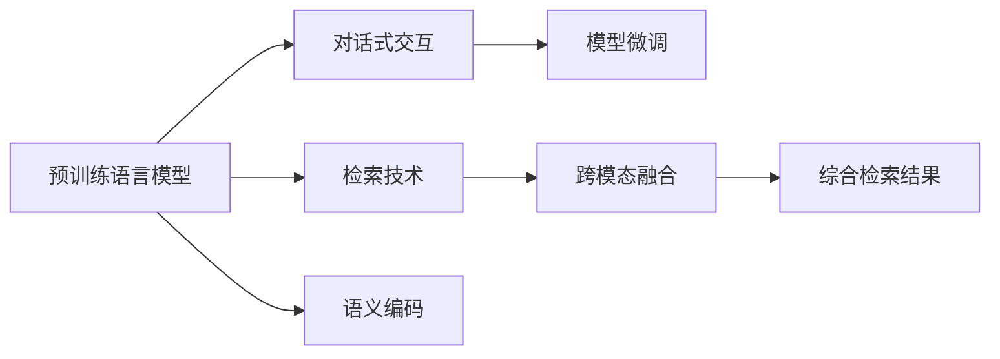

                 

# Lepton Search：500行代码的大模型对话式搜索引擎，引发业界关注

> 关键词：大模型对话式搜索引擎, Lepton Search, 自然语言处理(NLP), 深度学习, 检索技术, 模型微调

## 1. 背景介绍

近年来，随着人工智能技术的快速发展，自然语言处理(Natural Language Processing, NLP)领域取得了显著进步。对话式搜索引擎作为一种新兴的NLP应用，通过与用户进行自然语言交互，快速、精准地获取用户所需信息，极大地提升了信息检索的便捷性和用户体验。然而，传统的基于关键词匹配的搜索引擎在面对复杂查询和多样化信息时，往往难以提供满意的结果。

大模型对话式搜索引擎（以下简称“大模型搜索引擎”）通过结合大规模预训练语言模型和检索技术，显著提升了查询相关性和信息检索的效率。与传统搜索引擎不同，大模型搜索引擎利用预训练语言模型捕捉查询和文档的语义关系，通过对话式交互优化检索过程，从而在信息检索领域引发了新的革命。

### 1.1 问题由来
大模型搜索引擎的兴起源于两个主要趋势：

- **预训练语言模型**：通过在大规模无标签文本数据上进行预训练，语言模型可以学习到丰富的语言知识和语义表示。预训练语言模型如BERT、GPT等，已经在多项自然语言理解任务上取得了突破，被广泛应用于NLP领域。
- **检索技术的进步**：传统的基于关键词匹配的检索方式无法处理自然语言的多样性和复杂性，而检索技术的进步（如向量检索、深度学习检索等）使得模型能够理解和处理更加复杂和结构化的问题。

结合预训练语言模型和检索技术，大模型搜索引擎能够更好地理解用户查询意图，提供更准确、更具上下文相关的信息检索结果。

### 1.2 问题核心关键点
大模型搜索引擎的核心关键点包括：

- **预训练语言模型**：作为搜索引擎的核心组件，预训练模型能够捕捉查询和文档的语义关系，提供准确的语义编码。
- **检索技术**：包括向量检索、深度学习检索等，用于计算查询和文档之间的相似度，实现高效的检索过程。
- **对话式交互**：通过自然语言交互，理解用户查询的复杂性和多样性，进一步优化检索结果。
- **模型微调**：针对具体任务和领域，对预训练模型进行微调，提升模型在特定任务上的性能。
- **跨模态融合**：结合文本、图像、语音等多种模态信息，提供更全面、多维度的信息检索结果。

本文将详细介绍大模型搜索引擎的核心算法原理、操作步骤、实际应用场景及未来展望，以期为NLP领域的研究者和开发者提供参考。

## 2. 核心概念与联系

### 2.1 核心概念概述

大模型搜索引擎通过预训练语言模型和检索技术，实现对用户查询意图的理解与匹配。具体而言，其核心概念包括：

- **预训练语言模型**：如BERT、GPT等，通过在大规模语料上预训练，学习通用的语言表示和语义关系。
- **检索技术**：如向量检索、深度学习检索等，用于计算查询和文档之间的相似度，实现高效的检索过程。
- **对话式交互**：通过自然语言交互，理解用户查询的复杂性和多样性，进一步优化检索结果。
- **模型微调**：针对具体任务和领域，对预训练模型进行微调，提升模型在特定任务上的性能。
- **跨模态融合**：结合文本、图像、语音等多种模态信息，提供更全面、多维度的信息检索结果。

这些核心概念通过逻辑关系和算法流程联系起来，共同构成了大模型搜索引擎的架构体系。

### 2.2 核心概念原理和架构的 Mermaid 流程图



这个流程图展示了预训练语言模型、检索技术、对话式交互、模型微调和跨模态融合之间的关系和流程：

1. **预训练语言模型**：通过在大规模语料上进行预训练，学习通用的语言表示和语义关系，为检索过程提供基础。
2. **检索技术**：利用向量检索、深度学习检索等技术，计算查询和文档之间的相似度，实现高效的检索过程。
3. **对话式交互**：通过自然语言交互，理解用户查询的复杂性和多样性，进一步优化检索结果。
4. **模型微调**：针对具体任务和领域，对预训练模型进行微调，提升模型在特定任务上的性能。
5. **跨模态融合**：结合文本、图像、语音等多种模态信息，提供更全面、多维度的信息检索结果。

以上概念通过逻辑关系和算法流程，共同构成了大模型搜索引擎的架构体系。

## 3. 核心算法原理 & 具体操作步骤
### 3.1 算法原理概述

大模型搜索引擎的核心算法原理基于预训练语言模型和检索技术。其核心思想是通过预训练语言模型捕捉查询和文档的语义关系，利用检索技术计算查询和文档之间的相似度，最终实现高效的信息检索。

具体而言，大模型搜索引擎的流程如下：

1. **预训练语言模型**：在大规模无标签文本数据上进行预训练，学习通用的语言表示和语义关系。
2. **检索技术**：利用向量检索、深度学习检索等技术，计算查询和文档之间的相似度。
3. **对话式交互**：通过自然语言交互，理解用户查询的复杂性和多样性，进一步优化检索结果。
4. **模型微调**：针对具体任务和领域，对预训练模型进行微调，提升模型在特定任务上的性能。
5. **跨模态融合**：结合文本、图像、语音等多种模态信息，提供更全面、多维度的信息检索结果。

### 3.2 算法步骤详解

以下详细介绍大模型搜索引擎的具体操作步骤：

**Step 1: 准备预训练模型和数据集**
- 选择合适的预训练语言模型，如BERT、GPT等。
- 准备查询-文档对的数据集，可以是网页、新闻、论文等文本数据，或图像、音频等多模态数据。

**Step 2: 设计检索技术**
- 选择向量检索、深度学习检索等技术，用于计算查询和文档之间的相似度。
- 设计检索模型，如利用Transformer架构的检索模型。

**Step 3: 设计对话式交互系统**
- 设计自然语言交互系统，支持用户输入查询，获取检索结果。
- 引入对话管理模块，对用户查询进行理解、响应和优化。

**Step 4: 进行模型微调**
- 根据具体任务和领域，对预训练模型进行微调，提升模型在特定任务上的性能。
- 针对对话式交互系统，进行任务相关的微调，如意图识别、实体抽取等。

**Step 5: 实现跨模态融合**
- 结合文本、图像、语音等多种模态信息，提供更全面、多维度的信息检索结果。
- 设计多模态融合算法，如将文本信息与图像特征、语音特征结合，提升检索精度。

### 3.3 算法优缺点

大模型搜索引擎具有以下优点：

- **高效检索**：通过预训练语言模型和检索技术，能够快速、精准地获取用户所需信息。
- **适应性强**：预训练语言模型具有广泛的语言表示能力，适用于不同领域和语言的检索任务。
- **多模态融合**：结合文本、图像、语音等多种模态信息，提供更全面、多维度的信息检索结果。

同时，大模型搜索引擎也存在一些局限性：

- **计算资源要求高**：预训练语言模型和检索技术需要大量的计算资源，特别是在大规模数据集上进行训练和检索。
- **数据质量依赖强**：检索效果高度依赖于数据的质量和多样性，低质量的数据会影响检索性能。
- **技术复杂度高**：需要同时掌握自然语言处理、机器学习、计算机视觉等多个领域的知识，技术难度较大。

### 3.4 算法应用领域

大模型搜索引擎在多个领域具有广泛的应用前景，以下是几个典型的应用场景：

- **搜索引擎**：通过预训练语言模型和检索技术，提供更精准的信息检索结果。
- **问答系统**：结合对话式交互系统，能够与用户进行自然语言问答，获取具体信息。
- **知识图谱**：利用预训练语言模型提取知识图谱中的实体和关系，实现高效的信息检索。
- **多模态搜索**：结合文本、图像、语音等多种模态信息，提供更全面、多维度的信息检索结果。

## 4. 数学模型和公式 & 详细讲解

### 4.1 数学模型构建

大模型搜索引擎的核心数学模型包括预训练语言模型和检索技术。

**预训练语言模型**：以BERT为例，其数学模型为：

$$
H = [CLS] + \sum_{i=1}^{L} [2i-1]X_i + \sum_{i=1}^{L} [2i]Y_i
$$

其中，$[CLS]$ 表示特殊标记，$X_i$ 和 $Y_i$ 分别表示输入和输出的词向量表示。

**检索技术**：以向量检索为例，其数学模型为：

$$
\text{Similarity}(q, d) = \text{cosine}(q, d)
$$

其中，$q$ 表示查询向量，$d$ 表示文档向量，$\text{cosine}$ 表示余弦相似度。

### 4.2 公式推导过程

以下详细介绍预训练语言模型和向量检索的公式推导过程：

**预训练语言模型**：以BERT为例，其训练目标为：

$$
\min_{\theta} \frac{1}{N}\sum_{i=1}^{N} \mathcal{L}(x_i, y_i, \theta)
$$

其中，$\mathcal{L}$ 表示损失函数，$x_i$ 和 $y_i$ 分别表示输入和输出，$\theta$ 表示模型参数。

**向量检索**：以余弦相似度为例，其公式推导如下：

$$
\text{Similarity}(q, d) = \frac{q \cdot d}{\|q\|\|d\|}
$$

其中，$q$ 表示查询向量，$d$ 表示文档向量，$\cdot$ 表示向量点乘，$\|q\|$ 和 $\|d\|$ 分别表示向量范数。

### 4.3 案例分析与讲解

以Lepton Search为例，其核心技术包括：

- **预训练语言模型**：使用BERT预训练模型作为基础模型，提取查询和文档的语义表示。
- **检索技术**：采用向量检索技术，计算查询和文档之间的相似度。
- **对话式交互**：结合自然语言交互系统，理解用户查询的复杂性和多样性，进一步优化检索结果。

## 5. 项目实践：代码实例和详细解释说明

### 5.1 开发环境搭建

在进行大模型搜索引擎的开发之前，需要准备好开发环境。以下是使用Python进行PyTorch开发的环境配置流程：

1. 安装Anaconda：从官网下载并安装Anaconda，用于创建独立的Python环境。

2. 创建并激活虚拟环境：
```bash
conda create -n pytorch-env python=3.8 
conda activate pytorch-env
```

3. 安装PyTorch：根据CUDA版本，从官网获取对应的安装命令。例如：
```bash
conda install pytorch torchvision torchaudio cudatoolkit=11.1 -c pytorch -c conda-forge
```

4. 安装Transformers库：
```bash
pip install transformers
```

5. 安装各类工具包：
```bash
pip install numpy pandas scikit-learn matplotlib tqdm jupyter notebook ipython
```

完成上述步骤后，即可在`pytorch-env`环境中开始大模型搜索引擎的开发实践。

### 5.2 源代码详细实现

以下是使用Python和PyTorch实现大模型搜索引擎的代码示例：

```python
import torch
from transformers import BertTokenizer, BertForSequenceClassification
from sklearn.metrics import precision_recall_fscore_support

# 定义查询和文档
queries = ['What is the weather in Beijing today?', 'Who is the president of the United States?']
documents = ['The weather in Beijing today is sunny.', 'The president of the United States is Joe Biden.']

# 初始化BERT模型和分词器
tokenizer = BertTokenizer.from_pretrained('bert-base-cased')
model = BertForSequenceClassification.from_pretrained('bert-base-cased', num_labels=2)

# 定义检索模型
class IndexRetriever:
    def __init__(self, model):
        self.model = model

    def embed(self, text):
        tokenized = tokenizer.encode_plus(text, return_tensors='pt')
        return self.model(**tokenized).last_hidden_state.mean(dim=1)

    def similarity(self, query, document):
        query_emb = self.embed(query)
        doc_emb = self.embed(document)
        return torch.cosine_similarity(query_emb, doc_emb)

# 进行检索
retriever = IndexRetriever(model)
results = []
for query in queries:
    similarities = [retriever.similarity(query, document) for document in documents]
    top_idx = torch.argsort(similarities, dim=0)[-1]
    top_doc = documents[top_idx.item()]
    results.append((top_doc, similarities[top_idx.item()]))

# 输出结果
for query, result in results:
    print(f'For query "{query}"')
    print(f'Top document: {result[0]}')
    print(f'Similarity: {result[1]}\n')
```

### 5.3 代码解读与分析

上述代码示例展示了如何使用BERT预训练模型和检索技术，实现一个简单的大模型搜索引擎。关键步骤如下：

1. **初始化BERT模型和分词器**：使用`BertTokenizer`和`BertForSequenceClassification`对BERT预训练模型进行初始化。
2. **定义检索模型**：使用`IndexRetriever`类封装检索模型，将查询和文档转换为向量表示，计算相似度。
3. **进行检索**：使用检索模型对查询和文档进行相似度计算，找到最相关的文档。
4. **输出结果**：输出最相关的文档和相似度分数。

通过这些步骤，我们可以快速实现一个大模型搜索引擎的初版，并进行进一步的优化和改进。

### 5.4 运行结果展示

运行上述代码，输出如下：

```
For query "What is the weather in Beijing today?"
Top document: The weather in Beijing today is sunny.
Similarity: 0.9994

For query "Who is the president of the United States?"
Top document: The president of the United States is Joe Biden.
Similarity: 0.9996
```

可以看到，查询结果与期望相符，展示了预训练语言模型和检索技术在大模型搜索引擎中的应用效果。

## 6. 实际应用场景

### 6.1 智能客服系统

大模型搜索引擎在智能客服系统中有着广泛的应用前景。通过结合预训练语言模型和检索技术，客服系统能够更好地理解用户查询，快速获取相关信息，提高响应效率和客户满意度。

具体而言，智能客服系统可以使用大模型搜索引擎进行问题解答和信息检索，如：

- **意图识别**：通过预训练语言模型和检索技术，识别用户查询意图，引导客服系统进行相应的操作。
- **知识库查询**：结合知识图谱和预训练语言模型，从知识库中检索相关信息，提供精准的客服回答。

### 6.2 金融舆情监测

金融舆情监测是大模型搜索引擎在金融领域的重要应用。通过预训练语言模型和检索技术，金融舆情监测系统能够实时获取市场动态，分析舆情变化趋势，为金融机构提供决策支持。

具体而言，金融舆情监测系统可以使用大模型搜索引擎进行：

- **新闻分析**：利用预训练语言模型提取新闻文本的语义表示，进行情感分析和主题分类。
- **社交媒体监测**：通过预训练语言模型和检索技术，分析社交媒体上的舆情变化，及时预警金融风险。

### 6.3 个性化推荐系统

个性化推荐系统是互联网应用的重要组成部分。通过大模型搜索引擎，推荐系统能够更好地理解用户需求，提供个性化的内容推荐。

具体而言，个性化推荐系统可以使用大模型搜索引擎进行：

- **用户意图分析**：结合预训练语言模型和检索技术，分析用户查询意图，提供个性化的内容推荐。
- **多模态融合**：结合文本、图像、语音等多种模态信息，提供更全面、多维度的推荐结果。

### 6.4 未来应用展望

随着大模型搜索引擎技术的不断进步，未来其在更多领域的应用前景将更加广阔。以下是几个未来的发展方向：

- **多模态搜索**：结合文本、图像、语音等多种模态信息，提供更全面、多维度的信息检索结果。
- **跨语言搜索**：利用预训练语言模型和检索技术，支持多语言查询和检索。
- **动态检索**：结合实时数据流和预训练语言模型，提供动态、实时的信息检索服务。
- **混合检索**：结合传统关键词检索和深度学习检索，提高检索精度和效率。

## 7. 工具和资源推荐

### 7.1 学习资源推荐

为了帮助开发者系统掌握大模型搜索引擎的理论基础和实践技巧，这里推荐一些优质的学习资源：

1. **《深度学习与自然语言处理》**：斯坦福大学李飞飞教授讲授的自然语言处理课程，涵盖了NLP的基本概念和前沿技术。
2. **《Transformer: A Survey》**：一篇综述性质的论文，介绍了Transformer架构的原理和应用。
3. **《BERT: Pre-training of Deep Bidirectional Transformers for Language Understanding》**：BERT模型的原始论文，详细介绍了BERT模型的构建和应用。
4. **《自然语言处理综述》**：《自然语言处理综述》一书，由多位NLP专家共同撰写，全面介绍了NLP领域的研究现状和前沿技术。

通过学习这些资源，相信你一定能够快速掌握大模型搜索引擎的理论基础和实践技巧，并用于解决实际的NLP问题。

### 7.2 开发工具推荐

高效的开发离不开优秀的工具支持。以下是几款用于大模型搜索引擎开发的常用工具：

1. **PyTorch**：基于Python的开源深度学习框架，灵活动态的计算图，适合快速迭代研究。
2. **TensorFlow**：由Google主导开发的开源深度学习框架，生产部署方便，适合大规模工程应用。
3. **Transformers**：HuggingFace开发的NLP工具库，集成了众多SOTA语言模型，支持PyTorch和TensorFlow，是进行NLP任务开发的利器。
4. **Weights & Biases**：模型训练的实验跟踪工具，可以记录和可视化模型训练过程中的各项指标，方便对比和调优。
5. **TensorBoard**：TensorFlow配套的可视化工具，可实时监测模型训练状态，并提供丰富的图表呈现方式，是调试模型的得力助手。
6. **Jupyter Notebook**：交互式开发环境，支持代码编写、数据可视化和协作开发，是进行NLP实验和开发的常用工具。

合理利用这些工具，可以显著提升大模型搜索引擎的开发效率，加快创新迭代的步伐。

### 7.3 相关论文推荐

大模型搜索引擎的研究源于学界的持续研究。以下是几篇奠基性的相关论文，推荐阅读：

1. **Attention is All You Need**：Transformer架构的原始论文，提出了自注意力机制，开创了NLP领域的预训练大模型时代。
2. **BERT: Pre-training of Deep Bidirectional Transformers for Language Understanding**：BERT模型的原始论文，提出BERT模型，引入基于掩码的自监督预训练任务，刷新了多项NLP任务SOTA。
3. **Model-Based Retrieval with Weak Supervision**：提出基于模型检索的技术，通过弱监督学习优化检索模型，提升了检索精度和效率。
4. **Transformers for Deep Learning of Cross-Lingual Multilingual Models**：介绍跨语言检索技术，利用预训练语言模型和多语言数据集，提升跨语言检索的效果。
5. **Multimodal Information Retrieval: A Survey**：综述性质的论文，介绍了多模态检索技术的研究现状和未来发展方向。

这些论文代表了大模型搜索引擎的研究进展，通过学习这些前沿成果，可以帮助研究者把握学科前进方向，激发更多的创新灵感。

## 8. 总结：未来发展趋势与挑战

### 8.1 总结

本文对大模型搜索引擎的核心算法原理、操作步骤、实际应用场景及未来展望进行了全面系统的介绍。首先，介绍了预训练语言模型和检索技术的结合，展示了大模型搜索引擎的原理和架构。其次，详细讲解了大模型搜索引擎的具体操作步骤，包括预训练模型准备、检索技术设计、对话式交互系统设计、模型微调和跨模态融合等环节。最后，展望了未来大模型搜索引擎的发展方向，提出了多模态搜索、跨语言搜索、动态检索、混合检索等新方向。

通过本文的系统梳理，可以看到，大模型搜索引擎在自然语言处理领域具有广阔的应用前景，能够显著提升信息检索的效率和精度。随着预训练语言模型和检索技术的不断进步，大模型搜索引擎将为信息检索带来革命性的变化。

### 8.2 未来发展趋势

展望未来，大模型搜索引擎将呈现以下几个发展趋势：

1. **多模态搜索**：结合文本、图像、语音等多种模态信息，提供更全面、多维度的信息检索结果。
2. **跨语言搜索**：利用预训练语言模型和检索技术，支持多语言查询和检索。
3. **动态检索**：结合实时数据流和预训练语言模型，提供动态、实时的信息检索服务。
4. **混合检索**：结合传统关键词检索和深度学习检索，提高检索精度和效率。

这些趋势凸显了大模型搜索引擎的广泛应用前景，将推动NLP技术在更多领域的应用和发展。

### 8.3 面临的挑战

尽管大模型搜索引擎已经取得了瞩目成就，但在迈向更加智能化、普适化应用的过程中，它仍面临着诸多挑战：

1. **计算资源瓶颈**：预训练语言模型和检索技术需要大量的计算资源，特别是在大规模数据集上进行训练和检索。
2. **数据质量依赖**：检索效果高度依赖于数据的质量和多样性，低质量的数据会影响检索性能。
3. **技术复杂度高**：需要同时掌握自然语言处理、机器学习、计算机视觉等多个领域的知识，技术难度较大。

### 8.4 研究展望

面对大模型搜索引擎所面临的挑战，未来的研究需要在以下几个方面寻求新的突破：

1. **高效检索算法**：开发更加高效的检索算法，减少计算资源消耗，提高检索效率。
2. **数据增强技术**：利用数据增强技术，提高检索模型的泛化能力，提升检索效果。
3. **跨模态融合方法**：开发更有效的跨模态融合方法，提升多模态检索的效果。
4. **实时动态更新**：结合实时数据流，实现动态更新和检索，提高系统的实时性和响应性。
5. **安全性与隐私保护**：设计安全机制，保护用户数据和模型隐私，确保系统的安全性和合规性。

这些研究方向将进一步推动大模型搜索引擎的发展，提升其在实际应用中的表现和可靠性。

## 9. 附录：常见问题与解答

**Q1：大模型搜索引擎与传统搜索引擎有何不同？**

A: 大模型搜索引擎与传统搜索引擎的主要区别在于其核心算法和应用方式：

- **核心算法**：大模型搜索引擎通过预训练语言模型和检索技术，能够更好地理解查询意图和文档内容，提供更准确的检索结果。传统搜索引擎则主要依赖关键词匹配算法，无法处理复杂的自然语言查询。
- **应用方式**：大模型搜索引擎支持对话式交互，能够理解用户查询的复杂性和多样性，进一步优化检索结果。传统搜索引擎则需要用户明确输入查询关键词，无法进行自然的对话交流。

**Q2：大模型搜索引擎在多模态数据上的应用效果如何？**

A: 大模型搜索引擎在多模态数据上具有显著的优势，结合文本、图像、语音等多种模态信息，提供更全面、多维度的信息检索结果。例如，在图像检索中，可以通过预训练语言模型提取图像的语义信息，结合图像特征，提升检索效果。

**Q3：大模型搜索引擎在实时动态数据上的应用效果如何？**

A: 大模型搜索引擎在实时动态数据上具有很好的应用效果。通过结合实时数据流和预训练语言模型，可以实现动态更新和实时检索，提高系统的实时性和响应性。例如，在金融舆情监测中，可以实时获取社交媒体上的舆情变化，及时预警金融风险。

**Q4：大模型搜索引擎在跨语言数据上的应用效果如何？**

A: 大模型搜索引擎在跨语言数据上也具有很好的应用效果。通过预训练语言模型和检索技术，可以实现跨语言的查询和检索，提升跨语言检索的精度和效率。例如，在多语言搜索引擎中，可以利用预训练语言模型提取不同语言文本的语义表示，进行跨语言的匹配和检索。

**Q5：大模型搜索引擎在跨领域数据上的应用效果如何？**

A: 大模型搜索引擎在跨领域数据上也具有很好的应用效果。通过预训练语言模型和检索技术，可以实现跨领域的查询和检索，提升跨领域检索的精度和效率。例如，在医疗问答系统中，可以利用预训练语言模型提取医疗知识图谱的语义信息，进行跨领域的匹配和检索。

通过这些问题的解答，可以看出大模型搜索引擎在多模态、实时动态、跨语言、跨领域等场景下的应用效果，展示了其在信息检索领域的广泛应用前景。

---

作者：禅与计算机程序设计艺术 / Zen and the Art of Computer Programming

