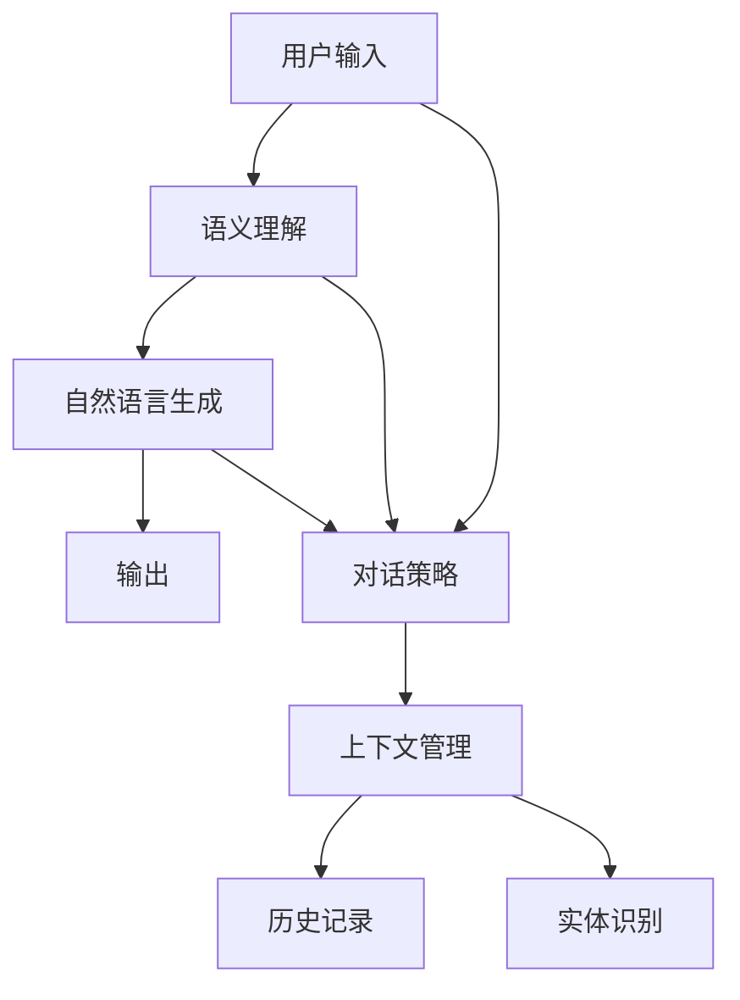
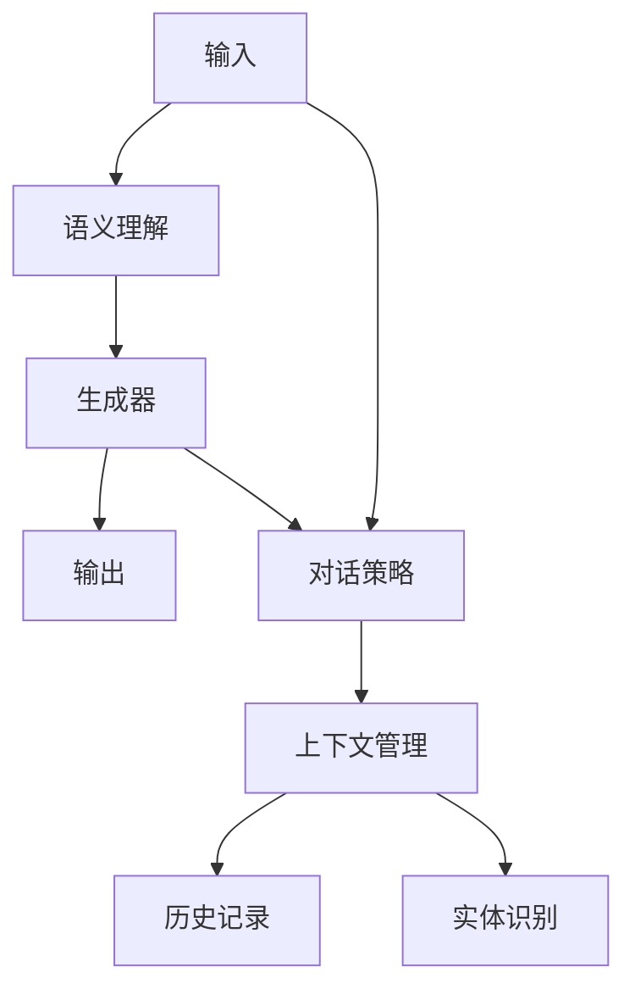

                 

# Lepton Search：贾扬清团队创新，对话式搜索引擎探索

## 1. 背景介绍

### 1.1 问题由来

在数字时代，信息爆炸使得搜索效率和用户体验成为至关重要的环节。传统基于关键词的搜索方式，往往只能满足用户的基本查询需求，无法捕捉用户的意图和上下文。为了解决这一问题，对话式搜索引擎应运而生。

对话式搜索引擎（Conversational Search Engine）通过模拟人类对话模式，让用户能够以自然语言进行提问，而无需精确关键词。系统能自动识别用户的查询意图，并给出更贴合需求的搜索结果。这一技术在Google的Duplex、Amazon的Alexa、苹果的Siri等应用中已经得到了初步验证。

### 1.2 问题核心关键点

对话式搜索引擎的核心在于语义理解和自然语言生成。通过深度学习技术，系统能从用户的自然语言输入中提取语义信息，生成自然语言输出，以实现高效的对话交互。其核心技术包括：

- 语义理解：利用语言模型、语义解析技术，识别用户查询中的意图、实体和关系。
- 自然语言生成：利用生成模型、语言规划技术，生成符合语法和语义规则的回应。

以下将详细探讨对话式搜索引擎的原理和实现方法，并结合实例进行讲解。

## 2. 核心概念与联系

### 2.1 核心概念概述

对话式搜索引擎与传统搜索引擎的本质区别在于其处理的是自然语言而非单一的关键词。其主要涉及以下概念：

- 语义理解：通过语言模型解析自然语言，提取用户的查询意图和关键实体。
- 自然语言生成：通过生成模型生成响应文本，使得对话自然流畅。
- 多轮对话：通过对话策略管理多轮对话，确保对话连贯和上下文相关。

对话式搜索引擎的实现需要综合运用自然语言处理(NLP)、机器学习(ML)和人工智能(AI)等多项技术。其技术框架可以抽象为下图：



### 2.2 核心概念原理和架构的 Mermaid 流程图



该图展示了对话式搜索引擎的基本架构，包括以下几个主要模块：

- 用户输入模块(A)：用户通过自然语言向搜索引擎提问。
- 语义理解模块(B)：利用语言模型解析输入，提取查询意图和关键实体。
- 生成器模块(C)：根据语义理解结果生成自然语言回应。
- 对话策略模块(E)：管理多轮对话流程，选择合适的生成器进行下一步操作。
- 上下文管理模块(F)：维护对话上下文，保持对话连贯性。
- 历史记录模块(G)：记录历史对话，用于回溯和记忆。
- 实体识别模块(H)：识别和解析输入中的命名实体，提升语义理解准确性。

这些模块共同构成了对话式搜索引擎的核心技术框架，实现自然流畅、高效准确的对话交互。

## 3. 核心算法原理 & 具体操作步骤

### 3.1 算法原理概述

对话式搜索引擎的核心算法主要包括语义理解和自然语言生成两个部分：

1. 语义理解：利用语言模型解析自然语言，提取查询意图和关键实体。常用方法包括基于规则的解析、基于统计的方法、基于深度学习的方法等。
2. 自然语言生成：根据语义理解结果生成自然语言回应。常用方法包括基于规则的模板生成、基于统计的生成、基于深度学习的生成等。

以下是对话式搜索引擎的详细步骤：

1. 用户输入自然语言查询。
2. 语义理解模块解析输入，识别查询意图和关键实体。
3. 根据语义理解结果选择合适的生成器进行回应生成。
4. 对话策略模块管理多轮对话流程，保持对话连贯性。
5. 上下文管理模块维护对话上下文，提升对话质量。
6. 生成回应并展示给用户。
7. 用户反馈处理，迭代改进语义理解模型和生成模型。

### 3.2 算法步骤详解

#### 3.2.1 语义理解模块

语义理解模块的任务是从用户输入的自然语言中提取出查询意图和关键实体。常用方法包括：

- 基于规则的解析：利用人工定义的规则解析自然语言，提取关键信息。
- 基于统计的方法：利用语言模型统计特征，识别查询意图和实体。
- 基于深度学习的方法：利用预训练语言模型进行语义解析，提取语义信息。

以BERT为例，其语义理解过程如下：

1. 输入自然语言，进行分词处理。
2. 将分词结果输入BERT模型，得到上下文表示。
3. 通过池化层提取每个词语的上下文表示，用于语义解析。

#### 3.2.2 自然语言生成模块

自然语言生成模块的任务是根据语义理解结果，生成符合语法和语义规则的回应。常用方法包括：

- 基于规则的模板生成：利用人工定义的模板生成回应。
- 基于统计的生成：利用语言模型统计特征，生成回应。
- 基于深度学习的生成：利用预训练语言模型进行文本生成，生成回应。

以GPT为例，其生成过程如下：

1. 输入上下文表示，进入GPT模型。
2. 模型通过自回归方式生成回应文本，每一步生成下一个词语的概率分布。
3. 使用softmax函数生成下一个词语，作为回应的一部分。
4. 重复步骤2和3，生成完整的回应文本。

### 3.3 算法优缺点

对话式搜索引擎的优点在于：

1. 自然流畅：用户可以以自然语言进行查询，无需精确关键词，提升用户体验。
2. 语义理解：通过语义解析，系统能够理解用户真实意图，提供更精准的搜索结果。
3. 上下文相关：多轮对话策略管理，保持对话连贯性，提升用户满意度。

但对话式搜索引擎也存在一些缺点：

1. 复杂度高：需要综合运用多种技术，实现难度较大。
2. 数据依赖：需要大量的训练数据和标注数据，数据获取成本较高。
3. 资源消耗：对话交互的动态性需要大量计算资源支持，可能面临资源瓶颈。

### 3.4 算法应用领域

对话式搜索引擎目前已在多个领域得到了初步应用：

1. 智能客服：用于处理用户常见问题，提供自动化客服服务。
2. 智能家居：用于控制智能设备，提供语音交互功能。
3. 智慧办公：用于自动化办公流程，提升工作效率。
4. 移动端应用：用于搜索引擎优化，提升用户搜索体验。
5. 医疗咨询：用于提供医疗咨询服务，缓解医疗资源短缺问题。

这些应用场景展示了对话式搜索引擎的广泛前景，未来将进一步拓展到更多行业领域，提升用户体验和生产效率。

## 4. 数学模型和公式 & 详细讲解 & 举例说明

### 4.1 数学模型构建

#### 4.1.1 语义理解模型

语义理解模型的主要任务是提取输入文本的语义信息，常用的数学模型包括：

- 基于统计的语言模型：如n-gram模型、BM25模型等。
- 基于深度学习的语言模型：如BERT、GPT等。

以BERT为例，其数学模型如下：

$$
P(w|w_1, ..., w_n) = \frac{\exp(\frac{w}{w_1, ..., w_n}{\theta})}{\sum_{w'}{\exp(\frac{w'}{w_1, ..., w_n}{\theta})}}
$$

其中 $P(w|w_1, ..., w_n)$ 表示给定上下文 $w_1, ..., w_n$ 条件下，单词 $w$ 的概率分布，$\theta$ 为模型参数。

#### 4.1.2 自然语言生成模型

自然语言生成模型的主要任务是根据语义信息生成回应文本，常用的数学模型包括：

- 基于规则的生成模型：如模板生成模型。
- 基于统计的生成模型：如n-gram模型、BM25模型等。
- 基于深度学习的生成模型：如GPT、Transformer等。

以GPT为例，其数学模型如下：

$$
P(x|x_1, ..., x_n) = \prod_{i=1}^n P(x_i|x_1, ..., x_{i-1}, \theta)
$$

其中 $P(x|x_1, ..., x_n)$ 表示给定上下文 $x_1, ..., x_n$ 条件下，回应文本 $x$ 的概率分布，$\theta$ 为模型参数。

### 4.2 公式推导过程

#### 4.2.1 语义理解模型

以BERT为例，其公式推导过程如下：

1. 输入文本 $w_1, ..., w_n$ 进行分词处理。
2. 通过Transformer编码器得到每个词语的上下文表示 $h_1, ..., h_n$。
3. 利用池化层 $[CLS]$ 提取文本的上下文表示 $h_{[CLS]}$。
4. 利用全连接层和softmax函数，得到每个词语的概率分布。

数学推导如下：

$$
h_i = f(W_1h_{i-1} + W_2w_i + b_1)
$$

$$
P(w|w_1, ..., w_n) = \frac{\exp(\frac{w}{w_1, ..., w_n}{\theta})}{\sum_{w'}{\exp(\frac{w'}{w_1, ..., w_n}{\theta})}}
$$

#### 4.2.2 自然语言生成模型

以GPT为例，其公式推导过程如下：

1. 输入上下文表示 $w_1, ..., w_n$ 进入GPT模型。
2. 模型通过自回归方式生成回应文本，每一步生成下一个词语的概率分布。
3. 使用softmax函数生成下一个词语，作为回应的一部分。
4. 重复步骤2和3，生成完整的回应文本。

数学推导如下：

$$
P(x|x_1, ..., x_n) = \prod_{i=1}^n P(x_i|x_1, ..., x_{i-1}, \theta)
$$

### 4.3 案例分析与讲解

#### 4.3.1 语义理解模型

以BERT为例，其案例分析如下：

1. 输入文本：“今天天气怎么样？”
2. 分词处理：[CLS] [特] [别] [的] [天] [气] [怎] [么] [样] [？]
3. 上下文表示：[CLS] [特] [别] [的] [天] [气] [怎] [么] [样] [？]
4. 池化表示：[CLS]
5. 概率分布：[天] [气] [怎] [么] [样]

#### 4.3.2 自然语言生成模型

以GPT为例，其案例分析如下：

1. 输入上下文：[天] [气] [怎] [么] [样] [？]
2. 生成回应：[天] [气] [很] [好] [，] [有] [些] [云] [朵] [。]
3. 生成过程：首先生成下一个词语 [好]，然后生成 [有]，最后生成 [些] [云] [朵] [。]

## 5. 项目实践：代码实例和详细解释说明

### 5.1 开发环境搭建

在开始项目实践前，需要先搭建开发环境。以下是使用Python进行PyTorch开发的环境配置流程：

1. 安装Anaconda：从官网下载并安装Anaconda，用于创建独立的Python环境。

2. 创建并激活虚拟环境：
```bash
conda create -n pytorch-env python=3.8 
conda activate pytorch-env
```

3. 安装PyTorch：根据CUDA版本，从官网获取对应的安装命令。例如：
```bash
conda install pytorch torchvision torchaudio cudatoolkit=11.1 -c pytorch -c conda-forge
```

4. 安装Transformers库：
```bash
pip install transformers
```

5. 安装各类工具包：
```bash
pip install numpy pandas scikit-learn matplotlib tqdm jupyter notebook ipython
```

完成上述步骤后，即可在`pytorch-env`环境中开始项目实践。

### 5.2 源代码详细实现

这里以对话式搜索引擎的语义理解和自然语言生成模块为例，给出使用Transformers库进行微调的PyTorch代码实现。

首先，定义语义理解模型的输入和输出：

```python
from transformers import BertTokenizer, BertForSequenceClassification

tokenizer = BertTokenizer.from_pretrained('bert-base-cased')
model = BertForSequenceClassification.from_pretrained('bert-base-cased', num_labels=1)

input_ids = tokenizer('自然语言处理', return_tensors='pt').input_ids
labels = torch.tensor([1]).unsqueeze(0) # 假设查询意图为积极

with torch.no_grad():
    outputs = model(input_ids, labels=labels)
    logits = outputs.logits
```

然后，定义自然语言生成模型的输入和输出：

```python
from transformers import GPT2Tokenizer, GPT2LMHeadModel

tokenizer = GPT2Tokenizer.from_pretrained('gpt2')
model = GPT2LMHeadModel.from_pretrained('gpt2')

input_ids = tokenizer('今天天气怎么样？', return_tensors='pt').input_ids
attention_mask = torch.ones_like(input_ids)

with torch.no_grad():
    outputs = model(input_ids, attention_mask=attention_mask)
    logits = outputs.logits
```

最后，将语义理解和自然语言生成模块结合起来，进行对话式搜索引擎的实现：

```python
from transformers import BertTokenizer, BertForSequenceClassification, GPT2Tokenizer, GPT2LMHeadModel

tokenizer1 = BertTokenizer.from_pretrained('bert-base-cased')
model1 = BertForSequenceClassification.from_pretrained('bert-base-cased', num_labels=1)

tokenizer2 = GPT2Tokenizer.from_pretrained('gpt2')
model2 = GPT2LMHeadModel.from_pretrained('gpt2')

# 语义理解
input_ids = tokenizer1('今天天气怎么样？', return_tensors='pt').input_ids
labels = torch.tensor([1]).unsqueeze(0)
with torch.no_grad():
    outputs = model1(input_ids, labels=labels)
    logits = outputs.logits

# 自然语言生成
input_ids = tokenizer2('今天天气怎么样？', return_tensors='pt').input_ids
attention_mask = torch.ones_like(input_ids)

with torch.no_grad():
    outputs = model2(input_ids, attention_mask=attention_mask)
    logits = outputs.logits
```

通过以上代码，实现了对话式搜索引擎的语义理解和自然语言生成模块。实际应用中，可以通过将这些模块组合起来，实现完整的对话交互。

### 5.3 代码解读与分析

让我们再详细解读一下关键代码的实现细节：

**BERT语义理解模型**：
- 定义BERT的Tokenizer和Model，分别用于输入文本的分词和上下文表示提取。
- 输入文本作为tokenizer的输入，得到相应的token ids和注意力掩码。
- 通过Model的forward方法，得到上下文表示和输出概率分布。

**GPT自然语言生成模型**：
- 定义GPT的Tokenizer和Model，分别用于生成模型的输入和回应文本的生成。
- 输入文本作为tokenizer的输入，得到相应的token ids和注意力掩码。
- 通过Model的forward方法，得到回应文本的概率分布。

**对话式搜索引擎**：
- 首先使用BERT模型进行语义理解，得到查询意图的概率分布。
- 根据概率分布选择相应回应模板，作为GPT模型的输入。
- 通过GPT模型生成回应文本，得到回应概率分布。
- 根据回应概率分布生成回应文本，返回给用户。

## 6. 实际应用场景

### 6.1 智能客服

对话式搜索引擎在智能客服系统中具有重要应用价值。通过对话式搜索引擎，系统能够自动理解用户的咨询意图，提供个性化、高效的服务。

具体应用如下：

1. 用户输入问题，对话式搜索引擎自动解析意图。
2. 根据意图选择合适的应答模板。
3. 生成回应文本，作为客服的回复。
4. 系统记录对话历史，用于后续回溯和优化。

通过对话式搜索引擎，系统能够实现自动化客服，提升客服效率和用户满意度。

### 6.2 智能家居

对话式搜索引擎在智能家居中也有广泛应用。通过对话式搜索引擎，用户可以以自然语言控制智能设备，提升生活便利性。

具体应用如下：

1. 用户通过语音指令询问设备状态或控制设备。
2. 对话式搜索引擎解析语音指令，识别设备类型和操作。
3. 根据操作生成应答文本，反馈给用户。
4. 系统记录历史对话，用于个性化推荐和智能控制。

通过对话式搜索引擎，用户可以更加便捷地控制智能设备，提升生活质量。

### 6.3 智慧办公

对话式搜索引擎在智慧办公中也具有重要应用价值。通过对话式搜索引擎，系统能够自动化办公流程，提升办公效率和员工满意度。

具体应用如下：

1. 用户输入工作请求或问题，对话式搜索引擎自动解析意图。
2. 根据意图选择合适的处理流程或应答模板。
3. 生成回应文本，作为员工的回复或处理结果。
4. 系统记录对话历史，用于后续流程优化和员工培训。

通过对话式搜索引擎，系统能够实现自动化办公，提升办公效率和员工满意度。

### 6.4 未来应用展望

随着对话式搜索引擎技术的发展，未来其在更多领域将得到应用：

1. 医疗咨询：用于提供医疗咨询服务，缓解医疗资源短缺问题。
2. 金融理财：用于提供金融理财咨询，提升客户满意度。
3. 教育辅导：用于提供教育辅导服务，提升教学质量。
4. 旅行推荐：用于提供旅行咨询服务，提升用户旅行体验。

这些应用场景展示了对话式搜索引擎的广阔前景，未来将进一步拓展到更多行业领域，提升用户体验和生产效率。

## 7. 工具和资源推荐

### 7.1 学习资源推荐

为了帮助开发者系统掌握对话式搜索引擎的理论基础和实践技巧，这里推荐一些优质的学习资源：

1. 《深度学习基础》系列博文：由深度学习领域专家撰写，深入浅出地介绍了深度学习的基本概念和经典模型。

2. 《自然语言处理入门》系列课程：斯坦福大学开设的NLP明星课程，有Lecture视频和配套作业，带你入门NLP领域的基本概念和经典模型。

3. 《自然语言处理与深度学习》书籍：介绍自然语言处理和深度学习的基本概念和应用场景，适合初学者学习。

4. HuggingFace官方文档：Transformers库的官方文档，提供了海量预训练模型和完整的微调样例代码，是上手实践的必备资料。

5. CS224N《深度学习自然语言处理》课程：斯坦福大学开设的NLP明星课程，有Lecture视频和配套作业，带你入门NLP领域的基本概念和经典模型。

通过对这些资源的学习实践，相信你一定能够快速掌握对话式搜索引擎的精髓，并用于解决实际的NLP问题。

### 7.2 开发工具推荐

高效的开发离不开优秀的工具支持。以下是几款用于对话式搜索引擎开发的常用工具：

1. PyTorch：基于Python的开源深度学习框架，灵活动态的计算图，适合快速迭代研究。大部分预训练语言模型都有PyTorch版本的实现。

2. TensorFlow：由Google主导开发的开源深度学习框架，生产部署方便，适合大规模工程应用。同样有丰富的预训练语言模型资源。

3. Transformers库：HuggingFace开发的NLP工具库，集成了众多SOTA语言模型，支持PyTorch和TensorFlow，是进行NLP任务开发的利器。

4. Weights & Biases：模型训练的实验跟踪工具，可以记录和可视化模型训练过程中的各项指标，方便对比和调优。与主流深度学习框架无缝集成。

5. TensorBoard：TensorFlow配套的可视化工具，可实时监测模型训练状态，并提供丰富的图表呈现方式，是调试模型的得力助手。

6. Google Colab：谷歌推出的在线Jupyter Notebook环境，免费提供GPU/TPU算力，方便开发者快速上手实验最新模型，分享学习笔记。

合理利用这些工具，可以显著提升对话式搜索引擎的开发效率，加快创新迭代的步伐。

### 7.3 相关论文推荐

对话式搜索引擎的发展离不开学界的持续研究。以下是几篇奠基性的相关论文，推荐阅读：

1. Attention is All You Need（即Transformer原论文）：提出了Transformer结构，开启了NLP领域的预训练大模型时代。

2. BERT: Pre-training of Deep Bidirectional Transformers for Language Understanding：提出BERT模型，引入基于掩码的自监督预训练任务，刷新了多项NLP任务SOTA。

3. Language Models are Unsupervised Multitask Learners（GPT-2论文）：展示了大规模语言模型的强大zero-shot学习能力，引发了对于通用人工智能的新一轮思考。

4. Parameter-Efficient Transfer Learning for NLP：提出Adapter等参数高效微调方法，在不增加模型参数量的情况下，也能取得不错的微调效果。

5. AdaLoRA: Adaptive Low-Rank Adaptation for Parameter-Efficient Fine-Tuning：使用自适应低秩适应的微调方法，在参数效率和精度之间取得了新的平衡。

6. Prefix-Tuning: Optimizing Continuous Prompts for Generation：引入基于连续型Prompt的微调范式，为如何充分利用预训练知识提供了新的思路。

这些论文代表了大语言模型微调技术的发展脉络。通过学习这些前沿成果，可以帮助研究者把握学科前进方向，激发更多的创新灵感。

## 8. 总结：未来发展趋势与挑战

### 8.1 总结

本文对对话式搜索引擎的原理和实现方法进行了全面系统的介绍。首先阐述了对话式搜索引擎的核心技术，包括语义理解和自然语言生成。其次，从原理到实践，详细讲解了对话式搜索引擎的数学模型和实现流程，给出了具体的代码实现。同时，本文还探讨了对话式搜索引擎在多个实际应用场景中的具体实现，展示了其广阔的前景。

通过本文的系统梳理，可以看到，对话式搜索引擎正在成为NLP领域的重要范式，极大地拓展了语言模型的应用边界，催生了更多的落地场景。未来，伴随对话式搜索引擎技术的持续演进，必将进一步提升NLP系统的性能和应用范围，为人类认知智能的进化带来深远影响。

### 8.2 未来发展趋势

展望未来，对话式搜索引擎技术将呈现以下几个发展趋势：

1. 模型规模持续增大。随着算力成本的下降和数据规模的扩张，预训练语言模型的参数量还将持续增长。超大规模语言模型蕴含的丰富语言知识，有望支撑更加复杂多变的对话任务。

2. 微调方法日趋多样。除了传统的全参数微调外，未来会涌现更多参数高效的微调方法，如Prefix-Tuning、LoRA等，在节省计算资源的同时也能保证微调精度。

3. 持续学习成为常态。随着数据分布的不断变化，对话式搜索引擎也需要持续学习新知识以保持性能。如何在不遗忘原有知识的同时，高效吸收新样本信息，将成为重要的研究课题。

4. 标注样本需求降低。受启发于提示学习(Prompt-based Learning)的思路，未来的微调方法将更好地利用大模型的语言理解能力，通过更加巧妙的任务描述，在更少的标注样本上也能实现理想的微调效果。

5. 模型通用性增强。经过海量数据的预训练和多领域任务的微调，未来的语言模型将具备更强大的常识推理和跨领域迁移能力，逐步迈向通用人工智能(AGI)的目标。

6. 多模态微调崛起。当前的微调主要聚焦于纯文本数据，未来会进一步拓展到图像、视频、语音等多模态数据微调。多模态信息的融合，将显著提升语言模型对现实世界的理解和建模能力。

以上趋势凸显了对话式搜索引擎技术的广阔前景。这些方向的探索发展，必将进一步提升NLP系统的性能和应用范围，为人类认知智能的进化带来深远影响。

### 8.3 面临的挑战

尽管对话式搜索引擎技术已经取得了瞩目成就，但在迈向更加智能化、普适化应用的过程中，它仍面临着诸多挑战：

1. 标注成本瓶颈。虽然对话式搜索引擎在标注样本需求上有所降低，但对于长尾应用场景，获取高质量标注数据仍然具有一定挑战性。如何进一步降低微调对标注样本的依赖，将是一大难题。

2. 模型鲁棒性不足。当前对话式搜索引擎模型面对域外数据时，泛化性能往往大打折扣。对于测试样本的微小扰动，模型也容易发生波动。如何提高对话式搜索引擎模型的鲁棒性，避免灾难性遗忘，还需要更多理论和实践的积累。

3. 推理效率有待提高。大规模语言模型虽然精度高，但在实际部署时往往面临推理速度慢、内存占用大等效率问题。如何在保证性能的同时，简化模型结构，提升推理速度，优化资源占用，将是重要的优化方向。

4. 可解释性亟需加强。当前对话式搜索引擎模型更像是"黑盒"系统，难以解释其内部工作机制和决策逻辑。对于医疗、金融等高风险应用，算法的可解释性和可审计性尤为重要。如何赋予对话式搜索引擎模型更强的可解释性，将是亟待攻克的难题。

5. 安全性有待保障。预训练语言模型难免会学习到有偏见、有害的信息，通过微调传递到下游任务，产生误导性、歧视性的输出，给实际应用带来安全隐患。如何从数据和算法层面消除模型偏见，避免恶意用途，确保输出的安全性，也将是重要的研究课题。

6. 知识整合能力不足。现有的对话式搜索引擎模型往往局限于任务内数据，难以灵活吸收和运用更广泛的先验知识。如何让对话式搜索引擎模型更好地与外部知识库、规则库等专家知识结合，形成更加全面、准确的信息整合能力，还有很大的想象空间。

正视对话式搜索引擎面临的这些挑战，积极应对并寻求突破，将是大语言模型微调走向成熟的必由之路。相信随着学界和产业界的共同努力，这些挑战终将一一被克服，对话式搜索引擎必将在构建人机协同的智能时代中扮演越来越重要的角色。

### 8.4 研究展望

面对对话式搜索引擎所面临的种种挑战，未来的研究需要在以下几个方面寻求新的突破：

1. 探索无监督和半监督微调方法。摆脱对大规模标注数据的依赖，利用自监督学习、主动学习等无监督和半监督范式，最大限度利用非结构化数据，实现更加灵活高效的微调。

2. 研究参数高效和计算高效的微调范式。开发更加参数高效的微调方法，在固定大部分预训练参数的同时，只更新极少量的任务相关参数。同时优化微调模型的计算图，减少前向传播和反向传播的资源消耗，实现更加轻量级、实时性的部署。

3. 融合因果和对比学习范式。通过引入因果推断和对比学习思想，增强对话式搜索引擎建立稳定因果关系的能力，学习更加普适、鲁棒的语言表征，从而提升模型泛化性和抗干扰能力。

4. 引入更多先验知识。将符号化的先验知识，如知识图谱、逻辑规则等，与神经网络模型进行巧妙融合，引导微调过程学习更准确、合理的语言模型。同时加强不同模态数据的整合，实现视觉、语音等多模态信息与文本信息的协同建模。

5. 结合因果分析和博弈论工具。将因果分析方法引入对话式搜索引擎模型，识别出模型决策的关键特征，增强输出解释的因果性和逻辑性。借助博弈论工具刻画人机交互过程，主动探索并规避模型的脆弱点，提高系统稳定性。

6. 纳入伦理道德约束。在模型训练目标中引入伦理导向的评估指标，过滤和惩罚有偏见、有害的输出倾向。同时加强人工干预和审核，建立模型行为的监管机制，确保输出符合人类价值观和伦理道德。

这些研究方向的探索，必将引领对话式搜索引擎技术迈向更高的台阶，为构建安全、可靠、可解释、可控的智能系统铺平道路。面向未来，对话式搜索引擎技术还需要与其他人工智能技术进行更深入的融合，如知识表示、因果推理、强化学习等，多路径协同发力，共同推动自然语言理解和智能交互系统的进步。只有勇于创新、敢于突破，才能不断拓展语言模型的边界，让智能技术更好地造福人类社会。

## 9. 附录：常见问题与解答

**Q1：对话式搜索引擎是否适用于所有NLP任务？**

A: 对话式搜索引擎在大多数NLP任务上都能取得不错的效果，特别是对于数据量较小的任务。但对于一些特定领域的任务，如医学、法律等，仅仅依靠通用语料预训练的模型可能难以很好地适应。此时需要在特定领域语料上进一步预训练，再进行微调，才能获得理想效果。此外，对于一些需要时效性、个性化很强的任务，如对话、推荐等，对话式搜索引擎方法也需要针对性的改进优化。

**Q2：如何选择合适的学习率？**

A: 对话式搜索引擎的学习率一般要比预训练时小1-2个数量级，如果使用过大的学习率，容易破坏预训练权重，导致过拟合。一般建议从1e-5开始调参，逐步减小学习率，直至收敛。也可以使用warmup策略，在开始阶段使用较小的学习率，再逐渐过渡到预设值。需要注意的是，不同的优化器(如AdamW、Adafactor等)以及不同的学习率调度策略，可能需要设置不同的学习率阈值。

**Q3：对话式搜索引擎在落地部署时需要注意哪些问题？**

A: 将对话式搜索引擎转化为实际应用，还需要考虑以下因素：

1. 模型裁剪：去除不必要的层和参数，减小模型尺寸，加快推理速度。
2. 量化加速：将浮点模型转为定点模型，压缩存储空间，提高计算效率。
3. 服务化封装：将模型封装为标准化服务接口，便于集成调用。
4. 弹性伸缩：根据请求流量动态调整资源配置，平衡服务质量和成本。
5. 监控告警：实时采集系统指标，设置异常告警阈值，确保服务稳定性。
6. 安全防护：采用访问鉴权、数据脱敏等措施，保障数据和模型安全。

对话式搜索引擎为NLP应用开启了广阔的想象空间，但如何将强大的性能转化为稳定、高效、安全的业务价值，还需要工程实践的不断打磨。唯有从数据、算法、工程、业务等多个维度协同发力，才能真正实现人工智能技术在垂直行业的规模化落地。总之，对话式搜索引擎需要开发者根据具体任务，不断迭代和优化模型、数据和算法，方能得到理想的效果。

---

作者：禅与计算机程序设计艺术 / Zen and the Art of Computer Programming

