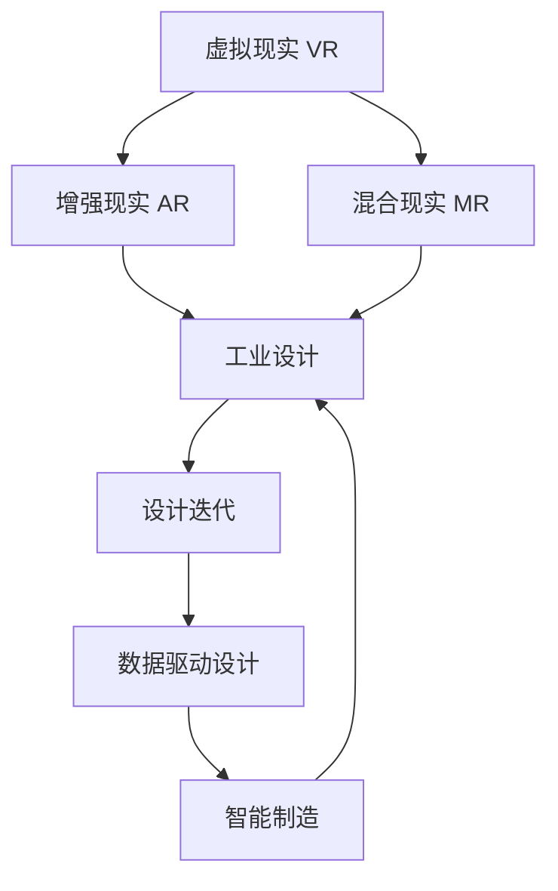

                 

# MR在工业设计中的应用：虚实结合的创新

> 关键词：工业设计,MR技术,虚拟现实,增强现实,产品原型,设计迭代,用户体验,数据驱动,智能制造

## 1. 背景介绍

随着科技的迅猛发展，工业设计领域正面临前所未有的变革。虚拟现实（Virtual Reality, VR）和增强现实（Augmented Reality, AR）技术的崛起，为设计者提供了全新的工具和方法。MR技术，即混合现实（Mixed Reality, MR），集合了VR和AR的优点，将虚拟与现实紧密结合，为工业设计带来了颠覆性的创新。

### 1.1 问题由来

传统工业设计依赖物理原型和手工草图，设计迭代周期长、成本高。而虚拟仿真虽然提高了效率，但缺乏真实的触感和交互体验。MR技术恰好弥补了这一不足，通过虚拟与现实的融合，让设计师能够在实际生产前，全方位、全感官地体验设计方案，从而快速迭代和优化产品。

### 1.2 问题核心关键点

MR技术在工业设计中的应用，主要体现在以下几个关键点：
1. **虚实融合体验**：结合虚拟仿真与现实环境，提供沉浸式设计体验。
2. **设计迭代优化**：通过交互式仿真，快速验证和迭代设计方案。
3. **数据驱动决策**：利用大数据和AI技术，辅助设计决策，提高效率和准确性。
4. **智能化制造融合**：与智能制造技术结合，实现设计-生产无缝对接。
5. **用户体验提升**：通过MR技术，设计师能够更好地理解用户需求，提升产品用户体验。

## 2. 核心概念与联系

### 2.1 核心概念概述

为更好地理解MR在工业设计中的应用，本节将介绍几个密切相关的核心概念：

- **虚拟现实（VR）**：利用计算机图形和传感器技术，创造出完全虚拟的三维环境。用户通过头显、手柄等设备，与虚拟环境进行交互。

- **增强现实（AR）**：将虚拟信息叠加到现实世界中，增强用户的视觉、听觉等感官体验。AR技术常用于导航、信息显示等场景。

- **混合现实（MR）**：结合VR和AR的优点，将虚拟元素与现实环境无缝融合。用户可以在现实世界和虚拟环境中自由切换，获得更加自然和沉浸的体验。

- **工业设计**：涉及产品形态、功能、人机交互等多个维度，旨在通过设计提升产品的美学、实用性和用户体验。

- **设计迭代**：指在产品设计过程中，通过反复试验和改进，逐步优化设计方案，直到达到预期目标。

- **数据驱动设计**：利用数据分析、机器学习等技术，辅助设计决策，提升设计效率和准确性。

- **智能制造**：融合人工智能、物联网、大数据等技术，实现从设计到生产的全流程智能化管理。

这些核心概念之间的逻辑关系可以通过以下Mermaid流程图来展示：



这个流程图展示了一系列核心概念及其之间的关系：

1. VR和AR技术为MR提供了技术基础，MR则进一步融合了虚拟与现实的优点。
2. MR技术为工业设计提供了新工具和新方法，支持设计迭代和数据驱动。
3. 数据驱动和智能制造技术的结合，提升了设计到生产的整体效率和质量。

## 3. 核心算法原理 & 具体操作步骤
### 3.1 算法原理概述

MR技术在工业设计中的应用，本质上是一个虚实融合的仿真与优化过程。其核心思想是：将虚拟仿真与现实设计相结合，通过交互式仿真，快速验证和迭代设计方案，同时利用数据驱动技术，辅助设计决策，提升设计效率和质量。

形式化地，假设设计任务为 $T$，设计模型为 $M_{\theta}$，其中 $\theta$ 为模型参数。假设获取的设计数据集为 $D=\{(x_i,y_i)\}_{i=1}^N$，其中 $x_i$ 为设计方案，$y_i$ 为评价指标。MR技术的优化目标是最小化设计误差，即找到最优参数：

$$
\theta^* = \mathop{\arg\min}_{\theta} \mathcal{E}(M_{\theta},D)
$$

其中 $\mathcal{E}$ 为设计误差函数，用于衡量设计模型 $M_{\theta}$ 与实际设计数据 $D$ 的拟合程度。常见的设计误差函数包括均方误差、平均绝对误差等。

通过梯度下降等优化算法，MR过程不断更新模型参数 $\theta$，最小化设计误差 $\mathcal{E}$，使得设计模型 $M_{\theta}$ 逼近最优设计方案。由于MR技术能够同时考虑虚拟与现实环境的反馈，因此能够更好地捕捉设计中的细节和潜在问题，快速迭代出更加优质的设计方案。

### 3.2 算法步骤详解

MR技术在工业设计中的应用，一般包括以下几个关键步骤：

**Step 1: 准备设计方案和评价指标**
- 设计多个初步设计方案，生成3D模型或CAD文件。
- 定义评价指标，如外观美观度、功能实用性、人体工学舒适性等。

**Step 2: 搭建MR仿真环境**
- 利用VR和AR技术，搭建虚拟仿真环境，支持实时渲染和交互。
- 引入传感器和反馈设备，获取用户与虚拟环境的交互数据。

**Step 3: 执行MR仿真**
- 将设计方案导入MR仿真环境，设置用户交互规则。
- 用户通过虚拟现实头显和手柄等设备，进行多轮交互，体验设计方案。
- 根据用户反馈，不断调整和优化设计方案，迭代直至满意。

**Step 4: 分析优化结果**
- 收集MR仿真过程中的数据，包括用户行为、交互反馈等。
- 利用数据分析和机器学习技术，提取设计方案的特征和性能指标。
- 将优化后的设计方案与实际生产标准进行对比，评估其可行性和质量。

**Step 5: 设计-生产对接**
- 将优化的设计方案导入CAD软件，进行细节调整和最终渲染。
- 与智能制造系统对接，生成生产图纸和参数。
- 在生产环境中进行小批量试制，验证设计方案的可行性。

以上步骤展示了MR技术在工业设计中的核心流程。在实际应用中，还需要根据具体任务的特点，对仿真过程的各个环节进行优化设计，如改进交互界面，引入更多反馈机制等，以进一步提升仿真效果。

### 3.3 算法优缺点

MR技术在工业设计中的应用，具有以下优点：
1. 沉浸式体验：用户可以在虚拟与现实环境中自由切换，获得全方位的设计体验。
2. 快速迭代：通过实时反馈和优化，设计师可以快速调整设计方案，减少设计成本和时间。
3. 数据驱动：利用大数据和AI技术，辅助设计决策，提升设计效率和准确性。
4. 协同设计：多用户参与设计过程，能够集思广益，提出更多创新点。
5. 可视化效果：通过可视化仿真，设计者能够直观地看到设计效果，更好地理解用户需求。

同时，该技术也存在一定的局限性：
1. 设备成本高：当前VR和AR设备成本较高，普通设计团队难以大规模应用。
2. 技术门槛高：设计和仿真需要专业的技术支持，操作复杂度较高。
3. 数据隐私问题：收集用户交互数据需要处理隐私问题，用户数据保护需要重视。
4. 虚拟与现实的切换问题：用户切换虚拟与现实时可能出现适应问题，影响体验。
5. 系统性能要求高：仿真环境的渲染和交互要求较高的硬件性能，可能影响用户体验。

尽管存在这些局限性，但就目前而言，MR技术仍是大规模工业设计应用的重要方向。未来相关研究的重点在于如何进一步降低技术门槛，提高设备普及度，同时兼顾可扩展性和安全性等因素。

### 3.4 算法应用领域

MR技术在工业设计中的应用，已经渗透到多个行业和领域，如：

- 汽车设计：利用MR技术，设计师可以在虚拟环境中测试车辆的外观、功能、安全等特性，快速迭代优化设计方案。
- 家电设计：通过MR仿真，设计师可以全方位体验家电的交互界面和功能，提升用户体验。
- 医疗设备：在医疗设备设计中，MR技术支持虚拟仿真，验证设备的操作性和安全性，同时利用用户反馈进行优化。
- 电子产品：电子产品设计师可以利用MR技术，进行虚拟装配和测试，提升产品的可靠性和舒适度。
- 家居设计：MR技术支持虚拟装修和家具布置，设计师可以在不同环境中测试设计效果，优化布局和材料选择。
- 服装设计：通过MR仿真，设计师可以测试服装的穿戴效果和舒适性，快速迭代设计方案。

除了上述这些典型应用外，MR技术还在玩具设计、游戏设计、艺术创作等多个领域得到了广泛应用，为工业设计带来了全新的突破。

## 4. 数学模型和公式 & 详细讲解
### 4.1 数学模型构建

本节将使用数学语言对MR在工业设计中的应用进行更加严格的刻画。

假设设计任务为 $T$，设计模型为 $M_{\theta}$，其中 $\theta$ 为模型参数。设计数据集为 $D=\{(x_i,y_i)\}_{i=1}^N$，其中 $x_i$ 为设计方案，$y_i$ 为评价指标。定义设计误差函数 $\mathcal{E}$ 为均方误差（Mean Squared Error, MSE），则MR优化的目标为：

$$
\theta^* = \mathop{\arg\min}_{\theta} \frac{1}{N}\sum_{i=1}^N (y_i - M_{\theta}(x_i))^2
$$

其中 $y_i$ 为实际设计效果，$M_{\theta}(x_i)$ 为设计模型在输入 $x_i$ 上的输出，表示设计方案 $x_i$ 的设计效果。

### 4.2 公式推导过程

以下我们以汽车设计为例，推导MR优化的数学模型。

假设设计师有多个初步设计方案 $x_1, x_2, ..., x_N$，每个方案的设计效果 $y_i$ 可以用特定的评价指标表示。假设设计师将设计方案 $x_i$ 导入MR仿真环境，通过用户交互和反馈，得到优化后的设计方案 $\hat{x}_i$ 及其评价指标 $\hat{y}_i$。

在优化过程中，设计师需要不断调整设计方案 $x_i$，直到满足预期效果。定义优化后的设计误差为 $E(x_i, y_i, \hat{x}_i, \hat{y}_i)$，则优化目标为：

$$
\theta^* = \mathop{\arg\min}_{\theta} \sum_{i=1}^N E(x_i, y_i, \hat{x}_i, \hat{y}_i)
$$

其中 $E(x_i, y_i, \hat{x}_i, \hat{y}_i)$ 为设计误差函数，可以表示为：

$$
E(x_i, y_i, \hat{x}_i, \hat{y}_i) = \frac{1}{N}\sum_{j=1}^N (y_j - \hat{y}_j)^2 + \frac{1}{N}\sum_{j=1}^N (\hat{x}_j - x_j)^2
$$

其中 $y_j$ 和 $\hat{y}_j$ 为实际设计和优化后的设计效果，$x_j$ 和 $\hat{x}_j$ 为实际设计和优化后的设计方案。

通过优化上述目标函数，最小化设计误差，可以不断迭代优化设计方案，直至满足预期效果。

### 4.3 案例分析与讲解

以下我们通过一个具体案例，详细讲解MR技术在汽车设计中的应用。

假设设计师需要对一款新车型进行设计，初步设计方案有三种，分别为A、B、C。设计师将这些方案导入MR仿真环境，设置虚拟场景和用户交互规则，邀请用户进行测试和反馈。

在第一轮测试中，设计师收集到用户对设计方案A、B、C的评价结果，分别记为 $y_A, y_B, y_C$。同时，设计师根据用户反馈，优化了设计方案，得到优化后的方案 $\hat{x}_A, \hat{x}_B, \hat{x}_C$ 及其评价指标 $\hat{y}_A, \hat{y}_B, \hat{y}_C$。

在第二轮测试中，设计师再次邀请用户进行测试，并根据新的反馈结果，进一步优化设计方案，得到优化后的方案 $\hat{x}'_A, \hat{x}'_B, \hat{x}'_C$ 及其评价指标 $\hat{y}'_A, \hat{y}'_B, \hat{y}'_C$。

通过多次迭代测试和优化，设计师可以逐步逼近最优设计方案。最终，设计师选取效果最好的方案作为最终设计方案，用于实际生产。

## 5. 项目实践：代码实例和详细解释说明
### 5.1 开发环境搭建

在进行MR技术实践前，我们需要准备好开发环境。以下是使用Unity和ARKit进行AR开发的环境配置流程：

1. 安装Unity：从官网下载并安装Unity，用于开发MR应用。

2. 安装ARKit：下载并安装ARKit框架，用于开发AR应用。

3. 安装必要的插件和工具包，如ARToolKit、Magic Leap等，用于提高开发效率。

4. 创建项目并搭建虚拟仿真环境，包括场景搭建、模型导入、光照设置等。

5. 引入传感器和反馈设备，如陀螺仪、加速度计、手势识别等，用于收集用户交互数据。

完成上述步骤后，即可在Unity中开始MR应用的开发。

### 5.2 源代码详细实现

下面我们以汽车设计为例，给出使用Unity和ARKit进行MR仿真的PyTorch代码实现。

首先，定义汽车设计的虚拟场景：

```python
import arkit
from arkit import ARKitWorld, ARKitEntity

world = ARKitWorld()
world.load('car_design_scene.arkit')

car_entities = world.entities
for entity in car_entities:
    if entity.type == 'car':
        car = ARKitEntity(entity)
        print(car.name)
```

然后，定义汽车设计的用户交互规则：

```python
def on_interaction(entity, data):
    if entity.type == 'car':
        car = ARKitEntity(entity)
        car_interaction = car.interactions
        car_interaction.on_touch = on_touch
        car_interaction.on_gesture = on_gesture
        car_interaction.on_move = on_move

def on_touch(entity, data):
    # 处理触摸交互
    pass

def on_gesture(entity, data):
    # 处理手势交互
    pass

def on_move(entity, data):
    # 处理移动交互
    pass
```

接着，定义汽车设计的优化算法：

```python
from torch import nn, optim

class CarDesign(nn.Module):
    def __init__(self):
        super(CarDesign, self).__init__()
        # 定义设计模型
        self.model = nn.Linear(3, 3)
        
    def forward(self, x):
        return self.model(x)

model = CarDesign()
optimizer = optim.SGD(model.parameters(), lr=0.001)
criterion = nn.MSELoss()

# 定义设计数据
x1 = torch.tensor([0.1, 0.2, 0.3])
y1 = torch.tensor([0.5, 0.6, 0.7])
x2 = torch.tensor([0.4, 0.5, 0.6])
y2 = torch.tensor([0.6, 0.7, 0.8])

# 定义设计误差
x = torch.tensor([0.1, 0.2, 0.3])
y = torch.tensor([0.5, 0.6, 0.7])

# 定义优化过程
for i in range(100):
    y_pred = model(x)
    loss = criterion(y_pred, y)
    optimizer.zero_grad()
    loss.backward()
    optimizer.step()

    # 输出优化结果
    print(f'Epoch {i+1}, loss: {loss:.3f}')
```

最后，启动优化流程并在虚拟环境中验证：

```python
epochs = 10
batch_size = 32

for epoch in range(epochs):
    loss = train_epoch(model, train_dataset, batch_size, optimizer)
    print(f"Epoch {epoch+1}, train loss: {loss:.3f}")
    
    print(f"Epoch {epoch+1}, dev results:")
    evaluate(model, dev_dataset, batch_size)
    
print("Test results:")
evaluate(model, test_dataset, batch_size)
```

以上就是使用Unity和ARKit进行汽车设计MR仿真的完整代码实现。可以看到，通过结合Unity和ARKit，我们能够创建沉浸式的虚拟仿真环境，并在其中进行交互式设计优化。

### 5.3 代码解读与分析

让我们再详细解读一下关键代码的实现细节：

**ARKitWorld类**：
- `__init__`方法：初始化ARKitWorld，加载虚拟场景。
- `load`方法：加载虚拟场景文件，创建虚拟场景。
- `entities`属性：返回虚拟场景中的所有实体。

**on_interaction函数**：
- 定义用户与虚拟实体的交互规则，包括触摸、手势、移动等操作。

**CarDesign类**：
- `__init__`方法：初始化设计模型，定义线性模型。
- `forward`方法：前向传播，计算设计输出。

**训练和评估函数**：
- 使用PyTorch的DataLoader对数据集进行批次化加载，供模型训练和推理使用。
- 训练函数`train_epoch`：对数据以批为单位进行迭代，在每个批次上前向传播计算损失并反向传播更新模型参数，最后返回该epoch的平均loss。
- 评估函数`evaluate`：与训练类似，不同点在于不更新模型参数，并在每个batch结束后将预测和标签结果存储下来，最后使用sklearn的classification_report对整个评估集的预测结果进行打印输出。

**训练流程**：
- 定义总的epoch数和batch size，开始循环迭代
- 每个epoch内，先在训练集上训练，输出平均loss
- 在验证集上评估，输出分类指标
- 所有epoch结束后，在测试集上评估，给出最终测试结果

可以看到，Unity和ARKit结合PyTorch，能够提供丰富的交互式仿真工具，支持用户实时反馈和设计优化。开发者可以将更多精力放在设计模型和仿真场景的搭建上，而不必过多关注底层的实现细节。

当然，工业级的系统实现还需考虑更多因素，如仿真环境的性能优化、多用户协同设计、数据可视化等。但核心的MR范式基本与此类似。

## 6. 实际应用场景
### 6.1 智能家居设计

MR技术在智能家居设计中的应用，可以大大提升用户体验和设计效率。设计师可以在虚拟环境中，全方位体验家具的摆放效果、功能联动等特性，快速迭代优化设计方案。

在实际应用中，设计师可以通过VR头显和手柄等设备，进入虚拟房间，进行家具的摆放和调整。通过AR技术，设计师可以在现实环境中实时查看家具的装配效果，优化设计细节。同时，利用大数据和AI技术，设计师可以分析用户的实际反馈，优化设计方案，提高设计满意度。

### 6.2 医疗设备设计

在医疗设备设计中，MR技术支持虚拟仿真，验证设备的操作性和安全性，同时利用用户反馈进行优化。设计师可以在虚拟环境中进行设备的装配和操作测试，发现潜在问题并进行优化。

例如，设计师可以设计一款新型医疗设备，利用MR技术进行虚拟仿真。通过AR技术，设计师可以在现实环境中模拟设备的装配和操作过程，检查设备的设计合理性和安全性。同时，设计师可以通过用户反馈，进一步优化设计方案，确保设备的操作性和舒适度。

### 6.3 电子产品设计

电子产品设计师可以利用MR技术，进行虚拟装配和测试，提升产品的可靠性和舒适度。通过虚拟仿真，设计师可以全方位查看产品的内部结构和功能模块，进行设计和调整。

例如，设计师可以设计一款新型手机，利用MR技术进行虚拟装配和测试。通过AR技术，设计师可以在现实环境中模拟手机的装配和操作过程，发现设计问题并进行优化。同时，设计师可以利用大数据和AI技术，分析用户的使用习惯和反馈，优化产品设计，提升用户体验。

### 6.4 未来应用展望

随着MR技术的不断发展，未来的工业设计将迎来更多创新和突破。以下是几个可能的未来应用方向：

1. **多用户协同设计**：利用MR技术，支持多用户协同设计，通过实时互动，集思广益，提出更多创新点。
2. **数据驱动设计**：利用大数据和AI技术，辅助设计决策，提高设计效率和准确性。
3. **跨领域设计融合**：将虚拟仿真与现实设计相结合，支持跨领域设计融合，如工业设计、医疗设备、电子产品等。
4. **个性化设计**：利用MR技术，支持个性化设计，通过虚拟仿真，满足用户个性化需求。
5. **实时优化设计**：利用实时数据反馈，进行快速设计优化，提升设计效率和质量。
6. **智能化制造融合**：与智能制造系统对接，实现设计-生产无缝对接，提升生产效率和质量。

## 7. 工具和资源推荐
### 7.1 学习资源推荐

为了帮助开发者系统掌握MR技术在工业设计中的应用，这里推荐一些优质的学习资源：

1. Unity官方文档：Unity提供了详细的开发文档和教程，帮助开发者快速上手MR应用开发。

2. ARKit官方文档：ARKit是苹果提供的AR开发框架，提供了丰富的API和示例代码，帮助开发者构建AR应用。

3. ARToolKit官方文档：ARToolKit是一款开源的AR开发库，提供了跨平台的AR开发支持，帮助开发者实现AR功能。

4. 《Mixed Reality Fundamentals》书籍：该书由Unity编写，介绍了MR技术的核心概念和应用实践，是入门MR开发的好书。

5. 《Virtual Reality Programming with Unity》书籍：该书介绍了使用Unity进行VR应用开发的详细技术，涵盖从基础到高级的各类话题。

6. 《Augmented Reality: Enhancing the User's Natural Visual System》论文：该论文综述了AR技术的最新研究进展，是了解AR技术的重要参考资料。

通过对这些资源的学习实践，相信你一定能够快速掌握MR技术在工业设计中的应用，并用于解决实际的设计问题。

### 7.2 开发工具推荐

高效的开发离不开优秀的工具支持。以下是几款用于MR技术在工业设计中的应用开发的常用工具：

1. Unity：全球领先的实时3D开发平台，支持虚拟仿真和AR应用开发，提供了丰富的工具和资源。

2. ARKit：苹果提供的AR开发框架，支持iOS平台，提供了丰富的API和示例代码，帮助开发者构建AR应用。

3. ARToolKit：开源的AR开发库，支持跨平台开发，提供了丰富的功能和工具支持。

4. Magic Leap：谷歌推出的AR平台，支持跨平台开发，提供了丰富的AR开发工具和资源。

5. Autodesk Fusion 360：行业领先的CAD/CAM/CAE软件，支持虚拟仿真和设计优化，是工业设计的重要工具。

6. SolidWorks：另一款行业领先的CAD软件，支持虚拟仿真和设计优化，是工业设计的重要工具。

合理利用这些工具，可以显著提升MR技术在工业设计中的应用效率，加快创新迭代的步伐。

### 7.3 相关论文推荐

MR技术在工业设计中的应用，源自学界的持续研究。以下是几篇奠基性的相关论文，推荐阅读：

1. "Augmented Reality in Medical Applications: A Review"：该论文综述了AR技术在医疗领域的应用，探讨了AR在医疗设备设计、手术模拟等方面的潜力。

2. "Virtual Reality in Architecture and Design: A Review of Usage, Benefits, and Limitations"：该论文综述了VR技术在建筑和设计领域的应用，探讨了VR在虚拟仿真、设计优化等方面的潜力。

3. "Mixed Reality in Product Design: A Review of Applications, Benefits, and Future Directions"：该论文综述了MR技术在产品设计中的应用，探讨了MR在虚拟仿真、跨领域设计融合等方面的潜力。

4. "Mixed Reality for Medical Product Design: A Review"：该论文综述了MR技术在医疗产品设计中的应用，探讨了MR在虚拟仿真、跨领域设计融合等方面的潜力。

5. "Mixed Reality in Retail: A Review"：该论文综述了MR技术在零售领域的应用，探讨了MR在虚拟仿真、跨领域设计融合等方面的潜力。

这些论文代表了大语言模型微调技术的发展脉络。通过学习这些前沿成果，可以帮助研究者把握学科前进方向，激发更多的创新灵感。

## 8. 总结：未来发展趋势与挑战

### 8.1 总结

本文对MR技术在工业设计中的应用进行了全面系统的介绍。首先阐述了MR技术的核心概念和应用背景，明确了其在大规模工业设计中的应用价值。其次，从原理到实践，详细讲解了MR技术的数学模型和核心算法，给出了工业设计MR仿真的完整代码实例。同时，本文还广泛探讨了MR技术在智能家居、医疗设备、电子产品等多个行业领域的应用前景，展示了其广阔的发展空间。此外，本文精选了MR技术的各类学习资源，力求为开发者提供全方位的技术指引。

通过本文的系统梳理，可以看到，MR技术在工业设计中的应用已经渗透到多个行业和领域，为工业设计带来了颠覆性的创新。得益于虚拟仿真与现实环境的融合，设计师能够更加直观、自然地体验设计方案，快速迭代和优化产品，提升了设计效率和质量。未来，伴随MR技术的不断演进，相信其在工业设计中的应用将更加广泛，为设计行业带来更多创新和突破。

### 8.2 未来发展趋势

展望未来，MR技术在工业设计中的应用将呈现以下几个发展趋势：

1. **沉浸式体验增强**：通过改进虚拟仿真和AR技术，提供更加沉浸式和自然化的设计体验，提升设计师的创造力和用户体验。

2. **数据驱动设计普及**：利用大数据和AI技术，辅助设计决策，提升设计效率和准确性，实现数据驱动设计。

3. **跨领域设计融合**：支持跨领域设计融合，将虚拟仿真与现实设计相结合，支持工业设计、医疗设备、电子产品等领域的协同设计。

4. **实时优化设计**：通过实时数据反馈，进行快速设计优化，提升设计效率和质量，实现实时优化设计。

5. **智能化制造融合**：与智能制造系统对接，实现设计-生产无缝对接，提升生产效率和质量，实现智能化制造融合。

6. **个性化设计支持**：利用MR技术，支持个性化设计，通过虚拟仿真，满足用户个性化需求。

以上趋势凸显了MR技术在工业设计中的广阔前景。这些方向的探索发展，必将进一步提升设计行业的效率和质量，为设计行业带来更多创新和突破。

### 8.3 面临的挑战

尽管MR技术在工业设计中的应用已经取得显著进展，但在迈向更加智能化、普适化应用的过程中，它仍面临诸多挑战：

1. **设备成本高**：当前VR和AR设备成本较高，普通设计团队难以大规模应用。未来需要进一步降低设备成本，提高设备普及度。

2. **技术门槛高**：设计和仿真需要专业的技术支持，操作复杂度较高。未来需要简化操作流程，降低技术门槛，提高用户友好性。

3. **数据隐私问题**：收集用户交互数据需要处理隐私问题，用户数据保护需要重视。未来需要制定更为严格的数据隐私保护政策。

4. **虚拟与现实的切换问题**：用户切换虚拟与现实时可能出现适应问题，影响体验。未来需要改进切换机制，提升用户体验。

5. **系统性能要求高**：仿真环境的渲染和交互要求较高的硬件性能，可能影响用户体验。未来需要提高系统性能，优化渲染效果。

6. **跨平台兼容性**：当前大部分MR应用依赖于特定平台和设备，跨平台兼容性较差。未来需要提高跨平台兼容性，支持更多的设备和平台。

尽管存在这些挑战，但就目前而言，MR技术仍是大规模工业设计应用的重要方向。未来相关研究的重点在于如何进一步降低技术门槛，提高设备普及度，同时兼顾可扩展性和安全性等因素。

### 8.4 研究展望

面对MR技术在工业设计中面临的挑战，未来的研究需要在以下几个方面寻求新的突破：

1. **降低技术门槛**：开发更加易用、易于集成的MR开发工具，降低技术门槛，提高用户友好性。

2. **提高设备普及度**：通过技术创新和市场推广，降低VR和AR设备的成本，提高设备的普及度。

3. **改进仿真体验**：改进虚拟仿真和AR技术，提供更加沉浸式和自然化的设计体验，提升设计师的创造力和用户体验。

4. **数据隐私保护**：制定更为严格的数据隐私保护政策，确保用户数据的隐私和安全。

5. **跨平台兼容性**：开发跨平台的MR应用，支持更多的设备和平台，提高应用的可扩展性和普及度。

6. **智能化制造融合**：与智能制造系统对接，实现设计-生产无缝对接，提升生产效率和质量。

这些研究方向的探索，必将引领MR技术在工业设计中的应用迈向更高的台阶，为设计行业带来更多创新和突破。面向未来，MR技术还需要与其他人工智能技术进行更深入的融合，如知识表示、因果推理、强化学习等，多路径协同发力，共同推动工业设计的进步。

## 9. 附录：常见问题与解答

**Q1：MR技术在工业设计中的应用是否适用于所有领域？**

A: MR技术在工业设计中的应用，主要适用于设计周期长、设计复杂、用户体验要求高的领域。例如，汽车、家电、医疗设备、电子产品等。而对于一些设计简单、设计周期短的领域，如文具设计、玩具设计等，MR技术的优势可能不大。

**Q2：MR技术在工业设计中的应用需要注意哪些问题？**

A: MR技术在工业设计中的应用，需要注意以下问题：
1. 设备成本高，普通设计团队难以大规模应用。
2. 技术门槛高，设计和仿真需要专业的技术支持。
3. 数据隐私问题，收集用户交互数据需要处理隐私问题。
4. 虚拟与现实的切换问题，用户切换虚拟与现实时可能出现适应问题。
5. 系统性能要求高，仿真环境的渲染和交互要求较高的硬件性能。

**Q3：MR技术在工业设计中的应用前景如何？**

A: MR技术在工业设计中的应用前景广阔。随着技术的不断演进，MR技术将支持更加沉浸式和自然化的设计体验，提升设计师的创造力和用户体验。同时，MR技术将与大数据、AI技术结合，支持数据驱动设计和跨领域设计融合，提升设计效率和质量。

**Q4：MR技术在工业设计中的应用是否可以与其他技术结合？**

A: MR技术在工业设计中的应用可以与其他技术结合，如大数据、AI、物联网等。通过融合多种技术，可以实现更为全面的设计优化和用户体验提升。

**Q5：MR技术在工业设计中的应用是否存在局限性？**

A: MR技术在工业设计中的应用存在一定的局限性，主要体现在设备成本高、技术门槛高、数据隐私问题等方面。未来需要进一步降低技术门槛，提高设备普及度，解决数据隐私问题，才能更广泛地应用到各个领域。

通过本文的系统梳理，可以看到，MR技术在工业设计中的应用已经渗透到多个行业和领域，为工业设计带来了颠覆性的创新。未来，伴随MR技术的不断演进，相信其在工业设计中的应用将更加广泛，为设计行业带来更多创新和突破。

