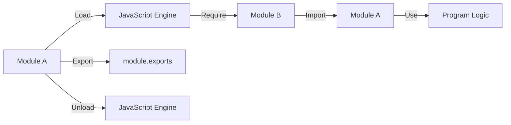

                 

# Node.js 模块化编程：管理大型项目

## 1. 背景介绍

### 1.1 问题由来

随着JavaScript应用程序规模的不断扩大，如何有效地组织和管理代码成为了一个重要的挑战。传统JavaScript应用程序通常采用单一文件或一组文件的方式进行编码，随着项目规模的增大，这种模式的维护性和可扩展性变得越来越差。在这种情况下，模块化编程显得尤为重要。

Node.js作为一种基于JavaScript的服务器端运行环境，它自身就是一个典型的模块化编程范例，具有良好的组织结构，支持模块的动态加载、共享和重复使用。本文将围绕Node.js的模块化编程，探讨如何管理大型项目，构建可维护、可扩展的JavaScript应用程序。

### 1.2 问题核心关键点

Node.js的模块化编程主要围绕以下几个关键点展开：

1. **模块的加载和使用**：如何动态加载模块，以及如何在程序中引用和调用这些模块。
2. **模块的组织和管理**：如何通过合理的组织方式，将项目代码划分为独立的模块。
3. **模块间的通信**：如何通过不同模块之间的通信，实现功能解耦和数据共享。
4. **模块的生命周期管理**：如何控制模块的加载和卸载，确保程序状态的一致性和资源管理。

本文将围绕这些核心关键点，详细介绍Node.js模块化编程的原理、步骤和最佳实践。

## 2. 核心概念与联系

### 2.1 核心概念概述

在深入探讨Node.js模块化编程之前，首先需要理解以下核心概念：

- **模块（Module）**：一个独立的JavaScript文件，通常包含一个或多个函数、变量和类等，可以在其他文件中使用。
- **动态加载（Dynamic Loading）**：在程序运行时，动态地加载和引用模块，而不是在程序启动时一次性加载所有模块。
- **模块导出（Module Exports）**：模块中的函数、变量和类等可以通过export关键字导出，供其他模块使用。
- **模块导入（Module Imports）**：其他模块可以通过import关键字导入所需的模块，使用其导出内容。
- **生命周期（Lifecycle）**：模块从加载到卸载的过程，包括初始化、使用和销毁等阶段。

这些概念构成了Node.js模块化编程的基础，通过合理使用这些概念，可以构建出高效、可维护的JavaScript应用程序。

### 2.2 核心概念原理和架构的 Mermaid 流程图



这个流程图展示了Node.js模块化编程的基本流程：模块A通过export导出其内容，模块B通过require导入模块A，并使用其中的内容。模块的生命周期从加载开始，到使用和卸载结束。

## 3. 核心算法原理 & 具体操作步骤

### 3.1 算法原理概述

Node.js模块化编程的原理是动态加载和模块导出/导入的结合。通过动态加载，程序可以在运行时根据需要加载模块，避免不必要的资源浪费。通过模块导出/导入，程序可以灵活地引用和共享模块，实现代码的重用和组织。

### 3.2 算法步骤详解

Node.js模块化编程主要包括以下几个关键步骤：

**Step 1: 创建模块**

创建一个或多个独立的JavaScript文件，每个文件包含一个或多个模块。模块可以包含函数、变量、类等，但应尽可能地保持单一职责。

**Step 2: 导出模块**

使用`module.exports`语句将模块中的函数、变量或类导出，供其他模块使用。

**Step 3: 动态加载模块**

在程序中使用`require`语句动态加载所需的模块，并将其内容保存在一个变量中。

**Step 4: 使用模块**

通过变量引用加载的模块，使用其中的函数、变量或类等，实现程序功能。

**Step 5: 模块卸载**

在程序不再需要某个模块时，通过`module.exports`将模块内容设置为`null`，实现模块的卸载。

### 3.3 算法优缺点

**优点**：

1. **代码复用**：模块化编程允许开发者将代码划分为独立的模块，便于代码的复用和维护。
2. **动态加载**：动态加载模块可以优化内存使用，减少程序的启动时间。
3. **功能解耦**：模块化编程可以解耦模块间的依赖关系，提高程序的可维护性和可扩展性。

**缺点**：

1. **学习成本**：模块化编程需要开发者理解模块的加载和导出机制，具有一定的学习成本。
2. **性能开销**：动态加载和导出机制可能会带来一定的性能开销，特别是在模块数量较多时。
3. **依赖管理**：模块之间的依赖关系需要明确管理，避免出现循环依赖等问题。

### 3.4 算法应用领域

Node.js模块化编程在以下领域中得到了广泛应用：

1. **Web应用**：Node.js模块化编程广泛应用于Web应用的开发，通过将应用程序划分为多个模块，实现前后端分离、功能模块化。
2. **桌面应用**：Electron等框架利用Node.js的模块化特性，实现了跨平台的桌面应用程序开发。
3. **服务器端应用**：Node.js在服务器端应用中同样适用，通过模块化编程实现高性能、高可维护的服务器端解决方案。
4. **命令行工具**：许多命令行工具也采用了Node.js的模块化编程，通过模块的组合和调用，实现复杂的功能。

## 4. 数学模型和公式 & 详细讲解 & 举例说明

### 4.1 数学模型构建

Node.js的模块化编程主要基于JavaScript引擎的模块加载和导出机制。因此，我们可以用简单的数学模型来表示这一过程。

设模块A包含函数`module.exports = function`，模块B使用`const { function } = require('moduleA')`导入模块A中的函数。则模块A的导出函数和模块B的导入函数之间的关系可以用以下数学模型表示：

$$
y = f(x)
$$

其中，$x$为模块A的导出函数，$y$为模块B的导入函数，$f$为函数映射关系。

### 4.2 公式推导过程

假设模块A的导出函数为$g$，模块B的导入函数为$h$，则有：

$$
h = g
$$

进一步地，假设模块A和B分别有$m$个和$n$个导出函数，则有：

$$
\begin{aligned}
h_1 &= g_1 \\
h_2 &= g_2 \\
&\vdots \\
h_n &= g_n
\end{aligned}
$$

### 4.3 案例分析与讲解

以一个简单的Web应用为例，分析Node.js模块化编程的实现过程。

1. **模块划分**：将Web应用划分为路由、控制器、模型和视图等模块，每个模块包含一个或多个函数、变量和类。
2. **模块导出**：使用`module.exports`将模块中的函数、变量或类导出，如`module.exports = router`，供其他模块使用。
3. **动态加载**：在主程序中使用`const router = require('./routes')`动态加载路由模块，并保存其内容。
4. **模块使用**：在其他模块中使用`router`，调用其中的函数，实现应用程序功能，如`router.get('/', function)`.
5. **模块卸载**：在程序退出时，通过`module.exports = null`将模块内容设置为`null`，实现模块的卸载。

## 5. 项目实践：代码实例和详细解释说明

### 5.1 开发环境搭建

要搭建Node.js开发环境，需要安装Node.js和npm（Node.js包管理器）。具体步骤如下：

1. 下载并安装Node.js和npm。
2. 配置环境变量，设置`PATH`、`NODE_PATH`等变量。
3. 初始化项目，使用`npm init`创建`package.json`文件。

### 5.2 源代码详细实现

以下是一个简单的Node.js模块化编程示例，包含路由、控制器和模型三个模块：

**routes.js**：

```javascript
// 路由模块
module.exports = {
    get: function(req, res) {
        // 处理GET请求
    },
    post: function(req, res) {
        // 处理POST请求
    }
}
```

**controllers.js**：

```javascript
// 控制器模块
const routes = require('./routes');

module.exports = {
    index: function(req, res) {
        // 调用路由模块处理GET请求
        routes.get(req, res);
    },
    create: function(req, res) {
        // 调用路由模块处理POST请求
        routes.post(req, res);
    }
}
```

**models.js**：

```javascript
// 模型模块
module.exports = {
    getUser: function(id) {
        // 查询用户信息
    },
    saveUser: function(user) {
        // 保存用户信息
    }
}
```

**index.js**：

```javascript
// 主程序模块
const controllers = require('./controllers');
const models = require('./models');

module.exports = {
    index: function(req, res) {
        // 调用控制器处理GET请求
        controllers.index(req, res);
    },
    create: function(req, res) {
        // 调用控制器处理POST请求
        controllers.create(req, res);
    }
}
```

### 5.3 代码解读与分析

以上示例代码展示了Node.js模块化编程的基本实现过程。其中，`module.exports`用于导出模块中的内容，`require`用于动态加载所需的模块，模块之间的调用通过变量引用实现。

### 5.4 运行结果展示

在运行程序后，可以通过`http://localhost:3000`访问Web应用，并进行GET和POST请求。请求的处理逻辑在路由模块和控制器模块中实现，查询和保存用户信息在模型模块中实现。

## 6. 实际应用场景

### 6.1 Web应用

Node.js模块化编程在Web应用中得到了广泛应用，如Express框架就是一个典型的例子。通过将Web应用划分为路由、控制器和模型等模块，实现前后端分离，提高了应用程序的可维护性和可扩展性。

### 6.2 桌面应用

Electron等框架利用Node.js的模块化特性，实现了跨平台的桌面应用程序开发。通过将应用程序划分为多个模块，实现功能模块化，提高了应用的灵活性和可扩展性。

### 6.3 服务器端应用

Node.js在服务器端应用中同样适用，通过模块化编程实现高性能、高可维护的服务器端解决方案。例如，Koa框架利用Node.js的模块化特性，实现了轻量级、高扩展性的Web应用框架。

### 6.4 命令行工具

许多命令行工具也采用了Node.js的模块化编程，通过模块的组合和调用，实现复杂的功能。例如，Gulp和Grunt等构建工具利用Node.js的模块化特性，实现了任务调度和自动化构建。

## 7. 工具和资源推荐

### 7.1 学习资源推荐

为了帮助开发者系统掌握Node.js模块化编程的理论基础和实践技巧，这里推荐一些优质的学习资源：

1. **《JavaScript高级程序设计》（第4版）**：这本书深入讲解了JavaScript的模块化编程、异步编程和面向对象编程等内容，是学习Node.js模块化编程的必备工具书。
2. **《Node.js设计模式》**：这本书介绍了Node.js中的常见设计模式，如事件驱动、异步编程等，帮助开发者更好地理解Node.js的架构和设计思想。
3. **Node.js官方文档**：Node.js官方文档提供了详细的API文档和示例代码，是学习Node.js编程的最佳资源之一。
4. **MDN Web Docs**：MDN提供的Web开发者文档包含了丰富的JavaScript和Node.js教程，适合入门学习和深入理解。
5. **LeetCode和HackerRank**：这两个网站提供了大量的JavaScript和Node.js编程练习题，适合巩固和提升编程能力。

通过对这些资源的学习实践，相信你一定能够快速掌握Node.js模块化编程的精髓，并用于解决实际的编程问题。

### 7.2 开发工具推荐

高效的开发离不开优秀的工具支持。以下是几款用于Node.js模块化编程开发的常用工具：

1. **Visual Studio Code**：这是一款轻量级的代码编辑器，支持JavaScript和Node.js的开发，提供了丰富的插件和扩展，适合开发Node.js应用程序。
2. **WebStorm**：这是一款专业的JavaScript和Node.js集成开发环境，提供了强大的代码分析、调试和测试功能，适合大型项目的开发。
3. **npm**：Node.js的包管理器，用于安装和管理JavaScript包，提供了丰富的第三方模块和依赖管理工具。
4. **Webpack**：这是一款打包工具，支持模块的打包、压缩和优化，适合大型Web应用的开发。
5. **TypeScript**：这是一款静态类型脚本语言，可以与JavaScript无缝集成，提高了代码的可读性和可维护性。

合理利用这些工具，可以显著提升Node.js模块化编程的开发效率，加快创新迭代的步伐。

### 7.3 相关论文推荐

Node.js模块化编程的研究始于学界的持续探索，以下是几篇奠基性的相关论文，推荐阅读：

1. **《The Node.js Project》**：这是Node.js项目的官方文档，详细介绍了Node.js的设计理念和实现原理，是学习Node.js编程的最佳资源之一。
2. **《Node.js Architecture》**：这篇文章介绍了Node.js的架构和设计模式，有助于理解Node.js的模块化编程和异步编程。
3. **《Node.js Concurrency Patterns》**：这篇文章介绍了Node.js中的异步编程模式和并发编程模式，适合深入理解Node.js的并发特性。
4. **《Understanding the Node.js Design Patterns》**：这篇文章介绍了Node.js中的常见设计模式，如事件驱动、异步编程等，适合理解Node.js的架构和设计思想。

这些论文代表了大语言模型微调技术的发展脉络。通过学习这些前沿成果，可以帮助研究者把握学科前进方向，激发更多的创新灵感。

## 8. 总结：未来发展趋势与挑战

### 8.1 总结

本文对Node.js模块化编程进行了全面系统的介绍。首先阐述了Node.js模块化编程的研究背景和意义，明确了模块化编程在提高代码复用性、动态加载和功能解耦等方面的独特价值。其次，从原理到实践，详细讲解了Node.js模块化编程的数学模型和核心算法，提供了完整的代码实例。同时，本文还探讨了Node.js模块化编程在Web应用、桌面应用、服务器端应用和命令行工具等多个领域的应用前景，展示了模块化编程的强大潜力。最后，本文精选了Node.js模块化编程的相关学习资源、开发工具和学术论文，力求为开发者提供全方位的技术指引。

通过本文的系统梳理，可以看到，Node.js模块化编程为JavaScript应用程序的组织和管理提供了有力的工具，有助于构建高效、可维护、可扩展的Web应用程序。未来，Node.js模块化编程将继续在NLP技术的发展中发挥重要作用，推动NLP技术在更多领域的应用和落地。

### 8.2 未来发展趋势

展望未来，Node.js模块化编程将呈现以下几个发展趋势：

1. **模块加载器（Loader）和插件系统（Plugin System）**：随着Node.js生态系统的不断壮大，更多的模块加载器和插件系统将被引入，以提高模块的可重用性和可扩展性。
2. **异步编程的进一步优化**：异步编程是Node.js的核心特性之一，未来将会有更多的异步编程库和框架被引入，以提高异步编程的效率和可维护性。
3. **模块的生命周期管理**：随着模块化编程的深入应用，如何管理模块的生命周期成为一个重要问题。未来将会有更多的模块生命周期管理工具被引入，以提高模块化的安全性和稳定性。
4. **模块化编程的标准化**：Node.js模块化编程的标准化将有助于提高模块的可移植性和可维护性，未来将会有更多的标准化规范被引入。
5. **模块化的持续集成和部署**：Node.js模块化编程的持续集成和部署（CI/CD）工具将有助于提高开发效率和代码质量，未来将会有更多的CI/CD工具被引入。

这些趋势将推动Node.js模块化编程的进一步发展和应用，为构建高效、可维护、可扩展的JavaScript应用程序提供更多可能性。

### 8.3 面临的挑战

尽管Node.js模块化编程已经取得了显著成就，但在迈向更加智能化、普适化应用的过程中，它仍面临着诸多挑战：

1. **模块之间的依赖管理**：模块之间的依赖关系需要明确管理，避免出现循环依赖等问题，这对开发者提出了更高的要求。
2. **模块的生命周期管理**：如何控制模块的加载和卸载，确保程序状态的一致性和资源管理，仍是模块化编程中的一个难题。
3. **性能优化**：虽然Node.js的异步编程和模块化编程提高了代码的可维护性和可扩展性，但在某些情况下，性能优化仍然是一个挑战。
4. **兼容性问题**：Node.js的模块化编程需要与不同的操作系统和浏览器兼容，如何实现跨平台、跨浏览器的兼容是一个重要问题。
5. **安全性和可维护性**：模块化编程的复杂性和多样性也带来了安全性和可维护性的挑战，开发者需要投入更多的精力来保障代码的质量和安全性。

这些挑战将是大语言模型微调技术进一步发展的重要课题，需要通过更多的研究和实践来解决。

### 8.4 研究展望

面对Node.js模块化编程所面临的挑战，未来的研究需要在以下几个方面寻求新的突破：

1. **模块化的静态分析工具**：开发更多的静态分析工具，帮助开发者检查和优化模块之间的依赖关系，避免出现循环依赖等问题。
2. **模块的生命周期管理工具**：开发更多的模块生命周期管理工具，提高模块化的安全性和稳定性。
3. **模块化的持续集成和部署工具**：开发更多的CI/CD工具，提高开发效率和代码质量。
4. **模块化的性能优化工具**：开发更多的性能优化工具，提高Node.js模块化编程的性能。
5. **模块化的安全性和可维护性工具**：开发更多的安全性和可维护性工具，保障代码的质量和安全性。

这些研究方向的探索，将推动Node.js模块化编程的进一步发展和应用，为构建高效、可维护、可扩展的JavaScript应用程序提供更多可能性。总之，Node.js模块化编程需要在模块化的组织、加载、导出、导入等方面不断优化和改进，才能在未来的应用中发挥更大的作用。

## 9. 附录：常见问题与解答

**Q1：Node.js模块化编程是否适用于所有JavaScript项目？**

A: 虽然Node.js模块化编程主要应用于服务器端和命令行工具的开发，但类似的模块化编程思想同样适用于Web应用和桌面应用的开发。通过将项目代码划分为独立的模块，可以提高代码的可维护性和可扩展性。

**Q2：Node.js模块化编程是否会影响开发效率？**

A: 尽管Node.js模块化编程需要开发者理解和掌握一定的规范和标准，但在大型项目中，模块化编程可以显著提高开发效率。模块化编程使代码更易于维护和扩展，减少了代码冗余和耦合度，提高了代码的可读性和可理解性。

**Q3：Node.js模块化编程是否会影响性能？**

A: 虽然Node.js的模块化编程需要动态加载和导出模块，可能会带来一定的性能开销，但Node.js的异步编程和模块化特性在许多情况下可以提高应用程序的性能。合理使用模块化的工具和框架，可以优化性能，减少内存使用。

**Q4：如何管理Node.js模块之间的依赖关系？**

A: 可以使用npm包管理器和依赖管理工具（如npm、yarn等）来管理Node.js模块之间的依赖关系。这些工具可以帮助开发者避免出现循环依赖等问题，提高代码的可维护性。

**Q5：Node.js模块化编程是否支持跨平台开发？**

A: Node.js的模块化编程支持跨平台开发，开发者可以在不同的操作系统和浏览器中运行Node.js应用程序。通过使用跨平台的模块和工具，可以构建跨平台的JavaScript应用程序。

以上问题与解答帮助开发者更好地理解Node.js模块化编程的原理和应用，相信通过本文的学习和实践，你将能够更好地管理和优化Node.js项目，构建高效、可维护、可扩展的JavaScript应用程序。

---

作者：禅与计算机程序设计艺术 / Zen and the Art of Computer Programming

