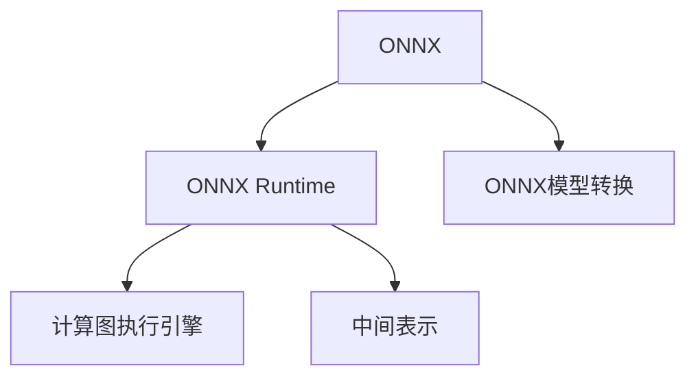

                 

# ONNX Runtime 跨平台部署：在不同设备上运行深度学习模型

## 1. 背景介绍

随着深度学习技术的迅猛发展，深度学习模型的应用场景从最初的图像识别、语音识别等单一领域扩展到了自动驾驶、智能客服、医疗诊断等多个复杂的交叉领域。然而，这些应用大多面临对计算资源需求高、模型体积庞大、部署场景复杂等挑战。传统深度学习模型无法在不进行大量代码重写的情况下，适应各种平台和场景，限制了其在实际生产环境中的部署效率和性能表现。

为了解决这一问题，近年来业界提出了一项重要的技术标准——Open Neural Network Exchange（ONNX），致力于提供一种模型与设备的无关性，从而使得深度学习模型能在不同平台和设备上灵活部署、高效运行。ONNX Runtime（ONNX运行时）作为ONNX的核心组件之一，支持各种深度学习模型在跨平台环境下的高性能运行，广泛应用于计算机视觉、语音识别、自然语言处理等多个领域。

## 2. 核心概念与联系

### 2.1 核心概念概述

为更好地理解ONNX Runtime的跨平台部署机制，本节将介绍几个密切相关的核心概念：

- **ONNX**：Open Neural Network Exchange，一种模型交换标准，使得深度学习模型能在不同框架之间互相转换，提升模型的跨平台适应性。
- **ONNX Runtime**：ONNX Runtime是由Microsoft、Intel、NVIDIA、ARM等公司共同开发的深度学习运行时库，支持ONNX模型在不同平台和设备上的高效执行。
- **ONNX模型转换**：将原有框架（如TensorFlow、PyTorch等）训练好的模型转化为ONNX格式，便于模型在不同平台间的迁移和部署。
- **计算图执行引擎**：ONNX Runtime内置多种计算图执行引擎，支持CPU、GPU、XPU等多种硬件加速，确保模型在不同设备上的高性能运行。
- **中间表示**：ONNX模型使用中间表示（Intermediate Representation, IR），通过图灵完备的方式来描述深度学习模型的结构，保障模型在各种架构上的可移植性。

这些核心概念之间的逻辑关系可以通过以下Mermaid流程图来展示：



这个流程图展示了ONNX Runtime跨平台部署的关键环节：

1. 通过ONNX模型转换，将不同框架训练好的深度学习模型转化为ONNX格式。
2. ONNX Runtime通过中间表示和计算图执行引擎，支持模型在各种硬件上的高效运行。
3. ONNX Runtime提供中间件和服务接口，支持多种框架和设备的统一部署。

## 3. 核心算法原理 & 具体操作步骤
### 3.1 算法原理概述

ONNX Runtime的跨平台部署机制基于ONNX模型中间表示，通过计算图执行引擎在不同设备上运行ONNX模型。其核心算法原理如下：

1. **模型转换**：将TensorFlow、PyTorch等框架训练好的模型转化为ONNX格式，使用ONNX转换工具（如ONNX Converter、ONNX-PyTorch、ONNX-TensorFlow等）完成。

2. **中间表示**：ONNX模型使用中间表示（IR）来描述深度学习模型结构，通过图灵完备的方式来表达模型的计算逻辑，支持跨框架、跨平台的一致性和可移植性。

3. **执行引擎**：ONNX Runtime内部集成了多种计算图执行引擎，如CPU、GPU、XPU等，支持模型在各种硬件加速下的高效运行。每个执行引擎均支持异步数据加载、内存优化、性能监控等特性，确保模型的稳定运行。

4. **服务接口**：ONNX Runtime提供了中间件和服务接口，使得深度学习模型能够在多种框架和设备上统一部署、灵活调用，例如TensorFlow Serving、ONNX Serving等。

### 3.2 算法步骤详解

基于ONNX Runtime的跨平台部署，其具体操作步骤如下：

**Step 1: 选择ONNX模型转换工具**
- 根据源框架（如TensorFlow、PyTorch等）选择相应的转换工具。
- 使用转换工具将模型转换为ONNX格式。

**Step 2: 选择ONNX Runtime执行引擎**
- 根据目标硬件（如CPU、GPU、XPU等）选择相应的执行引擎。
- 安装并配置执行引擎，确保其在目标设备上正确运行。

**Step 3: 定义服务配置**
- 编写ONNX Runtime服务配置文件，指定模型的输入输出、参数、服务名称等信息。
- 定义服务接口，例如HTTP服务、gRPC服务等。

**Step 4: 启动服务**
- 启动ONNX Runtime服务，加载并运行模型。
- 通过服务接口接收客户端请求，返回模型预测结果。

**Step 5: 监控和优化**
- 使用ONNX Runtime提供的性能监控工具（如ONNX Runtime Visualizer）实时监测模型性能。
- 根据性能数据进行优化调整，确保模型在目标设备上的高效运行。

### 3.3 算法优缺点

基于ONNX Runtime的跨平台部署机制具有以下优点：

1. **高度可移植性**：ONNX模型的中间表示保障了模型在各种硬件和软件平台上的可移植性。
2. **统一服务接口**：支持多种框架和设备的统一部署，简化了模型在不同平台上的调用。
3. **高效性能**：ONNX Runtime内置多种执行引擎，支持各种硬件加速，保障模型在目标设备上的高性能运行。
4. **灵活配置**：支持多种服务配置方式，便于模型在不同场景下的部署。

同时，该机制也存在以下局限性：

1. **模型转换复杂**：需要将多种框架训练好的模型转换为ONNX格式，转换过程可能较为复杂。
2. **硬件支持不足**：虽然支持多种硬件加速，但对于某些特定硬件的支持可能不够完善。
3. **性能损失**：模型转换和执行引擎选择不当，可能导致性能损失，尤其是在特定硬件上的优化不足。
4. **资源消耗**：ONNX Runtime服务部署可能对系统资源有一定的消耗，需要优化配置和管理。

尽管存在这些局限性，但ONNX Runtime跨平台部署机制仍是在线深度学习系统部署的首选方案之一，能够显著提高模型的跨平台适应性和部署效率。

### 3.4 算法应用领域

基于ONNX Runtime的跨平台部署机制，在以下领域得到了广泛应用：

1. **云计算**：云计算平台如AWS、Azure、Google Cloud等，使用ONNX Runtime支持深度学习模型的统一部署和管理。
2. **边缘计算**：边缘计算设备如Raspberry Pi、AWS Edge等，使用ONNX Runtime支持深度学习模型的轻量级部署和边缘推理。
3. **自动驾驶**：自动驾驶车辆使用ONNX Runtime支持计算机视觉、环境感知等模型的跨平台运行。
4. **智能客服**：智能客服系统使用ONNX Runtime支持语音识别、自然语言理解等模型的跨平台运行。
5. **医疗诊断**：医疗影像诊断系统使用ONNX Runtime支持深度学习模型的跨平台部署，提升诊断准确性和处理效率。
6. **智能安防**：智能安防系统使用ONNX Runtime支持人脸识别、行为分析等模型的跨平台运行。

## 4. 数学模型和公式 & 详细讲解
### 4.1 数学模型构建

在ONNX Runtime中，深度学习模型的数学模型通常采用张量表示，使用中间表示（IR）来描述模型的结构。ONNX模型的中间表示形式为计算图，每个节点表示一个计算操作，每个边表示数据的输入输出。例如，下面是一个简单的ONNX模型计算图：

```
input
  |
  v
relu
  |
  v
linear
  |
  v
output
```

其中，`input`和`output`表示输入和输出张量，`relu`和`linear`表示计算操作，中间表示为`input`和`output`之间的计算流。

### 4.2 公式推导过程

ONNX模型的中间表示是基于图灵完备的方式进行描述的，通过图节点和边来表示计算逻辑。以一个简单的线性模型为例，推导其计算图表示：

**Step 1: 定义线性模型参数**
假设线性模型参数为$\theta = [w, b]$，其中$w$为权重向量，$b$为偏置向量。

**Step 2: 定义模型计算过程**
输入向量$x \in \mathbb{R}^d$经过线性变换，得到输出向量$y = wx + b$。

**Step 3: 表示为ONNX计算图**
```
x          0          w
   |          |
   v           |
input       input0
  |          |
  v           |
      0       relu
  |          |
  v           |
      0       add
  |          |
  v           |
      1       linear
  |          |
  v           |
      1       output
  |          |
  v           |
      1       output
```

其中，`0`和`1`表示张量节点，`add`表示加法运算，`linear`表示线性变换运算，`relu`表示ReLU激活函数。

### 4.3 案例分析与讲解

以一个典型的图像分类任务为例，展示ONNX Runtime的跨平台部署过程。

**Step 1: 模型训练与转换**
假设使用PyTorch训练了一个卷积神经网络（CNN）模型，用于图像分类任务。使用ONNX转换器将模型转换为ONNX格式：

```python
import torch
from torchvision import models, transforms
from torch.onnx import Export

# 加载预训练模型
model = models.resnet18(pretrained=True)

# 定义模型输入输出
input_node = torch.randn(1, 3, 224, 224)
output_node = model(input_node)

# 将模型转换为ONNX格式
exported_model = Export(model, input_node)
onnx_model = exported_model.save("resnet18.onnx")
```

**Step 2: 选择ONNX Runtime执行引擎**
假设需要将模型部署在AWS Lambda上，使用GPU硬件加速。在AWS Lambda上安装并配置ONNX Runtime：

```bash
sudo pip install onnxruntime
```

**Step 3: 定义服务配置**
编写ONNX Runtime服务配置文件`lambda_fn.py`：

```python
import onnxruntime as ort
import torch
import torchvision.transforms as transforms

# 加载ONNX模型
ort_session = ort.InferenceSession("resnet18.onnx")

# 定义模型输入输出
input_name = "input_0"
output_name = "output_0"
input_shape = [1, 3, 224, 224]
input_data = torch.randn(input_shape).numpy()

# 定义模型预测函数
def predict(x):
    ort_inputs = {input_name: x}
    ort_outputs = ort_session.run(None, ort_inputs)
    return ort_outputs[0]

# 将模型导出为HTTP服务
if __name__ == "__main__":
    from flask import Flask, request
    app = Flask(__name__)

    @app.route('/predict', methods=['POST'])
    def predict_model():
        x = request.get_json()["x"]
        y = predict(x)
        return {'result': y.tolist()}

    app.run(host='0.0.0.0', port=8080)
```

**Step 4: 启动服务**
使用AWS Lambda部署并运行上述服务配置文件：

```python
import boto3

client = boto3.client('lambda', region_name='us-east-1')
response = client.create_function(
    FunctionName='predict',
    Runtime='python3.8',
    Role='arn:aws:iam::your-account-id:role/your-role',
    Handler='lambda_fn.predict',
    Code={
        'ZipFile': open('./lambda_fn.zip', 'rb').read(),
    },
    Description='ONNX Runtime example',
    Timeout=10,
    MemorySize=512,
    Publish=True
)
```

通过上述步骤，ONNX Runtime成功在AWS Lambda上部署了深度学习模型，能够接收客户端请求并返回模型预测结果。

## 5. 项目实践：代码实例和详细解释说明
### 5.1 开发环境搭建

在进行ONNX Runtime跨平台部署的实践前，我们需要准备好开发环境。以下是使用Python进行ONNX Runtime开发的常见环境配置流程：

1. 安装Anaconda：从官网下载并安装Anaconda，用于创建独立的Python环境。

2. 创建并激活虚拟环境：
```bash
conda create -n onnxruntime python=3.8 
conda activate onnxruntime
```

3. 安装必要的库：
```bash
pip install onnx onnxruntime numpy
```

4. 安装AWS Lambda的SDK：
```bash
pip install awscli aws-lambda-cffi
```

5. 安装Flask：用于部署ONNX Runtime服务。
```bash
pip install flask
```

完成上述步骤后，即可在`onnxruntime`环境中开始ONNX Runtime跨平台部署的实践。

### 5.2 源代码详细实现

下面以一个简单的图像分类任务为例，展示使用ONNX Runtime部署模型的完整代码实现。

```python
import onnxruntime as ort
import torch
import torchvision.transforms as transforms

# 加载ONNX模型
ort_session = ort.InferenceSession("resnet18.onnx")

# 定义模型输入输出
input_name = "input_0"
output_name = "output_0"
input_shape = [1, 3, 224, 224]
input_data = torch.randn(input_shape).numpy()

# 定义模型预测函数
def predict(x):
    ort_inputs = {input_name: x}
    ort_outputs = ort_session.run(None, ort_inputs)
    return ort_outputs[0]

# 将模型导出为HTTP服务
if __name__ == "__main__":
    from flask import Flask, request
    app = Flask(__name__)

    @app.route('/predict', methods=['POST'])
    def predict_model():
        x = request.get_json()["x"]
        y = predict(x)
        return {'result': y.tolist()}

    app.run(host='0.0.0.0', port=8080)
```

### 5.3 代码解读与分析

让我们再详细解读一下关键代码的实现细节：

**lambda_fn.py**：
- `ort_session`：加载ONNX模型的ONNX Runtime会话对象。
- `input_name`和`output_name`：定义模型输入输出节点的名称。
- `input_shape`：定义输入张量的形状。
- `input_data`：生成随机的输入数据，用于模型测试。
- `predict`函数：接收输入数据，调用ONNX Runtime会话对象进行模型预测，返回输出结果。

**Flask服务**：
- `Flask`：使用Flask框架部署ONNX Runtime服务。
- `predict_model`函数：定义HTTP服务端点，接收客户端请求，调用`predict`函数进行模型预测，并返回JSON格式的预测结果。

通过Flask服务，可以将ONNX Runtime模型部署为HTTP服务，方便客户端调用。

**AWS Lambda部署**：
- `awscli`：使用`awscli`工具将Flask服务打包为zip文件，并部署到AWS Lambda上。
- `aws-lambda-cffi`：使用`aws-lambda-cffi`工具将Flask服务编译为CFFI格式，便于部署到AWS Lambda上。

## 6. 实际应用场景
### 6.1 云计算平台

在云计算平台上，ONNX Runtime广泛应用于各种深度学习模型的部署和管理。例如，AWS、Azure和Google Cloud等云平台都提供了ONNX Runtime的集成支持，使得开发者能够方便地在云平台上部署和调用深度学习模型。

**应用案例**：在AWS Lambda上部署ONNX Runtime服务，用于实时图像识别和分类。通过AWS Lambda提供的API Gateway接口，客户可以通过HTTP请求调用服务，获取实时图像的分类结果。

### 6.2 边缘计算设备

边缘计算设备如Raspberry Pi、AWS Edge等，通过ONNX Runtime支持深度学习模型的轻量级部署和边缘推理。

**应用案例**：在Raspberry Pi上部署ONNX Runtime服务，用于实时图像处理和分析。通过摄像头采集到的图像，边缘设备实时调用ONNX Runtime服务进行图像分类和识别，提升实时处理能力。

### 6.3 自动驾驶系统

自动驾驶系统使用ONNX Runtime支持深度学习模型的跨平台运行。例如，使用ONNX Runtime在嵌入式设备上部署卷积神经网络模型，用于环境感知、路径规划等任务。

**应用案例**：在自动驾驶车辆上部署ONNX Runtime服务，用于实时处理摄像头采集到的视频流。通过ONNX Runtime服务进行物体检测和行为分析，提升自动驾驶系统的安全性。

## 7. 工具和资源推荐
### 7.1 学习资源推荐

为了帮助开发者系统掌握ONNX Runtime的跨平台部署原理和实践技巧，这里推荐一些优质的学习资源：

1. **ONNX官方文档**：ONNX官方提供了详细的文档和示例，帮助开发者深入理解ONNX模型和ONNX Runtime的部署方式。

2. **ONNX Runtime官方文档**：ONNX Runtime官方提供了详细的API文档和部署指南，帮助开发者熟悉ONNX Runtime的使用方法。

3. **《深度学习与Python编程》书籍**：该书由TensorFlow社区成员撰写，详细介绍了深度学习模型在各种平台上的部署和优化方法，包括ONNX Runtime的使用。

4. **《Python深度学习实战》书籍**：该书介绍了如何使用PyTorch训练深度学习模型，并利用ONNX Runtime将其部署到不同平台上。

5. **在线课程和教程**：Coursera、Udacity等在线平台提供了多门深度学习和ONNX Runtime的课程，帮助开发者系统掌握跨平台部署的技术。

通过对这些资源的学习实践，相信你一定能够快速掌握ONNX Runtime的跨平台部署机制，并用于解决实际的深度学习问题。

### 7.2 开发工具推荐

高效的开发离不开优秀的工具支持。以下是几款用于ONNX Runtime跨平台部署开发的常用工具：

1. **Anaconda**：用于创建独立的Python环境，支持不同版本的库和依赖。

2. **AWS Lambda**：提供服务器less的计算服务，支持ONNX Runtime的快速部署和运行。

3. **Flask**：轻量级的Web框架，用于部署ONNX Runtime服务，支持HTTP服务接口。

4. **boto3**：AWS SDK for Python，用于访问和操作AWS Lambda和其他AWS服务。

5. **awscli**：AWS命令行工具，用于管理AWS资源和服务。

6. **aws-lambda-cffi**：AWS Lambda的CFFI编译工具，用于将Python应用编译为CFFI格式，提升部署效率。

合理利用这些工具，可以显著提升ONNX Runtime跨平台部署的开发效率，加快创新迭代的步伐。

### 7.3 相关论文推荐

ONNX Runtime跨平台部署技术的发展源于学界的持续研究。以下是几篇奠基性的相关论文，推荐阅读：

1. **《Open Neural Network Exchange: A Flexible Common Format for Machine Learning Models》**：介绍了ONNX模型的设计理念和应用场景，为深度学习模型的跨平台部署奠定了基础。

2. **《ONNX Runtime: A General-Platform, General-Purpose Runtime for Machine Learning Models》**：描述了ONNX Runtime的设计思路和实现细节，详细介绍了ONNX Runtime的功能和性能。

3. **《ONNX-TensorFlow: A General-Purpose Runtime for TensorFlow Models》**：介绍了ONNX-TensorFlow的实现和应用，展示了TensorFlow模型如何在ONNX Runtime上运行。

4. **《ONNX Runtime: A General-Purpose Runtime for Neural Networks》**：介绍了ONNX Runtime在各种硬件和平台上的支持情况，展示了其跨平台部署的性能和可靠性。

这些论文代表了大语言模型微调技术的发展脉络。通过学习这些前沿成果，可以帮助研究者把握学科前进方向，激发更多的创新灵感。

## 8. 总结：未来发展趋势与挑战

### 8.1 总结

本文对ONNX Runtime的跨平台部署机制进行了全面系统的介绍。首先阐述了ONNX Runtime在深度学习模型跨平台部署中的重要性，明确了其在云计算、边缘计算、自动驾驶等多个领域的应用价值。其次，从原理到实践，详细讲解了ONNX Runtime跨平台部署的数学模型和关键步骤，给出了模型转换、执行引擎选择等关键操作的完整代码实例。同时，本文还广泛探讨了ONNX Runtime在各种平台和设备上的应用场景，展示了其强大的跨平台适应性。

通过本文的系统梳理，可以看到，ONNX Runtime跨平台部署机制能够显著提高深度学习模型的部署效率和性能表现，特别是在大规模分布式计算和边缘计算环境中，具有显著优势。未来，伴随ONNX Runtime技术的不断演进和优化，相信其将在更多的深度学习应用场景中得到广泛应用，推动深度学习技术在实际生产环境中的大规模部署。

### 8.2 未来发展趋势

展望未来，ONNX Runtime跨平台部署技术将呈现以下几个发展趋势：

1. **支持更多硬件平台**：ONNX Runtime将进一步支持更多硬件平台，包括CPU、GPU、XPU、FPGA等，提升模型在各种硬件上的适应性。

2. **优化模型转换工具**：未来的模型转换工具将更加智能高效，能够自动识别和转换更多框架和模型，减少手动操作的复杂性。

3. **增强服务管理能力**：ONNX Runtime将提供更强大的服务管理和监控功能，支持分布式计算和负载均衡，提升模型在云端和边缘设备的部署效率。

4. **提升跨平台性能**：未来的ONNX Runtime将通过优化计算图和执行引擎，提升模型在不同平台上的性能表现，特别是在高性能计算环境中。

5. **支持更多的框架和库**：ONNX Runtime将支持更多深度学习框架和库，如TensorFlow、PyTorch、Keras等，方便开发者使用更多的深度学习工具。

6. **支持更多的应用场景**：ONNX Runtime将支持更多的应用场景，如医疗诊断、金融分析、自动驾驶等，扩展其应用范围。

这些趋势凸显了ONNX Runtime跨平台部署技术的广阔前景。随着ONNX Runtime技术的不断发展，其将为深度学习模型的跨平台部署提供更强大的支撑，推动深度学习技术在更多领域的应用和落地。

### 8.3 面临的挑战

尽管ONNX Runtime跨平台部署技术已经取得了显著成就，但在迈向更加智能化、普适化应用的过程中，仍然面临一些挑战：

1. **模型转换复杂性**：不同框架和模型之间的转换可能较为复杂，尤其是针对复杂的深度学习模型。如何简化模型转换过程，提高转换效率，将是重要的研究方向。

2. **性能损失和优化**：ONNX模型的转换和执行引擎选择不当，可能导致性能损失，特别是在特定硬件上的优化不足。如何在不同硬件上优化ONNX模型的性能，提升模型跨平台的运行效率，还需要更多理论和实践的积累。

3. **服务管理复杂性**：在大规模分布式环境中，如何管理和服务多个ONNX Runtime实例，保障服务的稳定性和可靠性，还需要优化配置和管理工具。

4. **资源消耗问题**：ONNX Runtime服务的部署可能对系统资源有一定的消耗，特别是在硬件资源有限的环境中。如何优化资源使用，提高服务效率，还需要进行更深入的研究和优化。

5. **模型可解释性和可控性**：对于高风险应用，如医疗、金融等，模型的可解释性和可控性尤为重要。如何在保证模型性能的同时，提升其可解释性和可控性，还需要更多的研究和实践。

6. **数据隐私和安全问题**：在模型部署和服务过程中，如何保护数据隐私和安全，防止数据泄露和滥用，还需要加强数据管理和安全措施。

正视ONNX Runtime跨平台部署面临的这些挑战，积极应对并寻求突破，将是大规模深度学习模型跨平台部署迈向成熟的必由之路。相信随着学界和产业界的共同努力，这些挑战终将一一被克服，ONNX Runtime跨平台部署技术必将在构建人机协同的智能时代中扮演越来越重要的角色。

### 8.4 研究展望

面对ONNX Runtime跨平台部署所面临的种种挑战，未来的研究需要在以下几个方面寻求新的突破：

1. **简化模型转换工具**：开发更加智能、高效、易用的模型转换工具，自动优化模型结构和参数，简化转换过程。

2. **优化跨平台性能**：研究跨平台优化技术，提升模型在不同平台上的性能表现，特别是在特定硬件上的优化。

3. **增强服务管理能力**：开发更强大的服务管理工具，支持分布式计算和负载均衡，提升服务效率和稳定性。

4. **支持更多框架和库**：支持更多深度学习框架和库，方便开发者使用更多的深度学习工具。

5. **优化资源使用**：优化ONNX Runtime服务的资源使用，提升服务效率，减少资源消耗。

6. **提升模型可解释性和可控性**：研究模型可解释性技术，提升模型的可解释性和可控性，增强高风险应用的安全性和可靠性。

7. **加强数据隐私和安全保护**：加强数据隐私和安全保护，防止数据泄露和滥用，保障数据隐私和安全。

这些研究方向将推动ONNX Runtime跨平台部署技术向更高层次发展，为深度学习模型在各种平台和设备上的高效部署和运行提供更强大的技术支撑。

## 9. 附录：常见问题与解答

**Q1: 如何选择合适的ONNX Runtime执行引擎？**

A: 选择合适的ONNX Runtime执行引擎需要考虑目标硬件平台和模型特性。一般来说，CPU和GPU是最常用的执行引擎，适用于大多数深度学习模型。而对于某些特定硬件（如XPU、FPGA等），需要根据硬件平台的特性和支持情况进行选择。

**Q2: 模型转换过程中如何处理不同框架之间的差异？**

A: 模型转换过程中，可以使用ONNX转换工具自动优化模型结构和参数，减少框架之间的差异。同时，对于特定框架的特性（如TensorFlow中的变量、PyTorch中的动态图等）需要进行额外的处理，以确保转换后的模型在ONNX Runtime上能够正确运行。

**Q3: 如何优化ONNX Runtime服务的性能？**

A: 优化ONNX Runtime服务的性能需要从多个方面入手，包括模型优化、资源优化和服务管理等。对于模型优化，可以使用ONNX Runtime提供的性能监控工具（如ONNX Runtime Visualizer）实时监测模型性能，根据性能数据进行优化调整。对于资源优化，可以使用ONNX Runtime的服务管理工具（如AWS Lambda的配置和监控功能），优化服务配置和资源使用。

**Q4: 如何在边缘计算设备上部署ONNX Runtime服务？**

A: 在边缘计算设备上部署ONNX Runtime服务，需要考虑设备硬件特性和网络带宽限制。可以使用ONNX Runtime的轻量级模型和高效的模型优化技术，减少模型体积和资源消耗。同时，可以通过边缘计算设备的网络优化和缓存机制，提升模型在边缘设备上的响应速度和稳定性。

**Q5: 如何在云平台上部署ONNX Runtime服务？**

A: 在云平台上部署ONNX Runtime服务，需要考虑云平台的特性和限制。可以使用AWS Lambda、Azure Functions等云服务，简化服务的部署和管理。同时，可以使用云平台的弹性计算资源，提升服务的高可用性和扩展性。

通过上述问答，希望能够解答你在ONNX Runtime跨平台部署实践中遇到的问题，帮助你更好地掌握ONNX Runtime的技术和应用。

---

作者：禅与计算机程序设计艺术 / Zen and the Art of Computer Programming

