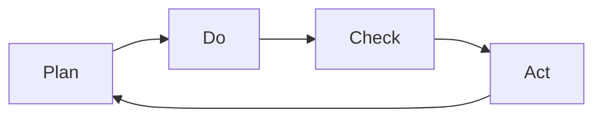

                 

## 1. 背景介绍

在项目管理中，PDCA循环（Plan-Do-Check-Act）是一个经典且有效的流程，用于持续改进项目管理和操作。它由四个阶段组成：计划（Plan）、执行（Do）、检查（Check）和行动（Act），形成一个闭环，不断循环改进，确保项目目标的实现。PDCA循环的核心理念是持续反馈和优化，适用于任何需要动态调整和迭代的流程。

PDCA循环广泛应用于项目管理、质量管理、流程改进等领域。对于软件开发项目，PDCA循环尤为适用。软件开发项目通常包含多个迭代周期，每个周期内需要不断地进行需求分析、设计、开发、测试和部署等环节，每个环节都可以看作一个PDCA循环。通过PDCA循环，可以确保软件开发过程的每个阶段都能得到持续的优化和改进。

## 2. 核心概念与联系

### 2.1 核心概念概述

为了更好地理解PDCA循环，本节将介绍PDCA循环中的几个关键概念：

- **计划（Plan）**：在PDCA循环的第一步，需要明确项目目标、制定详细计划、确定资源和时间安排、风险评估等。计划阶段是PDCA循环的基础，需要全面、细致的准备工作。

- **执行（Do）**：在计划完成后，需要按照计划执行项目任务。执行阶段强调执行力，确保按计划推进项目，并记录执行过程中的各项数据和日志。

- **检查（Check）**：在执行阶段完成后，需要检查项目执行情况和结果，评估项目进度和质量，识别问题并记录，为后续的改进提供依据。

- **行动（Act）**：根据检查结果，决定是否需要对计划进行调整，并采取相应的改进措施。行动阶段强调反馈和优化，确保项目能够持续改进和提升。

PDCA循环的四个阶段形成一个闭环，不断迭代改进。每个循环结束后，都会根据检查结果进行改进，确保项目能够顺利进行，并逐步达到预期目标。

### 2.2 核心概念原理和架构的 Mermaid 流程图



该流程图展示了PDCA循环的四个阶段：计划、执行、检查和行动。每个阶段都依赖前一个阶段的结果，形成一个持续的改进闭环。

## 3. 核心算法原理 & 具体操作步骤

### 3.1 算法原理概述

PDCA循环的算法原理相对简单，它强调持续的反馈和优化。以下是PDCA循环的基本算法原理：

1. **计划阶段**：定义项目目标和计划，包括任务分解、资源分配、时间安排和风险评估等。
2. **执行阶段**：按照计划执行项目任务，记录执行过程中的各项数据和日志。
3. **检查阶段**：评估项目执行情况和结果，识别问题并记录，确保项目能够按预期推进。
4. **行动阶段**：根据检查结果进行改进，调整计划或采取其他改进措施。

PDCA循环的四个阶段循环执行，不断改进，确保项目目标的实现。

### 3.2 算法步骤详解

以下是PDCA循环的具体操作步骤：

#### 3.2.1 计划阶段

**步骤1**：定义项目目标和计划
- 明确项目的目标和预期成果。
- 将项目目标分解为具体的任务和子任务。
- 确定项目的资源需求，包括人力、物力和财力等。
- 制定详细的时间安排，包括各个任务的开始和结束时间。
- 进行风险评估，识别可能的风险并制定应对措施。

**步骤2**：制定详细计划
- 确定每个任务的执行步骤和方法。
- 分配任务给团队成员，明确责任和分工。
- 制定沟通和协作机制，确保团队成员之间的有效沟通。
- 确定项目的度量标准和评估指标，以便后续的检查和改进。

#### 3.2.2 执行阶段

**步骤1**：执行项目任务
- 按照计划分配任务，确保每个任务按期完成。
- 记录执行过程中的各项数据和日志，包括进度、资源使用情况和问题等。
- 确保团队成员之间的有效沟通和协作，及时解决问题。
- 定期检查项目进展情况，确保项目能够按计划推进。

**步骤2**：记录执行日志
- 记录执行过程中的各项数据和日志，包括任务完成情况、资源使用情况、问题和解决方案等。
- 使用项目管理工具，如Jira、Trello等，跟踪项目进度和任务状态。
- 定期汇总执行日志，确保所有相关方了解项目进展情况。

#### 3.2.3 检查阶段

**步骤1**：评估项目执行情况
- 根据项目度量标准和评估指标，评估项目执行情况和结果。
- 识别执行过程中遇到的问题和障碍，分析原因。
- 记录检查结果，形成问题报告，以便后续的改进。
- 与团队成员和利益相关者讨论检查结果，确保所有人都了解项目进展情况和存在的问题。

**步骤2**：识别和记录问题
- 识别执行过程中遇到的问题和障碍，记录问题的详细描述和影响。
- 分析问题的根本原因，制定改进措施。
- 使用问题跟踪工具，如JIRA、Asana等，记录和跟踪问题的解决情况。

#### 3.2.4 行动阶段

**步骤1**：决定改进措施
- 根据检查结果，决定是否需要对计划进行调整。
- 如果存在问题，制定改进措施，包括调整计划、重新分配资源、优化流程等。
- 确定改进措施的执行步骤和时间安排，确保改进措施能够按时实施。
- 与团队成员和利益相关者讨论改进措施，确保所有人都同意并参与改进。

**步骤2**：实施改进措施
- 按照改进措施的执行步骤和时间安排，实施改进措施。
- 记录改进措施的执行情况和效果，确保改进措施能够达到预期效果。
- 定期评估改进措施的效果，确保改进措施能够持续改进项目流程。

### 3.3 算法优缺点

#### 3.3.1 优点

- **持续改进**：PDCA循环的闭环特性，使得项目能够不断进行优化和改进，确保项目目标的实现。
- **动态调整**：在执行过程中，能够及时识别问题和障碍，并采取相应的改进措施，确保项目按计划推进。
- **透明性**：通过记录和跟踪执行数据和问题日志，使得项目进展情况透明，便于团队成员和利益相关者了解项目状态。
- **高效性**：PDCA循环的四个阶段相互依赖，确保每个阶段都能高效执行，提高项目管理效率。

#### 3.3.2 缺点

- **复杂性**：PDCA循环的四个阶段需要综合考虑多个因素，复杂度高，需要团队成员具备较高的项目管理能力。
- **资源消耗**：PDCA循环的执行需要投入大量的资源，包括时间、人力和物力等，成本较高。
- **灵活性不足**：PDCA循环的闭环特性，使得改进措施可能过于保守，无法灵活应对突发情况。
- **依赖沟通**：PDCA循环的有效执行依赖团队成员之间的有效沟通和协作，沟通不畅可能导致问题识别不及时或改进措施效果不佳。

### 3.4 算法应用领域

PDCA循环不仅适用于项目管理，还适用于质量管理、流程改进、产品开发等领域。以下是PDCA循环在不同领域的应用示例：

#### 3.4.1 项目管理

在软件开发项目中，PDCA循环可用于需求分析、设计、开发、测试和部署等环节。每个环节都可以看作一个PDCA循环，确保每个环节的持续改进和优化。

#### 3.4.2 质量管理

在质量管理中，PDCA循环可用于持续改进产品和服务的质量。通过定期检查产品质量，识别问题并采取相应的改进措施，确保产品质量的持续提升。

#### 3.4.3 流程改进

在企业运营中，PDCA循环可用于流程改进。通过不断优化流程，减少冗余和浪费，提高生产效率和质量。

## 4. 数学模型和公式 & 详细讲解 & 举例说明

### 4.1 数学模型构建

PDCA循环的数学模型相对简单，主要涉及数据的收集、分析和改进。以下是PDCA循环的数学模型构建过程：

**输入**：项目目标、计划、资源、时间安排、风险评估等。

**输出**：项目执行情况、问题记录、改进措施、改进效果等。

### 4.2 公式推导过程

以下是PDCA循环的公式推导过程：

1. **计划阶段**：
   - 目标定义：$T$：项目目标
   - 任务分解：$D$：任务列表
   - 资源分配：$R$：资源列表
   - 时间安排：$T_s$：时间安排
   - 风险评估：$Risk$：风险列表

   计划阶段的主要公式为：
   $$
   P = T, D, R, T_s, Risk
   $$

2. **执行阶段**：
   - 任务执行：$E$：执行情况
   - 数据记录：$Data$：执行数据
   - 问题记录：$Problem$：问题记录

   执行阶段的主要公式为：
   $$
   Do = E, Data, Problem
   $$

3. **检查阶段**：
   - 执行评估：$Check$：执行评估结果
   - 问题识别：$Issue$：问题识别结果
   - 记录日志：$Log$：日志记录

   检查阶段的主要公式为：
   $$
   Check = E, Data, Issue, Log
   $$

4. **行动阶段**：
   - 改进措施：$Act$：改进措施
   - 效果评估：$Effect$：改进效果
   - 反馈记录：$Feedback$：反馈记录

   行动阶段的主要公式为：
   $$
   Act = Check, Act, Effect, Feedback
   $$

### 4.3 案例分析与讲解

以下是一个软件开发项目中使用PDCA循环的案例分析：

**项目背景**：开发一个在线教育平台，需要实现用户注册、课程展示、视频讲解、互动答疑等功能。

**步骤1**：计划阶段
- 目标定义：平台上线前完成用户注册、课程展示、视频讲解、互动答疑等功能。
- 任务分解：用户注册、课程展示、视频讲解、互动答疑、系统测试等。
- 资源分配：开发人员、测试人员、设计师等。
- 时间安排：每月完成一个重要功能模块。
- 风险评估：系统性能问题、用户隐私问题、数据安全问题等。

**步骤2**：执行阶段
- 任务执行：按照时间安排，开发和测试各个功能模块。
- 数据记录：记录开发进度、测试结果、用户反馈等。
- 问题记录：记录在执行过程中发现的问题，如性能瓶颈、功能缺陷等。

**步骤3**：检查阶段
- 执行评估：评估各个功能模块的开发和测试情况，识别问题并记录。
- 问题识别：识别性能瓶颈、功能缺陷等问题。
- 记录日志：记录各个功能模块的开发进度、测试结果和用户反馈等。

**步骤4**：行动阶段
- 改进措施：针对识别的问题，采取相应的改进措施，如优化代码、改进测试策略等。
- 效果评估：评估改进措施的效果，确保问题得到有效解决。
- 反馈记录：记录改进措施的执行情况和效果，确保改进措施能够持续改进项目流程。

## 5. 项目实践：代码实例和详细解释说明

### 5.1 开发环境搭建

在进行PDCA循环实践前，我们需要准备好开发环境。以下是使用Python进行项目管理的环境配置流程：

1. 安装Anaconda：从官网下载并安装Anaconda，用于创建独立的Python环境。

2. 创建并激活虚拟环境：
```bash
conda create -n pdca-env python=3.8 
conda activate pdca-env
```

3. 安装相关库：
```bash
pip install pandas numpy matplotlib
```

完成上述步骤后，即可在`pdca-env`环境中开始PDCA循环实践。

### 5.2 源代码详细实现

下面我们以项目管理为例，给出使用Python实现PDCA循环的代码实现。

```python
import pandas as pd

class PDCA:
    def __init__(self, plan_data, do_data, check_data, act_data):
        self.plan_data = plan_data
        self.do_data = do_data
        self.check_data = check_data
        self.act_data = act_data

    def plan(self):
        # 计划阶段：定义目标和计划
        self.plan_data = pd.DataFrame()
        self.plan_data['目标'] = self.target
        self.plan_data['任务'] = self.tasks
        self.plan_data['资源'] = self.resources
        self.plan_data['时间安排'] = self.time_arrangement
        self.plan_data['风险评估'] = self.risk_assessment

    def do(self):
        # 执行阶段：记录执行情况和问题
        self.do_data = pd.DataFrame()
        self.do_data['执行情况'] = self.do_status
        self.do_data['数据记录'] = self.data_record
        self.do_data['问题记录'] = self.problems

    def check(self):
        # 检查阶段：评估执行情况和记录问题
        self.check_data = pd.DataFrame()
        self.check_data['执行评估'] = self.check_status
        self.check_data['问题识别'] = self.identify_problems
        self.check_data['记录日志'] = self.log_records

    def act(self):
        # 行动阶段：决定改进措施和记录改进效果
        self.act_data = pd.DataFrame()
        self.act_data['改进措施'] = self.improve_measures
        self.act_data['改进效果'] = self.improve_effects
        self.act_data['反馈记录'] = self.feedback_records

    def execute(self):
        # 循环执行PDCA循环
        self.plan()
        self.do()
        self.check()
        self.act()

# 创建PDCA实例
pdca = PDCA(plan_data, do_data, check_data, act_data)

# 循环执行PDCA循环
pdca.execute()
```

### 5.3 代码解读与分析

让我们再详细解读一下关键代码的实现细节：

**PDCA类**：
- `__init__`方法：初始化计划、执行、检查、行动数据。
- `plan`方法：定义项目目标和计划。
- `do`方法：记录执行情况和问题。
- `check`方法：评估执行情况和记录问题。
- `act`方法：决定改进措施和记录改进效果。
- `execute`方法：循环执行PDCA循环。

**目标和计划**：
- `target`：项目目标。
- `tasks`：任务列表。
- `resources`：资源列表。
- `time_arrangement`：时间安排。
- `risk_assessment`：风险评估。

**执行情况和问题**：
- `do_status`：执行情况。
- `data_record`：数据记录。
- `problems`：问题记录。

**检查阶段数据**：
- `check_status`：执行评估结果。
- `identify_problems`：问题识别结果。
- `log_records`：日志记录。

**改进措施和效果**：
- `improve_measures`：改进措施。
- `improve_effects`：改进效果。
- `feedback_records`：反馈记录。

通过上述代码，可以清晰地看到PDCA循环的实现过程。开发者可以根据实际需求，灵活定制PDCA循环的步骤和数据结构，确保PDCA循环的有效执行。

### 5.4 运行结果展示

以下是使用上述代码实现的PDCA循环运行结果示例：

**计划阶段**：
- 目标定义：平台上线前完成用户注册、课程展示、视频讲解、互动答疑等功能。
- 任务分解：用户注册、课程展示、视频讲解、互动答疑、系统测试等。
- 资源分配：开发人员、测试人员、设计师等。
- 时间安排：每月完成一个重要功能模块。
- 风险评估：系统性能问题、用户隐私问题、数据安全问题等。

**执行阶段**：
- 任务执行：按照时间安排，开发和测试各个功能模块。
- 数据记录：记录开发进度、测试结果、用户反馈等。
- 问题记录：记录在执行过程中发现的问题，如性能瓶颈、功能缺陷等。

**检查阶段**：
- 执行评估：评估各个功能模块的开发和测试情况，识别问题并记录。
- 问题识别：识别性能瓶颈、功能缺陷等问题。
- 记录日志：记录各个功能模块的开发进度、测试结果和用户反馈等。

**行动阶段**：
- 改进措施：针对识别的问题，采取相应的改进措施，如优化代码、改进测试策略等。
- 效果评估：评估改进措施的效果，确保问题得到有效解决。
- 反馈记录：记录改进措施的执行情况和效果，确保改进措施能够持续改进项目流程。

## 6. 实际应用场景

### 6.1 智能制造

在智能制造中，PDCA循环可用于生产流程的持续改进。通过定期检查生产流程，识别问题并采取相应的改进措施，确保生产效率和质量。

### 6.2 医疗健康

在医疗健康中，PDCA循环可用于病患管理。通过定期检查病患状态和医疗效果，识别问题并采取相应的改进措施，确保医疗服务的持续优化。

### 6.3 金融风控

在金融风控中，PDCA循环可用于风险管理。通过定期检查风险评估和控制措施，识别问题并采取相应的改进措施，确保金融风险的可控性。

### 6.4 未来应用展望

随着PDCA循环在各行业的广泛应用，未来将面临更多的挑战和机遇。以下是几个未来的发展趋势：

**趋势1**：自动化和智能化
- 随着人工智能和机器学习技术的发展，PDCA循环将越来越多地引入自动化工具，如AI辅助风险评估、自动化问题识别等，提高PDCA循环的效率和准确性。

**趋势2**：跨领域应用
- PDCA循环将逐步应用于更多领域，如农业、环保、能源等，为这些领域提供系统化的管理工具。

**趋势3**：全球化推广
- PDCA循环将逐步推广到全球范围，成为国际通用的项目管理方法。

## 7. 工具和资源推荐

### 7.1 学习资源推荐

为了帮助开发者系统掌握PDCA循环的理论基础和实践技巧，这里推荐一些优质的学习资源：

1. 《PDCA循环精讲》系列博文：由项目管理专家撰写，深入浅出地介绍了PDCA循环的基本原理、步骤和应用场景。

2. PMI（Project Management Institute）《项目管理知识体系指南》：PMI官方出版的项目管理领域权威指南，涵盖了PDCA循环的详细应用方法和案例分析。

3. Udemy《PDCA循环：项目管理成功必学》课程：Udemy平台的在线课程，系统讲解PDCA循环的理论基础和实践技巧，适合初学者和进阶开发者。

4. Coursera《项目管理基础》课程：Coursera平台的在线课程，由知名大学教授讲授，系统讲解项目管理的基础知识和PDCA循环的应用。

5. 《PDCA循环实战案例》书籍：精选了多个项目管理领域的成功案例，详细分析了PDCA循环的实施过程和效果，适合实战学习。

通过对这些资源的学习实践，相信你一定能够系统掌握PDCA循环的理论基础和实践技巧，并将其应用到实际项目中。

### 7.2 开发工具推荐

高效的开发离不开优秀的工具支持。以下是几款用于PDCA循环开发的常用工具：

1. JIRA：一个广泛使用的项目管理工具，支持PDCA循环的各个阶段，提供任务跟踪、问题记录、数据统计等功能。

2. Trello：一个基于看板的项目管理工具，支持PDCA循环的各个阶段，提供任务分配、进度跟踪、团队协作等功能。

3. Asana：一个团队协作工具，支持PDCA循环的各个阶段，提供任务管理、时间安排、问题记录等功能。

4. GitHub：一个代码托管平台，支持PDCA循环的各个阶段，提供版本控制、代码审查、问题记录等功能。

5. GitLab：一个代码托管平台，支持PDCA循环的各个阶段，提供版本控制、代码审查、问题记录等功能。

合理利用这些工具，可以显著提升PDCA循环的开发效率，加快创新迭代的步伐。

### 7.3 相关论文推荐

PDCA循环的发展源于学界的持续研究。以下是几篇奠基性的相关论文，推荐阅读：

1. Deming, W. E. (1950). On the Theory of Systematics: A Redux. New York, NY: American Management Association.

2. Itami, H. (1988). Planning, Doing, Checking, Acting: A Description of the Management Cycle. Project Management Journal, 22(4), 14-17.

3. Minto, T. (1999). The Myths of the PDCA Cycle. Project Management Journal, 30(2), 7-11.

4. Forslund, P. E. (1993). The Fundamentals of the PDCA Cycle. Project Management Journal, 24(1), 30-37.

5. Williamson, C. (2011). Quality Tools: A Roadmap to Higher Quality. American Society for Quality, 76(1), 24-31.

这些论文代表了PDCA循环的发展脉络。通过学习这些前沿成果，可以帮助研究者把握学科前进方向，激发更多的创新灵感。

## 8. 总结：未来发展趋势与挑战

### 8.1 研究成果总结

本文对PDCA循环进行了全面系统的介绍。首先阐述了PDCA循环的基本概念和应用场景，明确了PDCA循环在项目管理中的核心价值。其次，从原理到实践，详细讲解了PDCA循环的数学模型和具体步骤，提供了PDCA循环的代码实现。同时，本文还广泛探讨了PDCA循环在智能制造、医疗健康、金融风控等多个行业领域的应用前景，展示了PDCA循环的强大生命力。此外，本文精选了PDCA循环的学习资源、开发工具和相关论文，力求为读者提供全方位的技术指引。

通过本文的系统梳理，可以看到，PDCA循环作为一种经典的项目管理方法，在各行业领域得到了广泛的应用和验证。它强调持续反馈和优化，确保项目目标的实现，具有较高的普适性和实用性。未来，PDCA循环将不断拓展其应用范围和深度，成为项目管理中的重要工具。

### 8.2 未来发展趋势

展望未来，PDCA循环的发展将呈现以下几个趋势：

**趋势1**：自动化和智能化
- 随着人工智能和机器学习技术的发展，PDCA循环将越来越多地引入自动化工具，如AI辅助风险评估、自动化问题识别等，提高PDCA循环的效率和准确性。

**趋势2**：跨领域应用
- PDCA循环将逐步应用于更多领域，如农业、环保、能源等，为这些领域提供系统化的管理工具。

**趋势3**：全球化推广
- PDCA循环将逐步推广到全球范围，成为国际通用的项目管理方法。

**趋势4**：多维度集成
- PDCA循环将与其他项目管理工具和方法进行集成，如敏捷开发、Scrum等，形成更加综合的项目管理解决方案。

### 8.3 面临的挑战

尽管PDCA循环已经取得了一定的成果，但在迈向更加智能化、普适化应用的过程中，它仍面临诸多挑战：

**挑战1**：复杂度增加
- 随着PDCA循环的复杂度增加，项目管理的难度将进一步加大，需要更多的技术支持和人员培训。

**挑战2**：资源消耗
- PDCA循环的实施需要投入大量的资源，包括时间、人力和物力等，成本较高。

**挑战3**：灵活性不足
- PDCA循环的闭环特性，使得改进措施可能过于保守，无法灵活应对突发情况。

**挑战4**：依赖沟通
- PDCA循环的有效执行依赖团队成员之间的有效沟通和协作，沟通不畅可能导致问题识别不及时或改进措施效果不佳。

**挑战5**：数据质量
- PDCA循环的实施依赖大量的数据记录，数据质量直接影响PDCA循环的效果，需要确保数据的准确性和完整性。

### 8.4 研究展望

面对PDCA循环面临的挑战，未来的研究需要在以下几个方面寻求新的突破：

**方向1**：简化PDCA循环
- 简化PDCA循环的步骤和流程，降低项目管理的复杂度，提高PDCA循环的实用性和易用性。

**方向2**：引入自动化工具
- 引入自动化工具和算法，如AI辅助风险评估、自动化问题识别等，提高PDCA循环的效率和准确性。

**方向3**：跨领域应用
- 将PDCA循环应用到更多领域，如农业、环保、能源等，提供系统化的管理工具，拓展PDCA循环的应用范围。

**方向4**：多维度集成
- 与其他项目管理工具和方法进行集成，如敏捷开发、Scrum等，形成更加综合的项目管理解决方案。

**方向5**：数据质量控制
- 引入数据质量控制工具和算法，确保PDCA循环中数据的准确性和完整性，提高PDCA循环的效果和可靠性。

这些研究方向将引领PDCA循环的发展，使其在项目管理中发挥更大的作用。

## 9. 附录：常见问题与解答

**Q1：PDCA循环是否可以应用于所有项目？**

A: PDCA循环适用于任何需要动态调整和迭代的流程。但其核心思想是基于持续反馈和优化，对于那些无需动态调整的项目（如一次性项目），可能并不适用。

**Q2：PDCA循环是否适用于团队规模较大的项目？**

A: PDCA循环需要团队成员之间的有效沟通和协作，对于团队规模较大的项目，需要更多的时间和管理资源来确保沟通和协作的顺畅。但通过合理利用项目管理工具和自动化工具，PDCA循环同样适用于大规模项目。

**Q3：PDCA循环是否适用于敏捷开发项目？**

A: PDCA循环与敏捷开发并不冲突，可以在敏捷开发中引入PDCA循环的持续反馈和优化思想，确保敏捷开发过程的稳定性和可控性。

**Q4：PDCA循环是否适用于跨团队项目？**

A: PDCA循环适用于跨团队项目，但需要确保各个团队之间的有效沟通和协作，以确保PDCA循环的顺利实施。

**Q5：PDCA循环是否可以与其他项目管理方法结合使用？**

A: PDCA循环可以与其他项目管理方法结合使用，如敏捷开发、Scrum等，形成更加综合的项目管理解决方案。

---

作者：禅与计算机程序设计艺术 / Zen and the Art of Computer Programming

