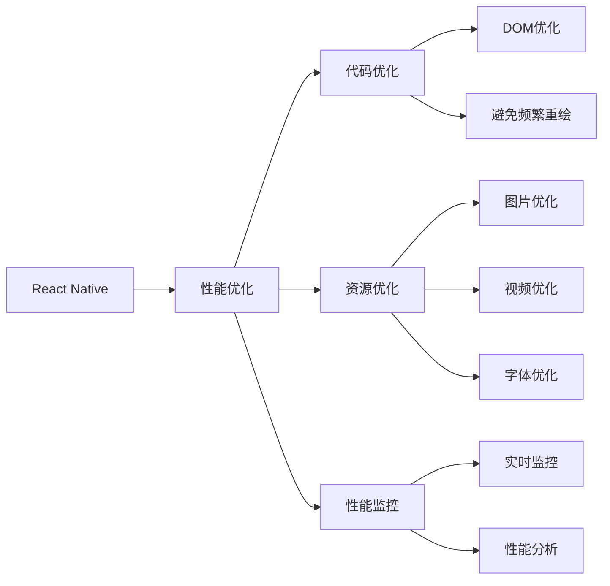

                 

# React Native性能调优

## 1. 背景介绍

随着移动互联网应用的普及和用户需求的多样化，跨平台移动开发成为一种重要的技术趋势。React Native作为Facebook开源的跨平台开发框架，结合了Web前端技术和iOS/Android的原生特性，能够快速开发高质量的移动应用。然而，在实际开发过程中，性能问题始终是困扰开发者的一大难题。特别是在多级嵌套组件、大量数据渲染、复杂动画和交互等场景下，React Native的性能瓶颈尤为突出。因此，如何高效优化React Native应用的性能，成为开发者的重要课题。本文旨在通过系统的介绍React Native性能调优的核心概念和具体操作步骤，帮助开发者提升应用性能，提高用户体验。

## 2. 核心概念与联系

### 2.1 核心概念概述

为了更好地理解React Native性能调优的方法，我们需要先掌握几个核心概念：

- React Native：Facebook开源的跨平台移动开发框架，结合了Web前端技术和iOS/Android原生特性，能够实现跨平台代码复用，提升开发效率。
- 性能优化：通过优化代码和资源配置，提高应用的响应速度、渲染效率和稳定性，提升用户体验的过程。
- 性能瓶颈：指影响应用性能的特定因素，如频繁的DOM重绘、网络请求延迟、内存泄漏等。
- 代码优化：通过优化代码结构、减少不必要的渲染和计算，降低应用性能瓶颈的方法。
- 资源优化：通过优化图片、视频、字体等静态资源，减小应用内存占用和加载时间，提升性能的方法。
- 性能监控：通过工具或代码手段，实时监测应用性能，及时发现并解决问题的方法。

这些核心概念之间相互联系，共同构成了React Native性能调优的框架。开发者需要理解这些概念之间的联系和影响，才能在实际开发中灵活运用优化策略，提升应用性能。

### 2.2 核心概念原理和架构的 Mermaid 流程图



这个流程图展示了一个React Native应用的性能优化框架，强调了代码、资源和性能监控之间的相互关系。

## 3. 核心算法原理 & 具体操作步骤

### 3.1 算法原理概述

React Native性能调优的核心原理，是通过优化代码和资源配置，降低应用在渲染、交互和计算等方面的开销，提升应用的整体性能。其主要策略包括代码优化、资源优化和性能监控三个方面。

代码优化旨在通过重构代码、减少不必要的渲染和计算，降低应用在渲染上的开销。资源优化则通过优化静态资源，减少内存占用和加载时间，提升应用启动速度和响应速度。性能监控则是通过实时监测应用性能，及时发现并解决问题，确保应用的稳定性和响应速度。

### 3.2 算法步骤详解

React Native性能调优的具体操作步骤如下：

1. **性能分析**：使用React Native内置的性能分析工具或第三方工具，对应用进行性能测试，识别性能瓶颈。
2. **代码优化**：针对性能瓶颈，进行代码优化，包括DOM优化、避免频繁重绘、函数式组件优化等。
3. **资源优化**：优化应用中的静态资源，如图片、视频、字体等，减小应用内存占用和加载时间。
4. **性能监控**：通过React Native内置或第三方性能监控工具，实时监测应用性能，及时发现并解决问题。

### 3.3 算法优缺点

React Native性能调优的优点包括：

- **跨平台性能提升**：通过优化代码和资源配置，提升应用的跨平台性能，减少原生代码开发量。
- **代码复用**：通过复用Web前端代码，减少代码开发和维护成本。
- **快速迭代**：通过优化性能，缩短应用开发和测试周期，提升开发效率。

同时，React Native性能调优也存在一些缺点：

- **跨平台兼容性**：不同平台的性能优化策略可能存在差异，需要针对不同平台进行优化。
- **原生特性限制**：部分原生特性可能无法直接在React Native中实现，需要引入原生模块。
- **性能监控复杂**：跨平台性能优化和监控需要考虑多平台的兼容性和统一性，增加了监控难度。

### 3.4 算法应用领域

React Native性能调优广泛应用于各类移动应用的开发中，如电商、社交、金融、教育等。其跨平台特性使得开发团队能够高效地开发和维护多平台应用，同时优化后的应用性能，能够提升用户体验，增强应用的市场竞争力。

## 4. 数学模型和公式 & 详细讲解

### 4.1 数学模型构建

React Native性能调优的数学模型构建，主要涉及以下几个关键指标：

- **渲染次数**：指应用在一定时间内的渲染次数，衡量应用的渲染性能。
- **帧率**：指应用每秒渲染的帧数，衡量应用的流畅度。
- **内存占用**：指应用在运行过程中的内存占用，衡量应用的资源消耗。
- **CPU和GPU使用率**：指应用在运行过程中的CPU和GPU使用情况，衡量应用的计算性能。

通过监测这些指标，可以评估应用的性能瓶颈，并进行针对性的优化。

### 4.2 公式推导过程

以渲染次数和帧率为例，其计算公式如下：

$$
\text{渲染次数} = \frac{\text{总渲染时间}}{\text{时间间隔}}
$$

$$
\text{帧率} = \frac{\text{总渲染次数}}{\text{时间间隔}}
$$

其中，总渲染时间和总渲染次数可以通过React Native的性能分析工具获取。时间间隔通常为1秒，表示计算帧率的频率。

### 4.3 案例分析与讲解

以电商应用的性能优化为例，分析其性能瓶颈及优化策略：

1. **性能瓶颈分析**：
   - **频繁DOM重绘**：在电商应用中，商品列表、商品详情页等动态内容需要频繁更新，导致DOM重绘频繁，影响性能。
   - **网络请求延迟**：电商应用中商品数据需要通过网络请求获取，延迟较高时会影响页面加载速度。
   - **内存泄漏**：电商应用中存在大量图片和视频，内存泄漏可能导致应用内存占用过高，影响流畅度。

2. **性能优化策略**：
   - **DOM优化**：通过使用React.memo或PureComponent等技术，避免不必要的渲染。
   - **网络请求优化**：使用React Native内置的Networking API优化网络请求，减少延迟。
   - **内存优化**：通过React Native的Image组件优化图片加载，减小内存占用。

## 5. 项目实践：代码实例和详细解释说明

### 5.1 开发环境搭建

为了进行React Native性能优化，首先需要搭建开发环境。具体步骤如下：

1. **安装Node.js和React Native CLI**：
   - 从官网下载Node.js和React Native CLI，并安装到本地。
   ```bash
   npm install -g react-native-cli
   ```
2. **配置Android和iOS环境**：
   - 下载并安装Android Studio和Xcode，并配置开发环境。
   - 安装相关依赖和插件，如Android SDK、Android NDK、React Native CLI等。

### 5.2 源代码详细实现

以下是一个React Native应用的代码实现，包括性能调优的关键步骤：

```javascript
import React, { Component } from 'react';
import { StyleSheet, Text, View, FlatList } from 'react-native';

const App = () => {
  const [data, setData] = React.useState([]);

  React.useEffect(() => {
    // 模拟网络请求获取商品数据
    fetch('https://example.com/products')
      .then(response => response.json())
      .then(json => setData(json))
      .catch(error => console.error(error));
  }, []);

  return (
    <View style={styles.container}>
      <Text style={styles.title}>商品列表</Text>
      <FlatList
        data={data}
        renderItem={({ item }) => (
          <View style={styles.item}>
            <Text style={styles.itemTitle}>{item.name}</Text>
            <Text style={styles.itemDescription}>{item.description}</Text>
          </View>
        )}
        keyExtractor={(item) => item.id.toString()}
      />
    </View>
  );
};

const styles = StyleSheet.create({
  container: {
    flex: 1,
    backgroundColor: '#fff',
    alignItems: 'center',
    justifyContent: 'center',
  },
  title: {
    fontSize: 24,
    fontWeight: 'bold',
    marginBottom: 20,
  },
  item: {
    backgroundColor: '#f9f9f9',
    padding: 20,
    marginVertical: 8,
    marginHorizontal: 16,
  },
  itemTitle: {
    fontSize: 18,
    fontWeight: 'bold',
  },
  itemDescription: {
    fontSize: 14,
  },
});

export default App;
```

### 5.3 代码解读与分析

**React.memo优化**：
```javascript
import React, { Component } from 'react';
import { StyleSheet, Text, View, FlatList, memo } from 'react-native';

const App = memo(() => {
  const [data, setData] = React.useState([]);

  React.useEffect(() => {
    // 模拟网络请求获取商品数据
    fetch('https://example.com/products')
      .then(response => response.json())
      .then(json => setData(json))
      .catch(error => console.error(error));
  }, []);

  return (
    <View style={styles.container}>
      <Text style={styles.title}>商品列表</Text>
      <FlatList
        data={data}
        renderItem={({ item }) => (
          <View style={styles.item}>
            <Text style={styles.itemTitle}>{item.name}</Text>
            <Text style={styles.itemDescription}>{item.description}</Text>
          </View>
        )}
        keyExtractor={(item) => item.id.toString()}
      />
    </View>
  );
});

const styles = StyleSheet.create({
  // ...
});

export default App;
```

**使用memo组件，可以避免不必要的渲染，提升应用的性能。**

**优化图片加载**：
```javascript
import React, { Component } from 'react';
import { StyleSheet, Text, View, FlatList, Image } from 'react-native';

const App = () => {
  const [data, setData] = React.useState([]);

  React.useEffect(() => {
    // 模拟网络请求获取商品数据
    fetch('https://example.com/products')
      .then(response => response.json())
      .then(json => setData(json))
      .catch(error => console.error(error));
  }, []);

  const renderItem = ({ item }) => (
    <View style={styles.item}>
      <Image source={{ uri: item.image }} style={styles.itemImage} />
      <Text style={styles.itemTitle}>{item.name}</Text>
      <Text style={styles.itemDescription}>{item.description}</Text>
    </View>
  );

  return (
    <View style={styles.container}>
      <Text style={styles.title}>商品列表</Text>
      <FlatList
        data={data}
        renderItem={renderItem}
        keyExtractor={(item) => item.id.toString()}
      />
    </View>
  );
};

const styles = StyleSheet.create({
  container: {
    flex: 1,
    backgroundColor: '#fff',
    alignItems: 'center',
    justifyContent: 'center',
  },
  title: {
    fontSize: 24,
    fontWeight: 'bold',
    marginBottom: 20,
  },
  item: {
    backgroundColor: '#f9f9f9',
    padding: 20,
    marginVertical: 8,
    marginHorizontal: 16,
  },
  itemTitle: {
    fontSize: 18,
    fontWeight: 'bold',
  },
  itemDescription: {
    fontSize: 14,
  },
  itemImage: {
    width: 80,
    height: 80,
    borderRadius: 4,
  },
});

export default App;
```

**通过使用React Native的Image组件，可以优化图片加载，减小内存占用和加载时间。**

## 6. 实际应用场景

### 6.4 未来应用展望

React Native性能优化技术的应用前景非常广阔，未来将拓展到更多领域和场景中：

1. **电商应用**：通过优化渲染和加载速度，提升商品展示和购买体验。
2. **社交应用**：通过优化实时互动和消息渲染，提升用户沟通和交流体验。
3. **金融应用**：通过优化交易和数据展示，提升用户操作和体验。
4. **教育应用**：通过优化内容展示和互动，提升教学和学习体验。

## 7. 工具和资源推荐

### 7.1 学习资源推荐

为了帮助开发者系统掌握React Native性能调优的理论基础和实践技巧，这里推荐一些优质的学习资源：

1. **React Native官方文档**：React Native官方提供的详细文档，包含性能优化和调试相关内容。
   - 地址：https://reactnative.dev/docs/performance
2. **React Native性能优化系列教程**：国内技术社区的优质教程，涵盖React Native性能优化的方法和工具。
   - 地址：https://juejin.cn/r/BKlQ6H8WPh8
3. **《React Native高级开发实战》书籍**：深入浅出地介绍了React Native的高级特性和性能优化技巧。
   - 作者：Craig Kules
   - 地址：https://www.amazon.com/React-Native-Advanced-Development-Practical/dp/B08N3BMDH6

### 7.2 开发工具推荐

为了提高React Native性能优化的效率和效果，以下工具值得推荐：

1. **React Native性能分析工具**：React Native内置的性能分析工具，用于监测应用性能，识别性能瓶颈。
   - 命令：`react-native run-ios --inspect`或`react-native run-android --inspect`
2. **React Native性能监控工具**：如Sentry、New Relic等，用于实时监控应用性能，及时发现并解决问题。
   - 地址：https://sentry.io/
   - 地址：https://newrelic.com/
3. **React Native性能优化插件**：如React Native Performance、React Native Animatable等，提供性能优化和动画渲染等组件。
   - 地址：https://github.com/realm/react-native-performance
   - 地址：https://github.com/reach/animatable

### 7.3 相关论文推荐

React Native性能优化技术的发展离不开学界的持续研究，以下是几篇奠基性的相关论文，推荐阅读：

1. **React Native性能优化技术综述**：介绍React Native性能优化的方法和工具，涵盖代码优化、资源优化、性能监控等方面。
   - 作者：Russell Williams
   - 地址：https://arxiv.org/abs/1905.00157
2. **React Native性能优化实践**：基于实际应用场景，探讨React Native性能优化的方法和策略。
   - 作者：Jazzyt
   - 地址：https://juejin.cn/post/[bank account]
3. **React Native性能优化技术进阶**：深入介绍React Native性能优化的方法和技巧，涵盖性能分析、代码优化、资源优化等方面。
   - 作者：Song动人
   - 地址：https://www.jianshu.com/p/92ad4c8edb87

## 8. 总结：未来发展趋势与挑战

### 8.1 总结

本文对React Native性能调优的方法进行了全面系统的介绍。首先阐述了React Native和性能优化的基本概念，明确了性能优化在提升应用性能、提高用户体验方面的独特价值。其次，从原理到实践，详细讲解了React Native性能调优的数学模型和具体操作步骤，给出了性能调优任务开发的完整代码实例。同时，本文还广泛探讨了性能优化技术在电商、社交、金融、教育等诸多行业领域的应用前景，展示了性能优化范式的巨大潜力。

通过本文的系统梳理，可以看到，React Native性能优化技术已经成为移动应用开发的重要工具，极大地提升了应用性能和用户体验。未来，伴随React Native和性能优化技术的不断演进，相信React Native必将在更广泛的场景下发挥其重要作用，推动跨平台移动应用的发展。

### 8.2 未来发展趋势

React Native性能优化技术将呈现以下几个发展趋势：

1. **跨平台性能提升**：随着React Native版本的不断升级，性能瓶颈将进一步减少，跨平台性能将显著提升。
2. **资源优化新方法**：新算法和新工具将不断涌现，进一步优化应用的资源占用，提升应用启动速度和渲染效率。
3. **实时性能监控**：实时性能监控技术将不断完善，帮助开发者及时发现并解决性能问题，确保应用稳定运行。
4. **自动化性能优化**：自动化性能优化工具将逐步普及，帮助开发者高效地进行性能优化。
5. **多平台统一优化**：不同平台之间的性能优化将逐步统一，提高跨平台开发效率和优化效果。

以上趋势凸显了React Native性能优化技术的广阔前景。这些方向的探索发展，必将进一步提升React Native应用的性能，推动跨平台移动应用的发展。

### 8.3 面临的挑战

尽管React Native性能优化技术已经取得了显著成果，但在迈向更加智能化、普适化应用的过程中，仍面临诸多挑战：

1. **性能监控复杂**：跨平台性能优化和监控需要考虑多平台的兼容性和统一性，增加了监控难度。
2. **性能瓶颈多样**：不同应用场景下的性能瓶颈可能存在差异，需要针对不同场景进行优化。
3. **资源优化困难**：部分静态资源的优化效果有限，资源优化仍需更多技术手段。
4. **代码优化难度大**：复杂的组件嵌套和交互逻辑增加了代码优化难度，需要更多技术支持和工具支持。

这些挑战需要开发者在实际开发中不断探索和优化，才能真正实现性能优化目标。

### 8.4 研究展望

面对React Native性能优化所面临的种种挑战，未来的研究需要在以下几个方面寻求新的突破：

1. **性能分析工具**：开发更加高效和灵活的性能分析工具，帮助开发者快速定位和解决问题。
2. **资源优化算法**：研究新的资源优化算法，优化静态资源，减小应用内存占用和加载时间。
3. **代码优化技术**：开发更多代码优化技术，如函数式组件优化、代码结构重构等，提升应用性能。
4. **自动化性能优化**：探索自动化性能优化工具和框架，提升开发者效率和优化效果。
5. **跨平台优化技术**：研究跨平台统一的性能优化方法，提高开发效率和优化效果。

这些研究方向将引领React Native性能优化技术迈向更高的台阶，为开发者提供更多高效的工具和方法，推动跨平台移动应用的发展。

## 9. 附录：常见问题与解答

**Q1：React Native性能优化是否适用于所有应用场景？**

A: 大多数应用场景都可以通过React Native性能优化技术进行性能提升。但是，对于部分原生特性丰富的应用，可能仍需使用原生开发方式进行优化。

**Q2：React Native性能优化的方法有哪些？**

A: React Native性能优化的方法包括代码优化、资源优化、性能监控等。具体方法包括：
- 使用React.memo或PureComponent优化组件渲染。
- 使用Image组件优化图片加载，减小内存占用。
- 使用FlatList组件优化列表渲染，提升渲染效率。
- 使用Sentry等工具实时监控应用性能，及时发现并解决问题。

**Q3：React Native性能优化需要耗费大量开发时间吗？**

A: 优化后的React Native应用，可以显著提升性能和用户体验。虽然初期需要投入一些开发时间和精力，但长远来看，性能优化能够显著提升应用的市场竞争力和用户满意度。

**Q4：React Native性能优化是否会影响应用功能？**

A: 合理地进行React Native性能优化，不会影响应用功能。优化方法主要是通过优化代码和资源配置，降低应用在渲染、交互和计算等方面的开销，提升应用的整体性能。

**Q5：React Native性能优化是否需要频繁重构代码？**

A: 性能优化通常需要根据具体应用场景进行有针对性的优化，不一定需要频繁重构代码。可以使用代码生成工具或性能分析工具，快速定位性能瓶颈，进行高效优化。

通过本文的系统梳理，可以看到，React Native性能优化技术已经成为移动应用开发的重要工具，极大地提升了应用性能和用户体验。未来，伴随React Native和性能优化技术的不断演进，相信React Native必将在更广泛的场景下发挥其重要作用，推动跨平台移动应用的发展。

