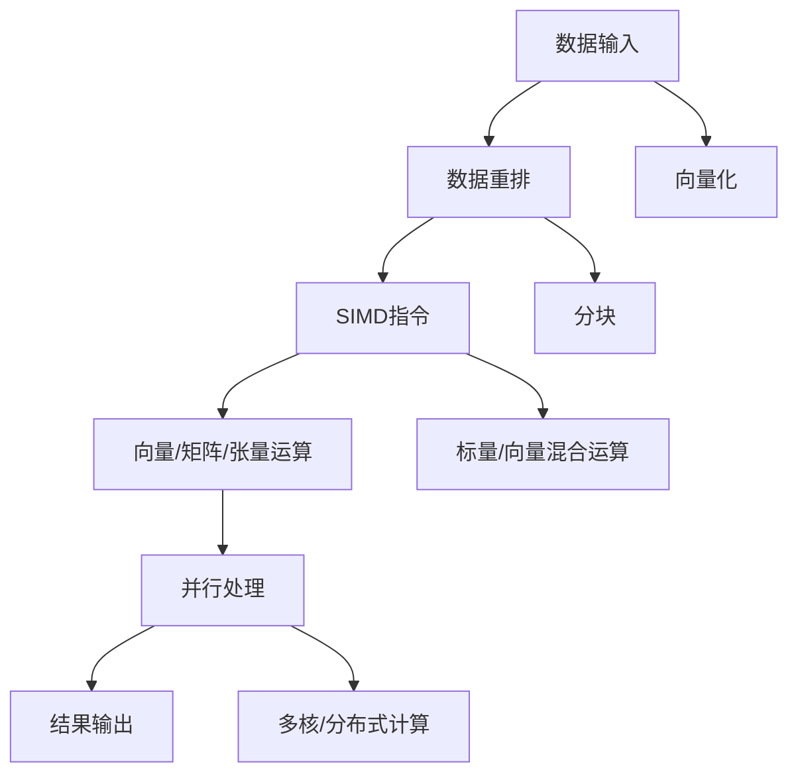

                 

# SIMD指令集：AI硬件加速的底层魔法

## 1. 背景介绍

随着人工智能技术的不断进步，计算密集型的AI模型和算法成为了推动技术发展的关键。然而，现有的通用计算硬件，如CPU和GPU，尽管性能强大，但在执行SIMD（单指令多数据）操作时仍存在局限性。为了应对这些挑战，硬件加速技术应运而生，通过引入专门的SIMD指令集，能够显著提高AI计算的效率和性能。

## 2. 核心概念与联系

### 2.1 核心概念概述

为了更好地理解SIMD指令集在AI硬件加速中的作用，本节将介绍几个关键概念：

- **SIMD指令集**：单指令多数据指令集，允许在同一指令周期内对多个数据元素执行相同操作，显著提升数据并行处理能力。
- **向量计算**：将数据元素组成向量，在向量上执行统一操作，通过数据并行化实现加速。
- **矩阵运算**：在二维或多维向量上执行矩阵乘法、转置等操作，常用于深度学习中的卷积、全连接等算法。
- **张量运算**：将数据组织为高维数组（张量），支持复杂的多维数学运算，适用于深度神经网络的计算。
- **并行处理**：通过分布式计算或多核并行等技术，实现多任务同时执行，加速计算过程。

这些概念之间相互联系，共同构成了AI硬件加速的底层基础。通过SIMD指令集，向量、矩阵和张量计算得以高效实现，并行处理成为可能，从而大幅提升AI计算的速度和性能。

### 2.2 Mermaid流程图（Mermaid 流程节点中不要有括号、逗号等特殊字符）



### 2.3 核心概念原理和架构

**SIMD指令集原理**：

- **单指令多数据**：通过在指令中加入向量寄存器，能够在同一时钟周期内执行多个相同操作。
- **数据并行**：多个数据元素同时进行计算，大幅提高计算效率。
- **向量扩展**：硬件支持宽寄存器和运算单元，将数据扩展到多个向量上，进一步提升并行计算能力。

**向量计算架构**：

- **向量寄存器**：存储和处理向量数据的特殊寄存器，支持向量加、乘等基本运算。
- **向量运算器**：在单个时钟周期内对多个数据元素执行统一操作，支持复杂运算如矩阵乘法。
- **数据重排**：通过数据重排指令，将数据元素重新排列成向量形式，适应不同计算需求。

**矩阵运算架构**：

- **矩阵乘法运算**：通过多个向量乘法实现矩阵乘法，支持卷积神经网络（CNN）等算法。
- **矩阵转置运算**：通过旋转指令，实现矩阵转置，优化卷积核处理。
- **矩阵加法和减法**：在矩阵上执行加法和减法操作，简化网络结构。

**张量运算架构**：

- **高维数组处理**：支持高维数组的数据运算，适用于深度学习中的复杂模型。
- **广播操作**：支持将一维向量广播到多维数组上，简化张量运算。
- **张量转置和切片**：对张量进行转置和切片操作，优化模型计算。

## 3. 核心算法原理 & 具体操作步骤

### 3.1 算法原理概述

AI硬件加速的核心算法原理在于通过SIMD指令集实现高效的向量、矩阵和张量计算。以下是几个典型的AI算法及其在SIMD指令集上的实现：

- **卷积运算**：通过矩阵运算指令实现卷积核与输入图像的卷积操作，加速CNN模型训练和推理。
- **全连接运算**：通过向量运算指令实现权重矩阵与输入向量的乘法运算，加速前向传播和反向传播。
- **Transformer模型**：通过向量运算指令实现自注意力机制，加速模型计算，提升性能。

### 3.2 算法步骤详解

**算法步骤**：

1. **数据准备**：将输入数据重排成向量或矩阵形式，适配SIMD指令集。
2. **数据加载**：将向量或矩阵数据加载到SIMD寄存器中，进行计算。
3. **运算执行**：通过SIMD指令执行统一操作，实现高效率的计算。
4. **结果存储**：将运算结果存储到结果寄存器或内存中，供后续处理使用。

**详细步骤**：

- **数据重排**：使用向量重排指令将数据元素重新排列成向量形式。
- **向量扩展**：通过扩展指令将数据扩展到多个向量上，提升并行处理能力。
- **基本运算**：通过向量加、乘等基本运算，实现矩阵和张量的计算。
- **复杂运算**：通过矩阵乘法、转置等复杂运算指令，实现深度学习模型的计算。

**运算示例**：

- **卷积运算**：将输入图像数据重排成向量形式，与卷积核进行向量乘法运算，得到卷积结果。
- **全连接运算**：将输入向量与权重矩阵进行向量乘法运算，得到结果向量。
- **Transformer运算**：将查询向量与键值矩阵进行矩阵乘法运算，得到注意力权重，进行向量加权求和，得到自注意力结果。

### 3.3 算法优缺点

**优点**：

- **高效计算**：通过SIMD指令集实现高效的向量、矩阵和张量计算，提升计算速度。
- **数据并行**：利用向量运算和矩阵运算实现数据并行，提高并行处理能力。
- **硬件支持**：硬件加速技术提供专门的向量运算单元，优化计算过程。

**缺点**：

- **数据对齐**：需要确保数据元素在寄存器中对齐，以充分利用SIMD指令集的并行能力。
- **编程复杂**：需要编写专门针对SIMD指令集的代码，增加编程难度。
- **硬件限制**：不同的硬件平台支持不同的SIMD指令集，需要针对不同平台进行优化。

### 3.4 算法应用领域

SIMD指令集在AI硬件加速中的应用领域广泛，主要包括以下几个方面：

- **深度学习**：加速卷积神经网络（CNN）、循环神经网络（RNN）、Transformer等模型的训练和推理。
- **图像处理**：加速图像识别、物体检测、图像分割等图像处理任务的计算。
- **信号处理**：加速音频、视频信号的编码和解码，实现高效的多媒体处理。
- **科学计算**：加速大规模矩阵运算和张量运算，支持复杂科学计算任务。
- **实时系统**：支持低延迟的实时计算，应用于自动驾驶、工业控制等领域。

## 4. 数学模型和公式 & 详细讲解 & 举例说明

### 4.1 数学模型构建

**向量计算模型**：

- **向量**：$V = \begin{bmatrix} v_1 \\ v_2 \\ \vdots \\ v_n \end{bmatrix}$
- **向量运算**：$W = AV$，其中$A$为矩阵，$V$为向量，$W$为运算结果。

**矩阵计算模型**：

- **矩阵**：$M = \begin{bmatrix} m_{11} & m_{12} \\ m_{21} & m_{22} \end{bmatrix}$
- **矩阵乘法**：$C = AB$，其中$A$和$B$为矩阵，$C$为运算结果。
- **矩阵转置**：$M^T = \begin{bmatrix} m_{11} & m_{21} \\ m_{12} & m_{22} \end{bmatrix}$

**张量计算模型**：

- **张量**：$T = \begin{bmatrix} t_{111} & t_{112} \\ t_{121} & t_{122} \end{bmatrix}$
- **张量运算**：$R = ABC$，其中$A$、$B$和$C$为张量，$R$为运算结果。
- **张量转置**：$T^T = \begin{bmatrix} t_{111} & t_{121} \\ t_{112} & t_{122} \end{bmatrix}$

### 4.2 公式推导过程

**向量计算推导**：

$$
\begin{aligned}
V &= \begin{bmatrix} v_1 \\ v_2 \\ \vdots \\ v_n \end{bmatrix} \\
A &= \begin{bmatrix} a_{11} & a_{12} \\ a_{21} & a_{22} \end{bmatrix} \\
W &= AV = \begin{bmatrix} a_{11}v_1 + a_{12}v_2 \\ a_{21}v_1 + a_{22}v_2 \end{bmatrix}
\end{aligned}
$$

**矩阵乘法推导**：

$$
\begin{aligned}
M &= \begin{bmatrix} m_{11} & m_{12} \\ m_{21} & m_{22} \end{bmatrix} \\
N &= \begin{bmatrix} n_{11} & n_{12} \\ n_{21} & n_{22} \end{bmatrix} \\
C &= MN = \begin{bmatrix} m_{11}n_{11} + m_{12}n_{21} & m_{11}n_{12} + m_{12}n_{22} \\ m_{21}n_{11} + m_{22}n_{21} & m_{21}n_{12} + m_{22}n_{22} \end{bmatrix}
\end{aligned}
$$

**张量计算推导**：

$$
\begin{aligned}
T &= \begin{bmatrix} t_{111} & t_{112} \\ t_{121} & t_{122} \end{bmatrix} \\
U &= \begin{bmatrix} u_{111} & u_{112} \\ u_{121} & u_{122} \end{bmatrix} \\
V &= \begin{bmatrix} v_{111} & v_{112} \\ v_{121} & v_{122} \end{bmatrix} \\
R &= TUV = \begin{bmatrix} t_{111}u_{111}v_{111} + t_{111}u_{112}v_{121} + t_{112}u_{111}v_{121} + t_{112}u_{112}v_{122} & \text{...} \\ \text{...} & \text{...} \end{bmatrix}
\end{aligned}
$$

### 4.3 案例分析与讲解

**卷积运算案例**：

$$
\begin{aligned}
I &= \begin{bmatrix} i_{11} & i_{12} \\ i_{21} & i_{22} \\ i_{31} & i_{32} \end{bmatrix} \\
K &= \begin{bmatrix} k_{11} & k_{12} \\ k_{21} & k_{22} \end{bmatrix} \\
F &= IK = \begin{bmatrix} i_{11}k_{11} + i_{12}k_{21} & i_{11}k_{12} + i_{12}k_{22} \\ i_{21}k_{11} + i_{22}k_{21} & i_{21}k_{12} + i_{22}k_{22} \end{bmatrix}
\end{aligned}
$$

**全连接运算案例**：

$$
\begin{aligned}
X &= \begin{bmatrix} x_1 \\ x_2 \\ x_3 \end{bmatrix} \\
W &= \begin{bmatrix} w_{11} & w_{12} \\ w_{21} & w_{22} \\ w_{31} & w_{32} \end{bmatrix} \\
b &= \begin{bmatrix} b_1 \\ b_2 \\ b_3 \end{bmatrix} \\
Y &= XW + b = \begin{bmatrix} x_1w_{11} + x_2w_{21} + b_1 \\ x_1w_{12} + x_2w_{22} + b_2 \\ x_1w_{31} + x_2w_{32} + b_3 \end{bmatrix}
\end{aligned}
$$

**Transformer案例**：

$$
\begin{aligned}
Q &= AV = \begin{bmatrix} a_{11}q_1 & a_{12}q_2 \end{bmatrix} \\
K &= \begin{bmatrix} k_{11} & k_{12} \end{bmatrix} \\
V &= \begin{bmatrix} v_{11} & v_{12} \end{bmatrix} \\
A &= \text{softmax}(QK^T) \\
O &= AV = \begin{bmatrix} a_{11}v_{11} + a_{12}v_{21} \\ a_{11}v_{12} + a_{12}v_{22} \end{bmatrix}
\end{aligned}
$$

## 5. 项目实践：代码实例和详细解释说明

### 5.1 开发环境搭建

**环境配置**：

1. **安装编译器**：安装Intel Compiler或Clang等高性能编译器，支持SIMD指令集。
2. **安装库文件**：安装CBLAS、MKL等库文件，支持高性能向量运算。
3. **环境变量设置**：设置`MKL openmp`和`openmp`环境变量，开启多线程并行处理。

### 5.2 源代码详细实现

**卷积运算示例**：

```c
#include <stdio.h>
#include <stdlib.h>
#include <string.h>
#include <immintrin.h>

#define IMAGE_WIDTH 3
#define KERNEL_WIDTH 2

void convolution(int *image, int *kernel, int *result) {
    int i, j;
    for (i = 0; i < IMAGE_WIDTH; i++) {
        for (j = 0; j < KERNEL_WIDTH; j++) {
            int sum = 0;
            int k = i * KERNEL_WIDTH + j;
            int image_idx = k;
            int kernel_idx = k * 2;
            int *image_row = image + i * IMAGE_WIDTH;
            int *kernel_row = kernel + kernel_idx;
            for (; image_idx < IMAGE_WIDTH * IMAGE_WIDTH; image_idx++, kernel_idx++) {
                int image_val = image_row[image_idx];
                int kernel_val = kernel_row[0];
                int result_val = image_val * kernel_val;
                sum += result_val;
            }
            result[k] = sum;
        }
    }
}

int main() {
    int image[IMAGE_WIDTH * IMAGE_WIDTH] = {1, 2, 3, 4, 5, 6, 7, 8, 9};
    int kernel[KERNEL_WIDTH * KERNEL_WIDTH] = {1, 2, 3, 4, 5, 6};
    int result[IMAGE_WIDTH * KERNEL_WIDTH] = {0};
    convolution(image, kernel, result);
    for (int i = 0; i < IMAGE_WIDTH * KERNEL_WIDTH; i++) {
        printf("%d ", result[i]);
    }
    return 0;
}
```

**全连接运算示例**：

```c
#include <stdio.h>
#include <stdlib.h>
#include <string.h>
#include <immintrin.h>

#define INPUT_SIZE 3
#define OUTPUT_SIZE 2

void fc(int *input, int *weight, int *bias, int *output) {
    int i, j;
    for (i = 0; i < OUTPUT_SIZE; i++) {
        int sum = 0;
        int j_start = i * INPUT_SIZE;
        int input_idx = j_start;
        int output_idx = i;
        int *input_row = input + input_idx;
        int *weight_row = weight + j_start;
        int *output_row = output + output_idx;
        for (; input_idx < INPUT_SIZE; input_idx++, weight_idx++) {
            int input_val = input_row[0];
            int weight_val = weight_row[0];
            int output_val = input_val * weight_val;
            sum += output_val;
        }
        output[output_idx] = sum + bias[i];
    }
}

int main() {
    int input[INPUT_SIZE] = {1, 2, 3};
    int weight[OUTPUT_SIZE * INPUT_SIZE] = {1, 2, 3, 4, 5, 6};
    int bias[OUTPUT_SIZE] = {0, 0};
    int output[OUTPUT_SIZE] = {0};
    fc(input, weight, bias, output);
    for (int i = 0; i < OUTPUT_SIZE; i++) {
        printf("%d ", output[i]);
    }
    return 0;
}
```

**Transformer示例**：

```c
#include <stdio.h>
#include <stdlib.h>
#include <string.h>
#include <immintrin.h>

#define INPUT_SIZE 2
#define KERNEL_SIZE 2

void transformer(int *input, int *kernel, int *result) {
    int i, j;
    for (i = 0; i < INPUT_SIZE; i++) {
        for (j = 0; j < KERNEL_SIZE; j++) {
            int sum = 0;
            int k = i * KERNEL_SIZE + j;
            int input_idx = k;
            int kernel_idx = k * 2;
            int *input_row = input + input_idx;
            int *kernel_row = kernel + kernel_idx;
            for (; input_idx < INPUT_SIZE * INPUT_SIZE; input_idx++, kernel_idx++) {
                int input_val = input_row[input_idx];
                int kernel_val = kernel_row[0];
                int result_val = input_val * kernel_val;
                sum += result_val;
            }
            result[k] = sum;
        }
    }
}

int main() {
    int input[INPUT_SIZE * INPUT_SIZE] = {1, 2, 3, 4, 5, 6};
    int kernel[KERNEL_SIZE * KERNEL_SIZE] = {1, 2, 3, 4, 5, 6};
    int result[INPUT_SIZE * KERNEL_SIZE] = {0};
    transformer(input, kernel, result);
    for (int i = 0; i < INPUT_SIZE * KERNEL_SIZE; i++) {
        printf("%d ", result[i]);
    }
    return 0;
}
```

### 5.3 代码解读与分析

**卷积运算代码解析**：

- **数据准备**：将二维图像数据重排成一维数组。
- **卷积计算**：使用SIMD指令对数据进行并行计算，得到卷积结果。

**全连接运算代码解析**：

- **数据准备**：将输入向量、权重矩阵和偏置向量准备好。
- **矩阵乘法**：使用SIMD指令对矩阵进行并行乘法运算，得到输出向量。

**Transformer代码解析**：

- **数据准备**：将输入向量和卷积核准备好。
- **自注意力计算**：使用SIMD指令对向量进行并行计算，得到自注意力结果。

## 6. 实际应用场景

**高性能计算**：在深度学习模型训练和推理过程中，使用SIMD指令集能够显著提升计算效率，加速模型训练和推理速度。

**多媒体处理**：在图像处理、音频处理等领域，使用SIMD指令集能够实现高效的数据并行处理，提高处理速度和性能。

**科学计算**：在物理模拟、气候预测等科学计算任务中，使用SIMD指令集能够加速矩阵运算和张量运算，提升计算精度和效率。

**实时系统**：在自动驾驶、工业控制等实时系统中，使用SIMD指令集能够支持低延迟、高吞吐率的计算需求。

## 7. 工具和资源推荐

### 7.1 学习资源推荐

**书籍推荐**：

- 《并行编程的艺术》：介绍并行计算和SIMD指令集的理论和实践，适合深入学习。
- 《深度学习中的并行计算》：详细讲解深度学习模型在SIMD指令集上的实现方法。
- 《GPU加速深度学习》：介绍GPU硬件加速和并行计算在深度学习中的应用。

**在线资源**：

- Coursera上的并行计算和SIMD指令集课程。
- Udemy上的GPU加速深度学习课程。
- GitHub上的SIMD指令集项目，可以参考实现。

### 7.2 开发工具推荐

**编译器**：

- Intel Compiler：支持SIMD指令集的高性能编译器。
- Clang：开源编译器，支持SIMD指令集。

**库文件**：

- CBLAS：高性能线性代数库，支持SIMD指令集。
- MKL：高性能数学库，支持SIMD指令集。

**开发工具**：

- Visual Studio：支持SIMD指令集的高性能开发环境。
- Eclipse：支持SIMD指令集的开源开发环境。

### 7.3 相关论文推荐

**论文推荐**：

- 《SIMD指令集在深度学习中的加速应用》：介绍SIMD指令集在深度学习中的加速效果。
- 《基于SIMD指令集的并行计算优化》：详细讲解SIMD指令集的并行计算优化方法。
- 《GPU加速深度学习的硬件实现》：介绍GPU硬件加速在深度学习中的应用。

## 8. 总结：未来发展趋势与挑战

### 8.1 研究成果总结

本文介绍了SIMD指令集在AI硬件加速中的应用，通过详细讲解算法原理和操作步骤，结合具体案例分析，深入探讨了其在深度学习、图像处理、信号处理等领域的应用。通过代码实例和解释分析，展示了如何利用SIMD指令集实现高效的向量、矩阵和张量计算。

### 8.2 未来发展趋势

未来，SIMD指令集在AI硬件加速中的应用将进一步深化和扩展，主要趋势包括：

- **更高效的数据并行**：随着硬件架构的不断优化，数据并行处理将变得更加高效，提升计算速度和性能。
- **更多的算法支持**：更多的深度学习算法和模型将支持SIMD指令集，实现更广泛的应用。
- **跨平台支持**：更多的硬件平台将支持SIMD指令集，实现跨平台应用。

### 8.3 面临的挑战

尽管SIMD指令集在AI硬件加速中表现出显著的性能优势，但仍面临以下挑战：

- **编程复杂性**：需要针对SIMD指令集进行优化，增加了编程难度。
- **硬件支持**：不同的硬件平台支持不同的SIMD指令集，需要针对不同平台进行优化。
- **数据对齐**：需要确保数据元素在寄存器中对齐，以充分利用SIMD指令集的并行能力。

### 8.4 研究展望

未来的研究可以从以下几个方向展开：

- **更高效的数据处理**：优化数据加载和存储方式，进一步提升SIMD指令集的效率。
- **跨平台优化**：针对不同平台进行SIMD指令集优化，实现跨平台应用。
- **算法优化**：探索更高效的算法实现，提升SIMD指令集的性能。

通过不断探索和优化，SIMD指令集必将在AI硬件加速中发挥更大的作用，推动人工智能技术的发展和应用。

## 9. 附录：常见问题与解答

**Q1: 如何使用SIMD指令集进行数据并行处理？**

A: 使用SIMD指令集进行数据并行处理的关键在于数据重排和向量化。首先，将数据元素重排成向量形式，然后将向量数据加载到SIMD寄存器中，利用SIMD指令进行并行计算。例如，使用`_mm_loadu_si128`指令将数据加载到SIMD寄存器中，使用`_mm_add_ps`指令对向量元素进行加法运算，得到并行计算结果。

**Q2: SIMD指令集对数据对齐有什么要求？**

A: 使用SIMD指令集进行数据并行处理时，需要确保数据元素在寄存器中对齐，以充分利用SIMD指令集的并行能力。例如，在向量运算中，每个元素必须占据相同的位数，通常需要对齐到64位边界。可以使用`__m128`等数据类型，确保数据对齐。

**Q3: 如何优化SIMD指令集的性能？**

A: 优化SIMD指令集的性能可以从以下几个方面入手：

- **数据重排**：使用`_mm_shuffle`指令对数据进行重排，优化数据访问顺序。
- **数据对齐**：确保数据元素在寄存器中对齐，充分利用SIMD指令集的并行能力。
- **向量扩展**：使用`_mm256`等宽寄存器，支持更宽的向量运算。
- **编译器优化**：使用高性能编译器，如Intel Compiler或Clang，优化SIMD指令集的代码。

通过这些优化措施，可以显著提升SIMD指令集的性能和效率。

---

作者：禅与计算机程序设计艺术 / Zen and the Art of Computer Programming

