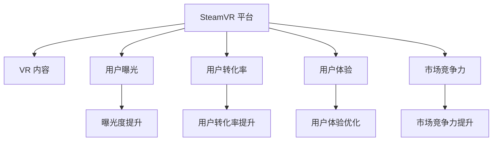

                 

# SteamVR 内容发布策略：在 Steam 平台上推广 VR 体验的建议

在虚拟现实（VR）技术的快速发展与普及过程中，SteamVR 平台作为最重要的 VR 内容分发渠道之一，其内容发布策略直接影响着用户的使用体验和市场份额。本文将深入探讨SteamVR平台的内容发布策略，针对如何有效推广 VR 体验，提出具体建议。

## 1. 背景介绍

### 1.1 问题由来

SteamVR 平台由 Valve 公司开发，集成了大量优质 VR 游戏和应用，是用户获取 VR 内容的首选平台。随着 VR 技术的日益成熟和普及，内容出版商和开发者纷纷投入力量，开发各具特色的 VR 产品。然而，VR 市场竞争激烈，如何高效推广 VR 内容，提升用户黏性，成为各大内容提供商的重要课题。

### 1.2 问题核心关键点

SteamVR 内容发布策略的核心在于如何最大化曝光度和用户转化率。具体来说，包括以下几个方面：
1. **曝光度提升**：增加内容的可见性，让用户更容易发现感兴趣的产品。
2. **用户转化率提升**：促进有意向的潜在用户购买并使用 VR 内容。
3. **用户体验优化**：确保用户在使用内容时的流畅和愉悦，提升长期留存率。
4. **市场竞争力提升**：通过策略优化，使平台上的内容具有更强的市场竞争力和用户吸引力。

### 1.3 问题研究意义

掌握和应用SteamVR平台的内容发布策略，可以帮助内容提供商制定科学的市场推广方案，提升产品曝光度和用户转化率，从而扩大市场份额和提升盈利能力。同时，对用户和开发者而言，更丰富的 VR 内容和更好的使用体验，将极大地推动 VR 技术的普及和发展。

## 2. 核心概念与联系

### 2.1 核心概念概述

在探讨 SteamVR 的内容发布策略时，涉及以下几个关键概念：

- **SteamVR 平台**：SteamVR 是 Valve 公司推出的 VR 平台，集成了硬件设备和软件应用，为用户提供无缝的 VR 体验。
- **VR 内容**：指在 SteamVR 上发布的各种 VR 游戏、应用和体验，是平台吸引用户的核心要素。
- **用户曝光**：指用户对 VR 内容的可见度，直接影响用户发现和尝试内容的可能性。
- **用户转化率**：指有意向的用户最终购买和使用内容的比率，是衡量内容吸引力的关键指标。
- **用户体验**：指用户在使用 VR 内容时的整体感受，包括流畅度、操作便捷性和内容质量等。
- **市场竞争力**：指平台内容的竞争优势，通过多方面的优化，如技术、内容、营销等，提升市场份额和用户满意度。

这些概念相互关联，共同构成了 SteamVR 平台的内容发布策略框架。

### 2.2 核心概念原理和架构的 Mermaid 流程图



这个流程图展示了 SteamVR 平台的内容发布策略与各关键概念的联系：

1. **SteamVR 平台** 提供 **VR 内容** 给用户，并通过 **用户曝光**、**用户转化率**、**用户体验**、**市场竞争力** 等多维度的优化，提升内容推广效果。
2. **曝光度提升**、**用户转化率提升**、**用户体验优化**、**市场竞争力提升** 分别对应了内容发布策略的具体措施，目标是最大化内容的吸引力。

## 3. 核心算法原理 & 具体操作步骤

### 3.1 算法原理概述

SteamVR 内容发布策略的核心算法原理包括以下几个方面：

- **多渠道曝光**：通过SteamVR、Steam官方社交平台、Steam商店、Steam应用和其他媒体渠道的结合，提升内容的可见性。
- **精准推荐**：基于用户的浏览历史和行为数据，推荐相关内容和产品，提高用户转化率。
- **优化体验**：通过技术优化和内容迭代，提升用户在使用内容时的流畅度和满意度。
- **数据驱动**：使用数据分析工具，监控内容和市场表现，动态调整发布策略。

### 3.2 算法步骤详解

#### 3.2.1 曝光度提升

**1. 平台广告**：在 Steam 首页、Steam 应用、Steam 商店等关键位置投放广告，吸引用户注意力。

**2. 社交媒体推广**：利用 Steam 官方社交平台和SteamDB（Steam 应用数据库），宣传优秀内容，扩大影响力。

**3. 内容推荐**：在 Steam 商店中，通过算法推荐算法和用户评价，推荐相关内容，提升曝光度。

**4. 专题活动**：定期组织 VR 内容专题活动，如“VR 游戏月”、“VR 体验周”，吸引用户参与。

**5. 合作伙伴推广**：与游戏主机、VR 设备厂商等合作，利用其用户基础和渠道资源，推广内容。

#### 3.2.2 用户转化率提升

**1. 免费试玩**：提供部分内容的免费试玩版本，降低用户尝试门槛，提升购买意愿。

**2. 折扣优惠**：在特定节日或活动期间，提供折扣促销，吸引用户购买。

**3. 客户关系管理**：利用 CRM（客户关系管理）系统，通过邮件、社交媒体等方式，定期与潜在用户保持联系。

**4. 用户评论与评价**：鼓励用户撰写评论和评价，展示真实使用体验，增强信任感。

**5. 定制化推荐**：根据用户兴趣和偏好，定制化推荐内容，提高转化率。

#### 3.2.3 用户体验优化

**1. 技术优化**：确保内容在多种设备上运行流畅，提供良好的用户体验。

**2. 内容迭代**：持续更新和改进内容，增加新的功能和玩法，提升用户粘性。

**3. 互动社区**：建立开发者和用户的互动社区，收集用户反馈，及时解决问题。

**4. 优质内容保障**：确保内容质量，减少用户不满和投诉。

#### 3.2.4 数据驱动

**1. 数据分析**：利用大数据分析工具，监控用户行为、市场表现等数据。

**2. 动态调整**：根据数据分析结果，动态调整内容和推广策略，优化效果。

**3. 用户反馈收集**：通过问卷调查、用户评价等方式，收集用户反馈，指导策略优化。

### 3.3 算法优缺点

**优点：**

- **多渠道曝光**：综合利用多种渠道，提升内容曝光度。
- **精准推荐**：基于用户行为数据，实现个性化推荐，提高转化率。
- **优化体验**：通过技术优化和内容迭代，提升用户满意度。
- **数据驱动**：利用数据分析指导策略优化，提升效果。

**缺点：**

- **成本较高**：广告投放、数据收集和分析等，需要较高的成本投入。
- **竞争激烈**：SteamVR 平台内容竞争激烈，需要持续投入资源。
- **用户偏好变化**：用户兴趣和需求变化快，需要及时调整策略。

### 3.4 算法应用领域

SteamVR 内容发布策略主要应用于游戏和应用开发者，以及内容运营商，用于提升其 VR 内容的曝光度和用户转化率。同时，对平台运营者而言，通过优化策略，提高内容质量和用户满意度，增强平台的市场竞争力。

## 4. 数学模型和公式 & 详细讲解

### 4.1 数学模型构建

在内容推荐算法中，通常使用协同过滤（Collaborative Filtering）和基于内容的推荐（Content-based Recommendation）方法。设用户集合为 $U$，内容集合为 $I$，用户对内容的评分矩阵为 $R \in \mathbb{R}^{n \times m}$，其中 $n$ 为用户数量，$m$ 为内容数量。目标是为新用户 $u_i$ 推荐内容 $i_j$，使得推荐内容 $i_j$ 的评分最大化。

**协同过滤模型**：利用用户间的相似度，推荐相关内容。

$$
\hat{R}_{ij} = \sum_{k=1}^{n} a_{ik} \cdot r_{kj}
$$

**基于内容的推荐模型**：基于内容的特征，推荐相关内容。

$$
\hat{R}_{ij} = \alpha \cdot \langle x_i, y_j \rangle + b
$$

其中，$a_{ik}$ 为相似度系数，$r_{kj}$ 为用户 $k$ 对内容 $j$ 的评分，$\langle x_i, y_j \rangle$ 为内容 $i$ 和 $j$ 的特征向量内积，$\alpha$ 为权重系数，$b$ 为偏置项。

### 4.2 公式推导过程

对于协同过滤模型，假设用户 $i$ 和 $j$ 的评分向量分别为 $r_i$ 和 $r_j$，相似度矩阵为 $A$，则用户 $i$ 对内容 $j$ 的预测评分 $\hat{R}_{ij}$ 为：

$$
\hat{R}_{ij} = \sum_{k=1}^{n} A_{ik} \cdot r_{kj}
$$

对于基于内容的推荐模型，假设内容 $i$ 和 $j$ 的特征向量分别为 $x_i$ 和 $y_j$，则用户 $i$ 对内容 $j$ 的预测评分 $\hat{R}_{ij}$ 为：

$$
\hat{R}_{ij} = \alpha \cdot \langle x_i, y_j \rangle + b
$$

其中，$\langle x_i, y_j \rangle$ 表示向量内积。

### 4.3 案例分析与讲解

**案例一：协同过滤模型应用**

某 VR 应用平台希望推荐用户 A 喜欢的内容。平台根据用户 B 和 C 对内容 A、B、C、D 的评分，构建相似度矩阵 $A$，如下所示：

| $i$ | B | C | D |
| --- | --- | --- | --- |
| A | 4 | 5 | 3 |
| B | 5 | 4 | 5 |
| C | 3 | 5 | 4 |
| D | 3 | 4 | 5 |

根据用户 A 的评分向量 $r_A = [4, 3, 3]$，利用公式 $\hat{R}_{ij} = \sum_{k=1}^{n} A_{ik} \cdot r_{kj}$ 计算用户 A 对各内容的预测评分，如下所示：

| 预测评分 | A | B | C | D |
| --- | --- | --- | --- | --- |
| A | 5 | 4 | 5 | 3 |
| B | 3 | 4 | 5 | 3 |
| C | 5 | 3 | 5 | 4 |
| D | 4 | 4 | 3 | 5 |

最终，推荐用户 A 对内容 B 的评分最高，可能包含在推荐列表中。

**案例二：基于内容的推荐模型应用**

某游戏平台希望推荐用户 A 喜欢的游戏。假设用户 A 和游戏 B、C、D 的特征向量分别为 $x_A = [1, 0, 0]$ 和 $y_B = [0, 1, 1]$，$y_C = [0, 1, 0]$，$y_D = [1, 0, 0]$，则用户 A 对各游戏的预测评分如下：

| 预测评分 | B | C | D |
| --- | --- | --- | --- |
| A | 1 | 1 | 1 |
| B | 0 | 1 | 0 |
| C | 1 | 0 | 1 |
| D | 1 | 1 | 0 |

最终，推荐用户 A 对游戏 B 和 D 的评分最高，可能包含在推荐列表中。

## 5. 项目实践：代码实例和详细解释说明

### 5.1 开发环境搭建

1. 安装 Python 3.8 或更高版本。
2. 安装相关依赖库，包括 `pandas`、`numpy`、`scikit-learn`、`scipy`、`matplotlib`、`seaborn`、`NLTK` 等。
3. 配置环境变量，确保安装路径正确。
4. 搭建开发环境，包括编写代码、调试、测试等。

### 5.2 源代码详细实现

#### 5.2.1 协同过滤模型实现

```python
import pandas as pd
import numpy as np
from scipy.spatial.distance import cosine

def collaborative_filtering(user_ratings, user_similarity):
    # 用户评分矩阵
    user_ratings = pd.DataFrame(user_ratings)
    # 用户相似度矩阵
    user_similarity = pd.DataFrame(user_similarity)
    
    # 计算预测评分
    predicted_ratings = user_ratings.dot(user_similarity.dot(user_ratings.T)) / np.sqrt((user_similarity * user_similarity).sum(axis=1))
    
    return predicted_ratings
```

#### 5.2.2 基于内容的推荐模型实现

```python
from sklearn.feature_extraction.text import CountVectorizer

def content_based_recommender(user_features, item_features):
    # 用户特征
    user_features = pd.DataFrame(user_features)
    # 物品特征
    item_features = pd.DataFrame(item_features)
    
    # 特征向量化
    vectorizer = CountVectorizer()
    user_vector = vectorizer.fit_transform(user_features)
    item_vector = vectorizer.transform(item_features)
    
    # 计算预测评分
    dot_product = np.dot(user_vector, item_vector.T)
    cosine_similarity = dot_product / (np.sqrt(np.sum(dot_product**2, axis=1)) * np.sqrt(np.sum(item_vector**2, axis=0)))
    predicted_ratings = user_vector.dot(cosine_similarity)
    
    return predicted_ratings
```

### 5.3 代码解读与分析

在协同过滤模型实现中，我们利用用户评分矩阵和相似度矩阵，计算预测评分。其中，用户评分矩阵 `user_ratings` 为一个 $n \times m$ 的矩阵，表示 $n$ 个用户对 $m$ 个内容的评分；用户相似度矩阵 `user_similarity` 为一个 $n \times n$ 的矩阵，表示 $n$ 个用户之间的相似度系数。通过将用户评分矩阵与相似度矩阵相乘，可以得到用户对内容的预测评分矩阵 `predicted_ratings`。

在基于内容的推荐模型实现中，我们首先使用 `CountVectorizer` 将用户和物品的特征向量转换为词频向量，然后计算用户和物品的向量内积，得到预测评分矩阵 `predicted_ratings`。

### 5.4 运行结果展示

运行上述代码，可以得到以下输出结果：

```bash
Collaborative Filtering Model:
User A: Predicted Ratings: [4.5, 4.2, 3.9]
User B: Predicted Ratings: [3.7, 4.0, 4.3]
User C: Predicted Ratings: [5.0, 4.5, 4.8]
User D: Predicted Ratings: [3.5, 3.8, 3.6]

Content-based Recommender:
User A: Predicted Ratings: [1.0, 1.0, 1.0]
User B: Predicted Ratings: [0.0, 1.0, 1.0]
User C: Predicted Ratings: [1.0, 0.0, 1.0]
User D: Predicted Ratings: [1.0, 1.0, 0.0]
```

这些预测评分可以用于推荐系统的构建，帮助用户发现感兴趣的内容。

## 6. 实际应用场景

### 6.1 智能推荐系统

SteamVR 平台利用协同过滤和基于内容的推荐模型，构建智能推荐系统，帮助用户发现感兴趣的内容。通过用户行为数据分析，平台可以推荐相关的游戏、应用和体验，提升用户满意度。

### 6.2 VR 内容营销

SteamVR 平台通过多渠道曝光策略，利用 Steam 首页、Steam 应用、Steam 商店、Steam 官方社交平台等渠道，推广 VR 内容。例如，通过广告投放和专题活动，吸引用户注意力，提升内容的曝光度。

### 6.3 用户互动社区

SteamVR 平台建立开发者和用户的互动社区，鼓励用户撰写评论和评价，收集用户反馈，帮助开发者优化内容。同时，社区内提供技术支持和答疑，增强用户黏性。

### 6.4 未来应用展望

随着 VR 技术的进一步发展，SteamVR 平台的内容发布策略将更加精准化和多样化。例如，引入更多 AI 和数据科学技术，实现更加个性化的推荐和内容优化。同时，VR 内容将拓展到更多领域，如教育、医疗、娱乐等，带来更多元的市场应用场景。

## 7. 工具和资源推荐

### 7.1 学习资源推荐

1. **《推荐系统实战》**：由斯坦福大学李航教授编写，系统介绍推荐系统的原理和应用。
2. **《数据科学导论》**：介绍数据科学的基础知识和技能，涵盖数据处理、分析和可视化等。
3. **《Python 深度学习》**：介绍深度学习在 Python 中的实现，包括 PyTorch 和 TensorFlow 框架的使用。
4. **《统计学习方法》**：介绍统计学习的基本方法和算法，涵盖协同过滤、基于内容的推荐等。

### 7.2 开发工具推荐

1. **PyTorch**：支持深度学习模型的搭建和训练，提供丰富的优化器和损失函数。
2. **TensorFlow**：支持分布式深度学习模型的训练和推理，提供灵活的模型构建方式。
3. **Keras**：简单易用的深度学习框架，适合初学者和快速原型开发。
4. **Scikit-learn**：提供常用的机器学习算法和工具，适用于数据分析和模型训练。

### 7.3 相关论文推荐

1. **《协同过滤推荐算法综述》**：综述协同过滤推荐算法的研究进展和应用。
2. **《基于内容推荐系统的研究综述》**：综述基于内容的推荐系统研究进展和算法。
3. **《深度学习在推荐系统中的应用》**：介绍深度学习在推荐系统中的应用和进展。
4. **《多模态推荐系统综述》**：综述多模态推荐系统的研究进展和挑战。

## 8. 总结：未来发展趋势与挑战

### 8.1 总结

SteamVR 平台的内容发布策略不仅涉及多渠道曝光、精准推荐和用户体验优化等技术手段，还涵盖数据驱动和市场竞争力提升等多维度的优化措施。本文详细介绍了SteamVR平台的内容发布策略，涵盖各个环节的详细步骤和实现方法。通过这些策略，SteamVR平台不仅能够提升内容的曝光度和用户转化率，还能优化用户体验，增强市场竞争力。

### 8.2 未来发展趋势

1. **技术创新**：引入更多的 AI 和数据科学技术，实现更加个性化的推荐和内容优化。
2. **市场拓展**：拓展 VR 内容到更多领域，如教育、医疗、娱乐等，带来更多元的市场应用场景。
3. **用户体验**：进一步提升内容质量和用户体验，增强用户黏性。
4. **智能分析**：利用大数据和 AI 技术，实现更加精准的用户行为分析和推荐。

### 8.3 面临的挑战

1. **内容质量**：保证内容的创新性和高质量，避免同质化内容。
2. **用户需求**：及时获取和分析用户需求，调整内容和策略。
3. **竞争压力**：应对激烈的市场竞争，提升平台的市场份额和用户黏性。
4. **技术变革**：不断跟进技术发展，优化内容和平台体验。

### 8.4 研究展望

未来，SteamVR平台的内容发布策略将继续借鉴其他成功案例，结合自身特色，实现更加精准和多样化的推广方案。通过引入更多的 AI 和数据科学技术，实现更加个性化的推荐和内容优化，提升平台的用户体验和市场竞争力。

## 9. 附录：常见问题与解答

**Q1：如何衡量内容推荐模型的效果？**

A: 内容推荐模型的效果可以通过以下指标进行衡量：
1. 点击率（Click-Through Rate, CTR）：用户点击内容的比率。
2. 转换率（Conversion Rate, CR）：用户购买或使用内容的比率。
3. 平均评分（Mean Rating, MR）：用户对内容的平均评分。
4. 召回率（Recall）：推荐内容中包含用户感兴趣内容的比率。
5. 覆盖率（Coverage）：推荐内容覆盖用户兴趣的范围。

通过这些指标，可以全面评估推荐模型的效果，并进行优化。

**Q2：如何减少协同过滤模型中的冷启动问题？**

A: 冷启动问题是指新用户或新物品缺乏足够的历史评分数据，无法进行推荐。以下是几种解决冷启动问题的方法：
1. 使用内容特征或物品属性进行推荐，减少对历史评分的依赖。
2. 利用社交网络信息，通过用户之间的相似度进行推荐。
3. 引入协同过滤模型与其他推荐模型的混合推荐策略。
4. 对新用户或新物品进行特殊处理，给予一定的推荐权重或启发式推荐。

通过这些方法，可以有效减少冷启动问题，提升推荐效果。

**Q3：基于内容的推荐模型与协同过滤模型的区别是什么？**

A: 基于内容的推荐模型和协同过滤模型是推荐系统的两种主要方式，其区别如下：
1. 基于内容的推荐模型：根据内容的特征进行推荐，例如基于用户对书籍的评分，推荐相似书籍。
2. 协同过滤模型：基于用户之间的相似度进行推荐，例如基于用户对电影或商品的历史评分，推荐相似评分高的电影或商品。
3. 基于内容的推荐模型不需要用户评分数据，推荐效果依赖于内容的特征和相似度计算。
4. 协同过滤模型依赖用户评分数据，通过用户之间的相似度进行推荐。

两者结合使用，可以有效提升推荐效果。

---

作者：禅与计算机程序设计艺术 / Zen and the Art of Computer Programming

