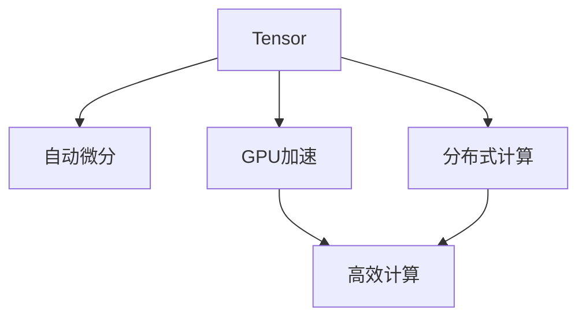

                 

# Tensor计算：深度学习的数学基石

## 1. 背景介绍

### 1.1 问题由来

在深度学习领域，计算是核心和基础。无论是模型构建、特征提取，还是优化训练、推理部署，都离不开高效的计算支持。而Tensor计算，作为深度学习中不可或缺的一环，其重要性不言而喻。Tensor计算不仅影响模型的训练速度，还直接关系到计算资源的利用效率和系统性能的稳定性。因此，深入理解Tensor计算的原理和应用，是深度学习开发者必须掌握的关键技能。

### 1.2 问题核心关键点

Tensor计算的核心在于如何高效地处理多维数组（Tensor），通过并行计算、分布式计算等技术手段，在保持计算准确性的同时，提高计算效率。在深度学习中，Tensor通常用于存储和计算模型参数、输入数据等，通过一系列高效的计算操作，使得模型的训练和推理过程更加流畅、高效。

目前，Tensor计算已经成为深度学习研究的热点领域，包括TensorFlow、PyTorch、MXNet等众多框架，都在不断提升Tensor计算的性能和效率。然而，由于Tensor计算涉及大量数学原理和算法细节，对于初学者来说，这一领域仍然存在一定的门槛。本文旨在深入浅出地讲解Tensor计算的原理和应用，帮助读者构建扎实的计算基础，为深度学习模型的构建和优化提供有力支持。

## 2. 核心概念与联系

### 2.1 核心概念概述

为更好地理解Tensor计算，本节将介绍几个密切相关的核心概念：

- Tensor：多维数组，是深度学习中最重要的数据结构之一，用于存储和传递计算数据。
- 自动微分：通过反向传播算法，自动计算Tensor的梯度，支持模型的自动求导和优化。
- GPU加速：利用图形处理器（GPU）的高并行计算能力，加速Tensor计算过程，提高计算效率。
- 分布式计算：通过多台计算机的协同计算，进一步提高Tensor计算的并行度和资源利用率。

这些核心概念之间的逻辑关系可以通过以下Mermaid流程图来展示：



这个流程图展示了几类Tensor计算的核心技术：

1. Tensor是计算的基础数据结构。
2. 自动微分使得Tensor的计算过程可以自动求导，支持模型优化。
3. GPU加速和分布式计算提高Tensor计算的并行度和效率。

这些技术共同构成了Tensor计算的核心框架，使得深度学习模型的训练和推理过程变得更加高效和稳定。通过理解这些核心概念，我们可以更好地把握Tensor计算的工作原理和优化方向。

## 3. 核心算法原理 & 具体操作步骤

### 3.1 算法原理概述

Tensor计算的核心算法包括自动微分和并行计算。自动微分通过反向传播算法，自动计算Tensor的梯度，从而支持模型的优化。而并行计算则通过多维数组的并行操作，显著提升Tensor计算的速度和效率。

在深度学习中，Tensor通常用于存储和计算模型参数、输入数据等。模型通过前向传播计算损失函数，再通过反向传播计算参数梯度，最终使用优化算法更新模型参数。这一过程可以通过Tensor计算高效实现，从而加快模型训练和推理的速度。

### 3.2 算法步骤详解

Tensor计算的基本步骤如下：

**Step 1: 定义Tensor和计算图**

- 定义输入数据 `x` 和模型参数 `θ`，作为Tensor数据。
- 使用TensorFlow等框架，构建计算图，将前向传播和反向传播的计算过程表示为图结构。

**Step 2: 前向传播和反向传播**

- 前向传播：根据计算图，将输入数据 `x` 和模型参数 `θ` 作为输入，计算出模型输出 `y`。
- 反向传播：根据损失函数 `L(y, target)`，自动计算 `y` 对 `θ` 的梯度，并更新模型参数。

**Step 3: 优化和训练**

- 选择合适的优化算法，如梯度下降、Adam等，设置学习率、批大小等超参数。
- 使用优化算法和反向传播计算，更新模型参数，优化模型性能。

**Step 4: 模型推理**

- 将训练好的模型参数加载到Tensor计算图中。
- 使用前向传播计算输入数据的模型输出，得到预测结果。

### 3.3 算法优缺点

Tensor计算的主要优点包括：

- 高效计算：Tensor的并行计算能力可以大幅提升计算速度。
- 自动计算梯度：自动微分技术可以简化模型优化过程。
- 灵活性高：Tensor计算支持多框架、多设备、多算法，灵活性高。

但Tensor计算也存在一些缺点：

- 内存占用大：Tensor计算涉及大量内存，尤其在大规模模型上，内存占用较大。
- 对设备要求高：Tensor计算对CPU、GPU等设备性能要求高。
- 学习成本高：Tensor计算涉及复杂的数学和算法知识，对初学者来说有一定的门槛。

### 3.4 算法应用领域

Tensor计算在深度学习中得到了广泛应用，覆盖了从模型构建、特征提取，到优化训练、推理部署等多个环节。具体而言：

- 模型构建：定义Tensor计算图，设置模型参数，完成模型定义。
- 特征提取：通过Tensor操作，对输入数据进行预处理和特征提取。
- 模型优化：使用Tensor计算进行梯度计算和模型参数更新。
- 模型推理：使用Tensor计算进行前向传播，得到模型预测结果。

此外，Tensor计算还被广泛应用于机器学习、信号处理、科学计算等多个领域，为大规模数据处理和复杂模型训练提供了强大的支持。随着深度学习技术的不断进步，Tensor计算的应用范围将进一步扩大。

## 4. 数学模型和公式 & 详细讲解 & 举例说明

### 4.1 数学模型构建

在Tensor计算中，模型的构建通常采用张量计算图的形式，其中输入数据 `x` 和模型参数 `θ` 作为Tensor，通过计算图进行前向传播和反向传播计算。

以一个简单的线性回归模型为例，定义模型为：

$$ y = Wx + b $$

其中 `W` 为模型权重，`b` 为偏置，`x` 为输入数据，`y` 为模型输出。

在Tensor计算中，可以使用以下Python代码定义该模型：

```python
import tensorflow as tf

# 定义输入和输出占位符
x = tf.placeholder(tf.float32, [None, n_features])
y = tf.placeholder(tf.float32, [None])

# 定义模型参数
W = tf.Variable(tf.random_normal([n_features, 1]))
b = tf.Variable(tf.zeros([1]))

# 定义模型计算过程
y_pred = tf.matmul(x, W) + b
```

这里，`tf.placeholder` 用于定义占位符，`tf.Variable` 用于定义可训练参数 `W` 和 `b`，`tf.matmul` 用于计算前向传播过程。

### 4.2 公式推导过程

在上述线性回归模型中，前向传播的计算过程为：

$$ y = Wx + b $$

反向传播的计算过程为：

$$ \frac{\partial L(y, target)}{\partial W} = \frac{\partial L(y, target)}{\partial y} \cdot \frac{\partial y}{\partial W} = (y - target) \cdot x $$

$$ \frac{\partial L(y, target)}{\partial b} = \frac{\partial L(y, target)}{\partial y} \cdot \frac{\partial y}{\partial b} = (y - target) $$

其中，`L(y, target)` 为损失函数，`target` 为真实标签。

通过反向传播计算，可以得到 `W` 和 `b` 的梯度，进而使用梯度下降等优化算法更新模型参数。

### 4.3 案例分析与讲解

以下是一个简单的Tensor计算案例，用于演示Tensor计算的基本流程：

```python
import tensorflow as tf

# 定义输入和输出占位符
x = tf.placeholder(tf.float32, [None, 3])
y = tf.placeholder(tf.float32, [None])

# 定义模型参数
W = tf.Variable(tf.random_normal([3, 1]))
b = tf.Variable(tf.zeros([1]))

# 定义模型计算过程
y_pred = tf.matmul(x, W) + b

# 定义损失函数
loss = tf.reduce_mean(tf.square(y_pred - y))

# 定义优化算法
optimizer = tf.train.GradientDescentOptimizer(learning_rate=0.01)
train_op = optimizer.minimize(loss)

# 创建会话
with tf.Session() as sess:
    # 初始化变量
    sess.run(tf.global_variables_initializer())
    
    # 训练模型
    for i in range(1000):
        # 获取一批数据
        batch_x, batch_y = ...
        
        # 训练模型
        _, loss_val = sess.run([train_op, loss], feed_dict={x: batch_x, y: batch_y})
        
        # 打印损失
        if i % 100 == 0:
            print("Epoch", i, "loss:", loss_val)
```

在这个例子中，我们定义了一个包含3个特征的输入 `x` 和1个输出的模型。通过反向传播计算，得到了模型参数 `W` 和 `b` 的梯度，并使用梯度下降优化算法进行了训练。

## 5. 项目实践：代码实例和详细解释说明

### 5.1 开发环境搭建

在进行Tensor计算实践前，我们需要准备好开发环境。以下是使用Python进行TensorFlow开发的环境配置流程：

1. 安装Anaconda：从官网下载并安装Anaconda，用于创建独立的Python环境。

2. 创建并激活虚拟环境：
```bash
conda create -n tf-env python=3.8 
conda activate tf-env
```

3. 安装TensorFlow：
```bash
pip install tensorflow
```

4. 安装各类工具包：
```bash
pip install numpy pandas scikit-learn matplotlib tqdm jupyter notebook ipython
```

完成上述步骤后，即可在`tf-env`环境中开始Tensor计算实践。

### 5.2 源代码详细实现

下面我们以一个简单的线性回归模型为例，给出使用TensorFlow进行Tensor计算的PyTorch代码实现。

首先，定义Tensor计算图：

```python
import tensorflow as tf

# 定义输入和输出占位符
x = tf.placeholder(tf.float32, [None, 3])
y = tf.placeholder(tf.float32, [None])

# 定义模型参数
W = tf.Variable(tf.random_normal([3, 1]))
b = tf.Variable(tf.zeros([1]))

# 定义模型计算过程
y_pred = tf.matmul(x, W) + b

# 定义损失函数
loss = tf.reduce_mean(tf.square(y_pred - y))

# 定义优化算法
optimizer = tf.train.GradientDescentOptimizer(learning_rate=0.01)
train_op = optimizer.minimize(loss)
```

然后，执行Tensor计算过程：

```python
import numpy as np

# 定义数据
x_train = np.random.randn(100, 3)
y_train = np.random.randn(100, 1)

# 创建会话
with tf.Session() as sess:
    # 初始化变量
    sess.run(tf.global_variables_initializer())
    
    # 训练模型
    for i in range(1000):
        # 获取一批数据
        batch_x, batch_y = x_train[i:i+32], y_train[i:i+32]
        
        # 训练模型
        _, loss_val = sess.run([train_op, loss], feed_dict={x: batch_x, y: batch_y})
        
        # 打印损失
        if i % 100 == 0:
            print("Epoch", i, "loss:", loss_val)
```

这里，我们使用TensorFlow定义了线性回归模型的Tensor计算图，通过前向传播计算模型输出，并使用梯度下降优化算法进行模型训练。

### 5.3 代码解读与分析

让我们再详细解读一下关键代码的实现细节：

**Tensor计算图定义**：
- `tf.placeholder` 用于定义占位符，`tf.Variable` 用于定义可训练参数。
- `tf.matmul` 用于计算矩阵乘法，`tf.reduce_mean` 用于计算均值。
- `tf.train.GradientDescentOptimizer` 用于定义优化算法，`optimizer.minimize` 用于最小化损失函数。

**数据定义**：
- 使用NumPy生成随机数据 `x_train` 和 `y_train`，作为模型的输入和输出。
- 在训练过程中，使用 `x_train[i:i+32]` 和 `y_train[i:i+32]` 获取一批数据，进行模型的训练和评估。

**会话执行**：
- 使用 `tf.Session` 创建会话，并调用 `sess.run` 执行计算图中的操作。
- 在每轮训练中，使用 `feed_dict` 将数据传入占位符 `x` 和 `y`，进行模型训练和损失计算。
- 在每轮训练结束时，输出当前轮数的损失值，以便跟踪模型训练的进度。

可以看到，Tensor计算的代码实现相对简洁，通过TensorFlow等框架，可以轻松定义计算图，进行前向传播和反向传播计算，从而高效地实现深度学习模型的训练和推理。

## 6. 实际应用场景

### 6.1 智能推荐系统

智能推荐系统是Tensor计算的重要应用场景之一。传统推荐系统通常采用基于协同过滤、内容推荐等方法，但这些方法在处理大规模数据和高维特征时，计算复杂度较高，难以实时响应用户请求。而Tensor计算通过高效的多维数组计算和分布式计算，可以实现大规模数据的实时处理和高效推荐。

在实践中，可以收集用户行为数据、物品特征数据等，构建推荐模型，并通过Tensor计算进行模型训练和推理。通过Tensor计算的并行计算和分布式计算能力，可以快速处理大规模数据，生成个性化的推荐结果。

### 6.2 医疗影像分析

医疗影像分析是另一个Tensor计算的重要应用场景。传统医疗影像分析通常采用基于规则的方法，但这些方法在处理复杂影像时，计算复杂度较高，难以处理高分辨率和大量影像数据。而Tensor计算通过高效的多维数组计算和卷积计算，可以实现快速准确的影像分析。

在实践中，可以使用Tensor计算对医疗影像进行卷积、池化等操作，提取影像特征，并通过Tensor计算进行特征分析。通过Tensor计算的并行计算和分布式计算能力，可以快速处理高分辨率和大量影像数据，生成准确的医疗诊断结果。

### 6.3 自动驾驶

自动驾驶是Tensor计算在智能交通领域的重要应用场景。自动驾驶系统通常需要实时处理大量的传感器数据和环境信息，以实现高精度的定位和决策。而Tensor计算通过高效的多维数组计算和并行计算，可以实现大规模数据的实时处理和高效决策。

在实践中，可以使用Tensor计算对传感器数据进行多维数组计算，提取环境信息，并通过Tensor计算进行实时处理和决策。通过Tensor计算的并行计算和分布式计算能力，可以实时处理大规模传感器数据，生成高精度的驾驶决策。

## 7. 工具和资源推荐

### 7.1 学习资源推荐

为了帮助开发者系统掌握Tensor计算的理论基础和实践技巧，这里推荐一些优质的学习资源：

1. 《TensorFlow官方文档》系列博文：由TensorFlow官方团队撰写，深入浅出地介绍了TensorFlow的各个模块和功能，适合初学者和进阶开发者阅读。

2. 《PyTorch官方文档》系列博文：由PyTorch官方团队撰写，介绍了PyTorch的各个模块和功能，适合Tensor计算初学者和进阶开发者阅读。

3. 《深度学习中的Tensor计算》课程：斯坦福大学开设的深度学习课程，涵盖Tensor计算的各个方面，从原理到实践，适合深度学习初学者和进阶开发者学习。

4. 《Tensor计算实战》书籍：详细介绍Tensor计算的各个模块和功能，通过大量实际案例，帮助读者掌握Tensor计算的实践技巧。

5. TensorFlow官方代码库：GitHub上的TensorFlow代码库，包含大量Tensor计算的样例代码和模型，适合读者深入学习和实践。

通过对这些资源的学习实践，相信你一定能够快速掌握Tensor计算的精髓，并用于解决实际的深度学习问题。

### 7.2 开发工具推荐

高效的开发离不开优秀的工具支持。以下是几款用于Tensor计算开发的常用工具：

1. TensorFlow：由Google主导开发的开源深度学习框架，生产部署方便，适合大规模工程应用。

2. PyTorch：基于Python的开源深度学习框架，灵活度较高，适合研究和原型开发。

3. MXNet：由Apache基金会开发的深度学习框架，支持多种编程语言和分布式计算，适合生产环境应用。

4. Keras：基于TensorFlow等框架的高层API，提供简单易用的接口，适合快速开发和原型测试。

5. Caffe：由Berkeley团队开发的深度学习框架，适合图像识别和计算机视觉应用。

6. JAX：基于NumPy的高性能计算库，支持自动微分和分布式计算，适合研究和高性能计算。

合理利用这些工具，可以显著提升Tensor计算的开发效率，加快创新迭代的步伐。

### 7.3 相关论文推荐

Tensor计算的发展源于学界的持续研究。以下是几篇奠基性的相关论文，推荐阅读：

1. A Framework for Distributed Deep Learning: TensorFlow：提出TensorFlow框架，支持高效的分布式计算和模型训练。

2. Efficient estimation of auto-regressive and other integrable nonlinear dynamical systems：介绍Tensor计算在非线性系统中的高效计算方法。

3. TensorFlow: A system for large-scale machine learning：介绍TensorFlow框架的设计理念和实现原理，适合理解Tensor计算的核心思想。

4. Theano: A Python library for fast numerical computation using GPUs and CPUs：介绍Theano库，支持高效的Tensor计算。

5. A scalable system for automated machine learning：介绍AutoML系统，支持高效的Tensor计算和模型优化。

这些论文代表了Tensor计算的发展脉络。通过学习这些前沿成果，可以帮助研究者把握学科前进方向，激发更多的创新灵感。

## 8. 总结：未来发展趋势与挑战

### 8.1 总结

本文对Tensor计算的原理和应用进行了全面系统的介绍。首先阐述了Tensor计算在深度学习中的重要性，明确了Tensor计算在提高模型训练速度、优化资源利用效率等方面的独特价值。其次，从原理到实践，详细讲解了Tensor计算的数学原理和关键步骤，给出了Tensor计算任务开发的完整代码实例。同时，本文还广泛探讨了Tensor计算在智能推荐、医疗影像分析、自动驾驶等多个行业领域的应用前景，展示了Tensor计算的巨大潜力。此外，本文精选了Tensor计算的相关学习资源，力求为读者提供全方位的技术指引。

通过本文的系统梳理，可以看到，Tensor计算已经成为深度学习研究的热点领域，极大地提升了模型的训练速度和计算效率，使得深度学习模型的开发和应用更加高效和稳定。未来，伴随Tensor计算技术的不断演进，深度学习模型的构建和优化必将变得更加灵活和高效。

### 8.2 未来发展趋势

展望未来，Tensor计算将呈现以下几个发展趋势：

1. 硬件加速：随着AI芯片、FPGA等硬件加速技术的成熟，Tensor计算的并行计算能力将进一步提升，推动深度学习模型的训练和推理效率。

2. 分布式计算：随着分布式计算技术的不断进步，Tensor计算的分布式计算能力将进一步增强，支持更大规模模型的训练和推理。

3. 软件优化：随着深度学习框架的不断优化，Tensor计算的代码执行效率将进一步提升，降低模型的计算成本。

4. 动态计算图：随着动态计算图技术的发展，Tensor计算的灵活性和可扩展性将进一步增强，支持更多样化的计算模型。

5. 异构计算：随着异构计算技术的发展，Tensor计算将支持更多样的计算平台，如CPU、GPU、FPGA等，实现更高效的计算资源利用。

6. 软硬件协同：随着软硬件协同技术的不断进步，Tensor计算将支持更高效的数据处理和计算，提高计算效率和资源利用率。

以上趋势凸显了Tensor计算技术的广阔前景。这些方向的探索发展，必将进一步提升深度学习模型的性能和应用范围，为深度学习技术在更多领域的应用提供有力支持。

### 8.3 面临的挑战

尽管Tensor计算技术已经取得了显著成果，但在迈向更加智能化、普适化应用的过程中，它仍面临着诸多挑战：

1. 内存管理：Tensor计算涉及大量内存，尤其在大规模模型上，内存占用较大，如何优化内存管理，减少内存使用，是一个重要挑战。

2. 设备兼容性：Tensor计算对硬件设备性能要求高，如何兼容多种设备和平台，实现高效计算，是一个重要挑战。

3. 计算效率：Tensor计算涉及大量计算操作，如何提高计算效率，降低计算成本，是一个重要挑战。

4. 软件复杂性：Tensor计算涉及复杂的软件实现，如何降低软件复杂性，提高开发效率，是一个重要挑战。

5. 模型鲁棒性：Tensor计算的模型训练和推理过程容易受到数据扰动的影响，如何提高模型的鲁棒性，是一个重要挑战。

6. 安全性和隐私：Tensor计算涉及大量数据处理和计算，如何保护数据隐私和模型安全，是一个重要挑战。

7. 可解释性：Tensor计算的模型往往缺乏可解释性，如何赋予模型更强的可解释性，是一个重要挑战。

这些挑战需要研究者不断探索和解决，才能推动Tensor计算技术的不断进步，为深度学习模型的构建和优化提供更加坚实的基础。

### 8.4 研究展望

面对Tensor计算面临的种种挑战，未来的研究需要在以下几个方面寻求新的突破：

1. 硬件加速技术：探索新型AI芯片、FPGA等硬件加速技术，提升Tensor计算的并行计算能力和资源利用效率。

2. 软件优化技术：优化Tensor计算的代码执行效率，降低计算成本，提高计算效率和资源利用率。

3. 动态计算图技术：探索动态计算图技术，提高Tensor计算的灵活性和可扩展性，支持更多样化的计算模型。

4. 异构计算技术：探索异构计算技术，支持多种计算平台的协同计算，提高计算效率和资源利用率。

5. 模型鲁棒性技术：研究模型鲁棒性技术，提高Tensor计算的模型鲁棒性，防止模型过拟合和灾难性遗忘。

6. 安全性和隐私保护：研究数据隐私和安全保护技术，确保Tensor计算的模型安全和数据隐私。

7. 可解释性技术：研究可解释性技术，赋予Tensor计算的模型更强的可解释性，增强模型的可信度和可靠性。

这些研究方向的研究进展，将进一步推动Tensor计算技术的进步，为深度学习模型的构建和优化提供更加坚实的技术基础。

## 9. 附录：常见问题与解答

**Q1：Tensor计算是否只适用于深度学习模型？**

A: Tensor计算主要用于深度学习模型的构建和优化，但其核心思想——多维数组计算和并行计算，也可以用于其他计算密集型领域，如科学计算、信号处理等。

**Q2：Tensor计算是否只适用于GPU和TPU等高性能设备？**

A: Tensor计算支持多种设备，包括CPU、GPU、TPU等，但不同的设备性能和资源利用率不同。通常情况下，GPU和TPU等高性能设备能够提供更高的计算效率，但对于部分低计算量的任务，CPU也可以满足需求。

**Q3：Tensor计算是否只适用于大规模数据？**

A: Tensor计算适合处理大规模数据，但并不只适用于大规模数据。对于小规模数据，Tensor计算仍然可以通过分布式计算等方式，提供高效的计算支持。

**Q4：Tensor计算是否只适用于静态计算图？**

A: Tensor计算支持静态计算图和动态计算图两种方式。静态计算图通常用于模型构建和优化，而动态计算图则用于更灵活的模型开发和应用。

**Q5：Tensor计算是否只适用于机器学习领域？**

A: Tensor计算不仅适用于机器学习领域，也广泛应用于深度学习、自然语言处理、计算机视觉、信号处理等多个领域。

通过本文的系统梳理，可以看到，Tensor计算已经成为深度学习研究的热点领域，极大地提升了模型的训练速度和计算效率，使得深度学习模型的开发和应用更加高效和稳定。未来，伴随Tensor计算技术的不断演进，深度学习模型的构建和优化必将变得更加灵活和高效。相信随着学界和产业界的共同努力，Tensor计算技术必将进一步推动深度学习的发展，为人工智能技术的广泛应用提供更加坚实的技术基础。

