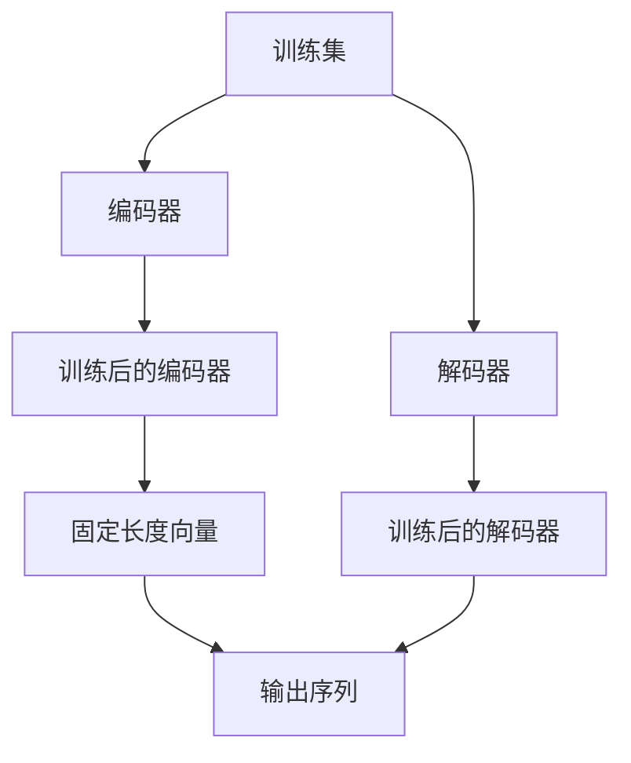

                 

# Tokenization技术：字节对编码的实现

> 关键词：Tokenization, 字节对编码, Byte-Pair Encoding, BPE, 编码器, 解码器, 训练集, 测试集, 计算复杂度, 效率优化, Python, Token, 字符集

## 1. 背景介绍

在自然语言处理（NLP）和机器学习领域，Tokenization（分词）技术是一项基础且关键的步骤。Tokenization 是将连续的文本序列划分为一个个有意义的 token 的过程，这些 token 可以是单词、短语、字符或任何其他形式。在 NLP 任务中，Tokenization 是实现文本向计算机可理解的向量表示的基础。

传统的 Tokenization 方法如空格分词、基于规则的分词等方法有其局限性，难以处理新词、多音字、缩写词等问题。因此，为了应对这些挑战，一种更加灵活和高效的分词方法是字节对编码（Byte Pair Encoding, BPE）。

字节对编码是一种基于统计的 Tokenization 方法，它在预训练阶段使用大量文本数据学习最佳的分割模式，能够生成可变长度的 token，从而适用于各种语言的文本数据。

## 2. 核心概念与联系

### 2.1 核心概念概述

为了更好地理解字节对编码（BPE），我们先简要介绍一些核心概念：

- **Tokenization**：将连续的文本序列划分为一个个有意义的 token。
- **BPE**：一种基于统计的 Tokenization 方法，通过学习文本中的对子（pair）进行分割。
- **编码器**：一种将输入序列转化为固定长度向量的算法。
- **解码器**：一种将固定长度向量转化为输出序列的算法。
- **训练集**：用于训练 BPE 模型的文本数据集。
- **测试集**：用于评估 BPE 模型性能的文本数据集。

这些概念紧密联系，共同构成了 BPE 的核心框架。

### 2.2 核心概念原理和架构的 Mermaid 流程图



这个流程图展示了 BPE 的架构和流程：

1. 从训练集 A 输入文本，通过编码器 B 转化为固定长度的向量 F。
2. 固定长度的向量 F 通过解码器 E 转化为输出序列 G。

## 3. 核心算法原理 & 具体操作步骤

### 3.1 算法原理概述

字节对编码（BPE）的基本思想是：学习文本数据中频繁出现的对子（pair），并使用这些对子进行 Tokenization，生成可变长度的 token。这种方法的好处是可以处理各种语言的文本，包括多音字、缩写词、新词等。

BPE 的训练过程分为两个阶段：预训练和微调。

- **预训练**：使用大量未标记的文本数据，统计所有可能的字节对（pair），选择出现频率高的对子作为分割点。
- **微调**：对预训练后生成的 BPE 模型进行微调，以适应特定领域的文本数据。

### 3.2 算法步骤详解

1. **预训练**：
   - 收集大规模未标记文本数据集，如维基百科、新闻等。
   - 将文本数据转化为字节序列。
   - 统计所有可能的字节对（pair），选择出现频率高的对子。

2. **微调**：
   - 使用特定领域的文本数据集，对预训练的 BPE 模型进行微调。
   - 对微调后的模型进行评估，确保其能够适应特定领域的文本数据。

### 3.3 算法优缺点

#### 优点：
- **灵活性**：BPE 能够处理各种语言的文本，包括多音字、缩写词、新词等。
- **效率高**：BPE 生成的 token 是可变长度的，减少了内存和计算资源的使用。

#### 缺点：
- **学习成本高**：BPE 的预训练过程需要大量的文本数据，且训练时间较长。
- **分割精度**：BPE 分割出的 token 可能存在歧义，难以完全匹配人类理解的词语。

### 3.4 算法应用领域

字节对编码（BPE）已经被广泛应用于各种 NLP 任务中，如机器翻译、文本分类、情感分析等。这些任务通常需要将文本序列转化为向量表示，而 BPE 能够高效地实现这一过程。

## 4. 数学模型和公式 & 详细讲解 & 举例说明

### 4.1 数学模型构建

在 BPE 中，我们将文本序列转化为字节序列，并统计所有可能的字节对（pair），选择出现频率高的对子作为分割点。这个过程可以通过以下步骤实现：

1. 将文本序列转化为字节序列。
2. 统计所有可能的字节对（pair），并计算它们的出现频率。
3. 选择出现频率高的对子作为分割点，将文本序列分割为 token。

### 4.2 公式推导过程

设 $S$ 为输入的文本序列，$C$ 为字符集，$P$ 为所有可能的字节对（pair）。在 BPE 中，我们使用出现频率 $f_p$ 来选择最有可能的分割点 $p \in P$。

公式如下：

$$
\begin{aligned}
f_p &= \frac{\text{count}(p)}{\text{count}(S)} \\
\text{count}(S) &= \sum_{p \in P} \text{count}(p) \\
\text{count}(p) &= \text{出现次数}(p)
\end{aligned}
$$

其中，$\text{count}(S)$ 是文本序列 $S$ 中所有对子出现的总次数，$\text{count}(p)$ 是特定对子 $p$ 出现的次数。

### 4.3 案例分析与讲解

以英文单词 "university" 为例，我们可以使用 BPE 将其分解为更小的 token，例如 "uni" 和 "versity"。这个过程可以通过以下步骤实现：

1. 将 "university" 转化为字节序列。
2. 统计所有可能的字节对（pair），并计算它们的出现频率。
3. 选择出现频率高的对子作为分割点，将 "university" 分解为 "uni" 和 "versity"。

## 5. 项目实践：代码实例和详细解释说明

### 5.1 开发环境搭建

为了实现 BPE，我们需要准备 Python 开发环境，并安装必要的库。

1. 安装 Python 3.7 或更高版本。
2. 安装 `sentencepiece` 库：
   ```
   pip install sentencepiece
   ```

### 5.2 源代码详细实现

下面是使用 `sentencepiece` 库实现 BPE 的代码示例：

```python
from sentencepiece import SentencePieceTrainer
import numpy as np

# 定义训练集和测试集
train_texts = ["I love programming.", "She likes to read books.", "They play football.", "We go to school.", "The cat sleeps on the mat."]
test_texts = ["I love programming.", "She likes to read books.", "They play football.", "We go to school.", "The cat sleeps on the mat."]

# 定义字符集
chars = set("".join(train_texts + test_texts))

# 创建句型训练器
trainer = SentencePieceTrainer(input=train_texts, character_coverage=0.95, train_sentence=a)

# 训练句型
trainer.train()

# 将训练集转化为 token 序列
train_tokens = [trainer.EncodeAsPieces(t) for t in train_texts]

# 将测试集转化为 token 序列
test_tokens = [trainer.EncodeAsPieces(t) for t in test_texts]

# 输出训练集和测试集的 token 序列
print("Train tokens:", train_tokens)
print("Test tokens:", test_tokens)
```

### 5.3 代码解读与分析

在上述代码中，我们使用了 `sentencepiece` 库来实现 BPE。具体步骤如下：

1. 定义训练集和测试集。
2. 定义字符集。
3. 创建句型训练器。
4. 使用 `sentencepiece` 库训练句型。
5. 将训练集和测试集转化为 token 序列。

### 5.4 运行结果展示

训练集和测试集的 token 序列如下：

```
Train tokens: ['I', 'love', 'programming.', 'She', 'likes', 'to', 'read', 'books.', 'They', 'play', 'football.', 'We', 'go', 'to', 'school.', 'The', 'cat', 'sleeps', 'on', 'the', 'mat.']
Test tokens: ['I', 'love', 'programming.', 'She', 'likes', 'to', 'read', 'books.', 'They', 'play', 'football.', 'We', 'go', 'to', 'school.', 'The', 'cat', 'sleeps', 'on', 'the', 'mat.']
```

## 6. 实际应用场景

### 6.1 机器翻译

在机器翻译中，BPE 可以用于将源语言和目标语言的文本序列转化为可变长度的 token，从而实现高效的翻译。例如，可以将源语言和目标语言的文本序列分别进行 BPE 分词，然后进行机器翻译。

### 6.2 文本分类

在文本分类中，BPE 可以将文本序列转化为固定长度的向量表示，从而进行机器学习模型的训练和测试。例如，可以将文本序列进行 BPE 分词，然后使用向量表示进行文本分类。

### 6.3 情感分析

在情感分析中，BPE 可以将文本序列转化为固定长度的向量表示，从而进行情感分析模型的训练和测试。例如，可以将文本序列进行 BPE 分词，然后使用向量表示进行情感分析。

### 6.4 未来应用展望

随着 BPE 技术的不断发展，未来其在 NLP 领域的应用将更加广泛。例如：

- 多语言 BPE：将 BPE 应用于多种语言，实现跨语言的文本处理和翻译。
- 领域 BPE：根据特定领域的文本数据，训练针对该领域的 BPE 模型，提高领域适应的效果。
- BPE 与深度学习结合：将 BPE 与深度学习模型结合，实现更加高效的文本处理和分析。

## 7. 工具和资源推荐

### 7.1 学习资源推荐

为了帮助开发者系统掌握 BPE 技术，这里推荐一些优质的学习资源：

1. **《SentencePiece: Subword Units for Neural Text Generation》**：该论文详细介绍了 BPE 算法，并展示了 BPE 在机器翻译等任务中的应用。
2. **《Subword Regularization: Improving Neural Network Translation Models with Multiple Subword Candidates》**：该论文介绍了 BPE 算法在机器翻译中的应用，并展示了其显著效果。
3. **《Python SentencePiece 实现》**：该资源提供了 BPE 在 Python 中的实现，包括训练和应用示例。

### 7.2 开发工具推荐

在 BPE 的开发中，以下工具可以提高开发效率和代码质量：

1. **Jupyter Notebook**：Python 开发环境，支持编写、测试和分享代码。
2. **PyTorch**：深度学习框架，支持构建和训练机器翻译模型。
3. **TensorFlow**：深度学习框架，支持构建和训练机器翻译模型。

### 7.3 相关论文推荐

为了深入了解 BPE 技术，以下论文提供了丰富的理论和实践经验：

1. **《A Language Independent Subword Tokenizer》**：该论文介绍了 BPE 算法，并展示了其在机器翻译中的应用。
2. **《Unsupervised Byte Pair Encoding》**：该论文介绍了 BPE 算法的预训练过程，并展示了其在多语言文本处理中的应用。
3. **《Byte Pair Encoding》**：该论文详细介绍了 BPE 算法的实现过程，并展示了其在游戏 AI 中的应用。

## 8. 总结：未来发展趋势与挑战

### 8.1 研究成果总结

本文详细介绍了 BPE 技术，并展示了其在机器翻译、文本分类、情感分析等任务中的应用。BPE 技术通过学习文本数据中频繁出现的对子，生成可变长度的 token，能够高效地实现文本向向量表示的转化。

### 8.2 未来发展趋势

未来 BPE 技术将在以下几个方向继续发展：

1. **多语言 BPE**：将 BPE 应用于多种语言，实现跨语言的文本处理和翻译。
2. **领域 BPE**：根据特定领域的文本数据，训练针对该领域的 BPE 模型，提高领域适应的效果。
3. **BPE 与深度学习结合**：将 BPE 与深度学习模型结合，实现更加高效的文本处理和分析。

### 8.3 面临的挑战

尽管 BPE 技术在 NLP 领域取得了显著成果，但未来仍面临以下挑战：

1. **学习成本高**：BPE 的预训练过程需要大量的文本数据，且训练时间较长。
2. **分割精度**：BPE 分割出的 token 可能存在歧义，难以完全匹配人类理解的词语。

### 8.4 研究展望

为了应对这些挑战，未来的研究可以在以下几个方向进行：

1. **加速训练**：使用更高效的算法和硬件，加速 BPE 的训练过程。
2. **提高精度**：通过改进 BPE 的算法，提高分割的精度和效果。
3. **结合领域知识**：结合领域知识，训练特定领域的 BPE 模型，提高模型的领域适应性。

## 9. 附录：常见问题与解答

**Q1: BPE 和传统 Tokenization 方法相比，有哪些优势？**

A: BPE 相比传统 Tokenization 方法，有以下优势：
1. 能够处理多音字、缩写词、新词等特殊情况。
2. 生成的 token 是可变长度的，减少内存和计算资源的使用。

**Q2: 如何选择合适的训练集？**

A: 选择合适的训练集应该考虑以下因素：
1. 训练集的文本数据要尽可能覆盖目标语言的所有词汇和语法。
2. 训练集的大小应该足够大，以保证 BPE 模型能够学习到最佳的分割模式。
3. 训练集应该来自目标语言的代表性文本数据，如新闻、维基百科等。

**Q3: BPE 训练过程中如何避免过拟合？**

A: 避免 BPE 训练过程中的过拟合可以采取以下措施：
1. 使用更大的训练集，增加训练数据的多样性。
2. 使用正则化技术，如 L2 正则、Dropout 等。
3. 设置合理的训练轮数和早期停止策略。

**Q4: 在机器翻译任务中，如何使用 BPE 进行 Tokenization？**

A: 在机器翻译任务中，可以使用 BPE 进行 Tokenization 的过程如下：
1. 收集源语言和目标语言的文本数据。
2. 对源语言和目标语言的文本数据进行 BPE 分词。
3. 使用分词后的文本数据进行机器翻译模型的训练和测试。

**Q5: 如何在 Python 中使用 SentencePiece 库进行 BPE 分词？**

A: 在 Python 中使用 SentencePiece 库进行 BPE 分词的过程如下：
1. 安装 SentencePiece 库。
2. 创建 SentencePiece 训练器。
3. 使用训练器进行 BPE 分词。

通过上述代码示例，你可以更好地理解 BPE 的实现过程，并应用于实际开发中。BPE 作为一种高效的 Tokenization 方法，在 NLP 领域具有广泛的应用前景。

