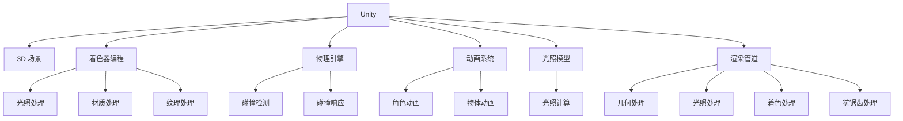

                 

# Unity 游戏开发引擎：创建 3D 游戏

## 1. 背景介绍

Unity作为最流行的游戏开发引擎之一，被广泛应用于各种类型的游戏开发，包括2D和3D游戏。特别是3D游戏开发，Unity凭借其强大的图形渲染引擎和丰富的插件生态系统，成为众多游戏开发者的首选工具。本文将深入探讨使用Unity创建3D游戏的核心概念、关键算法、具体操作步骤和实际应用，并展望未来发展趋势和面临的挑战。

## 2. 核心概念与联系

### 2.1 核心概念概述

要理解Unity创建3D游戏的流程，首先需要了解一些核心概念：

- **Unity**：一款广泛使用的游戏引擎，支持2D和3D游戏的开发。
- **3D游戏**：利用3D图形技术渲染的虚拟世界，玩家可以在其中进行探索、互动和挑战。
- **着色器编程**：控制3D模型外观的编程技术，包括光照、材质和纹理处理。
- **物理引擎**：模拟游戏世界中物体间交互的算法，如碰撞检测和响应。
- **动画系统**：处理角色和物体运动、变形和交互的技术。
- **光照模型**：定义光照与物体表面相互作用的方式，影响3D场景的真实感。
- **渲染管道**：从几何模型到最终图像的一系列处理步骤，包括几何处理、光照处理、着色处理和抗锯齿处理。

### 2.2 核心概念原理和架构的 Mermaid 流程图



### 2.3 核心概念联系

上述概念之间存在紧密的联系，它们共同构成了Unity创建3D游戏的核心架构。着色器编程和光照模型控制着物体的外观，物理引擎确保物体间的交互符合物理规律，动画系统让角色和物体能够流畅地运动和变形，渲染管道则负责将3D场景转化为最终图像。

## 3. 核心算法原理 & 具体操作步骤

### 3.1 算法原理概述

Unity创建3D游戏的核心算法包括几何处理、光照处理、着色处理和抗锯齿处理。这些算法共同作用，使得3D游戏场景显得逼真且流畅。

- **几何处理**：将3D模型加载到内存中，并将其转换为多边形网格。
- **光照处理**：计算光照与物体表面相互作用的结果，为每个多边形计算颜色值。
- **着色处理**：根据材质和纹理对多边形进行颜色处理，使其看起来更加真实。
- **抗锯齿处理**：消除锯齿效果，使3D场景更加清晰。

### 3.2 算法步骤详解

创建3D游戏的具体操作步骤如下：

1. **准备开发环境**：安装Unity编辑器，创建新项目。
2. **设计3D场景**：设计游戏场景，包括3D模型、灯光和纹理。
3. **导入3D模型**：将3D模型导入Unity编辑器中，设置模型属性。
4. **创建光照场景**：配置场景中的灯光，设置光源属性。
5. **着色和纹理处理**：为3D模型添加材质和纹理，设置着色器属性。
6. **动画处理**：为角色和物体添加动画，设置动画属性。
7. **物理处理**：添加物理组件，设置物理属性，如碰撞检测和响应。
8. **渲染处理**：调整渲染设置，如抗锯齿、阴影和反射。

### 3.3 算法优缺点

Unity创建3D游戏的算法具有以下优点：

- **灵活性**：支持各种类型的3D模型和动画，可以通过插件扩展功能。
- **性能优化**：支持异步加载和预加载，减少资源占用，提高渲染性能。
- **跨平台支持**：支持Windows、macOS、Linux和多种移动平台，方便跨平台开发。

同时，也存在一些缺点：

- **学习曲线陡峭**：初学者需要花费一定时间学习Unity的API和工具。
- **资源密集型**：创建高质量3D游戏需要高性能硬件支持，如显卡和处理器。
- **性能调试困难**：复杂的渲染和物理计算可能造成性能瓶颈，调试难度大。

### 3.4 算法应用领域

Unity的3D游戏创建技术广泛应用于以下领域：

- **游戏开发**：各种类型的游戏，包括动作、角色扮演、策略和沙盒游戏。
- **虚拟现实**：创建沉浸式的虚拟现实体验，支持VR和AR应用。
- **电影和动画**：支持电影和动画的制作，提供逼真的渲染效果。
- **建筑和设计**：用于创建复杂的建筑和设计模型，支持3D打印和可视化。
- **教育和培训**：支持教育和培训场景的创建，如虚拟教室和训练模拟器。

## 4. 数学模型和公式 & 详细讲解 & 举例说明

### 4.1 数学模型构建

Unity创建3D游戏涉及的数学模型包括：

- **线性代数**：用于处理3D模型和变换矩阵。
- **三角学**：用于计算3D模型的顶点位置和法向量。
- **光照模型**：如Phong模型和Blinn-Phong模型，计算光照与物体表面相互作用的结果。
- **纹理映射**：使用纹理坐标将纹理映射到3D模型表面。

### 4.2 公式推导过程

以Phong光照模型为例，其公式如下：

$$
I(\vec{p}, \vec{v}, \vec{l}) = \rho(\vec{p}) f_{\vec{l}, \vec{v}}(\vec{p}) \cdot \vec{l} + \rho(\vec{p}) k_{d} \cdot \vec{v} \cdot \vec{n} + \rho(\vec{p}) k_{s} \cdot \vec{v} \cdot (\vec{r} \cdot \vec{n})^k
$$

其中，$I$为光照强度，$\rho$为表面反射系数，$f_{\vec{l}, \vec{v}}$为镜面反射系数，$k_{d}$为环境光反射系数，$\vec{l}$为入射光方向，$\vec{v}$为视角方向，$\vec{n}$为表面法向量，$\vec{r}$为镜面反射光方向，$k$为镜面指数。

### 4.3 案例分析与讲解

以一个简单的3D场景为例，探讨其渲染过程：

1. **几何处理**：将3D模型加载到Unity中，并将其转换为三角形网格。
2. **光照处理**：添加一个点光源，设置其位置和颜色。
3. **着色处理**：为3D模型添加材质和纹理，设置着色器属性。
4. **渲染处理**：调整渲染设置，开启抗锯齿和阴影。

最终，Unity将渲染出逼真的3D场景，玩家可以在其中进行互动和探索。

## 5. 项目实践：代码实例和详细解释说明

### 5.1 开发环境搭建

首先，需要安装Unity编辑器，创建一个新的3D项目。具体步骤如下：

1. 下载并安装Unity编辑器。
2. 创建一个新项目，选择3D游戏模板。
3. 导入Unity Asset Store中的3D模型和纹理。

### 5.2 源代码详细实现

在Unity中，可以通过脚本实现一些常见功能，例如移动角色和碰撞检测。以下是一个简单的移动脚本示例：

```csharp
using UnityEngine;

public class CharacterController : MonoBehaviour
{
    public float speed = 5.0f;
    public float sensitivity = 5.0f;
    private Vector3 moveDir = Vector3.zero;

    void Update()
    {
        float horizontal = Input.GetAxis("Horizontal");
        float vertical = Input.GetAxis("Vertical");
        moveDir = new Vector3(horizontal, 0, vertical);
        transform.Translate(moveDir * speed * Time.deltaTime, Space.World);
    }

    void FixedUpdate()
    {
        if (Input.GetMouseButtonDown(0))
        {
            float x = Input.GetAxis("MouseX");
            float y = Input.GetAxis("MouseY");
            transform.Rotate(Vector3.up * (x * sensitivity) * Time.deltaTime);
            transform.Rotate(Vector3.right * (y * sensitivity) * Time.deltaTime);
        }
    }
}
```

### 5.3 代码解读与分析

该脚本实现了角色的移动和旋转功能。在`Update`方法中，通过获取玩家的横向和纵向输入，控制角色的移动方向。在`FixedUpdate`方法中，通过获取鼠标输入，控制角色的旋转方向。

### 5.4 运行结果展示

运行脚本后，角色将在3D场景中移动和旋转，玩家可以通过键盘和鼠标控制角色的移动和旋转，体验到3D游戏的基本交互功能。

## 6. 实际应用场景

### 6.1 游戏开发

Unity广泛应用于各种类型的游戏开发，例如《刺客信条》系列、《使命召唤》系列和《塞尔达传说》系列。这些游戏通过Unity引擎的强大功能，提供了逼真的3D场景和流畅的动画效果，使玩家沉浸其中。

### 6.2 虚拟现实

Unity支持虚拟现实技术，如Oculus Rift和HTC Vive，创建沉浸式的虚拟现实体验。例如，《Labrynth》游戏通过Unity引擎，提供了逼真的3D场景和交互体验，让玩家身临其境。

### 6.3 建筑和设计

Unity可以用于创建复杂的建筑和设计模型，支持3D打印和可视化。例如，建筑师可以使用Unity创建虚拟建筑，进行3D设计和展示。

### 6.4 教育和培训

Unity支持教育和培训场景的创建，如虚拟教室和训练模拟器。例如，医学教育和军事训练，通过Unity引擎，创建逼真的3D场景和交互体验，提高培训效果。

## 7. 工具和资源推荐

### 7.1 学习资源推荐

为了帮助开发者掌握Unity创建3D游戏的能力，以下是一些优质的学习资源：

1. **Unity官方文档**：包含丰富的教程和示例，涵盖Unity引擎的各个方面。
2. **Udemy课程**：提供系统的Unity课程，涵盖从基础到高级的各种主题。
3. **Coursera课程**：提供多门Unity课程，涵盖游戏开发和虚拟现实技术。
4. **Unity Asset Store**：提供大量的3D模型、纹理和插件，方便开发者使用。

### 7.2 开发工具推荐

以下是几款用于Unity创建3D游戏的常用工具：

1. **Unity Editor**：Unity官方编辑器，用于3D游戏开发。
2. **Unity Asset Store**：提供大量的3D模型、纹理和插件，方便开发者使用。
3. **Substance Painter**：用于创建和调整3D模型材质，提供丰富的纹理和细节。
4. **Photoshop**：用于处理2D纹理和图像，提供强大的图像处理功能。
5. **Blender**：用于创建3D模型，支持从Unity导入和导出。

### 7.3 相关论文推荐

Unity创建3D游戏涉及的算法和工具有很多研究方向，以下是几篇相关论文，推荐阅读：

1. **Real-time Rendering with Unity's Shader Graph**：介绍Unity Shader Graph的使用，展示如何创建高质量的着色器。
2. **Unity Physics Engine: A Survey**：总结Unity物理引擎的原理和应用，探讨其优势和不足。
3. **Unity Animation System: A Survey**：总结Unity动画系统的原理和应用，探讨其优势和不足。
4. **Unity's Real-time Rendering Pipeline**：介绍Unity渲染管道的原理和优化方法，探讨如何提高渲染性能。

## 8. 总结：未来发展趋势与挑战

### 8.1 研究成果总结

本文对Unity创建3D游戏的核心概念、关键算法和具体操作步骤进行了详细介绍。通过学习这些内容，开发者可以更好地掌握Unity引擎的使用，创建高质量的3D游戏。

### 8.2 未来发展趋势

Unity创建3D游戏领域未来将有以下发展趋势：

- **虚拟现实和增强现实**：随着VR和AR技术的发展，Unity将提供更丰富的虚拟现实体验。
- **人工智能和机器学习**：将AI技术引入Unity游戏开发，实现智能化游戏体验。
- **跨平台支持**：支持更多平台和设备，实现跨平台开发和部署。
- **实时渲染技术**：提升渲染性能和效果，支持更高质量的游戏。

### 8.3 面临的挑战

尽管Unity创建3D游戏领域取得了不少进展，但还面临一些挑战：

- **性能瓶颈**：复杂的渲染和物理计算可能造成性能瓶颈，需要优化算法和硬件配置。
- **资源管理**：管理大量资源可能导致内存泄漏和性能下降，需要优化资源管理策略。
- **跨平台兼容性**：不同的平台和设备可能存在兼容性问题，需要优化跨平台支持。

### 8.4 研究展望

未来，Unity创建3D游戏领域需要在以下几个方面进行研究：

- **优化渲染和物理计算**：提升渲染性能和物理模拟效果，支持更高质量的游戏。
- **AI和ML技术**：引入AI和ML技术，实现智能化游戏体验，如自动化生成场景和角色。
- **跨平台支持**：支持更多平台和设备，实现跨平台开发和部署。
- **资源管理**：优化资源管理策略，减少内存泄漏和性能下降。

通过不断优化和创新，Unity创建3D游戏领域必将迎来更广阔的应用前景。

## 9. 附录：常见问题与解答

**Q1：Unity引擎学习曲线陡峭吗？**

A: 是的，Unity引擎的学习曲线较为陡峭。初学者需要花费一定时间学习Unity的API和工具。

**Q2：Unity引擎支持哪些平台？**

A: Unity引擎支持Windows、macOS、Linux和多种移动平台，方便跨平台开发。

**Q3：Unity引擎如何管理资源？**

A: Unity引擎通过预加载和异步加载技术管理资源，减少资源占用和内存泄漏。

**Q4：Unity引擎如何优化渲染和物理计算？**

A: 可以通过优化着色器、使用硬件加速和调整渲染设置等方式提升渲染和物理计算性能。

**Q5：Unity引擎的未来发展趋势是什么？**

A: Unity引擎的未来发展趋势包括虚拟现实和增强现实、人工智能和机器学习、跨平台支持和优化渲染和物理计算。

总之，Unity引擎作为最流行的游戏开发引擎之一，在创建3D游戏方面具有强大的功能和丰富的工具。通过不断学习和实践，开发者可以掌握Unity引擎的使用，创建高质量的3D游戏，带来更好的游戏体验。

