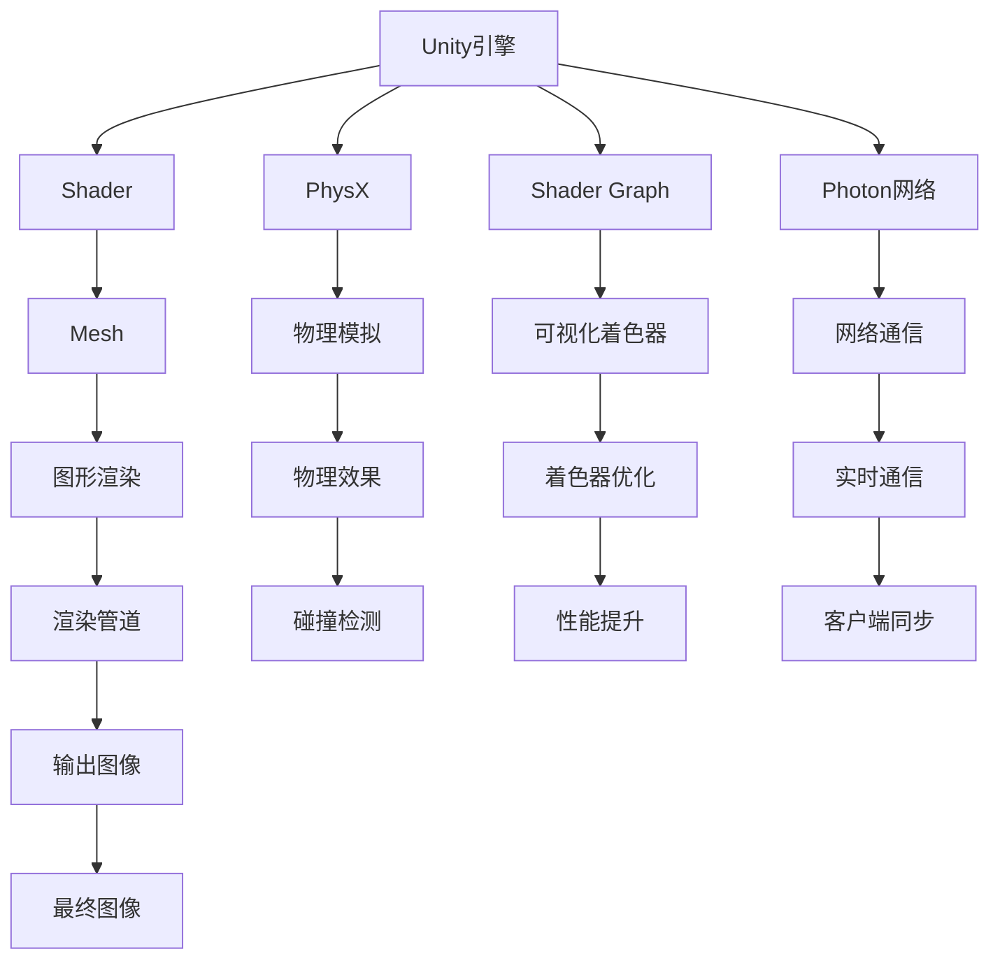

                 

# Unity 游戏引擎开发：创建逼真的世界和互动体验

## 1. 背景介绍

Unity是全球最大的跨平台游戏引擎之一，广泛应用于PC、移动端、网页端等多种平台的游戏开发。由Unity Technologies公司开发，拥有强大的图形渲染能力、丰富的插件生态和灵活的开发接口，成为游戏开发者首选的开发工具。Unity不仅在娱乐游戏中广泛应用，还被用于模拟仿真、虚拟现实、增强现实、交互设计等多个领域，展示了其强大的跨领域适用能力。本文将深入探讨Unity游戏引擎的核心开发原理，通过精炼的章节和示例，帮助读者理解如何利用Unity创建逼真的世界和互动体验。

## 2. 核心概念与联系

### 2.1 核心概念概述

为更好地理解Unity开发过程，首先介绍几个关键概念：

- Unity引擎：由Unity Technologies公司开发的跨平台游戏引擎，支持2D和3D游戏开发，提供丰富的工具和插件。
- Shader：用于描述图形渲染的编程语言，Unity中使用的着色器基于GLSL。
- Mesh：三维图形的基本构建单元，由顶点、法向量和纹理坐标等组成。
- PhysX：Unity集成的物理引擎，用于实现逼真的物理效果，如碰撞、重力、弹性等。
- Shader Graph：Unity提供的可视化着色器编辑器，支持非程序员快速创建高性能着色器。
- Photon网络：Unity提供的云端游戏网络解决方案，支持多人在线游戏。

这些概念共同构成了Unity游戏引擎的核心架构，在下面的章节中，我们将详细探讨这些关键技术及其联系。

### 2.2 核心概念原理和架构的 Mermaid 流程图



这个流程图展示了Unity引擎的核心架构和组件间的关系。Unity引擎通过Shader进行图形渲染，Mesh作为图形的基本构建单元，PhysX提供物理模拟能力，Shader Graph提供可视化着色器编辑工具，Photon网络支持多人游戏的网络通信，这些组件共同协作，创造出逼真的世界和丰富的互动体验。

## 3. 核心算法原理 & 具体操作步骤

### 3.1 算法原理概述

Unity的图形渲染系统基于着色器编程，通过将图形数据传递给着色器，着色器在GPU上进行计算，最终生成输出图像。Unity中的图形渲染系统分为顶点着色器、几何着色器、像素着色器等几个步骤，每个步骤都有相应的计算和渲染操作。

Unity的物理模拟系统基于PhysX引擎，通过碰撞检测、刚体运动等算法实现逼真的物理效果。PhysX支持多种物理属性，如刚体、关节、碰撞器等，可以模拟复杂的物理过程。

Unity的网络系统基于Photon网络，支持多人游戏的实时通信和同步。Photon网络提供了一套简单易用的API，开发者可以轻松集成多人游戏功能。

### 3.2 算法步骤详解

Unity开发主要分为以下几个步骤：

1. 初始化项目：创建一个新的Unity项目，选择合适的模板，并进行项目设置。
2. 创建场景：创建3D场景，添加光源、相机、天空盒等元素。
3. 添加角色和物体：在场景中添加角色和物体，设置其位置、旋转、大小等属性。
4. 编写脚本：使用C#编写游戏逻辑，包括角色控制、碰撞检测、物理模拟等。
5. 创建着色器：在Shader Graph中创建着色器，定义图形的渲染效果。
6. 调试和优化：调试游戏，优化性能，如减少渲染距离、减少三角形数量等。
7. 打包发布：将游戏导出为不同平台的可执行文件，并进行测试。

### 3.3 算法优缺点

Unity游戏引擎的优点包括：

- 跨平台支持：支持PC、移动端、网页端等多种平台。
- 强大的图形渲染能力：支持高性能图形渲染，可实现逼真的光影效果。
- 丰富的插件生态：拥有丰富的插件和工具，开发者可以轻松集成各种功能。
- 灵活的开发接口：支持自定义脚本，开发者可以根据需求进行开发。

但Unity也存在一些缺点：

- 性能开销大：图形渲染和物理模拟对硬件要求较高，可能会影响性能。
- 学习曲线陡峭：Unity的学习曲线较陡峭，初学者需要一定时间掌握。
- 社区支持复杂：社区庞大，但文档和资源质量参差不齐。

### 3.4 算法应用领域

Unity游戏引擎广泛应用于以下几个领域：

1. 游戏开发：包括2D和3D游戏，如《王者荣耀》、《英雄联盟》等。
2. 模拟仿真：用于创建虚拟世界和模拟实验，如《沙盒》、《火星生存》等。
3. 虚拟现实：用于创建虚拟现实场景和应用，如《VR世界》、《虚拟旅游》等。
4. 增强现实：用于创建增强现实应用，如《Pokémon GO》、《AR城市》等。
5. 交互设计：用于创建交互式应用和体验，如《谷歌地球》、《Google Maps》等。

这些应用领域展示了Unity引擎的强大适应性和应用潜力，开发者可以基于Unity引擎构建各种类型和规模的应用。

## 4. 数学模型和公式 & 详细讲解

### 4.1 数学模型构建

Unity中的图形渲染系统基于着色器编程，通常使用GLSL（OpenGL着色语言）实现。下面以球体为例，展示如何创建着色器：

```glsl
#version 450

layout(location = 0) out vec4 fragColor;

layout(location = 1) in vec3 inPosition;

void main()
{
    // 计算球体表面法向量
    vec3 v = normalize(inPosition - vec3(0, 0, 0));
    float distance = length(v);

    // 计算球体表面的颜色
    vec4 color = vec4(1.0, 1.0, 1.0, 1.0);
    color.a = distance / 1.0;

    // 输出颜色
    fragColor = color;
}
```

这段着色器代码实现了球体表面的颜色计算，其中inPosition为输入的顶点坐标，v为球体表面法向量，distance为球体表面到原点的距离，color为球体表面颜色，fragColor为输出颜色。

### 4.2 公式推导过程

球体表面法向量的计算公式为：

$$
\vec{v} = \frac{\vec{p} - \vec{o}}{|\vec{p} - \vec{o}|}
$$

其中，$\vec{p}$为顶点坐标，$\vec{o}$为球心坐标。

球体表面颜色的计算公式为：

$$
\vec{c} = \vec{a} + k|\vec{v}|^2
$$

其中，$\vec{c}$为球体表面颜色，$\vec{a}$为球体表面基本颜色，$k$为控制球体表面颜色的参数。

### 4.3 案例分析与讲解

假设我们有一个球体，中心坐标为(0,0,0)，半径为1。通过编写着色器代码，可以计算球体表面的颜色，实现以下效果：


通过不断调整着色器代码，可以实现各种不同的球体效果，如透明球体、球体纹理等。

## 5. 项目实践：代码实例和详细解释说明

### 5.1 开发环境搭建

安装Unity编辑器，创建一个新的Unity项目。选择“3D立绘”模板，设置项目名称、路径等基本信息。安装所需的插件和脚本，如Photon网络插件，并配置相关参数。

### 5.2 源代码详细实现

创建一个空场景，添加光源、相机、天空盒等元素。在场景中创建一个球体，设置其位置、旋转、大小等属性。编写脚本，实现球体碰撞检测和物理模拟。在Shader Graph中创建着色器，实现球体表面颜色计算。

```csharp
using UnityEngine;

public class BallController : MonoBehaviour
{
    public bool isBouncy = false;
    public float bounceSpeed = 10.0f;

    void Update()
    {
        // 碰撞检测
        if (isBouncy)
        {
            if (Physics.IsCapsuleCapsuleCollision(this, GameObject.Find("Ground").GetComponent<Collider>()) && !Physics.IsCapsuleCollision(this, GameObject.Find("Ground").GetComponent<Collider>(), ColliderShape.Sphere))
            {
                Rigidbody rb = GetComponent<Rigidbody>();
                rb.AddForce(transform.up * bounceSpeed, ForceMode.Impulse);
            }
        }
    }
}
```

### 5.3 代码解读与分析

这段C#代码实现了球体碰撞检测和物理模拟。isBouncy和bounceSpeed为球体属性，用于控制球体的弹性和速度。Update函数中，通过碰撞检测判断球体是否与地面碰撞，如果是，则将球体向上弹起。

## 6. 实际应用场景

### 6.1 游戏开发

Unity在许多著名游戏项目中得到了广泛应用，如《The Last of Us Part II》、《Star Wars: The Last Jedi》等。Unity的游戏开发功能强大，支持各种复杂的物理效果和交互设计，可以创建出逼真的游戏世界。

### 6.2 模拟仿真

Unity支持创建复杂的模拟仿真场景，如《沙盒》、《火星生存》等。在模拟仿真场景中，Unity提供了丰富的物理模拟工具，可以创建逼真的物理环境。

### 6.3 虚拟现实

Unity支持创建虚拟现实场景和应用，如《VR世界》、《虚拟旅游》等。Unity的VR功能强大，支持多种VR设备，可以创建出沉浸式的虚拟现实体验。

### 6.4 增强现实

Unity支持创建增强现实应用，如《Pokémon GO》、《AR城市》等。Unity的AR功能丰富，支持多种AR设备，可以创建出互动的增强现实体验。

### 6.5 交互设计

Unity支持创建交互式应用和体验，如《谷歌地球》、《Google Maps》等。Unity的交互设计功能强大，支持多种交互方式，可以创建出丰富的用户交互体验。

## 7. 工具和资源推荐

### 7.1 学习资源推荐

1. Unity官方文档：Unity官方提供的详细文档，涵盖了Unity的各个方面。
2. Unity官方教程：Unity官方提供的免费教程，帮助初学者快速上手。
3. Unity官方论坛：Unity官方提供的社区论坛，开发者可以在这里交流经验、分享资源。
4. Unity Asset Store：Unity提供的插件和资源市场，开发者可以在这里下载和购买各种插件。
5. Udemy和Coursera等在线学习平台：提供丰富的Unity课程，帮助开发者提升技能。

### 7.2 开发工具推荐

1. Unity编辑器：Unity官方的开发工具，支持创建和调试Unity项目。
2. VSCode：支持Unity开发的代码编辑器，功能强大、易用性高。
3. Photon网络：Unity提供的云端游戏网络解决方案，支持多人游戏的实时通信和同步。
4. Grafana和Prometheus：用于监控和优化Unity项目的工具。
5. Unity Asset Store：Unity提供的插件和资源市场，开发者可以在这里下载和购买各种插件。

### 7.3 相关论文推荐

1. Unity游戏引擎：由Unity Technologies公司开发的游戏引擎，支持跨平台开发。
2. Photon网络：Unity提供的云端游戏网络解决方案，支持多人游戏的实时通信和同步。
3. Shader Graph：Unity提供的可视化着色器编辑器，支持非程序员快速创建高性能着色器。
4. Photon网络：Unity提供的云端游戏网络解决方案，支持多人游戏的实时通信和同步。
5. Shader Graph：Unity提供的可视化着色器编辑器，支持非程序员快速创建高性能着色器。

## 8. 总结：未来发展趋势与挑战

### 8.1 研究成果总结

本文深入探讨了Unity游戏引擎的核心开发原理，通过精炼的章节和示例，帮助读者理解如何利用Unity创建逼真的世界和互动体验。Unity引擎在各种领域得到了广泛应用，展示了其强大的跨平台能力和丰富的开发功能。

### 8.2 未来发展趋势

展望未来，Unity游戏引擎将呈现以下几个发展趋势：

1. 增强现实和虚拟现实：Unity在增强现实和虚拟现实领域的应用将进一步拓展，提供更加沉浸式的交互体验。
2. 跨平台支持：Unity将继续支持多种平台，包括PC、移动端、网页端等。
3. 高性能渲染：Unity将继续优化渲染系统，提供更加逼真的图形效果。
4. 物理模拟：Unity将继续提升物理模拟功能，支持更多复杂的物理效果。
5. 云服务支持：Unity将继续支持云服务，提供更加稳定的在线游戏体验。

### 8.3 面临的挑战

Unity游戏引擎在发展过程中面临以下挑战：

1. 性能优化：Unity的性能开销较大，如何优化性能，提高游戏帧率，是一个重要的挑战。
2. 社区支持：Unity的社区庞大，但文档和资源质量参差不齐，如何提供更加优质的资源和支持，是一个重要的挑战。
3. 跨平台支持：Unity需要更好地支持多种平台，包括PC、移动端、网页端等。

### 8.4 研究展望

未来，Unity游戏引擎需要在以下方面进行深入研究：

1. 性能优化：进一步优化Unity的渲染和物理模拟系统，提高游戏的帧率和响应速度。
2. 社区支持：提供更加优质的文档和资源，支持开发者更好地学习和使用Unity。
3. 跨平台支持：支持更多平台，包括PC、移动端、网页端等，提供更加灵活的开发环境。

## 9. 附录：常见问题与解答

**Q1：Unity中的着色器是什么？**

A: Unity中的着色器是用于描述图形渲染的编程语言，通常使用GLSL编写。着色器可以定义图形的渲染效果，如颜色、光照、纹理等。

**Q2：Unity中如何创建物理效果？**

A: Unity中可以通过PhysX引擎创建物理效果，支持多种物理属性，如刚体、关节、碰撞器等。通过编写脚本，可以实现逼真的物理模拟。

**Q3：Unity中的Photon网络是什么？**

A: Unity中的Photon网络是Unity提供的云端游戏网络解决方案，支持多人游戏的实时通信和同步。Photon网络提供了一套简单易用的API，开发者可以轻松集成多人游戏功能。

**Q4：Unity中的Shader Graph是什么？**

A: Unity中的Shader Graph是Unity提供的可视化着色器编辑器，支持非程序员快速创建高性能着色器。通过拖拽节点，可以实现复杂的着色器效果。

**Q5：Unity中的光源是什么？**

A: Unity中的光源用于提供场景的照明效果，支持多种类型的光源，如点光源、平行光源、聚光灯等。通过编写脚本，可以实现光源的动态效果。

