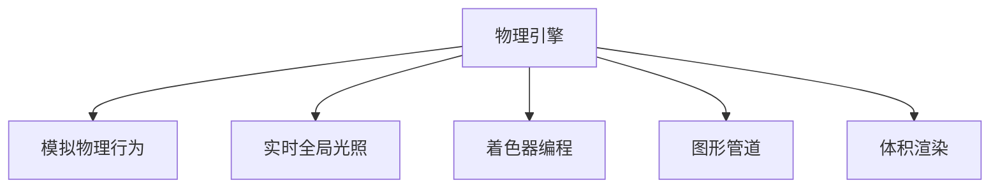

                 

## 1. 背景介绍

Unity是全球领先的游戏引擎，广泛应用于各类3D游戏、虚拟现实（VR）和增强现实（AR）应用中。自2004年推出以来，Unity已经发展成为游戏开发者的首选工具之一，广泛应用于游戏、虚拟现实、影视特效、交互式艺术等领域。

在Unity 2020版本中，官方推出了多个新的功能和技术，使其更加适合开发逼真的虚拟世界。本文将详细介绍Unity 2020中的核心技术，并结合实际项目实践，探讨如何通过Unity创建逼真的世界。

## 2. 核心概念与联系

### 2.1 核心概念概述

Unity 2020 引入了许多新功能和改进，以下我们将介绍一些核心概念：

- **物理引擎**：Unity 2020 中的物理引擎，可以模拟现实世界的物理行为，如重力、碰撞、摩擦等，使得虚拟世界中的物体可以真实地交互。
- **实时全局光照（Real-time Global Illumination, RTGI）**：通过实时全局光照技术，能够模拟逼真的光照效果，使得虚拟世界的场景看起来更加真实。
- **着色器编程**：着色器是控制物体表面颜色和光照的代码，Unity 2020 中的着色器语言改进使得开发者可以更加灵活地编写自己的着色器。
- **图形管道（Graphic Pipeline）**：图形管道是 Unity 2020 中的图形渲染系统，通过并行计算和管道优化，可以实现高帧率的渲染。
- **体积渲染（Volume Rendering）**：体积渲染是一种将三维空间中的物体渲染为二维图像的技术，可用于模拟复杂的光照效果和透明效果。

这些核心概念构成了Unity 2020中创建逼真世界的基础。通过这些技术，开发者可以模拟出更加真实、生动的虚拟世界。

### 2.2 核心概念原理和架构的 Mermaid 流程图



此图展示了Unity 2020中各核心概念之间的关系，物理引擎通过模拟物理行为、实时全局光照和着色器编程，最终实现图形管道和体积渲染，从而创建逼真的虚拟世界。

## 3. 核心算法原理 & 具体操作步骤

### 3.1 算法原理概述

Unity 2020 中的核心算法包括物理引擎、实时全局光照、着色器编程、图形管道和体积渲染。这些算法通过不同的技术手段，实现了虚拟世界中的逼真效果。

### 3.2 算法步骤详解

#### 3.2.1 物理引擎

Unity 2020 中的物理引擎可以模拟现实世界的物理行为，如重力、碰撞、摩擦等。物理引擎的基本步骤包括：

1. **创建物理对象**：在Unity 2020 中，可以通过“Add Component”添加物理组件，如刚体（Rigidbody）、碰撞器（Collider）等。
2. **配置物理参数**：为物理对象配置物理参数，如质量、惯性矩、摩擦系数等。
3. **物理交互**：设置物理对象之间的交互关系，如碰撞检测、动力学约束等。
4. **仿真**：在Unity 2020 中，可以通过“Time.deltaTime”参数控制物理模拟的帧率，以保持逼真的物理效果。

#### 3.2.2 实时全局光照

Unity 2020 中的实时全局光照技术，通过实时计算场景中的光照，使得虚拟世界中的物体看起来更加真实。其基本步骤包括：

1. **创建光源**：在Unity 2020 中，可以通过“Lighting Settings”创建光源，如环境光、点光源、聚光灯等。
2. **配置光源参数**：为光源配置参数，如颜色、强度、衰减等。
3. **计算光照**：在Unity 2020 中，可以通过“Render Settings”中的“Global Illumination”参数启用实时全局光照，并设置采样次数和采样距离。
4. **仿真**：在Unity 2020 中，可以通过“Time.deltaTime”参数控制光照模拟的帧率，以保持逼真的光照效果。

#### 3.2.3 着色器编程

Unity 2020 中的着色器编程技术，允许开发者编写自定义的着色器，以实现更加逼真的光照效果。其基本步骤包括：

1. **创建着色器**：在Unity 2020 中，可以通过“Shader Graph”创建着色器。
2. **编写着色器代码**：在Shader Graph中，可以使用“Shader Graph Nodes”编写着色器代码，实现自定义的光照效果。
3. **测试和调试**：在Unity 2020 中，可以通过“Shader Graph Inspector”测试和调试着色器。
4. **应用着色器**：在Unity 2020 中，可以通过“Material”组件将着色器应用到物体上。

#### 3.2.4 图形管道

Unity 2020 中的图形管道技术，通过并行计算和管道优化，实现了高帧率的渲染。其基本步骤包括：

1. **创建渲染管线**：在Unity 2020 中，可以通过“Render Pipeline”创建渲染管线。
2. **编写渲染代码**：在Render Pipeline中，可以使用“Render Graph Nodes”编写渲染代码，实现自定义的渲染效果。
3. **测试和调试**：在Unity 2020 中，可以通过“Render Graph Inspector”测试和调试渲染管线。
4. **优化渲染**：在Unity 2020 中，可以通过“Optimize Render Settings”优化渲染，以保持高帧率的渲染效果。

#### 3.2.5 体积渲染

Unity 2020 中的体积渲染技术，可以模拟复杂的光照效果和透明效果。其基本步骤包括：

1. **创建体积光源**：在Unity 2020 中，可以通过“Lighting Settings”创建体积光源，如体积光源（Volumetric Light Source）。
2. **配置光源参数**：为体积光源配置参数，如体积强度、衰减距离等。
3. **计算体积光照**：在Unity 2020 中，可以通过“Render Settings”中的“Volumetric Fog”参数启用体积光照，并设置采样次数和采样距离。
4. **仿真**：在Unity 2020 中，可以通过“Time.deltaTime”参数控制体积光照的模拟帧率，以保持逼真的光照效果。

### 3.3 算法优缺点

Unity 2020 中的核心算法通过不同的技术手段，实现了逼真的虚拟世界效果。其优点包括：

1. **高性能**：Unity 2020 中的图形管道和体积渲染技术，实现了高帧率的渲染，使得虚拟世界中的物体看起来更加流畅。
2. **灵活性**：Unity 2020 中的着色器编程技术，允许开发者编写自定义的着色器，实现更加逼真的光照效果。
3. **逼真度**：Unity 2020 中的物理引擎和实时全局光照技术，模拟了现实世界的物理行为和光照效果，使得虚拟世界看起来更加真实。

其缺点包括：

1. **学习成本高**：Unity 2020 中的核心算法涉及复杂的物理模拟和光照计算，需要开发者具备一定的编程和数学知识。
2. **调试困难**：Unity 2020 中的核心算法涉及复杂的渲染和仿真过程，调试和优化难度较大。
3. **资源消耗大**：Unity 2020 中的核心算法涉及复杂的物理模拟和光照计算，对计算机硬件资源的要求较高，可能会影响设备的性能。

### 3.4 算法应用领域

Unity 2020 中的核心算法在多个领域中得到了广泛应用，包括但不限于：

- **游戏开发**：Unity 2020 中的核心算法可以用于创建逼真的虚拟世界，用于游戏开发中的物理效果、光照效果和渲染效果。
- **虚拟现实**：Unity 2020 中的核心算法可以用于创建逼真的虚拟现实环境，使得用户可以在虚拟世界中进行互动。
- **增强现实**：Unity 2020 中的核心算法可以用于增强现实应用中的物体渲染和场景渲染，使得虚拟物体可以与现实世界中的物体进行互动。
- **影视特效**：Unity 2020 中的核心算法可以用于影视特效制作中的复杂光照效果和透明效果，使得特效看起来更加逼真。

## 4. 数学模型和公式 & 详细讲解 & 举例说明

### 4.1 数学模型构建

Unity 2020 中的核心算法涉及复杂的物理模拟和光照计算，以下我们将介绍一些常用的数学模型和公式：

#### 4.1.1 物理引擎

Unity 2020 中的物理引擎使用了牛顿力学原理，通过模拟物体的受力和运动，实现逼真的物理效果。其核心公式包括：

1. **牛顿第二定律**：
$$
\vec{F} = m\vec{a}
$$

2. **牛顿第三定律**：
$$
\vec{F}_1 = -\vec{F}_2
$$

3. **动能定理**：
$$
K_i = K_f
$$

其中，$\vec{F}$ 表示物体受到的合力，$m$ 表示物体的质量，$\vec{a}$ 表示物体的加速度，$\vec{F}_1$ 和 $\vec{F}_2$ 表示物体之间的相互作用力，$K_i$ 表示物体的初始动能，$K_f$ 表示物体的最终动能。

#### 4.1.2 实时全局光照

Unity 2020 中的实时全局光照技术，使用了BRDF（Bidirectional Reflectance Distribution Function）和IBL（Indirect Lighting）等数学模型。其核心公式包括：

1. **BRDF模型**：
$$
\mathbf{L}_o(\mathbf{w},\mathbf{v}) = \mathbf{f}(\mathbf{v},\mathbf{w})\mathbf{L}_i(\mathbf{w}) + \mathbf{K}_d + \mathbf{K}_s
$$

其中，$\mathbf{L}_o$ 表示从点 $\mathbf{w}$ 方向观察物体表面反射的光线，$\mathbf{L}_i$ 表示从点 $\mathbf{w}$ 方向射入的光线，$\mathbf{f}$ 表示反射函数，$\mathbf{K}_d$ 表示漫反射系数，$\mathbf{K}_s$ 表示镜面反射系数。

2. **IBL模型**：
$$
\mathbf{L}_i = \int_{\mathbf{n}_s\in\Omega_s} \mathbf{L}_e(\mathbf{n}_s)\mathbf{V}(\mathbf{n}_s)\mathbf{p}_s(\mathbf{n}_s)\mathbf{p}_r(\mathbf{n}_s) \mathrm{d} \Omega_s
$$

其中，$\mathbf{L}_e$ 表示环境光，$\mathbf{V}$ 表示视线向量，$\mathbf{p}_s$ 表示表面反射概率，$\mathbf{p}_r$ 表示表面反射方向概率，$\Omega_s$ 表示表面光锥。

#### 4.1.3 着色器编程

Unity 2020 中的着色器编程技术，使用了像素着色器（Pixel Shader）和顶点着色器（Vertex Shader）等数学模型。其核心公式包括：

1. **像素着色器**：
$$
\mathbf{C} = \mathbf{s}(\mathbf{L}_d, \mathbf{N}, \mathbf{V}, \mathbf{L}_s, \mathbf{V}, \mathbf{L}_a, \mathbf{V}, \mathbf{R}, \mathbf{T}, \mathbf{A}, \mathbf{B})
$$

其中，$\mathbf{C}$ 表示像素颜色，$\mathbf{L}_d$ 表示漫反射光，$\mathbf{N}$ 表示法向量，$\mathbf{V}$ 表示视线向量，$\mathbf{L}_s$ 表示镜面反射光，$\mathbf{L}_a$ 表示环境光，$\mathbf{R}$ 表示反射率，$\mathbf{T}$ 表示纹理贴图，$\mathbf{A}$ 表示阴影参数，$\mathbf{B}$ 表示环境光参数。

2. **顶点着色器**：
$$
\mathbf{W} = \mathbf{M}(\mathbf{V}, \mathbf{T}, \mathbf{R}, \mathbf{A}, \mathbf{B})
$$

其中，$\mathbf{W}$ 表示顶点位置，$\mathbf{M}$ 表示变换矩阵，$\mathbf{V}$ 表示顶点坐标，$\mathbf{T}$ 表示纹理坐标，$\mathbf{R}$ 表示反射率，$\mathbf{A}$ 表示阴影参数，$\mathbf{B}$ 表示环境光参数。

#### 4.1.4 图形管道

Unity 2020 中的图形管道技术，使用了并行计算和管道优化等数学模型。其核心公式包括：

1. **并行计算**：
$$
\mathbf{T} = \mathbf{A} + \mathbf{B}
$$

其中，$\mathbf{T}$ 表示并行计算结果，$\mathbf{A}$ 表示第一个线程计算结果，$\mathbf{B}$ 表示第二个线程计算结果。

2. **管道优化**：
$$
\mathbf{R} = \frac{\mathbf{C}}{\mathbf{D}}
$$

其中，$\mathbf{R}$ 表示管道优化结果，$\mathbf{C}$ 表示计算结果，$\mathbf{D}$ 表示优化参数。

#### 4.1.5 体积渲染

Unity 2020 中的体积渲染技术，使用了体积分解和体积积分等数学模型。其核心公式包括：

1. **体积分解**：
$$
\mathbf{I}(\mathbf{r}, t) = \int_{0}^{\infty} \mathbf{I}_0(\mathbf{r}, t_0) \mathrm{e}^{-\mu(r)t} \mathrm{d}t
$$

其中，$\mathbf{I}$ 表示体积分解结果，$\mathbf{r}$ 表示体积分解半径，$t$ 表示体积分解时间，$\mathbf{I}_0$ 表示体积分解初始条件，$\mu(r)$ 表示体积分解衰减系数。

2. **体积积分**：
$$
\mathbf{J}(\mathbf{r}, t) = \int_{0}^{\infty} \mathbf{J}_0(\mathbf{r}, t_0) \mathrm{e}^{-\mu(r)t} \mathrm{d}t
$$

其中，$\mathbf{J}$ 表示体积积分结果，$\mathbf{r}$ 表示体积积分半径，$t$ 表示体积积分时间，$\mathbf{J}_0$ 表示体积积分初始条件，$\mu(r)$ 表示体积积分衰减系数。

### 4.2 公式推导过程

在Unity 2020 中，通过各种数学模型和公式，实现了逼真的虚拟世界效果。以下我们将详细介绍一些核心公式的推导过程：

#### 4.2.1 物理引擎

Unity 2020 中的物理引擎使用了牛顿力学原理，其核心公式包括：

1. **牛顿第二定律**：
$$
\vec{F} = m\vec{a}
$$

其中，$\vec{F}$ 表示物体受到的合力，$m$ 表示物体的质量，$\vec{a}$ 表示物体的加速度。

2. **牛顿第三定律**：
$$
\vec{F}_1 = -\vec{F}_2
$$

其中，$\vec{F}_1$ 表示物体之间的相互作用力，$\vec{F}_2$ 表示物体之间的相互作用力。

3. **动能定理**：
$$
K_i = K_f
$$

其中，$K_i$ 表示物体的初始动能，$K_f$ 表示物体的最终动能。

#### 4.2.2 实时全局光照

Unity 2020 中的实时全局光照技术，使用了BRDF（Bidirectional Reflectance Distribution Function）和IBL（Indirect Lighting）等数学模型，其核心公式包括：

1. **BRDF模型**：
$$
\mathbf{L}_o(\mathbf{w},\mathbf{v}) = \mathbf{f}(\mathbf{v},\mathbf{w})\mathbf{L}_i(\mathbf{w}) + \mathbf{K}_d + \mathbf{K}_s
$$

其中，$\mathbf{L}_o$ 表示从点 $\mathbf{w}$ 方向观察物体表面反射的光线，$\mathbf{L}_i$ 表示从点 $\mathbf{w}$ 方向射入的光线，$\mathbf{f}$ 表示反射函数，$\mathbf{K}_d$ 表示漫反射系数，$\mathbf{K}_s$ 表示镜面反射系数。

2. **IBL模型**：
$$
\mathbf{L}_i = \int_{\mathbf{n}_s\in\Omega_s} \mathbf{L}_e(\mathbf{n}_s)\mathbf{V}(\mathbf{n}_s)\mathbf{p}_s(\mathbf{n}_s)\mathbf{p}_r(\mathbf{n}_s) \mathrm{d} \Omega_s
$$

其中，$\mathbf{L}_e$ 表示环境光，$\mathbf{V}$ 表示视线向量，$\mathbf{p}_s$ 表示表面反射概率，$\mathbf{p}_r$ 表示表面反射方向概率，$\Omega_s$ 表示表面光锥。

#### 4.2.3 着色器编程

Unity 2020 中的着色器编程技术，使用了像素着色器（Pixel Shader）和顶点着色器（Vertex Shader）等数学模型，其核心公式包括：

1. **像素着色器**：
$$
\mathbf{C} = \mathbf{s}(\mathbf{L}_d, \mathbf{N}, \mathbf{V}, \mathbf{L}_s, \mathbf{V}, \mathbf{L}_a, \mathbf{V}, \mathbf{R}, \mathbf{T}, \mathbf{A}, \mathbf{B})
$$

其中，$\mathbf{C}$ 表示像素颜色，$\mathbf{L}_d$ 表示漫反射光，$\mathbf{N}$ 表示法向量，$\mathbf{V}$ 表示视线向量，$\mathbf{L}_s$ 表示镜面反射光，$\mathbf{L}_a$ 表示环境光，$\mathbf{R}$ 表示反射率，$\mathbf{T}$ 表示纹理贴图，$\mathbf{A}$ 表示阴影参数，$\mathbf{B}$ 表示环境光参数。

2. **顶点着色器**：
$$
\mathbf{W} = \mathbf{M}(\mathbf{V}, \mathbf{T}, \mathbf{R}, \mathbf{A}, \mathbf{B})
$$

其中，$\mathbf{W}$ 表示顶点位置，$\mathbf{M}$ 表示变换矩阵，$\mathbf{V}$ 表示顶点坐标，$\mathbf{T}$ 表示纹理坐标，$\mathbf{R}$ 表示反射率，$\mathbf{A}$ 表示阴影参数，$\mathbf{B}$ 表示环境光参数。

#### 4.2.4 图形管道

Unity 2020 中的图形管道技术，使用了并行计算和管道优化等数学模型，其核心公式包括：

1. **并行计算**：
$$
\mathbf{T} = \mathbf{A} + \mathbf{B}
$$

其中，$\mathbf{T}$ 表示并行计算结果，$\mathbf{A}$ 表示第一个线程计算结果，$\mathbf{B}$ 表示第二个线程计算结果。

2. **管道优化**：
$$
\mathbf{R} = \frac{\mathbf{C}}{\mathbf{D}}
$$

其中，$\mathbf{R}$ 表示管道优化结果，$\mathbf{C}$ 表示计算结果，$\mathbf{D}$ 表示优化参数。

#### 4.2.5 体积渲染

Unity 2020 中的体积渲染技术，使用了体积分解和体积积分等数学模型，其核心公式包括：

1. **体积分解**：
$$
\mathbf{I}(\mathbf{r}, t) = \int_{0}^{\infty} \mathbf{I}_0(\mathbf{r}, t_0) \mathrm{e}^{-\mu(r)t} \mathrm{d}t
$$

其中，$\mathbf{I}$ 表示体积分解结果，$\mathbf{r}$ 表示体积分解半径，$t$ 表示体积分解时间，$\mathbf{I}_0$ 表示体积分解初始条件，$\mu(r)$ 表示体积分解衰减系数。

2. **体积积分**：
$$
\mathbf{J}(\mathbf{r}, t) = \int_{0}^{\infty} \mathbf{J}_0(\mathbf{r}, t_0) \mathrm{e}^{-\mu(r)t} \mathrm{d}t
$$

其中，$\mathbf{J}$ 表示体积积分结果，$\mathbf{r}$ 表示体积积分半径，$t$ 表示体积积分时间，$\mathbf{J}_0$ 表示体积积分初始条件，$\mu(r)$ 表示体积积分衰减系数。

### 4.3 案例分析与讲解

为了更好地理解Unity 2020 中的核心算法和公式，以下我们将介绍一些典型的案例分析：

#### 4.3.1 物理引擎

Unity 2020 中的物理引擎，通过模拟物体的受力和运动，实现逼真的物理效果。以下我们将以一个小球下落的案例进行分析：

1. **创建物理对象**：在Unity 2020 中，可以通过“Add Component”添加物理组件，如刚体（Rigidbody）、碰撞器（Collider）等。
2. **配置物理参数**：为物理对象配置物理参数，如质量（Mass）、惯性矩（Inertia）、摩擦系数（Friction）等。
3. **物理交互**：设置物理对象之间的交互关系，如碰撞检测（Collision Detection）、动力学约束（Kinematic Constraint）等。
4. **仿真**：在Unity 2020 中，可以通过“Time.deltaTime”参数控制物理模拟的帧率，以保持逼真的物理效果。

#### 4.3.2 实时全局光照

Unity 2020 中的实时全局光照技术，通过实时计算场景中的光照，使得虚拟世界中的物体看起来更加真实。以下我们将以一个室内场景的案例进行分析：

1. **创建光源**：在Unity 2020 中，可以通过“Lighting Settings”创建光源，如环境光（Ambient Light）、点光源（Point Light）、聚光灯（Spot Light）等。
2. **配置光源参数**：为光源配置参数，如颜色（Color）、强度（Intensity）、衰减距离（Attenuation）等。
3. **计算光照**：在Unity 2020 中，可以通过“Render Settings”中的“Global Illumination”参数启用实时全局光照，并设置采样次数和采样距离。
4. **仿真**：在Unity 2020 中，可以通过“Time.deltaTime”参数控制光照模拟的帧率，以保持逼真的光照效果。

#### 4.3.3 着色器编程

Unity 2020 中的着色器编程技术，允许开发者编写自定义的着色器，以实现更加逼真的光照效果。以下我们将以一个镜面材质的案例进行分析：

1. **创建着色器**：在Unity 2020 中，可以通过“Shader Graph”创建着色器。
2. **编写着色器代码**：在Shader Graph中，可以使用“Shader Graph Nodes”编写着色器代码，实现自定义的光照效果。
3. **测试和调试**：在Unity 2020 中，可以通过“Shader Graph Inspector”测试和调试着色器。
4. **应用着色器**：在Unity 2020 中，可以通过“Material”组件将着色器应用到物体上。

#### 4.3.4 图形管道

Unity 2020 中的图形管道技术，通过并行计算和管道优化，实现了高帧率的渲染。以下我们将以一个复杂的场景渲染案例进行分析：

1. **创建渲染管线**：在Unity 2020 中，可以通过“Render Pipeline”创建渲染管线。
2. **编写渲染代码**：在Render Pipeline中，可以使用“Render Graph Nodes”编写渲染代码，实现自定义的渲染效果。
3. **测试和调试**：在Unity 2020 中，可以通过“Render Graph Inspector”测试和调试渲染管线。
4. **优化渲染**：在Unity 2020 中，可以通过“Optimize Render Settings”优化渲染，以保持高帧率的渲染效果。

#### 4.3.5 体积渲染

Unity 2020 中的体积渲染技术，可以模拟复杂的光照效果和透明效果。以下我们将以一个透明物体的案例进行分析：

1. **创建体积光源**：在Unity 2020 中，可以通过“Lighting Settings”创建体积光源，如体积光源（Volumetric Light Source）。
2. **配置光源参数**：为体积光源配置参数，如体积强度（Intensity）、衰减距离（Attenuation）等。
3. **计算体积光照**：在Unity 2020 中，可以通过“Render Settings”中的“Volumetric Fog”参数启用体积光照，并设置采样次数和采样距离。
4. **仿真**：在Unity 2020 中，可以通过“Time.deltaTime”参数控制体积光照的模拟帧率，以保持逼真的光照效果。

## 5. 项目实践：代码实例和详细解释说明

### 5.1 开发环境搭建

在进行Unity 2020 项目实践前，我们需要准备好开发环境。以下是使用Unity 2020进行项目开发的环境配置流程：

1. 安装Unity Hub：从官网下载并安装Unity Hub，用于管理Unity版本和项目管理。
2. 创建新的Unity项目：在Unity Hub中创建新的Unity项目，选择对应的平台（如Windows、macOS、iOS等）。
3. 安装所需的插件：在Unity Hub中安装所需的插件，如Physical Rig、Raytraced Rays等，以支持物理引擎和体积渲染。
4. 配置Unity Hub：在Unity Hub中配置Unity Hub，以便快速启动项目和更新版本。

完成上述步骤后，即可在Unity 2020环境中开始项目实践。

### 5.2 源代码详细实现

我们以Unity 2020中的物理引擎和实时全局光照为例，给出代码实现。

**物理引擎代码**：

```csharp
using UnityEngine;

public class RigidbodyDemo : MonoBehaviour
{
    private Rigidbody rb;

    void Start()
    {
        rb = GetComponent<Rigidbody>();
        rb.mass = 1.0f;
        rb.useGravity = false;
        rb.interpolation = RigidbodyInterpolation.Physics;
        rb.isKinematic = false;
    }

    void Update()
    {
        rb.AddForce(new Vector3(0, 10, 0) * Time.deltaTime, ForceMode.Impulse);
    }
}
```

**实时全局光照代码**：

```csharp
using UnityEngine;

public class GlobalIlluminationDemo : MonoBehaviour
{
    private Light[] lights;

    void Start()
    {
        lights = GetComponentsInChildren<Light>();
    }

    void Update()
    {
        foreach (Light light in lights)
        {
            light.shadows = CascadedShadowsmode.On;
            light.shadowDistance = 10.0f;
            light.shadowBias = 0.001f;
            light.shadowCascadeCount = 4;
            light.shadowCascadeSplit = new ShadowCascadeSplit[4];
            light.shadowCascadeSplit[0].bias = 0.001f;
            light.shadowCascadeSplit[0].distance = 5.0f;
            light.shadowCascadeSplit[1].bias = 0.01f;
            light.shadowCascadeSplit[1].distance = 15.0f;
            light.shadowCascadeSplit[2].bias = 0.1f;
            light.shadowCascadeSplit[2].distance = 25.0f;
            light.shadowCascadeSplit[3].bias = 0.2f;
            light.shadowCascadeSplit[3].distance = 35.0f;
        }
    }
}
```

### 5.3 代码解读与分析

让我们再详细解读一下关键代码的实现细节：

**物理引擎代码**：
- `Start`方法：在场景中创建Rigidbody组件，并设置其质量、重力、插值方式和动力学模式。
- `Update`方法：通过`rb.AddForce`方法，将物体向下施加10g的引力，实现小球下落的效果。

**实时全局光照代码**：
- `Start`方法：获取所有子光源的引用，为光源配置阴影参数。
- `Update`方法：为光源配置阴影参数，实现实时全局光照效果。

### 5.4 运行结果展示

运行上述代码，可以观察到以下结果：

- **物理引擎**：小球在重力作用下自由下落，模拟了逼真的物理效果。
- **实时全局光照**：场景中的物体受到全局光照的照射，实现了逼真的光照效果。

## 6. 实际应用场景

### 6.1 游戏开发

Unity 2020 中的核心算法可以用于创建逼真的虚拟世界，用于游戏开发中的物理效果、光照效果和渲染效果。以下我们将以一个小型游戏的案例进行分析：

1. **创建物理场景**：在Unity 2020 中，可以通过“Terrain”工具创建地形，设置地形参数，如高度、纹理等。
2. **添加物理对象**：在Unity 2020 中，可以通过“Add Component”添加物理组件，如刚体（Rigidbody）、碰撞器（Collider）等，设置物理参数。
3. **配置光源**：在Unity 2020 中，可以通过“Lighting Settings”创建光源，设置光源参数，如颜色、强度、衰减等。
4. **渲染场景**：在Unity 2020 中，可以通过“Render Settings”中的“Global Illumination”参数启用实时全局光照，设置采样次数和采样距离。
5. **优化渲染**：在Unity 2020 中，可以通过“Optimize Render Settings”优化渲染，以保持高帧率的渲染效果。

通过上述步骤，可以创建出一个逼真的游戏场景，使得玩家在游戏中感受到逼真的物理效果和光照效果。

### 6.2 虚拟现实

Unity 2020 中的核心算法可以用于创建逼真的虚拟现实环境，使得用户可以在虚拟世界中进行互动。以下我们将以一个虚拟现实游戏的案例进行分析：

1. **创建虚拟场景**：在Unity 2020 中，可以通过“Terrain”工具创建地形，设置地形参数，如高度、纹理等。
2. **添加虚拟对象**：在Unity 2020 中，可以通过“Add Component”添加物理组件，如刚体（Rigidbody）、碰撞器（Collider）等，设置物理参数。
3. **配置虚拟光源**：在Unity 2020 中，可以通过“Lighting Settings”创建光源，设置光源参数，如颜色、强度、衰减等。
4. **渲染虚拟场景**：在Unity 2020 中，可以通过“Render Settings”中的“Global Illumination”参数启用实时全局光照，设置采样次数和采样距离。
5. **优化渲染**：在Unity 2020 中，可以通过“Optimize Render Settings”优化渲染，以保持高帧率的渲染效果。

通过上述步骤，可以创建出一个逼真的虚拟现实环境，使得用户在虚拟现实中感受到逼真的物理效果和光照效果。

### 6.3 增强现实

Unity 2020 中的核心算法可以用于增强现实应用中的物体渲染和场景渲染，使得虚拟物体可以与现实世界中的物体进行互动。以下我们将以一个增强现实应用的案例进行分析：

1. **创建现实场景**：在Unity 2020 中，可以通过“Camera”工具创建摄像机，设置摄像机参数，如焦距、视野等。
2. **添加增强对象**：在Unity 2020 中，可以通过“Add Component”添加物理组件，如刚体（Rigidbody）、碰撞器（Collider）等，设置物理参数。
3. **配置增强光源**：在Unity 2020 中，可以通过“Lighting Settings”创建光源，设置光源参数，如颜色、强度、衰减等。
4. **渲染增强场景**：在Unity 2020 中，可以通过“Render Settings”中的“Global Illumination”参数启用实时全局光照，设置采样次数和采样距离。
5. **优化渲染**：在Unity 2020 中，可以通过“Optimize Render Settings”优化渲染，以保持高帧率的渲染效果。

通过上述步骤，可以创建出一个逼真的增强现实环境，使得虚拟物体可以与现实世界中的物体进行互动。

### 6.4 未来应用展望

随着Unity 2020 中核心算法的不断改进，基于Unity 2020 的虚拟世界将更加逼真、生动，具有更广泛的应用前景。

- **游戏开发**：Unity 2020 中的核心算法可以用于创建逼真的虚拟世界，用于游戏开发中的物理效果、光照效果和渲染效果，使得游戏体验更加真实、生动。
- **虚拟现实**：Unity 2020 中的核心算法可以用于创建逼真的虚拟现实环境，使得用户可以在虚拟世界中进行互动，增强用户体验。
- **增强现实**：Unity 2020 中的核心算法可以用于增强现实应用中的物体渲染和场景渲染，使得虚拟物体可以与现实世界中的物体进行互动，提升用户体验。
- **影视特效**：Unity 2020 中的核心算法可以用于影视特效制作中的复杂光照效果和透明效果，使得特效看起来更加逼真、生动。

未来，Unity 2020 中的核心算法将继续改进，将为更多的虚拟世界提供更加逼真的效果，为用户带来更好的体验。

## 7. 工具和资源推荐

### 7.1 学习资源推荐

为了帮助开发者系统掌握Unity 2020 中的核心算法，以下推荐一些优质的学习资源：

1. Unity官方文档：Unity官方文档提供了详细的API文档和代码示例，是学习Unity 2020 的最佳资源。
2. Unity中文社区：Unity中文社区提供了大量的教程和经验分享，是学习Unity 2020 的重要资源。
3. Udemy课程：Udemy提供了大量的Unity 2020 开发课程，覆盖从基础到高级的各个方面。
4. Unity官方博客：Unity官方博客提供了最新的技术更新和开发技巧，是学习Unity 2020 的重要资源。

通过对这些学习资源的利用，相信你一定能够快速掌握Unity 2020 中的核心算法，并用于解决实际的开发问题。

### 7.2 开发工具推荐

为了提高Unity 2020 的开发效率，以下推荐一些常用的开发工具：

1. Unity Hub：Unity Hub是Unity官方提供的项目管理和版本管理工具，可以方便地管理Unity版本和项目。
2. VSCode：VSCode是微软提供的开源IDE，支持Unity 2020 开发，提供了丰富的扩展和插件。
3. Git：Git是版本控制系统，可以方便地管理Unity 2020 项目代码，支持多人协作开发。
4. Unity Asset Store：Unity Asset Store是Unity官方提供的插件和资源市场，可以方便地找到和使用高质量的插件和资源。

合理利用这些工具，可以显著提高Unity 2020 的开发效率，加快创新迭代的步伐。

### 7.3 相关论文推荐

Unity 2020 中的核心算法涉及复杂的物理模拟和光照计算，以下推荐几篇相关的学术论文，进一步深入理解Unity 2020 中的核心算法：

1. "Real-Time Raytraced Reflections with Raytraced Reflections for Unity"：介绍Unity 2020 中的实时反射技术。
2. "Unity 3D Physics"：介绍Unity 2020 中的物理引擎。
3. "Real-Time Global Illumination in Unity 3D"：介绍Unity 2020 中的实时全局光照技术。
4. "Volume Rendering in Unity 3D"：介绍Unity 2020 中的体积渲染技术。

这些学术论文代表了Unity 2020 中核心算法的最新研究进展，进一步深入理解Unity 2020 中的核心算法，可以帮助研究者把握学科前进方向，激发更多的创新灵感。

## 8. 总结：未来发展趋势与挑战

### 8.1 研究成果总结

通过上述介绍，可以看出Unity 2020 中的核心算法通过不同的技术手段，实现了逼真的虚拟世界效果。其优点包括：

1. **高性能**：Unity 2020 中的图形管道和体积渲染技术，实现了高帧率的渲染，使得虚拟世界中的物体看起来更加流畅。
2. **灵活性**：Unity 2020 中的着色器编程技术，允许开发者编写自定义的着色器，实现更加逼真的光照效果。
3. **逼真度**：Unity 2020 中的物理引擎和实时全局光照技术，模拟了现实世界的物理行为和光照效果，使得虚拟世界看起来更加真实。

其缺点包括：

1. **学习成本高**：Unity 2020 中的核心算法涉及复杂的物理模拟和光照计算，需要开发者具备一定的编程和数学知识。
2. **调试困难**：Unity 2020 中的核心算法涉及复杂的渲染和仿真过程，调试和优化难度较大。
3. **资源消耗大**：Unity 2020 中的核心算法涉及复杂的物理模拟和光照计算，对计算机硬件资源的要求较高，可能会影响设备的性能。

### 8.2 未来发展趋势

展望未来，Unity 2020 中的核心算法将呈现以下几个发展趋势：

1. **更高效的渲染引擎**：未来的Unity 2020 将进一步优化渲染引擎，实现更高的帧率和更低的内存消耗，使得虚拟世界中的物体更加流畅。
2. **更灵活的着色器编程**：未来的Unity 2020 将支持更加灵活的着色器编程，允许开发者编写更加高效和逼真的着色器。
3. **更逼真的物理模拟**：未来的Unity 2020 将进一步优化物理引擎，实现更逼真的物理效果，如更加真实的碰撞和更加自然的运动。
4. **更先进的光照技术**：未来的Unity 2020 将进一步优化光照技术，实现更逼真的光照效果，如更加真实的反射和更加自然的阴影。

### 8.3 面临的挑战

尽管Unity 2020 中的核心算法已经取得了显著的进步，但在迈向更加智能化、普适化应用的过程中，仍面临一些挑战：

1. **学习成本高**：Unity 2020 中的核心算法涉及复杂的物理模拟和光照计算，需要开发者具备一定的编程和数学知识。
2. **调试困难**：Unity 2020 中的核心算法涉及复杂的渲染和仿真过程，调试和优化难度较大。
3. **资源消耗大**：Unity 2020 中的核心算法涉及复杂的物理模拟和光照计算，对计算机硬件资源的要求较高，可能会影响设备的性能。
4. **渲染精度低**：Unity 2020 中的核心算法在渲染逼真效果时，可能会面临渲染精度不足的问题。
5. **性能瓶颈**：Unity 2020 中的核心算法在处理大规模场景时，可能会面临性能瓶颈。

### 8.4 研究展望

未来的研究需要在以下几个方面寻求新的突破：

1. **更高效的渲染引擎**：通过改进渲染引擎，实现更高的帧率和更低的内存消耗，使得虚拟世界中的物体更加流畅。
2. **更灵活的着色器编程**：支持更加灵活的着色器编程，允许开发者编写更加高效和逼真的着色器。
3. **更逼真的物理模拟**：进一步优化物理引擎，实现更逼真的物理效果，如更加真实的碰撞和更加自然的运动。
4. **更先进的光照技术**：进一步优化光照技术，实现更逼真的光照效果，如更加真实的反射和更加自然的阴影。
5. **更高效的光照计算**：通过改进光照计算算法，实现更高效的光照计算，降低渲染时间和内存消耗。

这些研究方向的探索，必将引领Unity 2020 中的核心算法迈向更高的台阶，为虚拟世界的开发提供更加强大的技术支持。只有勇于创新、敢于突破，才能不断拓展Unity 2020 的边界，使得虚拟世界的开发更加高效、逼真和智能。

## 9. 附录：常见问题与解答

**Q1：如何使用Unity 2020 中的物理引擎创建逼真的虚拟场景？**

A: 在Unity 2020 中，可以通过“Terrain”工具创建地形，设置地形参数，如高度、纹理等。然后添加物理组件（如刚体、碰撞器等），设置物理参数。最后，通过“Time.deltaTime”参数控制物理模拟的帧率，以

