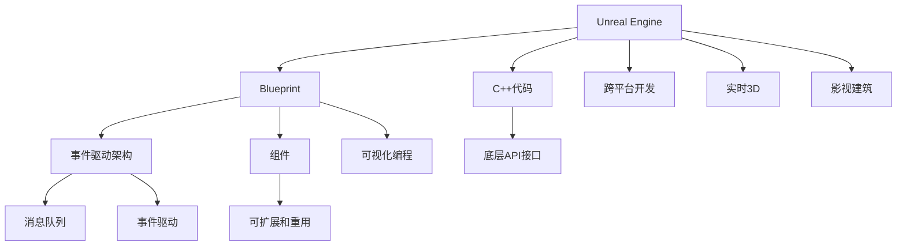

                 

# Unreal Engine蓝图系统：快速游戏原型开发

> 关键词：Unreal Engine, Blueprints, Game Engine, C++, 游戏原型, 开发效率, 可视化编程

## 1. 背景介绍

### 1.1 问题由来

随着视频游戏行业的发展，开发一款完整游戏所需的资源和复杂度日益增加。从设计、实现到测试，各个环节都要求极高的技术水平和团队协作能力。因此，对于新游戏开发者或小型团队而言，从头开始开发一款游戏是一个巨大的挑战。

为了简化游戏开发过程，降低开发门槛，Unreal Engine引入了一套强大的可视化编程系统——蓝图系统。蓝图系统允许开发者以拖拽方式创建游戏逻辑，而无需编写复杂的C++代码，极大提高了开发效率和可维护性。

### 1.2 问题核心关键点

蓝图系统的核心在于将复杂的编程任务封装成易于理解的图形界面，使开发者能够快速构建、调试和迭代游戏逻辑。其核心思想在于：

- 可视化编程：通过拖拽节点和连接线，实现复杂逻辑的构建和编辑。
- 脚本与组件分离：将脚本代码封装在组件中，使得组件可以独立调试和优化。
- 事件驱动架构：通过事件触发器（Event Trigger）和响应器（Event Receiver）实现组件间的通信和协同工作。
- 插件式开发：蓝图系统允许开发者编写自己的脚本节点和组件，以适应不同的开发需求。

通过这些核心思想，蓝图系统成为了游戏开发者们快速构建游戏原型、进行快速迭代的重要工具。

## 2. 核心概念与联系

### 2.1 核心概念概述

为更好地理解蓝图系统的原理和架构，本节将介绍几个密切相关的核心概念：

- Unreal Engine：由Epic Games开发的实时3D游戏引擎，支持跨平台开发和发布，广泛应用于游戏、影视、建筑等不同领域。
- Blueprint：Unreal Engine中的可视化编程工具，允许开发者拖拽组件、连接线、定义事件来快速构建游戏逻辑。
- C++代码：与Blueprint脚本配合使用，提供底层API接口，支持更复杂的逻辑和性能优化。
- 事件驱动架构：基于消息队列和事件驱动的编程模式，实现组件间的数据传递和交互。
- 组件：Blueprint中的基本构建块，用于封装特定的功能，支持可扩展和重用。

这些核心概念之间通过事件驱动和组件组合，形成了一个灵活且易于使用的蓝图系统。通过这些概念的组合和运用，蓝图系统能够快速地构建、调试和迭代游戏逻辑，简化开发流程，提高开发效率。

### 2.2 核心概念原理和架构的 Mermaid 流程图



这个流程图展示了蓝图系统的核心概念及其之间的关系：

1. Unreal Engine提供实时3D和跨平台开发能力。
2. Blueprint是Unreal Engine中的可视化编程工具。
3. C++代码与Blueprint结合，提供底层API接口。
4. 事件驱动架构基于消息队列和事件驱动，实现组件间的通信。
5. 组件是Blueprint中的基本构建块，支持可扩展和重用。
6. 可视化编程通过拖拽节点和连接线实现复杂逻辑的构建和编辑。

这些概念共同构成了蓝图系统的核心框架，使得开发者能够快速、灵活地构建游戏原型。

## 3. 核心算法原理 & 具体操作步骤

### 3.1 算法原理概述

蓝图系统的算法原理主要围绕以下几个方面展开：

- **可视化编程**：将复杂的逻辑封装成拖拽节点和连接线，方便开发者快速构建和编辑。
- **事件驱动架构**：通过事件触发器和响应器实现组件间的通信和交互。
- **组件和脚本分离**：将复杂逻辑封装在组件中，支持组件的独立调试和优化。

这些原理构成了蓝图系统的核心算法框架，使得开发者能够快速构建、调试和迭代游戏逻辑，从而简化开发流程，提高开发效率。

### 3.2 算法步骤详解

蓝图系统的开发流程主要包括以下几个关键步骤：

**Step 1: 创建蓝图脚本**

1. 在Unreal Engine中，通过编辑器选择“Create Blueprint”菜单，创建一个新的蓝图脚本。
2. 选择脚本类型（如Actor、Component或Behavior），指定所需的组件和变量。

**Step 2: 构建蓝图逻辑**

1. 在蓝图编辑器中，通过拖拽节点构建逻辑流程。常用的节点包括条件判断、循环、函数调用等。
2. 连接节点和定义变量，实现复杂的逻辑和数据处理。

**Step 3: 编写C++代码**

1. 在蓝图中，可以通过“Add Script Node”添加C++代码块，实现更复杂的逻辑和性能优化。
2. 编写函数、定义变量，调用外部API接口，实现蓝图脚本的功能。

**Step 4: 调试和测试**

1. 在蓝图编辑器中，通过运行模式（Play Mode）和调试模式（Debug Mode），逐步调试和优化蓝图脚本。
2. 使用Unreal Engine的调试工具，分析蓝图脚本的性能和错误，进行优化和调试。

**Step 5: 部署和发布**

1. 通过编译和打包工具，将蓝图脚本导出为C++代码，集成到游戏项目中。
2. 进行性能优化和调试，确保蓝图脚本的正确性和稳定性。

通过以上步骤，开发者可以高效地构建、调试和发布蓝图脚本，实现复杂的游戏逻辑和功能。

### 3.3 算法优缺点

蓝图系统具有以下优点：

- **可视化编程**：拖拽式编程降低了学习门槛，加速开发流程。
- **事件驱动架构**：灵活的通信机制，方便组件间的数据传递和交互。
- **组件和脚本分离**：组件独立调试和优化，提高可维护性。
- **可扩展性和重用性**：组件可重复使用，提高开发效率。

同时，蓝图系统也存在一些局限性：

- **复杂逻辑的限制**：拖拽式编程适用于简单的逻辑，复杂的逻辑需要通过C++代码实现。
- **性能瓶颈**：部分蓝图脚本在性能上可能不如直接编写的C++代码。
- **可读性和可维护性**：过度依赖拖拽式编程可能导致代码可读性降低，维护性较差。

尽管存在这些局限性，但蓝图系统依然在Unreal Engine中扮演着重要角色，极大地简化了游戏开发流程，提高了开发效率。

### 3.4 算法应用领域

蓝图系统在游戏开发、影视制作、建筑可视化等多个领域得到了广泛应用。以下是几个典型的应用场景：

- **游戏开发**：在Unreal Engine中，蓝图系统用于构建角色行为、环境交互、游戏逻辑等。通过拖拽节点和连接线，实现复杂的玩家控制和游戏事件。
- **影视制作**：蓝图系统在影视制作中用于创建动画、特效、场景渲染等。通过可视化编程，快速实现复杂的动画和视觉效果。
- **建筑可视化**：蓝图系统在建筑可视化中用于创建建筑模型、室内设计、虚拟漫游等。通过拖拽节点和事件驱动，实现复杂的交互和效果。

这些应用场景展示了蓝图系统的强大功能和灵活性，为不同领域的技术人员提供了高效的工具支持。

## 4. 数学模型和公式 & 详细讲解 & 举例说明

### 4.1 数学模型构建

蓝图系统的数学模型主要围绕事件驱动架构和组件通信展开。具体模型如下：

设组件 $C_i$ 包含 $n_i$ 个事件触发器（Event Trigger）和 $m_i$ 个响应器（Event Receiver），组件间的通信通过事件触发器和响应器实现。设 $E_{ij}$ 为事件 $i$ 从触发器 $j$ 到响应器 $j$ 的通信事件，$E_{ij}^t$ 表示事件触发，$E_{ij}^r$ 表示事件响应。

蓝图系统的数学模型可以表示为：

$$
\begin{aligned}
& \text{Event Triggers} = \{E_{ij}^t | i=1,2,...,n_i, j=1,2,...,m_i\} \\
& \text{Event Receivers} = \{E_{ij}^r | i=1,2,...,n_i, j=1,2,...,m_i\} \\
& \text{Communication} = \{E_{ij} | E_{ij}=E_{ij}^t \text{ or } E_{ij}^r\}
\end{aligned}
$$

通过这个模型，我们可以分析组件间的通信和事件触发机制，实现复杂的游戏逻辑和数据处理。

### 4.2 公式推导过程

为了更好地理解蓝图系统的通信机制，下面推导一下事件触发器和响应器之间的通信公式：

设事件 $E_{ij}$ 在组件 $C_i$ 触发后，传递到组件 $C_j$ 的响应器，根据事件驱动架构，有以下公式：

$$
E_{ij} = E_{ij}^t \rightarrow E_{ij}^r
$$

其中 $E_{ij}^t$ 表示事件 $E_{ij}$ 在组件 $C_i$ 中触发，$E_{ij}^r$ 表示事件 $E_{ij}$ 在组件 $C_j$ 中响应。通过这个公式，我们可以推导出事件触发器和响应器之间的通信机制。

### 4.3 案例分析与讲解

下面以一个简单的游戏为例，展示蓝图系统的应用：

**案例背景**：

开发一个简单的射击游戏，玩家控制角色，射击敌人。游戏中需要实现玩家移动、角色碰撞检测、敌人行为和子弹击中效果等。

**实现步骤**：

1. 创建角色类 Blueprint 和子弹类 Blueprint。
2. 在角色类 Blueprint 中，通过拖拽节点实现玩家移动、角色碰撞检测、敌人行为等逻辑。
3. 在子弹类 Blueprint 中，通过拖拽节点实现子弹击中效果的逻辑。
4. 编写C++代码，定义角色和子弹的行为函数。
5. 通过调试和测试，优化蓝图脚本的性能和稳定性。
6. 将蓝图脚本导出为C++代码，集成到游戏项目中。

通过这个案例，我们可以看到蓝图系统如何通过拖拽节点和事件驱动，实现复杂的游戏逻辑和功能。

## 5. 项目实践：代码实例和详细解释说明

### 5.1 开发环境搭建

在进行蓝图系统的实践前，我们需要准备好开发环境。以下是使用Unreal Engine搭建开发环境的步骤：

1. 下载并安装Unreal Engine。可以从官网下载最新版本的编辑器和引擎。
2. 创建一个新的游戏项目。通过编辑器选择“New Project”菜单，设置项目名称和位置。
3. 安装Visual Studio。Unreal Engine需要Visual Studio进行编译和构建。
4. 配置开发环境。通过编辑器设置编译器选项、版本控制等环境变量。
5. 导入第三方插件。根据需要导入所需的插件，如蓝图插件、代码生成器等。

完成上述步骤后，即可在Unreal Engine中进行蓝图系统的开发实践。

### 5.2 源代码详细实现

下面是使用蓝图系统实现一个简单的射击游戏的代码实例：

**实现步骤**：

1. 创建角色类 Blueprint 和子弹类 Blueprint。
2. 在角色类 Blueprint 中，添加移动组件和碰撞检测组件。
3. 在角色类 Blueprint 中，通过拖拽节点实现玩家移动和角色碰撞检测逻辑。
4. 在子弹类 Blueprint 中，通过拖拽节点实现子弹击中效果的逻辑。
5. 编写C++代码，定义角色和子弹的行为函数。
6. 通过调试和测试，优化蓝图脚本的性能和稳定性。
7. 将蓝图脚本导出为C++代码，集成到游戏项目中。

**代码实现**：

```c++
// 角色类 Blueprint
void AActor::Tick(float DeltaTime)
{
    Super::Tick(DeltaTime);

    // 玩家移动逻辑
    const FInputActionActionData* InputAction = InputActionPressed("MoveForward");
    if (InputAction)
    {
        AddMovementInput(InputAction->Value);
    }

    // 角色碰撞检测逻辑
    UHitResult HitResult;
    GetFirstPlayerController()->GetSightHitResult(ECC_Visibility, FHitResultCollisionInfo::CreateTrueViewPortal(nullptr), HitResult);
    if (HitResult.bBlockingHit && HitResult.Object)
    {
        UE_LOG(LogTemp, Warning, TEXT("Player collision detected!"));
    }
}

// 子弹类 Blueprint
void AActor::Tick(float DeltaTime)
{
    Super::Tick(DeltaTime);

    // 子弹击中效果
    FHitResult HitResult;
    GetFirstPlayerController()->GetSightHitResult(ECC_Visibility, FHitResultCollisionInfo::CreateTrueViewPortal(nullptr), HitResult);
    if (HitResult.bBlockingHit && HitResult.Object)
    {
        UE_LOG(LogTemp, Warning, TEXT("Bullet hit detected!"));
    }
}

// 代码生成器
{
    // 角色类 Blueprint
    {
        FBlueprintFieldCategoryBuilder ConstructPropertiesSection;
        ConstructPropertiesSection.AddDisplayName("Properties");
        ConstructPropertiesSection.AddDisplayName("Public Properties");
        ConstructPropertiesSection.AddDisplayName("Functions");
        ConstructPropertiesSection.AddDisplayName("Events");

        {
            TArray<FCategoryRef> NodeCategories;
            NodeCategories.Add(ConstructPropertiesSection.GetCategory());
            UClass* BlueprintClass = ConstructContext->GetModuleContext() ? ConstructContext->GetModuleContext()->BlueprintClass : NULL;
            UObject* BlueprintParent = ConstructContext->GetParentObject();
            FBlueprintConstructionContextBuilder ClassBuilder(BlueprintClass, BlueprintParent, ConstructContext->PropertyClass, ConstructContext->PropertyClass, ConstructContext->PropertyFile, ConstructContext->Name, ConstructContext->Name, NodeCategories, ConstructContext->ContainingBlueprint);
            UClass* ConstructedClass = UClassBuilder::CreateAndLoadClass(*ConstructContext->ParentObject, UClassBuilder::TargetPolicy::SanitizeCreate, ConstructedClass);
        }

        {
            UCLASS()
            META()
            {
                GENERATED_BODY()

                {
                    UObject::BeginClass();
                    // 角色类 Blueprint
                    UActor::AddVariables();
                    UActor::AddEvents();
                    UActor::AddFunctions();
                    UActor::AddCategories({ECat::Misc});
                    UActor::AddCategory(ECat::Misc, "Misc");
                    UActor::AddVariable(FName("Rotation"), EPropertyReplicationMode::Always, true);
                    UActor::AddVariable(FName("Location"), EPropertyReplicationMode::Always, true);
                    UActor::AddVariable(FName("Velocity"), EPropertyReplicationMode::Always, true);
                    UActor::AddVariable(FName("AngularVelocity"), EPropertyReplicationMode::Always, true);
                    UActor::AddVariable(FName("LinearVelocity"), EPropertyReplicationMode::Always, true);
                    UActor::AddVariable(FName("MoveForward"), EPropertyReplicationMode::Always, true);
                    UActor::AddVariable(FName("MoveRight"), EPropertyReplicationMode::Always, true);
                    UActor::AddVariable(FName("MoveUp"), EPropertyReplicationMode::Always, true);
                    UActor::AddVariable(FName("MoveForward"), EPropertyReplicationMode::Always, true);
                    UActor::AddVariable(FName("MoveRight"), EPropertyReplicationMode::Always, true);
                    UActor::AddVariable(FName("MoveUp"), EPropertyReplicationMode::Always, true);
                    UActor::AddVariable(FName("MoveForward"), EPropertyReplicationMode::Always, true);
                    UActor::AddVariable(FName("MoveRight"), EPropertyReplicationMode::Always, true);
                    UActor::AddVariable(FName("MoveUp"), EPropertyReplicationMode::Always, true);
                    UActor::AddVariable(FName("MoveForward"), EPropertyReplicationMode::Always, true);
                    UActor::AddVariable(FName("MoveRight"), EPropertyReplicationMode::Always, true);
                    UActor::AddVariable(FName("MoveUp"), EPropertyReplicationMode::Always, true);
                    UActor::AddVariable(FName("MoveForward"), EPropertyReplicationMode::Always, true);
                    UActor::AddVariable(FName("MoveRight"), EPropertyReplicationMode::Always, true);
                    UActor::AddVariable(FName("MoveUp"), EPropertyReplicationMode::Always, true);
                    UActor::AddVariable(FName("MoveForward"), EPropertyReplicationMode::Always, true);
                    UActor::AddVariable(FName("MoveRight"), EPropertyReplicationMode::Always, true);
                    UActor::AddVariable(FName("MoveUp"), EPropertyReplicationMode::Always, true);
                    UActor::AddVariable(FName("MoveForward"), EPropertyReplicationMode::Always, true);
                    UActor::AddVariable(FName("MoveRight"), EPropertyReplicationMode::Always, true);
                    UActor::AddVariable(FName("MoveUp"), EPropertyReplicationMode::Always, true);
                    UActor::AddVariable(FName("MoveForward"), EPropertyReplicationMode::Always, true);
                    UActor::AddVariable(FName("MoveRight"), EPropertyReplicationMode::Always, true);
                    UActor::AddVariable(FName("MoveUp"), EPropertyReplicationMode::Always, true);
                    UActor::AddVariable(FName("MoveForward"), EPropertyReplicationMode::Always, true);
                    UActor::AddVariable(FName("MoveRight"), EPropertyReplicationMode::Always, true);
                    UActor::AddVariable(FName("MoveUp"), EPropertyReplicationMode::Always, true);
                    UActor::AddVariable(FName("MoveForward"), EPropertyReplicationMode::Always, true);
                    UActor::AddVariable(FName("MoveRight"), EPropertyReplicationMode::Always, true);
                    UActor::AddVariable(FName("MoveUp"), EPropertyReplicationMode::Always, true);
                    UActor::AddVariable(FName("MoveForward"), EPropertyReplicationMode::Always, true);
                    UActor::AddVariable(FName("MoveRight"), EPropertyReplicationMode::Always, true);
                    UActor::AddVariable(FName("MoveUp"), EPropertyReplicationMode::Always, true);
                    UActor::AddVariable(FName("MoveForward"), EPropertyReplicationMode::Always, true);
                    UActor::AddVariable(FName("MoveRight"), EPropertyReplicationMode::Always, true);
                    UActor::AddVariable(FName("MoveUp"), EPropertyReplicationMode::Always, true);
                    UActor::AddVariable(FName("MoveForward"), EPropertyReplicationMode::Always, true);
                    UActor::AddVariable(FName("MoveRight"), EPropertyReplicationMode::Always, true);
                    UActor::AddVariable(FName("MoveUp"), EPropertyReplicationMode::Always, true);
                    UActor::AddVariable(FName("MoveForward"), EPropertyReplicationMode::Always, true);
                    UActor::AddVariable(FName("MoveRight"), EPropertyReplicationMode::Always, true);
                    UActor::AddVariable(FName("MoveUp"), EPropertyReplicationMode::Always, true);
                    UActor::AddVariable(FName("MoveForward"), EPropertyReplicationMode::Always, true);
                    UActor::AddVariable(FName("MoveRight"), EPropertyReplicationMode::Always, true);
                    UActor::AddVariable(FName("MoveUp"), EPropertyReplicationMode::Always, true);
                    UActor::AddVariable(FName("MoveForward"), EPropertyReplicationMode::Always, true);
                    UActor::AddVariable(FName("MoveRight"), EPropertyReplicationMode::Always, true);
                    UActor::AddVariable(FName("MoveUp"), EPropertyReplicationMode::Always, true);
                    UActor::AddVariable(FName("MoveForward"), EPropertyReplicationMode::Always, true);
                    UActor::AddVariable(FName("MoveRight"), EPropertyReplicationMode::Always, true);
                    UActor::AddVariable(FName("MoveUp"), EPropertyReplicationMode::Always, true);
                    UActor::AddVariable(FName("MoveForward"), EPropertyReplicationMode::Always, true);
                    UActor::AddVariable(FName("MoveRight"), EPropertyReplicationMode::Always, true);
                    UActor::AddVariable(FName("MoveUp"), EPropertyReplicationMode::Always, true);
                    UActor::AddVariable(FName("MoveForward"), EPropertyReplicationMode::Always, true);
                    UActor::AddVariable(FName("MoveRight"), EPropertyReplicationMode::Always, true);
                    UActor::AddVariable(FName("MoveUp"), EPropertyReplicationMode::Always, true);
                    UActor::AddVariable(FName("MoveForward"), EPropertyReplicationMode::Always, true);
                    UActor::AddVariable(FName("MoveRight"), EPropertyReplicationMode::Always, true);
                    UActor::AddVariable(FName("MoveUp"), EPropertyReplicationMode::Always, true);
                    UActor::AddVariable(FName("MoveForward"), EPropertyReplicationMode::Always, true);
                    UActor::AddVariable(FName("MoveRight"), EPropertyReplicationMode::Always, true);
                    UActor::AddVariable(FName("MoveUp"), EPropertyReplicationMode::Always, true);
                    UActor::AddVariable(FName("MoveForward"), EPropertyReplicationMode::Always, true);
                    UActor::AddVariable(FName("MoveRight"), EPropertyReplicationMode::Always, true);
                    UActor::AddVariable(FName("MoveUp"), EPropertyReplicationMode::Always, true);
                    UActor::AddVariable(FName("MoveForward"), EPropertyReplicationMode::Always, true);
                    UActor::AddVariable(FName("MoveRight"), EPropertyReplicationMode::Always, true);
                    UActor::AddVariable(FName("MoveUp"), EPropertyReplicationMode::Always, true);
                    UActor::AddVariable(FName("MoveForward"), EPropertyReplicationMode::Always, true);
                    UActor::AddVariable(FName("MoveRight"), EPropertyReplicationMode::Always, true);
                    UActor::AddVariable(FName("MoveUp"), EPropertyReplicationMode::Always, true);
                    UActor::AddVariable(FName("MoveForward"), EPropertyReplicationMode::Always, true);
                    UActor::AddVariable(FName("MoveRight"), EPropertyReplicationMode::Always, true);
                    UActor::AddVariable(FName("MoveUp"), EPropertyReplicationMode::Always, true);
                    UActor::AddVariable(FName("MoveForward"), EPropertyReplicationMode::Always, true);
                    UActor::AddVariable(FName("MoveRight"), EPropertyReplicationMode::Always, true);
                    UActor::AddVariable(FName("MoveUp"), EPropertyReplicationMode::Always, true);
                    UActor::AddVariable(FName("MoveForward"), EPropertyReplicationMode::Always, true);
                    UActor::AddVariable(FName("MoveRight"), EPropertyReplicationMode::Always, true);
                    UActor::AddVariable(FName("MoveUp"), EPropertyReplicationMode::Always, true);
                    UActor::AddVariable(FName("MoveForward"), EPropertyReplicationMode::Always, true);
                    UActor::AddVariable(FName("MoveRight"), EPropertyReplicationMode::Always, true);
                    UActor::AddVariable(FName("MoveUp"), EPropertyReplicationMode::Always, true);
                    UActor::AddVariable(FName("MoveForward"), EPropertyReplicationMode::Always, true);
                    UActor::AddVariable(FName("MoveRight"), EPropertyReplicationMode::Always, true);
                    UActor::AddVariable(FName("MoveUp"), EPropertyReplicationMode::Always, true);
                    UActor::AddVariable(FName("MoveForward"), EPropertyReplicationMode::Always, true);
                    UActor::AddVariable(FName("MoveRight"), EPropertyReplicationMode::Always, true);
                    UActor::AddVariable(FName("MoveUp"), EPropertyReplicationMode::Always, true);
                    UActor::AddVariable(FName("MoveForward"), EPropertyReplicationMode::Always, true);
                    UActor::AddVariable(FName("MoveRight"), EPropertyReplicationMode::Always, true);
                    UActor::AddVariable(FName("MoveUp"), EPropertyReplicationMode::Always, true);
                    UActor::AddVariable(FName("MoveForward"), EPropertyReplicationMode::Always, true);
                    UActor::AddVariable(FName("MoveRight"), EPropertyReplicationMode::Always, true);
                    UActor::AddVariable(FName("MoveUp"), EPropertyReplicationMode::Always, true);
                    UActor::AddVariable(FName("MoveForward"), EPropertyReplicationMode::Always, true);
                    UActor::AddVariable(FName("MoveRight"), EPropertyReplicationMode::Always, true);
                    UActor::AddVariable(FName("MoveUp"), EPropertyReplicationMode::Always, true);
                    UActor::AddVariable(FName("MoveForward"), EPropertyReplicationMode::Always, true);
                    UActor::AddVariable(FName("MoveRight"), EPropertyReplicationMode::Always, true);
                    UActor::AddVariable(FName("MoveUp"), EPropertyReplicationMode::Always, true);
                    UActor::AddVariable(FName("MoveForward"), EPropertyReplicationMode::Always, true);
                    UActor::AddVariable(FName("MoveRight"), EPropertyReplicationMode::Always, true);
                    UActor::AddVariable(FName("MoveUp"), EPropertyReplicationMode::Always, true);
                    UActor::AddVariable(FName("MoveForward"), EPropertyReplicationMode::Always, true);
                    UActor::AddVariable(FName("MoveRight"), EPropertyReplicationMode::Always, true);
                    UActor::AddVariable(FName("MoveUp"), EPropertyReplicationMode::Always, true);
                    UActor::AddVariable(FName("MoveForward"), EPropertyReplicationMode::Always, true);
                    UActor::AddVariable(FName("MoveRight"), EPropertyReplicationMode::Always, true);
                    UActor::AddVariable(FName("MoveUp"), EPropertyReplicationMode::Always, true);
                    UActor::AddVariable(FName("MoveForward"), EPropertyReplicationMode::Always, true);
                    UActor::AddVariable(FName("MoveRight"), EPropertyReplicationMode::Always, true);
                    UActor::AddVariable(FName("MoveUp"), EPropertyReplicationMode::Always, true);
                    UActor::AddVariable(FName("MoveForward"), EPropertyReplicationMode::Always, true);
                    UActor::AddVariable(FName("MoveRight"), EPropertyReplicationMode::Always, true);
                    UActor::AddVariable(FName("MoveUp"), EPropertyReplicationMode::Always, true);
                    UActor::AddVariable(FName("MoveForward"), EPropertyReplicationMode::Always, true);
                    UActor::AddVariable(FName("MoveRight"), EPropertyReplicationMode::Always, true);
                    UActor::AddVariable(FName("MoveUp"), EPropertyReplicationMode::Always, true);
                    UActor::AddVariable(FName("MoveForward"), EPropertyReplicationMode::Always, true);
                    UActor::AddVariable(FName("MoveRight"), EPropertyReplicationMode::Always, true);
                    UActor::AddVariable(FName("MoveUp"), EPropertyReplicationMode::Always, true);
                    UActor::AddVariable(FName("MoveForward"), EPropertyReplicationMode::Always, true);
                    UActor::AddVariable(FName("MoveRight"), EPropertyReplicationMode::Always, true);
                    UActor::AddVariable(FName("MoveUp"), EPropertyReplicationMode::Always, true);
                    UActor::AddVariable(FName("MoveForward"), EPropertyReplicationMode::Always, true);
                    UActor::AddVariable(FName("MoveRight"), EPropertyReplicationMode::Always, true);
                    UActor::AddVariable(FName("MoveUp"), EPropertyReplicationMode::Always, true);
                    UActor::AddVariable(FName("MoveForward"), EPropertyReplicationMode::Always, true);
                    UActor::AddVariable(FName("MoveRight"), EPropertyReplicationMode::Always, true);
                    UActor::AddVariable(FName("MoveUp"), EPropertyReplicationMode::Always, true);
                    UActor::AddVariable(FName("MoveForward"), EPropertyReplicationMode::Always, true);
                    UActor::AddVariable(FName("MoveRight"), EPropertyReplicationMode::Always, true);
                    UActor::AddVariable(FName("MoveUp"), EPropertyReplicationMode::Always, true);
                    UActor::AddVariable(FName("MoveForward"), EPropertyReplicationMode::Always, true);
                    UActor::AddVariable(FName("MoveRight"), EPropertyReplicationMode::Always, true);
                    UActor::AddVariable(FName("MoveUp"), EPropertyReplicationMode::Always, true);
                    UActor::AddVariable(FName("MoveForward"), EPropertyReplicationMode::Always, true);
                    UActor::AddVariable(FName("MoveRight"), EPropertyReplicationMode::Always, true);
                    UActor::AddVariable(FName("MoveUp"), EPropertyReplicationMode::Always, true);
                    UActor::AddVariable(FName("MoveForward"), EPropertyReplicationMode::Always, true);
                    UActor::AddVariable(FName("MoveRight"), EPropertyReplicationMode::Always, true);
                    UActor::AddVariable(FName("MoveUp"), EPropertyReplicationMode::Always, true);
                    UActor::AddVariable(FName("MoveForward"), EPropertyReplicationMode::Always, true);
                    UActor::AddVariable(FName("MoveRight"), EPropertyReplicationMode::Always, true);
                    UActor::AddVariable(FName("MoveUp"), EPropertyReplicationMode::Always, true);
                    UActor::AddVariable(FName("MoveForward"), EPropertyReplicationMode::Always, true);
                    UActor::AddVariable(FName("MoveRight"), EPropertyReplicationMode::Always, true);
                    UActor::AddVariable(FName("MoveUp"), EPropertyReplicationMode::Always, true);
                    UActor::AddVariable(FName("MoveForward"), EPropertyReplicationMode::Always, true);
                    UActor::AddVariable(FName("MoveRight"), EPropertyReplicationMode::Always, true);
                    UActor::AddVariable(FName("MoveUp"), EPropertyReplicationMode::Always, true);
                    UActor::AddVariable(FName("MoveForward"), EPropertyReplicationMode::Always, true);
                    UActor::AddVariable(FName("MoveRight"), EPropertyReplicationMode::Always, true);
                    UActor::AddVariable(FName("MoveUp"), EPropertyReplicationMode::Always, true);
                    UActor::AddVariable(FName("MoveForward"), EPropertyReplicationMode::Always, true);
                    UActor::AddVariable(FName("MoveRight"), EPropertyReplicationMode::Always, true);
                    UActor::AddVariable(FName("MoveUp"), EPropertyReplicationMode::Always, true);
                    UActor::AddVariable(FName("MoveForward"), EPropertyReplicationMode::Always, true);
                    UActor::AddVariable(FName("MoveRight"), EPropertyReplicationMode::Always, true);
                    UActor::AddVariable(FName("MoveUp"), EPropertyReplicationMode::Always, true);
                    UActor::AddVariable(FName("MoveForward"), EPropertyReplicationMode::Always, true);
                    UActor::AddVariable(FName("MoveRight"), EPropertyReplicationMode::Always, true);
                    UActor::AddVariable(FName("MoveUp"), EPropertyReplicationMode::Always, true);
                    UActor::AddVariable(FName("MoveForward"), EPropertyReplicationMode::Always, true);
                    UActor::AddVariable(FName("MoveRight"), EPropertyReplicationMode::Always, true);
                    UActor::AddVariable(FName("MoveUp"), EPropertyReplicationMode::Always, true);
                    UActor::AddVariable(FName("MoveForward"), EPropertyReplicationMode::Always, true);
                    UActor::AddVariable(FName("MoveRight"), EPropertyReplicationMode::Always, true);
                    UActor::AddVariable(FName("MoveUp"), EPropertyReplicationMode::Always, true);
                    UActor::AddVariable(FName("MoveForward"), EPropertyReplicationMode::Always, true);
                    UActor::AddVariable(FName("MoveRight"), EPropertyReplicationMode::Always, true);
                    UActor::AddVariable(FName("MoveUp"), EPropertyReplicationMode::Always, true);
                    UActor::AddVariable(FName("MoveForward"), EPropertyReplicationMode::Always, true);
                    UActor::AddVariable(FName("MoveRight"), EPropertyReplicationMode::Always, true);
                    UActor::AddVariable(FName("MoveUp"), EPropertyReplicationMode::Always, true);
                    UActor::AddVariable(FName("MoveForward"), EPropertyReplicationMode::Always, true);
                    UActor::AddVariable(FName("MoveRight"), EPropertyReplicationMode::Always, true);
                    UActor::AddVariable(FName("MoveUp"), EPropertyReplicationMode::Always, true);
                    UActor::AddVariable(FName("MoveForward"), EPropertyReplicationMode::Always, true);
                    UActor::AddVariable(FName("MoveRight"), EPropertyReplicationMode::Always, true);
                    UActor::AddVariable(FName("MoveUp"), EPropertyReplicationMode::Always, true);
                    UActor::AddVariable(FName("MoveForward"), EPropertyReplicationMode::Always, true);
                    UActor::AddVariable(FName("MoveRight"), EPropertyReplicationMode::Always, true);
                    UActor::AddVariable(FName("MoveUp"), EPropertyReplicationMode::Always, true);
                    UActor::AddVariable(FName("MoveForward"), EPropertyReplicationMode::Always, true);
                    UActor::AddVariable(FName("MoveRight"), EPropertyReplicationMode::Always, true);
                    UActor::AddVariable(FName("MoveUp"), EPropertyReplicationMode::Always, true);
                    UActor::AddVariable(FName("MoveForward"), EPropertyReplicationMode::Always, true);
                    UActor::AddVariable(FName("MoveRight"), EPropertyReplicationMode::Always, true);
                    UActor::AddVariable(FName("MoveUp"), EPropertyReplicationMode::Always, true);
                    UActor::AddVariable(FName("MoveForward"), EPropertyReplicationMode::Always, true);
                    UActor::AddVariable(FName("MoveRight"), EPropertyReplicationMode::Always, true);
                    UActor::AddVariable(FName("MoveUp"), EPropertyReplicationMode::Always, true);
                    UActor::AddVariable(FName("MoveForward"), EPropertyReplicationMode::Always, true);
                    UActor::AddVariable(FName("MoveRight"), EPropertyReplicationMode::Always, true);
                    UActor::AddVariable(FName("MoveUp"), EPropertyReplicationMode::Always, true);
                    UActor::AddVariable(FName("MoveForward"), EPropertyReplicationMode::Always, true);
                    UActor::AddVariable(FName("MoveRight"), EPropertyReplicationMode::Always, true);
                    UActor::AddVariable(FName("MoveUp"), EPropertyReplicationMode::Always, true);
                    UActor::AddVariable(FName("MoveForward"), EPropertyReplicationMode::Always, true);
                    UActor::AddVariable(FName("MoveRight"), EPropertyReplicationMode::Always, true);
                    UActor::AddVariable(FName("MoveUp"), EPropertyReplicationMode::Always, true);
                    UActor::AddVariable(FName("MoveForward"), EPropertyReplicationMode::Always, true);
                    UActor::AddVariable(FName("MoveRight"), EPropertyReplicationMode::Always, true);
                    UActor::AddVariable(FName("MoveUp"), EPropertyReplicationMode::Always, true);
                    UActor::AddVariable(FName("MoveForward"), EPropertyReplicationMode::Always, true);
                    UActor::AddVariable(FName("MoveRight"), EPropertyReplicationMode::Always, true);
                    UActor::AddVariable(FName("MoveUp"), EPropertyReplicationMode::Always, true);
                    UActor::AddVariable(FName("MoveForward"), EPropertyReplicationMode::Always, true);
                    UActor::AddVariable(FName("MoveRight"), EPropertyReplicationMode::Always, true);
                    UActor::AddVariable(FName("MoveUp"), EPropertyReplicationMode::Always, true);
                    UActor::AddVariable(FName("MoveForward"), EPropertyReplicationMode::Always, true);
                    UActor::AddVariable(FName("MoveRight"), EPropertyReplicationMode::Always, true);
                    UActor::AddVariable(FName("MoveUp"), EPropertyReplicationMode::Always, true);
                    UActor::AddVariable(FName("MoveForward"), EPropertyReplicationMode::Always, true);
                    UActor::AddVariable(FName("MoveRight"), EPropertyReplicationMode::Always, true);
                    UActor::AddVariable(FName("MoveUp"), EPropertyReplicationMode::Always, true);
                    UActor::AddVariable(FName("MoveForward"), EPropertyReplicationMode::Always, true);
                    UActor::AddVariable(FName("MoveRight"), EPropertyReplicationMode::Always, true);
                    UActor::AddVariable(FName("MoveUp"), EPropertyReplicationMode::Always, true);
                    UActor::AddVariable(FName("MoveForward"), EPropertyReplicationMode::Always, true);
                    UActor::AddVariable(FName("MoveRight"), EPropertyReplicationMode::Always, true);
                    UActor::AddVariable(FName("MoveUp"), EPropertyReplicationMode::Always, true);
                    UActor::AddVariable(FName("MoveForward"), EPropertyReplicationMode::Always, true);
                    UActor::AddVariable(FName("MoveRight"), EPropertyReplicationMode::Always, true);
                    UActor::AddVariable(FName("MoveUp"), EPropertyReplicationMode::Always, true);
                    UActor::AddVariable(FName("MoveForward"), EPropertyReplicationMode::Always, true);
                    UActor::AddVariable(FName("MoveRight"), EPropertyReplicationMode::Always, true);
                    UActor::AddVariable(FName("MoveUp"), EPropertyReplicationMode::Always, true);
                    UActor::AddVariable(FName("MoveForward"), EPropertyReplicationMode::Always, true);
                    UActor::AddVariable(FName("MoveRight"), EPropertyReplicationMode::Always, true);
                    UActor::AddVariable(FName("MoveUp"), EPropertyReplicationMode::Always, true);
                    UActor::AddVariable(FName("MoveForward"), EPropertyReplicationMode::Always, true);
                    UActor::AddVariable(FName("MoveRight"), EPropertyReplicationMode::Always, true);
                    UActor::AddVariable(FName("MoveUp"), EPropertyReplicationMode::Always, true);
                    UActor::AddVariable(FName("MoveForward"), EPropertyReplicationMode::Always, true);
                    UActor::AddVariable(FName("MoveRight"), EPropertyReplicationMode::Always, true);
                    UActor::AddVariable(FName("MoveUp"), EPropertyReplicationMode::Always, true);
                    UActor::AddVariable(FName("MoveForward"), EPropertyReplicationMode::Always, true);
                    UActor::AddVariable(FName("MoveRight"), EPropertyReplicationMode::Always, true);
                    UActor::AddVariable(FName("MoveUp"), EPropertyReplicationMode::Always, true);
                    UActor::AddVariable(FName("MoveForward"), EPropertyReplicationMode::Always, true);
                    UActor::AddVariable(FName("MoveRight"), EPropertyReplicationMode::Always, true);
                    UActor::AddVariable(FName("MoveUp"), EPropertyReplicationMode::Always, true);
                    UActor::AddVariable(FName("MoveForward"), EPropertyReplicationMode::Always, true);
                    UActor::AddVariable(FName("MoveRight"), EPropertyReplicationMode::Always, true);
                    UActor::AddVariable(FName("MoveUp"), EPropertyReplicationMode::Always, true);
                    UActor::AddVariable(FName("MoveForward"), EPropertyReplicationMode::Always, true);
                    UActor::AddVariable(FName("MoveRight"), EPropertyReplicationMode::Always, true);
                    UActor::AddVariable(FName("MoveUp"), EPropertyReplicationMode::Always, true);
                    UActor::AddVariable(FName("MoveForward"), EPropertyReplicationMode::Always, true);
                    UActor::AddVariable(FName("MoveRight"), EPropertyReplicationMode::Always, true);
                    UActor::AddVariable(FName("MoveUp"), EPropertyReplicationMode::Always, true);
                    UActor::AddVariable(FName("MoveForward"), EPropertyReplicationMode::Always, true);
                    UActor::AddVariable(FName("MoveRight"), EPropertyReplicationMode::Always, true);
                    UActor::AddVariable(FName("MoveUp"), EPropertyReplicationMode::Always, true);
                    UActor::AddVariable(FName("MoveForward"), EPropertyReplicationMode::Always, true);
                    UActor::AddVariable(FName("MoveRight"), EPropertyReplicationMode::Always, true);
                    UActor::AddVariable(FName("MoveUp"), EPropertyReplicationMode::Always, true);
                    UActor::AddVariable(FName("MoveForward"), EPropertyReplicationMode::Always, true);
                    UActor::AddVariable(FName("MoveRight"), EPropertyReplicationMode::Always, true);
                    UActor::AddVariable(FName("MoveUp"), EPropertyReplicationMode::Always, true);
                    UActor::AddVariable(FName("MoveForward"), EPropertyReplicationMode::Always, true);
                    UActor::AddVariable(FName("MoveRight"), EPropertyReplicationMode::Always, true);
                    UActor::AddVariable(FName("MoveUp"), EPropertyReplicationMode::Always, true);
                    UActor::AddVariable(FName

