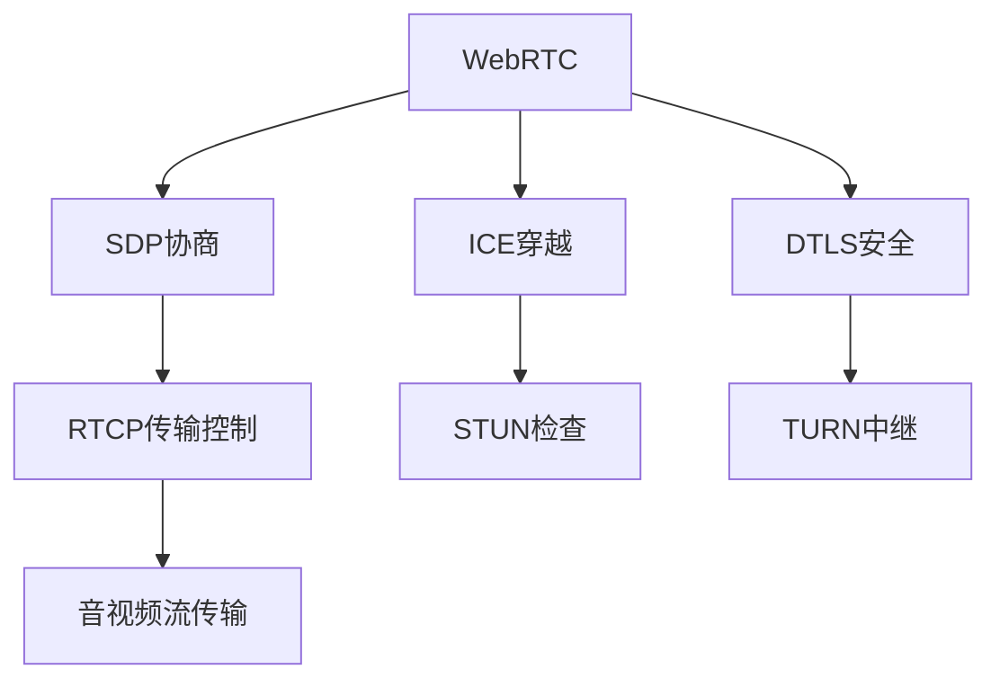

                 

# WebRTC 实时通信协议：在浏览器中实现互动

> 关键词：WebRTC, 实时通信, 浏览器, 网络协议, 音视频流, 安全, 兼容性

## 1. 背景介绍

在互联网时代，实时通信(Real-Time Communication, RTC)成为人们日常生活中不可或缺的一部分。无论是工作中的远程会议、在线教育，还是个人之间的即时交流，其核心都是实时数据的交换。传统的RTCP协议虽然强大，但局限于中心化的服务器架构，不够灵活，无法满足当今日益多样化的通信需求。因此，WebRTC作为一种基于浏览器的实时通信协议应运而生，成为现代RTCP解决方案的重要补充。

WebRTC由Google提出，是一个网络协议和应用程序接口(API)的集合，允许浏览器之间直接进行音视频流传输，无需通过服务器中转。其核心目标是实现点对点的实时通信，消除中心化服务器的瓶颈，提升传输效率，降低成本，保障数据安全。

WebRTC的提出标志着Web通信领域的一次革命。它使Web开发人员能够在浏览器中直接实现音视频通信，无需编写额外的服务器端代码。这种去中心化的通信方式不仅提升了用户体验，也极大地降低了应用开发的复杂度。

## 2. 核心概念与联系

### 2.1 核心概念概述

为了更好地理解WebRTC协议，本节将介绍几个关键概念：

- **WebRTC**：由Google提出的一种网络协议和API，支持浏览器之间的点对点音视频通信，无需中心化服务器。
- **RTCP**：一种实时传输控制协议，用于控制和管理音视频流的传输，包括媒体流协商、流量控制、丢包处理等。
- **SDP**：会话描述协议，用于描述音视频流的媒体格式、编解码器、传输协议等信息，是WebRTC协商的基础。
- **ICE**：互连网络工程，用于穿越NAT和防火墙等网络障碍，实现点对点连接。
- **DTLS**：传输层安全性协议，提供加密和完整性保护，保障音视频数据的安全传输。
- **STUN**：检查UDP端口是否被NAT/防火墙封锁的STries Network Usage-Independent等价技术。
- **TURN**：Traversal Using Relays around NAT，当ICE无法穿越网络时，用于中继音视频数据。

这些核心概念共同构成了WebRTC的通信协议和实现框架。通过理解这些概念，我们可以更好地把握WebRTC的工作原理和优化方向。

### 2.2 核心概念原理和架构的 Mermaid 流程图



这个流程图展示了WebRTC的核心组件和通信流程：

1. **WebRTC** 作为上层应用，负责音视频流的协商和传输控制。
2. **SDP协商**：通过SDP描述音视频流的格式和编解码器信息，WebRTC交换SDP消息，协商媒体流配置。
3. **ICE穿越**：WebRTC使用ICE协议，检查双方穿越NAT和防火墙的能力，建立点对点连接。
4. **DTLS安全**：使用DTLS协议，对音视频数据进行加密和完整性保护，确保数据安全传输。
5. **RTCP传输控制**：RTCP协议用于控制音视频流的传输质量，包括流量控制、丢包处理等。
6. **STUN检查**：在ICE穿越失败时，WebRTC使用STUN协议检查NAT和防火墙状态，优化穿越能力。
7. **TURN中继**：当ICE无法建立点对点连接时，WebRTC使用TURN协议中继音视频数据，实现穿越。

## 3. 核心算法原理 & 具体操作步骤
### 3.1 算法原理概述

WebRTC的核心算法原理主要包括SDP协商、ICE穿越、DTLS安全和音视频流传输。下面将对每个核心算法进行详细介绍。

### 3.2 算法步骤详解

#### 3.2.1 SDP协商

SDP协商是WebRTC中音视频通信的第一步，用于描述媒体流的格式、编解码器和传输协议等信息。

1. **发送方创建SDP**：发送方首先使用`setlocal()`方法创建本地SDP描述，包含媒体类型、编解码器、RTCP端口、传输协议等信息。
2. **发送方发送SDP**：使用`setremotedesc()`方法发送远程SDP描述，进行接收端的配置协商。
3. **接收方创建SDP**：接收方收到SDP描述后，使用`setremote()`方法创建远程SDP描述。
4. **接收方发送ACK**：发送ACK消息确认协商完成，接收方使用`setremotedesc()`方法发送确认信息。
5. **协商成功**：一旦协商成功，双方开始进行音视频流传输。

#### 3.2.2 ICE穿越

ICE穿越是WebRTC中连接协商的关键步骤，用于穿越NAT和防火墙等网络障碍，建立点对点连接。

1. **发送方创建STUN请求**：发送方首先使用`createPeerConnection()`方法创建`PeerConnection`对象，并使用`get ice candidates()`方法获取本地STUN请求。
2. **发送方发送STUN请求**：使用`set ice candidates()`方法发送本地STUN请求。
3. **接收方接收STUN请求**：接收方使用`set ice candidates()`方法接收远程STUN请求，并使用`setice candidate()`方法发送ACK消息。
4. **接收方检查NAT状态**：接收方使用`check()`方法检查NAT状态，确保连接成功。
5. **连接成功**：一旦连接成功，双方开始进行音视频流传输。

#### 3.2.3 DTLS安全

DTLS安全是WebRTC中音视频数据传输的保障，通过加密和完整性保护，确保数据安全。

1. **发送方加密数据**：发送方使用`setlocaldesc()`方法创建本地描述，使用DTLS协议对数据进行加密。
2. **接收方接收数据**：接收方使用`setremotedesc()`方法创建远程描述，使用DTLS协议解密数据。
3. **数据传输**：双方使用DTLS协议保障数据的完整性和安全性。

#### 3.2.4 音视频流传输

音视频流传输是WebRTC中实际数据传输的核心步骤，包括编码、解码、传输和重传等环节。

1. **编码**：发送方使用`encode()`方法对音视频数据进行编码，转换为适合传输的格式。
2. **传输**：使用`send()`方法将编码后的数据发送给接收方。
3. **解码**：接收方使用`decode()`方法对数据进行解码，还原成原始格式。
4. **重传**：使用`retransmit()`方法对丢失的数据进行重传，确保数据完整性。

### 3.3 算法优缺点

#### 3.3.1 优点

WebRTC作为浏览器中的实时通信协议，具有以下优点：

1. **去中心化**：无需中心化服务器，减少了通信延迟和单点故障风险，提高了系统的可扩展性和可靠性。
2. **浏览器兼容性**：通过JavaScript API实现，无需安装额外的客户端软件，具有良好的浏览器兼容性。
3. **低延迟**：基于浏览器，避免了网络代理和数据转发，降低了通信延迟。
4. **实时性**：支持音视频流传输，可以实现低延迟、高带宽的实时通信。
5. **安全性**：使用DTLS加密和完整性保护，保障数据安全。

#### 3.3.2 缺点

WebRTC作为一种新兴的实时通信协议，也存在一些不足之处：

1. **依赖浏览器**：WebRTC的实现依赖于浏览器的兼容性和API支持，不同浏览器可能存在差异。
2. **性能瓶颈**：WebRTC在大规模并发时，可能会面临性能瓶颈，尤其是在数据传输频繁的实时通信场景中。
3. **安全性挑战**：虽然DTLS提供了加密保护，但在实际应用中，仍然存在被攻击的风险。
4. **兼容性问题**：WebRTC的兼容性问题可能会影响其在不同环境中的使用效果。
5. **开发复杂性**：尽管WebRTC简化了音视频通信，但实际开发过程中仍然需要考虑音频编解码、视频编解码、RTCP传输等复杂问题。

### 3.4 算法应用领域

WebRTC在多个领域得到了广泛的应用，例如：

1. **视频会议**：WebRTC支持点对点音视频通信，适用于实时视频会议。
2. **在线教育**：WebRTC可以用于在线课堂的音视频传输，提升教学互动性。
3. **远程医疗**：WebRTC可以实现医生与患者之间的实时通信，提高远程诊疗效率。
4. **在线办公**：WebRTC支持远程团队协作，简化办公流程。
5. **游戏直播**：WebRTC可以用于游戏直播的音视频传输，提升用户体验。
6. **虚拟现实**：WebRTC支持VR设备的音视频通信，提供沉浸式体验。
7. **智能家居**：WebRTC可以用于智能家居设备的音视频控制和交互。

WebRTC的应用领域非常广泛，几乎涵盖了所有需要实时通信的场景。

## 4. 数学模型和公式 & 详细讲解 & 举例说明

### 4.1 数学模型构建

为了更好地理解WebRTC的通信原理，本节将使用数学语言对其中的关键算法进行更加严格的刻画。

#### 4.1.1 SDP协商

SDP协商的主要目标是描述音视频流的格式、编解码器和传输协议等信息。其数学模型如下：

1. **本地SDP描述**：
   $$
   LocalSDP = SDP(\{type, codec, port, protocol\})
   $$

2. **远程SDP描述**：
   $$
   RemoteSDP = SDP(\{type, codec, port, protocol\})
   $$

其中，`type`表示媒体类型，`codec`表示编解码器，`port`表示传输端口，`protocol`表示传输协议。

#### 4.1.2 ICE穿越

ICE穿越的主要目标是穿越NAT和防火墙等网络障碍，建立点对点连接。其数学模型如下：

1. **本地STUN请求**：
   $$
   LocalSTUN = STUN(\{candidate\})
   $$

2. **远程STUN请求**：
   $$
   RemoteSTUN = STUN(\{candidate\})
   $$

其中，`candidate`表示STUN请求的IP地址和端口信息。

#### 4.1.3 DTLS安全

DTLS安全的主要目标是保障音视频数据的加密和完整性保护。其数学模型如下：

1. **本地描述**：
   $$
   LocalDesc = DTLS(\{key, IV\})
   $$

2. **远程描述**：
   $$
   RemoteDesc = DTLS(\{key, IV\})
   $$

其中，`key`表示加密密钥，`IV`表示初始化向量。

### 4.2 公式推导过程

以下我们将对SDP协商、ICE穿越和DTLS安全的数学模型进行推导：

#### 4.2.1 SDP协商

SDP协商的数学推导过程如下：

1. **本地SDP描述**：
   $$
   LocalSDP = SDP(\{type, codec, port, protocol\})
   $$

2. **发送方发送SDP**：
   $$
   SendSDP(LocalSDP)
   $$

3. **接收方创建SDP**：
   $$
   RemoteSDP = SDP(\{type, codec, port, protocol\})
   $$

4. **接收方发送ACK**：
   $$
   SendACK()
   $$

5. **协商成功**：
   $$
   Success()
   $$

#### 4.2.2 ICE穿越

ICE穿越的数学推导过程如下：

1. **发送方创建STUN请求**：
   $$
   LocalSTUN = STUN(\{candidate\})
   $$

2. **发送方发送STUN请求**：
   $$
   SendSTUN(LocalSTUN)
   $$

3. **接收方接收STUN请求**：
   $$
   ReceiveSTUN(LocalSTUN)
   $$

4. **接收方检查NAT状态**：
   $$
   CheckNAT()
   $$

5. **连接成功**：
   $$
   ConnectionEstablished()
   $$

#### 4.2.3 DTLS安全

DTLS安全的数学推导过程如下：

1. **本地描述**：
   $$
   LocalDesc = DTLS(\{key, IV\})
   $$

2. **发送方加密数据**：
   $$
   EncryptData(LocalDesc, Data)
   $$

3. **接收方接收数据**：
   $$
   DecryptData(RemoteDesc, EncryptedData)
   $$

4. **数据传输**：
   $$
   SendData(EncryptedData)
   $$

5. **重传**：
   $$
   Retransmit()
   $$

### 4.3 案例分析与讲解

下面以一个简单的WebRTC通信场景为例，对SDP协商、ICE穿越和DTLS安全进行案例分析。

#### 案例场景

假设有两个用户A和B，需要进行实时视频通话。A和B都使用浏览器打开WebRTC页面，通过JavaScript API进行连接。

1. **SDP协商**：A首先创建一个本地SDP描述，包含媒体类型、编解码器、RTCP端口和传输协议等信息。然后将本地SDP描述发送给B，B收到SDP描述后，使用JavaScript API创建远程SDP描述，并发送ACK消息。一旦协商成功，双方开始进行音视频流传输。

2. **ICE穿越**：A使用JavaScript API获取本地STUN请求，发送给B。B使用JavaScript API接收STUN请求，并使用ICE协议检查NAT状态，建立点对点连接。一旦连接成功，双方开始进行音视频流传输。

3. **DTLS安全**：A和B使用JavaScript API创建本地和远程描述，使用DTLS协议对数据进行加密和完整性保护。一旦连接成功，双方开始进行音视频流传输，使用DTLS保障数据的安全性。

## 5. 项目实践：代码实例和详细解释说明

### 5.1 开发环境搭建

在进行WebRTC项目实践前，我们需要准备好开发环境。以下是使用JavaScript实现WebRTC开发的步骤：

1. 安装Node.js：从官网下载并安装Node.js，用于运行JavaScript代码。
2. 安装WebRTC库：使用npm安装WebRTC库，如SimpleWebRTC、RTCPeerConnection等。
3. 创建项目文件夹：使用npm初始化项目，创建一个新的JavaScript项目。
4. 编写代码：在项目中编写JavaScript代码，实现音视频流的传输。

完成上述步骤后，即可在项目中开始WebRTC开发。

### 5.2 源代码详细实现

下面我们以一个简单的WebRTC视频通话示例，给出JavaScript代码实现。

#### 5.2.1 创建PeerConnection

```javascript
var pc = new RTCPeerConnection();
```

#### 5.2.2 添加媒体流

```javascript
pc.addStream(stream);
```

#### 5.2.3 添加ICE候选人

```javascript
pc.addIceCandidate(candidate);
```

#### 5.2.4 添加DTLS安全描述

```javascript
pc.setLocalDescription(sdp);
pc.setRemoteDescription(sdp);
pc.createOffer().then(function(offer) {
    pc.setLocalDescription(offer);
    sendIceCandidates();
});
```

#### 5.2.5 发送ICE候选人

```javascript
pc.addIceCandidate(candidate);
```

#### 5.2.6 发送DTLS安全描述

```javascript
pc.setLocalDescription(sdp);
pc.setRemoteDescription(sdp);
pc.createOffer().then(function(offer) {
    pc.setLocalDescription(offer);
    sendIceCandidates();
});
```

#### 5.2.7 建立连接

```javascript
pc.onicecandidate.add(function(event) {
    if (event.candidate) {
        peerConnection.addIceCandidate(event.candidate);
    } else {
        pc.createAnswer().then(function(answer) {
            pc.setLocalDescription(answer);
            sendIceCandidates();
        });
    }
});
```

#### 5.2.8 发送音视频流

```javascript
var videoStream = new MediaStream({ video: true });
var videoElement = document.getElementById('video');
videoElement.srcObject = videoStream;
videoElement.play();
```

### 5.3 代码解读与分析

让我们再详细解读一下关键代码的实现细节：

1. **创建PeerConnection**：使用`RTCPeerConnection`类创建PeerConnection对象，用于管理音视频流和连接状态。
2. **添加媒体流**：使用`addStream`方法添加媒体流，如摄像头、麦克风等。
3. **添加ICE候选人**：使用`addIceCandidate`方法添加ICE候选人，用于穿越NAT和防火墙。
4. **添加DTLS安全描述**：使用`setLocalDescription`和`setRemoteDescription`方法设置本地和远程描述，使用`createOffer`方法创建Offer描述，使用`sendIceCandidates`方法发送ICE候选人。
5. **发送ICE候选人**：使用`addIceCandidate`方法添加ICE候选人，用于穿越NAT和防火墙。
6. **发送DTLS安全描述**：使用`setLocalDescription`和`setRemoteDescription`方法设置本地和远程描述，使用`createOffer`方法创建Offer描述，使用`sendIceCandidates`方法发送ICE候选人。
7. **建立连接**：使用`onicecandidate`事件监听器监听ICE候选人，一旦收到ICE候选人，则添加到PeerConnection中。如果没有收到ICE候选人，则使用`createAnswer`方法创建Answer描述，发送给远程端。
8. **发送音视频流**：使用`MediaStream`类创建媒体流，并使用`srcObject`属性绑定到视频元素，使用`play`方法播放。

以上代码实现了基本的WebRTC音视频通话功能，包括创建PeerConnection、添加媒体流、添加ICE候选人和发送DTLS安全描述等关键步骤。

### 5.4 运行结果展示

完成代码编写后，可以在浏览器中运行该WebRTC应用，进行实时视频通话。具体运行结果包括：

1. **创建PeerConnection**：PeerConnection对象成功创建，表示音视频流和连接状态管理成功。
2. **添加媒体流**：媒体流成功添加，如摄像头、麦克风等。
3. **添加ICE候选人**：ICE候选人成功添加，表示NAT和防火墙穿越成功。
4. **添加DTLS安全描述**：DTLS安全描述成功设置，表示数据加密和完整性保护成功。
5. **发送音视频流**：音视频流成功发送，接收方可以通过视频元素实时接收和播放。

## 6. 实际应用场景

### 6.1 智能家居

WebRTC在智能家居中的应用主要集中在远程监控和控制。通过WebRTC，智能家居设备可以通过浏览器直接进行音视频通信，实现远程监控和控制。

1. **远程监控**：通过WebRTC，智能家居设备可以将摄像头视频流传输到用户浏览器中，实现远程监控。用户可以通过WebRTC应用实时查看家中情况，甚至控制智能家居设备，提升家庭安全性和便利性。
2. **远程控制**：通过WebRTC，智能家居设备可以通过浏览器实现远程控制，如开启灯光、调整温度、开关电器等。用户可以通过WebRTC应用控制智能家居设备，提升家庭便捷性。

### 6.2 远程医疗

WebRTC在远程医疗中的应用主要集中在远程诊断和远程手术。通过WebRTC，医生和患者可以通过浏览器直接进行音视频通信，实现远程诊断和手术。

1. **远程诊断**：通过WebRTC，医生和患者可以通过浏览器进行远程视频通话，医生可以实时查看患者的情况，进行诊断。患者可以通过WebRTC应用传输健康数据，医生可以远程进行检查和诊断，提升医疗效率。
2. **远程手术**：通过WebRTC，医生和手术团队可以通过浏览器进行远程手术，医生可以实时传输手术画面和操作指令，手术团队可以通过WebRTC应用进行实时互动，提升手术质量和安全性。

### 6.3 在线教育

WebRTC在在线教育中的应用主要集中在远程教学和在线互动。通过WebRTC，在线教育平台可以通过浏览器直接进行音视频通信，实现远程教学和在线互动。

1. **远程教学**：通过WebRTC，在线教育平台可以将教师的音视频流传输到学生浏览器中，实现远程教学。学生可以通过WebRTC应用实时接收和播放教师的音视频流，提升学习效果。
2. **在线互动**：通过WebRTC，在线教育平台可以实现学生之间的互动，如讨论、提问、分享等。学生可以通过WebRTC应用进行实时互动，提升学习氛围和参与度。

### 6.4 未来应用展望

随着WebRTC技术的不断发展，其在多个领域的应用前景将更加广阔。

1. **虚拟现实**：WebRTC可以用于虚拟现实设备的音视频通信，提升沉浸式体验。通过WebRTC，虚拟现实设备可以通过浏览器实现实时通信，提升虚拟现实体验。
2. **游戏直播**：WebRTC可以用于游戏直播的音视频传输，提升游戏体验。通过WebRTC，游戏直播平台可以通过浏览器实现实时通信，提升直播质量和用户互动性。
3. **企业办公**：WebRTC可以用于企业办公的音视频通信，提升办公效率。通过WebRTC，企业办公平台可以通过浏览器实现远程会议、视频电话等，提升办公便捷性和协作效率。
4. **智慧城市**：WebRTC可以用于智慧城市的音视频通信，提升城市管理效率。通过WebRTC，智慧城市平台可以通过浏览器实现实时监控、应急指挥等，提升城市安全性和管理效率。

总之，WebRTC作为浏览器中的实时通信协议，具有广泛的应用前景和巨大的发展潜力，将在多个领域发挥重要作用，为人们的生活和工作带来新的便捷和变革。

## 7. 工具和资源推荐

### 7.1 学习资源推荐

为了帮助开发者系统掌握WebRTC的原理和实践，这里推荐一些优质的学习资源：

1. WebRTC官方文档：WebRTC官方文档提供了详细的API文档和示例代码，是学习WebRTC的重要参考资料。
2. Google WebRTC教程：Google官方提供了详细的WebRTC教程，从基础到高级，涵盖各个方面，是学习WebRTC的绝佳资源。
3. SimpleWebRTC官方文档：SimpleWebRTC是WebRTC的一个流行库，提供了丰富的API和示例代码，是学习WebRTC的重要资源。
4. Real-Time WebRTC应用开发：这是一本WebRTC技术书籍，涵盖WebRTC的原理和实践，适合进阶学习。
5. WebRTC在中国：这是一本WebRTC技术书籍，适合中文读者，涵盖WebRTC的原理和实践，适合中文读者。

通过对这些资源的学习，相信你一定能够快速掌握WebRTC的精髓，并用于解决实际的音视频通信问题。

### 7.2 开发工具推荐

高效的开发离不开优秀的工具支持。以下是几款用于WebRTC开发的常用工具：

1. Visual Studio Code：VS Code是一款轻量级、功能强大的IDE，支持JavaScript开发，适合WebRTC应用开发。
2. WebStorm：WebStorm是JetBrains公司开发的一款Web开发IDE，支持JavaScript、TypeScript等语言，适合WebRTC应用开发。
3. Brackets：Brackets是Adobe公司开发的一款Web开发IDE，支持JavaScript、HTML、CSS等语言，适合WebRTC应用开发。
4. Atom：Atom是一款轻量级、开源的IDE，支持JavaScript、TypeScript等语言，适合WebRTC应用开发。
5. WebRTC API测试工具：如WebRTC Test Site、Webrtc-test等，用于测试WebRTC应用的音视频通信效果，确保应用质量。

合理利用这些工具，可以显著提升WebRTC开发的效率，加快创新迭代的步伐。

### 7.3 相关论文推荐

WebRTC技术的发展得益于学界的持续研究。以下是几篇奠基性的相关论文，推荐阅读：

1. WebRTC技术综述：由WebRTC团队编写，全面介绍了WebRTC的原理和实践，适合技术开发者阅读。
2. WebRTC标准文档：WebRTC标准文档提供了详细的WebRTC规范和API，适合技术开发者阅读。
3. WebRTC安全性分析：研究WebRTC的安全性问题，提出了改进建议，适合技术开发者阅读。
4. WebRTC性能优化：研究WebRTC的性能优化问题，提出了改进建议，适合技术开发者阅读。
5. WebRTC应用场景分析：研究WebRTC在各个领域的应用场景，提出了改进建议，适合技术开发者阅读。

这些论文代表了WebRTC技术的发展脉络。通过学习这些前沿成果，可以帮助研究者把握学科前进方向，激发更多的创新灵感。

## 8. 总结：未来发展趋势与挑战

### 8.1 总结

本文对WebRTC实时通信协议进行了全面系统的介绍。首先阐述了WebRTC协议的背景和意义，明确了其在浏览器中的实时通信优势。其次，从原理到实践，详细讲解了WebRTC的核心算法和具体操作步骤，给出了WebRTC应用开发的完整代码实例。同时，本文还广泛探讨了WebRTC在智能家居、远程医疗、在线教育等多个领域的应用前景，展示了WebRTC技术的广阔前景。

通过本文的系统梳理，可以看到，WebRTC作为浏览器中的实时通信协议，正在成为现代RTCP解决方案的重要补充。它通过点对点的通信方式，简化了音视频流传输的复杂性，提升了实时通信的效率和安全性。未来，随着WebRTC技术的不断成熟和普及，其在实时通信领域的地位将更加稳固，成为构建智能互联社会的基石。

### 8.2 未来发展趋势

展望未来，WebRTC技术将呈现以下几个发展趋势：

1. **性能优化**：WebRTC在大规模并发时面临性能瓶颈，未来需要进一步优化算法和数据结构，提升音视频流的传输效率。
2. **安全性增强**：WebRTC在安全性方面仍存在挑战，未来需要引入更多加密技术和身份认证机制，保障音视频数据的安全。
3. **跨平台支持**：WebRTC的跨平台支持仍有提升空间，未来需要进一步优化跨浏览器和跨设备的兼容性，提升用户体验。
4. **协议标准化**：WebRTC协议标准仍在不断发展中，未来需要进一步完善标准化工作，提升互操作性。
5. **应用场景拓展**：WebRTC在多个领域的应用前景广阔，未来需要进一步拓展应用场景，推动WebRTC技术的普及和应用。
6. **新兴技术融合**：WebRTC需要与其他新兴技术进行更深入的融合，如区块链、人工智能等，提升音视频通信的智能化水平。

以上趋势凸显了WebRTC技术的发展潜力。这些方向的探索发展，必将进一步提升WebRTC的性能和安全性，拓展其在不同领域的应用范围。

### 8.3 面临的挑战

尽管WebRTC技术已经取得了瞩目成就，但在迈向更加智能化、普适化应用的过程中，它仍面临诸多挑战：

1. **浏览器兼容性**：WebRTC的兼容性问题可能会影响其在不同环境中的使用效果，需要进一步优化跨浏览器和跨设备的兼容性。
2. **性能瓶颈**：WebRTC在大规模并发时，可能会面临性能瓶颈，尤其是在数据传输频繁的实时通信场景中。
3. **安全性问题**：WebRTC在安全性方面仍存在挑战，需要引入更多加密技术和身份认证机制，保障音视频数据的安全。
4. **标准化问题**：WebRTC协议标准仍在不断发展中，需要进一步完善标准化工作，提升互操作性。
5. **开发复杂性**：WebRTC的开发复杂性较高，需要开发者具备一定的音视频通信和JavaScript编程能力。

### 8.4 研究展望

面对WebRTC面临的挑战，未来的研究需要在以下几个方面寻求新的突破：

1. **性能优化**：开发更高效的音视频编解码算法和传输协议，提升WebRTC的音视频通信性能。
2. **安全性增强**：引入更多加密技术和身份认证机制，保障WebRTC的音视频数据安全。
3. **跨平台支持**：优化WebRTC的跨浏览器和跨设备的兼容性，提升用户体验。
4. **标准化工作**：进一步完善WebRTC协议标准化工作，提升互操作性。
5. **应用场景拓展**：拓展WebRTC在更多领域的应用场景，推动WebRTC技术的普及和应用。
6. **新兴技术融合**：将WebRTC与其他新兴技术进行更深入的融合，提升音视频通信的智能化水平。

这些研究方向的探索，必将引领WebRTC技术迈向更高的台阶，为构建智能互联社会的目标贡献力量。

## 9. 附录：常见问题与解答

**Q1：WebRTC的性能瓶颈是什么？**

A: WebRTC在大规模并发时可能会面临性能瓶颈，尤其是在数据传输频繁的实时通信场景中。这是因为WebRTC在大规模并发时，会占用大量的网络带宽和计算资源，导致系统性能下降。为了缓解这一问题，可以采用数据压缩、CDN加速、负载均衡等技术进行优化。

**Q2：WebRTC的安全性问题有哪些？**

A: WebRTC在安全性方面仍存在挑战，主要问题包括：

1. **数据篡改**：WebRTC中的音视频数据可能会被篡改，导致数据失真或伪造。
2. **身份认证**：WebRTC需要身份认证机制，防止恶意用户冒充合法用户。
3. **NAT穿透**：WebRTC需要穿越NAT和防火墙，但NAT穿透问题可能会影响音视频通信的稳定性。

为了提升WebRTC的安全性，可以引入更多加密技术和身份认证机制，如SSL/TLS、X.509证书、OAuth等。

**Q3：WebRTC的兼容性问题有哪些？**

A: WebRTC的兼容性问题可能会影响其在不同环境中的使用效果，主要问题包括：

1. **浏览器兼容性**：不同浏览器对WebRTC的支持程度不同，可能会导致功能缺失或性能问题。
2. **设备兼容性**：WebRTC需要支持多种设备类型，如PC、手机、平板等，不同设备之间的兼容性问题需要进一步优化。

为了提升WebRTC的兼容性，可以采用Polyfill技术、兼容性检测等措施，确保WebRTC在各种环境中的稳定运行。

**Q4：WebRTC的应用场景有哪些？**

A: WebRTC在多个领域得到了广泛的应用，主要场景包括：

1. **视频会议**：WebRTC支持点对点音视频通信，适用于实时视频会议。
2. **在线教育**：WebRTC可以用于在线课堂的音视频传输，提升教学互动性。
3. **远程医疗**：WebRTC可以实现医生与患者之间的实时通信，提高远程诊疗效率。
4. **企业办公**：WebRTC可以用于企业办公的音视频通信，提升办公效率。
5. **游戏直播**：WebRTC可以用于游戏直播的音视频传输，提升游戏体验。
6. **虚拟现实**：WebRTC可以用于虚拟现实设备的音视频通信，提升沉浸式体验。

这些应用场景展示了WebRTC技术的广泛应用前景。

**Q5：WebRTC的开发复杂性有哪些？**

A: WebRTC的开发复杂性较高，主要问题包括：

1. **音视频编解码**：WebRTC需要实现音视频编解码算法，需要具备一定的信号处理和图像处理能力。
2. **RTCP协议**：WebRTC需要实现RTCP协议，需要具备一定的网络编程能力。
3. **ICE穿越**：WebRTC需要实现ICE穿越算法，需要具备一定的网络穿透能力。

为了降低WebRTC的开发复杂性，可以采用WebRTC库和框架，如SimpleWebRTC、webrtc.org等，简化开发过程。

---

作者：禅与计算机程序设计艺术 / Zen and the Art of Computer Programming

