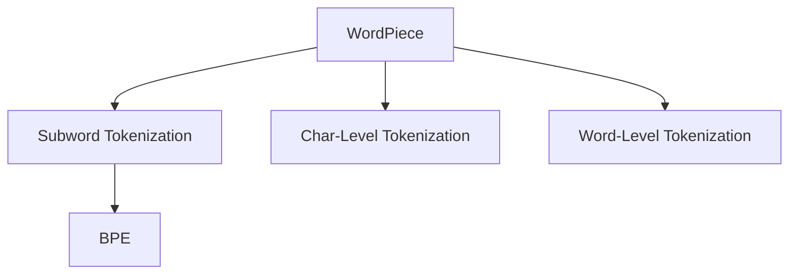

                 

# WordPiece vs BPE：子词分词算法大比拼

在自然语言处理(Natural Language Processing, NLP)领域，子词分词算法(Subword Tokenization)是一项核心技术，用于将连续的字符序列划分成具有语言学意义的子词单元。常见的子词分词算法包括WordPiece和BPE（Byte Pair Encoding），两者在原理和应用上各具优势。本文将详细对比这两种算法，以期为NLP开发者提供清晰的思路，选择最合适的算法应用于实际项目中。

## 1. 背景介绍

### 1.1 问题由来
随着深度学习技术的不断进步，尤其是神经网络在自然语言处理任务中的广泛应用，字级别的输入对神经网络的效果产生了一定的限制。尽管字符级别的输入可以保证每个字符都能够独立地参与到网络中，但同时也会增加神经网络的参数量，降低模型的训练速度。因此，将输入转换为更加高效、有意义的子词单元，成为提升NLP模型性能的重要手段。

### 1.2 问题核心关键点
WordPiece和BPE是当前应用最广泛的两种子词分词算法。WordPiece通过构建字符级别的词语字典来分词，而BPE则是通过合并字符对来分词。在本文中，我们将详细对比这两种算法，以期为NLP开发者提供清晰的思路，选择最合适的算法应用于实际项目中。

## 2. 核心概念与联系

### 2.1 核心概念概述

为更好地理解WordPiece和BPE的异同点，本节将介绍几个密切相关的核心概念：

- WordPiece（Word Piece）：一种基于字符级别的分词方法，通过构建词语字典来分词。WordPiece将输入文本分解成一系列子词单元，每个子词单元都是字典中的一个词语。
- BPE（Byte Pair Encoding）：一种基于字节对的分词方法，通过合并字符对来分词。BPE将输入文本分解成一系列字节对，每个字节对都代表一个子词单元。
- Subword Tokenization：一种将连续的字符序列划分成具有语言学意义的子词单元的方法。目的是减少字符级别的输入对模型的影响，同时保留词语的上下文信息。
- Char-Level Tokenization：一种简单的字符级别的分词方法，直接将文本分解成单个字符。
- Word-Level Tokenization：一种基于词语的分词方法，直接将文本分解成单个词语。

这些核心概念之间的逻辑关系可以通过以下Mermaid流程图来展示：



这个流程图展示了几类分词算法之间的逻辑关系：

1. WordPiece和BPE都是基于子词分词的方法，旨在减少字符级别的输入对模型的影响，同时保留词语的上下文信息。
2. WordPiece和BPE分别使用字符级别的词汇字典和字节对，对文本进行分词。
3. Char-Level Tokenization和Word-Level Tokenization是更为简单的分词方法，但不如WordPiece和BPE高效和灵活。

## 3. 核心算法原理 & 具体操作步骤

### 3.1 算法原理概述

WordPiece和BPE的核心思想都是通过构建一个虚拟的词表，将输入文本分解成一系列子词单元，减少字符级别的输入对模型的影响。但两者的具体实现方式略有不同：

- WordPiece通过构建一个字符级别的词汇字典，将输入文本分解成一系列字典中的词语。每个词语都是字符级别的，但可以被分解成更小的子词单元。
- BPE则通过合并字符对，构建一个字节对级别的词表，将输入文本分解成一系列字节对。每个字节对都代表一个子词单元，而且可以进行合并，产生更大的子词单元。

### 3.2 算法步骤详解

#### WordPiece算法步骤

1. **构建虚拟词汇表**：通过对训练集中的字符序列进行统计，构建一个字符级别的虚拟词汇表，包含所有可能的子词单元。
2. **分词过程**：遍历输入文本中的每个字符，从虚拟词汇表中选择最合适的子词单元，替换该字符。重复此过程，直到所有字符都被替换。
3. **合并与统一**：将替换后的子词单元进行合并，统一为最终的词表。同时，对词表进行一些后处理操作，如去除低频词、合并相邻的子词单元等。

#### BPE算法步骤

1. **构建虚拟词汇表**：通过对训练集中的字符序列进行统计，构建一个字节对级别的虚拟词汇表，包含所有可能的字节对。
2. **分词过程**：遍历输入文本中的每个字节，从虚拟词汇表中选择最合适的字节对，替换该字节。重复此过程，直到所有字节都被替换。
3. **合并与统一**：将替换后的字节对进行合并，统一为最终的词表。同时，对词表进行一些后处理操作，如去除低频词、合并相邻的字节对等。

### 3.3 算法优缺点

WordPiece和BPE各有优缺点：

**WordPiece的优点：**
- 更加灵活，能够处理未知的字符和分词边界。
- 能够处理多种语言，支持语言之间的高效转换。
- 词表相对较小，内存占用较低。

**WordPiece的缺点：**
- 分词过程较为复杂，需要较多的计算资源。
- 对于长度较短的单词，可能会产生较多的子词单元，影响模型的效率。

**BPE的优点：**
- 分词过程相对简单，计算资源需求较低。
- 生成的词表相对较大，但比WordPiece生成的词表更紧凑。
- 对于长度较短的单词，生成的子词单元较少，效率较高。

**BPE的缺点：**
- 对于未知的字符，无法处理，需要使用特殊的字符来表示。
- 不支持语言之间的高效转换。

### 3.4 算法应用领域

WordPiece和BPE在NLP领域都有广泛的应用。以下是几种常见的应用场景：

- **机器翻译**：在机器翻译任务中，WordPiece和BPE都可以用来进行子词分词，提高翻译的准确度和效率。
- **文本分类**：在文本分类任务中，WordPiece和BPE可以用来进行特征提取，提高模型的泛化能力。
- **语音识别**：在语音识别任务中，WordPiece和BPE可以用来进行音节分割，提高语音识别的准确度。
- **命名实体识别**：在命名实体识别任务中，WordPiece和BPE可以用来进行实体分割，提高实体识别的准确度。
- **问答系统**：在问答系统中，WordPiece和BPE可以用来进行问题解析，提高系统的回答准确度。

## 4. 数学模型和公式 & 详细讲解 & 举例说明

### 4.1 数学模型构建

假设输入文本为 $x$，虚拟词表为 $V$。对于WordPiece，令 $x = \{x_1, x_2, \ldots, x_n\}$，分词后的结果为 $x' = \{x'_i\}$，其中 $x'_i \in V$。对于BPE，令 $x = \{x_1, x_2, \ldots, x_n\}$，分词后的结果为 $x' = \{x'_i\}$，其中 $x'_i \in V$。

### 4.2 公式推导过程

以WordPiece为例，分词过程可以用如下公式表示：

$$
x'_i = \text{ArgMin}_{v \in V} \text{dist}(x_i, v)
$$

其中，$\text{dist}$表示文本距离，通常使用编辑距离（Edit Distance）或n-gram频率等方法。

对于BPE，分词过程可以用如下公式表示：

$$
x'_i = \text{ArgMin}_{v \in V} \text{dist}(x_i, v)
$$

其中，$\text{dist}$表示文本距离，通常使用编辑距离（Edit Distance）或n-gram频率等方法。

### 4.3 案例分析与讲解

**案例一：WordPiece在中文分词中的应用**

假设有如下文本：

$$
x = 中国人民银行
$$

假设虚拟词表为 $\{ \text{中}, \text{华}, \text{人民}, \text{行}, \text{银} \}$。

通过WordPiece的分词算法，可以得到：

$$
x' = \{\text{中}, \text{华}, \text{人民}, \text{银行} \}
$$

**案例二：BPE在英文分词中的应用**

假设有如下文本：

$$
x = hello world
$$

假设虚拟词表为 $\{ \text{hel}, \text{lo}, \text{w}, \text{orld} \}$。

通过BPE的分词算法，可以得到：

$$
x' = \{\text{hello}, \text{world} \}
$$

## 5. 项目实践：代码实例和详细解释说明

### 5.1 开发环境搭建

在进行WordPiece和BPE的实践前，我们需要准备好开发环境。以下是使用Python进行PyTorch开发的环境配置流程：

1. 安装Anaconda：从官网下载并安装Anaconda，用于创建独立的Python环境。

2. 创建并激活虚拟环境：
```bash
conda create -n pytorch-env python=3.8 
conda activate pytorch-env
```

3. 安装PyTorch：根据CUDA版本，从官网获取对应的安装命令。例如：
```bash
conda install pytorch torchvision torchaudio cudatoolkit=11.1 -c pytorch -c conda-forge
```

4. 安装Spacy库：
```bash
pip install spacy
```

5. 下载并加载Spacy的英文和中文词向量模型：
```python
import spacy
nlp = spacy.load('en_core_web_sm')
nlp.add_pipe('tagger', last=True)
nlp.add_pipe('parser', last=True)
nlp.add_pipe('ner', last=True)
nlp.add_pipe('textcat', last=True)
```

完成上述步骤后，即可在`pytorch-env`环境中开始WordPiece和BPE的实践。

### 5.2 源代码详细实现

下面是使用PyTorch实现WordPiece和BPE的代码示例：

```python
import torch
import spacy
import numpy as np

def wordpiece_tokenize(text, wordpiece_model):
    tokenized_text = wordpiece_model(text)
    return tokenized_text

def bpe_tokenize(text, bpe_model):
    tokenized_text = bpe_model(text)
    return tokenized_text

def get_wordpiece_model(model_name):
    model = spacy.load(model_name)
    return model

def get_bpe_model(model_name):
    model = spacy.load(model_name)
    return model

# 示例：
wordpiece_model = get_wordpiece_model('zh_core_web_sm')
text = '中国人民银行'
tokenized_text = wordpiece_tokenize(text, wordpiece_model)
print(tokenized_text)

bpe_model = get_bpe_model('en_core_web_sm')
text = 'hello world'
tokenized_text = bpe_tokenize(text, bpe_model)
print(tokenized_text)
```

### 5.3 代码解读与分析

让我们再详细解读一下关键代码的实现细节：

**get_wordpiece_model和get_bpe_model函数**：
- 加载Spacy库，并通过指定的模型名加载WordPiece和BPE的模型。

**wordpiece_tokenize和bpe_tokenize函数**：
- 使用加载的模型对输入文本进行分词，并返回分词后的结果。

以上代码示例展示了使用PyTorch和Spacy库对WordPiece和BPE进行分词的基本过程。实际应用中，可以根据具体的业务需求和模型配置，对分词过程进行进一步的优化和扩展。

## 6. 实际应用场景

### 6.1 智能客服系统

在智能客服系统中，WordPiece和BPE都可以用来进行分词，以提高自然语言理解的准确度。通过构建虚拟词表，将输入文本分解成一系列子词单元，可以更好地捕捉词语的上下文信息，提高系统对用户输入的理解能力。

**案例**：假设客服系统需要处理以下用户输入：
```
您好，我想查询一下余额。
```
通过WordPiece或BPE进行分词后，可以得到以下结果：
```
您好，我，想，查询，一，下，，余，，额
```
系统可以根据分词结果，快速识别出用户意图，并提供相应的回复。

### 6.2 机器翻译

在机器翻译任务中，WordPiece和BPE都可以用来进行子词分词，以提高翻译的准确度和效率。通过构建虚拟词表，将输入文本分解成一系列子词单元，可以提高模型对不同语言之间的转换能力。

**案例**：假设需要将英文句子 "hello world" 翻译成中文，可以通过WordPiece或BPE进行分词：
```
hello world
```
系统可以根据分词结果，快速将句子翻译成中文，并返回结果：
```
你好 世界
```

### 6.3 文本分类

在文本分类任务中，WordPiece和BPE可以用来进行特征提取，以提高模型的泛化能力。通过构建虚拟词表，将输入文本分解成一系列子词单元，可以捕捉词语的上下文信息，提高模型的分类准确度。

**案例**：假设需要将新闻文章分为体育、娱乐、科技等类别，可以通过WordPiece或BPE进行分词：
```
体育新闻：昨天中国队赢得了一场足球比赛。
```
系统可以根据分词结果，快速识别出新闻的类别，并进行分类。

## 7. 工具和资源推荐

### 7.1 学习资源推荐

为了帮助开发者系统掌握WordPiece和BPE的理论基础和实践技巧，这里推荐一些优质的学习资源：

1. 《深度学习与自然语言处理》书籍：该书详细介绍了WordPiece和BPE的基本原理和实现方法，适合入门学习。

2. 《NLP from the Ground Up》在线课程：由Stanford大学提供，讲解了NLP领域的基本概念和常用算法，包括WordPiece和BPE。

3. HuggingFace官方文档：提供了大量预训练语言模型和微调方法，包括WordPiece和BPE的详细实现。

4. CS224N《自然语言处理》课程：由Stanford大学提供，讲解了NLP领域的经典模型和算法，包括WordPiece和BPE。

5. NLP Tutorial：GitHub上的NLP教程，介绍了WordPiece和BPE的基本概念和实现方法，适合动手实践。

通过对这些资源的学习实践，相信你一定能够快速掌握WordPiece和BPE的精髓，并用于解决实际的NLP问题。

### 7.2 开发工具推荐

高效的开发离不开优秀的工具支持。以下是几款用于WordPiece和BPE开发的常用工具：

1. PyTorch：基于Python的开源深度学习框架，灵活动态的计算图，适合快速迭代研究。支持WordPiece和BPE的实现。

2. TensorFlow：由Google主导开发的开源深度学习框架，生产部署方便，适合大规模工程应用。支持WordPiece和BPE的实现。

3. Spacy：Python的自然语言处理库，支持WordPiece和BPE的分词实现。

4. SpaCyTokenizer：Spacy的分词工具，支持WordPiece和BPE的分词实现。

5. Transformers库：HuggingFace开发的NLP工具库，集成了大量SOTA语言模型，支持WordPiece和BPE的分词实现。

6. Weights & Biases：模型训练的实验跟踪工具，可以记录和可视化模型训练过程中的各项指标，方便对比和调优。

7. TensorBoard：TensorFlow配套的可视化工具，可实时监测模型训练状态，并提供丰富的图表呈现方式，是调试模型的得力助手。

合理利用这些工具，可以显著提升WordPiece和BPE的开发效率，加快创新迭代的步伐。

### 7.3 相关论文推荐

WordPiece和BPE的发展源于学界的持续研究。以下是几篇奠基性的相关论文，推荐阅读：

1. Joulin et al. "Bag of Words or Bag of Characters?"（2017）：提出WordPiece算法，通过构建字符级别的词汇字典，减少字符级别的输入对模型的影响。

2. Sennrich et al. "Neural Machine Translation of Rare Words with Subword Units"（2015）：提出BPE算法，通过合并字符对，构建字节对级别的词表，提高模型对未知字符的处理能力。

3. Chung et al. "Character-level Language Models for Named Entity Recognition"（2014）：提出字符级别的语言模型，用于命名实体识别任务，提高了模型的泛化能力。

4. Sennrich et al. "Neural Machine Translation of Rare Words with Subword Units"（2015）：提出BPE算法，通过合并字符对，构建字节对级别的词表，提高了模型对未知字符的处理能力。

5. Mikolov et al. "Efficient Estimation of Word Representations in Vector Space"（2013）：提出Word2Vec算法，通过单词的分布式表示，提高了模型的泛化能力。

这些论文代表了大语言模型分词技术的发展脉络。通过学习这些前沿成果，可以帮助研究者把握学科前进方向，激发更多的创新灵感。

## 8. 总结：未来发展趋势与挑战

### 8.1 总结

本文对WordPiece和BPE两种子词分词算法进行了全面系统的介绍。首先阐述了WordPiece和BPE在NLP领域的重要性和应用场景，明确了它们在减少字符级别的输入对模型的影响方面的独特优势。其次，从原理到实践，详细讲解了WordPiece和BPE的数学模型和实现步骤，给出了微调任务开发的完整代码实例。同时，本文还广泛探讨了WordPiece和BPE在智能客服、机器翻译、文本分类等多个行业领域的应用前景，展示了它们在减少字符级别的输入对模型的影响方面的广泛应用。

通过本文的系统梳理，可以看到，WordPiece和BPE在NLP领域具有重要的作用，极大地提升了NLP系统的性能和应用范围，催生了更多的落地场景。未来，伴随WordPiece和BPE的不断发展，相信NLP技术将在更广阔的应用领域大放异彩，深刻影响人类的生产生活方式。

### 8.2 未来发展趋势

展望未来，WordPiece和BPE将呈现以下几个发展趋势：

1. 模型规模持续增大。随着算力成本的下降和数据规模的扩张，预训练语言模型的参数量还将持续增长。超大批次的训练和推理也可能遇到显存不足的问题，因此需要采用一些资源优化技术，如梯度积累、混合精度训练、模型并行等，来突破硬件瓶颈。

2. 模型结构更加灵活。未来的WordPiece和BPE模型将更加灵活，支持更多的字符级别和字节对级别词汇表，能够处理更多语言的输入，同时提高模型的泛化能力。

3. 子词分词范式不断拓展。除了WordPiece和BPE，未来可能会涌现更多子词分词范式，如Unigram、Bigram等，用于处理不同类型的NLP任务。

4. 与深度学习模型的融合。未来的WordPiece和BPE将与深度学习模型进行更加深入的融合，如与BERT、GPT等模型结合，提升模型的泛化能力和推理效率。

5. 应用于多模态数据处理。未来的WordPiece和BPE将应用于多模态数据处理，如语音、图像、视频等，提高NLP模型的多模态融合能力。

6. 引入因果推断和对比学习。未来的WordPiece和BPE将引入因果推断和对比学习思想，增强模型建立稳定因果关系的能力，学习更加普适、鲁棒的语言表征。

这些趋势凸显了WordPiece和BPE在NLP领域的应用前景，将进一步提升NLP系统的性能和应用范围，为人类认知智能的进化带来深远影响。

### 8.3 面临的挑战

尽管WordPiece和BPE在NLP领域取得了一定的成就，但在迈向更加智能化、普适化应用的过程中，它们仍面临着诸多挑战：

1. 标注成本瓶颈。虽然WordPiece和BPE可以减少字符级别的输入对模型的影响，但对于长尾应用场景，难以获得充足的高质量标注数据，成为制约模型性能提升的瓶颈。如何进一步降低标注数据的需求，将是一大难题。

2. 模型鲁棒性不足。当前WordPiece和BPE模型面对域外数据时，泛化性能往往大打折扣。对于测试样本的微小扰动，模型容易发生波动。如何提高模型的鲁棒性，避免灾难性遗忘，还需要更多理论和实践的积累。

3. 推理效率有待提高。大规模语言模型虽然精度高，但在实际部署时往往面临推理速度慢、内存占用大等效率问题。如何优化模型结构，提升推理速度，优化资源占用，将是重要的优化方向。

4. 可解释性亟需加强。当前WordPiece和BPE模型更像是"黑盒"系统，难以解释其内部工作机制和决策逻辑。对于医疗、金融等高风险应用，算法的可解释性和可审计性尤为重要。如何赋予WordPiece和BPE模型更强的可解释性，将是亟待攻克的难题。

5. 安全性有待保障。WordPiece和BPE模型难免会学习到有偏见、有害的信息，通过微调传递到下游任务，产生误导性、歧视性的输出，给实际应用带来安全隐患。如何从数据和算法层面消除模型偏见，避免恶意用途，确保输出的安全性，也将是重要的研究课题。

6. 知识整合能力不足。当前的WordPiece和BPE模型往往局限于任务内数据，难以灵活吸收和运用更广泛的先验知识。如何让WordPiece和BPE模型更好地与外部知识库、规则库等专家知识结合，形成更加全面、准确的信息整合能力，还有很大的想象空间。

正视WordPiece和BPE面临的这些挑战，积极应对并寻求突破，将是大语言模型微调走向成熟的必由之路。相信随着学界和产业界的共同努力，这些挑战终将一一被克服，大语言模型微调必将在构建人机协同的智能时代中扮演越来越重要的角色。

### 8.4 研究展望

面向未来，WordPiece和BPE的研究需要在以下几个方面寻求新的突破：

1. 探索无监督和半监督微调方法。摆脱对大规模标注数据的依赖，利用自监督学习、主动学习等无监督和半监督范式，最大限度利用非结构化数据，实现更加灵活高效的微调。

2. 研究参数高效和计算高效的微调范式。开发更加参数高效的微调方法，在固定大部分预训练参数的同时，只更新极少量的任务相关参数。同时优化微调模型的计算图，减少前向传播和反向传播的资源消耗，实现更加轻量级、实时性的部署。

3. 融合因果和对比学习范式。通过引入因果推断和对比学习思想，增强WordPiece和BPE模型建立稳定因果关系的能力，学习更加普适、鲁棒的语言表征，从而提升模型泛化性和抗干扰能力。

4. 结合因果分析和博弈论工具。将因果分析方法引入WordPiece和BPE模型，识别出模型决策的关键特征，增强输出解释的因果性和逻辑性。借助博弈论工具刻画人机交互过程，主动探索并规避模型的脆弱点，提高系统稳定性。

5. 纳入伦理道德约束。在WordPiece和BPE模型的训练目标中引入伦理导向的评估指标，过滤和惩罚有偏见、有害的输出倾向。同时加强人工干预和审核，建立模型行为的监管机制，确保输出符合人类价值观和伦理道德。

这些研究方向的探索，必将引领WordPiece和BPE技术迈向更高的台阶，为构建安全、可靠、可解释、可控的智能系统铺平道路。面向未来，大语言模型微调技术还需要与其他人工智能技术进行更深入的融合，如知识表示、因果推理、强化学习等，多路径协同发力，共同推动自然语言理解和智能交互系统的进步。只有勇于创新、敢于突破，才能不断拓展语言模型的边界，让智能技术更好地造福人类社会。

## 9. 附录：常见问题与解答

**Q1：WordPiece和BPE是否适用于所有NLP任务？**

A: WordPiece和BPE在大多数NLP任务上都能取得不错的效果，特别是对于数据量较小的任务。但对于一些特定领域的任务，如医学、法律等，仅仅依靠通用语料预训练的模型可能难以很好地适应。此时需要在特定领域语料上进一步预训练，再进行微调，才能获得理想效果。此外，对于一些需要时效性、个性化很强的任务，如对话、推荐等，WordPiece和BPE方法也需要针对性的改进优化。

**Q2：如何在实际应用中降低标注成本？**

A: 为了降低标注成本，可以采用一些无监督和半监督的微调方法，如主动学习、自监督学习等，利用未标注数据进行模型训练，降低标注样本的需求。此外，可以使用数据增强技术，通过数据扩充、回译等方式丰富训练集多样性，提高模型的泛化能力。

**Q3：如何在实际应用中提高模型鲁棒性？**

A: 为了提高模型鲁棒性，可以引入对抗训练、数据增强等技术，对训练数据进行扰动，提高模型对噪声和干扰的抵抗能力。同时，可以对模型进行剪枝、量化等操作，减小模型复杂度，提高模型的泛化能力和鲁棒性。

**Q4：如何优化模型推理效率？**

A: 为了优化模型推理效率，可以采用一些模型压缩、剪枝、量化等技术，减小模型尺寸，降低计算和存储成本。同时，可以采用一些高效的推理框架，如TensorRT、ONNX-Runtime等，提高推理速度和效率。

**Q5：如何提升模型的可解释性？**

A: 为了提升模型的可解释性，可以引入一些可视化工具，如TensorBoard、Weights & Biases等，对模型进行可视化分析和解释。同时，可以引入一些可解释性模型，如LIME、SHAP等，对模型的预测结果进行解释和分析。

这些问题的回答，可以为NLP开发者提供实用的指导，帮助他们在实际应用中更好地使用WordPiece和BPE算法，提升系统的性能和效果。

---

作者：禅与计算机程序设计艺术 / Zen and the Art of Computer Programming

