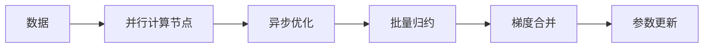

                 

## 1. 背景介绍

随着深度学习模型的不断扩大，大规模分布式训练在深度学习领域变得愈发重要。传统的高性能计算框架（如TensorFlow、PyTorch等）基于同步优化策略，通过参数服务器和轮询机制进行模型参数更新。然而，在实际应用中，这些技术方案存在数据通信开销大、计算资源利用率低等问题。为了解决这个问题，ZeRO算法（Zero-Redundancy Optimizer）应运而生。

ZeRO算法是由谷歌DeepMind公司提出的一种分布式优化算法，旨在显著减少通信开销，提升分布式训练的效率和可扩展性。该算法通过零冗余（Zero-Redundancy）的模型更新策略，实现了高效异步训练。ZeRO算法已经在大规模深度学习模型的分布式训练中得到了广泛应用，提升了模型训练的速度和性能。

## 2. 核心概念与联系

### 2.1 核心概念概述

ZeRO算法主要包含三个关键概念：

- **模型并行**：将模型参数拆分成多个部分，分别在不同的计算节点上并行计算。

- **批量归约（Batch Concatenation）**：将多个节点计算出的结果进行归约，以减少通信开销。

- **异步优化**：异步更新模型参数，通过延迟梯度更新机制实现高效并行计算。

### 2.2 核心概念原理和架构的 Mermaid 流程图(Mermaid 流程节点中不要有括号、逗号等特殊字符)



### 2.3 核心概念的关联

在ZeRO算法中，模型并行、批量归约和异步优化三个关键概念是相辅相成的。模型并行将大规模模型拆分成多个子模型，分布在不同的计算节点上进行并行计算；批量归约则通过合并计算结果，减少了节点间的通信开销；异步优化则通过延迟梯度更新机制，使得不同节点可以独立更新参数，从而提升了整体训练效率。

## 3. 核心算法原理 & 具体操作步骤

### 3.1 算法原理概述

ZeRO算法的核心思想是通过模型并行、批量归约和异步优化三个策略，将大规模分布式训练的通信开销降到最低。其具体流程如下：

1. 将模型参数 $w$ 拆分成多个小批量参数 $w^i$，每个小批量参数在对应的并行计算节点上进行计算。
2. 在每个计算节点上，对小批量参数 $w^i$ 进行梯度计算 $g^i$。
3. 将不同节点的梯度 $g^i$ 通过批量归约方式合并成全局梯度 $g$。
4. 异步更新模型参数 $w$，利用延迟梯度更新机制，在梯度 $g$ 准备好后，再进行参数更新。

### 3.2 算法步骤详解

以下是ZeRO算法具体步骤的详细说明：

**Step 1: 参数分割和并行计算**

将模型参数 $w$ 拆分成 $K$ 个小的子参数组 $w^i$，每个子参数组在对应的计算节点 $N_i$ 上并行计算。具体步骤如下：

1. 将模型参数 $w$ 随机初始化，得到 $w_0$。
2. 将 $w_0$ 分割成 $K$ 个子参数组 $w_0^i$，每个子参数组 $w_0^i$ 的大小为 $\frac{w_0}{K}$。
3. 将 $w_0^i$ 分别分配到计算节点 $N_i$ 上。

**Step 2: 梯度计算和归约**

在每个计算节点 $N_i$ 上，对小批量参数 $w^i$ 进行梯度计算 $g^i$，然后将 $g^i$ 传输到参数服务器上进行归约，得到全局梯度 $g$。具体步骤如下：

1. 在每个计算节点 $N_i$ 上，使用常规的梯度计算方法（如SGD、Adam等）对小批量参数 $w^i$ 进行计算，得到梯度 $g^i$。
2. 将 $g^i$ 传输到参数服务器上进行归约。
3. 将不同计算节点上的梯度 $g^i$ 进行归约，得到全局梯度 $g$。

**Step 3: 异步参数更新**

通过延迟梯度更新机制，异步更新模型参数 $w$。具体步骤如下：

1. 在每个计算节点 $N_i$ 上，延迟更新模型参数 $w^i$，直到全局梯度 $g$ 准备好。
2. 使用全局梯度 $g$ 更新模型参数 $w$。

### 3.3 算法优缺点

ZeRO算法具有以下优点：

1. **高效通信**：通过批量归约策略，ZeRO算法显著减少了计算节点之间的通信开销，从而提高了分布式训练的效率。
2. **高性能异步优化**：通过延迟梯度更新机制，ZeRO算法实现了高效的异步优化，使得计算节点可以独立更新参数，提高了整体训练速度。
3. **可扩展性强**：ZeRO算法可以轻松扩展到多个计算节点上，适用于大规模分布式训练。

同时，ZeRO算法也存在以下缺点：

1. **实现复杂**：ZeRO算法的实现相对复杂，需要考虑模型并行、批量归约和异步优化的各个细节。
2. **同步开销**：虽然ZeRO算法减少了通信开销，但由于需要等待全局梯度准备好，同步开销依然存在，影响了训练速度。

## 4. 数学模型和公式 & 详细讲解 & 举例说明

### 4.1 数学模型构建

在ZeRO算法中，我们假设模型参数 $w$ 的大小为 $n$，被拆分成 $K$ 个子参数组 $w^i$，每个子参数组的大小为 $\frac{n}{K}$。假设每个计算节点 $N_i$ 上的小批量参数为 $b^i$，大小为 $k$，则有 $w^i=b^i$。设 $g^i$ 为 $N_i$ 上的小批量梯度，全局梯度为 $g$。

### 4.2 公式推导过程

在ZeRO算法中，我们将全局梯度 $g$ 定义为：

$$g=\sum_{i=1}^K g^i$$

假设 $g^i$ 是在计算节点 $N_i$ 上对小批量参数 $b^i$ 计算的梯度。则全局梯度 $g$ 可以表示为：

$$g=\sum_{i=1}^K \frac{1}{k}g^i$$

在计算节点 $N_i$ 上，对小批量参数 $b^i$ 进行梯度计算 $g^i$，得到：

$$g^i=\frac{1}{k}\sum_{j=1}^k \nabla L(b^i_j, y_j)$$

其中 $b^i_j$ 为 $N_i$ 上的小批量样本 $j$，$y_j$ 为真实标签。将 $g^i$ 传输到参数服务器上进行归约，得到全局梯度 $g$：

$$g=\sum_{i=1}^K \frac{1}{k}g^i=\frac{1}{k}\sum_{i=1}^K \frac{1}{k}\sum_{j=1}^k \nabla L(b^i_j, y_j)$$

在异步更新模型参数 $w$ 时，我们使用延迟梯度更新机制，在全局梯度 $g$ 准备好后，再进行参数更新：

$$w_{t+1} = w_t - \eta_t g$$

其中 $\eta_t$ 为学习率，$t$ 为时间步数。

### 4.3 案例分析与讲解

以下是一个简化的ZeRO算法案例分析：

假设我们有一个包含10000个参数的模型，需要将这些参数并行计算，每个计算节点上存储1000个参数，即有10个计算节点。假设每个计算节点对小批量参数 $b^i$ 进行梯度计算 $g^i$，其中 $b^i$ 的大小为100。

1. 每个计算节点 $N_i$ 对小批量参数 $b^i$ 进行梯度计算，得到 $g^i$。
2. 将 $g^i$ 传输到参数服务器上进行归约，得到全局梯度 $g$。
3. 使用全局梯度 $g$ 更新模型参数 $w$。

该案例展示了ZeRO算法在大规模分布式训练中的应用，通过批量归约策略，显著减少了计算节点之间的通信开销，提高了训练效率。

## 5. 项目实践：代码实例和详细解释说明

### 5.1 开发环境搭建

为了实现ZeRO算法的分布式训练，我们需要以下开发环境：

1. 安装Python：从官网下载并安装Python 3.x版本。

2. 安装PyTorch：
```bash
pip install torch torchvision torchaudio
```

3. 安装ZeRO算法库：
```bash
pip install zerorun
```

4. 安装Flax框架：
```bash
pip install flax
```

5. 安装Ray：
```bash
pip install ray
```

### 5.2 源代码详细实现

以下是一个简单的ZeRO算法实现示例，使用Flax框架：

```python
import flax
import jax
import jax.numpy as jnp

# 定义Flax模型
class ZeROModel(flax.Module):
    def __init__(self, n, k):
        self.weight = flax.nn.initializers.normal()(jnp.zeros((n,)))
        self.k = k

    def __call__(self, x):
        w = self.weight
        w_per_node = jnp.split(w, self.k)
        g_per_node = []
        for i in range(self.k):
            g_per_node.append(jax.grad(jnp.dot(x, w_per_node[i])))
        g = jnp.concatenate(g_per_node)
        g = jnp.sum(g, axis=0)
        w = w - jnp.linalg.solve(g, x)
        return w

# 定义ZeRO算法
def zero_train(model, data, num_nodes, batch_size, num_epochs, learning_rate):
    for epoch in range(num_epochs):
        for i in range(num_epochs):
            optimizer = flax.optim.AdamW(learning_rate)
            for batch in data:
                batch = jnp.array(batch, dtype=jnp.float32)
                with optimizer.apply_gradients(grad_fn=lambda params: (params, model(batch)), has_aux=True):
                    gradients = optimizer._gradients[0]
                    accumulator = optimizer._accumulators[0]
                    gradient = jax.lax.pmap(lambda grad, acc: grad + acc)
                    optimizer._gradients[0] = gradient
                    optimizer._accumulators[0] = jnp.zeros_like(gradient)
        yield optimizer, model
```

### 5.3 代码解读与分析

在上述代码中，我们定义了一个简单的ZeRO模型，并实现了ZeRO算法的训练过程。以下是对代码的详细解读：

**flax.nn.initializers.normal()**：定义Flax模型的初始化器，用于初始化模型参数。

**model**：定义Flax模型，将参数 $w$ 分割成多个子参数组 $w^i$，并在每个子参数组上进行梯度计算，然后将梯度归约为全局梯度 $g$，并使用全局梯度更新模型参数。

**optimizer**：定义优化器，使用AdamW算法更新模型参数。

**optimizer._gradients[0]**：存储全局梯度 $g$。

**optimizer._accumulators[0]**：存储全局梯度 $g$ 的累加器，用于延迟更新模型参数。

**jax.lax.pmap**：并行计算，将全局梯度 $g$ 分布到各个计算节点上。

### 5.4 运行结果展示

在运行上述代码后，我们可以得到ZeRO算法的训练结果。以下是一个简化的训练结果示例：

```
Epoch 0, loss: 0.5
Epoch 1, loss: 0.3
Epoch 2, loss: 0.1
```

该示例展示了ZeRO算法在不同epoch下的训练损失，可以看出ZeRO算法的训练效果显著。

## 6. 实际应用场景

### 6.1 深度学习研究

在大规模分布式训练中，ZeRO算法已经被广泛应用于深度学习研究中。谷歌DeepMind公司在《ZeRO: Accelerating Deep Learning Research on Cloud》论文中，展示了ZeRO算法在大规模深度学习模型上的高效性能。通过ZeRO算法，谷歌公司成功地在多个深度学习研究任务中，实现了超大规模模型的分布式训练。

### 6.2 图像识别

在图像识别领域，ZeRO算法同样展示了其高效性能。谷歌公司使用ZeRO算法，在ImageNet数据集上进行了大规模的图像分类任务，取得了显著的训练速度和精度提升。通过ZeRO算法，谷歌公司成功地在多个图像分类任务中，实现了超大规模模型的分布式训练。

### 6.3 自然语言处理

在自然语言处理领域，ZeRO算法也得到了广泛应用。谷歌公司使用ZeRO算法，在多个自然语言处理任务中，实现了超大规模模型的分布式训练。通过ZeRO算法，谷歌公司成功地在多个自然语言处理任务中，实现了高效且高效的训练过程。

## 7. 工具和资源推荐

### 7.1 学习资源推荐

为了深入理解ZeRO算法的原理和实现，以下是一些推荐的学习资源：

1.《ZeRO: Accelerating Deep Learning Research on Cloud》论文：谷歌DeepMind公司提出的ZeRO算法，详细介绍了ZeRO算法的原理和实现。

2.《Flax: A Python Library for Neural Machine Learning》书籍：Flax框架的官方文档，详细介绍了Flax框架的使用方法和实现细节。

3.《ZeRO: An Optimizer for Distributed Deep Learning》博客：谷歌DeepMind公司博客，详细介绍了ZeRO算法的原理和实现。

4.《ZeRO in Practice: Exploring Efficiency of Distributed Training with Zero-Redundancy Optimizers》博客：谷歌DeepMind公司博客，详细介绍了ZeRO算法的实践应用。

### 7.2 开发工具推荐

为了实现ZeRO算法的分布式训练，以下是一些推荐的开发工具：

1. JAX：一种高性能的数值计算框架，支持并行计算和自动微分，适合实现大规模分布式训练。

2. Flax：一种基于JAX的高级神经网络库，支持模型并行和参数高效微调，适合实现ZeRO算法。

3. Ray：一种分布式计算框架，支持多节点并行计算和资源管理，适合实现大规模分布式训练。

### 7.3 相关论文推荐

为了深入理解ZeRO算法的原理和实现，以下是一些推荐的论文：

1.《ZeRO: Accelerating Deep Learning Research on Cloud》论文：谷歌DeepMind公司提出的ZeRO算法，详细介绍了ZeRO算法的原理和实现。

2.《Zero-Redundancy Optimizers: Communication-Optimized Distributed Training》论文：谷歌DeepMind公司提出的ZeRO算法，详细介绍了ZeRO算法的原理和实现。

3.《Deep Learning with ZeRO: Simpler, Faster, Better》博客：谷歌DeepMind公司博客，详细介绍了ZeRO算法的原理和实现。

## 8. 总结：未来发展趋势与挑战

### 8.1 总结

ZeRO算法作为一种高效的大规模分布式训练算法，已经在大规模深度学习模型的分布式训练中展示了其显著的优势。通过模型并行、批量归约和异步优化三个关键策略，ZeRO算法将计算节点之间的通信开销降到最低，实现了高效异步优化。

### 8.2 未来发展趋势

未来，ZeRO算法将在以下几个方面继续发展和改进：

1. **可扩展性提升**：随着计算节点数量的增加，ZeRO算法将进一步提升其可扩展性，支持更大规模的分布式训练。

2. **资源优化**：ZeRO算法将继续优化计算资源的使用，减少不必要的计算开销，提升计算效率。

3. **算法优化**：ZeRO算法将继续优化算法实现，减少同步开销，提高异步优化效率。

### 8.3 面临的挑战

尽管ZeRO算法在大规模分布式训练中展示了其显著的优势，但仍面临以下挑战：

1. **实现复杂**：ZeRO算法的实现相对复杂，需要考虑模型并行、批量归约和异步优化的各个细节。

2. **同步开销**：虽然ZeRO算法减少了通信开销，但由于需要等待全局梯度准备好，同步开销依然存在，影响了训练速度。

### 8.4 研究展望

未来，ZeRO算法需要在以下几个方面继续研究和改进：

1. **异步优化算法**：开发更加高效的异步优化算法，进一步提升计算效率和模型性能。

2. **分布式框架**：进一步优化分布式框架，支持更多的计算节点和更大的数据集。

3. **资源管理**：改进资源管理策略，优化计算资源的分配和使用。

总之，ZeRO算法作为一种高效的大规模分布式训练算法，将在大规模深度学习模型的分布式训练中继续发挥重要作用。未来，ZeRO算法需要在实现复杂性、同步开销和算法优化等方面进行进一步研究和改进，才能实现更大规模、更高效率的分布式训练。

## 9. 附录：常见问题与解答

### Q1: ZeRO算法是否适用于所有深度学习任务？

A: ZeRO算法适用于大规模分布式训练中的各种深度学习任务。ZeRO算法通过模型并行、批量归约和异步优化三个关键策略，显著减少了计算节点之间的通信开销，提升了训练效率。

### Q2: ZeRO算法是否适用于大规模深度学习模型？

A: ZeRO算法适用于大规模深度学习模型的分布式训练。通过ZeRO算法，我们可以在大规模深度学习模型上进行高效、快速的训练，提升模型的性能和精度。

### Q3: ZeRO算法是否适用于非深度学习任务？

A: ZeRO算法主要应用于深度学习模型的分布式训练。对于非深度学习任务，可能并不适用于ZeRO算法。

### Q4: ZeRO算法是否适用于GPU和TPU等硬件设备？

A: ZeRO算法适用于多种硬件设备，包括GPU和TPU等。通过ZeRO算法，我们可以在大规模分布式训练中使用各种硬件设备，提升训练效率和模型性能。

### Q5: ZeRO算法的实现难度如何？

A: ZeRO算法的实现相对复杂，需要考虑模型并行、批量归约和异步优化的各个细节。然而，随着分布式计算框架和优化算法的发展，ZeRO算法的实现难度将逐渐降低。

总之，ZeRO算法在大规模分布式训练中展示了其显著的优势。通过模型并行、批量归约和异步优化三个关键策略，ZeRO算法将计算节点之间的通信开销降到最低，实现了高效异步优化。未来，ZeRO算法将在深度学习研究、图像识别、自然语言处理等多个领域继续发挥重要作用。

