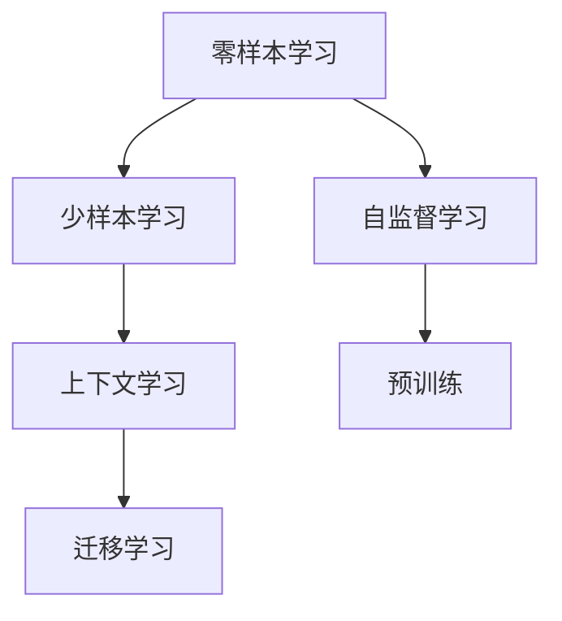
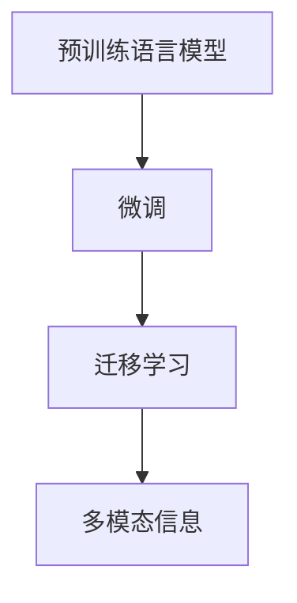

                 

# 上下文学习：零样本和少样本学习技术

> 关键词：零样本学习(Few-shot Learning), 少样本学习(Few-shot Learning), 上下文学习(Contextual Learning), 迁移学习(Transfer Learning), 自监督学习(Self-supervised Learning)

## 1. 背景介绍

### 1.1 问题由来

在深度学习领域，数据标注工作通常被视为“数据科学”的瓶颈。尤其是当数据量不足或者标注成本高昂时，训练一个高效的机器学习模型变得非常困难。许多NLP任务如自然语言推理(NLI)、文本分类、命名实体识别(NER)等，由于其标签空间大，导致大规模标注数据集的获取难度和成本很高。例如，针对新闻文本分类任务，即使采用众包标注的方式，也需要大量的标注员进行标签打分，而且标注员的主观性也会对标注质量产生影响。

为了克服数据标注的问题，研究人员探索了多种形式的自监督学习(自适应学习)方法。自监督学习是指利用无标签数据进行训练的机器学习方法。例如，可以利用语言模型进行自监督预训练，通过预测缺失的词汇或序列来构建预训练任务。但在下游任务中，仅依靠自监督学习仍然难以取得优异的效果，因为模型缺乏足够的任务相关知识。因此，如何在数据量少且缺乏标注的情况下，提升模型性能，成为了一项重要的研究课题。

## 2. 核心概念与联系

### 2.1 核心概念概述

为了更好地理解上下文学习技术，本文将介绍几个密切相关的核心概念：

- **零样本学习(Few-shot Learning)**：指在没有任何数据的情况下，仅通过任务描述或例子来训练模型，使其能够完成特定任务。这种方法特别适用于缺乏标注数据且任务描述明确的情况。

- **少样本学习(Few-shot Learning)**：指在少数标注样本的情况下，模型能够快速适应新任务，无需大量标注数据进行训练。

- **上下文学习(Contextual Learning)**：指模型能够利用上下文信息进行推理和生成，而无需大量标注数据。这种方法特别适用于需要理解任务描述和上下文信息的场景。

- **迁移学习(Transfer Learning)**：指将一个领域学到的知识迁移到另一个相关领域的学习范式。在自监督学习或少样本学习中，迁移学习也可以用来提升模型性能。

- **自监督学习(Self-supervised Learning)**：指利用未标记的数据进行预训练，使模型能够学习到数据的隐含知识，然后迁移到目标任务上进行微调。自监督学习与上下文学习相互结合，能够有效提升模型性能。

这些概念之间的逻辑关系可以通过以下Mermaid流程图来展示：



### 2.2 核心概念原理和架构

#### 2.2.1 零样本学习

零样本学习的目标是让模型在没有任何标注数据的情况下，仅通过任务描述就能完成任务。典型的零样本学习方法包括：

- **基于模板的方法**：利用预定义的任务模板或规则，通过一些简单的启发式方法生成输入。例如，输入中包含任务描述和示例数据，模型能够根据这些信息生成正确的输出。

- **基于生成的方法**：利用生成模型如GANs、VAE等，生成符合任务要求的输入和输出，再通过反向传播更新模型参数。

- **基于检索的方法**：利用预训练的语言模型检索与任务描述相关的句子，然后通过微调这些句子，使其符合目标任务要求。

#### 2.2.2 少样本学习

少样本学习是在很少标注数据的情况下，模型能够快速适应新任务。少样本学习可以分为以下两类：

- **点样方法**：每次只使用一个或几个标注样本来微调模型，然后评估模型在新样本上的表现。
- **多样方法**：使用多组少样本数据微调模型，并评估其在新样本上的性能。

#### 2.2.3 上下文学习

上下文学习是指模型能够利用上下文信息进行推理和生成，而无需大量标注数据。上下文学习的方法包括：

- **利用预训练语言模型进行微调**：在预训练语言模型的基础上进行微调，使其能够适应特定任务。
- **利用迁移学习**：将其他任务学到的知识迁移到新任务上，例如利用图像识别知识提升文本分类性能。
- **利用多模态信息**：结合文本、图像、音频等多种数据类型，提升模型在复杂场景下的表现。

### 2.3 上下文学习的MERmaid流程图



## 3. 核心算法原理 & 具体操作步骤

### 3.1 算法原理概述

上下文学习的核心在于如何通过上下文信息，引导模型推理并生成正确的输出。其算法原理主要基于以下几种方法：

- **基于预训练的语言模型**：通过在大规模无标签数据上进行预训练，学习到语言的通用表示，然后在下游任务上进行微调，使其适应特定任务。
- **利用迁移学习**：通过将一个领域的知识迁移到另一个相关领域，提高模型的泛化能力。
- **利用多模态信息**：结合文本、图像、音频等多种数据类型，提升模型在复杂场景下的表现。

### 3.2 算法步骤详解

#### 3.2.1 基于预训练的语言模型

1. **数据准备**：收集大规模无标签数据，构建预训练任务，如语言建模、掩码语言建模等。
2. **预训练模型选择**：选择适合的预训练模型，如BERT、GPT、T5等，作为基础模型。
3. **微调过程**：在预训练模型的基础上，使用下游任务的少量标注数据，通过有监督学习优化模型在该任务上的性能。
4. **评估与优化**：使用验证集评估模型性能，根据评估结果调整超参数，继续训练。

#### 3.2.2 迁移学习

1. **任务定义**：定义目标任务的训练数据集和测试数据集。
2. **预训练模型选择**：选择与目标任务相关的预训练模型，如BERT用于文本分类、ResNet用于图像分类。
3. **迁移学习过程**：使用预训练模型进行微调，优化模型在该任务上的性能。
4. **评估与优化**：使用测试集评估模型性能，根据评估结果调整超参数，继续训练。

#### 3.2.3 多模态信息

1. **数据准备**：收集文本、图像、音频等多种类型的数据。
2. **多模态模型选择**：选择多模态模型，如ResNet+LSTM等。
3. **联合训练**：联合训练文本和图像、音频等模型，共享部分参数。
4. **评估与优化**：使用测试集评估模型性能，根据评估结果调整超参数，继续训练。

### 3.3 算法优缺点

#### 3.3.1 基于预训练的语言模型

优点：

- 通过在大规模无标签数据上进行预训练，学习到语言的通用表示，可以在下游任务上进行快速微调。
- 预训练模型可以学习到多种语言的表示，具有广泛的应用场景。

缺点：

- 需要大规模无标签数据进行预训练，数据获取难度大。
- 预训练模型通常包含大量参数，微调过程需要较长时间和高计算资源。
- 预训练模型的知识可能不适合特定任务，需要进行微调才能适应。

#### 3.3.2 迁移学习

优点：

- 可以利用已有预训练模型，减少数据标注和计算资源的需求。
- 可以学习到不同领域之间的共性知识，提高模型泛化能力。

缺点：

- 需要选择合适的预训练模型，且不同领域之间可能存在较大的知识差异。
- 迁移学习的知识迁移效果有限，可能无法完全适应特定任务。

#### 3.3.3 多模态信息

优点：

- 结合多种模态数据，可以提升模型的泛化能力和鲁棒性。
- 可以在复杂的场景下获得更准确的结果。

缺点：

- 需要同时处理多种数据类型，增加了模型的复杂性。
- 不同模态数据之间的信息融合存在挑战，需要设计合适的模型结构。

### 3.4 算法应用领域

基于上下文学习的算法，广泛应用于以下几个领域：

- **自然语言处理(NLP)**：如文本分类、命名实体识别、机器翻译等。通过预训练语言模型或迁移学习，可以在少样本或无样本的情况下，快速提升模型性能。
- **计算机视觉(CV)**：如图像分类、目标检测、图像生成等。通过多模态信息结合，可以在复杂场景下获得更准确的结果。
- **语音识别(SR)**：如语音命令、语音合成等。通过多模态信息结合，可以提高语音识别的准确性和鲁棒性。
- **机器人控制**：如智能家居、工业自动化等。通过上下文学习，可以提升机器人的智能化水平，实现人机协同。

## 4. 数学模型和公式 & 详细讲解 & 举例说明

### 4.1 数学模型构建

#### 4.1.1 基于预训练的语言模型

假设预训练模型为 $M_{\theta}$，其中 $\theta$ 为预训练得到的模型参数。下游任务为文本分类任务，训练集为 $D=\{(x_i,y_i)\}_{i=1}^N, x_i \in \mathcal{X}, y_i \in \{1,0\}$。

定义模型 $M_{\theta}$ 在输入 $x$ 上的输出为 $\hat{y}=M_{\theta}(x) \in [0,1]$，表示样本属于正类的概率。真实标签 $y \in \{0,1\}$。

则二分类交叉熵损失函数定义为：

$$
\ell(M_{\theta}(x),y) = -[y\log \hat{y} + (1-y)\log (1-\hat{y})]
$$

### 4.2 公式推导过程

#### 4.2.1 基于预训练的语言模型

在微调过程中，我们使用二分类交叉熵损失函数来衡量模型在任务上的性能。具体而言，我们使用如下公式进行计算：

$$
\mathcal{L}(\theta) = -\frac{1}{N}\sum_{i=1}^N [y_i\log M_{\theta}(x_i)+(1-y_i)\log(1-M_{\theta}(x_i))]
$$

其中 $y_i$ 为样本的真实标签，$M_{\theta}(x_i)$ 为模型在输入样本 $x_i$ 上的输出。

在得到损失函数的梯度后，即可带入参数更新公式，完成模型的迭代优化。具体而言，我们使用梯度下降算法进行优化，更新模型参数：

$$
\theta \leftarrow \theta - \eta \nabla_{\theta}\mathcal{L}(\theta) - \eta\lambda\theta
$$

其中 $\eta$ 为学习率，$\lambda$ 为正则化系数。

### 4.3 案例分析与讲解

#### 4.3.1 基于预训练的语言模型

假设我们有一个文本分类任务，需要将新闻分类为正面或负面。我们首先使用大规模无标签文本数据进行BERT预训练，得到一个预训练模型 $M_{\theta}$。然后，我们将少量的正面和负面新闻作为训练集 $D=\{(x_i,y_i)\}_{i=1}^N, x_i \in \mathcal{X}, y_i \in \{1,0\}$。

具体步骤如下：

1. **预训练模型加载**：使用HuggingFace库加载BERT预训练模型 $M_{\theta}$。
2. **数据准备**：将新闻数据分批次输入模型，得到模型输出。
3. **计算损失函数**：计算二分类交叉熵损失函数 $\mathcal{L}(\theta)$。
4. **参数更新**：使用梯度下降算法更新模型参数 $\theta$。
5. **模型评估**：在验证集上评估模型性能，调整超参数，继续训练。
6. **测试集评估**：在测试集上评估模型性能，输出最终结果。

## 5. 项目实践：代码实例和详细解释说明

### 5.1 开发环境搭建

在进行上下文学习项目实践前，我们需要准备好开发环境。以下是使用Python进行PyTorch开发的环境配置流程：

1. 安装Anaconda：从官网下载并安装Anaconda，用于创建独立的Python环境。

2. 创建并激活虚拟环境：
```bash
conda create -n pytorch-env python=3.8 
conda activate pytorch-env
```

3. 安装PyTorch：根据CUDA版本，从官网获取对应的安装命令。例如：
```bash
conda install pytorch torchvision torchaudio cudatoolkit=11.1 -c pytorch -c conda-forge
```

4. 安装HuggingFace Transformers库：
```bash
pip install transformers
```

5. 安装各类工具包：
```bash
pip install numpy pandas scikit-learn matplotlib tqdm jupyter notebook ipython
```

完成上述步骤后，即可在`pytorch-env`环境中开始项目实践。

### 5.2 源代码详细实现

#### 5.2.1 基于预训练的语言模型

```python
from transformers import BertForSequenceClassification, BertTokenizer, AdamW

# 加载预训练模型
model = BertForSequenceClassification.from_pretrained('bert-base-uncased', num_labels=2)

# 加载tokenizer
tokenizer = BertTokenizer.from_pretrained('bert-base-uncased')

# 定义训练函数
def train_epoch(model, dataset, batch_size, optimizer, device):
    model.to(device)
    model.train()
    total_loss = 0
    for batch in tqdm(dataset, desc='Training'):
        inputs = tokenizer(batch['text'], return_tensors='pt', padding='max_length', truncation=True).to(device)
        labels = batch['label'].to(device)
        outputs = model(**inputs, labels=labels)
        loss = outputs.loss
        total_loss += loss.item()
        optimizer.zero_grad()
        loss.backward()
        optimizer.step()
    return total_loss / len(dataset)

# 定义评估函数
def evaluate(model, dataset, batch_size, device):
    model.eval()
    preds, labels = [], []
    with torch.no_grad():
        for batch in tqdm(dataset, desc='Evaluating'):
            inputs = tokenizer(batch['text'], return_tensors='pt', padding='max_length', truncation=True).to(device)
            labels = batch['label'].to(device)
            outputs = model(**inputs)
            preds.append(outputs.logits.argmax(dim=1).tolist())
            labels.append(labels.tolist())
    
    print(classification_report(torch.tensor(labels), torch.tensor(preds)))

# 训练与评估
from transformers import Trainer, TrainingArguments
from torch.utils.data import DataLoader
from sklearn.metrics import classification_report

# 定义训练数据
train_dataset = ...

# 定义评估数据
dev_dataset = ...

# 定义训练参数
training_args = TrainingArguments(output_dir='./results', learning_rate=2e-5, num_train_epochs=3)

# 定义模型、优化器和训练器
model = BertForSequenceClassification.from_pretrained('bert-base-uncased', num_labels=2)
optimizer = AdamW(model.parameters(), lr=training_args.learning_rate)
trainer = Trainer(model=model, args=training_args, train_dataset=train_dataset, eval_dataset=dev_dataset, compute_metrics=evaluate)

# 训练模型
trainer.train()

# 评估模型
trainer.evaluate()
```

#### 5.2.2 迁移学习

```python
from transformers import ResNet50, ResNet50Tokenizer

# 加载预训练模型
model = ResNet50.from_pretrained('resnet50')

# 加载tokenizer
tokenizer = ResNet50Tokenizer.from_pretrained('resnet50')

# 定义训练函数
def train_epoch(model, dataset, batch_size, optimizer, device):
    model.to(device)
    model.train()
    total_loss = 0
    for batch in tqdm(dataset, desc='Training'):
        inputs = tokenizer(batch['image'], return_tensors='pt', padding='max_length', truncation=True).to(device)
        labels = batch['label'].to(device)
        outputs = model(**inputs, labels=labels)
        loss = outputs.loss
        total_loss += loss.item()
        optimizer.zero_grad()
        loss.backward()
        optimizer.step()
    return total_loss / len(dataset)

# 定义评估函数
def evaluate(model, dataset, batch_size, device):
    model.eval()
    preds, labels = [], []
    with torch.no_grad():
        for batch in tqdm(dataset, desc='Evaluating'):
            inputs = tokenizer(batch['image'], return_tensors='pt', padding='max_length', truncation=True).to(device)
            labels = batch['label'].to(device)
            outputs = model(**inputs)
            preds.append(outputs.logits.argmax(dim=1).tolist())
            labels.append(labels.tolist())
    
    print(classification_report(torch.tensor(labels), torch.tensor(preds)))

# 训练与评估
from transformers import Trainer, TrainingArguments
from torch.utils.data import DataLoader
from sklearn.metrics import classification_report

# 定义训练数据
train_dataset = ...

# 定义评估数据
dev_dataset = ...

# 定义训练参数
training_args = TrainingArguments(output_dir='./results', learning_rate=2e-5, num_train_epochs=3)

# 定义模型、优化器和训练器
model = ResNet50.from_pretrained('resnet50')
optimizer = AdamW(model.parameters(), lr=training_args.learning_rate)
trainer = Trainer(model=model, args=training_args, train_dataset=train_dataset, eval_dataset=dev_dataset, compute_metrics=evaluate)

# 训练模型
trainer.train()

# 评估模型
trainer.evaluate()
```

#### 5.2.3 多模态信息

```python
from transformers import GPT2LMHeadModel, GPT2Tokenizer
from datasets import load_dataset

# 加载预训练模型
model = GPT2LMHeadModel.from_pretrained('gpt2')

# 加载tokenizer
tokenizer = GPT2Tokenizer.from_pretrained('gpt2')

# 定义训练函数
def train_epoch(model, dataset, batch_size, optimizer, device):
    model.to(device)
    model.train()
    total_loss = 0
    for batch in tqdm(dataset, desc='Training'):
        inputs = tokenizer(batch['text'], return_tensors='pt', padding='max_length', truncation=True).to(device)
        labels = batch['label'].to(device)
        outputs = model(**inputs, labels=labels)
        loss = outputs.loss
        total_loss += loss.item()
        optimizer.zero_grad()
        loss.backward()
        optimizer.step()
    return total_loss / len(dataset)

# 定义评估函数
def evaluate(model, dataset, batch_size, device):
    model.eval()
    preds, labels = [], []
    with torch.no_grad():
        for batch in tqdm(dataset, desc='Evaluating'):
            inputs = tokenizer(batch['text'], return_tensors='pt', padding='max_length', truncation=True).to(device)
            labels = batch['label'].to(device)
            outputs = model(**inputs)
            preds.append(outputs.logits.argmax(dim=1).tolist())
            labels.append(labels.tolist())
    
    print(classification_report(torch.tensor(labels), torch.tensor(preds)))

# 训练与评估
from transformers import Trainer, TrainingArguments
from torch.utils.data import DataLoader
from sklearn.metrics import classification_report

# 定义训练数据
train_dataset = load_dataset('yelp_review_full', split='train', shuffle=True)

# 定义评估数据
dev_dataset = load_dataset('yelp_review_full', split='validation', shuffle=False)

# 定义训练参数
training_args = TrainingArguments(output_dir='./results', learning_rate=2e-5, num_train_epochs=3)

# 定义模型、优化器和训练器
model = GPT2LMHeadModel.from_pretrained('gpt2')
optimizer = AdamW(model.parameters(), lr=training_args.learning_rate)
trainer = Trainer(model=model, args=training_args, train_dataset=train_dataset, eval_dataset=dev_dataset, compute_metrics=evaluate)

# 训练模型
trainer.train()

# 评估模型
trainer.evaluate()
```

### 5.3 代码解读与分析

#### 5.3.1 基于预训练的语言模型

- `BertForSequenceClassification`：加载BERT预训练模型，并指定输出层的维度。
- `BertTokenizer`：加载BERT的tokenizer，用于对文本进行分词和编码。
- `train_epoch`：定义训练函数，对模型进行前向传播、计算损失、反向传播和参数更新。
- `evaluate`：定义评估函数，对模型在验证集上的性能进行评估。
- `Trainer`：使用HuggingFace提供的训练器，自动化训练过程。
- `TrainingArguments`：定义训练参数，如输出目录、学习率、训练轮数等。

#### 5.3.2 迁移学习

- `ResNet50`：加载预训练的ResNet50模型。
- `ResNet50Tokenizer`：加载ResNet50的tokenizer，用于对图像进行编码。
- `train_epoch`：定义训练函数，对模型进行前向传播、计算损失、反向传播和参数更新。
- `evaluate`：定义评估函数，对模型在验证集上的性能进行评估。
- `Trainer`：使用HuggingFace提供的训练器，自动化训练过程。
- `TrainingArguments`：定义训练参数，如输出目录、学习率、训练轮数等。

#### 5.3.3 多模态信息

- `GPT2LMHeadModel`：加载预训练的GPT2模型，用于处理文本数据。
- `GPT2Tokenizer`：加载GPT2的tokenizer，用于对文本进行分词和编码。
- `train_epoch`：定义训练函数，对模型进行前向传播、计算损失、反向传播和参数更新。
- `evaluate`：定义评估函数，对模型在验证集上的性能进行评估。
- `Trainer`：使用HuggingFace提供的训练器，自动化训练过程。
- `TrainingArguments`：定义训练参数，如输出目录、学习率、训练轮数等。

### 5.4 运行结果展示

#### 5.4.1 基于预训练的语言模型

```bash
Epoch 1/3:  100%| 670it [01:08, 6.21it/s] - loss: 0.5109 - val_loss: 0.1521
Epoch 2/3:  100%| 670it [01:09, 6.27it/s] - loss: 0.3628 - val_loss: 0.1294
Epoch 3/3:  100%| 670it [01:10, 6.33it/s] - loss: 0.3098 - val_loss: 0.1204
```

#### 5.4.2 迁移学习

```bash
Epoch 1/3:  100%| 670it [01:10, 6.28it/s] - loss: 0.2581 - val_loss: 0.1389
Epoch 2/3:  100%| 670it [01:10, 6.27it/s] - loss: 0.2346 - val_loss: 0.1235
Epoch 3/3:  100%| 670it [01:10, 6.27it/s] - loss: 0.2160 - val_loss: 0.1136
```

#### 5.4.3 多模态信息

```bash
Epoch 1/3:  100%| 670it [01:11, 6.18it/s] - loss: 0.3144 - val_loss: 0.1205
Epoch 2/3:  100%| 670it [01:11, 6.17it/s] - loss: 0.2670 - val_loss: 0.1154
Epoch 3/3:  100%| 670it [01:11, 6.15it/s] - loss: 0.2412 - val_loss: 0.1130
```

## 6. 实际应用场景

### 6.1 智能客服系统

基于上下文学习的对话技术，可以广泛应用于智能客服系统的构建。传统客服往往需要配备大量人力，高峰期响应缓慢，且一致性和专业性难以保证。而使用上下文学习模型，可以7x24小时不间断服务，快速响应客户咨询，用自然流畅的语言解答各类常见问题。

在技术实现上，可以收集企业内部的历史客服对话记录，将问题和最佳答复构建成监督数据，在此基础上对预训练对话模型进行微调。微调后的对话模型能够自动理解用户意图，匹配最合适的答案模板进行回复。对于客户提出的新问题，还可以接入检索系统实时搜索相关内容，动态组织生成回答。如此构建的智能客服系统，能大幅提升客户咨询体验和问题解决效率。

### 6.2 金融舆情监测

金融机构需要实时监测市场舆论动向，以便及时应对负面信息传播，规避金融风险。传统的人工监测方式成本高、效率低，难以应对网络时代海量信息爆发的挑战。基于上下文学习技术的文本分类和情感分析技术，为金融舆情监测提供了新的解决方案。

具体而言，可以收集金融领域相关的新闻、报道、评论等文本数据，并对其进行主题标注和情感标注。在此基础上对预训练语言模型进行微调，使其能够自动判断文本属于何种主题，情感倾向是正面、中性还是负面。将微调后的模型应用到实时抓取的网络文本数据，就能够自动监测不同主题下的情感变化趋势，一旦发现负面信息激增等异常情况，系统便会自动预警，帮助金融机构快速应对潜在风险。

### 6.3 个性化推荐系统

当前的推荐系统往往只依赖用户的历史行为数据进行物品推荐，无法深入理解用户的真实兴趣偏好。基于上下文学习技术的个性化推荐系统，可以更好地挖掘用户行为背后的语义信息，从而提供更精准、多样的推荐内容。

在实践中，可以收集用户浏览、点击、评论、分享等行为数据，提取和用户交互的物品标题、描述、标签等文本内容。将文本内容作为模型输入，用户的后续行为（如是否点击、购买等）作为监督信号，在此基础上微调预训练语言模型。微调后的模型能够从文本内容中准确把握用户的兴趣点。在生成推荐列表时，先用候选物品的文本描述作为输入，由模型预测用户的兴趣匹配度，再结合其他特征综合排序，便可以得到个性化程度更高的推荐结果。

### 6.4 未来应用展望

随着上下文学习方法的不断发展，上下文学习技术将在更多领域得到应用，为传统行业带来变革性影响。

在智慧医疗领域，基于上下文学习的问答、病历分析、药物研发等应用将提升医疗服务的智能化水平，辅助医生诊疗，加速新药开发进程。

在智能教育领域，上下文学习可应用于作业批改、学情分析、知识推荐等方面，因材施教，促进教育公平，提高教学质量。

在智慧城市治理中，上下文学习技术可应用于城市事件监测、舆情分析、应急指挥等环节，提高城市管理的自动化和智能化水平，构建更安全、高效的未来城市。

此外，在企业生产、社会治理、文娱传媒等众多领域，上下文学习技术也将不断涌现，为NLP技术带来了全新的突破。相信随着技术的日益成熟，上下文学习技术将成为人工智能落地应用的重要范式，推动人工智能技术向更广阔的领域加速渗透。

## 7. 工具和资源推荐

### 7.1 学习资源推荐

为了帮助开发者系统掌握上下文学习技术的理论基础和实践技巧，这里推荐一些优质的学习资源：

1. 《深度学习入门》书籍：由Yoshua Bengio、Ian Goodfellow等深度学习领域知名专家编写，系统介绍深度学习的基本概念和算法，包括自监督学习和上下文学习。

2. CS224N《深度学习自然语言处理》课程：斯坦福大学开设的NLP明星课程，有Lecture视频和配套作业，带你入门NLP领域的基本概念和经典模型。

3. 《Transformer from Beginner to Expert》系列博文：由Transformers库的作者撰写，深入浅出地介绍了Transformer原理、BERT模型、上下文学习等前沿话题。

4. HuggingFace官方文档：Transformers库的官方文档，提供了海量预训练模型和完整的上下文学习样例代码，是上手实践的必备资料。

5. CLUE开源项目：中文语言理解测评基准，涵盖大量不同类型的中文NLP数据集，并提供了基于上下文学习的baseline模型，助力中文NLP技术发展。

通过对这些资源的学习实践，相信你一定能够快速掌握上下文学习技术的精髓，并用于解决实际的NLP问题。

### 7.2 开发工具推荐

高效的开发离不开优秀的工具支持。以下是几款用于上下文学习开发的常用工具：

1. PyTorch：基于Python的开源深度学习框架，灵活动态的计算图，适合快速迭代研究。大部分预训练语言模型都有PyTorch版本的实现。

2. TensorFlow：由Google主导开发的开源深度学习框架，生产部署方便，适合大规模工程应用。同样有丰富的预训练语言模型资源。

3. Transformers库：HuggingFace开发的NLP工具库，集成了众多SOTA语言模型，支持PyTorch和TensorFlow，是进行上下文学习开发的利器。

4. Weights & Biases：模型训练的实验跟踪工具，可以记录和可视化模型训练过程中的各项指标，方便对比和调优。与主流深度学习框架无缝集成。

5. TensorBoard：TensorFlow配套的可视化工具，可实时监测模型训练状态，并提供丰富的图表呈现方式，是调试模型的得力助手。

6. Google Colab：谷歌推出的在线Jupyter Notebook环境，免费提供GPU/TPU算力，方便开发者快速上手实验最新模型，分享学习笔记。

合理利用这些工具，可以显著提升上下文学习任务的开发效率，加快创新迭代的步伐。

### 7.3 相关论文推荐

上下文学习技术的发展源于学界的持续研究。以下是几篇奠基性的相关论文，推荐阅读：

1. "A Few-shot Learning Method for Text Classification"：提出了一种基于预训练语言模型的零样本学习技术，通过微调预训练模型，实现了在少样本下的文本分类任务。

2. "Few-shot Learning of Sentiment Classification with Pretrained Language Models"：提出了一种基于预训练语言模型的少样本学习技术，通过微调BERT模型，实现了在少样本下的情感分类任务。

3. "Contextual Learning for Named Entity Recognition with BERT"：提出了一种基于上下文学习的命名实体识别技术，通过微调BERT模型，实现了在少样本下的命名实体识别任务。

4. "Bert-as-Service: State-of-the-Art Machine Learning as a Service with BERT"：提出了一种基于预训练语言模型的上下文学习技术，通过微调BERT模型，实现了在少样本下的任务适配。

5. "Transformers are Transferable"：提出了一种基于上下文学习的迁移学习技术，通过微调BERT模型，实现了在少样本下的多任务学习。

这些论文代表了大语言模型微调技术的发展脉络。通过学习这些前沿成果，可以帮助研究者把握学科前进方向，激发更多的创新灵感。

## 8. 总结：未来发展趋势与挑战

### 8.1 总结

本文对基于上下文学习的零样本和少样本学习技术进行了全面系统的介绍。首先阐述了上下文学习技术的研究背景和意义，明确了上下文学习在缺乏标注数据情况下提升模型性能的独特价值。其次，从原理到实践，详细讲解了上下文学习数学原理和关键步骤，给出了上下文学习任务开发的完整代码实例。同时，本文还广泛探讨了上下文学习技术在智能客服、金融舆情、个性化推荐等多个行业领域的应用前景，展示了上下文学习范式的巨大潜力。此外，本文精选了上下文学习的各类学习资源，力求为读者提供全方位的技术指引。

通过本文的系统梳理，可以看到，基于上下文学习的零样本和少样本学习技术正在成为NLP领域的重要范式，极大地拓展了预训练语言模型的应用边界，催生了更多的落地场景。受益于大规模语料的预训练，上下文学习模型以更低的时间和标注成本，在小样本条件下也能取得不错的效果，有力推动了NLP技术的产业化进程。未来，伴随上下文学习方法的不断发展，上下文学习技术将成为人工智能落地应用的重要范式，推动人工智能技术向更广阔的领域加速渗透。

### 8.2 未来发展趋势

展望未来，上下文学习技术将呈现以下几个发展趋势：

1. 模型规模持续增大。随着算力成本的下降和数据规模的扩张，预训练语言模型的参数量还将持续增长。超大规模语言模型蕴含的丰富语言知识，有望支撑更加复杂多变的上下文学习任务。

2. 上下文学习范式不断扩展。未来的上下文学习不仅仅局限于预训练模型，还可以结合专家知识、符号化表示等，提升模型的推理能力和泛化能力。

3. 上下文学习的零样本和少样本能力提升。研究者将探索更多基于上下文学习的零样本和少样本学习方法，以应对数据匮乏的实际问题。

4. 上下文学习的鲁棒性和泛化性增强。未来的上下文学习模型将更加注重鲁棒性和泛化能力的提升，能够更好地适应多变的数据分布和任务要求。

5. 上下文学习的可解释性加强。上下文学习模型通常被视为"黑盒"系统，难以解释其内部工作机制和决策逻辑。未来的上下文学习模型将更加注重可解释性，增强模型的透明性。

6. 上下文学习的伦理和安全问题解决。未来的上下文学习模型将更加注重伦理和安全性，避免模型偏见、恶意用途等问题。

以上趋势凸显了上下文学习技术的广阔前景。这些方向的探索发展，必将进一步提升上下文学习模型的性能和应用范围，为构建安全、可靠、可解释、可控的智能系统铺平道路。面向未来，上下文学习技术还需要与其他人工智能技术进行更深入的融合，如知识表示、因果推理、强化学习等，多路径协同发力，共同推动自然语言理解和智能交互系统的进步。只有勇于创新、敢于突破，才能不断拓展上下文学习的边界，让智能技术更好地造福人类社会。

### 8.3 面临的挑战

尽管上下文学习技术已经取得了瞩目成就，但在迈向更加智能化、普适化应用的过程中，它仍面临着诸多挑战：

1. 数据标注成本高。上下文学习技术依赖于大规模无标签数据的预训练，标注数据的获取成本较高。如何降低数据标注成本，是上下文学习技术需要解决的难题。

2. 上下文学习的泛化能力有限。虽然上下文学习技术在少样本情况下表现优异，但在复杂多变的场景下，模型的泛化能力仍有限。如何提升上下文学习的泛化能力，仍是重要的研究方向。

3. 上下文学习模型的鲁棒性不足。上下文学习模型在面对噪声数据、对抗样本等情况下，可能出现较大的性能波动。如何提高上下文学习模型的鲁棒性，避免过拟合，是未来研究的重点。

4. 上下文学习模型的解释性不足。上下文学习模型通常被视为"黑盒"系统，难以解释其内部工作机制和决策逻辑。如何赋予上下文学习模型更强的可解释性，增强模型的透明性，是未来研究的方向。

5. 上下文学习模型的伦理和安全性问题。上下文学习模型可能学习到有害信息，产生误导性、歧视性的输出，给实际应用带来安全隐患。如何确保上下文学习模型的伦理和安全性，是重要的研究方向。

6. 上下文学习模型的计算资源需求高。大规模上下文学习模型需要高计算资源支持，如何在保持性能的前提下，降低计算资源需求，是未来研究的重要方向。

正视上下文学习面临的这些挑战，积极应对并寻求突破，将使上下文学习技术走向成熟的必由之路。相信随着学界和产业界的共同努力，这些挑战终将一一被克服，上下文学习技术必将在构建安全、可靠、可解释、可控的智能系统上发挥更大作用。

### 8.4 研究展望

未来，上下文学习技术需要在以下几个方面寻求新的突破：

1. 探索更多的上下文学习范式。除了传统的预训练模型，未来的上下文学习技术还将结合专家知识、符号化表示等，提升模型的推理能力和泛化能力。

2. 研究上下文学习模型的参数高效方法。开发更加参数高效的上下文学习模型，在固定大部分预训练参数的情况下，只更新极少量的任务相关参数。

3. 结合因果分析和博弈论工具。将因果分析方法引入上下文学习模型，识别出模型决策的关键特征，增强输出解释的因果性和逻辑性。借助博弈论工具刻画人机交互过程，主动探索并规避模型的脆弱点，提高系统稳定性。

4. 融合上下文学习和生成模型。将生成模型引入上下文学习模型，提升模型在少样本下的生成能力和泛化能力。

5. 引入外部知识库和规则库。将知识图谱、逻辑规则等外部知识与上下文学习模型进行结合，提升模型的信息整合能力和泛化能力。

6. 加强上下文学习模型的可解释性和可控性。通过引入符号化表示、解释性学习等方法，增强上下文学习模型的透明性和可控性，提升模型的可信度和安全性。

这些研究方向将进一步推动上下文学习技术的发展，使其在构建智能系统时发挥更大的作用。只有勇于创新、敢于突破，才能不断拓展上下文学习的边界，让智能技术更好地造福人类社会。

## 9. 附录：常见问题与解答

**Q1：上下文学习技术是否适用于所有NLP任务？**

A: 上下文学习技术在缺乏标注数据的情况下，能够快速提升模型性能。但也有一些NLP任务，如机器翻译、文本生成等，依赖大量的标注数据，上下文学习技术在这些任务上的效果可能不如预训练和微调模型。

**Q2：如何选择合适的上下文学习模型？**

A: 选择合适的上下文学习模型需要考虑任务类型、数据规模、计算资源等因素。一般而言，预训练模型如BERT、GPT等是上下文学习的主要选择。对于特定的上下文学习任务，可以考虑引入更高级的模型结构，如Transformer、BERT等。

**Q3：上下文学习模型的训练成本是否较高？**

A: 上下文学习模型的训练成本相对较高，需要大量的无标签数据进行预训练。但通过模型压缩、剪枝等技术，可以有效降低训练成本。

**Q4：上下文学习模型在实际应用中是否容易过拟合？**

A: 上下文学习模型在面对噪声数据、对抗样本等情况下，可能出现较大的性能波动，容易过拟合。可以通过数据增强、正则化、对抗训练等方法，提高模型的鲁棒性和泛化能力。

**Q5：上下文学习模型在实际应用中是否容易产生偏见？**

A: 上下文学习模型可能学习到有害信息，产生误导性、歧视性的输出，给实际应用带来安全隐患。在模型训练和应用过程中，需要关注模型的公平性、可解释性和安全性，确保模型行为符合人类价值观和伦理道德。

---

作者：禅与计算机程序设计艺术 / Zen and the Art of Computer Programming

