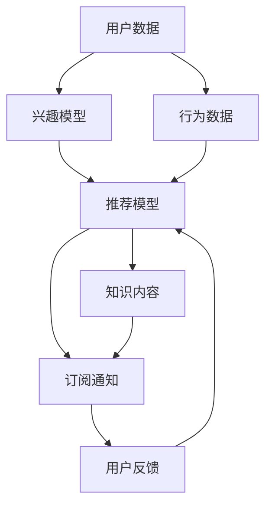

                 

# 个性化知识订阅提高知识获取的针对性

## 1. 背景介绍

在信息爆炸的时代，知识获取已经成为了人们日常生活和工作中的重要环节。传统的知识获取方式往往较为单一，无法根据用户的个人兴趣、职业需求和认知水平提供个性化的知识推荐。个性化知识订阅通过综合利用人工智能、大数据和自然语言处理等技术，能够精准定位用户需求，从而提供更具针对性和实效性的知识服务。本文将探讨个性化知识订阅的基本概念、核心技术及其在实际应用中的表现。

## 2. 核心概念与联系

### 2.1 核心概念概述

个性化知识订阅指的是通过智能算法，根据用户的兴趣、行为和反馈，动态调整推荐内容，以提高知识获取的针对性和实效性。它是一种将信息科技与知识管理相结合的创新模式，旨在为个体提供更高效、更个性化的知识服务。

### 2.2 核心概念原理和架构的 Mermaid 流程图



### 2.3 核心概念之间的联系

个性化知识订阅的核心在于用户数据的收集和处理、兴趣模型的构建、行为数据的追踪、推荐模型的训练以及订阅通知的实时推送。用户数据和行为数据共同构成了模型的训练数据集，推荐模型基于这些数据进行训练，输出推荐内容，并通过订阅通知实时推送给用户。用户反馈又会不断调整推荐模型的参数，形成一个闭环。

## 3. 核心算法原理 & 具体操作步骤

### 3.1 算法原理概述

个性化知识订阅基于用户画像构建，通过数据挖掘和机器学习算法对用户行为进行分析，从而实现个性化推荐。其主要原理包括：

1. **用户画像构建**：通过对用户历史行为数据的分析和挖掘，构建用户的兴趣、职业、学习习惯等多维度的画像。
2. **推荐算法训练**：根据用户画像和推荐目标，设计并训练推荐模型，以实现个性化内容的推荐。
3. **订阅通知系统**：构建订阅通知系统，实时推送个性化知识内容给用户。
4. **用户反馈收集与调整**：通过用户反馈不断调整推荐模型，优化推荐效果。

### 3.2 算法步骤详解

个性化知识订阅的主要步骤如下：

1. **数据收集**：收集用户的历史浏览、点击、收藏等行为数据，以及基本信息，如年龄、职业等。
2. **用户画像构建**：使用数据挖掘和机器学习算法，构建用户的多维度画像。
3. **推荐模型训练**：基于用户画像，设计并训练推荐模型，以生成个性化推荐内容。
4. **推荐内容生成**：根据用户画像和推荐模型，生成个性化推荐内容。
5. **订阅通知推送**：通过订阅通知系统，实时推送推荐内容给用户。
6. **用户反馈收集与调整**：通过用户反馈不断调整推荐模型，优化推荐效果。

### 3.3 算法优缺点

个性化知识订阅的优点在于能够根据用户的具体需求提供个性化的知识服务，提高用户的学习效率和满意度。其主要缺点在于对用户数据的依赖较强，以及推荐模型的准确性和实效性需要不断优化。

### 3.4 算法应用领域

个性化知识订阅可以应用于多个领域，如在线教育、企业培训、学术研究等。在在线教育领域，可以根据学生的学习行为和偏好，推送个性化的学习资源；在企业培训领域，可以根据员工的学习进度和职业需求，推送定制化的培训内容；在学术研究领域，可以根据研究者的兴趣和需求，推送最新的研究论文和数据集。

## 4. 数学模型和公式 & 详细讲解 & 举例说明

### 4.1 数学模型构建

个性化知识订阅的数学模型构建主要包括以下几个方面：

1. **用户兴趣模型**：使用协同过滤、基于内容的推荐等方法，构建用户兴趣模型。
2. **用户行为模型**：使用序列模型、协同过滤等方法，分析用户行为数据。
3. **推荐模型**：使用矩阵分解、深度学习等方法，设计推荐模型。

### 4.2 公式推导过程

以协同过滤推荐算法为例，其核心公式如下：

$$
\hat{y}_{ui} = \frac{\sum_{v \in N_i} r_{uv} x_{vi}}{\sqrt{\sum_{v \in N_i} r_{uv}^2 + \epsilon}}
$$

其中，$r_{uv}$ 表示用户 $u$ 和物品 $v$ 的评分，$x_{vi}$ 表示物品 $v$ 的属性向量，$N_i$ 表示用户 $u$ 的邻居集合，$\epsilon$ 表示正则化项。

### 4.3 案例分析与讲解

假设某用户 $u$ 对物品 $v$ 的评分是 $5$，用户 $u$ 的邻居对物品 $v$ 的评分分别是 $4$ 和 $3$，物品 $v$ 的属性向量是 $(1, 2, 3)$，则协同过滤推荐算法可以计算出用户 $u$ 对物品 $v$ 的预测评分：

$$
\hat{y}_{ui} = \frac{4 \times 1 + 3 \times 2}{\sqrt{4^2 + 3^2 + \epsilon}} \approx 2.2
$$

## 5. 项目实践：代码实例和详细解释说明

### 5.1 开发环境搭建

1. **安装Python**：使用Anaconda创建虚拟环境，安装所需库。
2. **安装Flask**：用于搭建后端API，生成推荐内容。
3. **安装Scikit-learn**：用于构建用户兴趣和行为模型。

### 5.2 源代码详细实现

```python
from flask import Flask, request, jsonify
from sklearn.neighbors import NearestNeighbors
from sklearn.decomposition import TruncatedSVD
from sklearn.metrics.pairwise import cosine_similarity

app = Flask(__name__)

# 用户兴趣模型
user_interest = TruncatedSVD(n_components=100).fit(user_data)

# 用户行为模型
user_behavior = NearestNeighbors(metric='cosine', algorithm='brute').fit(user_data)

# 推荐模型
def recommend(user_id):
    # 获取用户行为数据
    user_data = user_behavior.kneighbors(user_id, n_neighbors=20)
    
    # 计算相似度
    similarity = cosine_similarity(user_data, user_interest)
    
    # 生成推荐内容
    recommendation = user_interest.transform(similarity)
    
    return recommendation.tolist()

# 推荐API
@app.route('/recommend', methods=['POST'])
def recommend_api():
    user_id = request.json['user_id']
    recommendation = recommend(user_id)
    return jsonify(recommendation)

if __name__ == '__main__':
    app.run(debug=True)
```

### 5.3 代码解读与分析

上述代码实现了基于协同过滤算法的推荐API，主要步骤如下：

1. **用户兴趣模型**：使用TruncatedSVD降维算法，构建用户兴趣模型。
2. **用户行为模型**：使用NearestNeighbors算法，分析用户行为数据。
3. **推荐模型**：通过计算相似度和降维算法，生成个性化推荐内容。

### 5.4 运行结果展示

运行API后，可以通过接口获取用户ID为123的个性化推荐内容。

## 6. 实际应用场景

### 6.1 在线教育

个性化知识订阅在在线教育领域具有广阔的应用前景。例如，某在线教育平台可以根据学生的学习行为和成绩，推送个性化的学习资源，帮助学生提升学习效果。

### 6.2 企业培训

在企业培训领域，个性化知识订阅可以帮助企业根据员工的学习进度和职业需求，推送定制化的培训内容，提升员工的技能水平。

### 6.3 学术研究

在学术研究领域，个性化知识订阅可以帮助研究者根据其兴趣和需求，推送最新的研究论文和数据集，提升科研效率。

## 7. 工具和资源推荐

### 7.1 学习资源推荐

1. **《推荐系统基础与实践》**：介绍推荐系统基础和各类推荐算法，适合初学者学习。
2. **Coursera《机器学习》课程**：由斯坦福大学教授讲授，涵盖推荐系统等内容。
3. **Kaggle**：提供各类推荐系统竞赛和案例，适合实战练习。

### 7.2 开发工具推荐

1. **Python**：易于学习和使用，适合推荐系统开发。
2. **Scikit-learn**：提供多种机器学习算法，适合构建用户兴趣和行为模型。
3. **TensorFlow**：提供深度学习框架，适合复杂推荐模型的开发。

### 7.3 相关论文推荐

1. **《基于协同过滤的推荐系统》**：介绍协同过滤算法及其应用。
2. **《深度学习在推荐系统中的应用》**：介绍深度学习在推荐系统中的最新应用。
3. **《个性化推荐系统研究进展》**：综述个性化推荐系统的最新进展。

## 8. 总结：未来发展趋势与挑战

### 8.1 未来发展趋势

1. **推荐系统个性化**：未来推荐系统将更加个性化，能够根据用户的实时行为和反馈，不断调整推荐内容。
2. **跨平台协同**：跨平台协同推荐将提高推荐内容的丰富性和多样性，提升用户体验。
3. **实效性提升**：实效性推荐将更加注重内容的实际应用价值，提高用户的学习和工作效率。
4. **多模态推荐**：将文本、图像、视频等多种模态的数据融合到推荐模型中，提供更加全面的推荐内容。

### 8.2 面临的挑战

1. **数据隐私问题**：用户数据的隐私保护是推荐系统的重要挑战之一。
2. **推荐模型的可解释性**：推荐模型的决策过程需要更高的可解释性，以增强用户信任。
3. **推荐内容的多样性**：如何生成多样且优质的推荐内容，避免用户对某一类内容的过度依赖。
4. **推荐系统的稳定性**：推荐系统的稳定性和鲁棒性需要不断优化，以应对复杂多变的网络环境。

### 8.3 研究展望

未来的研究方向包括：

1. **推荐系统的实时优化**：实现推荐系统的动态调整，提高推荐内容的实效性。
2. **推荐系统的跨平台协同**：实现跨平台的用户数据融合，提升推荐内容的丰富性。
3. **推荐系统的多样性生成**：通过多模态数据的融合，提升推荐内容的创新性。
4. **推荐系统的可解释性**：通过可解释性模型和用户交互，增强推荐系统的可信度。

## 9. 附录：常见问题与解答

**Q1: 个性化知识订阅的推荐算法有哪些？**

A: 个性化知识订阅的推荐算法主要包括协同过滤、基于内容的推荐、矩阵分解等方法。

**Q2: 如何处理冷启动问题？**

A: 冷启动问题可以通过用户画像的构建和初始化推荐内容的方式解决，如根据用户的基本信息或兴趣推荐一些基础内容。

**Q3: 推荐系统的扩展性如何保障？**

A: 推荐系统的扩展性可以通过多级缓存、异步处理等方式保障，避免系统负载过高。

**Q4: 推荐系统的稳定性和鲁棒性如何提升？**

A: 推荐系统的稳定性和鲁棒性可以通过模型优化、算法迭代和数据清洗等方式提升，避免模型过拟合和数据噪声的影响。

**Q5: 如何保障推荐系统的隐私和安全？**

A: 推荐系统的隐私和安全可以通过数据匿名化、用户隐私保护等措施保障，避免用户数据泄露。

---

作者：禅与计算机程序设计艺术 / Zen and the Art of Computer Programming

