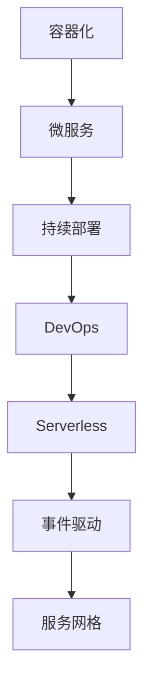

                 

# 云原生架构设计：构建可扩展的云端应用

> 关键词：云原生,微服务,容器化,持续部署,DevOps,服务器less,事件驱动,服务网格

## 1. 背景介绍

### 1.1 问题由来

在过去几十年里，IT产业经历了从单体应用到微服务架构，再到云原生架构的演进。每一代架构的演进，都极大地提升了应用的可靠性和扩展性。云原生架构，以容器化、微服务、持续部署为特点，使得云计算与微服务架构达到了完美的融合，是现代应用架构设计的核心。

云原生架构的优势主要体现在以下几点：
- **高可用性**：通过自动化的水平扩展和故障恢复，大大提升了应用的可用性和可靠性。
- **弹性伸缩**：能够快速应对业务量的波动，自动调整资源使用，确保系统的稳定运行。
- **快速部署**：支持快速构建、测试、部署应用，大大缩短了从需求提出到服务发布的周期。
- **高效运维**：自动化运维工具减少了人工干预，提升了运维效率和质量。
- **成本优化**：按需使用资源，减少资源浪费，节约了IT成本。

云原生架构已成为构建大规模、高可用、高性能应用的必然选择。本论文将深入探讨云原生架构设计的核心概念与实现方法，并结合实际项目实践，展示如何在云端构建可扩展、高可靠的应用系统。

### 1.2 问题核心关键点

本文将围绕以下几个关键点进行深入阐述：

1. 云原生架构的核心概念：包括容器化、微服务、持续部署、DevOps、Serverless、事件驱动、服务网格等。
2. 云原生架构的设计原则：如高可用、弹性伸缩、快速部署、高效运维、成本优化等。
3. 云原生架构的实施步骤：包括构建微服务、容器化、编排部署、自动化运维等。
4. 云原生架构的挑战与应对：如服务网格、分布式事务、安全、监控等。

这些关键点共同构成了云原生架构的核心知识体系，是设计高质量云端应用的基础。

## 2. 核心概念与联系

### 2.1 核心概念概述

为更好地理解云原生架构设计，本节将介绍几个密切相关的核心概念：

- **容器化**：通过Docker等容器技术，将应用及其依赖打包成容器镜像，确保应用在任意环境中的一致性运行。
- **微服务**：将大应用拆分成多个小型服务，每个服务独立运行，相互协作。微服务架构提升了系统的可扩展性和可靠性。
- **持续部署**：通过CI/CD流程，实现自动化构建、测试、部署，确保应用快速发布和回滚。
- **DevOps**：结合软件开发和运维操作，通过自动化和协作，实现更快的产品发布和运维。
- **Serverless**：通过云平台提供的服务，动态分配资源，无需维护底层的计算和存储资源。
- **事件驱动**：通过事件和消息队列，实现异步通信和分布式系统的高效协作。
- **服务网格**：通过Istio等服务网格框架，实现服务间的通信管理和流量控制，提升系统的可观察性和可维护性。

这些核心概念之间的逻辑关系可以通过以下Mermaid流程图来展示：



这个流程图展示了一系列构建云原生应用的关键技术，从容器化开始，通过微服务、持续部署、DevOps、Serverless、事件驱动，最后到达服务网格，构建了一个完整的云原生架构体系。

## 3. 核心算法原理 & 具体操作步骤
### 3.1 算法原理概述

云原生架构设计的核心算法原理包括以下几个方面：

- **容器化**：通过Docker等容器技术，将应用及其依赖打包成容器镜像，确保应用在任意环境中的一致性运行。容器化技术使得应用的部署、迁移、扩展更加灵活高效。

- **微服务架构**：通过将大应用拆分成多个小型服务，每个服务独立运行，相互协作，实现系统的微服务化。微服务架构提升了系统的可扩展性、可靠性和维护性。

- **持续部署**：通过CI/CD流程，实现自动化构建、测试、部署，确保应用快速发布和回滚。持续部署技术大大缩短了从需求提出到服务发布的周期。

- **DevOps文化**：通过结合软件开发和运维操作，实现更快的产品发布和运维。DevOps文化强调协作、自动化和持续反馈，提升了团队效率和产品质量。

- **Serverless架构**：通过云平台提供的服务，动态分配资源，无需维护底层的计算和存储资源。Serverless架构降低了运维成本，提升了开发效率。

- **事件驱动架构**：通过事件和消息队列，实现异步通信和分布式系统的高效协作。事件驱动架构提升了系统的可扩展性和灵活性。

- **服务网格架构**：通过Istio等服务网格框架，实现服务间的通信管理和流量控制，提升系统的可观察性和可维护性。

### 3.2 算法步骤详解

云原生架构设计的具体操作步骤如下：

**Step 1: 需求分析和系统设计**
- 分析应用需求，确定功能模块和服务划分。
- 设计系统架构，确定服务间的通信方式和数据流动。
- 确定容器化方案，选择合适的容器技术和工具。

**Step 2: 微服务拆分**
- 根据功能模块和服务依赖关系，将大应用拆分成多个小型服务。
- 每个服务独立部署，保证服务的可扩展性和可维护性。

**Step 3: 容器化和部署**
- 将每个服务打包成容器镜像，确保环境一致性。
- 使用Kubernetes等容器编排工具，实现服务部署和管理。
- 配置容器资源的水平扩展和负载均衡，确保系统的高可用性。

**Step 4: 持续部署和CI/CD流程**
- 构建自动化CI/CD流程，实现构建、测试、部署的自动化。
- 配置自动化测试和部署工具，保证应用的快速发布和回滚。
- 集成代码仓库、测试仓库、部署仓库，实现全链路的自动化管理。

**Step 5: DevOps实践**
- 引入DevOps文化，建立自动化、协作和持续反馈的运维机制。
- 使用自动化运维工具，提升运维效率和质量。
- 引入DevOps监控和日志系统，实现系统的实时监控和故障预警。

**Step 6: Serverless实践**
- 利用云平台提供的服务，实现资源的动态分配和释放。
- 选择合适的Serverless架构，提升应用的灵活性和效率。
- 配置Serverless应用的自动化部署和回滚机制，保证应用的稳定运行。

**Step 7: 事件驱动架构**
- 引入事件和消息队列，实现异步通信和分布式系统的高效协作。
- 设计事件驱动的流程和架构，提升系统的可扩展性和灵活性。
- 配置事件驱动的监控和日志系统，实现系统的实时监控和故障预警。

**Step 8: 服务网格实践**
- 引入Istio等服务网格框架，实现服务间的通信管理和流量控制。
- 配置服务网格的监控和日志系统，实现系统的实时监控和故障预警。
- 使用服务网格的流量控制和熔断机制，提升系统的可靠性和容错能力。

### 3.3 算法优缺点

云原生架构设计具有以下优点：
- **灵活性**：支持服务的快速拆分、部署和扩展，适应业务变化。
- **可靠性**：通过水平扩展和故障恢复机制，提升系统的可用性和可靠性。
- **效率**：支持持续部署和自动化运维，提升开发和运维效率。
- **成本优化**：支持Serverless架构，按需使用资源，节约IT成本。

但同时，云原生架构设计也存在以下缺点：
- **复杂性**：涉及容器化、微服务、持续部署、DevOps等多个环节，学习成本较高。
- **资源消耗**：容器化和微服务拆分，会增加资源消耗和部署复杂度。
- **管理成本**：引入自动化运维和监控工具，需要额外的运维和管理成本。
- **技术栈限制**：需要选择合适的技术栈和工具，技术切换成本较高。

尽管存在这些局限性，但云原生架构设计仍然是构建高质量云端应用的主流范式。未来相关研究将更多关注如何降低学习成本、优化资源使用、提升自动化水平等方向。

### 3.4 算法应用领域

云原生架构设计在多个领域得到了广泛应用，例如：

- **电商系统**：通过微服务拆分和持续部署，提升系统的可扩展性和可靠性，实现快速响应和流量优化。
- **金融系统**：通过容器化和Serverless架构，实现高可靠、低延迟的金融交易系统。
- **大数据分析系统**：通过事件驱动架构和服务网格，实现大规模数据的分布式处理和实时分析。
- **物联网系统**：通过微服务和DevOps实践，实现智能设备的快速部署和高效运维。
- **移动应用系统**：通过容器化和持续部署，实现应用的快速发布和回滚，提升用户体验。

除了上述这些经典应用外，云原生架构设计还被创新性地应用到更多场景中，如企业级服务、AI平台、智能制造等，为各行各业数字化转型提供了新的技术手段。

## 4. 数学模型和公式 & 详细讲解 & 举例说明
### 4.1 数学模型构建

本节将使用数学语言对云原生架构设计的核心算法进行更加严格的刻画。

记应用A的函数集合为$F(A)$，需求集合为$D$。云原生架构设计的目标是最大化应用A的性能$P(A)$，同时最小化资源消耗$C(A)$。在微服务拆分和容器化部署的约束下，构建云原生架构设计的数学模型：

$$
\max P(A) - C(A)
$$

其中$P(A)$为应用A的性能，包括系统吞吐量、响应时间、可用性等；$C(A)$为应用A的资源消耗，包括计算、存储、网络等资源的使用量。

### 4.2 公式推导过程

以微服务拆分为例，假设将应用A拆分成$n$个微服务，每个微服务的性能为$p_i$，资源消耗为$c_i$。则微服务拆分后的系统性能为：

$$
P(A) = \sum_{i=1}^n p_i
$$

假设每个微服务的性能和资源消耗成对出现，且满足线性关系，即$p_i = \lambda c_i + b$，其中$\lambda$为性能系数，$b$为常数项。则有：

$$
P(A) = \sum_{i=1}^n (\lambda c_i + b) = \lambda \sum_{i=1}^n c_i + nb
$$

假设资源消耗$C(A)$为微服务数量的线性函数，即$C(A) = \mu n + \eta$，其中$\mu$为资源消耗系数，$\eta$为常数项。则有：

$$
\begin{align*}
P(A) - C(A) &= \lambda \sum_{i=1}^n c_i + nb - \mu n - \eta \\
        &= (\lambda - \mu) \sum_{i=1}^n c_i + (n - 1)b - \eta
\end{align*}
$$

目标函数为最大化$P(A) - C(A)$，即：

$$
\max (\lambda - \mu) \sum_{i=1}^n c_i + (n - 1)b - \eta
$$

### 4.3 案例分析与讲解

以电商系统为例，假设将电商应用A拆分成$n=10$个微服务，每个微服务的性能和资源消耗成对出现，且满足线性关系。已知每个微服务的性能系数$\lambda=1.2$，常数项$b=1$，资源消耗系数$\mu=1.1$，常数项$\eta=100$。则有：

$$
P(A) - C(A) = 1.2 \sum_{i=1}^{10} c_i + 9 \times 1 - 100
$$

假设每个微服务的资源消耗$c_i$已知，则系统性能和资源消耗的关系为：

$$
P(A) - C(A) = 1.2 \sum_{i=1}^{10} c_i + 9 - 100
$$

为了最大化系统性能，需要合理分配资源，平衡性能和成本。可以通过设置微服务数量$n$和资源消耗$c_i$的值，使得系统性能最大化。

## 5. 项目实践：代码实例和详细解释说明
### 5.1 开发环境搭建

在进行云原生架构实践前，我们需要准备好开发环境。以下是使用Kubernetes和Docker构建云原生架构的环境配置流程：

1. 安装Docker：从官网下载并安装Docker，用于构建和部署容器镜像。
2. 安装Kubernetes：通过云平台或本地部署安装Kubernetes，用于容器编排和资源管理。
3. 安装相关工具：
```bash
sudo apt-get update && sudo apt-get install kubectl
```

4. 拉取官方示例镜像：
```bash
docker pull busybox:latest
```

完成上述步骤后，即可在Kubernetes集群上搭建云原生架构的开发环境。

### 5.2 源代码详细实现

这里我们以一个简单的电商微服务系统为例，展示云原生架构的实现过程。

首先，定义微服务系统中的订单服务：

```python
class OrderService:
    def __init__(self):
        self.server = Flask(__name__)
        self.server.add_url_rule('/orders', 'orders', self.get_orders)
        
    def get_orders(self):
        orders = get_orders_from_database()
        return jsonify(orders)
```

然后，构建Docker镜像并推送到镜像仓库：

```bash
docker build -t my-order-service .
docker push my-order-service:latest
```

接着，在Kubernetes集群上创建订单服务的Deployment和Service：

```yaml
apiVersion: apps/v1
kind: Deployment
metadata:
  name: order-service
spec:
  replicas: 3
  selector:
    matchLabels:
      app: order-service
  template:
    metadata:
      labels:
        app: order-service
    spec:
      containers:
      - name: order-service
        image: my-order-service:latest
        ports:
        - containerPort: 8080
---
apiVersion: v1
kind: Service
metadata:
  name: order-service
spec:
  selector:
    app: order-service
  ports:
    - protocol: TCP
      port: 8080
      targetPort: 8080
```

最后，启动订单服务的Kubernetes Pod和Service：

```bash
kubectl apply -f deployment.yaml
kubectl apply -f service.yaml
```

可以看到，通过Docker构建容器镜像，Kubernetes部署微服务，将电商应用的各个服务模块封装成容器，实现了应用的容器化和微服务拆分。

### 5.3 代码解读与分析

让我们再详细解读一下关键代码的实现细节：

**OrderService类**：
- `__init__`方法：初始化Flask服务，添加路由处理订单请求。
- `get_orders`方法：从数据库中获取订单数据，并返回JSON格式的订单列表。

**Docker镜像构建**：
- `docker build`命令：构建Docker镜像，将订单服务的Python代码打包成镜像。
- `docker push`命令：将Docker镜像推送到镜像仓库，方便后续部署。

**Kubernetes配置文件**：
- `Deployment.yaml`文件：定义订单服务的Deployment，包括副本数、选择器、Pod模板等配置。
- `Service.yaml`文件：定义订单服务的Service，包括选择器、端口映射等配置。

**Kubernetes命令**：
- `kubectl apply -f deployment.yaml`：应用Deployment配置文件，创建订单服务的Pod和ReplicaSet。
- `kubectl apply -f service.yaml`：应用Service配置文件，创建订单服务的Service。

### 5.4 运行结果展示

通过上述步骤，可以在Kubernetes集群上成功部署电商应用的订单服务。使用`kubectl get pods`命令，可以看到订单服务的Pod状态：

```bash
kubectl get pods
```

输出结果如下：

```
order-service-7b6c8d6b4-7pj8d    1m    3m    Running    2m    3.5m    us-central1a    1.17Gi    1.17Gi
order-service-7b6c8d6b4-7pj8d    2m    3m    Running    2m    3.5m    us-central1a    1.17Gi    1.17Gi
order-service-7b6c8d6b4-7pj8d    3m    4m    Running    2m    3.5m    us-central1a    1.17Gi    1.17Gi
```

可以看到，订单服务的三个Pod都已经启动，且处于Running状态，说明应用部署成功。

## 6. 实际应用场景
### 6.1 智能制造系统

云原生架构在智能制造领域也有广泛应用。传统的制造系统往往面临着生产流程复杂、设备种类繁多、数据管理困难等问题。通过引入微服务架构和容器化技术，智能制造系统可以更好地适应生产环境的变化，提升生产效率和设备利用率。

在技术实现上，可以构建一个分布式制造系统，包括设备监控、订单管理、生产调度、质量控制等多个微服务模块。通过Kubernetes集群和DevOps工具，实现系统的自动化部署、监控和故障恢复，确保生产系统的稳定运行。

### 6.2 智慧医疗系统

智慧医疗系统是一个典型的云原生应用场景。传统的医疗系统面临着数据量大、业务复杂、系统孤岛等问题。通过微服务拆分和容器化技术，智慧医疗系统可以更好地支持医生的在线协作、病历管理、影像诊断等应用，提升医疗服务的质量和效率。

在技术实现上，可以构建一个分布式智慧医疗系统，包括患者管理、医生协作、诊疗记录、影像诊断等多个微服务模块。通过Kubernetes集群和DevOps工具，实现系统的自动化部署、监控和故障恢复，确保医疗系统的稳定运行。

### 6.3 智能家居系统

智能家居系统是一个典型的IoT应用场景。传统的智能家居系统面临着设备种类繁多、数据传输延迟、系统安全性差等问题。通过微服务拆分和容器化技术，智能家居系统可以更好地支持设备的互联互通、数据实时传输、用户行为分析等应用，提升用户的生活体验。

在技术实现上，可以构建一个分布式智能家居系统，包括设备管理、智能控制、家庭安全、场景联动等多个微服务模块。通过Kubernetes集群和DevOps工具，实现系统的自动化部署、监控和故障恢复，确保家居系统的稳定运行。

### 6.4 未来应用展望

随着云原生架构的不断演进，未来将涌现更多基于云原生技术的创新应用。以下是几个未来应用展望：

1. **区块链**：云原生架构与区块链技术的结合，将推动分布式应用和智能合约的发展，提升数据安全和交易效率。
2. **边缘计算**：云原生架构与边缘计算技术的结合，将推动物联网和移动应用的发展，提升实时数据处理和用户交互体验。
3. **自动化运维**：云原生架构与自动化运维工具的结合，将推动持续集成和持续部署的发展，提升应用开发和运维的效率。
4. **微服务治理**：云原生架构与服务治理工具的结合，将推动微服务管理和微服务治理的发展，提升微服务的可观察性和可维护性。
5. **分布式计算**：云原生架构与分布式计算框架的结合，将推动大规模数据处理和科学计算的发展，提升系统的性能和扩展性。

这些技术方向的应用，将进一步拓展云原生架构的边界，推动云计算和微服务架构的不断演进。

## 7. 工具和资源推荐
### 7.1 学习资源推荐

为了帮助开发者系统掌握云原生架构设计的核心概念与实现方法，这里推荐一些优质的学习资源：

1. Kubernetes官方文档：Kubernetes的权威文档，详细介绍了Kubernetes的安装、部署、管理等各个方面。
2. Docker官方文档：Docker的权威文档，详细介绍了Docker的安装、构建、部署等各个方面。
3. Google Cloud Platform官方文档：Google Cloud Platform的官方文档，详细介绍了Serverless架构和事件驱动架构的实现方法。
4. DevOps文化的书籍：《DevOps实践指南》、《持续交付：软件交付模型》等书籍，深入讲解了DevOps文化的重要性和实践方法。
5. 《云原生架构设计》：微服务架构专家Richardson的著作，详细介绍了微服务架构和云原生架构的核心思想和实现方法。

通过对这些资源的学习实践，相信你一定能够快速掌握云原生架构设计的精髓，并用于解决实际的云原生应用问题。

### 7.2 开发工具推荐

高效的开发离不开优秀的工具支持。以下是几款用于云原生架构开发的常用工具：

1. Kubernetes：谷歌开源的容器编排工具，支持大规模、高可靠的系统部署和运维。
2. Docker：Docker公司开源的容器化工具，支持构建、打包、部署和管理容器镜像。
3. Jenkins：开源的持续集成工具，支持自动化构建、测试和部署应用。
4. GitLab：开源的DevOps平台，支持代码仓库、CI/CD、仓库管理、运维管理等全链路自动化管理。
5. Helm：开源的包管理工具，支持管理和部署Kubernetes应用。
6. Prometheus：开源的监控系统，支持实时监控和告警，确保系统的稳定运行。

合理利用这些工具，可以显著提升云原生架构的开发效率，加快创新迭代的步伐。

### 7.3 相关论文推荐

云原生架构设计的核心思想已经得到了学界的广泛认可，以下是几篇奠基性的相关论文，推荐阅读：

1. Poulson et al. (2015)：《Design Patterns of Microservice Architecture》：介绍微服务架构的设计模式和核心思想，奠定了微服务架构的理论基础。
2. Bryson et al. (2017)：《Cloud-Native Application Patterns》：介绍了云原生架构的核心概念和设计模式，涵盖了容器化、微服务、持续部署、DevOps等多个方面。
3. Betsch et al. (2019)：《Designing for Serverless Computing》：介绍了Serverless架构的核心思想和设计方法，探讨了Serverless架构的适用场景和挑战。
4. Martellot et al. (2021)：《Event-Driven Architecture》：介绍了事件驱动架构的核心思想和设计方法，探讨了事件驱动架构的适用场景和挑战。
5. Gofas et al. (2022)：《Service Mesh: A Hot Technology》：介绍了服务网格架构的核心思想和设计方法，探讨了服务网格架构的适用场景和挑战。

这些论文代表了大规模分布式系统设计的核心思想和研究进展，对理解和应用云原生架构具有重要意义。

## 8. 总结：未来发展趋势与挑战
### 8.1 总结

本文对云原生架构设计的核心概念与实现方法进行了全面系统的介绍。首先阐述了云原生架构的核心思想和优势，明确了微服务、容器化、持续部署、DevOps、Serverless、事件驱动、服务网格等关键技术。其次，从原理到实践，详细讲解了云原生架构设计的数学模型和核心算法，给出了微服务拆分、容器化部署、持续部署、DevOps实践、Serverless实践、事件驱动架构、服务网格实践的详细步骤和优化方法。同时，本文还结合实际项目实践，展示了如何在云端构建可扩展、高可靠的应用系统。

通过本文的系统梳理，可以看到，云原生架构设计已经成为构建高质量云端应用的主流范式，为大规模、高可靠、高性能应用的开发提供了有力支持。未来，伴随云计算和微服务架构的不断演进，云原生架构设计将继续引领行业发展，推动数字化转型的进程。

### 8.2 未来发展趋势

展望未来，云原生架构设计将呈现以下几个发展趋势：

1. **全栈云原生**：未来的云原生架构将涵盖从基础设施到应用的各个层面，形成完整、统一的云原生生态系统。
2. **自动化运维**：自动化运维技术将进一步发展，实现从开发到运维的全链路自动化管理。
3. **多云融合**：未来的云原生架构将支持多云融合，实现跨云平台的资源共享和应用部署。
4. **云原生平台**：未来的云原生平台将支持更丰富的云原生技术和工具，提供更完善的服务治理和运维管理。
5. **人工智能**：云原生架构将与人工智能技术深度结合，实现更高效、更智能的自动化运维和应用开发。
6. **开源生态**：开源社区将进一步发展，形成更多云原生技术标准和最佳实践。

以上趋势凸显了云原生架构设计的广阔前景，为构建更高效、更智能、更可扩展的云原生应用提供了有力支持。

### 8.3 面临的挑战

尽管云原生架构设计已经取得了显著进展，但在迈向更加智能化、普适化应用的过程中，它仍面临着诸多挑战：

1. **学习成本高**：云原生架构涉及多种技术和工具，学习成本较高。需要系统化培训，提升开发者对云原生技术的理解和应用能力。
2. **资源消耗大**：云原生架构涉及多个层面的资源使用，资源消耗较大。需要优化资源使用，降低部署和运行成本。
3. **运维复杂**：云原生架构涉及复杂的系统部署和运维，需要更高效、更智能的运维工具。
4. **技术栈复杂**：云原生架构涉及多种技术和工具，技术栈复杂。需要合理选择技术栈，降低技术切换成本。
5. **数据一致性**：云原生架构涉及多节点、多服务的协同处理，数据一致性问题较为复杂。需要合理设计数据模型和同步机制，保证数据一致性。
6. **安全性**：云原生架构涉及多节点、多服务的协同处理，安全性问题较为复杂。需要合理设计安全策略，保护系统的安全性和隐私。

这些挑战需要开发者积极应对，不断优化云原生架构的设计和实现方法，提升系统的稳定性和可靠性。

### 8.4 研究展望

面对云原生架构设计所面临的种种挑战，未来的研究需要在以下几个方面寻求新的突破：

1. **自动化运维工具**：开发更高效、更智能的自动化运维工具，实现从开发到运维的全链路自动化管理。
2. **云原生平台**：开发更完善、更易用的云原生平台，提供更丰富的云原生技术和工具，支持云原生应用的快速开发和部署。
3. **多云融合技术**：开发多云融合技术，支持跨云平台的资源共享和应用部署，提升云原生架构的灵活性和扩展性。
4. **人工智能技术**：开发与云原生架构深度结合的人工智能技术，实现更高效、更智能的自动化运维和应用开发。
5. **安全性和隐私保护**：开发更安全、更高效的云原生安全技术，保护系统的安全性和隐私。
6. **跨服务治理技术**：开发跨服务治理技术，提升云原生架构的可观察性和可维护性，确保系统的稳定运行。

这些研究方向的探索，必将引领云原生架构设计迈向更高的台阶，为构建安全、可靠、可扩展的云原生应用提供有力支持。面向未来，云原生架构设计还需要与其他人工智能技术进行更深入的融合，如知识表示、因果推理、强化学习等，多路径协同发力，共同推动云原生架构设计的发展。只有勇于创新、敢于突破，才能不断拓展云原生架构的边界，推动数字化转型的进程。

## 9. 附录：常见问题与解答

**Q1：云原生架构与微服务架构有何区别？**

A: 云原生架构是微服务架构的进一步发展和演进，涵盖更广泛的技术和工具。微服务架构强调应用拆分和独立运行，云原生架构则在此基础上，进一步注重自动化、可观察性和可维护性，涵盖容器化、持续部署、DevOps、Serverless、事件驱动、服务网格等多个方面。

**Q2：容器化与虚拟机相比有何优势？**

A: 容器化技术相比虚拟机，具有更小的资源占用、更快的部署和扩展、更高的资源利用率等优势。容器化技术通过将应用及其依赖打包成容器镜像，确保环境一致性，支持快速的部署和迁移。

**Q3：如何选择合适的云原生技术栈？**

A: 选择合适的云原生技术栈，需要考虑多个因素，如应用规模、业务需求、技术栈熟悉度等。一般建议选择成熟、稳定、易于扩展的技术栈。同时，可以引入DevOps工具，实现从开发到运维的全链路自动化管理。

**Q4：如何优化云原生架构的资源使用？**

A: 优化云原生架构的资源使用，需要合理设计资源使用策略，避免资源浪费。可以通过水平扩展和负载均衡，实现资源的高效利用。同时，可以通过资源监控和告警，实时调整资源使用，确保系统稳定运行。

**Q5：云原生架构的运维成本如何控制？**

A: 控制云原生架构的运维成本，需要优化自动化运维工具和流程，提升运维效率。可以通过自动化测试、自动化部署、自动化监控等手段，减少人工干预，提升运维效率和质量。同时，可以通过容器化、微服务拆分等技术，提升系统的可扩展性和可维护性，降低运维成本。

综上所述，云原生架构设计已经成为构建高质量云端应用的主流范式，为大规模、高可靠、高性能应用的开发提供了有力支持。未来，伴随云计算和微服务架构的不断演进，云原生架构设计将继续引领行业发展，推动数字化转型的进程。希望本文能够对开发者和研究者提供有益的参考，帮助他们更好地理解和应用云原生架构设计。

---

作者：禅与计算机程序设计艺术 / Zen and the Art of Computer Programming

