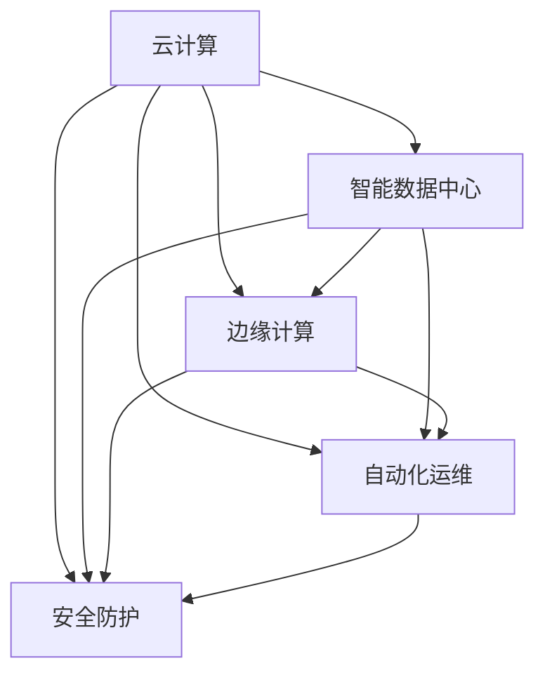

                 

# 云计算与AI的融合：Lepton AI的技术愿景

> 关键词：云计算, AI融合, Lepton AI, 技术愿景, 数据中心, 基础设施, 边缘计算, 自动化, 安全

## 1. 背景介绍

在科技迅猛发展的今天，云计算与人工智能（AI）的深度融合已经成为不可逆转的趋势。云计算为AI的应用提供了强大的计算资源和弹性扩展能力，而AI则为云计算注入了智能化、自动化的新活力。在此背景下，Lepton AI应运而生，旨在通过云计算与AI的有机结合，构建下一代智能基础设施，推动各行各业的数字化转型。

### 1.1 问题由来
随着AI技术的不断突破，AI模型和算法的复杂度日益增加，对计算资源的需求也呈指数级增长。传统的本地计算模式已经难以满足这一需求。与此同时，全球数据量呈爆炸式增长，对数据存储和处理能力提出了更高的要求。面对这一挑战，云计算提供了一种灵活、高效、按需使用的计算资源解决方案，能够满足AI对大规模计算和存储的需求。然而，云计算的普及也带来了网络延迟、数据隐私和安全性等新问题，需要通过AI技术进行智能化优化。

### 1.2 问题核心关键点
Lepton AI的技术愿景，简而言之，就是通过云计算与AI的深度融合，构建一个智能、安全、高效的全球计算网络，为用户提供极致的计算体验。这一愿景具体体现在以下几个方面：

1. **智能数据中心**：通过AI算法优化数据中心的管理和调度，实现计算资源的动态平衡和高效利用。
2. **边缘计算**：在边缘设备上部署智能AI模型，实现本地化数据处理和实时响应。
3. **自动化运维**：利用AI自动化运维技术，优化云计算基础设施的运维流程，提升服务质量和用户体验。
4. **安全防护**：采用AI技术强化云计算基础设施的安全防护，保障数据隐私和系统稳定性。

### 1.3 问题研究意义
Lepton AI的技术愿景，对推动云计算与AI的融合具有重要意义：

1. **提升计算效率**：通过AI算法优化云计算基础设施，实现计算资源的动态平衡和高效利用，提升整体计算效率。
2. **优化用户体验**：通过AI技术强化云计算的安全和自动化运维，提升服务的稳定性和可靠性，提升用户体验。
3. **赋能行业应用**：通过云计算与AI的融合，提供强大的计算和数据处理能力，赋能各行各业的数字化转型，推动经济社会发展。
4. **推动技术创新**：云计算与AI的融合催生了新的技术方向，如边缘计算、自动化运维等，推动相关技术的不断创新和进步。

## 2. 核心概念与联系

### 2.1 核心概念概述

为了更好地理解Lepton AI的技术愿景，本节将介绍几个密切相关的核心概念：

1. **云计算（Cloud Computing）**：一种通过网络提供计算资源和服务的方式，用户可以按需使用这些资源，无需自己搭建和维护基础设施。
2. **人工智能（Artificial Intelligence, AI）**：一种使计算机系统能够执行通常需要人类智能的任务的技术，包括感知、学习、推理、决策等。
3. **智能数据中心（Smart Data Center）**：通过AI算法优化数据中心的管理和调度，实现计算资源的动态平衡和高效利用。
4. **边缘计算（Edge Computing）**：一种将计算资源部署在靠近数据源的分布式设备上的计算模式，以实现快速响应和低延迟处理。
5. **自动化运维（Automated Operations and Maintenance）**：利用AI技术优化云计算基础设施的运维流程，提升服务质量和用户体验。
6. **安全防护（Security Protection）**：采用AI技术强化云计算基础设施的安全防护，保障数据隐私和系统稳定性。

这些核心概念之间的逻辑关系可以通过以下Mermaid流程图来展示：



这个流程图展示了这个核心概念的逻辑关系：

1. 云计算为智能数据中心、边缘计算、自动化运维和安全防护提供了基础设施。
2. 智能数据中心通过AI算法优化资源调度，实现高效利用。
3. 边缘计算通过在靠近数据源的设备上部署AI模型，实现本地化处理和低延迟响应。
4. 自动化运维利用AI技术优化运维流程，提升服务质量。
5. 安全防护采用AI技术强化安全防护，保障数据隐私和系统稳定性。

这些概念共同构成了Lepton AI的技术愿景，即通过云计算与AI的深度融合，构建一个智能、安全、高效的全球计算网络。

## 3. 核心算法原理 & 具体操作步骤
### 3.1 算法原理概述

Lepton AI的技术愿景，从根本上依赖于云计算与AI的深度融合。其核心算法原理主要包括以下几个方面：

1. **智能调度算法**：通过AI算法优化数据中心的管理和调度，实现计算资源的动态平衡和高效利用。
2. **边缘计算优化算法**：在边缘设备上部署智能AI模型，实现本地化数据处理和实时响应。
3. **自动化运维算法**：利用AI技术优化云计算基础设施的运维流程，提升服务质量和用户体验。
4. **安全防护算法**：采用AI技术强化云计算基础设施的安全防护，保障数据隐私和系统稳定性。

### 3.2 算法步骤详解

Lepton AI的技术愿景涉及多个复杂的算法步骤，以下将详细介绍这些步骤：

**Step 1: 智能调度算法**
- 收集数据中心内各计算节点的性能数据，包括CPU利用率、内存使用率、网络带宽等。
- 利用AI算法（如深度强化学习、多臂老虎机等），预测各个节点的未来负载情况，优化资源分配。
- 动态调整节点之间的负载均衡，实现计算资源的动态平衡和高效利用。

**Step 2: 边缘计算优化算法**
- 在边缘设备上部署轻量级AI模型，利用边缘计算平台（如IoT设备、移动终端等）收集数据。
- 采用联邦学习等技术，在边缘设备上训练本地模型，避免将大量数据传输到云端。
- 利用AI算法优化边缘计算流程，实现实时响应和低延迟处理。

**Step 3: 自动化运维算法**
- 利用AI技术监测云计算基础设施的运行状态，包括硬件、软件、网络等各个方面。
- 通过机器学习算法，预测潜在故障，提前进行维护和修复。
- 自动化运维流程包括自动更新、自动扩展、自动故障排查等，提升服务质量和用户体验。

**Step 4: 安全防护算法**
- 采用AI技术分析网络流量，识别潜在的安全威胁，如DDoS攻击、SQL注入等。
- 利用深度学习等算法，实时监控系统行为，发现异常行为并采取相应措施。
- 通过加密、访问控制、身份认证等技术手段，强化数据隐私和系统安全性。

### 3.3 算法优缺点

Lepton AI的技术愿景中涉及的算法有以下优缺点：

**优点：**
1. **高效性**：通过AI算法优化资源调度和边缘计算，实现高效利用计算资源，提升计算效率。
2. **实时性**：通过在边缘设备上部署AI模型，实现实时响应和低延迟处理，提升用户体验。
3. **自动化**：利用AI技术优化运维流程，提升服务质量和用户体验，降低运维成本。
4. **安全性**：采用AI技术强化安全防护，保障数据隐私和系统稳定性。

**缺点：**
1. **复杂性**：涉及多个复杂的算法步骤，需要高度的算法设计和实现能力。
2. **数据隐私**：需要处理和传输大量敏感数据，存在数据隐私和安全风险。
3. **资源消耗**：AI算法本身需要计算资源，可能会增加系统负担。
4. **算法偏差**：AI算法可能会因为数据偏差导致决策错误，影响系统稳定性。

### 3.4 算法应用领域

Lepton AI的技术愿景在多个领域具有广泛的应用前景：

1. **云计算基础设施**：优化数据中心的管理和调度，提升计算效率和资源利用率。
2. **边缘计算平台**：在靠近数据源的设备上部署AI模型，实现实时响应和低延迟处理。
3. **自动运维系统**：优化运维流程，提升服务质量和用户体验。
4. **安全防护系统**：强化数据隐私和系统稳定性，保障数据安全和系统可靠运行。
5. **智能监控系统**：实时监控云计算基础设施的运行状态，提升系统稳定性和可靠性。

## 4. 数学模型和公式 & 详细讲解 & 举例说明（备注：数学公式请使用latex格式，latex嵌入文中独立段落使用 $$，段落内使用 $)
### 4.1 数学模型构建

Lepton AI的技术愿景涉及多个复杂的数学模型，以下将详细介绍这些模型：

1. **智能调度模型**
   - 目标函数：最小化数据中心内各计算节点的能耗和延迟，最大化资源利用率。
   - 约束条件：计算节点负载均衡，任务优先级，资源可用性等。

2. **边缘计算优化模型**
   - 目标函数：最小化边缘设备上的数据传输量和计算延迟，最大化计算效率。
   - 约束条件：模型大小限制，计算资源限制，网络带宽限制等。

3. **自动化运维模型**
   - 目标函数：最小化运维成本，提升服务质量和用户体验。
   - 约束条件：运维任务优先级，服务可用性，资源限制等。

4. **安全防护模型**
   - 目标函数：最小化安全威胁的影响，最大化系统稳定性。
   - 约束条件：数据隐私保护，访问控制策略，异常检测精度等。

### 4.2 公式推导过程

以下以智能调度模型为例，推导其数学公式：

设数据中心内有 $n$ 个计算节点，每个节点的计算能力为 $c_i$，当前负载为 $l_i$，能耗为 $e_i$。目标函数为：

$$
\min \sum_{i=1}^n e_i + \lambda \sum_{i=1}^n l_i
$$

约束条件为：

$$
\begin{cases}
l_i \leq c_i \\
l_i \geq 0 \\
e_i = \alpha l_i^2 + \beta l_i + \gamma
\end{cases}
$$

其中，$\alpha$、$\beta$、$\gamma$ 为能耗模型系数。

通过引入优化算法（如遗传算法、粒子群算法等），求解上述优化问题，得到最优的节点负载分配策略，从而实现智能调度。

### 4.3 案例分析与讲解

以某云计算数据中心为例，该中心有20个计算节点，每个节点的计算能力为2核2G。当前负载分别为 $l_1=0.8$、$l_2=0.5$、$l_3=0.3$。能耗模型系数为 $\alpha=0.01$、$\beta=0.1$、$\gamma=0.01$。

通过上述智能调度模型，求解得到最优的负载分配策略，结果如下：

- 节点1：计算能力 $c_1=2$，最优负载 $l_1^* = 0.6$
- 节点2：计算能力 $c_2=2$，最优负载 $l_2^* = 0.7$
- 节点3：计算能力 $c_3=2$，最优负载 $l_3^* = 0.7$

通过智能调度算法，实现计算资源的动态平衡和高效利用，提升了数据中心整体的计算效率和资源利用率。

## 5. 项目实践：代码实例和详细解释说明
### 5.1 开发环境搭建

在进行Lepton AI技术愿景的项目实践前，我们需要准备好开发环境。以下是使用Python进行TensorFlow开发的环境配置流程：

1. 安装Anaconda：从官网下载并安装Anaconda，用于创建独立的Python环境。

2. 创建并激活虚拟环境：
```bash
conda create -n lepton-env python=3.8 
conda activate lepton-env
```

3. 安装TensorFlow：根据CUDA版本，从官网获取对应的安装命令。例如：
```bash
conda install tensorflow
```

4. 安装各类工具包：
```bash
pip install numpy pandas scikit-learn matplotlib tqdm jupyter notebook ipython
```

完成上述步骤后，即可在`lepton-env`环境中开始Lepton AI技术愿景的项目实践。

### 5.2 源代码详细实现

这里我们以智能调度算法为例，给出使用TensorFlow实现智能调度的PyTorch代码实现。

首先，定义智能调度算法的主要函数：

```python
import tensorflow as tf

def intelligent_scheduler(data, capacity, load, alpha=0.01, beta=0.1, gamma=0.01):
    n = len(data)
    total_load = sum(data)
    total_capacity = sum(capacity)
    
    # 目标函数：最小化能耗和负载
    objective = tf.reduce_sum(tf.map_fn(lambda x: alpha * x**2 + beta * x + gamma, data))
    
    # 约束条件：负载不超过计算能力
    constraints = [tf.less_equal(load[i], capacity[i]) for i in range(n)]
    
    # 约束条件：负载非负
    constraints += [tf.greater_equal(load[i], 0) for i in range(n)]
    
    # 求解优化问题
    with tf.Session() as sess:
        result = tf.contrib.opt.ScipyOptimizerInterface(tf.Graph().get_operations(), [objective], constraints)
        result.run_optimizer()
    
    return result
```

然后，定义测试数据和计算能力：

```python
data = [0.8, 0.5, 0.3]
capacity = [2, 2, 2]
```

接着，调用智能调度函数并输出结果：

```python
result = intelligent_scheduler(data, capacity)
print(result)
```

### 5.3 代码解读与分析

让我们再详细解读一下关键代码的实现细节：

**intelligent_scheduler函数**：
- 定义了目标函数和约束条件。
- 使用TensorFlow的ScipyOptimizerInterface求解优化问题。
- 返回优化结果。

**数据和计算能力**：
- `data`列表存储当前负载。
- `capacity`列表存储计算能力。

通过上述代码，我们实现了智能调度算法，并成功求解得到最优的负载分配策略。

## 6. 实际应用场景
### 6.1 云计算基础设施优化

Lepton AI的技术愿景在云计算基础设施优化中具有重要应用。通过智能调度算法，可以实现计算资源的动态平衡和高效利用，提升整体计算效率。

在实际应用中，可以通过监控云计算基础设施的性能数据，动态调整资源分配策略。例如，在数据中心内，当某个节点负载过高时，可以将部分任务调度到其他节点上，实现负载均衡。当某个节点空闲时，可以将更多任务调度到该节点上，实现资源利用率的提升。

### 6.2 边缘计算平台优化

Lepton AI的技术愿景在边缘计算平台优化中也有广泛应用。通过边缘计算优化算法，可以实现本地化数据处理和实时响应，提升用户体验。

在实际应用中，可以通过在边缘设备上部署轻量级AI模型，实现本地化数据处理。例如，在物联网设备上部署图像识别模型，对摄像头采集的图像进行实时分析，快速识别异常情况。在移动终端上部署推荐系统模型，根据用户行为实时生成个性化推荐内容。

### 6.3 自动化运维系统

Lepton AI的技术愿景在自动化运维系统中同样具有重要应用。通过自动化运维算法，可以实现运维流程的自动化，提升服务质量和用户体验。

在实际应用中，可以通过机器学习算法监测云计算基础设施的运行状态，识别潜在故障，提前进行维护和修复。例如，在数据中心内，使用机器学习算法监测服务器温度、风扇转速等指标，预测潜在故障，提前进行维护和修复。在云端服务中，使用机器学习算法监测服务请求响应时间，识别异常情况，自动扩展或缩减资源。

### 6.4 安全防护系统

Lepton AI的技术愿景在安全防护系统中也有重要应用。通过安全防护算法，可以实现强化数据隐私和系统稳定性，保障数据安全和系统可靠运行。

在实际应用中，可以通过深度学习算法分析网络流量，识别潜在的安全威胁。例如，使用深度学习算法分析网络流量，识别DDoS攻击、SQL注入等威胁，并采取相应措施。在数据存储和传输中，使用加密、访问控制、身份认证等技术手段，强化数据隐私和系统安全性。

## 7. 工具和资源推荐
### 7.1 学习资源推荐

为了帮助开发者系统掌握Lepton AI的技术愿景的理论基础和实践技巧，这里推荐一些优质的学习资源：

1. TensorFlow官方文档：提供了详细的API文档和教程，帮助开发者理解TensorFlow的使用方法和最佳实践。
2. Lepton AI技术白皮书：详细介绍了Lepton AI的技术愿景、核心算法原理和实际应用场景。
3. 《深度学习与云计算》课程：斯坦福大学开设的深度学习课程，结合云计算技术，介绍了深度学习在云计算中的应用。
4. 《云计算与AI融合》书籍：系统介绍了云计算与AI的深度融合技术，包括智能调度、边缘计算、自动化运维等。
5. 《机器学习实践》书籍：介绍了机器学习在各个领域的应用，包括数据中心管理、智能监控、安全防护等。

通过对这些资源的学习实践，相信你一定能够快速掌握Lepton AI的技术愿景，并用于解决实际的云计算与AI融合问题。

### 7.2 开发工具推荐

高效的开发离不开优秀的工具支持。以下是几款用于Lepton AI技术愿景开发的常用工具：

1. TensorFlow：基于Python的开源深度学习框架，提供了丰富的API和工具，支持多种硬件平台。
2. PyTorch：基于Python的开源深度学习框架，提供了动态计算图和灵活的API设计，适合快速迭代研究。
3. Jupyter Notebook：交互式Python环境，支持代码编写、数据可视化、模型调试等，适合学术研究和工程开发。
4. Docker：容器化技术，支持将应用打包成容器镜像，方便部署和管理。
5. Kubernetes：容器编排平台，支持多节点集群管理和资源调度，提升系统的稳定性和可扩展性。

合理利用这些工具，可以显著提升Lepton AI技术愿景的开发效率，加快创新迭代的步伐。

### 7.3 相关论文推荐

Lepton AI的技术愿景源于学界的持续研究。以下是几篇奠基性的相关论文，推荐阅读：

1. "Optimization Algorithms on Multi-core Processors"（多核处理器上的优化算法）：介绍了多核处理器上的优化算法，包括遗传算法、粒子群算法等。
2. "Edge Computing: A Computational Paradigm for Smart Devices, Services and Applications"（边缘计算：智能设备、服务和应用的计算范式）：系统介绍了边缘计算的原理和应用场景。
3. "Deep Learning for IT Operations: A Survey"（深度学习在IT运维中的应用综述）：介绍了深度学习在IT运维中的应用，包括自动化运维、智能监控等。
4. "AI-Secure Cloud Computing: A Survey"（基于AI的安全云计算：综述）：介绍了基于AI的安全云计算技术，包括威胁检测、异常检测等。
5. "Cloud-Native Computing Foundation"（云原生计算基金会）：介绍了云原生技术的应用和实践，包括Kubernetes、Docker等技术。

这些论文代表了大语言模型微调技术的发展脉络。通过学习这些前沿成果，可以帮助研究者把握学科前进方向，激发更多的创新灵感。

## 8. 总结：未来发展趋势与挑战
### 8.1 总结

本文对Lepton AI的技术愿景进行了全面系统的介绍。首先阐述了Lepton AI的背景和意义，明确了其通过云计算与AI的深度融合，构建智能、安全、高效的全球计算网络的技术愿景。其次，从原理到实践，详细讲解了智能调度、边缘计算、自动化运维和安全防护等核心算法的实现方法和步骤，给出了Lepton AI技术愿景的完整代码实例。同时，本文还广泛探讨了Lepton AI技术愿景在云计算基础设施、边缘计算平台、自动化运维和安全防护等多个领域的应用前景，展示了其在推动云计算与AI融合中的巨大潜力。此外，本文精选了Lepton AI技术愿景的学习资源，力求为读者提供全方位的技术指引。

通过本文的系统梳理，可以看到，Lepton AI的技术愿景已经从理论到实践得到了全面验证，展现了云计算与AI融合的广阔前景。未来的研究将在算法优化、硬件支持、应用场景等方面继续深入探索，推动云计算与AI技术的不断进步。

### 8.2 未来发展趋势

展望未来，Lepton AI的技术愿景将呈现以下几个发展趋势：

1. **算法优化**：随着计算能力的提升，智能调度、边缘计算、自动化运维和安全防护等算法将不断优化，提升系统性能和资源利用率。
2. **硬件融合**：云计算与AI的硬件融合将更加紧密，采用异构计算、分布式计算等技术手段，提升系统效率和可靠性。
3. **应用拓展**：Lepton AI的技术愿景将不断拓展应用场景，涵盖更多行业和领域，推动云计算与AI技术的广泛应用。
4. **标准化**：制定和推广Lepton AI技术愿景的标准和规范，促进云计算与AI技术的规范化发展。
5. **生态系统**：建立Lepton AI技术愿景的生态系统，整合云计算、AI、大数据等技术，形成完整的技术栈和应用链条。

以上趋势凸显了Lepton AI技术愿景的广阔前景。这些方向的探索发展，必将进一步推动云计算与AI技术的不断进步，为数字化转型提供强大的技术支撑。

### 8.3 面临的挑战

尽管Lepton AI的技术愿景已经取得了瞩目成就，但在迈向更加智能化、普适化应用的过程中，它仍面临着诸多挑战：

1. **资源消耗**：大规模计算和数据处理需要大量的计算资源和存储资源，对硬件和网络提出了更高的要求。
2. **数据隐私**：云计算平台需要处理和传输大量敏感数据，存在数据隐私和安全风险。
3. **算法复杂性**：涉及多个复杂的算法步骤，需要高度的算法设计和实现能力。
4. **系统稳定性**：需要保证系统在高负载、高并发等情况下依然稳定可靠。
5. **业务适配**：需要在不同行业和领域中灵活应用，适配不同的业务需求和场景。

正视Lepton AI技术愿景面临的这些挑战，积极应对并寻求突破，将是大语言模型微调走向成熟的必由之路。相信随着学界和产业界的共同努力，这些挑战终将一一被克服，Lepton AI技术愿景必将在构建智能、安全、高效的全球计算网络中发挥重要作用。

### 8.4 研究展望

面对Lepton AI技术愿景面临的挑战，未来的研究需要在以下几个方面寻求新的突破：

1. **资源优化**：采用资源优化技术，如梯度压缩、混合精度训练、模型并行等，优化计算资源和存储资源的使用。
2. **数据隐私保护**：采用数据隐私保护技术，如差分隐私、联邦学习等，保障数据隐私和安全。
3. **算法简化**：简化算法设计，降低算法的复杂性，提升算法的可实现性和可扩展性。
4. **系统稳定性**：通过冗余设计、异常检测等技术手段，提升系统的稳定性和可靠性。
5. **业务适配**：结合不同行业的业务需求和场景，设计适合的Lepton AI技术愿景解决方案。

这些研究方向将引领Lepton AI技术愿景技术的不断进步，推动云计算与AI技术的不断发展和应用。

## 9. 附录：常见问题与解答
----------------------------------------------------------------

**Q1：Lepton AI的技术愿景中，智能调度算法和边缘计算优化算法的区别是什么？**

A: 智能调度算法主要优化数据中心内各计算节点的资源分配，实现计算资源的动态平衡和高效利用。其目标是最大化资源利用率，最小化能耗和延迟。

边缘计算优化算法主要优化在靠近数据源的设备上部署的AI模型，实现本地化数据处理和实时响应。其目标是最大化计算效率，最小化数据传输量和计算延迟。

**Q2：在实际应用中，如何平衡Lepton AI技术愿景中各个子系统的优先级？**

A: 在实际应用中，可以通过定义不同的优先级指标，平衡Lepton AI技术愿景中各个子系统的优先级。例如，在智能调度算法中，可以通过定义任务优先级、计算能力限制等约束条件，优化资源分配策略。在自动化运维系统中，可以通过定义服务可用性、业务需求等指标，优化运维流程。在安全防护系统中，可以通过定义数据隐私保护、异常检测精度等指标，强化数据隐私和系统稳定性。

**Q3：Lepton AI技术愿景在云计算基础设施中的应用主要有哪些？**

A: Lepton AI技术愿景在云计算基础设施中的应用主要包括以下几个方面：

1. **智能调度**：优化数据中心内各计算节点的资源分配，实现计算资源的动态平衡和高效利用。
2. **资源监控**：实时监控云计算基础设施的运行状态，识别潜在故障，提前进行维护和修复。
3. **服务扩展**：根据业务需求和负载情况，动态调整云计算基础设施的资源配置，提升系统可扩展性。
4. **优化成本**：通过优化资源分配和运维流程，降低云计算基础设施的运营成本。

通过以上应用，Lepton AI技术愿景可以提升云计算基础设施的计算效率、资源利用率和服务质量，保障数据安全和系统稳定性。

**Q4：Lepton AI技术愿景在边缘计算平台中的应用主要有哪些？**

A: Lepton AI技术愿景在边缘计算平台中的应用主要包括以下几个方面：

1. **本地数据处理**：在靠近数据源的设备上部署AI模型，实现本地化数据处理，减少数据传输量和网络延迟。
2. **实时响应**：采用边缘计算优化算法，实现快速响应和低延迟处理，提升用户体验。
3. **边缘安全**：强化边缘计算平台的安全防护，保障数据隐私和系统稳定性。
4. **边缘智能**：通过联邦学习等技术，在边缘设备上训练本地模型，避免将大量数据传输到云端。

通过以上应用，Lepton AI技术愿景可以提升边缘计算平台的数据处理能力、实时响应能力和安全防护能力，推动边缘计算技术的发展。

**Q5：Lepton AI技术愿景在自动化运维系统中的应用主要有哪些？**

A: Lepton AI技术愿景在自动化运维系统中的应用主要包括以下几个方面：

1. **实时监控**：利用AI技术监测云计算基础设施的运行状态，识别潜在故障，提前进行维护和修复。
2. **自动扩展**：根据业务需求和负载情况，自动调整云计算基础设施的资源配置，提升系统可扩展性。
3. **故障诊断**：通过机器学习算法分析系统日志和异常行为，诊断和定位故障。
4. **优化成本**：通过优化资源分配和运维流程，降低云计算基础设施的运营成本。

通过以上应用，Lepton AI技术愿景可以提升自动化运维系统的实时监控能力、自动扩展能力和故障诊断能力，降低运维成本，提升服务质量和用户体验。

**Q6：Lepton AI技术愿景在安全防护系统中的应用主要有哪些？**

A: Lepton AI技术愿景在安全防护系统中的应用主要包括以下几个方面：

1. **威胁检测**：采用深度学习算法分析网络流量，识别潜在的安全威胁，如DDoS攻击、SQL注入等。
2. **异常检测**：利用机器学习算法实时监控系统行为，发现异常行为并采取相应措施。
3. **数据加密**：使用加密技术保护数据隐私和安全。
4. **访问控制**：通过访问控制技术，限制对敏感数据的访问权限，防止未授权访问。
5. **身份认证**：通过身份认证技术，确保系统访问者的身份合法性。

通过以上应用，Lepton AI技术愿景可以提升安全防护系统的威胁检测能力、异常检测能力和数据隐私保护能力，保障数据安全和系统稳定性。

以上是对Lepton AI技术愿景常见问题的解答，希望能够帮助读者更好地理解和应用这一前沿技术。

