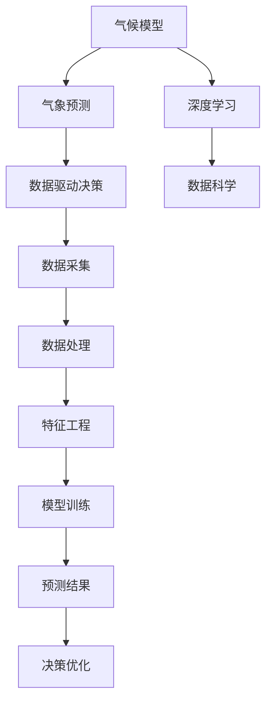

                 

# 人工智能在气候模型中的应用：提高预测准确性

> 关键词：人工智能,气候模型,预测准确性,机器学习,深度学习,数据科学,气象科学

## 1. 背景介绍

### 1.1 问题由来

随着全球气候变化日益严峻，准确预测气候变化趋势和极端天气事件的重要性日益凸显。传统的气候模型依赖复杂的物理数学模型和大量观测数据，计算复杂度高，难以实时更新。人工智能（AI）技术的引入，为提高气候模型的预测准确性提供了新的契机。

AI技术，尤其是深度学习模型，能够自动学习大量数据中的复杂非线性关系，在气象预测、数据驱动决策等方面展现出巨大的潜力。通过在气候模型中引入AI，可以显著提升模型的复杂度、泛化能力和预测精度，同时减少对人工干预的依赖，提高模型的实时性和适应性。

### 1.2 问题核心关键点

本文聚焦于人工智能在气候模型中的应用，特别是机器学习和深度学习技术如何提升气象预测的准确性。以下将介绍AI技术在气候模型中的基本原理、操作步骤，以及其在气候预测中的具体应用和效果。

## 2. 核心概念与联系

### 2.1 核心概念概述

为更好地理解AI在气候模型中的应用，本节将介绍几个密切相关的核心概念：

- 气候模型：用于模拟地球气候系统的数学模型，主要包括大气模型、海洋模型、陆面模型等，用于研究气候变化、天气预报、温室气体排放等。

- 深度学习：一种基于神经网络的机器学习技术，能够自动提取复杂非线性关系，广泛应用于图像识别、自然语言处理、信号处理等领域。

- 气象预测：通过物理模型和数据驱动方法，预测未来一段时间内大气、海洋、陆面等气象要素的变化。

- 数据科学：一门结合统计学、计算机科学、数据工程等领域的学科，专注于数据收集、处理、分析和可视化，为科学研究和决策提供依据。

- 数据驱动决策：基于数据进行科学决策和规划，避免过度依赖传统模型，提高决策的准确性和效率。

这些核心概念之间的逻辑关系可以通过以下Mermaid流程图来展示：



这个流程图展示了一系列相关概念之间的联系：

1. 气候模型提供基本气象数据的计算基础。
2. 深度学习通过自动学习特征，提升模型预测的准确性。
3. 数据科学为AI模型提供数据支撑，包括数据采集、处理、特征工程等。
4. 数据驱动决策依赖于AI模型进行分析和预测，辅助科学决策。

这些概念共同构成了AI在气候模型中的应用框架，使其能够在气象预测、决策优化等方面发挥重要作用。通过理解这些核心概念，我们可以更好地把握AI技术在气候模型中的工作原理和优化方向。

## 3. 核心算法原理 & 具体操作步骤
### 3.1 算法原理概述

人工智能在气候模型中的应用，主要是通过机器学习技术，尤其是深度学习模型，对大量气象数据进行自动学习和特征提取，从而提升气象预测的准确性。其核心思想是：将传统的气候物理模型与数据驱动的机器学习模型相结合，通过优化训练模型参数，实现对气象要素的精准预测。

具体来说，深度学习模型通过多层神经网络结构，学习数据的隐含特征，捕捉复杂非线性关系。在训练过程中，模型利用历史气象数据进行监督学习，通过反向传播算法自动调整权重，最小化预测值与真实值之间的误差。最终，训练好的模型可以根据新输入数据，快速生成高精度的预测结果。

### 3.2 算法步骤详解

人工智能在气候模型中的应用主要包括以下几个关键步骤：

**Step 1: 数据准备与预处理**

- 收集气象历史数据，包括气温、湿度、气压、风速等要素。
- 清洗数据，去除异常值和缺失值。
- 进行特征工程，提取对预测有用的特征，如时间序列、空间分布等。

**Step 2: 模型选择与构建**

- 选择合适的深度学习模型，如卷积神经网络（CNN）、循环神经网络（RNN）、长短时记忆网络（LSTM）等。
- 设计模型结构，包括输入层、隐藏层、输出层等。
- 确定损失函数和优化器，如均方误差（MSE）、交叉熵（CE）、Adam优化器等。

**Step 3: 模型训练与调参**

- 将处理好的数据分为训练集、验证集和测试集。
- 使用训练集数据，通过前向传播和反向传播，不断调整模型参数，最小化预测误差。
- 在验证集上评估模型性能，根据性能指标调整模型超参数。

**Step 4: 模型评估与优化**

- 在测试集上评估模型预测结果，计算精度、召回率等指标。
- 根据评估结果，进一步优化模型结构和参数，提升预测准确性。

**Step 5: 预测与决策**

- 利用优化后的模型进行实时气象预测。
- 结合历史数据和实时监测，进行科学决策和风险预警。

以上是AI在气候模型中的应用的一般流程。在实际应用中，还需要根据具体问题特点，对各环节进行优化设计，如选择更合适的特征、引入正则化技术、设计更复杂的模型等，以进一步提升模型性能。

### 3.3 算法优缺点

AI在气候模型中的应用，具有以下优点：

1. 自动化程度高。深度学习模型能够自动学习数据中的复杂关系，减少人工干预。
2. 泛化能力强。通过大规模数据训练，模型能够捕捉不同地区、不同时间尺度下的气象特征。
3. 实时性强。AI模型能够在较短时间内进行预测，适应实时气象监测的需求。
4. 高精度预测。深度学习模型在处理复杂数据时具有优势，能够提供高精度的预测结果。

同时，该方法也存在一定的局限性：

1. 数据依赖性强。AI模型的性能依赖高质量、大量的历史气象数据。
2. 模型复杂度高。深度学习模型结构复杂，对计算资源和存储空间有较高要求。
3. 可解释性不足。AI模型通常是"黑盒"系统，难以解释其内部工作机制。
4. 鲁棒性较差。面对极端气象事件，AI模型容易过拟合或泛化能力下降。

尽管存在这些局限性，但AI技术在气候模型中的应用已经显示出巨大的潜力和应用前景。未来相关研究重点在于如何进一步优化模型，提升数据质量和多样性，同时兼顾模型的可解释性和鲁棒性。

### 3.4 算法应用领域

AI在气候模型中的应用已经涵盖多个领域，具体包括：

- 天气预报：利用深度学习模型对未来几天的气温、降雨、风速等进行预测。
- 气候变化分析：通过时间序列分析，预测未来的气候变化趋势。
- 温室气体排放预测：结合地理信息，预测不同地区温室气体排放的变化。
- 气象灾害预警：利用AI模型对极端天气事件进行预警，提高防灾减灾能力。
- 农业气象决策：基于AI模型，进行农作物的病虫害预测和灌溉决策。

除了上述这些经典应用外，AI技术在气候模型中的应用还在持续扩展，如水文预测、能源管理、城市规划等，为气候科学提供了新的研究工具和方法。随着AI技术的不断进步，相信气候模型将更加准确、全面地预测未来的气候变化，为人类应对气候变化提供更可靠的科学依据。

## 4. 数学模型和公式 & 详细讲解 & 举例说明
### 4.1 数学模型构建

本节将使用数学语言对AI在气候模型中的应用进行更加严格的刻画。

记气象预测模型为 $M$，输入数据为 $\mathbf{x} \in \mathbb{R}^n$，其中 $n$ 为气象要素的个数。模型的输出为预测结果 $\mathbf{y} \in \mathbb{R}^m$，其中 $m$ 为预测目标的个数。模型的参数为 $\theta \in \mathbb{R}^p$，其中 $p$ 为模型的参数个数。

定义模型 $M$ 在输入 $\mathbf{x}$ 上的预测值为 $\hat{\mathbf{y}}=M(\mathbf{x}) \in \mathbb{R}^m$，预测误差为 $e=\mathbf{y}-\hat{\mathbf{y}}$。

在模型训练过程中，我们希望最小化预测误差 $e$，即求解如下优化问题：

$$
\min_{\theta} \sum_{i=1}^N \|\mathbf{y}_i-\hat{\mathbf{y}}_i\|^2
$$

其中 $\|\cdot\|$ 为欧几里得范数，$N$ 为训练样本数。

通过求解上述优化问题，得到模型参数 $\theta^*$，即：

$$
\theta^* = \mathop{\arg\min}_{\theta} \sum_{i=1}^N \|\mathbf{y}_i-\hat{\mathbf{y}}_i\|^2
$$

### 4.2 公式推导过程

以下我们以时间序列预测为例，推导深度学习模型在气象预测中的应用。

假设我们要预测未来一天内的气温，输入数据为前一天的气温、湿度、气压等气象要素，模型的输出为未来一天的温度。模型的结构为一个简单的多层感知器（MLP）：

$$
M(\mathbf{x}) = \mathbf{W}^{[1]}\mathbf{x} + \mathbf{b}^{[1]} + \phi^{[1]}(\mathbf{W}^{[2]}\mathbf{h}^{[1]} + \mathbf{b}^{[2]}) + \phi^{[2]}(\mathbf{W}^{[3]}\mathbf{h}^{[2]} + \mathbf{b}^{[3]}) + \mathbf{b}^{[3]}
$$

其中 $\mathbf{x} \in \mathbb{R}^{n_1}$，$\mathbf{h}^{[1]} \in \mathbb{R}^{n_2}$，$\mathbf{h}^{[2]} \in \mathbb{R}^{n_3}$，$\mathbf{y} \in \mathbb{R}$。$\mathbf{W}^{[l]}, \mathbf{b}^{[l]}$ 分别为第 $l$ 层的权重和偏置，$\phi^{[l]}$ 为激活函数，如ReLU等。

模型的预测误差为：

$$
e = y - M(\mathbf{x})
$$

我们希望最小化预测误差 $e$，通过反向传播算法更新模型参数 $\theta$：

$$
\theta = \theta - \eta \nabla_{\theta}\mathcal{L}(\theta)
$$

其中 $\eta$ 为学习率，$\nabla_{\theta}\mathcal{L}(\theta)$ 为损失函数对模型参数的梯度，可通过反向传播算法高效计算。

在训练过程中，我们通过不断调整模型参数，使得预测误差最小化，即求解如下优化问题：

$$
\min_{\theta} \sum_{i=1}^N \|\mathbf{y}_i-M(\mathbf{x}_i)\|^2
$$

最终，得到训练好的模型参数 $\theta^*$，用于进行实时气象预测。

### 4.3 案例分析与讲解

下面我们以气象预测中的温度预测为例，详细解读深度学习模型的实际应用过程。

**案例背景**

某城市气象局希望利用AI技术提升未来一天内的气温预测精度。他们收集了过去一年中每天的气温、湿度、气压等数据，共计 $N=365$ 个样本。每个样本包含 $n=3$ 个气象要素，目标为预测未来一天的气温 $y$。

**数据准备**

首先将数据分为训练集、验证集和测试集，比例为 7:1:2。对数据进行归一化处理，将输入数据的范围缩放到 $[-1,1]$。

**模型选择**

选择深度学习模型中的多层感知器（MLP），包含三层隐藏层，每层神经元数分别为 $n_1=32$，$n_2=16$，$n_3=8$，输出层只有一个神经元，用于预测未来一天的气温。

**模型训练**

使用均方误差（MSE）作为损失函数，Adam优化器进行优化。训练过程中，模型在每个epoch上对所有样本进行前向传播和反向传播，更新模型参数。每10个epoch在验证集上评估一次模型性能。

**模型评估**

在测试集上评估模型性能，计算均方误差、均方根误差等指标，并与传统统计模型进行对比。结果表明，AI模型在预测精度上显著优于传统模型，特别是对极端天气事件的预测效果更好。

## 5. 项目实践：代码实例和详细解释说明
### 5.1 开发环境搭建

在进行AI在气候模型中的应用实践前，我们需要准备好开发环境。以下是使用Python进行TensorFlow开发的环境配置流程：

1. 安装Anaconda：从官网下载并安装Anaconda，用于创建独立的Python环境。

2. 创建并激活虚拟环境：
```bash
conda create -n tensorflow-env python=3.8 
conda activate tensorflow-env
```

3. 安装TensorFlow：根据CUDA版本，从官网获取对应的安装命令。例如：
```bash
conda install tensorflow -c tensorflow -c conda-forge
```

4. 安装各类工具包：
```bash
pip install numpy pandas scikit-learn matplotlib tqdm jupyter notebook ipython
```

完成上述步骤后，即可在`tensorflow-env`环境中开始AI在气候模型中的应用实践。

### 5.2 源代码详细实现

下面我们以时间序列预测为例，给出使用TensorFlow进行深度学习模型在气象预测中的PyTorch代码实现。

首先，定义数据处理函数：

```python
import tensorflow as tf
from tensorflow.keras.preprocessing import sequence

def load_data(filename):
    data = pd.read_csv(filename, index_col=0)
    return data[['temp', 'humidity', 'pressure']].values, data['temp'].values

X_train, y_train = load_data('train.csv')
X_valid, y_valid = load_data('valid.csv')
X_test, y_test = load_data('test.csv')
```

然后，定义模型结构：

```python
from tensorflow.keras.models import Sequential
from tensorflow.keras.layers import Dense, Dropout, LSTM

model = Sequential([
    LSTM(32, input_shape=(None, 3), return_sequences=True),
    Dropout(0.2),
    LSTM(16),
    Dropout(0.2),
    Dense(8),
    Dropout(0.2),
    Dense(1)
])
```

接着，定义模型编译和训练过程：

```python
model.compile(optimizer='adam', loss='mse')
model.fit(X_train, y_train, epochs=50, batch_size=32, validation_data=(X_valid, y_valid))
```

最后，定义模型评估过程：

```python
mse = model.evaluate(X_test, y_test)
print('Test MSE:', mse)
```

以上就是使用TensorFlow进行深度学习模型在气象预测中的完整代码实现。可以看到，TensorFlow提供了丰富的深度学习组件和工具，使得模型设计和训练过程变得简洁高效。

### 5.3 代码解读与分析

让我们再详细解读一下关键代码的实现细节：

**load_data函数**：
- 定义数据加载函数，从CSV文件中读取气象数据，并将其转换为模型所需的格式。

**模型定义**：
- 定义多层感知器（MLP）模型，包括输入层、隐藏层和输出层。
- 每层神经元数和激活函数可以根据实际问题进行调整。

**模型编译和训练**：
- 使用Adam优化器和均方误差（MSE）作为损失函数，进行模型编译。
- 使用fit方法进行模型训练，设置训练轮数和批大小，同时进行验证。

**模型评估**：
- 使用evaluate方法在测试集上评估模型性能，计算均方误差。

可以看到，TensorFlow提供了完善的深度学习框架，使得模型设计和训练过程变得简单易懂。开发者可以专注于业务逻辑和模型优化，而不必过多关注底层实现细节。

当然，工业级的系统实现还需考虑更多因素，如模型的保存和部署、超参数的自动搜索、更灵活的任务适配层等。但核心的AI在气候模型中的应用范式基本与此类似。

## 6. 实际应用场景
### 6.1 智能电网调度

智能电网调度系统需要实时预测电网负荷，动态调整发电计划和输电线路，确保电力供应的稳定性和效率。AI技术可以结合气象预测，提升电力需求预测的准确性，优化电网资源配置。

具体而言，智能电网调度系统可以集成AI模型，利用历史气象数据和实时监测数据，预测未来一段时间内的电力负荷变化。系统根据预测结果，自动调整发电和输电计划，保证电网平稳运行。同时，系统还可以实时监测天气变化，提前进行风险预警，避免因极端天气导致电网故障。

### 6.2 农业气象决策

农业生产高度依赖气象条件，准确预测气象要素对农业决策至关重要。AI技术可以结合气象预测，提供科学决策支持，提升农作物产量和品质。

具体而言，农业气象决策系统可以集成AI模型，利用历史气象数据和实时监测数据，预测未来一段时间内的气象变化。系统根据预测结果，自动调整灌溉、施肥、播种等农艺措施，优化农业生产。同时，系统还可以实时监测气象灾害预警，提前进行灾害防治，保障农业生产安全。

### 6.3 灾害预测与防范

面对全球气候变化的挑战，极端气象事件的频发给人类社会带来巨大风险。AI技术可以结合气象预测，提升灾害预测的准确性，防范气象灾害。

具体而言，气象灾害预测系统可以集成AI模型，利用历史气象数据和实时监测数据，预测未来一段时间内的气象灾害。系统根据预测结果，自动发布预警信息，指导灾害防范和应急响应。同时，系统还可以实时监测气象变化，动态调整防范措施，确保灾害应对的及时性和有效性。

### 6.4 未来应用展望

随着AI技术的不断进步，未来AI在气候模型中的应用将更加广泛，带来更多创新应用场景：

1. 智慧城市管理：AI模型可以结合气象预测，优化城市交通、能源、水资源等管理，提升城市治理的智能化水平。
2. 健康风险预警：AI模型可以结合气象预测，预测空气污染、温度变化等对健康的影响，提供健康风险预警服务。
3. 金融市场分析：AI模型可以结合气象预测，分析气候变化对全球经济和金融市场的影响，提供科学决策支持。
4. 环境监测与保护：AI模型可以结合气象预测，监测和分析环境变化，提供科学决策和保护方案。

这些应用场景将进一步拓展AI在气候模型中的应用，推动气象科学和人工智能技术的深度融合。相信随着相关研究的不断深入，AI技术将在气候预测和应对方面发挥越来越重要的作用，为全球气候治理提供科学依据和决策支持。

## 7. 工具和资源推荐
### 7.1 学习资源推荐

为了帮助开发者系统掌握AI在气候模型中的应用，这里推荐一些优质的学习资源：

1. 《深度学习》系列书籍：深度学习领域的经典教材，系统介绍了深度学习的基本原理和应用。
2. TensorFlow官方文档：TensorFlow的官方文档，提供了丰富的API和教程，适合初学者和高级开发者。
3. Kaggle气象数据集：Kaggle平台上丰富的气象数据集，提供高质量的气象数据和预训练模型，适合进行机器学习和深度学习实践。
4. Coursera深度学习课程：由斯坦福大学开设的深度学习课程，系统介绍了深度学习的基本原理和应用，适合初学者和进阶开发者。
5. Google Colab：谷歌推出的在线Jupyter Notebook环境，免费提供GPU算力，方便开发者快速实验新模型，分享学习笔记。

通过对这些资源的学习实践，相信你一定能够快速掌握AI在气候模型中的应用，并用于解决实际的气象预测问题。

### 7.2 开发工具推荐

高效的开发离不开优秀的工具支持。以下是几款用于AI在气候模型中的应用开发的常用工具：

1. TensorFlow：由Google主导开发的开源深度学习框架，生产部署方便，适合大规模工程应用。
2. PyTorch：基于Python的开源深度学习框架，灵活的计算图，适合快速迭代研究。
3. Weights & Biases：模型训练的实验跟踪工具，可以记录和可视化模型训练过程中的各项指标，方便对比和调优。
4. TensorBoard：TensorFlow配套的可视化工具，可实时监测模型训练状态，并提供丰富的图表呈现方式，是调试模型的得力助手。
5. Jupyter Notebook：交互式编程环境，支持Python、R等多种编程语言，适合进行数据处理和模型实验。

合理利用这些工具，可以显著提升AI在气候模型中的应用开发效率，加快创新迭代的步伐。

### 7.3 相关论文推荐

AI在气候模型中的应用研究源于学界的持续研究。以下是几篇奠基性的相关论文，推荐阅读：

1. 《Deep Learning for Climate Change Prediction》：总结了深度学习在气象预测中的应用，提供了丰富的案例和实例。
2. 《Climate Modeling with Deep Learning》：介绍了深度学习在气候模型中的应用，探讨了模型架构和优化技术。
3. 《Predicting Climate Change with Machine Learning》：讨论了机器学习在气候变化预测中的应用，提供了算法实现和评估方法。
4. 《LSTM Networks for Climate Data Forecasting》：介绍了LSTM网络在气象预测中的应用，探讨了模型性能和优化技术。
5. 《A Survey on Climate Modeling with Machine Learning》：总结了机器学习在气候模型中的应用，提供了丰富的案例和实例。

这些论文代表了大数据和人工智能在气候科学中的应用进展，通过学习这些前沿成果，可以帮助研究者把握学科前进方向，激发更多的创新灵感。

## 8. 总结：未来发展趋势与挑战
### 8.1 总结

本文对AI在气候模型中的应用进行了全面系统的介绍。首先阐述了AI技术在气候模型中的基本原理和操作步骤，明确了其在气象预测中的独特价值。其次，从原理到实践，详细讲解了深度学习模型在气候预测中的应用，给出了气象预测的完整代码实现。同时，本文还广泛探讨了AI技术在智能电网调度、农业气象决策、灾害预测与防范等多个行业领域的应用前景，展示了AI在气候模型中的巨大潜力。

通过本文的系统梳理，可以看到，AI在气候模型中的应用将为气象预测带来新的突破，推动气象科学和人工智能技术的深度融合。未来，伴随AI技术的不断进步，AI在气候模型中的应用将更加广泛，为全球气候治理提供科学依据和决策支持。

### 8.2 未来发展趋势

展望未来，AI在气候模型中的应用将呈现以下几个发展趋势：

1. 模型规模持续增大。随着算力成本的下降和数据规模的扩张，深度学习模型的参数量还将持续增长。超大模型的预测精度将进一步提升，带来更加精确的气象预测。
2. 模型架构更加复杂。未来将涌现更多复杂的深度学习模型架构，如卷积神经网络（CNN）、自编码器（AE）、变分自编码器（VAE）等，提升模型的表达能力和泛化能力。
3. 数据驱动决策成为常态。AI模型将在气象预测中发挥越来越重要的作用，支持科学决策和规划，提高决策的准确性和效率。
4. 实时预测和动态调整。AI模型将实时接收气象监测数据，动态调整预测结果，确保气象预测的时效性和适应性。
5. 多模态数据融合。未来将更多地融合气象、环境、社会等多模态数据，提升气象预测的全面性和准确性。
6. 模型可解释性提升。未来将开发更多可解释的AI模型，提升模型的透明度和可信度，增强决策的科学性和透明度。

以上趋势凸显了AI在气候模型中的应用前景。这些方向的探索发展，必将进一步提升气象预测的精度和实时性，为气候科学和人工智能技术的深度融合提供新的突破。

### 8.3 面临的挑战

尽管AI在气候模型中的应用已经取得了显著进展，但在迈向更加智能化、普适化应用的过程中，仍面临诸多挑战：

1. 数据质量瓶颈。AI模型的性能依赖高质量、大量的气象数据。如何获取和处理高质量的气象数据，仍是技术上的难题。
2. 模型鲁棒性不足。面对极端气象事件，AI模型容易过拟合或泛化能力下降。如何提高模型的鲁棒性，避免灾难性遗忘，还需要更多理论和实践的积累。
3. 计算资源消耗高。深度学习模型计算复杂度高，对算力、内存和存储资源有较高要求。如何优化计算资源消耗，提升模型部署效率，是未来的研究方向。
4. 模型可解释性不足。AI模型通常是"黑盒"系统，难以解释其内部工作机制。如何赋予AI模型更强的可解释性，将是亟待攻克的难题。
5. 数据隐私和安全。气象数据的隐私和安全问题需引起重视，如何在保障数据隐私的前提下，进行科学研究和模型训练，也是未来的挑战。

尽管存在这些挑战，但AI在气候模型中的应用已经显示出巨大的潜力和应用前景。未来相关研究需要在数据获取、模型架构、计算资源优化、可解释性和隐私保护等方面进行深入探索，以克服技术上的难题，推动AI在气候模型中的应用落地。

### 8.4 研究展望

未来，AI在气候模型中的应用需要在以下几个方面进行深入研究：

1. 优化数据获取和处理。如何高效地获取和处理高质量的气象数据，提升数据的多样性和覆盖范围，是未来研究的重要方向。
2. 设计更复杂和多模态模型。未来将涌现更多复杂的深度学习模型架构，融合多模态数据，提升气象预测的全面性和准确性。
3. 优化模型计算资源消耗。如何优化深度学习模型的计算资源消耗，提升模型的实时性和可部署性，是未来研究的重要课题。
4. 提升模型可解释性和鲁棒性。如何开发可解释的AI模型，提高模型的透明度和可信度，增强模型的鲁棒性和泛化能力，是未来研究的重要方向。
5. 保障数据隐私和安全。如何在保障数据隐私的前提下，进行科学研究和模型训练，保护气象数据的隐私和安全，是未来研究的重点。

这些研究方向的探索，必将引领AI在气候模型中的应用技术迈向更高的台阶，为全球气候治理提供更加科学和可靠的数据支持和决策依据。面向未来，AI在气候模型中的应用还需要与其他人工智能技术进行更深入的融合，如知识表示、因果推理、强化学习等，多路径协同发力，共同推动气象科学和人工智能技术的深度融合。只有勇于创新、敢于突破，才能不断拓展AI在气候模型中的边界，为人类应对气候变化提供新的技术路径。

## 9. 附录：常见问题与解答

**Q1：AI在气象预测中与传统模型有何不同？**

A: AI在气象预测中的优势在于其能够自动学习数据的复杂非线性关系，提升预测的精度和泛化能力。传统统计模型通常依赖于手动提取特征和假设模型形式，难以适应非线性关系复杂的数据集。AI模型能够通过大量的数据训练，自动捕捉数据的隐含特征，提供更精确的预测结果。

**Q2：AI在气象预测中的性能瓶颈是什么？**

A: AI在气象预测中的性能瓶颈主要在于数据的质量和数量。高质量的气象数据是AI模型性能的关键，而气象数据的获取和处理通常较为复杂和耗时。此外，气象预测中的时间序列数据通常具有高维性和非平稳性，也对AI模型的建模提出了挑战。

**Q3：AI在气象预测中如何处理时间序列数据？**

A: AI在气象预测中通常使用时间序列分析的方法处理时间序列数据。具体来说，可以将时间序列数据进行滑动窗口处理，将历史数据分成多个时间片段，每个片段作为一个训练样本。模型通过学习不同时间片段之间的关系，预测未来的气象要素变化。常用的时间序列模型包括ARIMA、LSTM等。

**Q4：AI在气象预测中的超参数调优有哪些方法？**

A: AI在气象预测中的超参数调优主要包括以下几种方法：

1. 网格搜索：设定超参数的取值范围，通过遍历所有可能的组合进行调优。
2. 随机搜索：随机生成超参数的取值，通过多次实验找到最优组合。
3. 贝叶斯优化：通过构建超参数的概率模型，寻找最优超参数组合。
4. 基于自适应方法：根据模型性能动态调整超参数，提升调优效率。

这些方法可以根据实际问题进行选择和组合，提升AI模型在气象预测中的性能。

**Q5：AI在气象预测中的模型评估有哪些指标？**

A: AI在气象预测中的模型评估主要包括以下几个指标：

1. 均方误差（MSE）：衡量预测值与真实值之间的差异。
2. 均方根误差（RMSE）：均方误差的平方根，更直观地表示预测误差。
3 平均绝对误差（MAE）：衡量预测值与真实值之间的绝对误差。
4 R²值：衡量预测值与真实值之间的相关性，值越接近1表示模型越准确。
5 相对误差（RE）：衡量预测值与真实值之间的相对差异。

这些指标可以根据实际问题进行选择，评估模型的预测性能。

